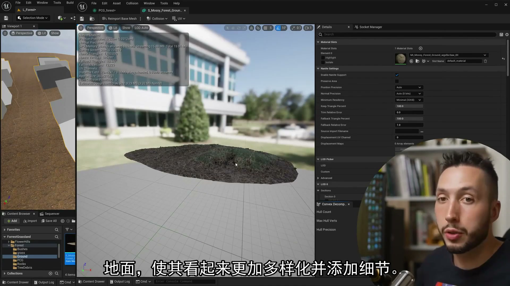
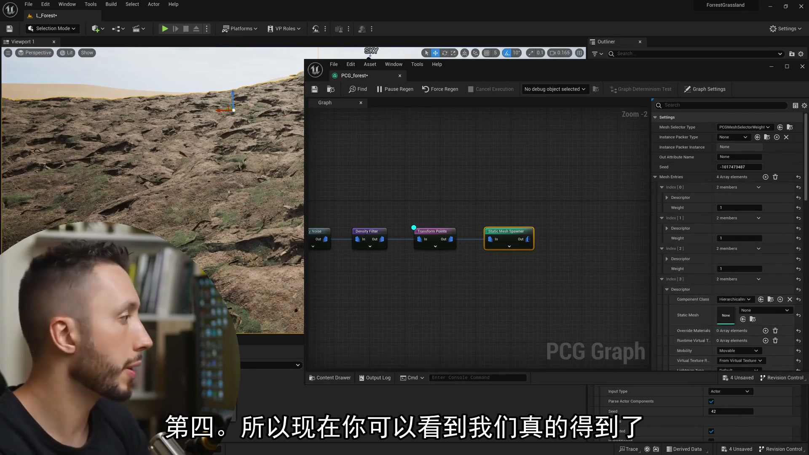
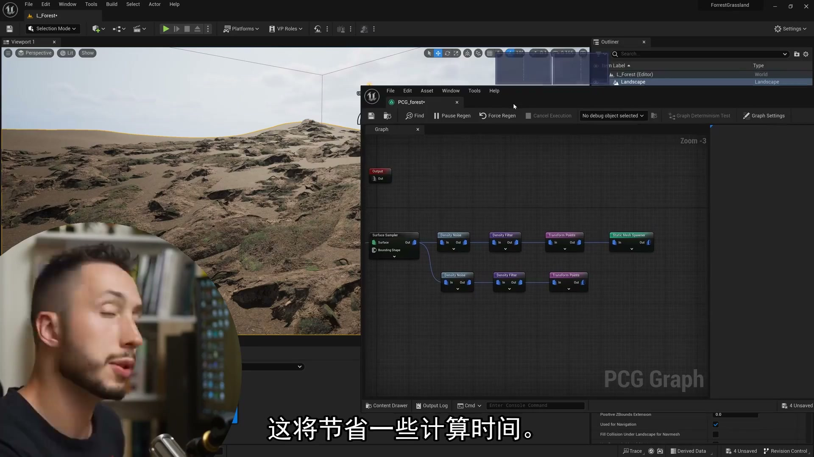
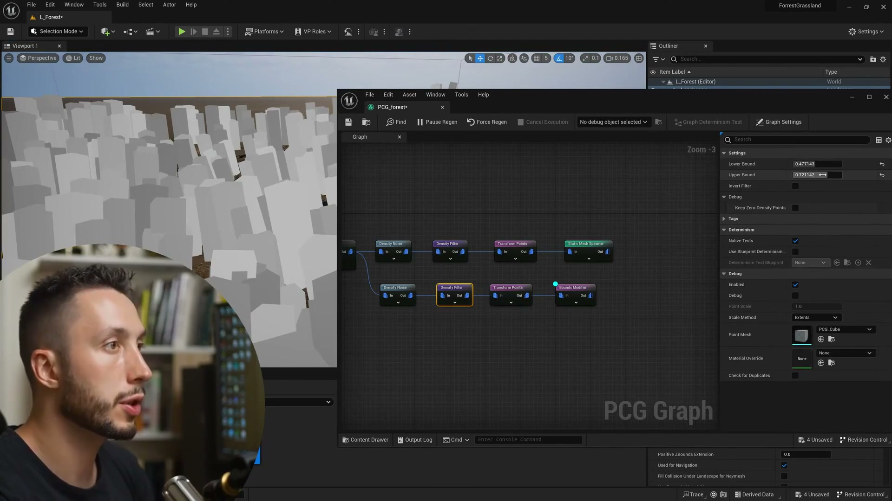
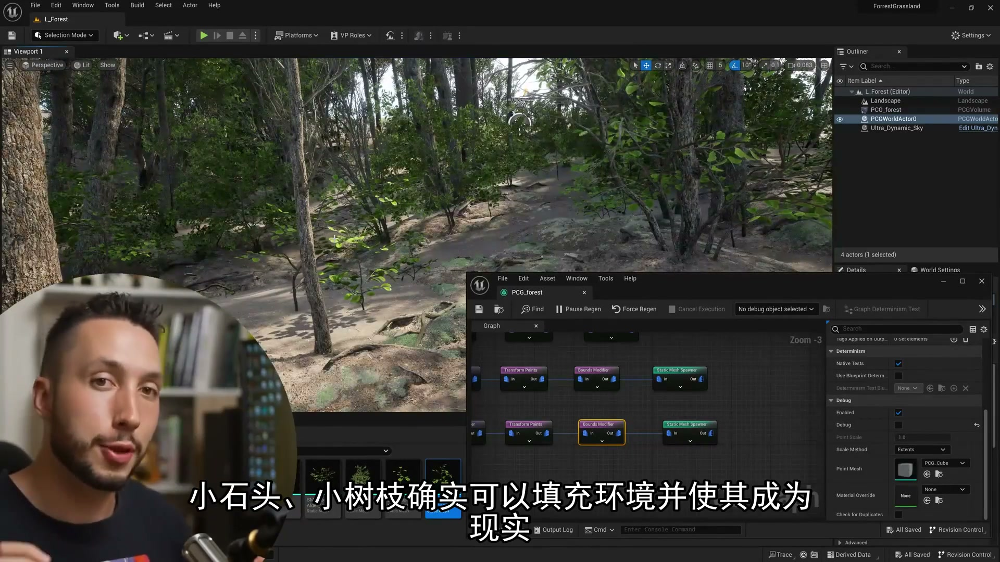

# 4.7分钟真实森林!程序内容生成PCG在虚幻引擎

## 知识目标

- 围绕“4.7分钟真实森林!程序内容生成PCG在虚幻引擎”整理 PCG 视频中的输入数据、图表规则、关键节点、参数风险和最终生成结果。
- 阅读时重点区分三层：输入来源（点、样条、表面、体积、Actor 或属性）、规则处理（采样、过滤、变换、分区、循环、HLSL 或子图）、输出方式（Static Mesh Spawner、Spawn Actor、Spline Mesh、Blueprint 或 Dynamic Mesh）。

## 可复现主流程

- 确认 PCG Graph/PCG Component 已绑定到正确 Actor，并先用 Debug/Inspect 查看中间点数据。
- 明确输入来源：Spline、Surface、Mesh、Volume、Actor、Data Asset/Data Table 或手工参数。
- 在图表中按顺序处理采样、属性写入、过滤、Transform、分区/循环和输出节点。
- 生成可见结果前，先核对 Point 的 Transform、Bounds、Density、Seed 和自定义 Attribute。
- 用 Static Mesh Spawner 输出大量网格实例；需要蓝图逻辑时改用 Spawn Actor 或 Blueprint 交互。

## 关键术语

- `PCG Graph`、`PCG Volume`、`Landscape`、`Surface Sampler`、`Density Noise`、`Density Filter`、`Static Mesh Spawner`、`Transform Points`、`Bounds Modifier`、`Quixel Bridge`、`PCG`、`图表`、`点`、`密度`、`边界`、`采样`、`过滤`、`生成`、`网格`、`材质`

## 分段知识

### 00:00:00-00:03:56 属性、过滤与数据分流

- 本段定位：属性、过滤与数据分流。
- 知识点：Landscape/Surface 输入负责提供地表采样点，复现时要核对采样范围、Layer/材质过滤、坡度或高度条件。
- 知识点：采样器决定点来源和分布规则；Volume、Surface、Spline 等输入要分别核对采样范围、密度和生成方向。
- 复现要点：先用 Debug/Inspect 核对点数量、Bounds、Density 和关键属性，再判断最终生成结果。
- 复现要点：属性命名要稳定，过滤、分区和分支节点应保留可检查的中间数据，避免后续规则难以追踪。
- 核对对象：`PCG`、`图表`、`点`、`属性`、`密度`、`采样`、`过滤`、`生成`、`网格`。

**关键画面：**

### 00:03:59-00:06:51 属性、过滤与数据分流

- 本段定位：属性、过滤与数据分流。
- 知识点：Landscape/Surface 输入负责提供地表采样点，复现时要核对采样范围、Layer/材质过滤、坡度或高度条件。
- 知识点：植被生成要按点密度、随机 Transform、网格清单和剔除规则逐项核对，避免道路、岩石或地形边缘出现穿插。
- 知识点：采样器决定点来源和分布规则；Volume、Surface、Spline 等输入要分别核对采样范围、密度和生成方向。
- 复现要点：先用 Debug/Inspect 核对点数量、Bounds、Density 和关键属性，再判断最终生成结果。
- 复现要点：属性命名要稳定，过滤、分区和分支节点应保留可检查的中间数据，避免后续规则难以追踪。
- 核对对象：`点`、`属性`、`密度`、`边界`、`采样`、`过滤`、`生成`、`网格`、`材质`。

**关键画面：**

### 00:06:53-00:10:31 属性、过滤与数据分流

- 本段定位：属性、过滤与数据分流。
- 知识点：植被生成要按点密度、随机 Transform、网格清单和剔除规则逐项核对，避免道路、岩石或地形边缘出现穿插。
- 知识点：将几何体碎片放入静态网格物体生成器中。
- 知识点：添加另一个静态网格物体生成器；在这里创建一个新的静态网格物体生成器。
- 复现要点：先用 Debug/Inspect 核对点数量、Bounds、Density 和关键属性，再判断最终生成结果。
- 复现要点：属性命名要稳定，过滤、分区和分支节点应保留可检查的中间数据，避免后续规则难以追踪。
- 核对对象：`点`、`属性`、`密度`、`边界`、`过滤`、`生成`、`网格`。

**关键画面：**

## 复现检查

- 每个图表先检查输入数据是否正确进入 PCG Graph，再看下游生成结果。
- Debug/Inspect 时重点看点数量、Bounds、Density、Transform、Seed 和自定义 Attribute。
- Static Mesh Spawner、Spawn Actor、Spline Mesh 和 Blueprint 输出节点不能混用语义；选择前先确定是否需要实例化性能或蓝图逻辑。
- 涉及样条、分区、运行时或 GPU 生成时，必须额外验证更新触发、缓存、世界分区和性能预算。
