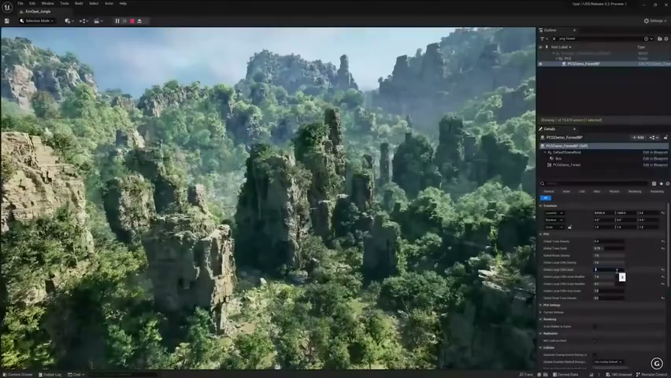
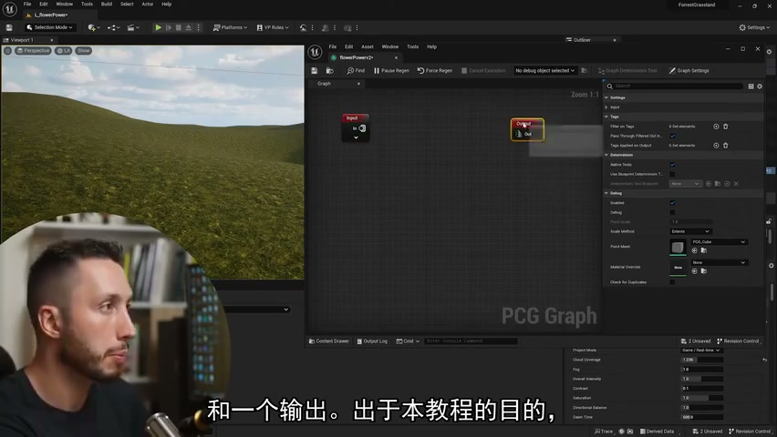
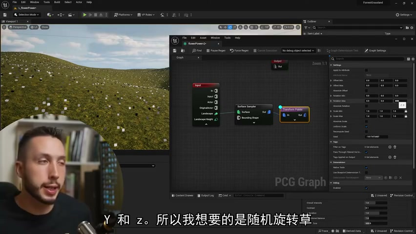
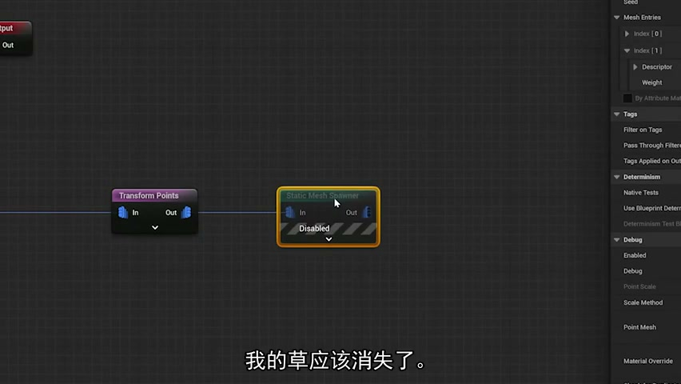
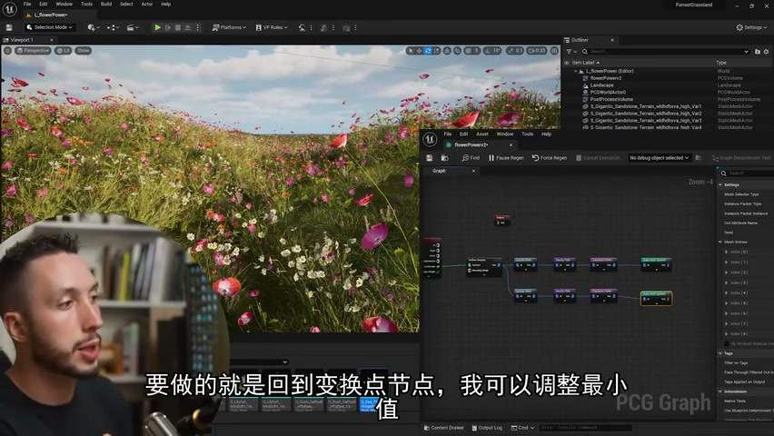
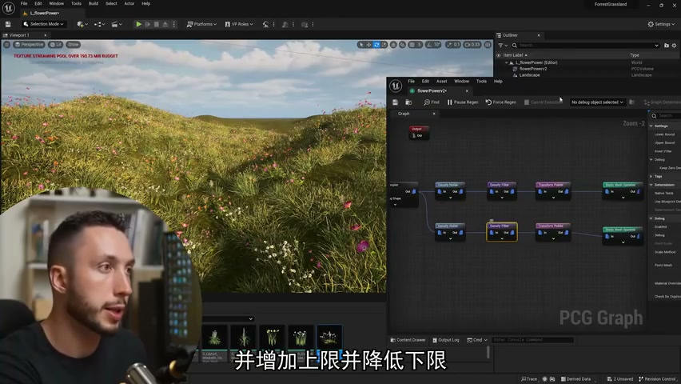

# 5.节省时间 程序内容生成框架（PCG）--逼真景观教程

## 知识目标

- 给初学者解释 PCG 为什么能节省自然场景搭建时间，并演示从 Landscape 到草、花、石头、树木的基础生成框架。
- 明确 PCG 适合处理大量重复填充资产，英雄资产和叙事性摆放仍可手工控制。

## 可复现主流程

1. 先准备 Landscape 和基础地表材质，确定场景的整体尺度。
2. 创建 PCG Volume / PCG Graph，从 Landscape 输入接 Surface Sampler。
3. 用 Density Noise / Density Filter 控制候选点的保留比例。
4. 用 Static Mesh Spawner 分别生成草、花、石块、树木等资产。
5. 通过 Transform Points 随机旋转和缩放，减少重复感。
6. 把程序化填充和手工摆放分开：PCG 负责大面积背景层，关键构图和叙事物件单独处理。

## 关键术语

- `PCG`
- `Landscape`
- `Surface Sampler`
- `Density Noise`
- `Density Filter`
- `Static Mesh Spawner`
- `Transform Points`
- `Grass`
- `Flowers`
- `Rocks`
- `Trees`

## 操作步骤与要点

### 为什么用 PCG

- 自然场景包含大量重复但不能完全规则的资产，PCG 的价值在于用规则生成可调的填充层。
- 它不是替代美术判断，而是把重复劳动变成参数化规则。

**内容要点：**

- 为什么用 PCG。

**关键截图：**

### 基础 Landscape 采样链路

- Landscape -> Surface Sampler -> Density Filter 是本集的基础骨架。
- Debug 点云可以帮助判断密度是否过高或覆盖区域是否错误。

**内容要点：**

- 基础 Landscape 采样链路。

**关键截图：**

### 资产分层与随机化

- 草、花、石头和树木需要分层生成，每层有独立密度和 Transform。
- 随机旋转/缩放能显著降低重复感，但过大范围会破坏美术统一性。

**内容要点：**

- 资产分层与随机化。

**关键截图：**

## 复现检查清单

- PCG Volume 的范围要和 Landscape 尺度匹配。
- 草、花、石头、树木按层调试，不要一次性接入所有 Spawner。
- 保留手工摆放空间，避免 PCG 把构图关键区域填满。
