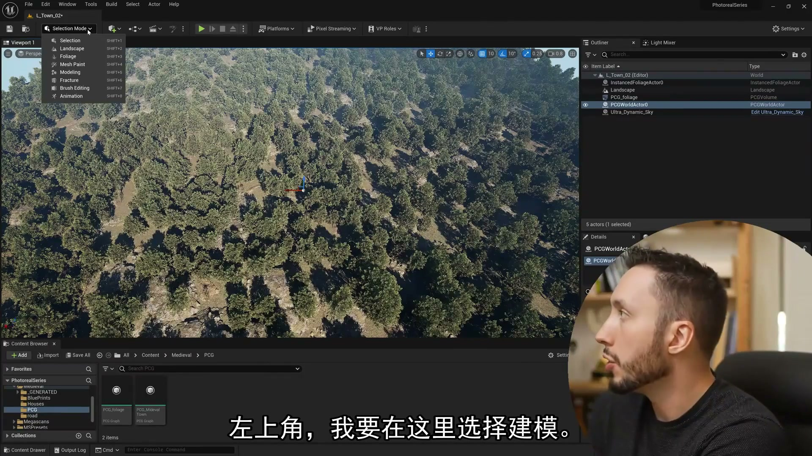
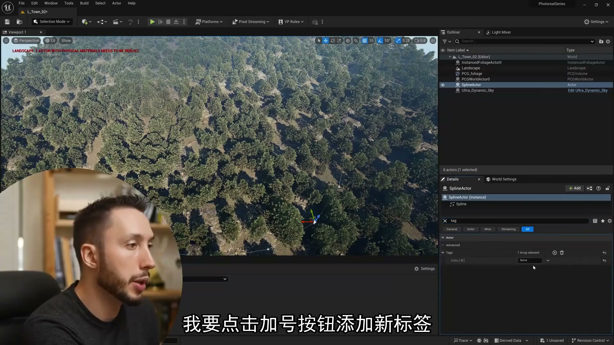
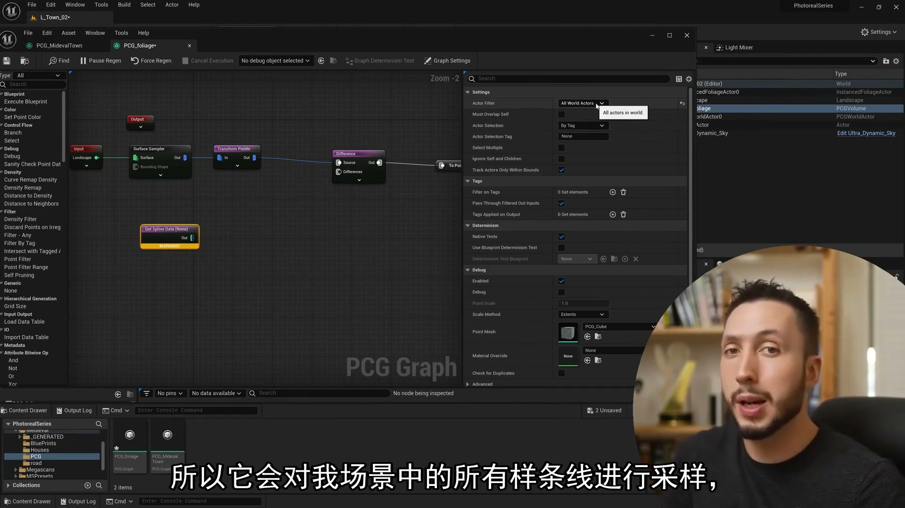
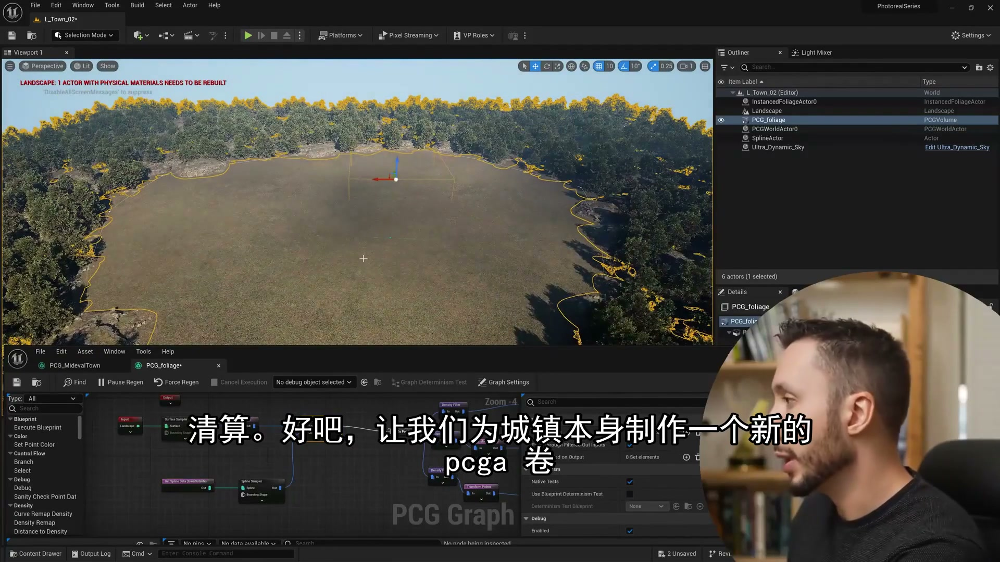
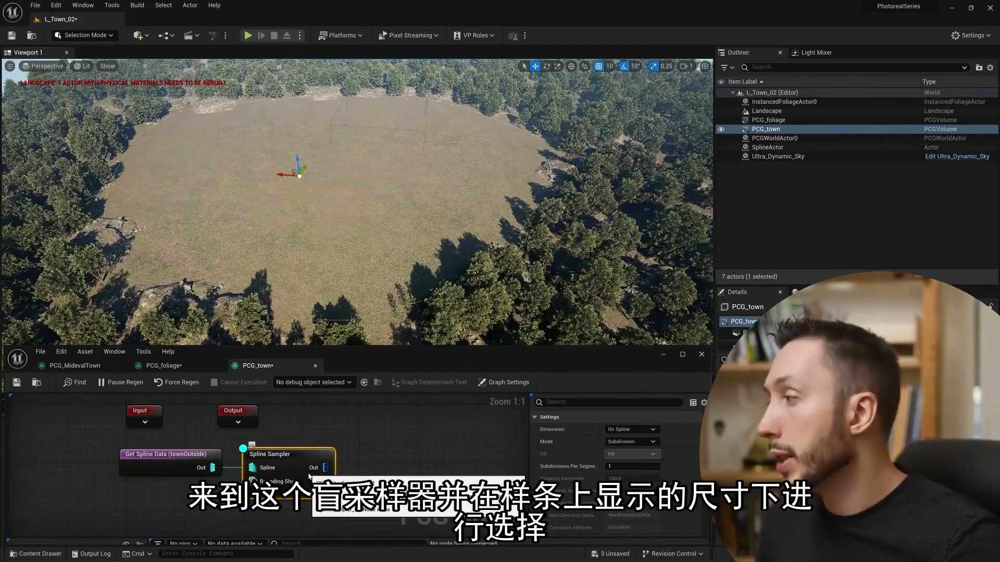
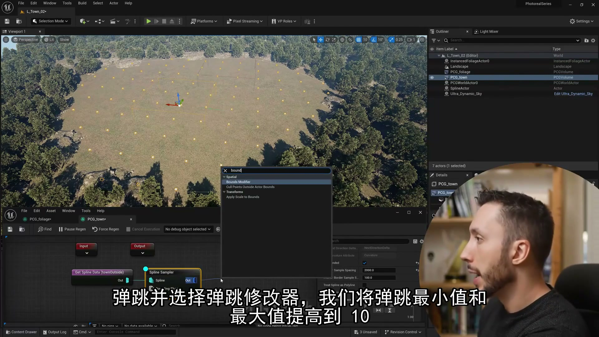
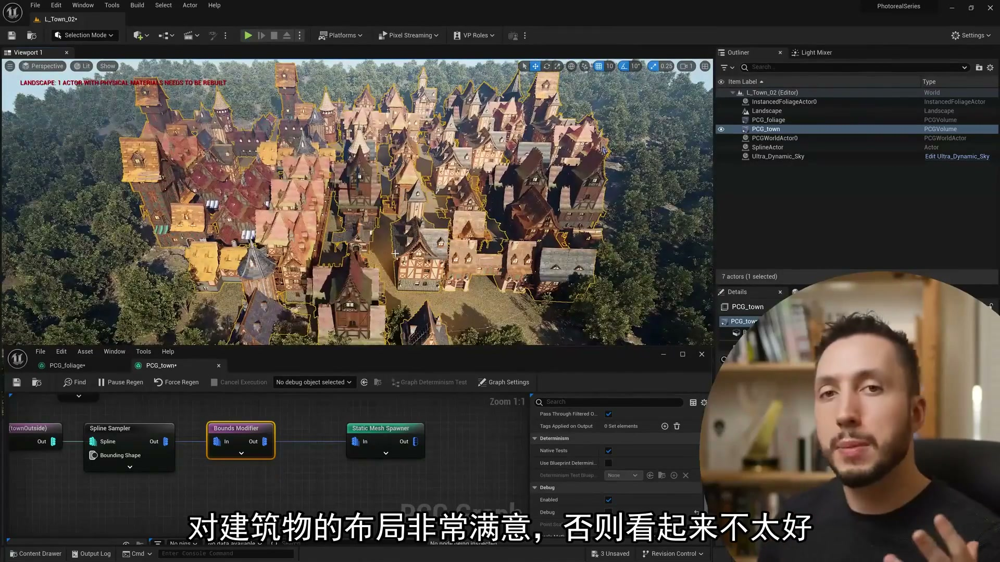
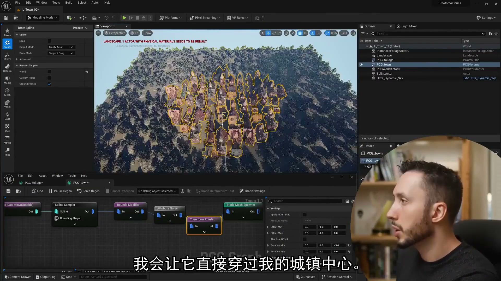
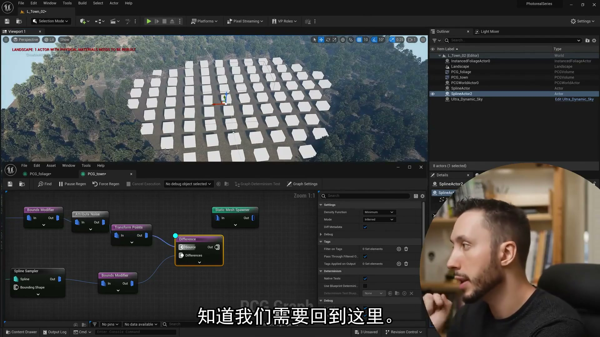

# 6.使用 PCG 样条自动创建整个城市！虚幻引擎中的程序内容生成

## 知识目标

- 围绕“6.使用 PCG 样条自动创建整个城市！虚幻引擎中的程序内容生成”整理 PCG 视频中的输入数据、图表规则、关键节点、参数风险和最终生成结果。
- 阅读时重点区分三层：输入来源（点、样条、表面、体积、Actor 或属性）、规则处理（采样、过滤、变换、分区、循环、HLSL 或子图）、输出方式（Static Mesh Spawner、Spawn Actor、Spline Mesh、Blueprint 或 Dynamic Mesh）。

## 可复现主流程

- 确认 PCG Graph/PCG Component 已绑定到正确 Actor，并先用 Debug/Inspect 查看中间点数据。
- 明确输入来源：Spline、Surface、Mesh、Volume、Actor、Data Asset/Data Table 或手工参数。
- 在图表中按顺序处理采样、属性写入、过滤、Transform、分区/循环和输出节点。
- 生成可见结果前，先核对 Point 的 Transform、Bounds、Density、Seed 和自定义 Attribute。
- 用 Static Mesh Spawner 输出大量网格实例；需要蓝图逻辑时改用 Spawn Actor 或 Blueprint 交互。

## 关键术语

- `Modeling Mode`、`Draw Spline`、`Closed Spline`、`Spline Sampler`、`Interior Sampling`、`Difference`、`Subtract`、`Bounds Modifier`、`Static Mesh Spawner`、`Road Spline`、`Transform Points`、`PCG`、`图表`、`组件`、`点`、`属性`、`密度`、`边界`、`样条`、`采样`、`过滤`、`循环`、`生成`、`蓝图`

## 分段知识

### 00:00:00-00:03:02 Spline 采样与路径生成

- 本段定位：Spline 采样与路径生成。
- 知识点：植被生成要按点密度、随机 Transform、网格清单和剔除规则逐项核对，避免道路、岩石或地形边缘出现穿插。
- 知识点：道路或街区边界由样条/Spline Mesh 驱动，复现时要核对样条点、切线、宽度和交叉口连接。
- 知识点：只需几分钟,即可使用样条和程序内容生成框架。
- 知识点：承证,如何使用样条道路穿过该城镇,然后如何生成一条道路。
- 复现要点：先用 Debug/Inspect 核对点数量、Bounds、Density 和关键属性，再判断最终生成结果。
- 复现要点：Spline 流程要单独核对采样间距、切线、端点、交叉点和生成网格的对齐方式。
- 核对对象：`PCG`、`Spline`、`点`、`样条`、`采样`、`循环`、`生成`、`蓝图`。

**关键画面：**

### 00:03:05-00:07:57 Spline 采样与路径生成

- 本段定位：Spline 采样与路径生成。
- 知识点：Landscape/Surface 输入负责提供地表采样点，复现时要核对采样范围、Layer/材质过滤、坡度或高度条件。
- 知识点：Niagara 或组件输出应挂在筛选后的 PCG 点上，先核对点位置、随机偏移和实例数量，再接入 Niagara Component。
- 知识点：植被生成要按点密度、随机 Transform、网格清单和剔除规则逐项核对，避免道路、岩石或地形边缘出现穿插。
- 知识点：Get Actor Data 可按 Actor 标签从关卡收集体积或蓝图实例，作为 PCG Graph 的外部输入。
- 知识点：从世界体积采样后，可在 PCG Graph 中把体积转换为点集，用于控制后续生成区域。
- 复现要点：先用 Debug/Inspect 核对点数量、Bounds、Density 和关键属性，再判断最终生成结果。
- 复现要点：属性命名要稳定，过滤、分区和分支节点应保留可检查的中间数据，避免后续规则难以追踪。
- 复现要点：Spline 流程要单独核对采样间距、切线、端点、交叉点和生成网格的对齐方式。
- 核对对象：`PCG`、`Spline`、`组件`、`点`、`密度`、`边界`、`样条`、`采样`、`过滤`、`生成`。

**关键画面：**

### 00:07:58-00:10:46 Spline 采样与路径生成

- 本段定位：Spline 采样与路径生成。
- 知识点：城市随机旋转算法应把角度限制为 90 度倍数，适合街区、道路或建筑块保持正交网格关系。
- 知识点：道路或街区边界由样条/Spline Mesh 驱动，复现时要核对样条点、切线、宽度和交叉口连接。
- 知识点：采样器决定点来源和分布规则；Volume、Surface、Spline 等输入要分别核对采样范围、密度和生成方向。
- 知识点：自定义房间墙节点记录 X/Y 边界点，随机选取非边界点作为墙段起点，并用随机整数加数组索引改善 PCG 随机性。
- 知识点：我想要修改的一件事是每个点的边界；这些点会在网格中生成。
- 知识点：输入样条,并获取这些样条采样器。
- 复现要点：先用 Debug/Inspect 核对点数量、Bounds、Density 和关键属性，再判断最终生成结果。
- 复现要点：属性命名要稳定，过滤、分区和分支节点应保留可检查的中间数据，避免后续规则难以追踪。
- 复现要点：Spline 流程要单独核对采样间距、切线、端点、交叉点和生成网格的对齐方式。
- 核对对象：`PCG`、`Spline`、`点`、`边界`、`样条`、`采样`、`过滤`、`生成`、`网格`。

**关键画面：**

### 00:10:49-00:14:26 Spline 采样与路径生成

- 本段定位：Spline 采样与路径生成。
- 知识点：城市随机旋转算法应把角度限制为 90 度倍数，适合街区、道路或建筑块保持正交网格关系。
- 知识点：道路或街区边界由样条/Spline Mesh 驱动，复现时要核对样条点、切线、宽度和交叉口连接。
- 知识点：PCG 点默认包含 Position、Rotation、Scale、Bounds、Density、Seed 等属性，自定义属性不带 `$` 前缀，Inspect 时要分清来源。
- 知识点：自定义房间墙节点记录 X/Y 边界点，随机选取非边界点作为墙段起点，并用随机整数加数组索引改善 PCG 随机性。
- 知识点：输入静态网格物体生成器。
- 复现要点：先用 Debug/Inspect 核对点数量、Bounds、Density 和关键属性，再判断最终生成结果。
- 复现要点：属性命名要稳定，过滤、分区和分支节点应保留可检查的中间数据，避免后续规则难以追踪。
- 复现要点：Spline 流程要单独核对采样间距、切线、端点、交叉点和生成网格的对齐方式。
- 核对对象：`Spline`、`点`、`属性`、`样条`、`采样`、`生成`、`网格`。

**关键画面：**

### 00:14:28-00:19:17 Spline 采样与路径生成

- 本段定位：Spline 采样与路径生成。
- 知识点：城市随机旋转算法应把角度限制为 90 度倍数，适合街区、道路或建筑块保持正交网格关系。
- 知识点：道路或街区边界由样条/Spline Mesh 驱动，复现时要核对样条点、切线、宽度和交叉口连接。
- 知识点：建筑类型可用密度、比例或属性权重控制混合生成，检查时要看局部街区中不同楼型的分布是否符合目标比例。
- 知识点：自定义房间墙节点记录 X/Y 边界点，随机选取非边界点作为墙段起点，并用随机整数加数组索引改善 PCG 随机性。
- 复现要点：先用 Debug/Inspect 核对点数量、Bounds、Density 和关键属性，再判断最终生成结果。
- 复现要点：Spline 流程要单独核对采样间距、切线、端点、交叉点和生成网格的对齐方式。
- 核对对象：`Spline`、`图表`、`点`、`密度`、`边界`、`样条`、`采样`、`生成`、`网格`。

**关键画面：**

### 00:19:17-00:19:35 Spline 采样与路径生成

- 本段定位：Spline 采样与路径生成。
- 知识点：样条流程需要核对采样间距、端点、切线、Transform 和下游网格对齐结果。
- 核对对象：`PCG`、`生成`。

**关键画面：**

## 复现检查

- 每个图表先检查输入数据是否正确进入 PCG Graph，再看下游生成结果。
- Debug/Inspect 时重点看点数量、Bounds、Density、Transform、Seed 和自定义 Attribute。
- Static Mesh Spawner、Spawn Actor、Spline Mesh 和 Blueprint 输出节点不能混用语义；选择前先确定是否需要实例化性能或蓝图逻辑。
- 涉及样条、分区、运行时或 GPU 生成时，必须额外验证更新触发、缓存、世界分区和性能预算。
