# 9.风格化的塞尔达景观！使用虚幻引擎中的盖亚地图制作大型 PCG 教程

## 知识目标

- 用 Gaia 地图、Landscape、PCG 和 World Partition 制作大尺度风格化塞尔达式地形。
- 把大型场景拆成项目设置、地图导入、PCG 植被生成、树木竖直控制和分区生成几个阶段。

## 可复现主流程

1. 在 Project Settings 中启用 Generate Mesh Distance Fields 和 Virtual Texture Support，并启用 PCG 插件。
2. 导入风格化环境资产包和 Gaia 输出的高度图/遮罩图。
3. 创建或打开 World Partition 关卡，用高度图生成 Landscape。
4. 配置 Landscape 材质、Layer 和虚拟纹理，使地形颜色与生成规则一致。
5. 添加 PCG Volume，从 Landscape 采样点并用 Density Filter 控制草、花、石块、树木分布。
6. 通过 Transform Points 随机缩放和旋转；树木分支启用 Absolute Rotation 以保持竖直。
7. 整理 PCG Graph 注释，把草、岩石、树木等分支分区管理。
8. 启用 partitioned PCG / PCG World Actor，检查分区 actor/cell 是否完成生成，避免一次性生成过大范围导致编辑器卡顿。

## 关键术语

- `Gaia`
- `World Partition`
- `Generate Mesh Distance Fields`
- `Virtual Texture`
- `Landscape`
- `Landscape Layer`
- `PCG Volume`
- `Surface Sampler`
- `Density Filter`
- `Static Mesh Spawner`
- `Transform Points`
- `Absolute Rotation`
- `PCG World Actor`
- `Partitioned PCG`

## 操作步骤与要点

### 项目设置与插件

- 大场景开始前先处理项目级设置，尤其是 Mesh Distance Fields、Virtual Texture 和 PCG 插件。
- 这些设置影响后续地形材质、渲染和 PCG 大范围生成的可用性。

**内容要点：**

- 项目设置与插件。

**关键截图：**

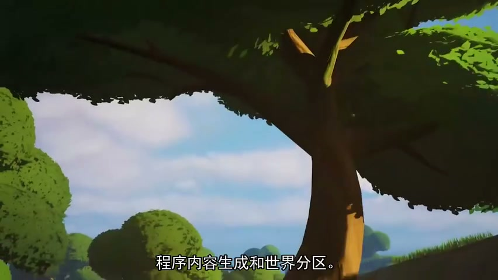
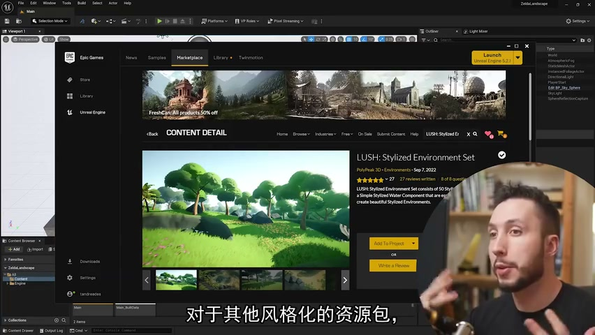
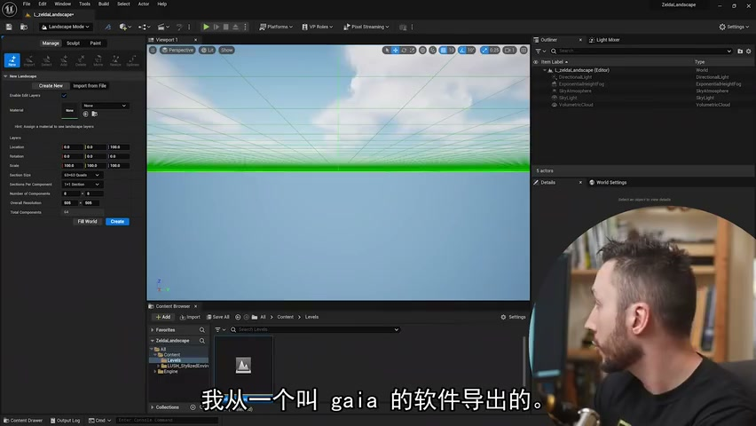
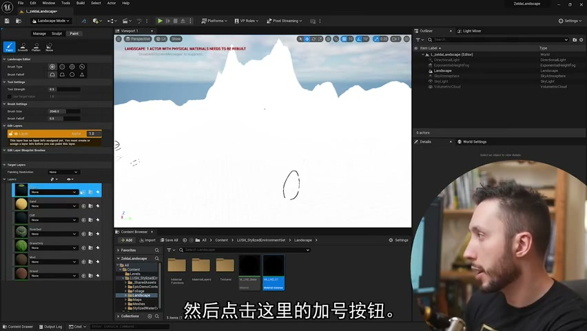

### Gaia 地图导入与 Landscape

- Gaia 输出的高度图和遮罩图用于建立 Landscape 与区域规则。
- Landscape 材质和 Layer 要与后续 PCG 读取逻辑保持一致。

**内容要点：**

- Gaia 地图导入与 Landscape。

**关键截图：**

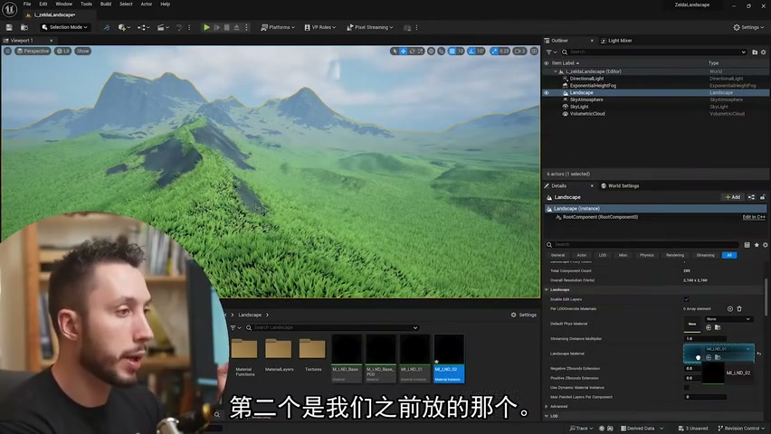
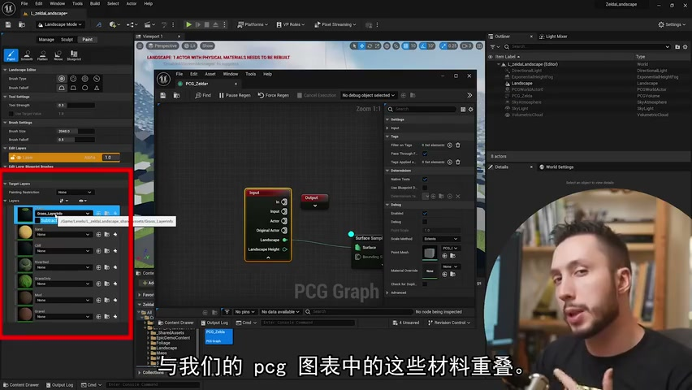
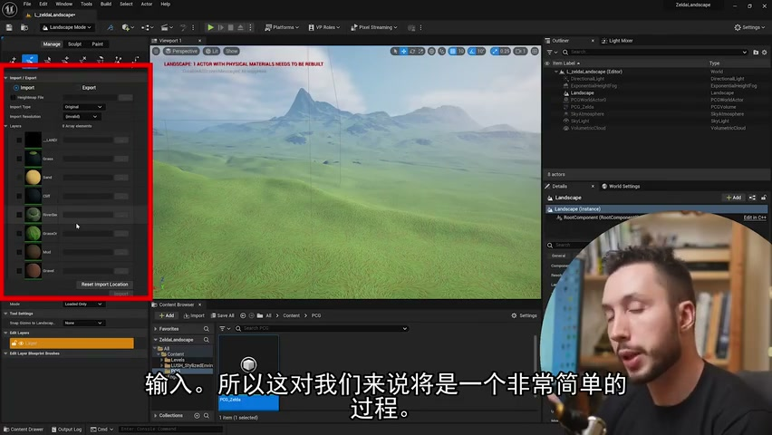
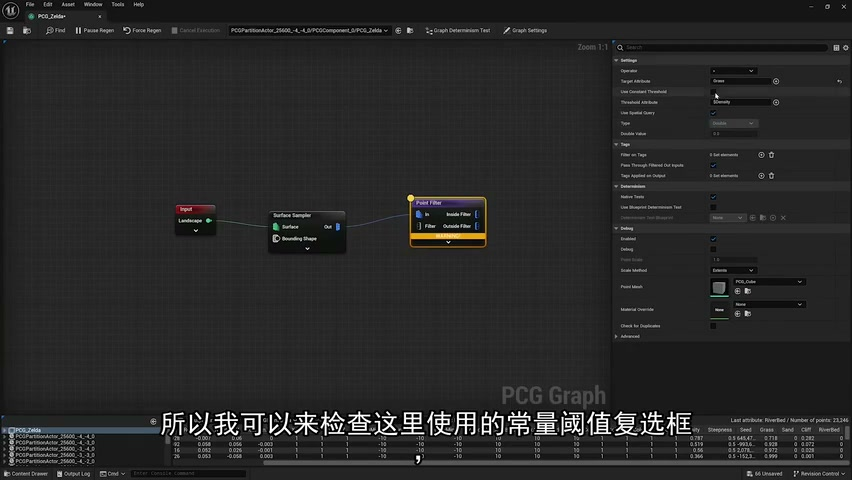

### PCG 植被和地表资产

- 草、花、岩石、树木分别用独立分支控制密度、随机缩放和随机旋转。
- 每个分支都先用 Debug 点确认，再接 Static Mesh Spawner。

**内容要点：**

- PCG 植被和地表资产。

**关键截图：**

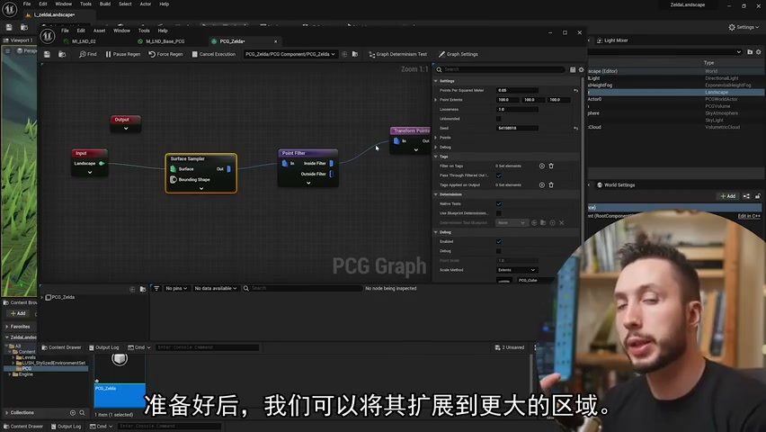
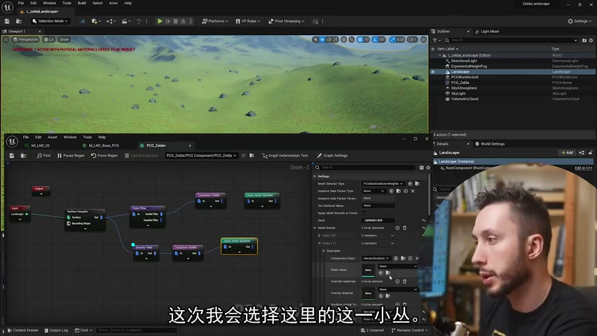
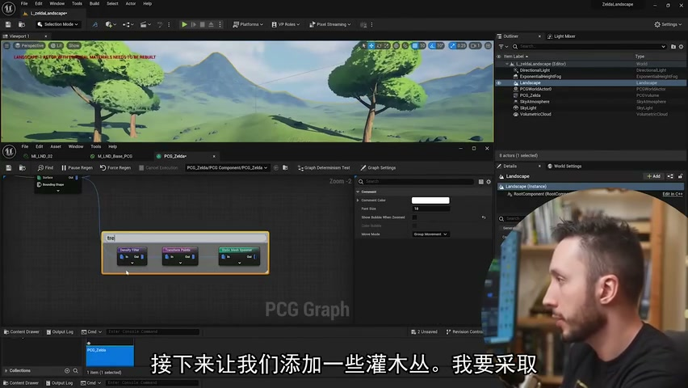
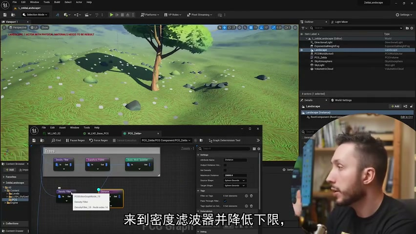

### 树木竖直与图表整理

- 树木在坡面上需要 Absolute Rotation，避免跟随地形法线倾斜。
- PCG Graph 注释和分组能显著降低大型图表的维护成本。

**内容要点：**

- 树木竖直与图表整理。

**关键截图：**

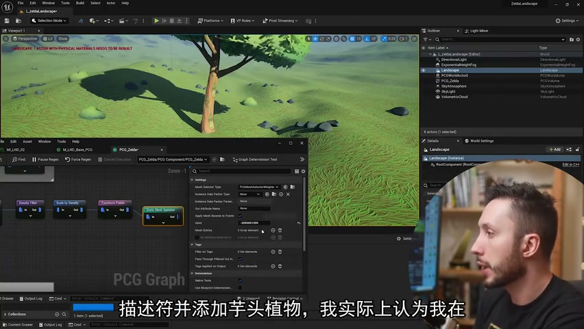
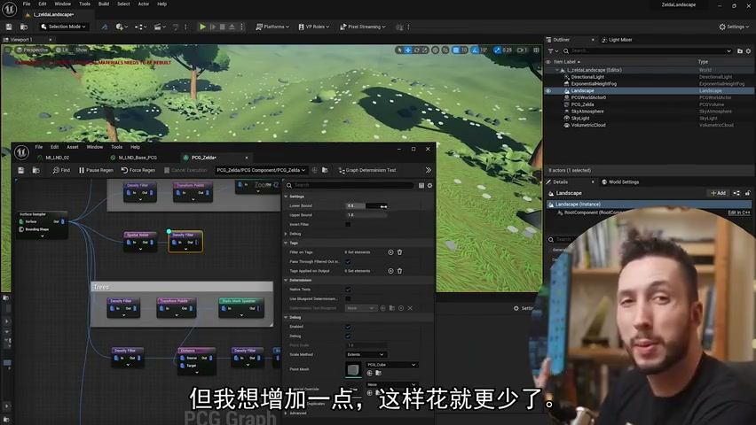
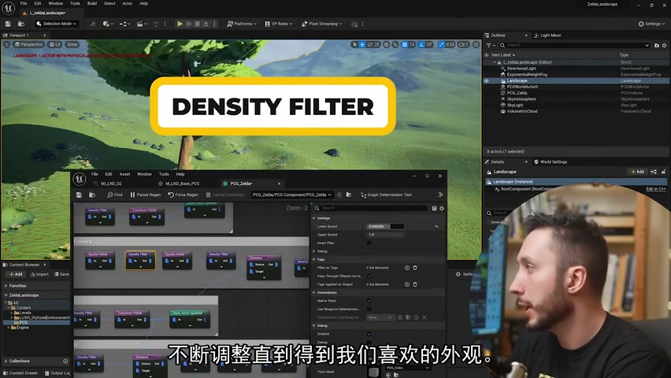
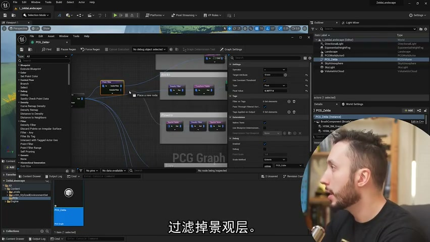

### World Partition 与分区 PCG

- 大世界不应一次性生成所有实例；partitioned PCG 可把生成结果分配到世界分区。
- 生成后要检查各 cell/actor 是否完成加载和更新，避免局部区域缺资产。

**内容要点：**

- World Partition 与分区 PCG。

**关键截图：**

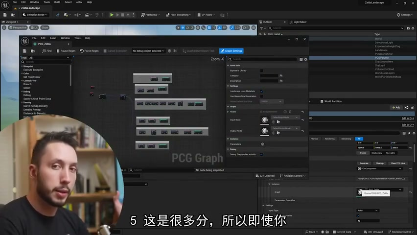

## 复现检查清单

- 项目设置和插件启用后重启编辑器，避免后续节点或材质功能不可用。
- Gaia 地图、Landscape Layer 和 PCG 读取属性要一一对应。
- 树木分支单独处理 Absolute Rotation。
- World Partition 场景必须检查分区生成状态，不能只看当前视口附近。
