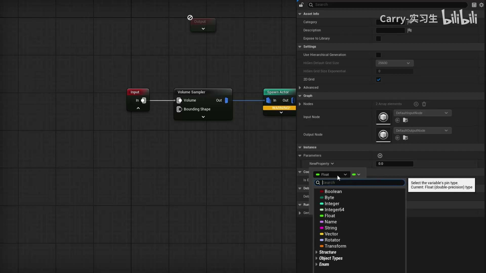
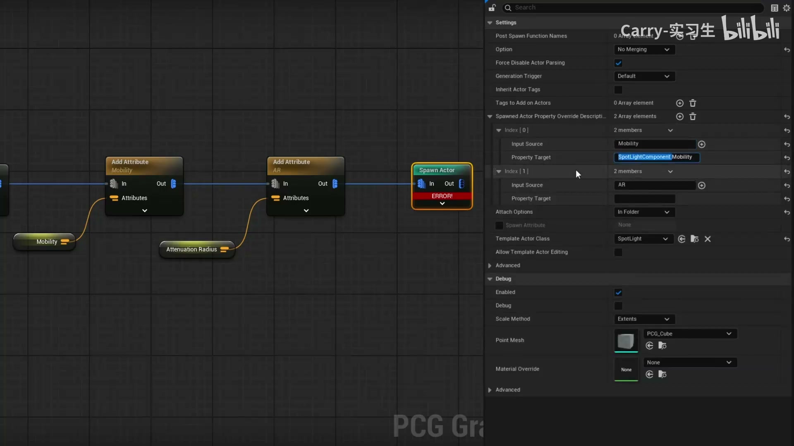
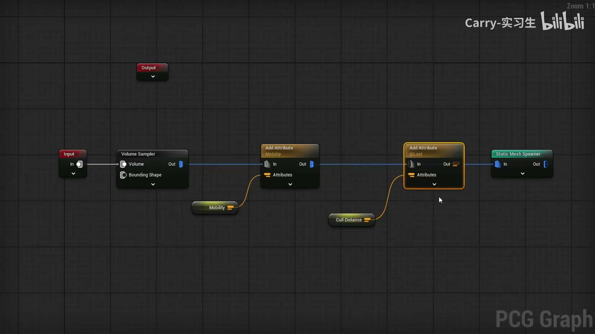
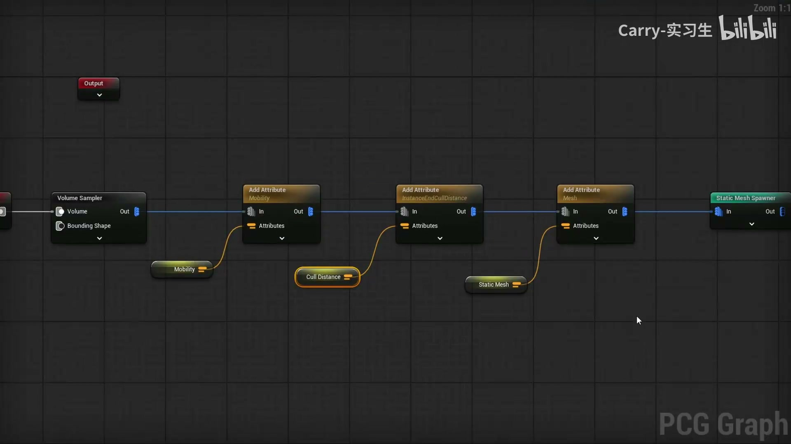

# Here's How to Set Any Exposed Variables Using PCG ｜ PCG Basics

## 知识目标

- 围绕“Here's How to Set Any Exposed Variables Using PCG ｜ PCG Basics”整理 PCG 视频中的输入数据、图表规则、关键节点、参数风险和最终生成结果。
- 阅读时重点区分三层：输入来源（点、样条、表面、体积、Actor 或属性）、规则处理（采样、过滤、变换、分区、循环、HLSL 或子图）、输出方式（Static Mesh Spawner、Spawn Actor、Spline Mesh、Blueprint 或 Dynamic Mesh）。

## 可复现主流程

- 确认 PCG Graph/PCG Component 已绑定到正确 Actor，并先用 Debug/Inspect 查看中间点数据。
- 明确输入来源：Spline、Surface、Mesh、Volume、Actor、Data Asset/Data Table 或手工参数。
- 在图表中按顺序处理采样、属性写入、过滤、Transform、分区/循环和输出节点。
- 生成可见结果前，先核对 Point 的 Transform、Bounds、Density、Seed 和自定义 Attribute。
- 用 Static Mesh Spawner 输出大量网格实例；需要蓝图逻辑时改用 Spawn Actor 或 Blueprint 交互。

## 关键术语

- `PCG`、`Blueprint`、`Static Mesh`、`Mesh`、`Point`、`Attribute`、`Actor`、`Component`、`Spawn`、`Random`、`Graph`、`Material`、`Instance`、`mobility`、`distance`、`call`、`select`、`PCG Graph`、`PCG Component`、`Volume`、`Static Mesh Spawner`、`Spawn Actor`、`Data Asset`

## 分段知识

### 00:00:00-00:04:53 生成器输出与蓝图交互

- 本段定位：生成器输出与蓝图交互。
- 知识点：PCG 流程要按点数据、属性写入、过滤条件和 Spawner 输出四步核对，避免只看最终实例而漏掉中间点状态。
- 知识点：Spawn Actor 适合生成带蓝图逻辑的对象。
- 知识点：Static Mesh Spawner 将点数据实例化为静态网格，复现时要检查 Mesh、Transform、Density 和材质覆盖。
- 知识点：涉及 Dynamic Mesh 时还要启用 Geometry Script Interop。
- 知识点：创建 PCG Graph 后，将规则绑定到 PCG Component 或放置到场景 Actor 上进行调试。
- 知识点：属性是 PCG 数据流中的关键状态，应明确保存分类、索引、随机种子、缩放或材质选择等信息。
- 知识点：PCG Component 的 Graph Instance / Parameter Overrides 用于覆盖图表参数，复现时要确认实例参数已勾选并生效。
- 复现要点：先用 Debug/Inspect 核对点数量、Bounds、Density 和关键属性，再判断最终生成结果。
- 复现要点：属性命名要稳定，过滤、分区和分支节点应保留可检查的中间数据，避免后续规则难以追踪。
- 复现要点：Static Mesh Spawner 用于高效实例化；Spawn Actor/Blueprint 用于需要逻辑的对象，成本和生命周期不同。
- 核对对象：`PCG Graph`、`PCG Component`、`PCG`、`Point`、`Attribute`、`Volume`、`Actor`、`Blueprint`、`Static Mesh`、`Spawn Actor`。

**关键画面：**

### 00:04:53-00:07:45 生成器输出与蓝图交互

- 本段定位：生成器输出与蓝图交互。
- 知识点：PCG 流程要按点数据、属性写入、过滤条件和 Spawner 输出四步核对，避免只看最终实例而漏掉中间点状态。
- 知识点：Spawn Actor 适合生成带蓝图逻辑的对象。
- 知识点：Static Mesh Spawner 将点数据实例化为静态网格，复现时要检查 Mesh、Transform、Density 和材质覆盖。
- 知识点：Static Mesh Spawner 可覆盖生成实例的材质，用于快速验证网格实例的分类和可见性。
- 复现要点：Static Mesh Spawner 用于高效实例化；Spawn Actor/Blueprint 用于需要逻辑的对象，成本和生命周期不同。
- 核对对象：`PCG`、`Actor`、`Blueprint`、`Static Mesh`、`Static Mesh Spawner`、`Spawn Actor`、`Data Asset`、`Instance`、`生成`、`蓝图`。

**关键画面：**

### 00:07:45-00:11:13 生成器输出与蓝图交互

- 本段定位：生成器输出与蓝图交互。
- 知识点：PCG 流程要按点数据、属性写入、过滤条件和 Spawner 输出四步核对，避免只看最终实例而漏掉中间点状态。
- 知识点：属性是 PCG 数据流中的关键状态，应明确保存分类、索引、随机种子、缩放或材质选择等信息。
- 知识点：Static Mesh Spawner 可覆盖生成实例的材质，用于快速验证网格实例的分类和可见性。
- 复现要点：属性命名要稳定，过滤、分区和分支节点应保留可检查的中间数据，避免后续规则难以追踪。
- 复现要点：Static Mesh Spawner 用于高效实例化；Spawn Actor/Blueprint 用于需要逻辑的对象，成本和生命周期不同。
- 核对对象：`PCG`、`Attribute`、`Actor`、`Static Mesh`、`Static Mesh Spawner`、`Random`、`Data Asset`、`Instance`、`生成`、`蓝图`。

**关键画面：**

## 复现检查

- 每个图表先检查输入数据是否正确进入 PCG Graph，再看下游生成结果。
- Debug/Inspect 时重点看点数量、Bounds、Density、Transform、Seed 和自定义 Attribute。
- Static Mesh Spawner、Spawn Actor、Spline Mesh 和 Blueprint 输出节点不能混用语义；选择前先确定是否需要实例化性能或蓝图逻辑。
- 涉及样条、分区、运行时或 GPU 生成时，必须额外验证更新触发、缓存、世界分区和性能预算。
