# 64. Create a Procedural Cave Using PCG and Geometry Scripting in UE5!

## 知识目标

- 本文整理“64. Create a Procedural Cave Using PCG and Geometry Scripting in UE5!”的 PCG 实操流程、关键节点、参数组织方式和复现风险点。

## 可复现主流程

- 先把本集标题对应的 PCG 目标拆成输入、规则、生成结果三层：输入通常是点、Spline、Volume、Actor、属性或表面数据；规则通常由过滤、变换、循环、语法、HLSL、自定义节点或子图负责；生成结果再交给 Static Mesh Spawner、Spawn Actor、Spline Mesh、实例化 Actor 或 Blueprint。
- 环境类流程要先稳定地形/表面/样条输入，再逐层加入树木、草、岩石、水体、洞穴、迷宫或地下城结构，并通过密度、坡度、高度和距离过滤分层控制。
- 关键检查点是投射到地形、随机缩放旋转、碰撞、Cull Distance、实例数量和边缘过渡，避免资产漂浮、穿地或密度失控。

## 关键术语

- `PCG`
- `Blueprint`
- `Static Mesh`
- `Mesh`
- `Spline`
- `Transform`
- `Point`
- `Attribute`
- `Actor`
- `Component`
- `Spawn`
- `Grid`
- `Bounds`
- `Density`
- `Random`
- `Seed`
- `Loop`
- `Graph`

## 操作步骤与要点

### 先把本集标题对应的 PCG 目标拆成输入、规则、生成结果三层：输入通常是点、Spline、Volume、Actor、属性或表面数据；规则通常由过滤、变换、循环、语法、HLSL、自定义节点或子图负责；生成结果再交给 Static Mesh Spawner、Spawn Actor、Spline Mesh、实例化 Actor 或 Blueprint

**内容要点：**

- 先把本集标题对应的 PCG 目标拆成输入、规则、生成结果三层：输入通常是点、Spline、Volume、Actor、属性或表面数据；规则通常由过滤、变换、循环、语法、HLSL、自定义节点或子图负责；生成结果再交给 Static Mesh Spawner、Spawn Actor、Spline Mesh、实例化 Actor 或 Blueprint。

**关键截图：**

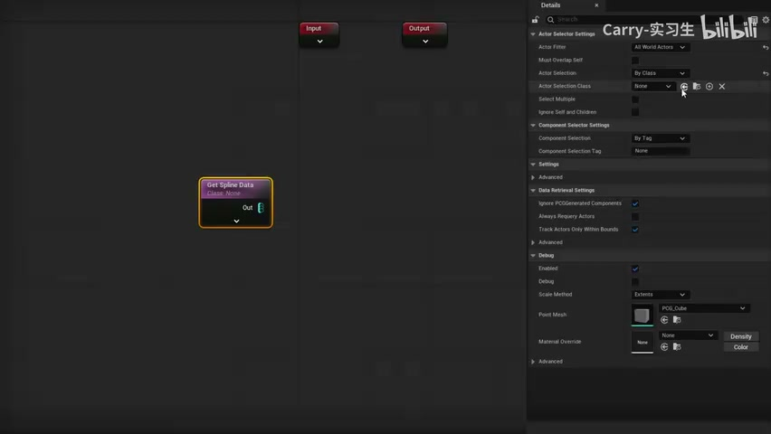

**参数、节点和风险点：**

- `PCG`
- `Blueprint`
- `Static Mesh`
- `Mesh`
- `Spline`
- `Point`
- `Actor`
- `Component`
- `Spawn`
- `Graph`

### 先把本集标题对应的 PCG 目标拆成输入、规则、生成结果三层：输入通常是点、Spline、Volume、Actor、属性或表面数据；规则通常由过滤、变换、循环、语法、HLSL、自定义节点或子图负责；生成结果再交给 Static Mesh Spawner、Spawn Actor、Spline Mesh、实例化 Actor 或 Blueprint（2）

**内容要点：**

- 先把本集标题对应的 PCG 目标拆成输入、规则、生成结果三层：输入通常是点、Spline、Volume、Actor、属性或表面数据；规则通常由过滤、变换、循环、语法、HLSL、自定义节点或子图负责；生成结果再交给 Static Mesh Spawner、Spawn Actor、Spline Mesh、实例化 Actor 或 Blueprint（2）。

**关键截图：**

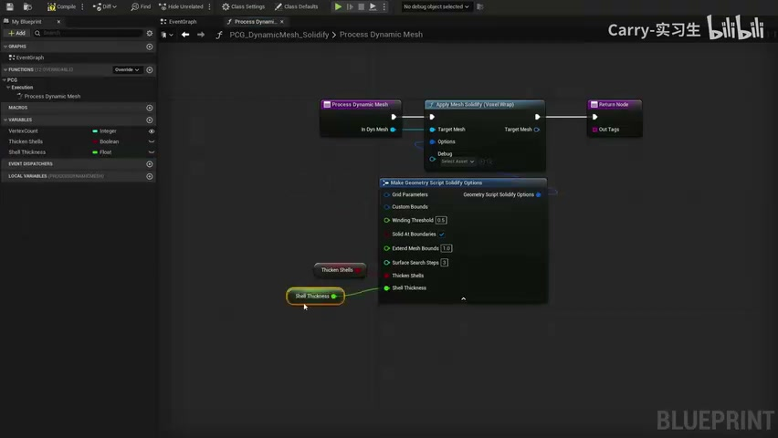

**参数、节点和风险点：**

- `PCG`
- `Blueprint`
- `Mesh`
- `Spline`
- `Point`
- `Attribute`
- `Graph`
- `mesh`
- `dynamic`
- `solidify`

### 环境类流程要先稳定地形/表面/样条输入，再逐层加入树木、草、岩石、水体、洞穴、迷宫或地下城结构，并通过密度、坡度、高度和距离过滤分层控制

**内容要点：**

- 环境类流程要先稳定地形/表面/样条输入，再逐层加入树木、草、岩石、水体、洞穴、迷宫或地下城结构，并通过密度、坡度、高度和距离过滤分层控制。

**关键截图：**

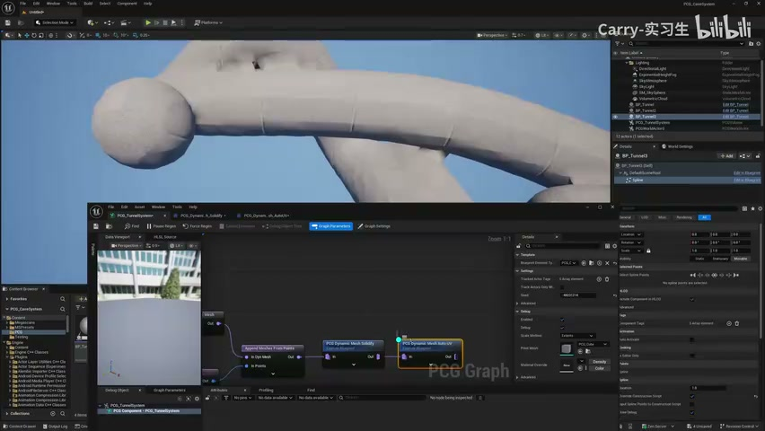
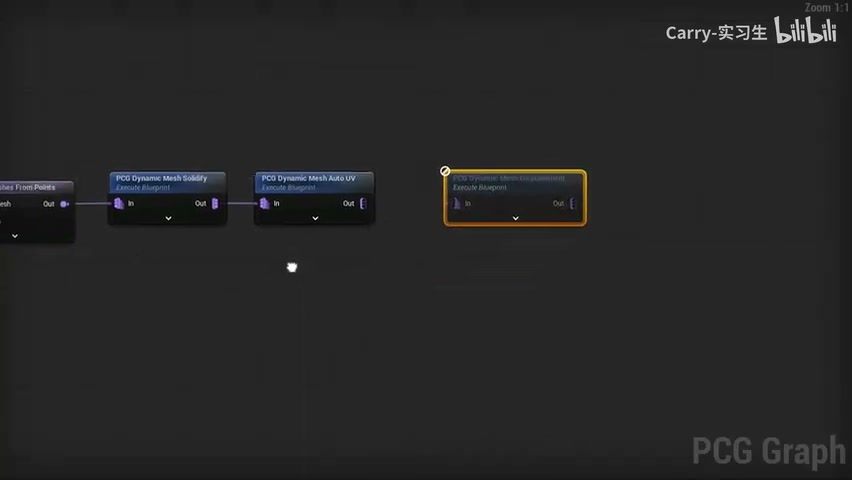

**参数、节点和风险点：**

- `PCG`
- `Mesh`
- `Point`
- `Grid`
- `Random`
- `Graph`
- `mesh`
- `texture`
- `displacement`

### 环境类流程要先稳定地形/表面/样条输入，再逐层加入树木、草、岩石、水体、洞穴、迷宫或地下城结构，并通过密度、坡度、高度和距离过滤分层控制（2）

**内容要点：**

- 环境类流程要先稳定地形/表面/样条输入，再逐层加入树木、草、岩石、水体、洞穴、迷宫或地下城结构，并通过密度、坡度、高度和距离过滤分层控制（2）。

**关键截图：**

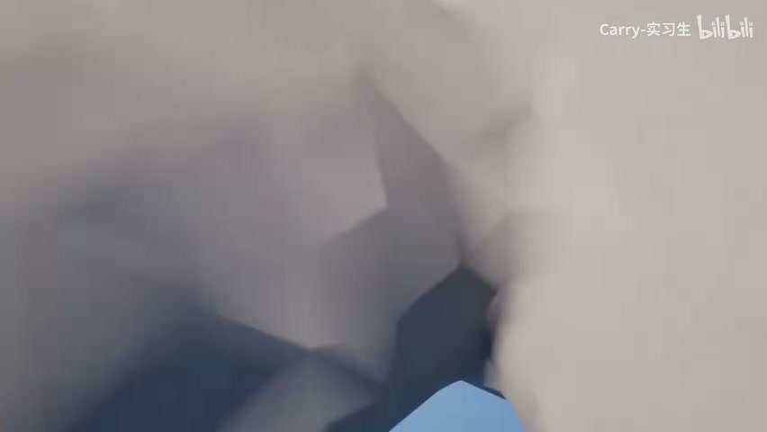
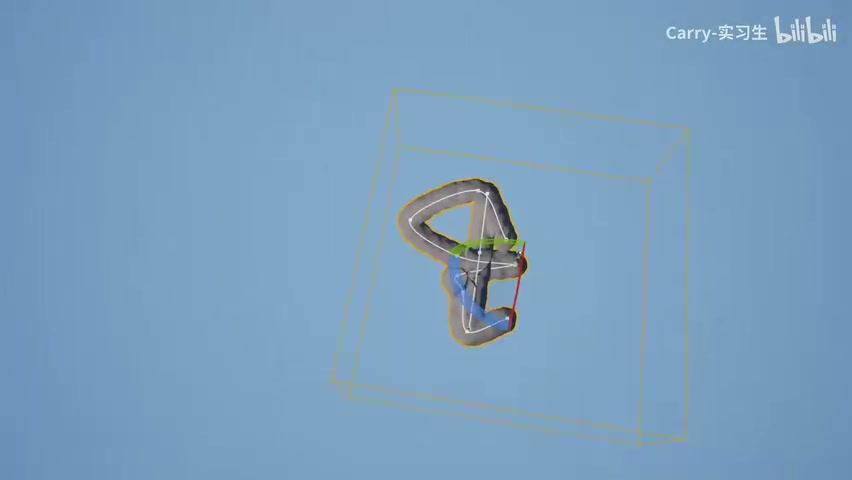

**参数、节点和风险点：**

- `PCG`
- `Static Mesh`
- `Mesh`
- `Spline`
- `Point`
- `Component`
- `Spawn`
- `Loop`
- `Graph`
- `Material`

### 关键检查点是投射到地形、随机缩放旋转、碰撞、Cull Distance、实例数量和边缘过渡，避免资产漂浮、穿地或密度失控

**内容要点：**

- 关键检查点是投射到地形、随机缩放旋转、碰撞、Cull Distance、实例数量和边缘过渡，避免资产漂浮、穿地或密度失控。

**关键截图：**

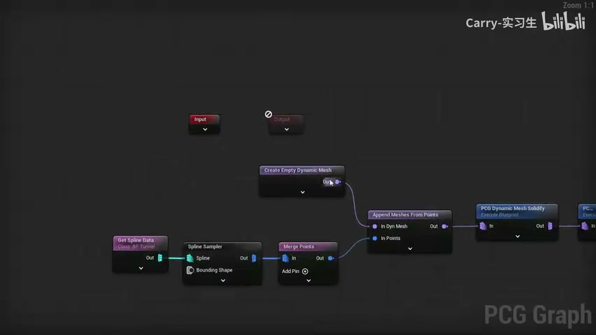

**参数、节点和风险点：**

- `PCG`
- `Static Mesh`
- `Mesh`
- `Spline`
- `Transform`
- `Point`
- `Component`
- `Grid`
- `Random`
- `Seed`

### 关键检查点是投射到地形、随机缩放旋转、碰撞、Cull Distance、实例数量和边缘过渡，避免资产漂浮、穿地或密度失控（2）

**内容要点：**

- 关键检查点是投射到地形、随机缩放旋转、碰撞、Cull Distance、实例数量和边缘过渡，避免资产漂浮、穿地或密度失控（2）。

**关键截图：**

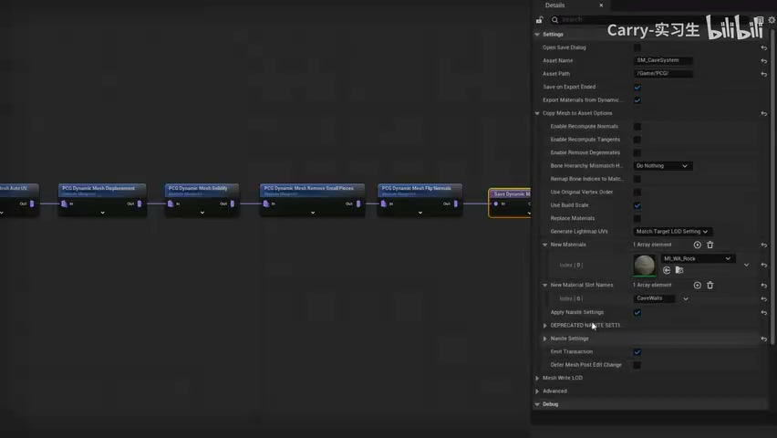
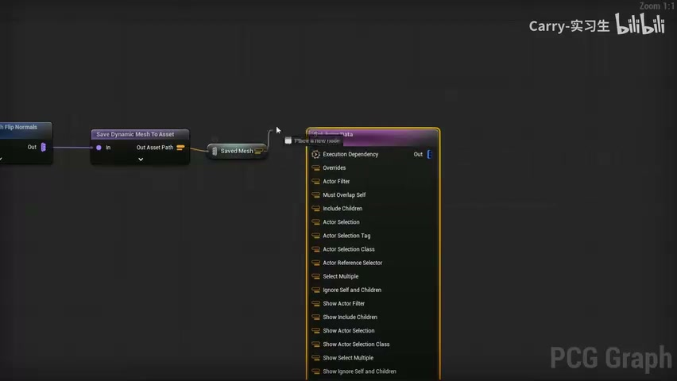

**参数、节点和风险点：**

- `PCG`
- `Static Mesh`
- `Mesh`
- `Point`
- `Attribute`
- `Actor`
- `Spawn`
- `Grid`
- `Bounds`
- `Graph`

### 节点、参数和生成结果校验 07

**内容要点：**

- 节点、参数和生成结果校验 07。

**关键截图：**

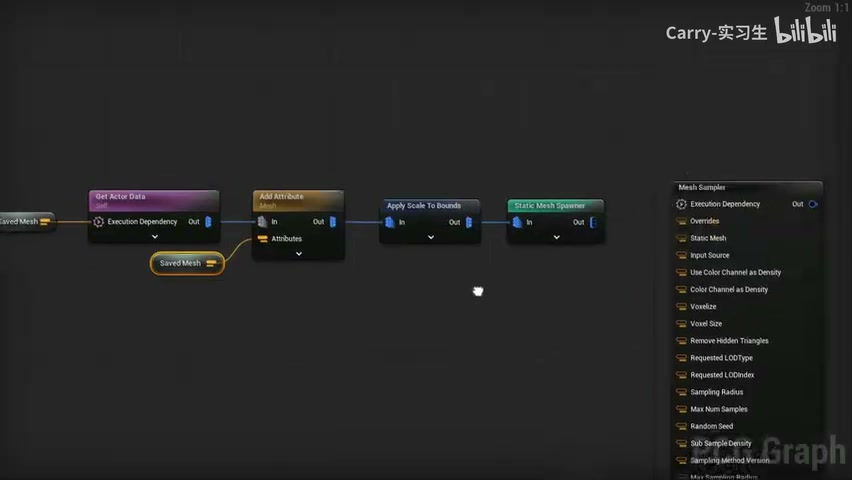
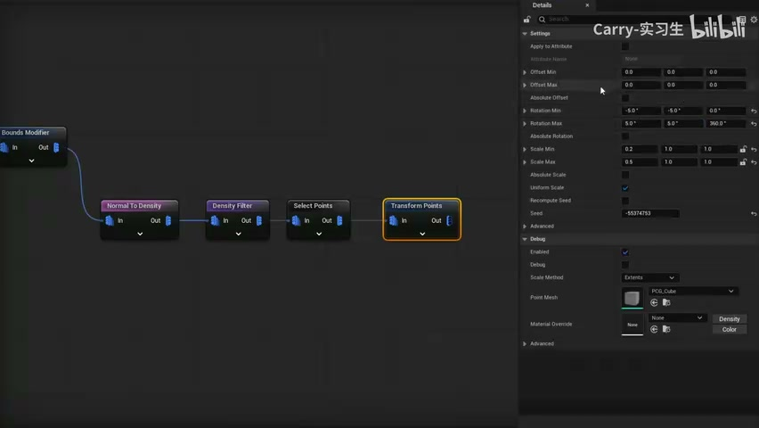

**参数、节点和风险点：**

- `PCG`
- `Static Mesh`
- `Mesh`
- `Transform`
- `Point`
- `Attribute`
- `Actor`
- `Spawn`
- `Bounds`
- `Density`

### **内容要点：**

- **内容要点：**（2）。

**关键截图：**

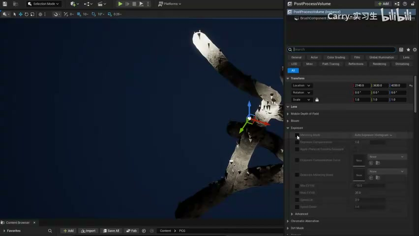
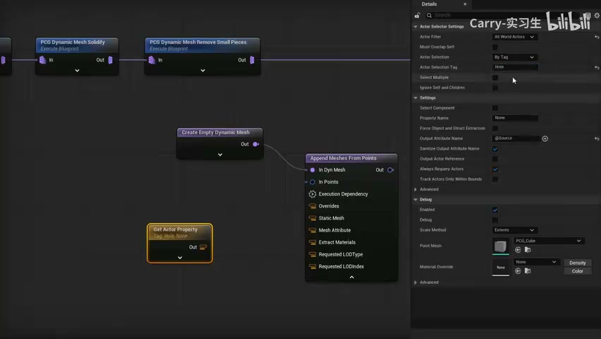

**参数、节点和风险点：**

- `PCG`
- `Static Mesh`
- `Mesh`
- `Spline`
- `Point`
- `Actor`
- `Component`
- `Spawn`
- `Loop`
- `Graph`

### **内容要点：**

- **内容要点：**（3）。

**关键截图：**

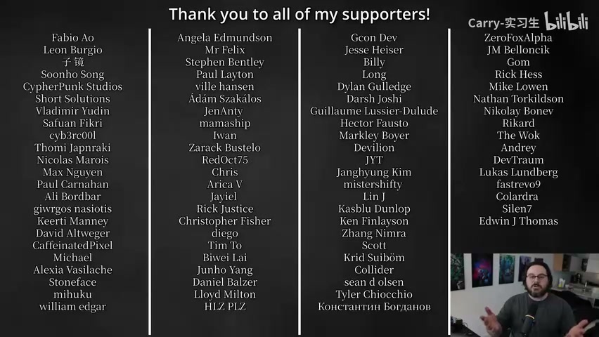

**参数、节点和风险点：**

- `PCG`
- `means`
- `join`
- `community`
- `link`
- `Discord`
- `down`
- `below`
- `always`
- `looking`

## 复现检查清单

- 所有 Static Mesh、Actor、Spline、Volume、PCG Graph 和 Blueprint 引用都要检查路径、类名、标签和坐标空间是否一致。
- PCG 点属性一旦跨子图、循环或 Blueprint 传递，必须核对属性名、类型和默认值；属性丢失通常会让后续过滤或生成分支静默失败。
- 大范围生成前先用小范围点集验证节点链路，再扩大密度和范围；不要在全量城市、森林或建筑上直接调试复杂规则。
- 涉及 UE 5.5/5.6/5.7 的新功能时，要记录版本依赖；旧项目复现前先确认节点是否存在或需要启用实验插件。
- 复现时先固定随机种子，再调整密度、过滤和生成资源，避免随机结果掩盖逻辑错误。
