# 用PCG创建程序化科幻城市

## 知识目标

- 围绕“用PCG创建程序化科幻城市”整理 PCG 程序化科幻城市生成流程：用路网和地块作为输入，采样城市可建区域，排除道路和禁建区，按密度与权重生成不同建筑，并用自定义 Blueprint Element 让建筑按规则朝向城市中心。

## 可复现主流程

- 先明确城市生成规则：PCG 不只用于自然景观，也可以在规划好的路网和地块中填充建筑、绿化和城市属性。
- 拆解城市生成流水线：数据源、采样、投影、排除/合并、Transform、Spawn Static Mesh 是主链路。
- 建立基础 PCG Graph，从场景或地形获取输入数据，并用采样点表示地块上可生成建筑的位置。
- 调整 Point Extent 和采样间隔，让采样点覆盖目标地块且能和地形、道路、建筑范围发生正确重叠。
- 把采样点 Projection 到 Landscape 上，确保建筑生成点落到地形表面，而不是悬在空中或停留在输入平面。
- 用 Transform Points 对位置、旋转和缩放做可控随机化，先做建筑点位的基础变化。
- 处理点之间和点与道路之间的重叠，注意节点顺序：排除和投影、Transform、Self Prune 的先后会改变结果。
- 把地块点接入 Spawn Static Mesh，用 Mesh Entries 和权重控制不同建筑模型的比例。
- 创建 NoBuilding/禁建区域样条 Actor，用闭合 Spline 定义中心构筑区、禁建区或其他需要挖空的范围。
- 用 Get Spline Data 按 Actor Tag 获取多个禁建样条，并启用 Select Multiple，避免只读取到第一个符合条件的 Actor。
- 把禁建样条转换为可参与重叠判断的范围，通过 Bounds/Extent 和 Self Prune 从建筑点集中裁掉中心区域。
- 为街道模型添加 Street 标签并采样道路，使用更合适的网格/碰撞输入得到街道占用范围。
- 用 Street 范围排除道路上的建筑点，并根据建筑体积调整 Extent 的 Multiply/Scale，避免建筑插入道路或地面。
- 制作中心到外缘的密度渐变：用距离或属性得到黑白过渡，再用 Multiply 保留已有随机性而不是直接 Set 覆盖。
- 加入小建筑和更多 Mesh 分支，通过不同随机种子、权重、Scale 和 Mesh Entries 形成更丰富的城市层级。
- 解决建筑朝向中心的问题：由于没有现成 PCG 节点，需要自定义 Blueprint Element/PCG Element 来处理 LookAt 逻辑。
- 在 Blueprint Element 中覆盖 Execute With Context 和 Point Loop Body，按点循环解包、修改 Transform/Rotation，再打包输出。
- 暴露 Target/中心点参数，用 Get Actor Property 或场景中的中心 Actor/Billboard 传入目标位置，最终让建筑按四个 90 度方向之一朝向中心并在关卡中验证。

## 关键术语

- `PCG`
- `Blueprint`
- `蓝图`
- `Static Mesh`
- `Mesh`
- `SubGraph`
- `Spline`
- `Transform`
- `Point`
- `Attribute`
- `Actor`
- `Component`
- `Spawn`
- `Bounds`
- `Density`
- `Random`
- `Seed`
- `Loop`

## 操作步骤与要点

### 先明确城市生成规则：PCG 不只用于自然景观，也可以在规划好的路网和地块中填充建筑、绿化和城市属性

**内容要点：**

- 先明确城市生成规则：PCG 不只用于自然景观，也可以在规划好的路网和地块中填充建筑、绿化和城市属性。

**关键截图：**

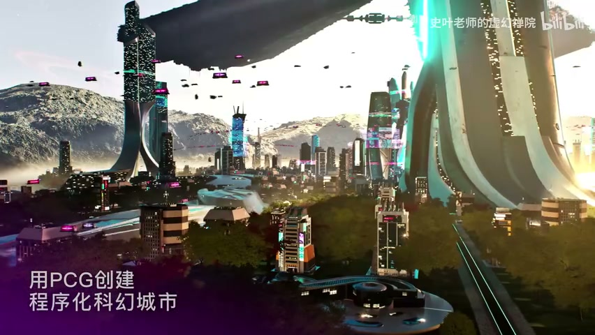
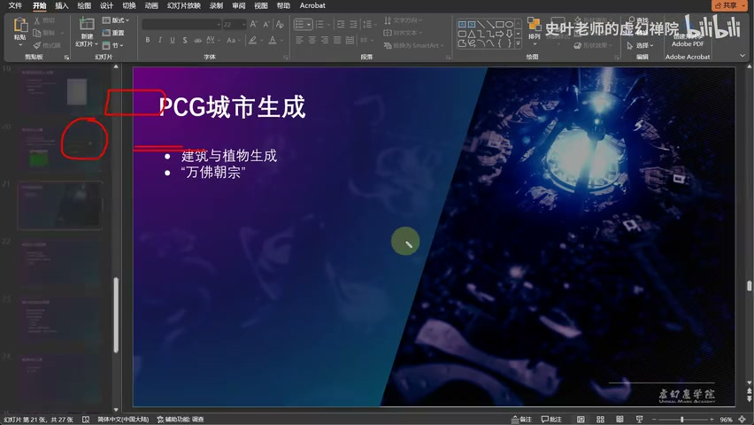

**参数、节点和风险点：**

- `PCG`
- `Point`
- `样条`
- `属性`
- `采样`
- `密度`
- `程序化`
- `生成`
- `建筑`
- `Acrobat`

### 拆解城市生成流水线：数据源、采样、投影、排除/合并、Transform、Spawn Static Mesh 是主链路

**内容要点：**

- 拆解城市生成流水线：数据源、采样、投影、排除/合并、Transform、Spawn Static Mesh 是主链路。

**关键截图：**

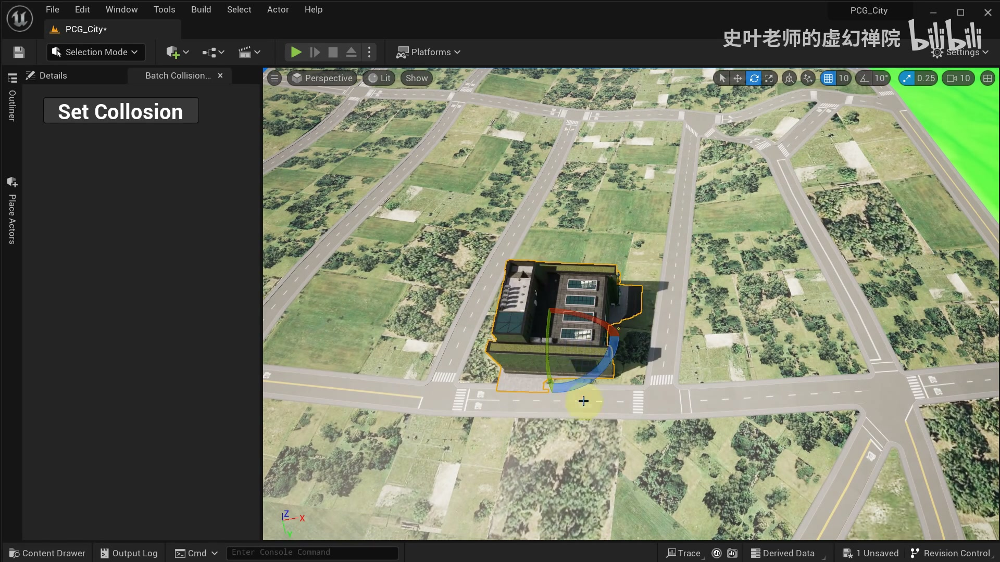
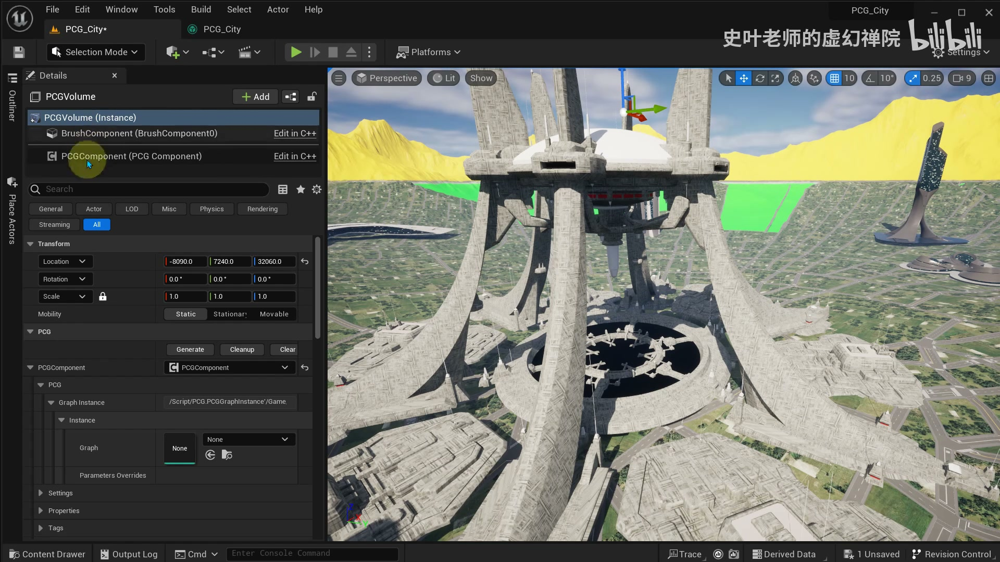

**参数、节点和风险点：**

- `PCG`
- `蓝图`
- `Spline`
- `Graph`
- `样条`
- `体积`
- `过滤`
- `采样`
- `生成`
- `建筑`

### 建立基础 PCG Graph，从场景或地形获取输入数据，并用采样点表示地块上可生成建筑的位置

**内容要点：**

- 建立基础 PCG Graph，从场景或地形获取输入数据，并用采样点表示地块上可生成建筑的位置。

**关键截图：**

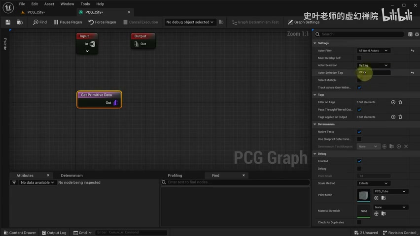
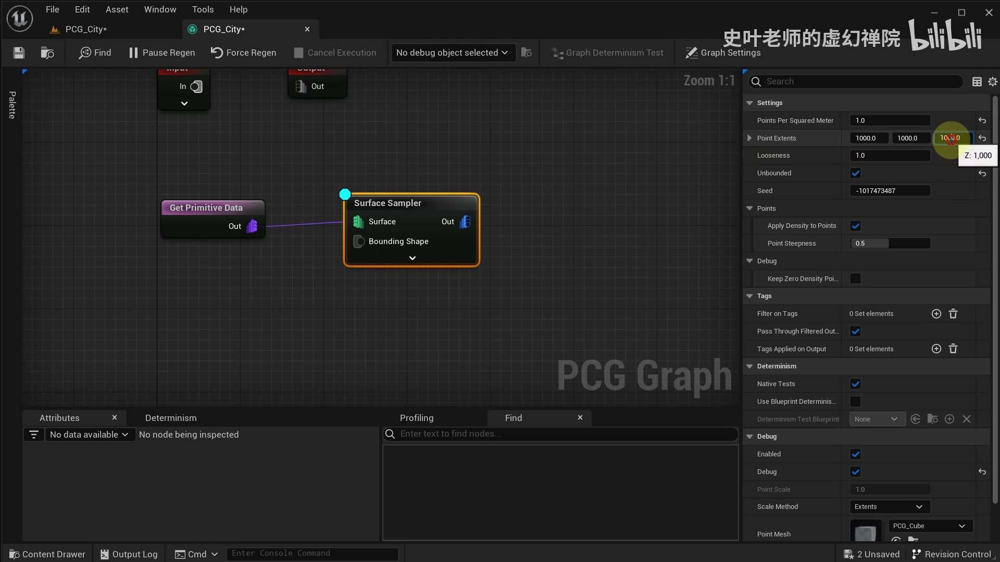

**参数、节点和风险点：**

- `PCG`
- `Point`
- `Actor`
- `Density`
- `Graph`
- `Landscape`
- `采样`
- `密度`
- `节点`
- `建筑`

### 调整 Point Extent 和采样间隔，让采样点覆盖目标地块且能和地形、道路、建筑范围发生正确重叠

**内容要点：**

- 调整 Point Extent 和采样间隔，让采样点覆盖目标地块且能和地形、道路、建筑范围发生正确重叠。

**关键截图：**

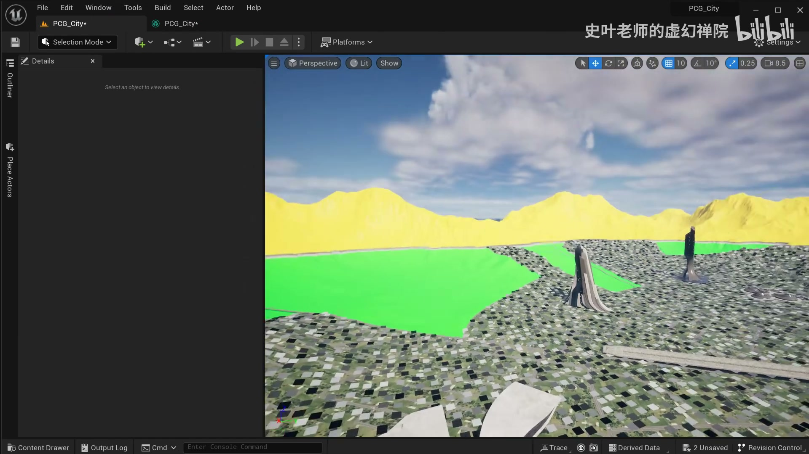
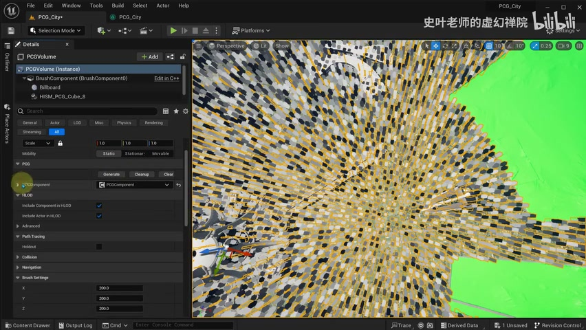

**参数、节点和风险点：**

- `PCG`
- `Transform`
- `Point`
- `Graph`
- `实例`
- `密度`
- `参数`
- `节点`
- `建筑`
- `PCG_City`

### 把采样点 Projection 到 Landscape 上，确保建筑生成点落到地形表面，而不是悬在空中或停留在输入平面

**内容要点：**

- 把采样点 Projection 到 Landscape 上，确保建筑生成点落到地形表面，而不是悬在空中或停留在输入平面。

**关键截图：**

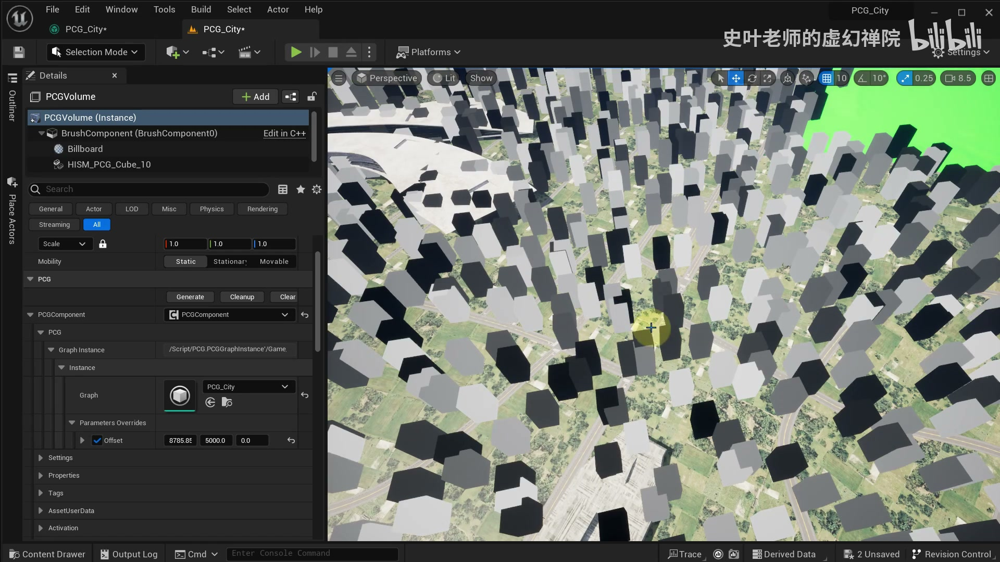
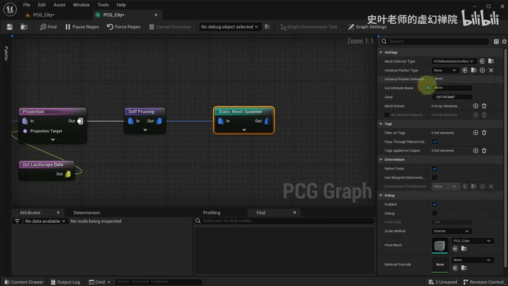

**参数、节点和风险点：**

- `PCG`
- `Static Mesh`
- `Mesh`
- `Component`
- `Spawn`
- `Graph`
- `Instance`
- `HISM`
- `体积`
- `节点`

### 用 Transform Points 对位置、旋转和缩放做可控随机化，先做建筑点位的基础变化

**内容要点：**

- 用 Transform Points 对位置、旋转和缩放做可控随机化，先做建筑点位的基础变化。

**关键截图：**

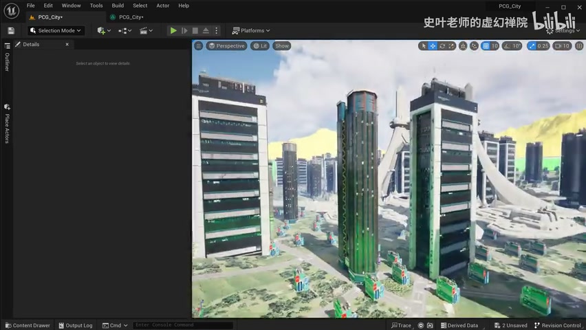
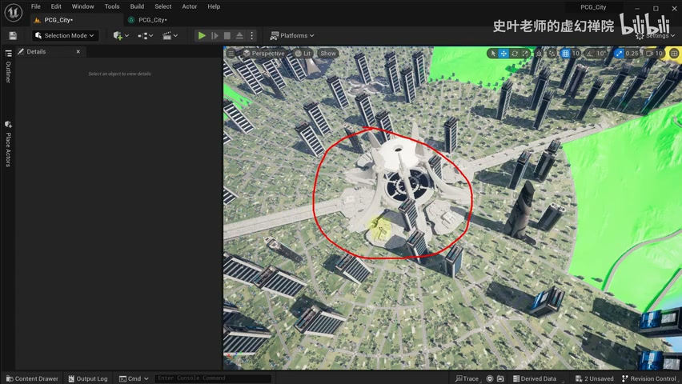

**参数、节点和风险点：**

- `PCG`
- `蓝图`
- `Mesh`
- `Spline`
- `Actor`
- `样条`
- `生成`
- `建筑`
- `SplineBase`
- `Sync`

### 处理点之间和点与道路之间的重叠，注意节点顺序：排除和投影、Transform、Self Prune 的先后会改变结果

**内容要点：**

- 处理点之间和点与道路之间的重叠，注意节点顺序：排除和投影、Transform、Self Prune 的先后会改变结果。

**关键截图：**

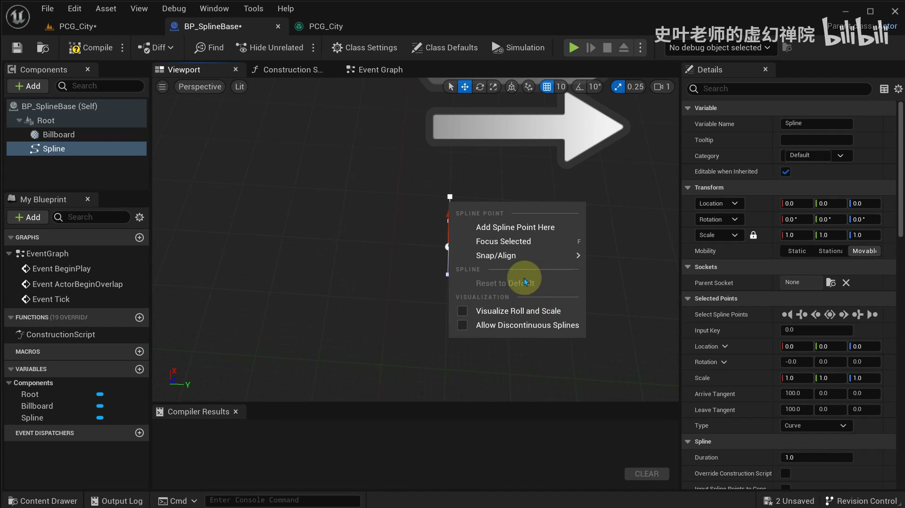
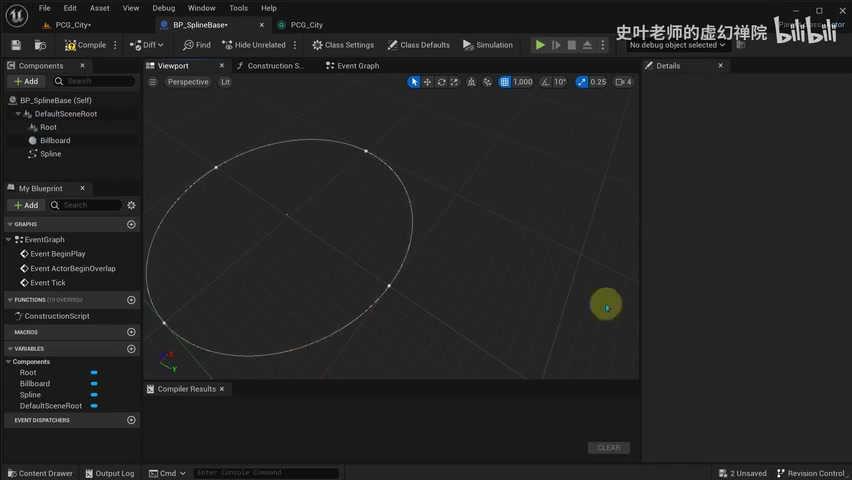

**参数、节点和风险点：**

- `PCG`
- `Spline`
- `Component`
- `Loop`
- `样条`
- `生成`
- `建筑`
- `Generation`
- `Panel`
- `Circle`

### 把地块点接入 Spawn Static Mesh，用 Mesh Entries 和权重控制不同建筑模型的比例

**内容要点：**

- 把地块点接入 Spawn Static Mesh，用 Mesh Entries 和权重控制不同建筑模型的比例。

**关键截图：**

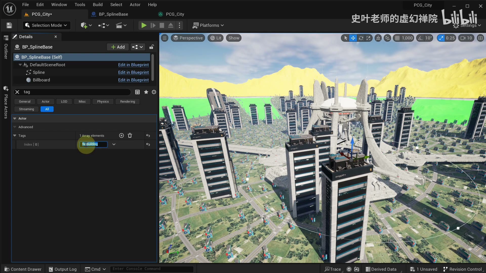
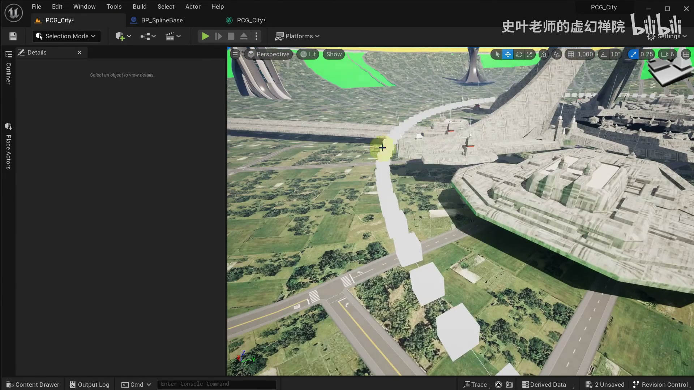

**参数、节点和风险点：**

- `PCG`
- `Blueprint`
- `蓝图`
- `Spline`
- `Point`
- `样条`
- `体积`
- `采样`
- `节点`
- `生成`

### 创建 NoBuilding/禁建区域样条 Actor，用闭合 Spline 定义中心构筑区、禁建区或其他需要挖空的范围

**内容要点：**

- 创建 NoBuilding/禁建区域样条 Actor，用闭合 Spline 定义中心构筑区、禁建区或其他需要挖空的范围。

**关键截图：**

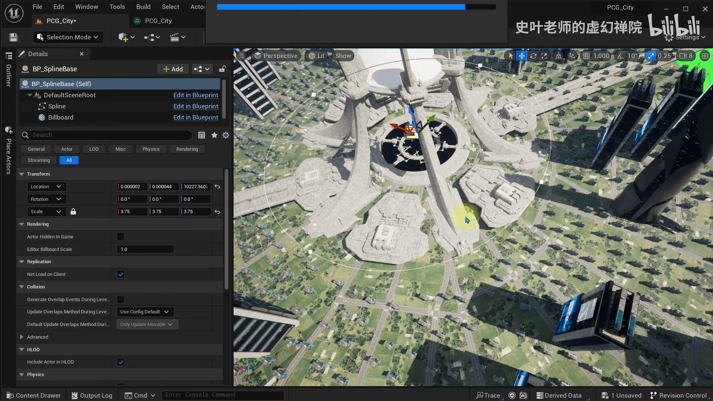
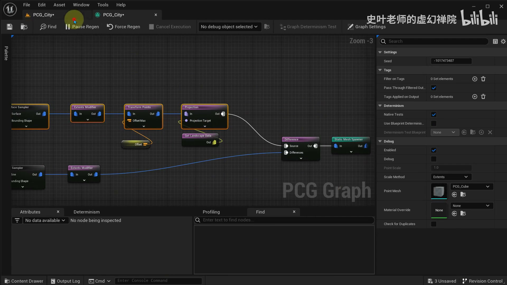

**参数、节点和风险点：**

- `PCG`
- `Blueprint`
- `蓝图`
- `Spline`
- `样条`
- `采样`
- `密度`
- `生成`
- `建筑`
- `cent`

### 用 Get Spline Data 按 Actor Tag 获取多个禁建样条，并启用 Select Multiple，避免只读取到第一个符合条件的 Actor

**内容要点：**

- 用 Get Spline Data 按 Actor Tag 获取多个禁建样条，并启用 Select Multiple，避免只读取到第一个符合条件的 Actor。

**关键截图：**

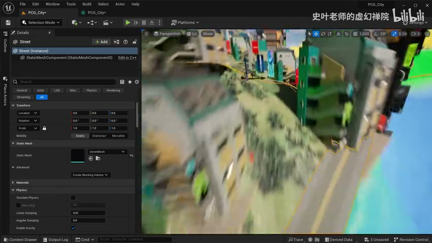
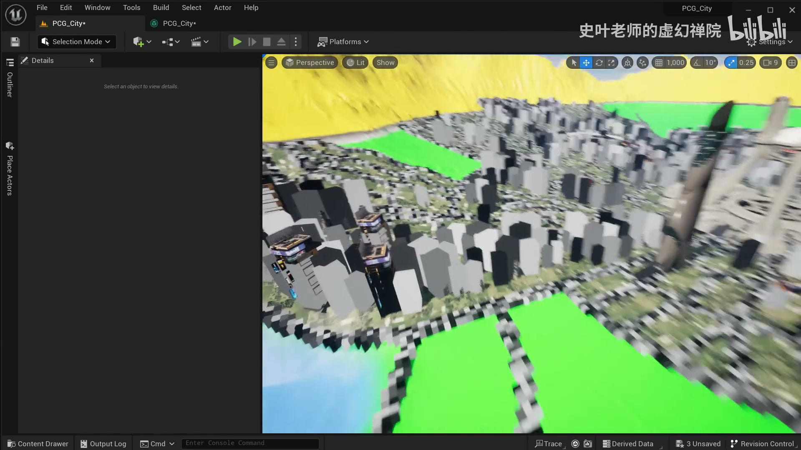

**参数、节点和风险点：**

- `PCG`
- `Mesh`
- `Actor`
- `Component`
- `网格`
- `采样`
- `密度`
- `生成`
- `建筑`
- `PCG_City`

### 把禁建样条转换为可参与重叠判断的范围，通过 Bounds/Extent 和 Self Prune 从建筑点集中裁掉中心区域

**内容要点：**

- 把禁建样条转换为可参与重叠判断的范围，通过 Bounds/Extent 和 Self Prune 从建筑点集中裁掉中心区域。

**关键截图：**

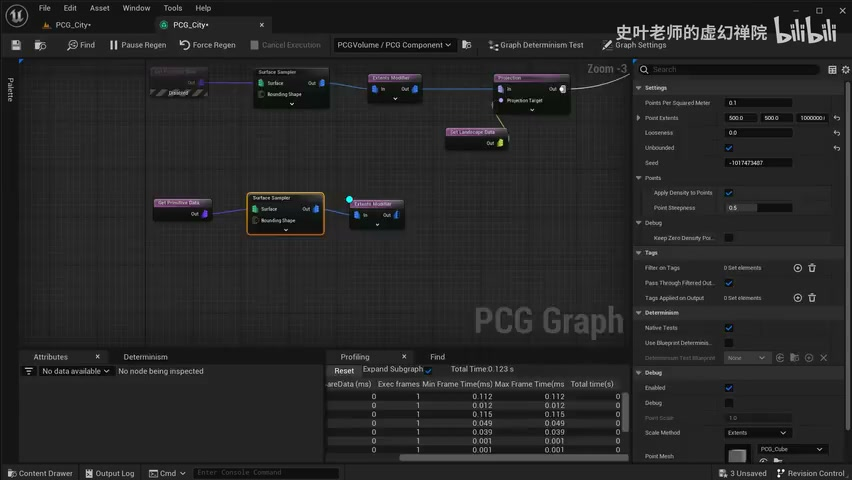
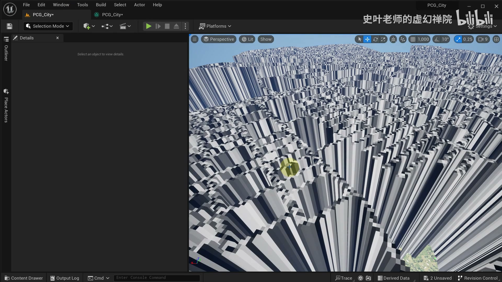

**参数、节点和风险点：**

- `PCG`
- `Point`
- `Component`
- `Density`
- `Graph`
- `参数`
- `节点`
- `生成`
- `建筑`
- `density`

### 为街道模型添加 Street 标签并采样道路，使用更合适的网格/碰撞输入得到街道占用范围

**内容要点：**

- 为街道模型添加 Street 标签并采样道路，使用更合适的网格/碰撞输入得到街道占用范围。

**关键截图：**

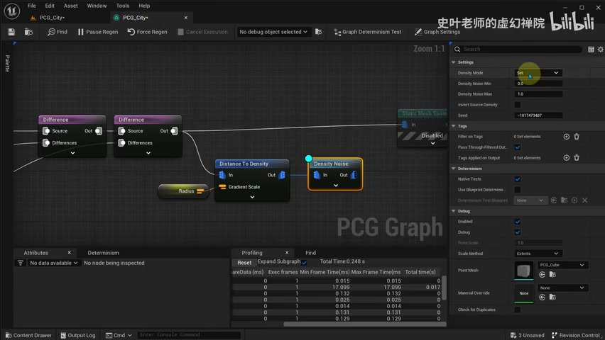
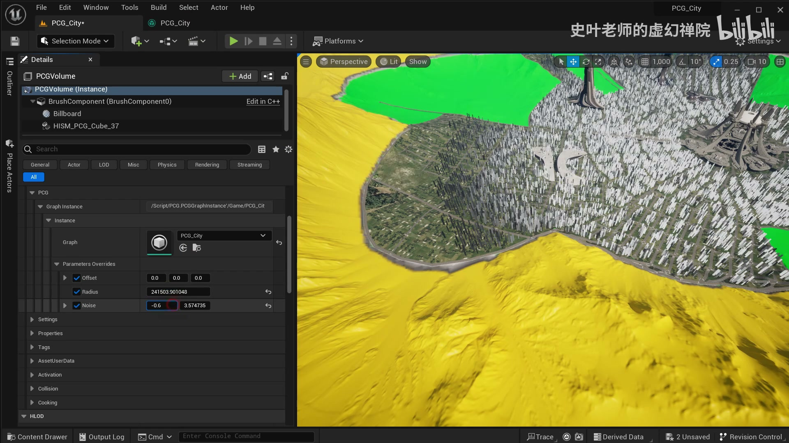

**参数、节点和风险点：**

- `PCG`
- `Density`
- `Seed`
- `Graph`
- `过滤`
- `密度`
- `参数`
- `建筑`
- `道路`
- `density`

### 用 Street 范围排除道路上的建筑点，并根据建筑体积调整 Extent 的 Multiply/Scale，避免建筑插入道路或地面

**内容要点：**

- 用 Street 范围排除道路上的建筑点，并根据建筑体积调整 Extent 的 Multiply/Scale，避免建筑插入道路或地面。

**关键截图：**

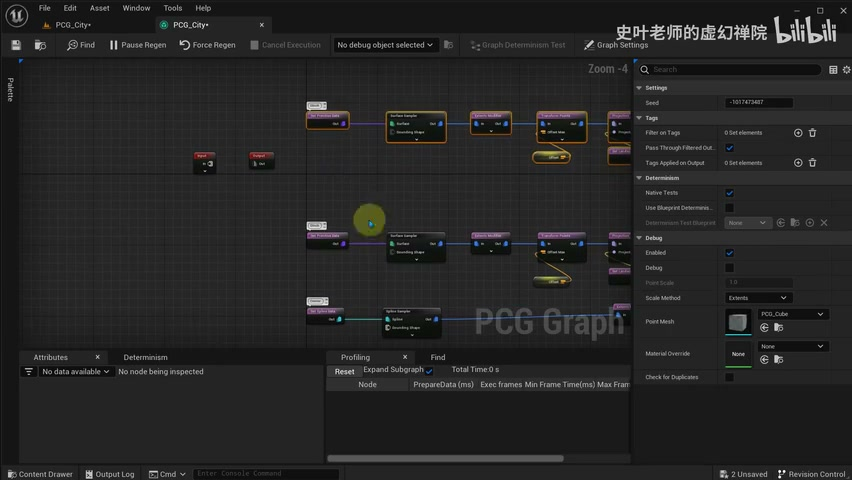
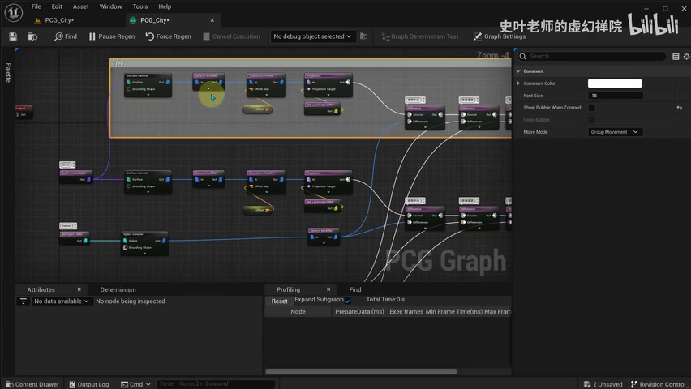

**参数、节点和风险点：**

- `PCG`
- `Blueprint`
- `蓝图`
- `Transform`
- `Spawn`
- `Graph`
- `采样`
- `密度`
- `参数`
- `节点`

### 制作中心到外缘的密度渐变：用距离或属性得到黑白过渡，再用 Multiply 保留已有随机性而不是直接 Set 覆盖

**内容要点：**

- 制作中心到外缘的密度渐变：用距离或属性得到黑白过渡，再用 Multiply 保留已有随机性而不是直接 Set 覆盖。

**关键截图：**

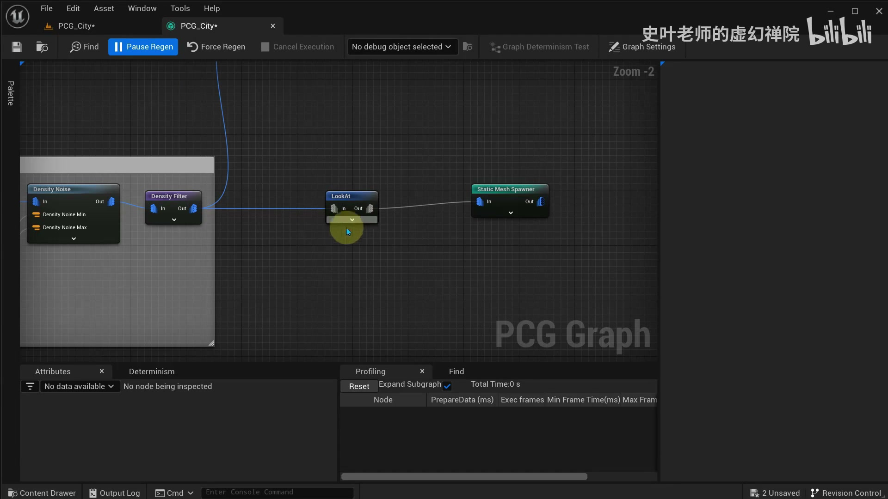
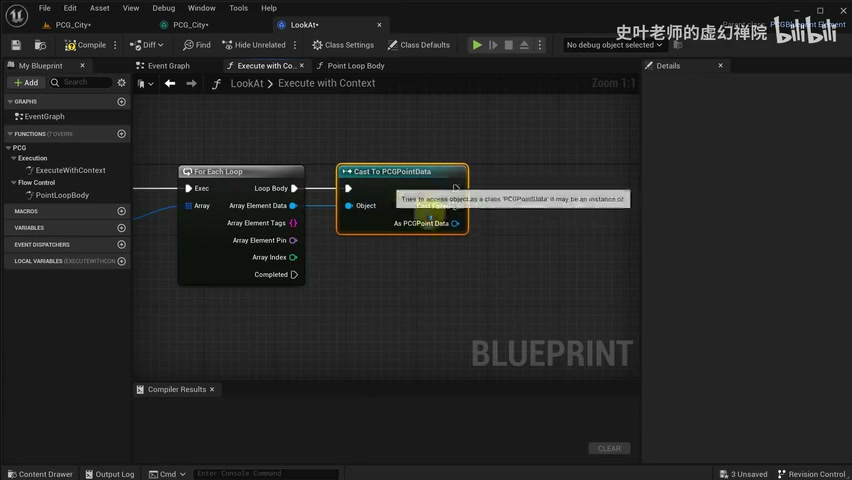

**参数、节点和风险点：**

- `PCG`
- `蓝图`
- `Point`
- `Attribute`
- `Loop`
- `Graph`
- `data`
- `context`
- `loop`
- `PCG_City`

### 加入小建筑和更多 Mesh 分支，通过不同随机种子、权重、Scale 和 Mesh Entries 形成更丰富的城市层级

**内容要点：**

- 加入小建筑和更多 Mesh 分支，通过不同随机种子、权重、Scale 和 Mesh Entries 形成更丰富的城市层级。

**关键截图：**

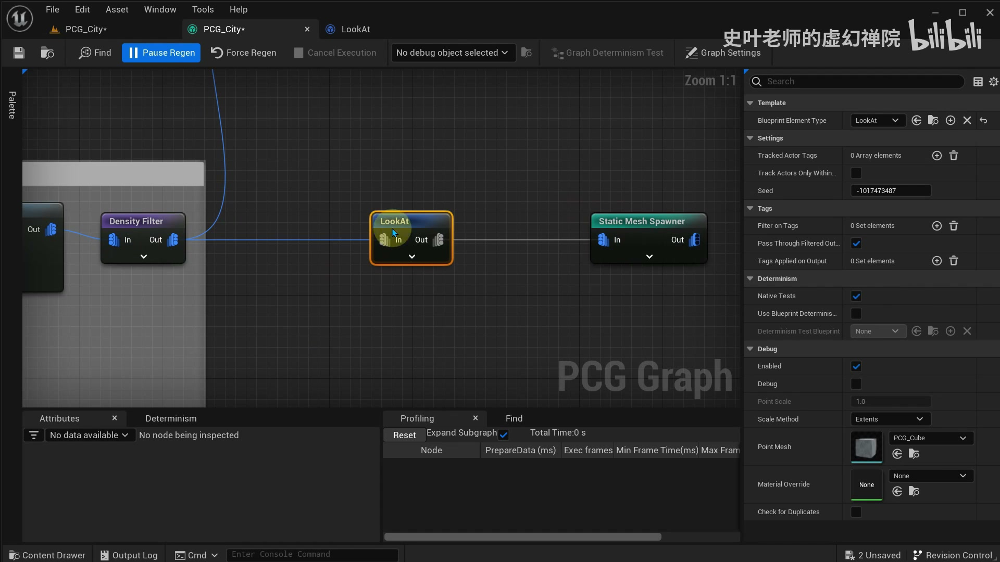
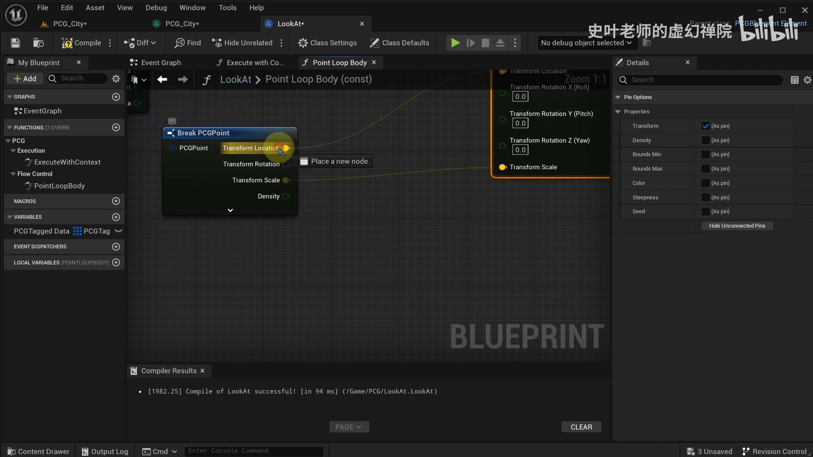

**参数、节点和风险点：**

- `PCG`
- `Transform`
- `Point`
- `Actor`
- `Density`
- `Loop`
- `Graph`
- `属性`
- `参数`
- `建筑`

### 解决建筑朝向中心的问题：由于没有现成 PCG 节点，需要自定义 Blueprint Element/PCG Element 来处理 LookAt 逻辑

**内容要点：**

- 解决建筑朝向中心的问题：由于没有现成 PCG 节点，需要自定义 Blueprint Element/PCG Element 来处理 LookAt 逻辑。

**关键截图：**

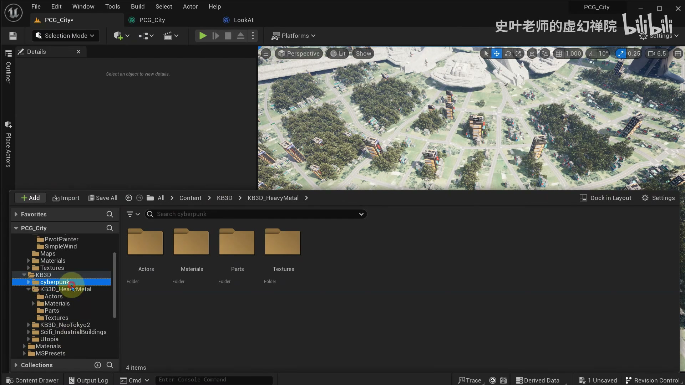
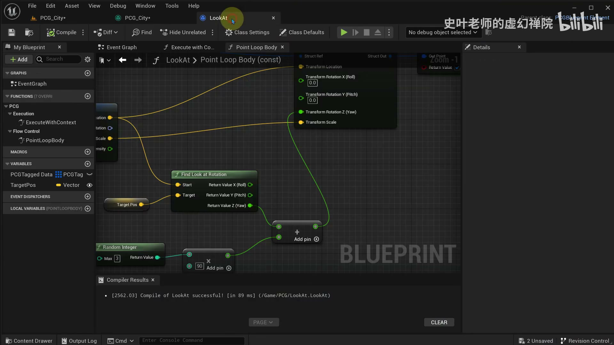

**参数、节点和风险点：**

- `PCG`
- `蓝图`
- `Transform`
- `Point`
- `Random`
- `Loop`
- `节点`
- `建筑`
- `body`
- `PCG_Ciy`

### 在 Blueprint Element 中覆盖 Execute With Context 和 Point Loop Body，按点循环解包、修改 Transform/Rotation，再打包输出

**内容要点：**

- 在 Blueprint Element 中覆盖 Execute With Context 和 Point Loop Body，按点循环解包、修改 Transform/Rotation，再打包输出。

**关键截图：**

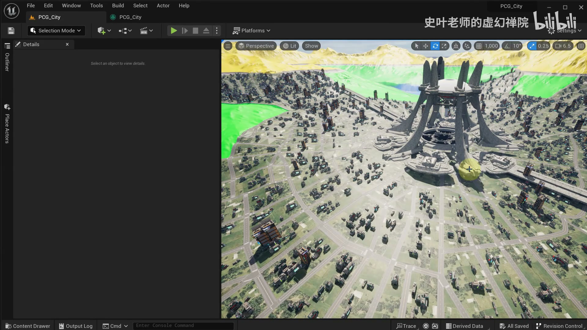
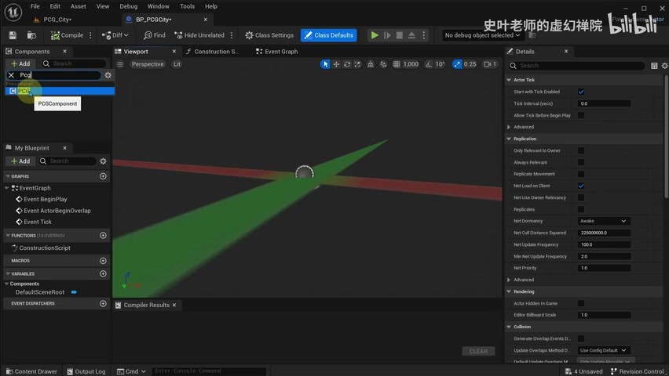

**参数、节点和风险点：**

- `PCG`
- `蓝图`
- `Component`
- `Instance`
- `参数`
- `建筑`
- `position`
- `city`
- `name`
- `pose`

### 暴露 Target/中心点参数，用 Get Actor Property 或场景中的中心 Actor/Billboard 传入目标位置，最终让建筑按四个 90 度方向之一朝向中心并在关卡中验证

**内容要点：**

- 暴露 Target/中心点参数，用 Get Actor Property 或场景中的中心 Actor/Billboard 传入目标位置，最终让建筑按四个 90 度方向之一朝向中心并在关卡中验证。

**关键截图：**

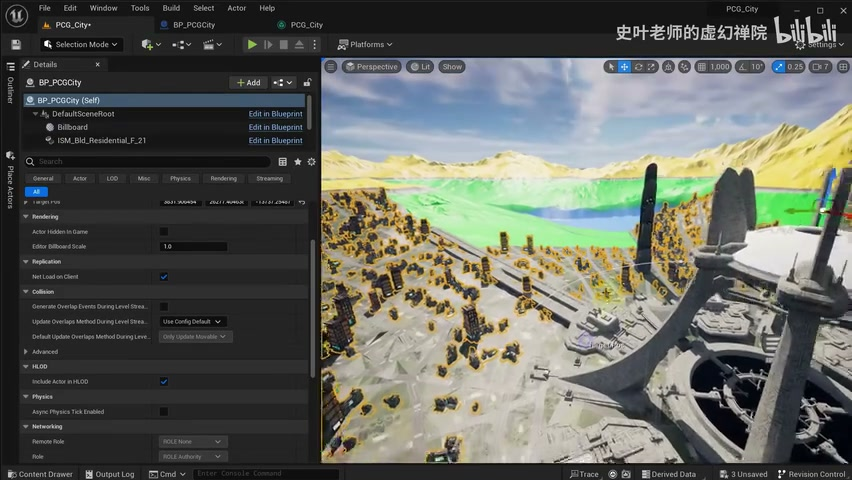
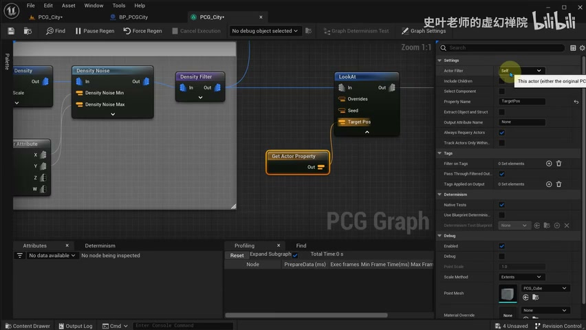

**参数、节点和风险点：**

- `PCG`
- `Blueprint`
- `蓝图`
- `参数`
- `生成`
- `建筑`
- `PCG_Ciy`
- `BP_PCGCity`
- `MopuM`
- `PCG_City`

## 复现检查清单

- 采样点、Point Extent、Projection 和 Self Prune 的顺序会直接决定建筑是否悬空、重叠或长到道路上。
- 禁建区样条必须闭合，并且 Actor Tag 拼写要完全一致；读取多个样条时要启用 Select Multiple。
- 街道模型如果使用 Nanite 或复杂网格，采样/碰撞面可能不符合预期，需要换成合适的代理或调整输入。
- 密度渐变不要直接覆盖原随机 Density，使用 Multiply 可以保留随机变化和中心衰减效果。
- LookAt 蓝图要区分真正朝向中心与四方向朝向中心：方形建筑通常只需在 0/90/180/270 度中选择最合适方向。
- Blueprint Element 的数据需要按 PCG 上下文解包、逐点处理、再重新封装输出，流程顺序错了会没有结果。
- 长流程调试要分段开关流水线，先验证地块、禁建区、道路排除、密度，再接建筑模型和朝向逻辑。
- 复现时先固定随机种子，再调整密度、过滤和生成资源，避免随机结果掩盖逻辑错误。
