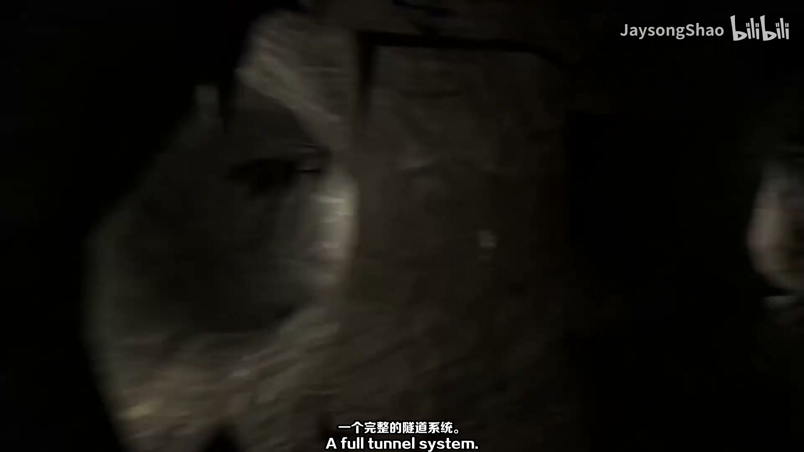
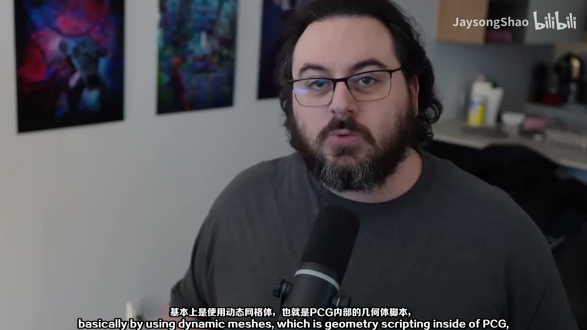
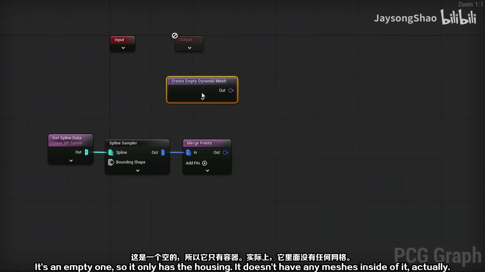
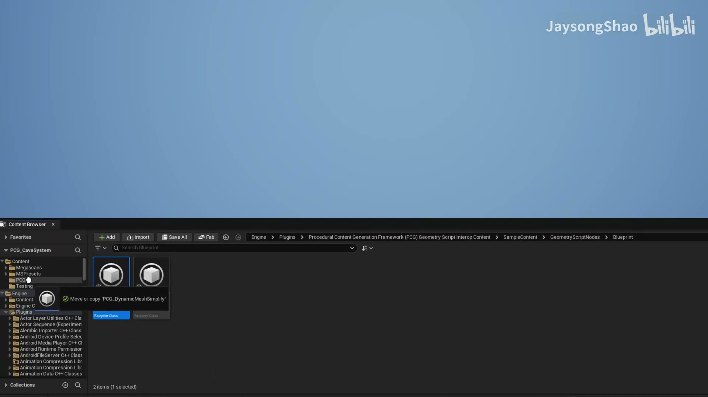
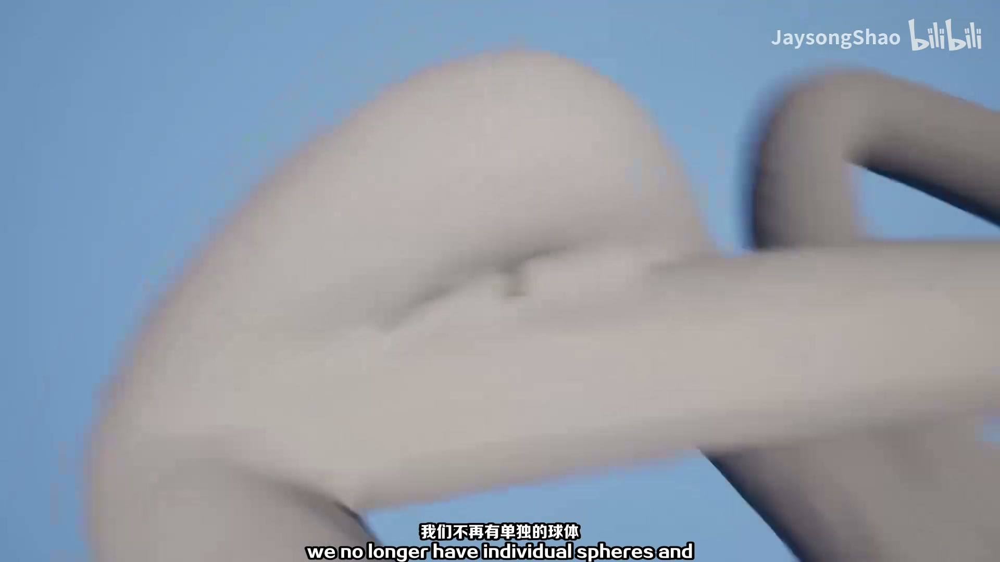
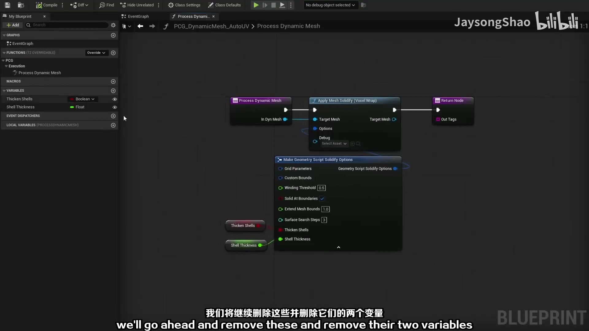

# PCG 隧道系统 01：Blueprint Tunnel 与样条输入

## 知识目标

- 围绕“PCG 隧道系统 01：Blueprint Tunnel 与样条输入”整理 PCG 视频中的输入数据、图表规则、关键节点、参数风险和最终生成结果。
- 阅读时重点区分三层：输入来源（点、样条、表面、体积、Actor 或属性）、规则处理（采样、过滤、变换、分区、循环、HLSL 或子图）、输出方式（Static Mesh Spawner、Spawn Actor、Spline Mesh、Blueprint 或 Dynamic Mesh）。

## 可复现主流程

- 确认 PCG Graph/PCG Component 已绑定到正确 Actor，并先用 Debug/Inspect 查看中间点数据。
- 明确输入来源：Spline、Surface、Mesh、Volume、Actor、Data Asset/Data Table 或手工参数。
- 在图表中按顺序处理采样、属性写入、过滤、Transform、分区/循环和输出节点。
- 生成可见结果前，先核对 Point 的 Transform、Bounds、Density、Seed 和自定义 Attribute。
- 用 Static Mesh Spawner 输出大量网格实例；需要蓝图逻辑时改用 Spawn Actor 或 Blueprint 交互。
- 涉及 Dynamic Mesh 或 Geometry Script 时，先小规模验证布尔、倒角、修补和 UV，再扩展到批量生成。

## 关键术语

- `PCG`、`Blueprint`、`蓝图`、`Mesh`、`Spline`、`Point`、`Attribute`、`Actor`、`Graph`、`样条`、`网格`、`属性`、`过滤`、`采样`、`节点`、`生成`、`Solidify`、`JaysongShao`、`Dynamic Mesh`、`图表`、`组件`、`点`

## 分段知识

### 00:00:00-00:04:05 Spline 采样与路径生成

- 本段定位：Spline 采样与路径生成。
- 知识点：采样器决定点来源和分布规则；Volume、Surface、Spline 等输入要分别核对采样范围、密度和生成方向。
- 知识点：用 Actor Tag 标记输入体积后，Get Actor Data / Volume Sampler 才能稳定识别生成区和排除区。
- 复现要点：先用 Debug/Inspect 核对点数量、Bounds、Density 和关键属性，再判断最终生成结果。
- 复现要点：属性命名要稳定，过滤、分区和分支节点应保留可检查的中间数据，避免后续规则难以追踪。
- 复现要点：Spline 流程要单独核对采样间距、切线、端点、交叉点和生成网格的对齐方式。
- 核对对象：`PCG`、`Spline`、`Actor`、`图表`、`组件`、`点`、`样条`、`采样`、`过滤`、`生成`。

**关键画面：**

### 00:04:08-00:09:02 Geometry Script 与 Dynamic Mesh 处理

- 本段定位：Geometry Script 与 Dynamic Mesh 处理。
- 知识点：PCG 点默认包含 Position、Rotation、Scale、Bounds、Density、Seed 等属性，自定义属性不带 `$` 前缀，Inspect 时要分清来源。
- 知识点：将 Static Mesh 或生成参数暴露为 Blueprint 变量/Graph 参数后，可在不同实例中替换生成资产。
- 知识点：Static Mesh Spawner 负责把点数据实例化为网格；替换 Mesh 时要同步检查 Transform、Density 和材质覆盖。
- 知识点：Spline 输入通常先采样为点，再用距离、切线或标签过滤道路范围内外的生成点。
- 知识点：用 Actor Tag 或 Spline 作为外部输入时，应先确认标签命中对象，再检查过滤后的点集。
- 复现要点：先用 Debug/Inspect 核对点数量、Bounds、Density 和关键属性，再判断最终生成结果。
- 复现要点：属性命名要稳定，过滤、分区和分支节点应保留可检查的中间数据，避免后续规则难以追踪。
- 复现要点：Static Mesh Spawner 用于高效实例化；Spawn Actor/Blueprint 用于需要逻辑的对象，成本和生命周期不同。
- 复现要点：Spline 流程要单独核对采样间距、切线、端点、交叉点和生成网格的对齐方式。
- 核对对象：`PCG`、`Attribute`、`Blueprint`、`Geometry Script`、`Dynamic Mesh`、`图表`、`点`、`属性`、`样条`、`生成`。

**关键画面：**

### 00:09:04-00:10:52 Spline 采样与路径生成

- 本段定位：Spline 采样与路径生成。
- 知识点：采样器决定点来源和分布规则；Volume、Surface、Spline 等输入要分别核对采样范围、密度和生成方向。
- 知识点：将 Static Mesh 或生成参数暴露为 Blueprint 变量/Graph 参数后，可在不同实例中替换生成资产。
- 知识点：Static Mesh Spawner 负责把点数据实例化为网格；替换 Mesh 时要同步检查 Transform、Density 和材质覆盖。
- 知识点：Spline 输入通常先采样为点，再用距离、切线或标签过滤道路范围内外的生成点。
- 知识点：用 Actor Tag 或 Spline 作为外部输入时，应先确认标签命中对象，再检查过滤后的点集。
- 复现要点：先用 Debug/Inspect 核对点数量、Bounds、Density 和关键属性，再判断最终生成结果。
- 复现要点：Spline 流程要单独核对采样间距、切线、端点、交叉点和生成网格的对齐方式。
- 核对对象：`Spline`、`点`、`样条`、`采样`、`生成`、`网格`。

**关键画面：**

## 复现检查

- 每个图表先检查输入数据是否正确进入 PCG Graph，再看下游生成结果。
- Debug/Inspect 时重点看点数量、Bounds、Density、Transform、Seed 和自定义 Attribute。
- Static Mesh Spawner、Spawn Actor、Spline Mesh 和 Blueprint 输出节点不能混用语义；选择前先确定是否需要实例化性能或蓝图逻辑。
- 涉及样条、分区、运行时或 GPU 生成时，必须额外验证更新触发、缓存、世界分区和性能预算。
- Dynamic Mesh/Geometry Script 流程要单独测试布尔、倒角、网格修补、UV 和保存 Static Mesh 的成本。
