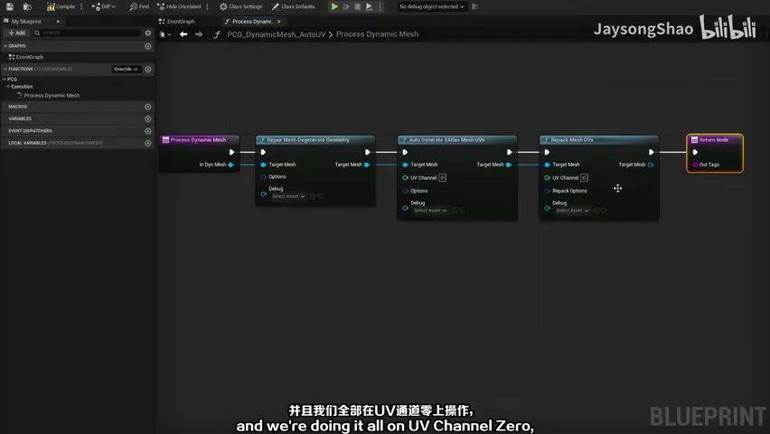
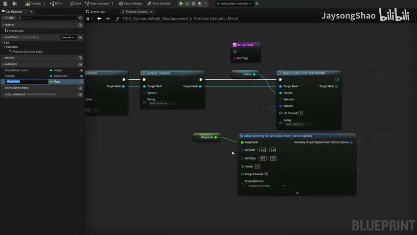
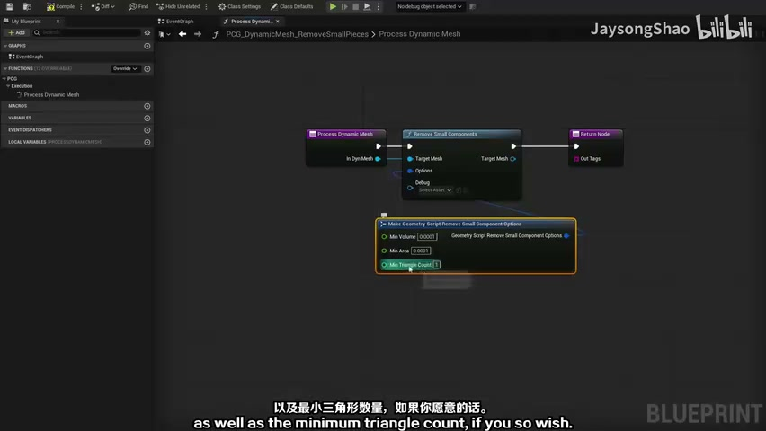
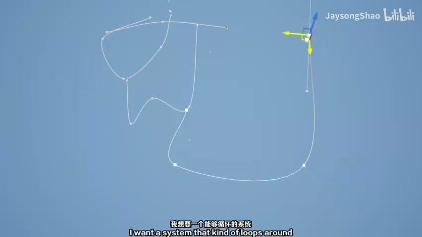
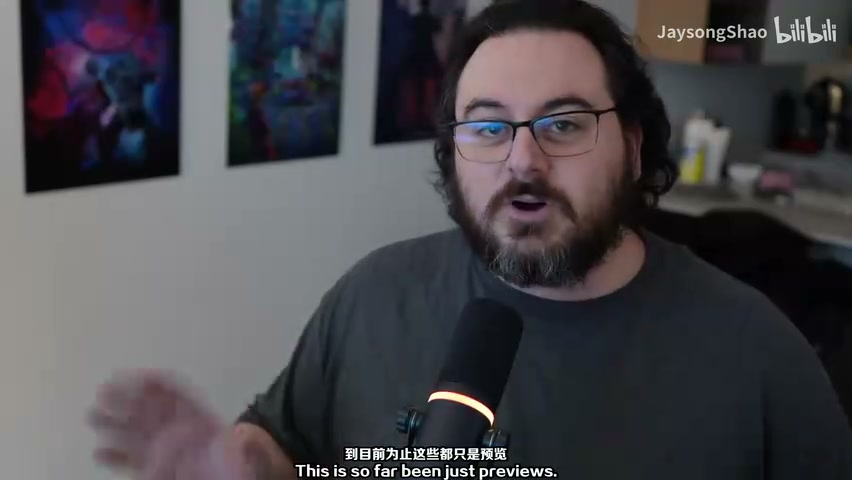

# PCG 隧道系统 02：动态网格处理与隧道段生成

## 知识目标

- 围绕“PCG 隧道系统 02：动态网格处理与隧道段生成”整理 UE PCG 隧道系统的制作流程：用蓝图 Spline 定义隧道路线，用 PCG/Geometry Script 读取路径并生成隧道模块，最终形成可复用、可调参、可在关卡中重生成的隧道工具。

## 可复现主流程

- 从 spline 或 Actor 数据中提取路径点，建立沿路径生成隧道的基础点流。
- 根据路径长度、模块长度或采样间距生成等距点，避免隧道段重叠或断裂。
- 用 Transform/rotation/tangent 相关节点对齐每个隧道模块，使 mesh 朝向跟随 spline。
- 接入 Static Mesh Spawner 或动态网格生成逻辑，先生成可检查的基础隧道段。

## 关键术语

- `PCG`
- `Blueprint`
- `Mesh`
- `Loop`
- `Graph`
- `样条`
- `网格`
- `体积`
- `材质`
- `采样`
- `参数`
- `节点`
- `生成`
- `Process`
- `JaysongShao`
- `Dynamic`
- `LOCAL`
- `BLUEPRINT`

## 操作步骤与要点

### 从 spline 或 Actor 数据中提取路径点，建立沿路径生成隧道的基础点流

**内容要点：**

- 从 spline 或 Actor 数据中提取路径点，建立沿路径生成隧道的基础点流。

**关键截图：**

**参数、节点和风险点：**

- `PCG`
- `Blueprint`
- `Mesh`
- `网格`
- `采样`
- `节点`
- `生成`
- `Process`
- `AutoEvian`
- `panp`

### 根据路径长度、模块长度或采样间距生成等距点，避免隧道段重叠或断裂

**内容要点：**

- 根据路径长度、模块长度或采样间距生成等距点，避免隧道段重叠或断裂。

**关键截图：**

**参数、节点和风险点：**

- `Mesh`
- `样条`
- `网格`
- `体积`
- `材质`
- `参数`
- `节点`
- `生成`
- `JaysongShao`
- `Lilibii`

### 用 Transform/rotation/tangent 相关节点对齐每个隧道模块，使 mesh 朝向跟随 spline

**内容要点：**

- 用 Transform/rotation/tangent 相关节点对齐每个隧道模块，使 mesh 朝向跟随 spline。

**关键截图：**

**参数、节点和风险点：**

- `Loop`
- `网格`
- `生成`
- `JaysongShao`
- `Iwantasystemthatkindofloopsaround`
- `Thisissofarbeenjustpreviews`

## 复现检查清单

- Spline 点位、隧道模块长度和采样间距必须一起检查，否则容易出现重叠、缝隙或端点错位。
- 模块朝向要跟随 spline tangent 或路径方向，不能只依赖默认世界朝向。
- 每次修改 PCG 图表后先看 Debug 点，再看最终 mesh，避免把点位问题误判为模型问题。
- 蓝图 Actor、PCG Component、PCG Graph 和几何脚本节点的引用关系要稳定，重启或重生成后仍应可复现。
- 复现时先固定随机种子，再调整密度、过滤和生成资源，避免随机结果掩盖逻辑错误。
