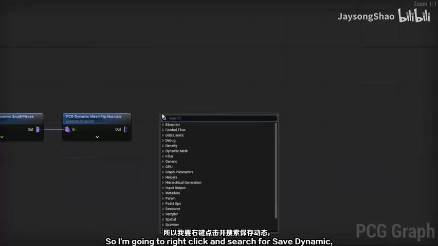
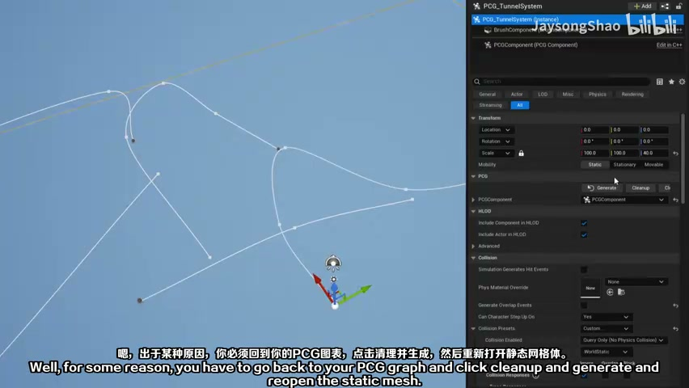
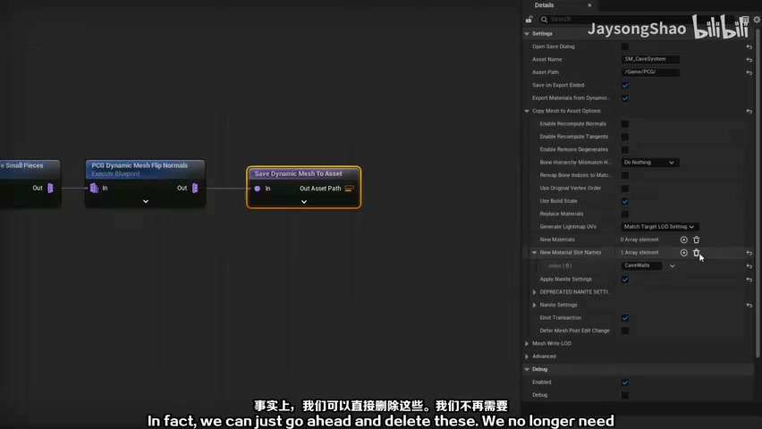
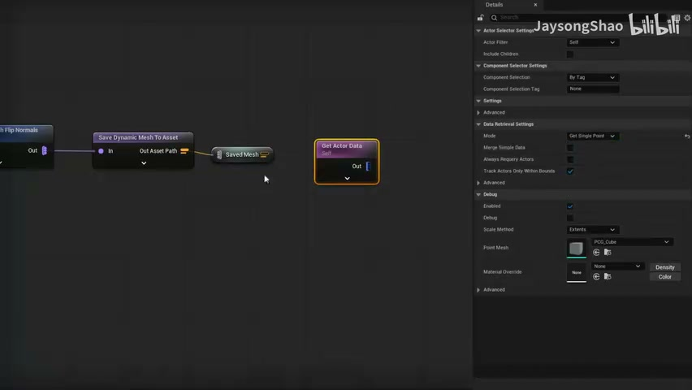
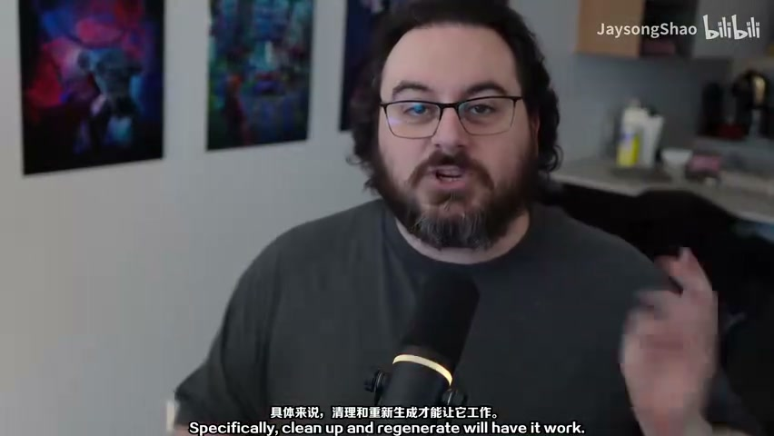
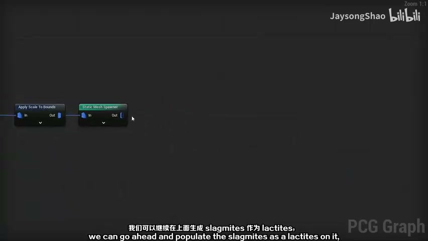

# PCG 隧道系统 03：动态网格保存、材质槽与资产化

## 知识目标

- 围绕“PCG 隧道系统 03：动态网格保存、材质槽与资产化”整理 UE PCG 隧道系统的制作流程：用蓝图 Spline 定义隧道路线，用 PCG/Geometry Script 读取路径并生成隧道模块，最终形成可复用、可调参、可在关卡中重生成的隧道工具。

## 可复现主流程

- 处理弯道、端点和连接处，让隧道模块在转向时保持连续。
- 为隧道墙体、地面或支撑结构拆出不同分支，分别控制 mesh、缩放和偏移。
- 用属性、标签或参数区分不同段落，便于后续替换模块、添加装饰或控制密度。
- 持续用 Debug 点、视口结果和局部重生成检查点位、朝向和模块边界。

## 关键术语

- `PCG`
- `Static Mesh`
- `Mesh`
- `MeshSampler`
- `Point`
- `Actor`
- `Component`
- `Spawn`
- `Bounds`
- `Density`
- `Graph`
- `Material`
- `网格`
- `体积`
- `材质`
- `属性`
- `采样`
- `参数`

## 操作步骤与要点

### 处理弯道、端点和连接处，让隧道模块在转向时保持连续

**内容要点：**

- 处理弯道、端点和连接处，让隧道模块在转向时保持连续。

**关键截图：**

**参数、节点和风险点：**

- `PCG`
- `Mesh`
- `Density`
- `Graph`
- `网格`
- `材质`
- `生成`
- `JaysongShao`
- `PCGDynamicMeshFlipNormals`

### 为隧道墙体、地面或支撑结构拆出不同分支，分别控制 mesh、缩放和偏移

**内容要点：**

- 为隧道墙体、地面或支撑结构拆出不同分支，分别控制 mesh、缩放和偏移。

**关键截图：**

**参数、节点和风险点：**

- `PCG`
- `Mesh`
- `Point`
- `Actor`
- `Material`
- `网格`
- `体积`
- `材质`
- `属性`
- `参数`

### 用属性、标签或参数区分不同段落，便于后续替换模块、添加装饰或控制密度

**内容要点：**

- 用属性、标签或参数区分不同段落，便于后续替换模块、添加装饰或控制密度。

**关键截图：**

**参数、节点和风险点：**

- `PCG`
- `Static Mesh`
- `Mesh`
- `MeshSampler`
- `Bounds`
- `Graph`
- `网格`
- `采样`
- `生成`
- `JaysongShao`

## 复现检查清单

- Spline 点位、隧道模块长度和采样间距必须一起检查，否则容易出现重叠、缝隙或端点错位。
- 模块朝向要跟随 spline tangent 或路径方向，不能只依赖默认世界朝向。
- 每次修改 PCG 图表后先看 Debug 点，再看最终 mesh，避免把点位问题误判为模型问题。
- 蓝图 Actor、PCG Component、PCG Graph 和几何脚本节点的引用关系要稳定，重启或重生成后仍应可复现。
- 复现时先固定随机种子，再调整密度、过滤和生成资源，避免随机结果掩盖逻辑错误。
