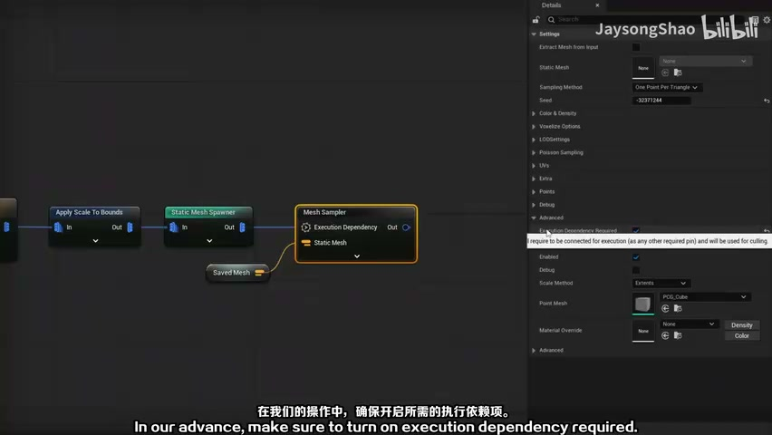
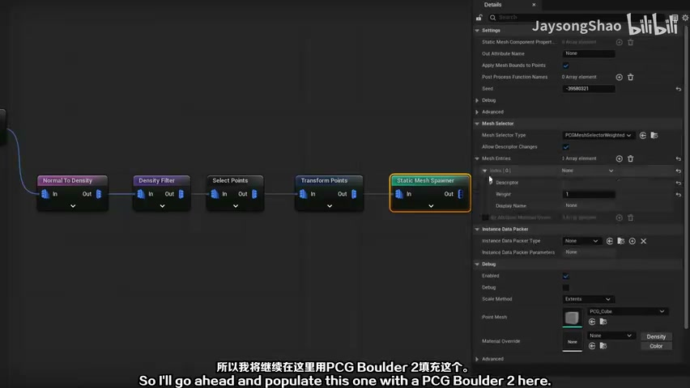
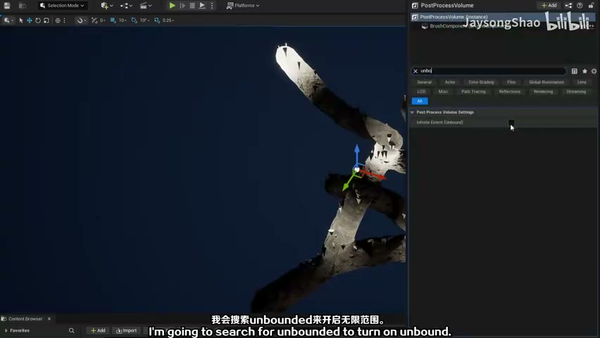
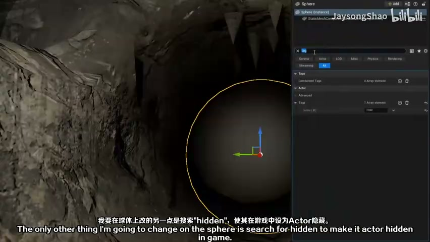
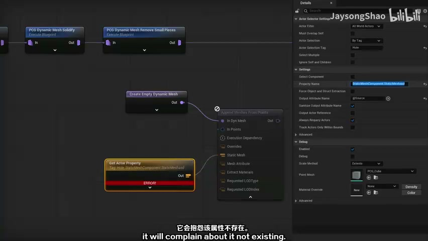
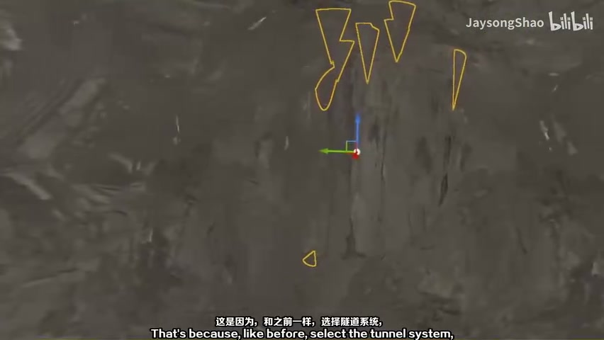

# PCG 隧道系统 04：网格采样、密度过滤与装饰生成

## 知识目标

- 围绕“PCG 隧道系统 04：网格采样、密度过滤与装饰生成”整理 UE PCG 隧道系统的制作流程：用蓝图 Spline 定义隧道路线，用 PCG/Geometry Script 读取路径并生成隧道模块，最终形成可复用、可调参、可在关卡中重生成的隧道工具。

## 可复现主流程

- 完善隧道系统的可复用参数，例如采样距离、模块尺寸、随机种子、偏移和生成开关。
- 补充细节网格、材质或装饰分支，使隧道不只是基础管线，而是可用于关卡的生成工具。
- 检查蓝图、PCG 图表和几何脚本之间的数据流，避免重生成后丢失引用或方向错误。
- 整理最终使用方式：在关卡中调整 spline 即可重新生成隧道，并保留必要的调试/验证步骤。

## 关键术语

- `PCG`
- `Static Mesh`
- `Mesh`
- `Transform`
- `Point`
- `Attribute`
- `Actor`
- `Component`
- `Spawn`
- `Bounds`
- `Density`
- `Material`
- `Instance`
- `样条`
- `网格`
- `体积`
- `材质`
- `属性`

## 操作步骤与要点

### 完善隧道系统的可复用参数，例如采样距离、模块尺寸、随机种子、偏移和生成开关

**内容要点：**

- 完善隧道系统的可复用参数，例如采样距离、模块尺寸、随机种子、偏移和生成开关。

**关键截图：**

**参数、节点和风险点：**

- `PCG`
- `Static Mesh`
- `Mesh`
- `Point`
- `Bounds`
- `网格`
- `材质`
- `属性`
- `过滤`
- `采样`

### 补充细节网格、材质或装饰分支，使隧道不只是基础管线，而是可用于关卡的生成工具

**内容要点：**

- 补充细节网格、材质或装饰分支，使隧道不只是基础管线，而是可用于关卡的生成工具。

**关键截图：**

**参数、节点和风险点：**

- `Static Mesh`
- `Mesh`
- `Actor`
- `Component`
- `Instance`
- `网格`
- `体积`
- `材质`
- `属性`
- `过滤`

### 检查蓝图、PCG 图表和几何脚本之间的数据流，避免重生成后丢失引用或方向错误

**内容要点：**

- 检查蓝图、PCG 图表和几何脚本之间的数据流，避免重生成后丢失引用或方向错误。

**关键截图：**

**参数、节点和风险点：**

- `PCG`
- `Mesh`
- `Point`
- `Actor`
- `Component`
- `样条`
- `网格`
- `属性`
- `采样`
- `生成`

## 复现检查清单

- Spline 点位、隧道模块长度和采样间距必须一起检查，否则容易出现重叠、缝隙或端点错位。
- 模块朝向要跟随 spline tangent 或路径方向，不能只依赖默认世界朝向。
- 每次修改 PCG 图表后先看 Debug 点，再看最终 mesh，避免把点位问题误判为模型问题。
- 蓝图 Actor、PCG Component、PCG Graph 和几何脚本节点的引用关系要稳定，重启或重生成后仍应可复现。
- 复现时先固定随机种子，再调整密度、过滤和生成资源，避免随机结果掩盖逻辑错误。
