# UE5 程序化管道教程

## 知识目标

- 围绕“UE5 程序化管道教程”整理 PCG 视频中的输入数据、图表规则、关键节点、参数风险和最终生成结果。
- 阅读时重点区分三层：输入来源（点、样条、表面、体积、Actor 或属性）、规则处理（采样、过滤、变换、分区、循环、HLSL 或子图）、输出方式（Static Mesh Spawner、Spawn Actor、Spline Mesh、Blueprint 或 Dynamic Mesh）。

## 可复现主流程

- 确认 PCG Graph/PCG Component 已绑定到正确 Actor，并先用 Debug/Inspect 查看中间点数据。
- 明确输入来源：Spline、Surface、Mesh、Volume、Actor、Data Asset/Data Table 或手工参数。
- 在图表中按顺序处理采样、属性写入、过滤、Transform、分区/循环和输出节点。
- 生成可见结果前，先核对 Point 的 Transform、Bounds、Density、Seed 和自定义 Attribute。
- 用 Static Mesh Spawner 输出大量网格实例；需要蓝图逻辑时改用 Spawn Actor 或 Blueprint 交互。

## 关键术语

- `蓝图`、`Mesh`、`Spline`、`Point`、`Actor`、`Spawn`、`Loop`、`Material`、`样条`、`网格`、`材质`、`过滤`、`采样`、`参数`、`节点`、`程序化`、`生成`、`Blueprint_Test`、`组件`、`点`、`循环`

## 分段知识

### 00:00:00-00:04:48 Spline 采样与路径生成

- 本段定位：Spline 采样与路径生成。
- 知识点：程序化管道先暴露管道半径、是否首尾连接等参数，后续蓝图通过这些变量控制管道粗细和连通方式。
- 知识点：通过获取样条点数量、样条点位置和切线，计算新样条段的起止位置，再用 Spline Mesh 生成管道网格。
- 复现要点：先用 Debug/Inspect 核对点数量、Bounds、Density 和关键属性，再判断最终生成结果。
- 复现要点：Spline 流程要单独核对采样间距、切线、端点、交叉点和生成网格的对齐方式。
- 核对对象：`Spline`、`点`、`样条`、`采样`、`生成`、`蓝图`、`网格`、`材质`。

**关键画面：**

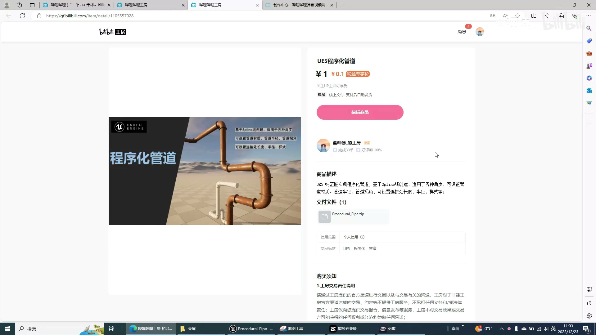
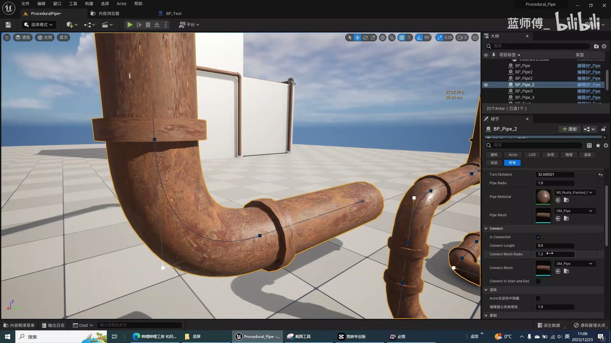

### 00:04:52-00:07:33 Spline 采样与路径生成

- 本段定位：Spline 采样与路径生成。
- 知识点：通过获取样条点数量、样条点位置和切线，计算新样条段的起止位置，再用 Spline Mesh 生成管道网格。
- 复现要点：先用 Debug/Inspect 核对点数量、Bounds、Density 和关键属性，再判断最终生成结果。
- 复现要点：Spline 流程要单独核对采样间距、切线、端点、交叉点和生成网格的对齐方式。
- 核对对象：`Spline`、`Actor`、`组件`、`点`、`样条`、`采样`、`生成`、`蓝图`、`网格`。

**关键画面：**

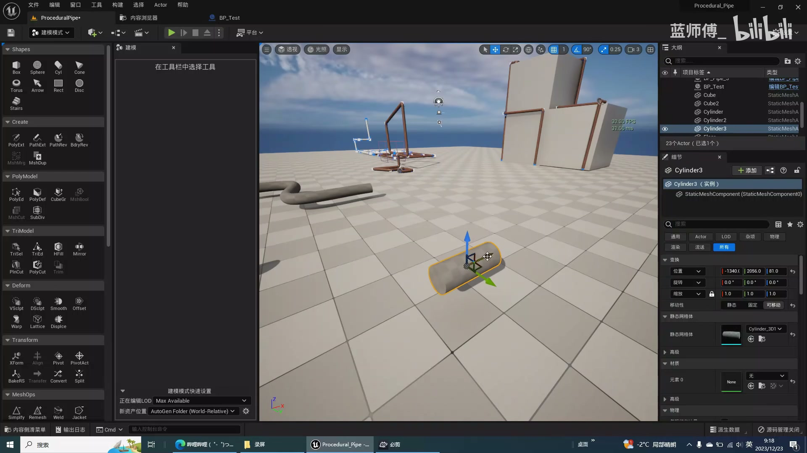
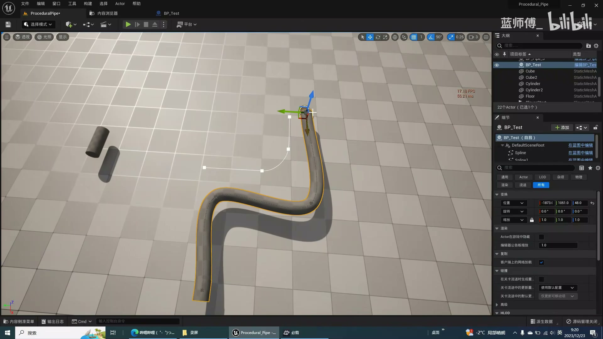

### 00:07:38-00:11:03 Spline 采样与路径生成

- 本段定位：Spline 采样与路径生成。
- 知识点：通过获取样条点数量、样条点位置和切线，计算新样条段的起止位置，再用 Spline Mesh 生成管道网格。
- 复现要点：先用 Debug/Inspect 核对点数量、Bounds、Density 和关键属性，再判断最终生成结果。
- 复现要点：Spline 流程要单独核对采样间距、切线、端点、交叉点和生成网格的对齐方式。
- 核对对象：`Spline`、`组件`、`点`、`样条`、`采样`、`生成`、`网格`。

**关键画面：**

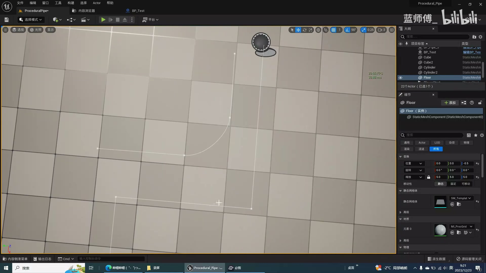
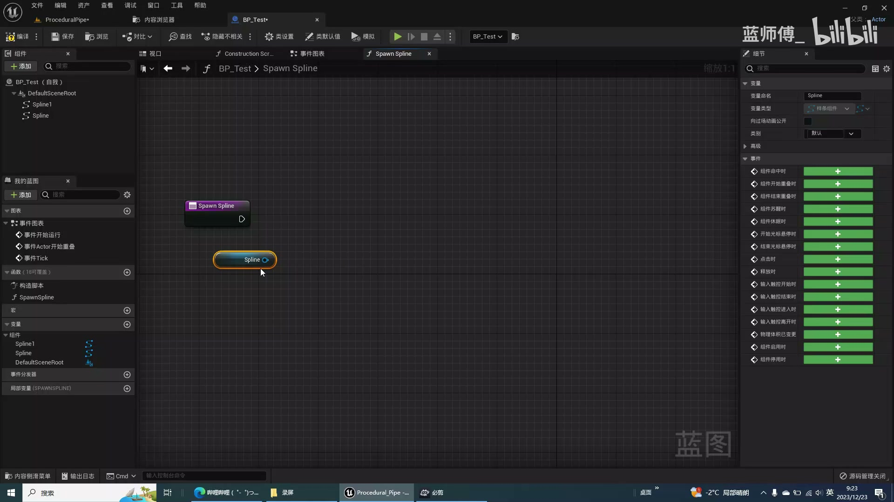

### 00:11:05-00:14:11 Spline 采样与路径生成

- 本段定位：Spline 采样与路径生成。
- 知识点：通过获取样条点数量、样条点位置和切线，计算新样条段的起止位置，再用 Spline Mesh 生成管道网格。
- 复现要点：先用 Debug/Inspect 核对点数量、Bounds、Density 和关键属性，再判断最终生成结果。
- 复现要点：Spline 流程要单独核对采样间距、切线、端点、交叉点和生成网格的对齐方式。
- 核对对象：`Spline`、`点`、`样条`、`采样`、`循环`、`生成`。

**关键画面：**

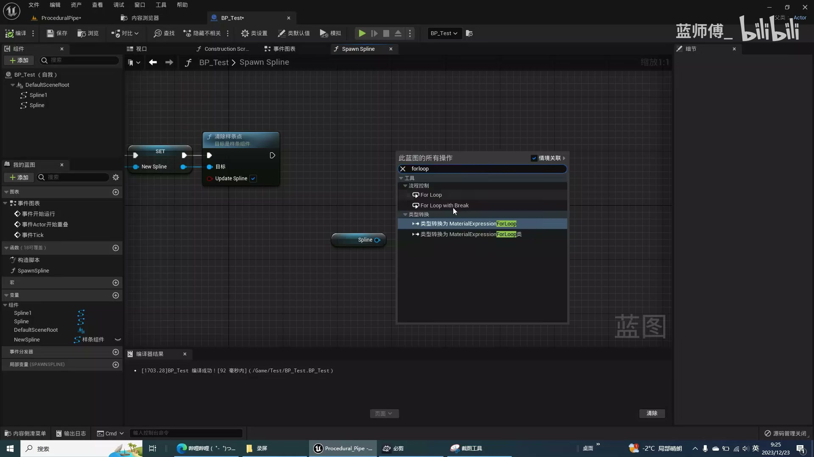
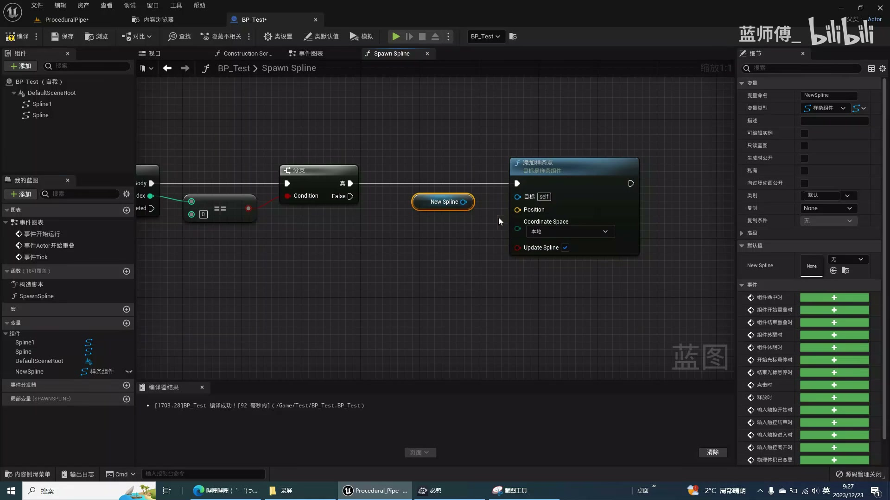

### 00:14:17-00:17:14 Spline 采样与路径生成

- 本段定位：Spline 采样与路径生成。
- 知识点：通过获取样条点数量、样条点位置和切线，计算新样条段的起止位置，再用 Spline Mesh 生成管道网格。
- 复现要点：先用 Debug/Inspect 核对点数量、Bounds、Density 和关键属性，再判断最终生成结果。
- 复现要点：Spline 流程要单独核对采样间距、切线、端点、交叉点和生成网格的对齐方式。
- 核对对象：`Spline`、`点`、`样条`、`采样`、`生成`。

**关键画面：**

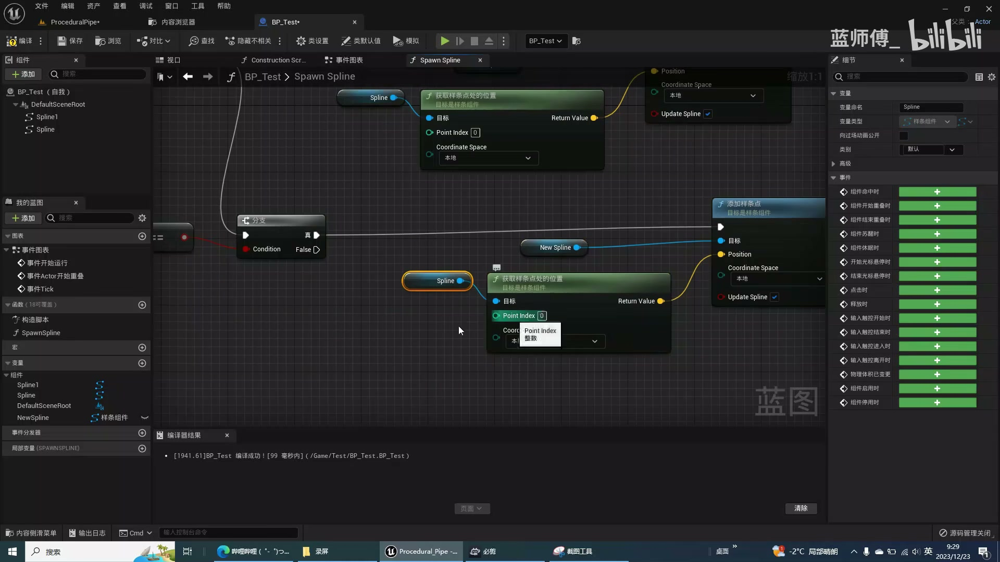
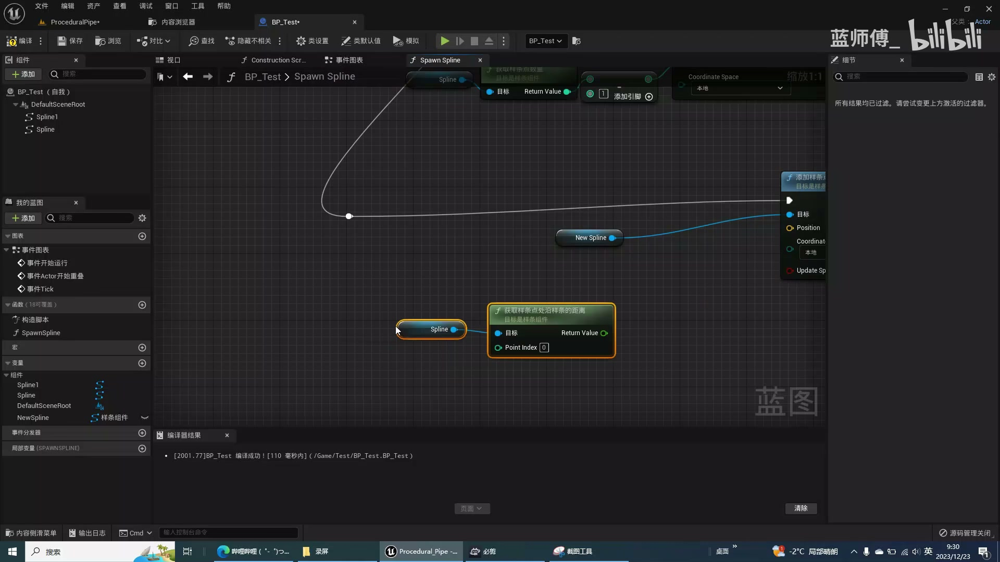

### 00:17:17-00:20:57 Spline 采样与路径生成

- 本段定位：Spline 采样与路径生成。
- 知识点：通过获取样条点数量、样条点位置和切线，计算新样条段的起止位置，再用 Spline Mesh 生成管道网格。
- 复现要点：先用 Debug/Inspect 核对点数量、Bounds、Density 和关键属性，再判断最终生成结果。
- 复现要点：Spline 流程要单独核对采样间距、切线、端点、交叉点和生成网格的对齐方式。
- 核对对象：`Spline`、`点`、`样条`、`采样`、`生成`。

**关键画面：**

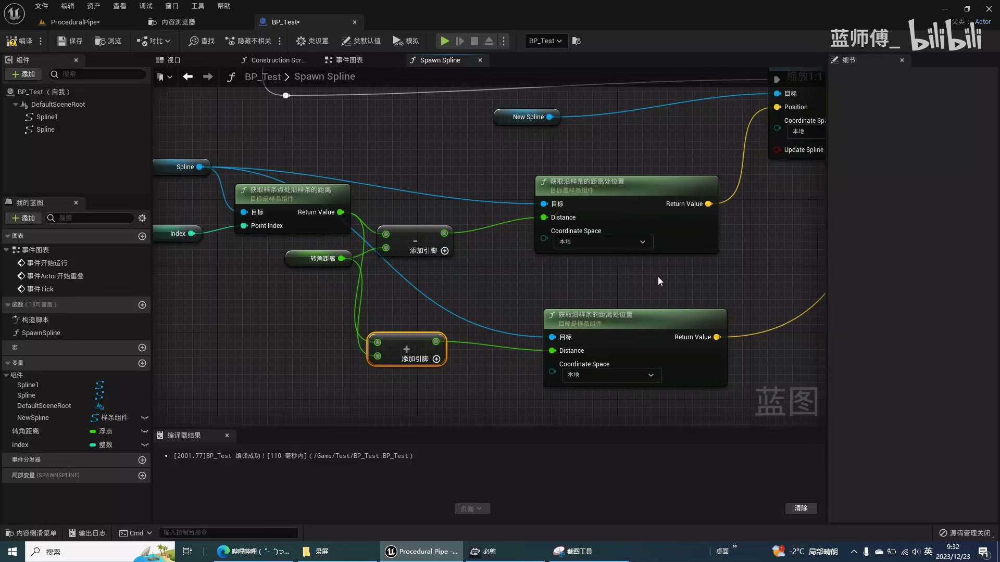
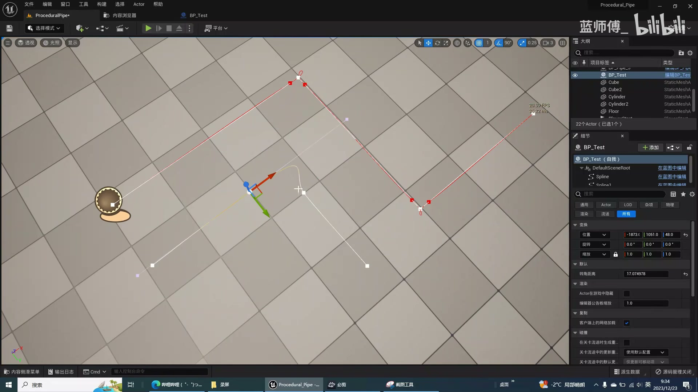

### 00:21:00-00:23:48 Spline 采样与路径生成

- 本段定位：Spline 采样与路径生成。
- 知识点：通过获取样条点数量、样条点位置和切线，计算新样条段的起止位置，再用 Spline Mesh 生成管道网格。
- 复现要点：先用 Debug/Inspect 核对点数量、Bounds、Density 和关键属性，再判断最终生成结果。
- 复现要点：Spline 流程要单独核对采样间距、切线、端点、交叉点和生成网格的对齐方式。
- 核对对象：`Spline`、`点`、`样条`、`采样`、`循环`、`生成`。

**关键画面：**

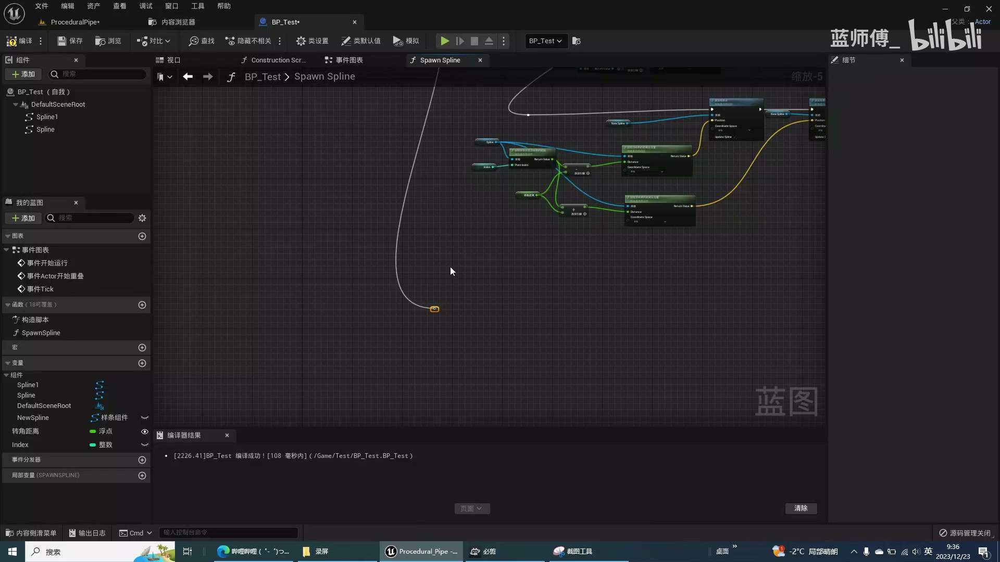
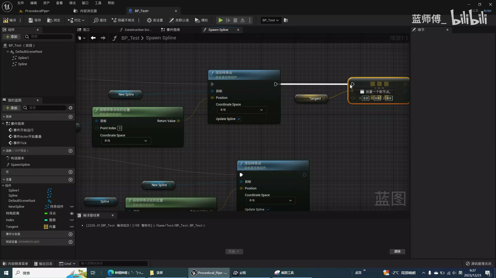

### 00:24:01-00:27:22 点数据、Bounds 与采样来源

- 本段定位：点数据、Bounds 与采样来源。
- 知识点：通过获取样条点数量、样条点位置和切线，计算新样条段的起止位置，再用 Spline Mesh 生成管道网格。
- 复现要点：先用 Debug/Inspect 核对点数量、Bounds、Density 和关键属性，再判断最终生成结果。
- 核对对象：`Bounds`、`点`、`点数据`、`采样`。

**关键画面：**

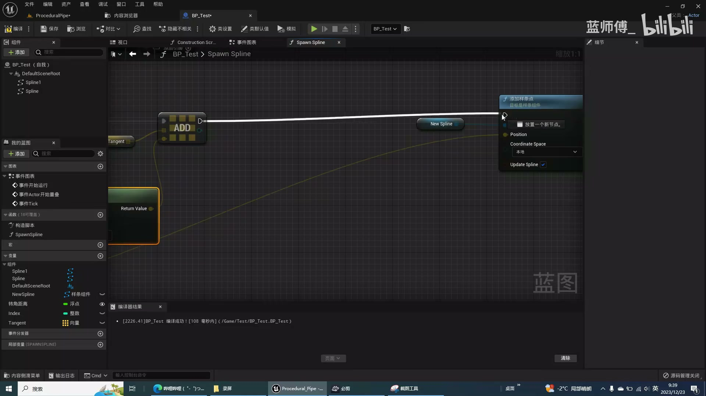
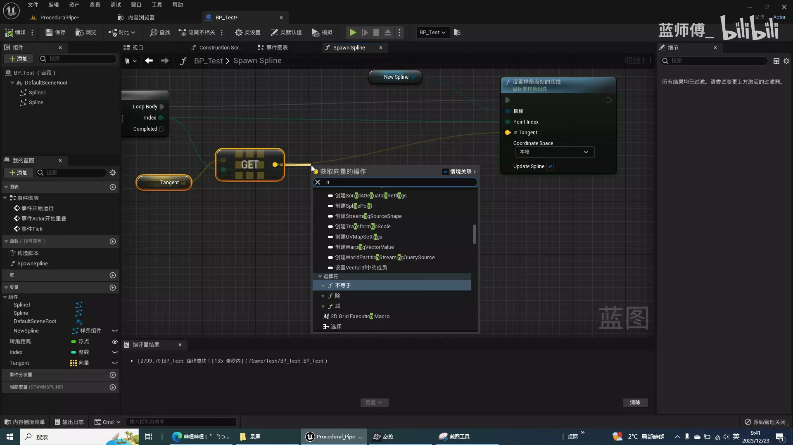

### 00:27:30-00:30:30 Spline 采样与路径生成

- 本段定位：Spline 采样与路径生成。
- 知识点：通过获取样条点数量、样条点位置和切线，计算新样条段的起止位置，再用 Spline Mesh 生成管道网格。
- 复现要点：先用 Debug/Inspect 核对点数量、Bounds、Density 和关键属性，再判断最终生成结果。
- 复现要点：Spline 流程要单独核对采样间距、切线、端点、交叉点和生成网格的对齐方式。
- 核对对象：`Spline`、`点`、`样条`、`采样`、`循环`、`生成`、`网格`。

**关键画面：**

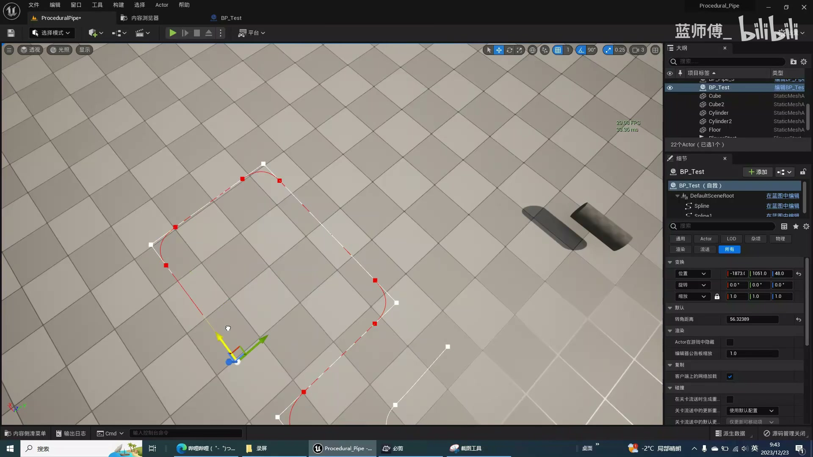
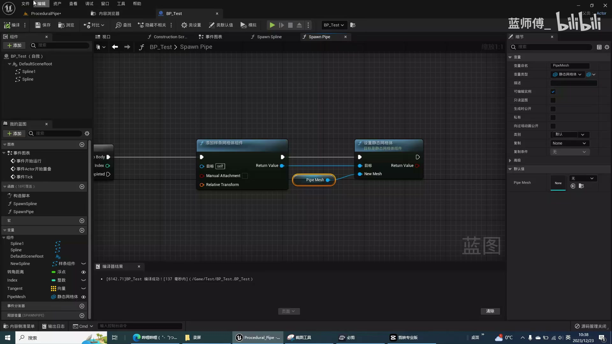

### 00:30:34-00:33:44 Spline 采样与路径生成

- 本段定位：Spline 采样与路径生成。
- 知识点：程序化管道先暴露管道半径、是否首尾连接等参数，后续蓝图通过这些变量控制管道粗细和连通方式。
- 知识点：通过获取样条点数量、样条点位置和切线，计算新样条段的起止位置，再用 Spline Mesh 生成管道网格。
- 复现要点：先用 Debug/Inspect 核对点数量、Bounds、Density 和关键属性，再判断最终生成结果。
- 复现要点：Spline 流程要单独核对采样间距、切线、端点、交叉点和生成网格的对齐方式。
- 核对对象：`Spline`、`点`、`样条`、`采样`、`生成`、`网格`、`材质`。

**关键画面：**

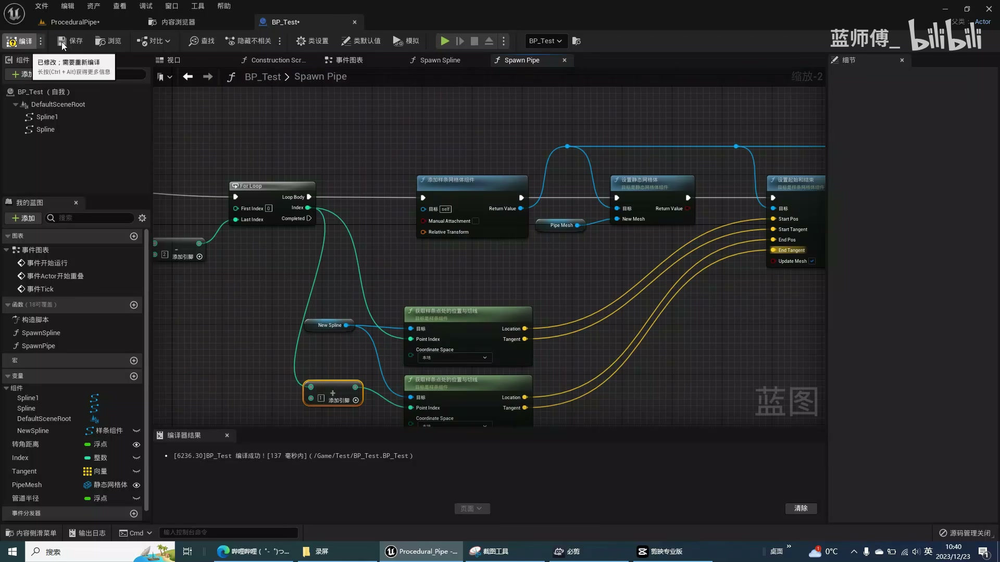
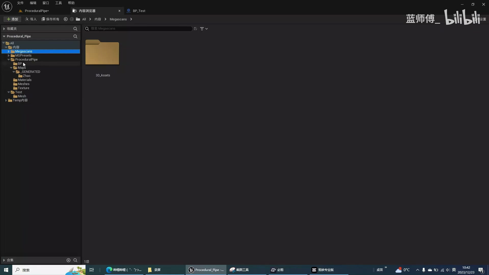

## 复现检查

- 每个图表先检查输入数据是否正确进入 PCG Graph，再看下游生成结果。
- Debug/Inspect 时重点看点数量、Bounds、Density、Transform、Seed 和自定义 Attribute。
- Static Mesh Spawner、Spawn Actor、Spline Mesh 和 Blueprint 输出节点不能混用语义；选择前先确定是否需要实例化性能或蓝图逻辑。
- 涉及样条、分区、运行时或 GPU 生成时，必须额外验证更新触发、缓存、世界分区和性能预算。
