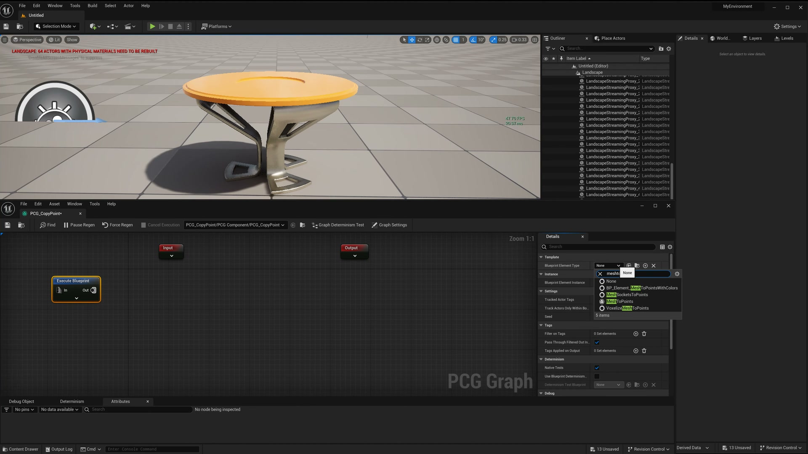
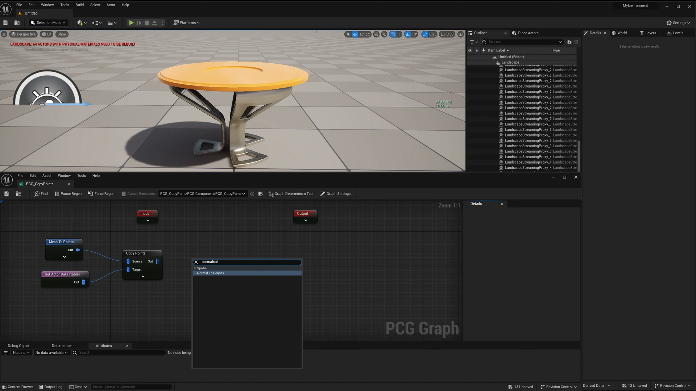
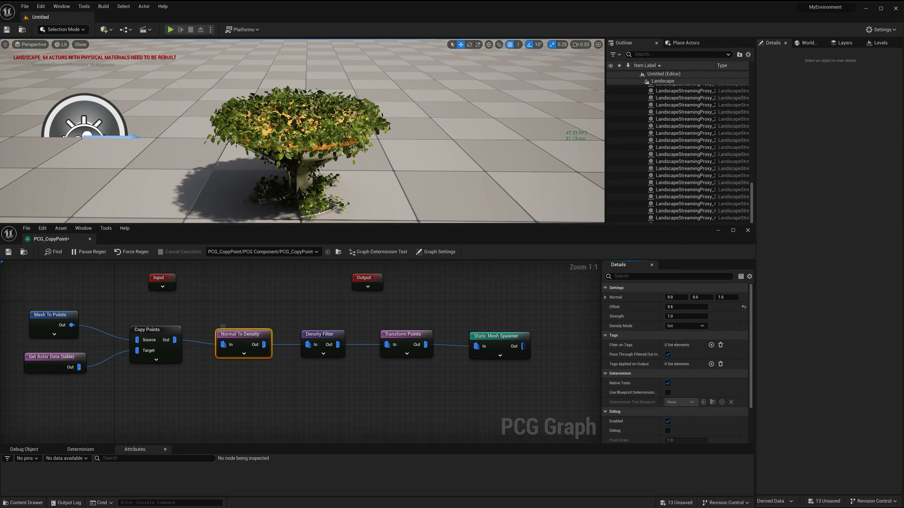
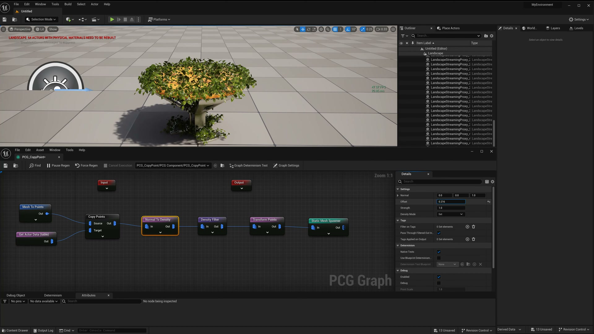

# 【UE5.3 PCG教程】PCG MeshToPoints节点在网格表面添加细节

## 知识目标

- 使用 MeshToPoints 把网格表面转换为点集，再在这些点上生成细节资产。

## 可复现主流程

- 选择要作为承载表面的 Static Mesh 或 Actor。
- 用 MeshToPoints 把网格表面、顶点或三角面转换成 PCG Points。
- 根据法线、密度或范围过滤点，避免细节出现在不需要的位置。
- 接入 Static Mesh Spawner/HISM 生成草、石块、装饰件等表面细节。

## 关键术语

- `PCG`
- `Blueprint`
- `Mesh`
- `MeshToPoints`
- `Transform`
- `Point`
- `Attribute`
- `Actor`
- `Component`
- `Spawn`
- `Density`
- `Seed`
- `Graph`
- `Instance`
- `Landscape`
- `网格`
- `节点`
- `PCG_CopyPoint`

## 操作步骤与要点

### 选择要作为承载表面的 Static Mesh 或 Actor

**内容要点：**

- 这一段对应“选择要作为承载表面的 Static Mesh 或 Actor。”，主要作用是把本集主题“【UE5.3 PCG教程】PCG MeshToPoints节点在网格表面添加细节”中的该流程环节落到具体节点、参数或资产操作上。

- 画面线索：`EditWindowToolsBuildSelect`
- 画面线索：`MyEnvironment`
- 画面线索：`Platforms`
- 画面线索：`OLi`
- 画面线索：`A+821410`
- 画面线索：`Detailsx`
- 画面线索：`World...`
- 画面线索：`QSearch.`

**关键截图：**

**参数、节点和风险点：**

- `PCG`
- `Point`
- `Landscape`
- `EditWindowToolsBuildSelect`
- `MyEnvironment`
- `Platforms`
- `Detailsx`
- `ItemLabel`
- `Type`
- `object`

### 根据法线、密度或范围过滤点，避免细节出现在不需要的位置

**内容要点：**

- 这一段对应“根据法线、密度或范围过滤点，避免细节出现在不需要的位置。”，主要作用是把本集主题“【UE5.3 PCG教程】PCG MeshToPoints节点在网格表面添加细节”中的该流程环节落到具体节点、参数或资产操作上。

- 画面线索：`EditWindowToolsBuildSelect`
- 画面线索：`MyEnvironment`
- 画面线索：`Platforms`
- 画面线索：`OLit`
- 画面线索：`Detailsx`
- 画面线索：`World...`
- 画面线索：`ItemLabel`
- 画面线索：`Type`

**关键截图：**

**参数、节点和风险点：**

- `PCG`
- `Point`
- `Landscape`
- `EditWindowToolsBuildSelect`
- `MyEnvironment`
- `Platforms`
- `OLit`
- `Detailsx`
- `ItemLabel`
- `Type`

## 复现检查清单

- 点的朝向应跟随表面法线。
- 生成密度应先低后高调试，避免一次性生成过多实例。
- 复现时先固定随机种子，再调整密度、过滤和生成资源，避免随机结果掩盖逻辑错误。
