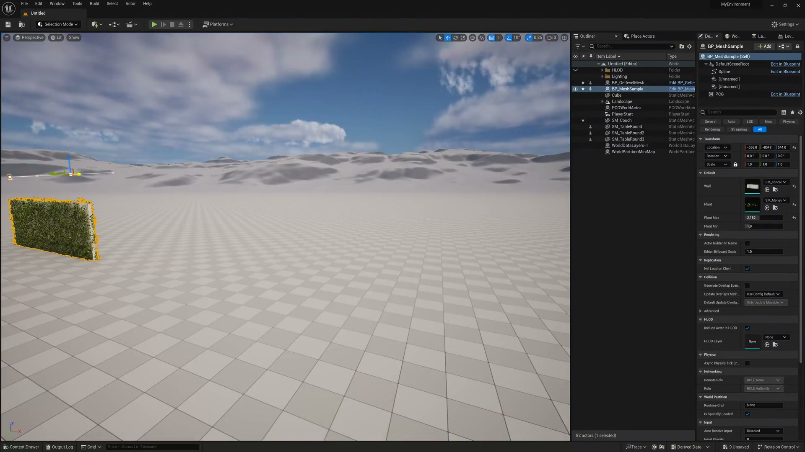
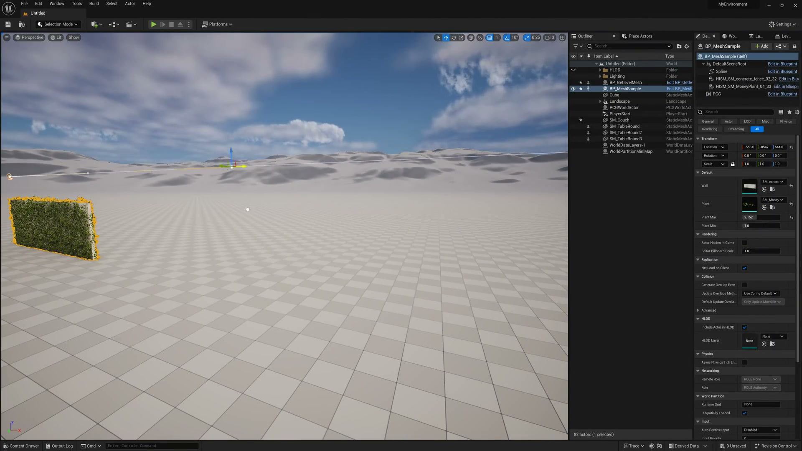
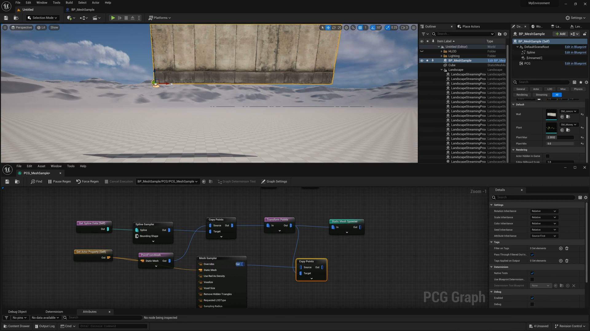
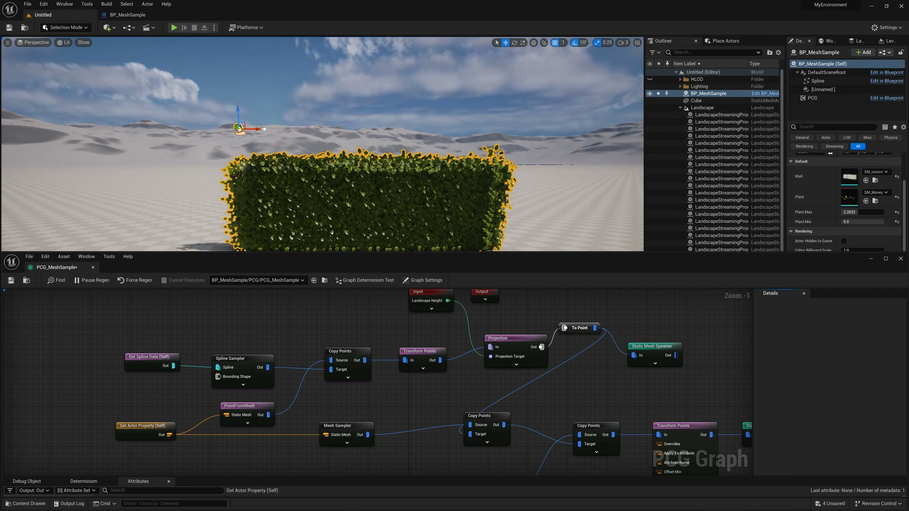

# 【UE5.3 PCG教程】PCG MeshSampler节点在网格表面添加细节

## 知识目标

- 使用 MeshSampler 从网格表面采样点，并基于采样结果放置细节实例。

## 可复现主流程

- 把目标网格接入 MeshSampler，明确采样来源和采样模式。
- 调节采样密度、随机种子和边界限制，得到可控的点分布。
- 读取采样点的法线、位置或表面属性，用于后续旋转、缩放和过滤。
- 把采样点接入实例生成节点，检查细节是否贴合网格表面。

## 关键术语

- `PCG`
- `Blueprint`
- `Static Mesh`
- `Mesh`
- `MeshSampler`
- `Spline`
- `Transform`
- `Point`
- `Attribute`
- `Actor`
- `Spawn`
- `Grid`
- `Density`
- `Seed`
- `Graph`
- `HISM`
- `Landscape`
- `网格`

## 操作步骤与要点

### 把目标网格接入 MeshSampler，明确采样来源和采样模式

**内容要点：**

- 这一段对应“把目标网格接入 MeshSampler，明确采样来源和采样模式。”，主要作用是把本集主题“【UE5.3 PCG教程】PCG MeshSampler节点在网格表面添加细节”中的该流程环节落到具体节点、参数或资产操作上。

- 画面线索：`MyEnvironment`
- 画面线索：`Platforms`
- 画面线索：`PerspectiveLitShow`
- 画面线索：`+3#曲1410`
- 画面线索：`DexWo.`
- 画面线索：`La..`
- 画面线索：`Lev`
- 画面线索：`BP_MeshSample`

**关键截图：**

**参数、节点和风险点：**

- `Blueprint`
- `Mesh`
- `Spline`
- `BP_MeshSample`
- `MyEnvironment`
- `Platforms`
- `PerspectiveLitShow`
- `DexWo`
- `ItemLabel`
- `Type`

### 调节采样密度、随机种子和边界限制，得到可控的点分布

**内容要点：**

- 这一段对应“调节采样密度、随机种子和边界限制，得到可控的点分布。”，主要作用是把本集主题“【UE5.3 PCG教程】PCG MeshSampler节点在网格表面添加细节”中的该流程环节落到具体节点、参数或资产操作上。

- 画面线索：`Hep`
- 画面线索：`MyEnvironment`
- 画面线索：`BP_MeshSample`
- 画面线索：`Platforms`
- 画面线索：`LitShow`
- 画面线索：`D3`
- 画面线索：`De.xWo..`
- 画面线索：`La.`

**关键截图：**

**参数、节点和风险点：**

- `Blueprint`
- `Mesh`
- `BP_MeshSample`
- `MyEnvironment`
- `Platforms`
- `LitShow`
- `ItemLabel`
- `Type`
- `Self`
- `Editor`

### 读取采样点的法线、位置或表面属性，用于后续旋转、缩放和过滤

**内容要点：**

- 这一段对应“读取采样点的法线、位置或表面属性，用于后续旋转、缩放和过滤。”，主要作用是把本集主题“【UE5.3 PCG教程】PCG MeshSampler节点在网格表面添加细节”中的该流程环节落到具体节点、参数或资产操作上。

- 画面线索：`Hep`
- 画面线索：`MyEnvironment`
- 画面线索：`BP_MeshSample`
- 画面线索：`Platforms`
- 画面线索：`PerspectiveLitShow`
- 画面线索：`De.xWo..`
- 画面线索：`La..`
- 画面线索：`Lev..`

**关键截图：**

**参数、节点和风险点：**

- `Blueprint`
- `Mesh`
- `Spline`
- `BP_MeshSample`
- `MyEnvironment`
- `Platforms`
- `PerspectiveLitShow`
- `ItemLabel`
- `Type`
- `Self`

## 复现检查清单

- MeshSampler 与 MeshToPoints 的输出分布不同，复现时要按画面里的节点名确认。
- 需要留意局部坐标和世界坐标的转换。
- 复现时先固定随机种子，再调整密度、过滤和生成资源，避免随机结果掩盖逻辑错误。
