# 【UE5.3 PCG教程】PCG生成实例化同时自定义属性与材质联动

## 知识目标

- 在 PCG 实例化时写入自定义属性，并让材质读取这些属性实现颜色、强度或随机变化。

## 可复现主流程

- 在点数据上创建或修改自定义 Attribute，例如颜色、随机值、索引或权重。
- 实例化时把 Attribute 传递给 Static Mesh/HISM 或材质参数。
- 在材质里读取 Per Instance Custom Data 或对应参数。
- 通过 PCG 重新生成验证实例和材质显示是否同步变化。

## 关键术语

- `PCG`
- `Blueprint`
- `Mesh`
- `Transform`
- `Point`
- `Attribute`
- `Actor`
- `Component`
- `Spawn`
- `Grid`
- `Bounds`
- `Density`
- `Seed`
- `Loop`
- `Graph`
- `Material`
- `Instance`
- `HISM`

## 操作步骤与要点

### 在点数据上创建或修改自定义 Attribute，例如颜色、随机值、索引或权重

**内容要点：**

- 这一段对应“在点数据上创建或修改自定义 Attribute，例如颜色、随机值、索引或权重。”，主要作用是把本集主题“【UE5.3 PCG教程】PCG生成实例化同时自定义属性与材质联动”中的该流程环节落到具体节点、参数或资产操作上。

- 画面线索：`MyEnvironment`
- 画面线索：`Message Log`
- 画面线索：`Selection Mode`
- 画面线索：`IAI`
- 画面线索：`Platforms`
- 画面线索：`Realtime Off`
- 画面线索：`PlaceActors`
- 画面线索：`DetaxWor..`

**关键截图：**

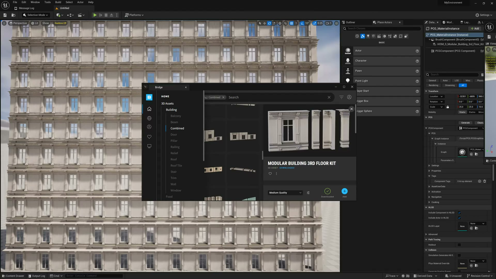
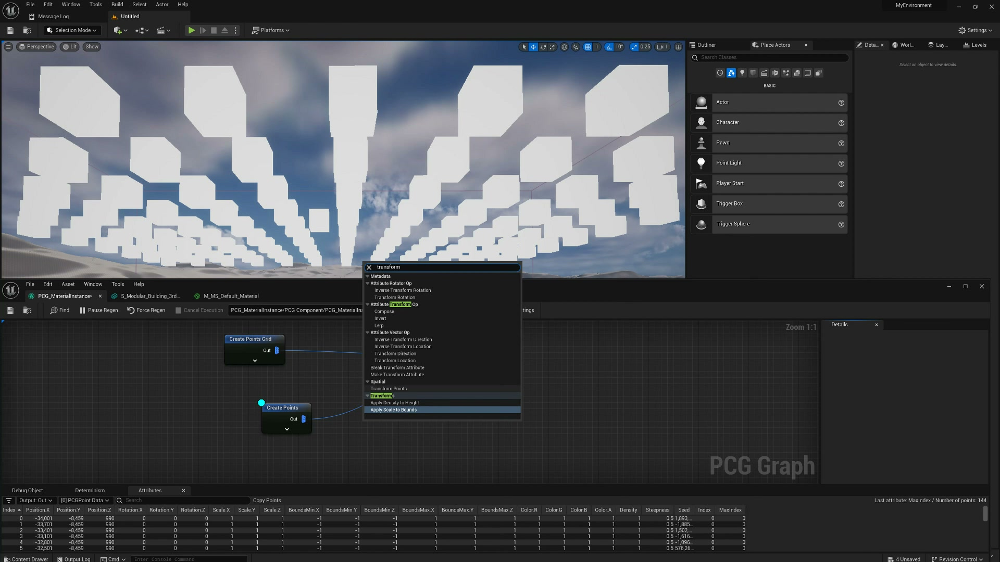

**参数、节点和风险点：**

- `PCG`
- `Actor`
- `Component`
- `Material`
- `Instance`
- `HISM`
- `PCG_Materiallnstance`
- `MyEnvironment`
- `Message`
- `Selection`

### 在点数据上创建或修改自定义 Attribute，例如颜色、随机值、索引或权重（2）

**内容要点：**

- 这一段对应“在点数据上创建或修改自定义 Attribute，例如颜色、随机值、索引或权重。”，主要作用是把本集主题“【UE5.3 PCG教程】PCG生成实例化同时自定义属性与材质联动”中的该流程环节落到具体节点、参数或资产操作上。

- 画面线索：`Hep`
- 画面线索：`MyEnvironment`
- 画面线索：`Message Log`
- 画面线索：`Selection Mode`
- 画面线索：`Platforms`
- 画面线索：`PlaceActors`
- 画面线索：`Deta._x`
- 画面线索：`Wor...`

**关键截图：**

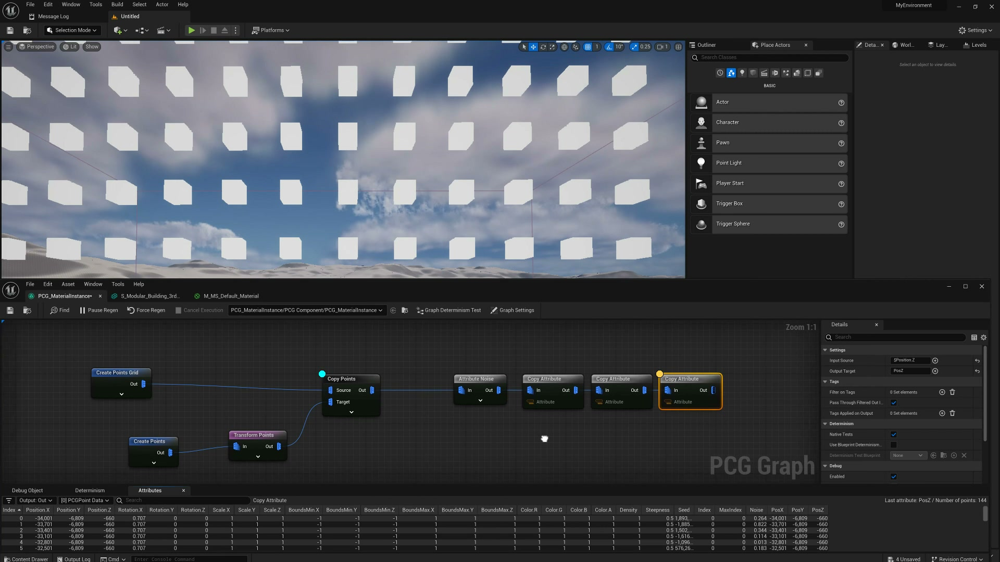
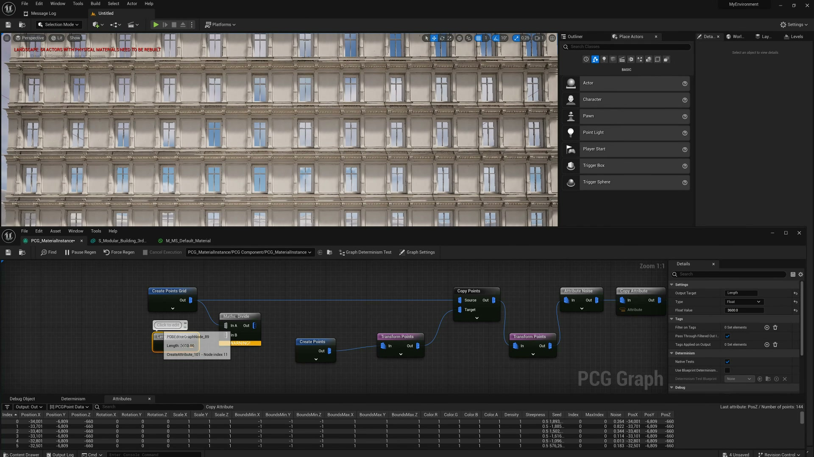

**参数、节点和风险点：**

- `Point`
- `Actor`
- `Trigger`
- `MyEnvironment`
- `Message`
- `Selection`
- `Mode`
- `Platforms`
- `PlaceActors`
- `Deta`

### 实例化时把 Attribute 传递给 Static Mesh/HISM 或材质参数

**内容要点：**

- 这一段对应“实例化时把 Attribute 传递给 Static Mesh/HISM 或材质参数。”，主要作用是把本集主题“【UE5.3 PCG教程】PCG生成实例化同时自定义属性与材质联动”中的该流程环节落到具体节点、参数或资产操作上。

- 画面线索：`MyEnvironment`
- 画面线索：`Message Log`
- 画面线索：`Selection Mode`
- 画面线索：`INIAI`
- 画面线索：`Platforms`
- 画面线索：`OLit`
- 画面线索：`PlaceActors`
- 画面线索：`Deta._x`

**关键截图：**

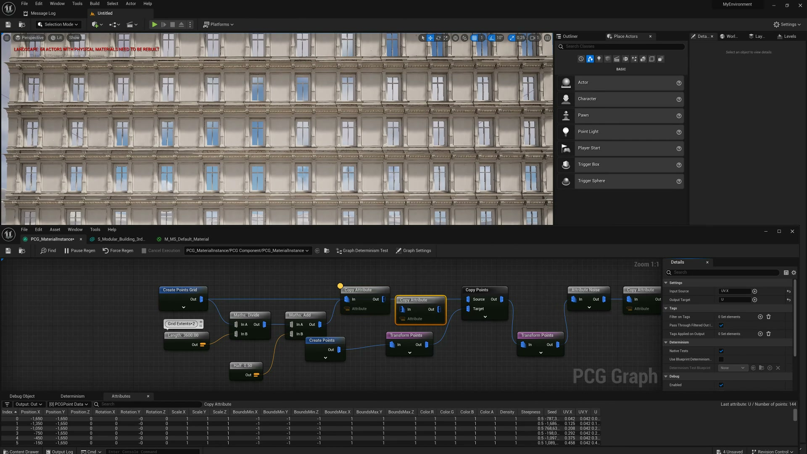
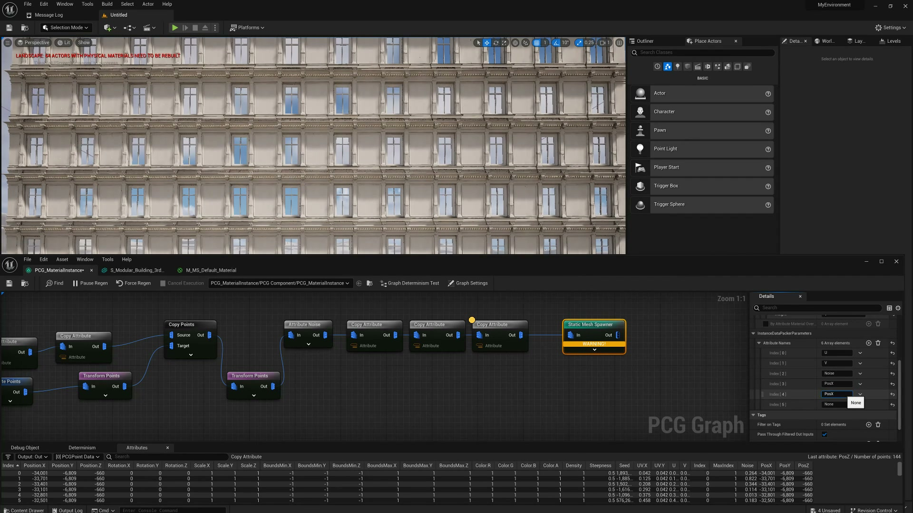

**参数、节点和风险点：**

- `Point`
- `Actor`
- `MyEnvironment`
- `Message`
- `Selection`
- `Mode`
- `INIAI`
- `Platforms`
- `OLit`
- `PlaceActors`

### 在材质里读取 Per Instance Custom Data 或对应参数

**内容要点：**

- 这一段对应“在材质里读取 Per Instance Custom Data 或对应参数。”，主要作用是把本集主题“【UE5.3 PCG教程】PCG生成实例化同时自定义属性与材质联动”中的该流程环节落到具体节点、参数或资产操作上。

- 画面线索：`Hep`
- 画面线索：`MyEnvironment`
- 画面线索：`Message Log`
- 画面线索：`Selection Mode`
- 画面线索：`INIA:`
- 画面线索：`Platforms`
- 画面线索：`PlaceActors`
- 画面线索：`Deta._x`

**关键截图：**

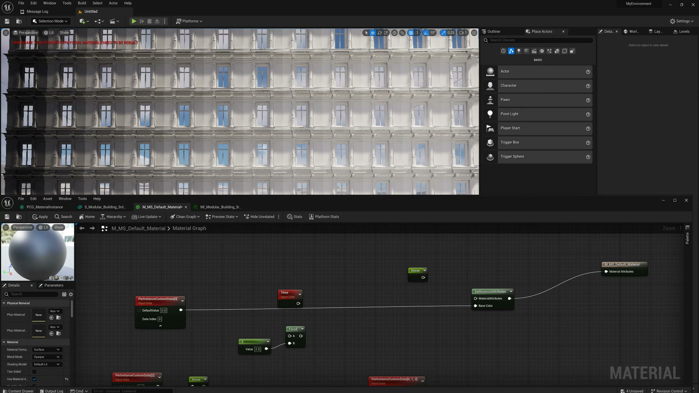
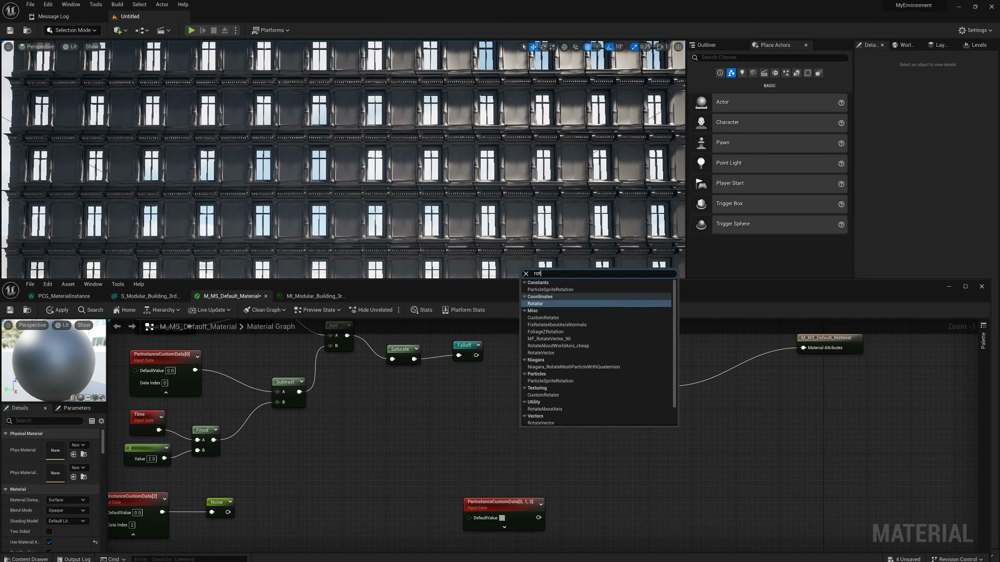

**参数、节点和风险点：**

- `Point`
- `Actor`
- `MyEnvironment`
- `Message`
- `Selection`
- `Mode`
- `INIA`
- `Platforms`
- `PlaceActors`
- `Deta`

### 在材质里读取 Per Instance Custom Data 或对应参数（2）

**内容要点：**

- 这一段对应“在材质里读取 Per Instance Custom Data 或对应参数。”，主要作用是把本集主题“【UE5.3 PCG教程】PCG生成实例化同时自定义属性与材质联动”中的该流程环节落到具体节点、参数或资产操作上。

- 画面线索：`Hep`
- 画面线索：`MyEnvironment`
- 画面线索：`Message Log`
- 画面线索：`Selection Mode`
- 画面线索：`Platforms`
- 画面线索：`Per`
- 画面线索：`PlaceActors`
- 画面线索：`Deta.x`

**关键截图：**

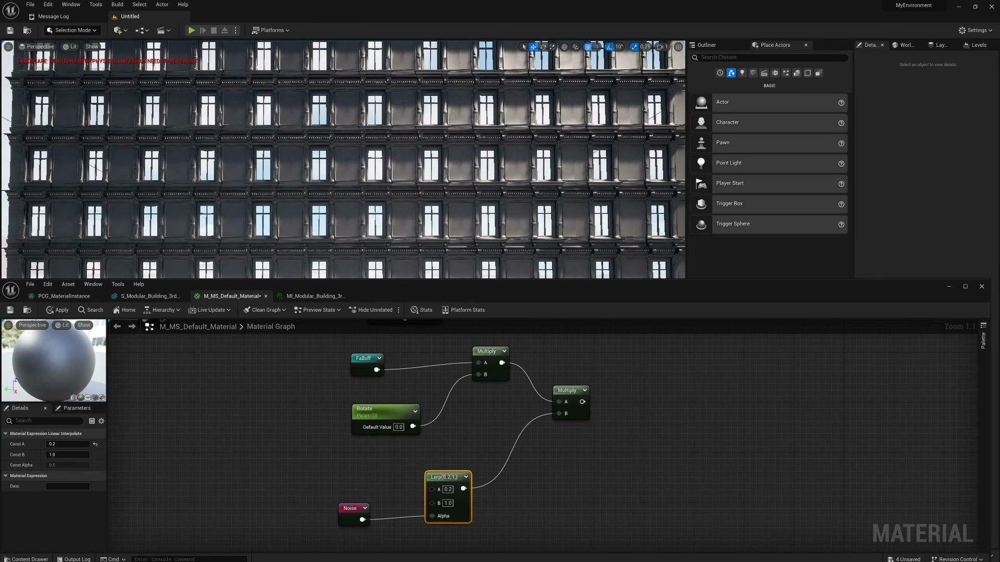
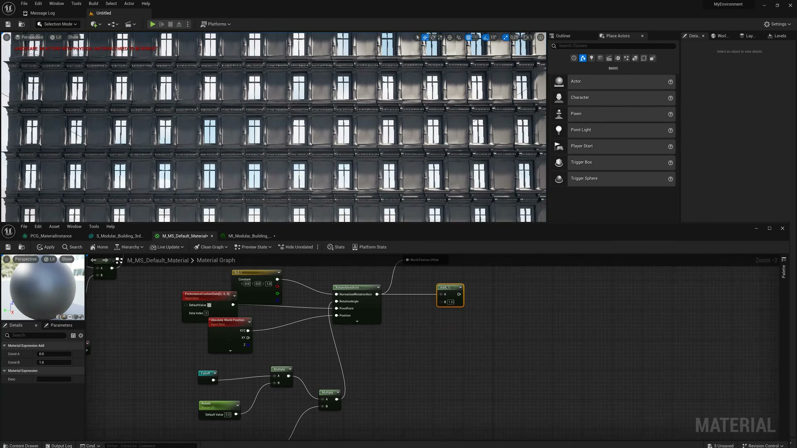

**参数、节点和风险点：**

- `Actor`
- `MyEnvironment`
- `Message`
- `Selection`
- `Mode`
- `Platforms`
- `PlaceActors`
- `Deta`
- `EREBU`
- `Clas`

### 通过 PCG 重新生成验证实例和材质显示是否同步变化

**内容要点：**

- 这一段对应“通过 PCG 重新生成验证实例和材质显示是否同步变化。”，主要作用是把本集主题“【UE5.3 PCG教程】PCG生成实例化同时自定义属性与材质联动”中的该流程环节落到具体节点、参数或资产操作上。

- 画面线索：`MyEnvironment`
- 画面线索：`Message Log`
- 画面线索：`Selection Mode`
- 画面线索：`Platforms`
- 画面线索：`OLit`
- 画面线索：`PlaceActors`
- 画面线索：`Deta_x`
- 画面线索：`Wor..`

**关键截图：**

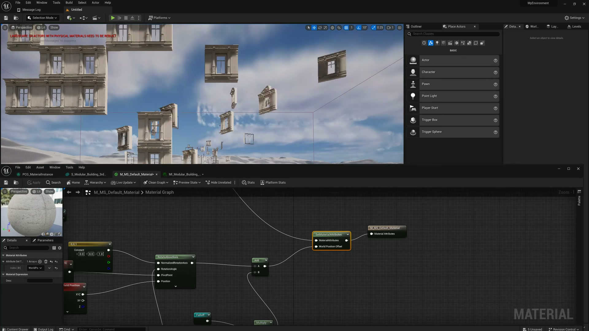
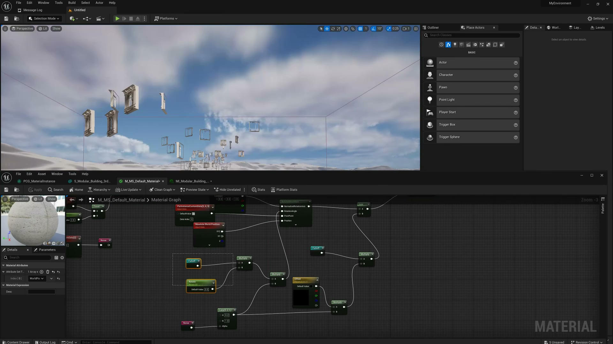

**参数、节点和风险点：**

- `Point`
- `Actor`
- `Trigger`
- `MyEnvironment`
- `Message`
- `Selection`
- `Mode`
- `Platforms`
- `OLit`
- `PlaceActors`

## 复现检查清单

- 属性名要和材质读取名一致。
- 实例化组件需要支持自定义数据传递。
- 复现时先固定随机种子，再调整密度、过滤和生成资源，避免随机结果掩盖逻辑错误。
