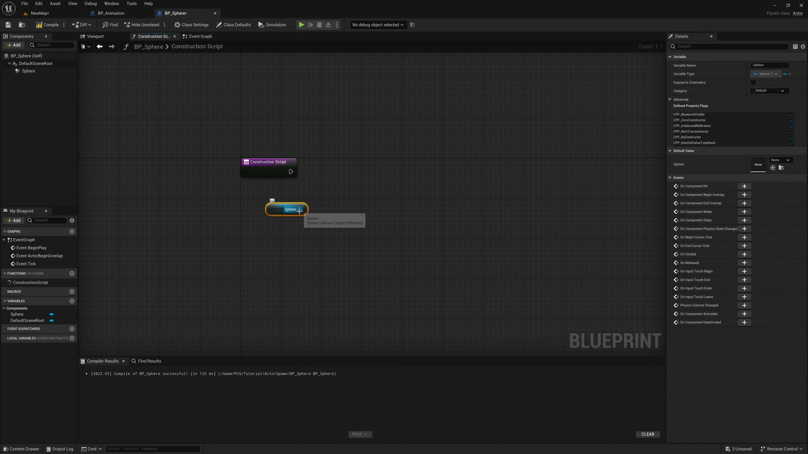
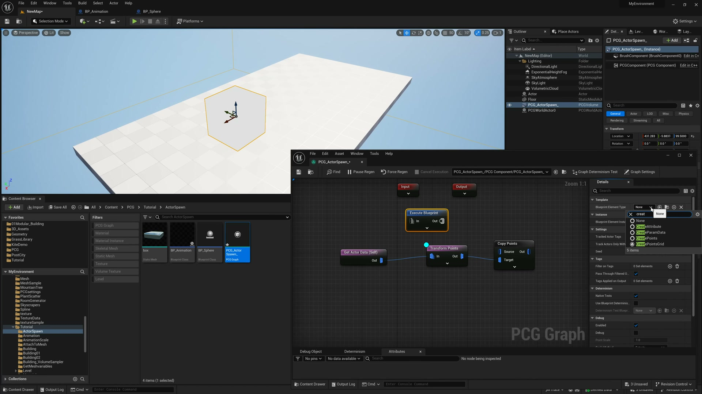

# 【UE5.3 PCG教程】PCG生成结合蓝图开发动态效果

## 知识目标

- 使用蓝图驱动 PCG 参数或生成状态，制作可交互或动态变化的生成效果。

## 可复现主流程

- 在蓝图中准备要驱动 PCG 的变量或事件。
- 把变量传入 PCG Component 或参数覆盖。
- 在运行或编辑过程中触发重新生成，让结果随变量变化。
- 检查动态效果的刷新频率和性能开销。

## 关键术语

- `PCG`
- `Blueprint`
- `蓝图`
- `Static Mesh`
- `Mesh`
- `VolumeSampler`
- `Spline`
- `Transform`
- `Point`
- `Attribute`
- `Actor`
- `Component`
- `Spawn`
- `Grid`
- `Seed`
- `Graph`
- `Material`
- `Instance`

## 操作步骤与要点

### 在蓝图中准备要驱动 PCG 的变量或事件

**内容要点：**

- 在蓝图中准备要驱动 PCG 的变量或事件。

**关键截图：**

**参数、节点和风险点：**

### 把变量传入 PCG Component 或参数覆盖

**内容要点：**

- 这一段对应“把变量传入 PCG Component 或参数覆盖。”，主要作用是把本集主题“【UE5.3 PCG教程】PCG生成结合蓝图开发动态效果”中的该流程环节落到具体节点、参数或资产操作上。

- 画面线索：`AssetView`
- 画面线索：`Debug`
- 画面线索：`NewMap*`
- 画面线索：`BP_Animation`
- 画面线索：`BP_Sphere*`
- 画面线索：`Parent class:Actor`
- 画面线索：`Compile:`
- 画面线索：`Diff`

**关键截图：**

**参数、节点和风险点：**

- `Actor`
- `Component`
- `Graph`
- `AssetView`
- `Debug`
- `NewMap`
- `BP_Animation`
- `BP_Sphere`
- `Parent`
- `class`

### 在运行或编辑过程中触发重新生成，让结果随变量变化

**内容要点：**

- 这一段对应“在运行或编辑过程中触发重新生成，让结果随变量变化。”，主要作用是把本集主题“【UE5.3 PCG教程】PCG生成结合蓝图开发动态效果”中的该流程环节落到具体节点、参数或资产操作上。

- 画面线索：`Hep`
- 画面线索：`MyEnvironment`
- 画面线索：`NewMap`
- 画面线索：`BP_Animation`
- 画面线索：`BP_Sphere`
- 画面线索：`Platforms`
- 画面线索：`用50`
- 画面线索：`D1`

**关键截图：**

**参数、节点和风险点：**

- `PCG`
- `Actor`
- `Component`
- `Spawn`
- `Instance`
- `NewMap`
- `MyEnvironment`
- `BP_Animation`
- `BP_Sphere`
- `Platforms`

## 复现检查清单

- 动态刷新不能过于频繁。
- 运行时生成和编辑器生成的触发方式不同，需要分别验证。
- 复现时先固定随机种子，再调整密度、过滤和生成资源，避免随机结果掩盖逻辑错误。
