# 【UE5.3.1 PCG教程】使用Point Filter 点过滤节点创建程序化建筑

## 知识目标

- 使用 Point Filter 按属性、范围或条件筛选点，从而控制程序化建筑里的构件位置。

## 可复现主流程

- 先生成完整点集，例如楼层、墙面、网格或道路候选点。
- 给点写入高度、索引、类型或区域等属性。
- 用 Point Filter 按条件保留或剔除点。
- 把过滤后的点分别送到不同生成分支，创建建筑构件。

## 关键术语

- `PCG`
- `Blueprint`
- `Static Mesh`
- `Mesh`
- `VolumeSampler`
- `Point Filter`
- `SubGraph`
- `Transform`
- `Point`
- `Attribute`
- `Actor`
- `Component`
- `Spawn`
- `Grid`
- `Bounds`
- `Density`
- `Seed`
- `Graph`

## 操作步骤与要点

### 先生成完整点集，例如楼层、墙面、网格或道路候选点

**内容要点：**

- 这一段对应“先生成完整点集，例如楼层、墙面、网格或道路候选点。”，主要作用是把本集主题“【UE5.3.1 PCG教程】使用Point Filter 点过滤节点创建程序化建筑”中的该流程环节落到具体节点、参数或资产操作上。

- 画面线索：`MyEnvironment`
- 画面线索：`NewMap*`
- 画面线索：`Platforms`
- 画面线索：`Detailsx`
- 画面线索：`World...`
- 画面线索：`Q Search.`
- 画面线索：`Select an object to view details.`
- 画面线索：`ItemLabel`

**关键截图：**

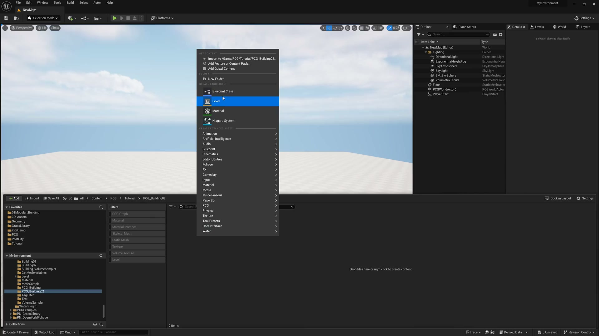
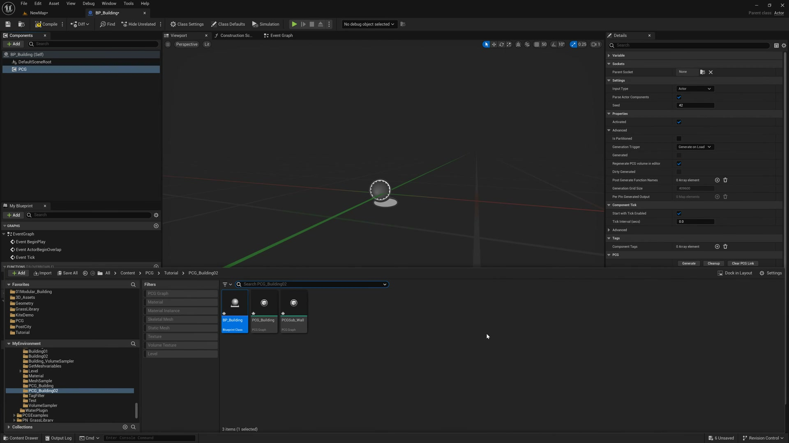

**参数、节点和风险点：**

- `PCG`
- `NewMap`
- `MyEnvironment`
- `Platforms`
- `Detailsx`
- `object`
- `view`
- `details`
- `ItemLabel`
- `Type`

### 先生成完整点集，例如楼层、墙面、网格或道路候选点（2）

**内容要点：**

- 这一段对应“先生成完整点集，例如楼层、墙面、网格或道路候选点。”，主要作用是把本集主题“【UE5.3.1 PCG教程】使用Point Filter 点过滤节点创建程序化建筑”中的该流程环节落到具体节点、参数或资产操作上。

- 画面线索：`Hep`
- 画面线索：`EditAsset`
- 画面线索：`ToolsHelp`
- 画面线索：`NewMap`
- 画面线索：`PCG_Building`
- 画面线索：`PCGSub_Wall*`
- 画面线索：`BP_Building`
- 画面线索：`Platforms`

**关键截图：**

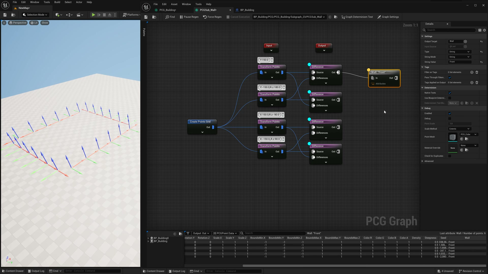
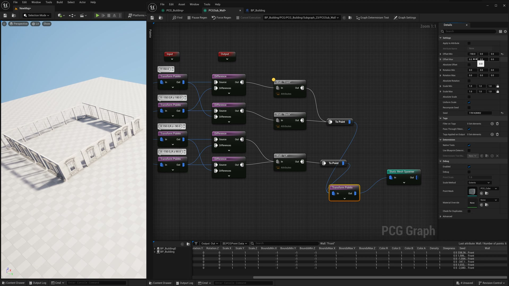

**参数、节点和风险点：**

- `PCG`
- `SubGraph`
- `Graph`
- `PCG_Building`
- `PCGSub_Wall`
- `BP_Building`
- `Regen`
- `EditAsset`
- `ToolsHelp`
- `NewMap`

### 先生成完整点集，例如楼层、墙面、网格或道路候选点（3）

**内容要点：**

- 这一段对应“先生成完整点集，例如楼层、墙面、网格或道路候选点。”，主要作用是把本集主题“【UE5.3.1 PCG教程】使用Point Filter 点过滤节点创建程序化建筑”中的该流程环节落到具体节点、参数或资产操作上。

- 画面线索：`EditAsset`
- 画面线索：`ToolsHelp`
- 画面线索：`NewMap`
- 画面线索：`PCG_Building`
- 画面线索：`PCGSub_Wall`
- 画面线索：`BP_Building`
- 画面线索：`Platforms`
- 画面线索：`PauseRegen`

**关键截图：**

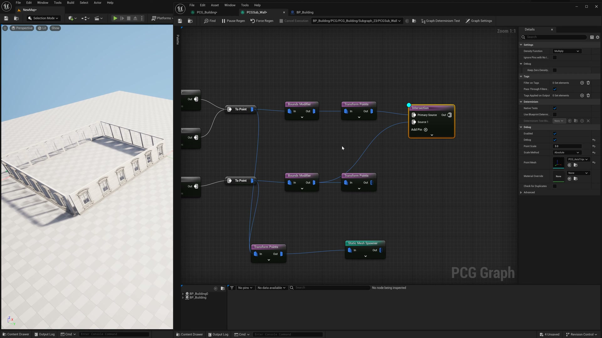
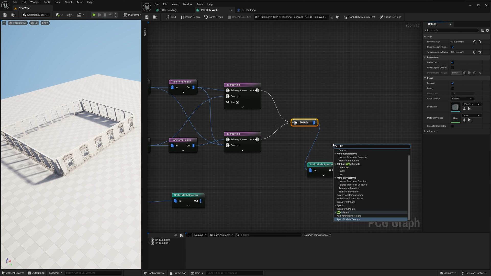

**参数、节点和风险点：**

- `PCG`
- `SubGraph`
- `Density`
- `Graph`
- `PCG_Building`
- `PCGSub_Wall`
- `BP_Building`
- `EditAsset`
- `ToolsHelp`
- `NewMap`

### 给点写入高度、索引、类型或区域等属性

**内容要点：**

- 这一段对应“给点写入高度、索引、类型或区域等属性。”，主要作用是把本集主题“【UE5.3.1 PCG教程】使用Point Filter 点过滤节点创建程序化建筑”中的该流程环节落到具体节点、参数或资产操作上。

- 画面线索：`EditAsset`
- 画面线索：`ToolsHelp`
- 画面线索：`NewMap`
- 画面线索：`PCG_Building`
- 画面线索：`PCGSub_Wall`
- 画面线索：`BP_Building`
- 画面线索：`Platforms`
- 画面线索：`Pause Regen`

**关键截图：**

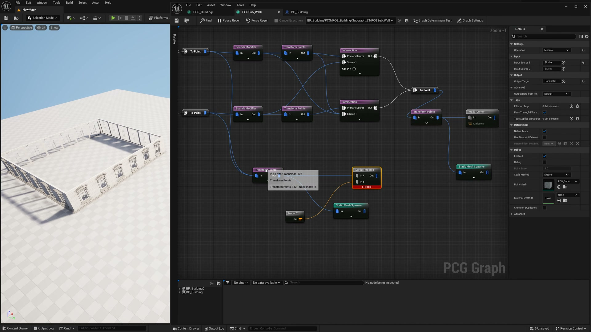

**参数、节点和风险点：**

- `PCG`
- `SubGraph`
- `Graph`
- `PCG_Building`
- `PCGSub_Wall`
- `BP_Building`
- `Regen`
- `EditAsset`
- `ToolsHelp`
- `NewMap`

### 给点写入高度、索引、类型或区域等属性（2）

**内容要点：**

- 这一段对应“给点写入高度、索引、类型或区域等属性。”，主要作用是把本集主题“【UE5.3.1 PCG教程】使用Point Filter 点过滤节点创建程序化建筑”中的该流程环节落到具体节点、参数或资产操作上。

- 画面线索：`EditAsset`
- 画面线索：`ToolsHelp`
- 画面线索：`NewMap`
- 画面线索：`PCG_Building`
- 画面线索：`PCGSub_Wall`
- 画面线索：`BP_Building`
- 画面线索：`Platforms`
- 画面线索：`PauseRegen`

**关键截图：**

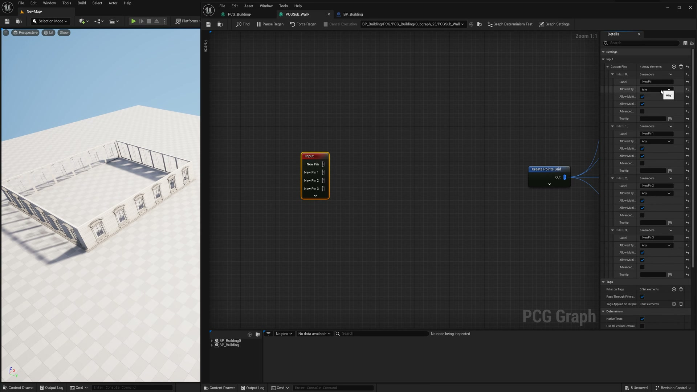
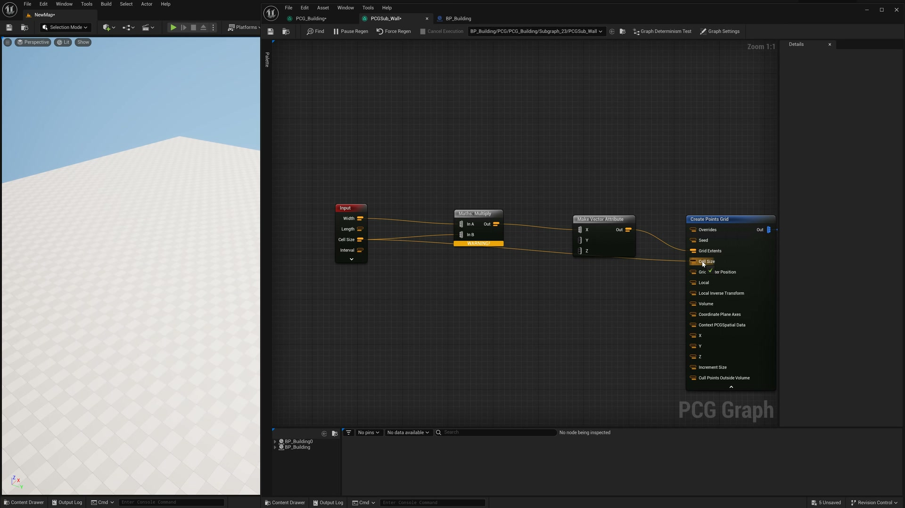

**参数、节点和风险点：**

- `PCG`
- `SubGraph`
- `Graph`
- `PCG_Building`
- `PCGSub_Wall`
- `BP_Building`
- `EditAsset`
- `ToolsHelp`
- `NewMap`
- `Platforms`

### 给点写入高度、索引、类型或区域等属性（3）

**内容要点：**

- 这一段对应“给点写入高度、索引、类型或区域等属性。”，主要作用是把本集主题“【UE5.3.1 PCG教程】使用Point Filter 点过滤节点创建程序化建筑”中的该流程环节落到具体节点、参数或资产操作上。

- 画面线索：`EditAsset`
- 画面线索：`ToolsHelp`
- 画面线索：`NewMap`
- 画面线索：`PCG_Building`
- 画面线索：`PCGSub_Wall`
- 画面线索：`BP_Building`
- 画面线索：`Platforms`
- 画面线索：`PauseRegen`

**关键截图：**

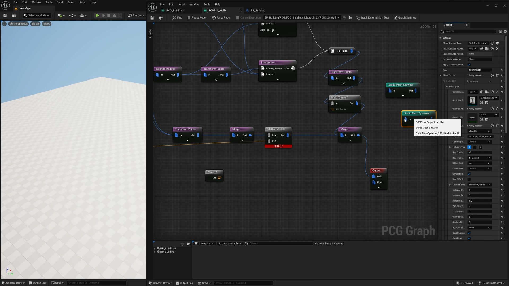
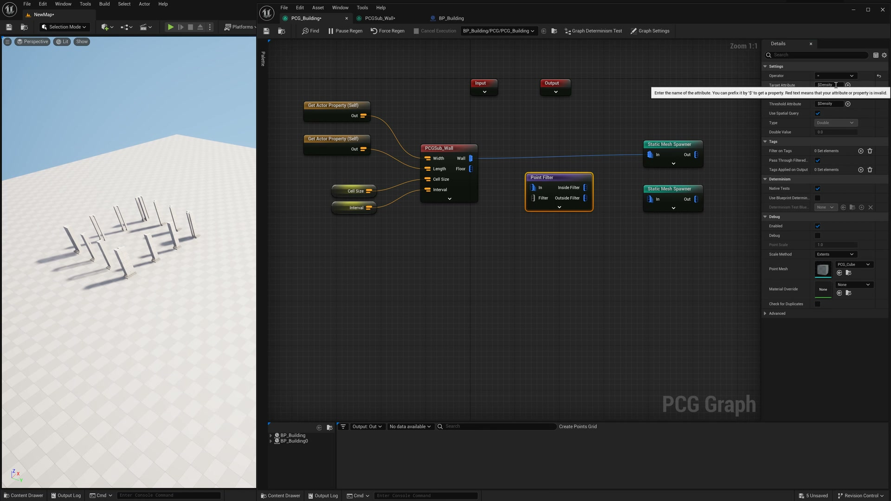

**参数、节点和风险点：**

- `PCG`
- `SubGraph`
- `Graph`
- `PCG_Building`
- `PCGSub_Wall`
- `BP_Building`
- `EditAsset`
- `ToolsHelp`
- `NewMap`
- `Platforms`

### 用 Point Filter 按条件保留或剔除点

**内容要点：**

- 这一段对应“用 Point Filter 按条件保留或剔除点。”，主要作用是把本集主题“【UE5.3.1 PCG教程】使用Point Filter 点过滤节点创建程序化建筑”中的该流程环节落到具体节点、参数或资产操作上。

- 画面线索：`EditAsset`
- 画面线索：`ToolsHelp`
- 画面线索：`NewMap`
- 画面线索：`PCG_Building`
- 画面线索：`PCGSub_Wall`
- 画面线索：`BP_Building`
- 画面线索：`Platforms`
- 画面线索：`PauseRegen`

**关键截图：**

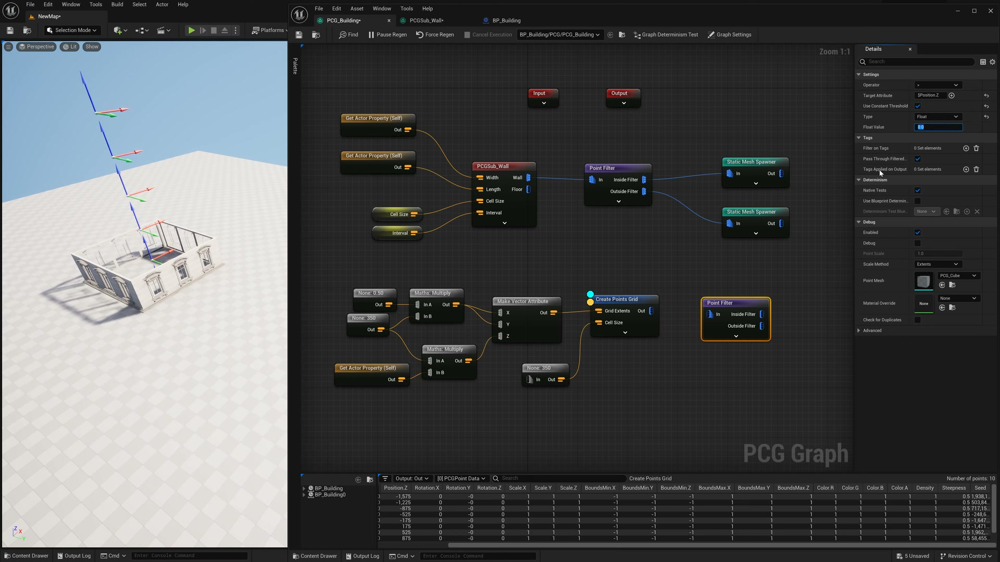

**参数、节点和风险点：**

- `PCG`
- `Actor`
- `Graph`
- `PCG_Building`
- `BP_Building`
- `EditAsset`
- `ToolsHelp`
- `NewMap`
- `PCGSub_Wall`
- `Platforms`

### 用 Point Filter 按条件保留或剔除点（2）

**内容要点：**

- 这一段对应“用 Point Filter 按条件保留或剔除点。”，主要作用是把本集主题“【UE5.3.1 PCG教程】使用Point Filter 点过滤节点创建程序化建筑”中的该流程环节落到具体节点、参数或资产操作上。

- 画面线索：`Asset`
- 画面线索：`ToolsHelp`
- 画面线索：`NewMap`
- 画面线索：`PCG_Building`
- 画面线索：`PCGSub_Wall`
- 画面线索：`BP_Building`
- 画面线索：`Platforms`
- 画面线索：`Pause Regen`

**关键截图：**

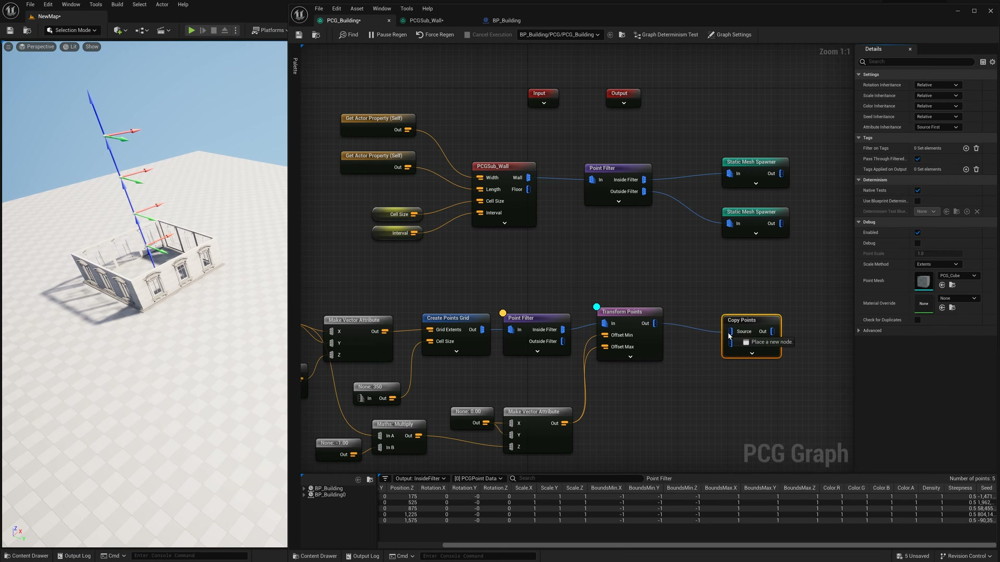
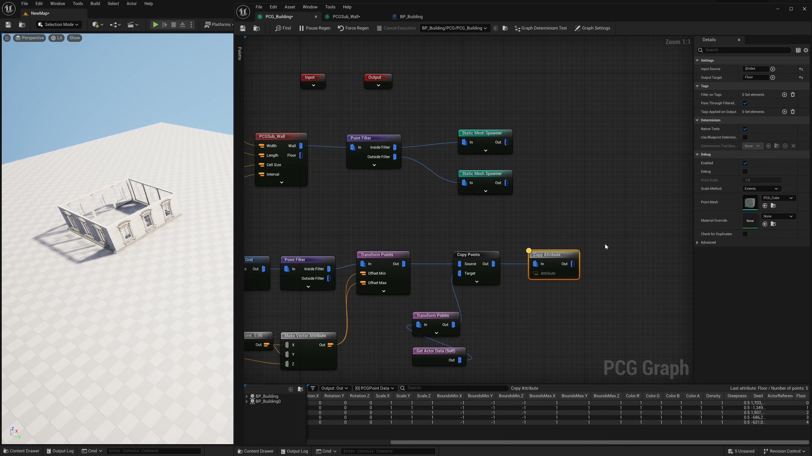

**参数、节点和风险点：**

- `PCG`
- `Graph`
- `PCG_Building`
- `BP_Building`
- `Regen`
- `Asset`
- `ToolsHelp`
- `NewMap`
- `PCGSub_Wall`
- `Platforms`

### 用 Point Filter 按条件保留或剔除点（3）

**内容要点：**

- 这一段对应“用 Point Filter 按条件保留或剔除点。”，主要作用是把本集主题“【UE5.3.1 PCG教程】使用Point Filter 点过滤节点创建程序化建筑”中的该流程环节落到具体节点、参数或资产操作上。

- 画面线索：`Asset`
- 画面线索：`ToolsHelp`
- 画面线索：`NewMap*`
- 画面线索：`PCG_Building`
- 画面线索：`PCGSub_Wall`
- 画面线索：`BP_Building`
- 画面线索：`Platforms`
- 画面线索：`Pause Regen`

**关键截图：**

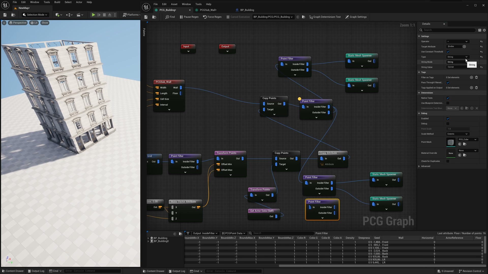
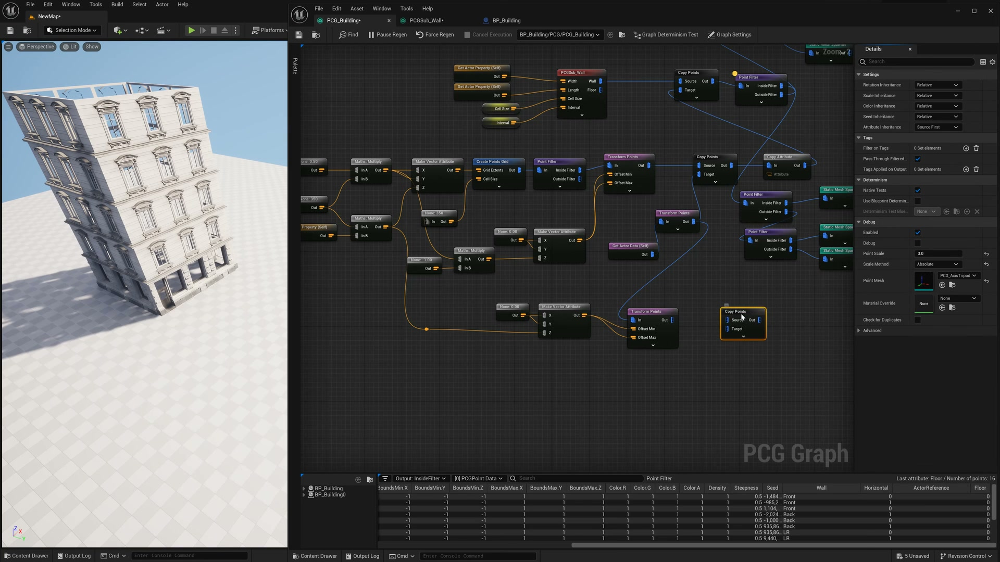

**参数、节点和风险点：**

- `PCG`
- `Graph`
- `PCG_Building`
- `BP_Building`
- `Regen`
- `Asset`
- `ToolsHelp`
- `NewMap`
- `PCGSub_Wall`
- `Platforms`

### 把过滤后的点分别送到不同生成分支，创建建筑构件

**内容要点：**

- 这一段对应“把过滤后的点分别送到不同生成分支，创建建筑构件。”，主要作用是把本集主题“【UE5.3.1 PCG教程】使用Point Filter 点过滤节点创建程序化建筑”中的该流程环节落到具体节点、参数或资产操作上。

- 画面线索：`EditAsset`
- 画面线索：`ToolsHelp`
- 画面线索：`NewMap*`
- 画面线索：`PCG_Building`
- 画面线索：`PCGSub_Wall`
- 画面线索：`BP_Building`
- 画面线索：`Platforms`
- 画面线索：`Pause Regen`

**关键截图：**

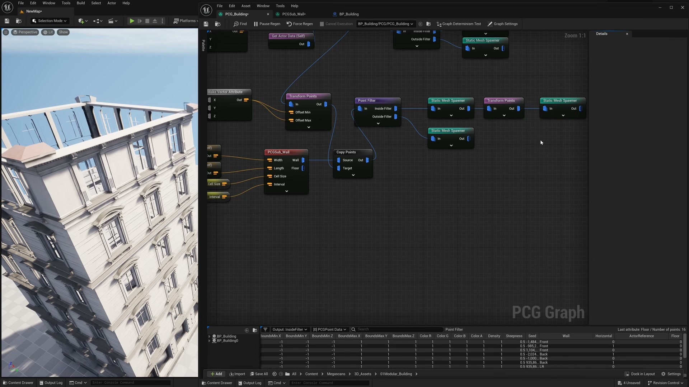
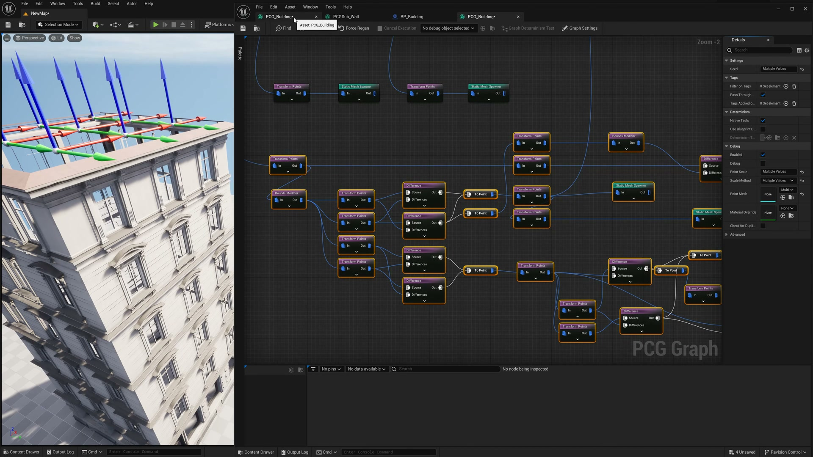

**参数、节点和风险点：**

- `PCG`
- `Actor`
- `Graph`
- `PCG_Building`
- `BP_Building`
- `Regen`
- `EditAsset`
- `ToolsHelp`
- `NewMap`
- `PCGSub_Wall`

### 把过滤后的点分别送到不同生成分支，创建建筑构件（2）

**内容要点：**

- 这一段对应“把过滤后的点分别送到不同生成分支，创建建筑构件。”，主要作用是把本集主题“【UE5.3.1 PCG教程】使用Point Filter 点过滤节点创建程序化建筑”中的该流程环节落到具体节点、参数或资产操作上。

- 画面线索：`Asset`
- 画面线索：`ToolsHelp`
- 画面线索：`NewMap*`
- 画面线索：`PCG_Building`
- 画面线索：`PCGSub_Wall`
- 画面线索：`BP_Building`
- 画面线索：`PCG_Building*`
- 画面线索：`Platforms`

**关键截图：**

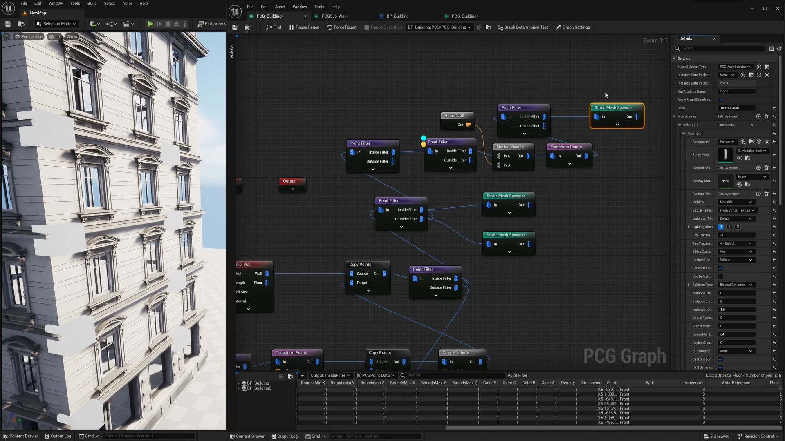
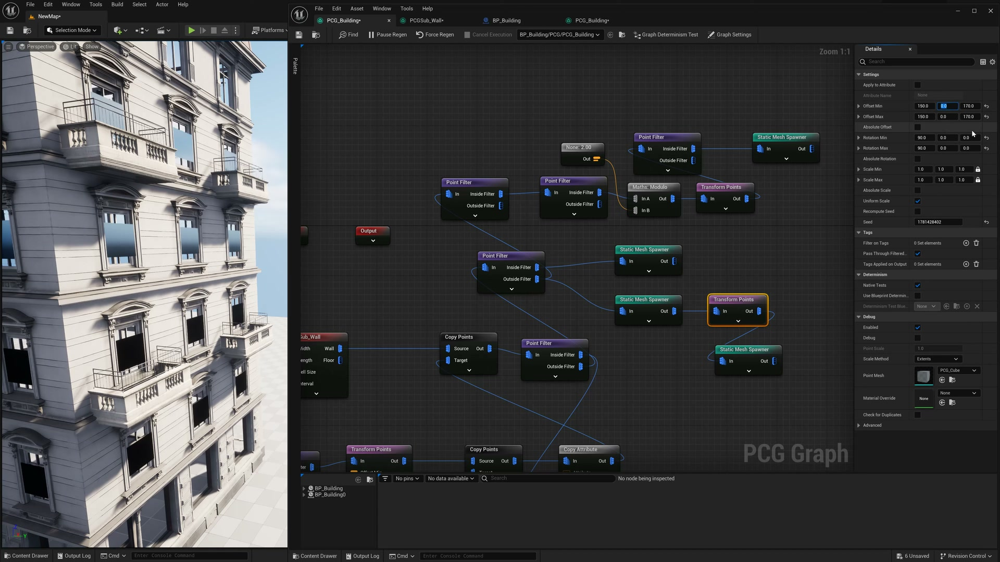

**参数、节点和风险点：**

- `PCG`
- `Mesh`
- `Graph`
- `PCG_Building`
- `BP_Building`
- `Regen`
- `Asset`
- `ToolsHelp`
- `NewMap`
- `PCGSub_Wall`

## 复现检查清单

- 过滤条件应能在 Debug 视图里看到数量变化。
- 多个 Filter 串联时要记录每步保留的点数。
- 复现时先固定随机种子，再调整密度、过滤和生成资源，避免随机结果掩盖逻辑错误。
