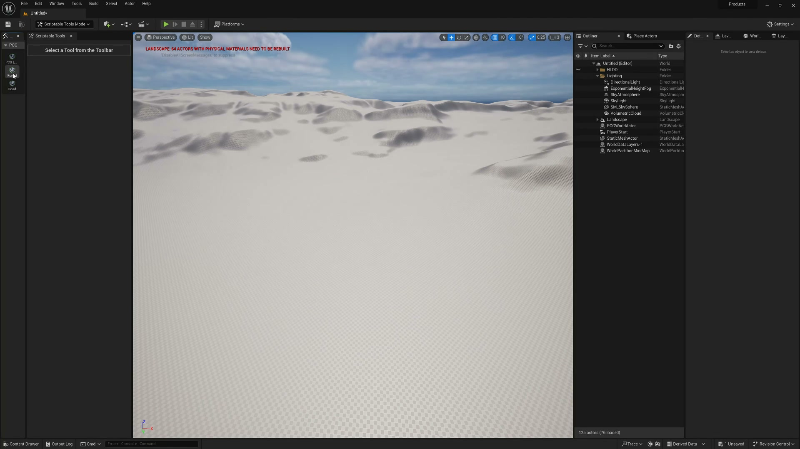
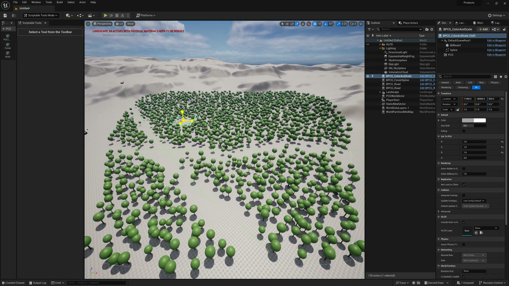

# 【UE5.3 PCG教程】可编写脚本工具与PCG联动

## 知识目标

- 围绕“【UE5.3 PCG教程】可编写脚本工具与PCG联动”整理 PCG 视频中的输入数据、图表规则、关键节点、参数风险和最终生成结果。
- 阅读时重点区分三层：输入来源（点、样条、表面、体积、Actor 或属性）、规则处理（采样、过滤、变换、分区、循环、HLSL 或子图）、输出方式（Static Mesh Spawner、Spawn Actor、Spline Mesh、Blueprint 或 Dynamic Mesh）。

## 可复现主流程

- 确认 PCG Graph/PCG Component 已绑定到正确 Actor，并先用 Debug/Inspect 查看中间点数据。
- 明确输入来源：Spline、Surface、Mesh、Volume、Actor、Data Asset/Data Table 或手工参数。
- 在图表中按顺序处理采样、属性写入、过滤、Transform、分区/循环和输出节点。
- 生成可见结果前，先核对 Point 的 Transform、Bounds、Density、Seed 和自定义 Attribute。
- 用 Static Mesh Spawner 输出大量网格实例；需要蓝图逻辑时改用 Spawn Actor 或 Blueprint 交互。

## 关键术语

- `PCG`、`Scriptable Tools Mode`、`Blueprint`、`Actor`、`PCG Component`、`Editor Tool`、`Update`、`HLOD`、`Physics`、`PCG Graph`、`图表`、`组件`、`点`、`属性`、`密度`、`边界`、`过滤`、`生成`、`蓝图`、`Point`、`Attribute`、`Density`、`Bounds`、`Spline`

## 分段知识

### 00:00:00-00:01:09 编辑器脚本与 PCG 联动

- 本段定位：编辑器脚本与 PCG 联动。
- 知识点：编辑器脚本联动流程需要核对脚本触发条件、PCG 组件刷新和生成结果是否同步。
- 知识点：Scriptable Tools 与 PCG Component 联动时，核心是让编辑器工具修改输入参数后触发图表重新生成。
- 知识点：脚本工具应只更新必要参数，并在生成后检查 PCG Component、HLOD、碰撞或物理状态是否同步。
- 核对对象：`PCG`、`生成`。

**关键画面：**

## 复现检查

- 每个图表先检查输入数据是否正确进入 PCG Graph，再看下游生成结果。
- Debug/Inspect 时重点看点数量、Bounds、Density、Transform、Seed 和自定义 Attribute。
- Static Mesh Spawner、Spawn Actor、Spline Mesh 和 Blueprint 输出节点不能混用语义；选择前先确定是否需要实例化性能或蓝图逻辑。
- 涉及样条、分区、运行时或 GPU 生成时，必须额外验证更新触发、缓存、世界分区和性能预算。
