# 01 - 使用PCG和新的5.3蓝图节点程序化生成建筑

## 知识目标

- 围绕“01 - 使用PCG和新的5.3蓝图节点程序化生成建筑”整理 UE PCG 建筑生成系列第 01 集：把建筑点云、属性、过滤和生成规则转成可复现的中文操作文档。

## 可复现主流程

- 把本集放进 PCG 建筑系列主线：先确定建筑输入范围，再把墙、门、楼层、屋顶、房间、楼梯、家具或室内细节拆成独立分支。
- 阅读分段时优先记录点类型、属性、过滤条件、Bounds 和生成器设置，避免把多个建筑部件混在同一批点上。
- 本集重点在建筑生成链路的搭建或改进：先调试点，再生成模块，最后处理尺寸、朝向、重叠和可复用参数。

## 关键术语

- `PCG`
- `Blueprint`
- `蓝图`
- `Static Mesh`
- `Mesh`
- `Point Filter`
- `Spline`
- `Transform`
- `Point`
- `Attribute`
- `Actor`
- `Component`
- `Spawn`
- `Grid`
- `Bounds`
- `Density`
- `Seed`
- `Graph`

## 操作步骤与要点

### 把本集放进 PCG 建筑系列主线：先确定建筑输入范围，再把墙、门、楼层、屋顶、房间、楼梯、家具或室内细节拆成独立分支

**内容要点：**

- 把本集放进 PCG 建筑系列主线：先确定建筑输入范围，再把墙、门、楼层、屋顶、房间、楼梯、家具或室内细节拆成独立分支。

**关键截图：**

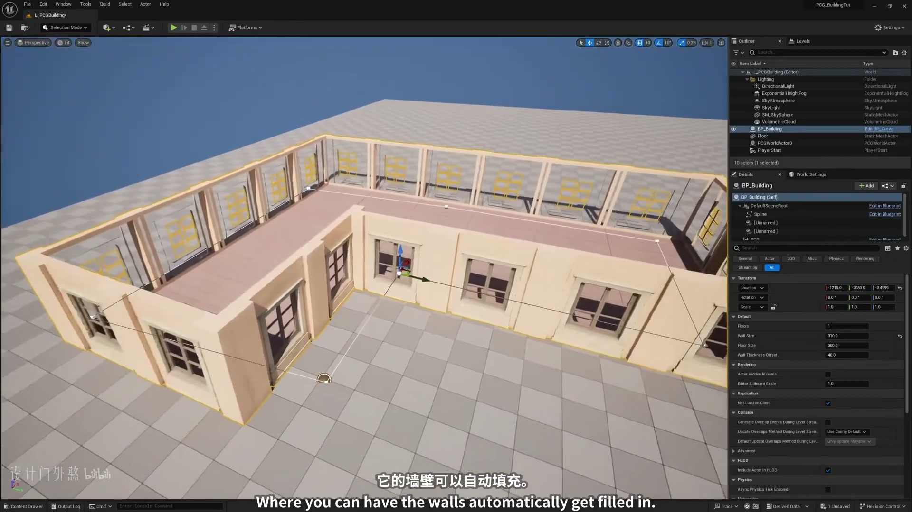
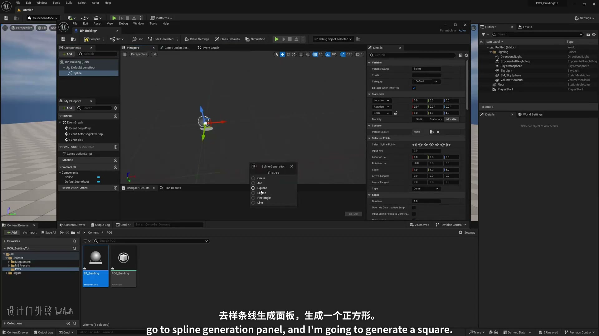

**参数、节点和风险点：**

- `PCG`
- `蓝图`
- `Actor`
- `样条`
- `网格`
- `采样`
- `参数`
- `程序化`
- `生成`
- `建筑`

### 把本集放进 PCG 建筑系列主线：先确定建筑输入范围，再把墙、门、楼层、屋顶、房间、楼梯、家具或室内细节拆成独立分支（2）

**内容要点：**

- 把本集放进 PCG 建筑系列主线：先确定建筑输入范围，再把墙、门、楼层、屋顶、房间、楼梯、家具或室内细节拆成独立分支（2）。

**关键截图：**

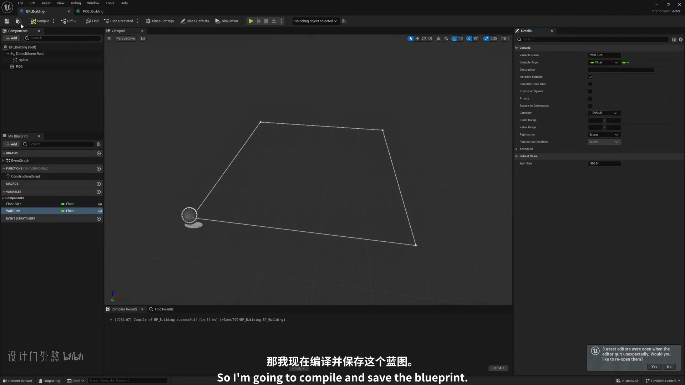
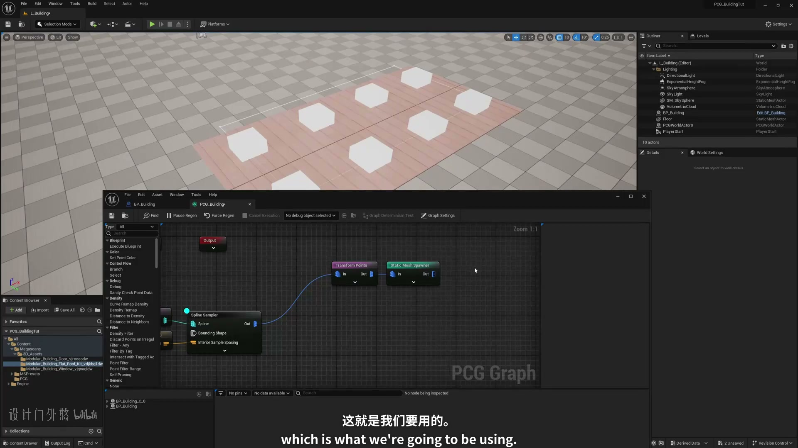

**参数、节点和风险点：**

- `PCG`
- `蓝图`
- `Actor`
- `Component`
- `网格`
- `实例`
- `属性`
- `采样`
- `参数`
- `节点`

### 把本集放进 PCG 建筑系列主线：先确定建筑输入范围，再把墙、门、楼层、屋顶、房间、楼梯、家具或室内细节拆成独立分支（3）

**内容要点：**

- 把本集放进 PCG 建筑系列主线：先确定建筑输入范围，再把墙、门、楼层、屋顶、房间、楼梯、家具或室内细节拆成独立分支（3）。

**关键截图：**

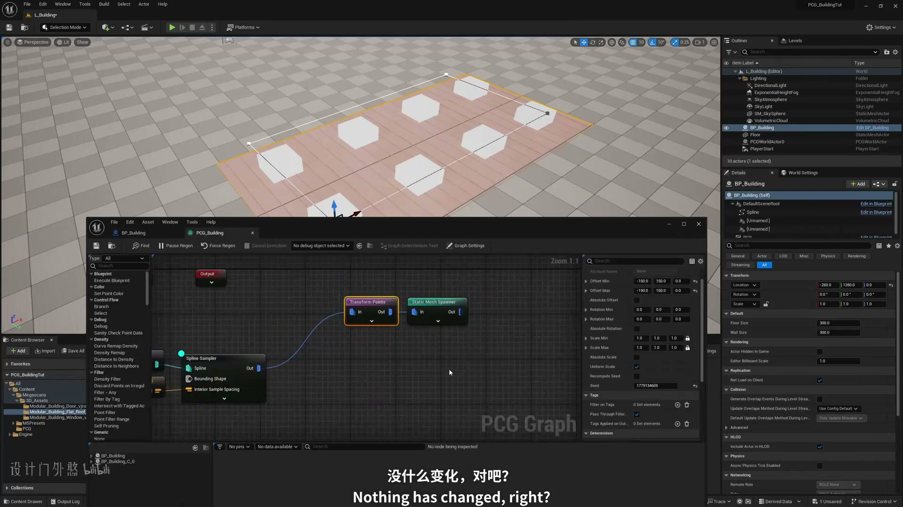
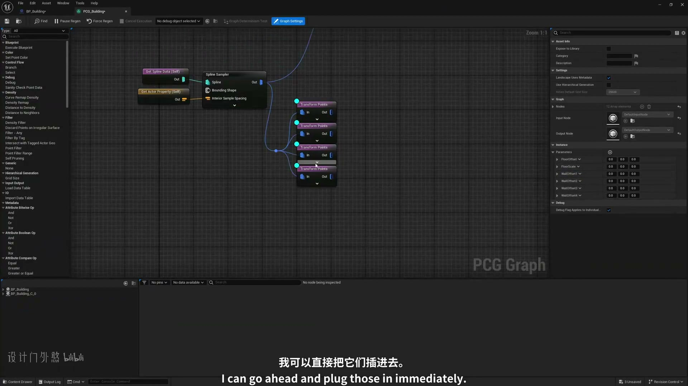

**参数、节点和风险点：**

- `蓝图`
- `实例`
- `采样`
- `参数`
- `节点`
- `程序化`
- `L_Building`
- `Selection`
- `Mode`
- `Platforms`

### 阅读分段时优先记录点类型、属性、过滤条件、Bounds 和生成器设置，避免把多个建筑部件混在同一批点上

**内容要点：**

- 阅读分段时优先记录点类型、属性、过滤条件、Bounds 和生成器设置，避免把多个建筑部件混在同一批点上。

**关键截图：**

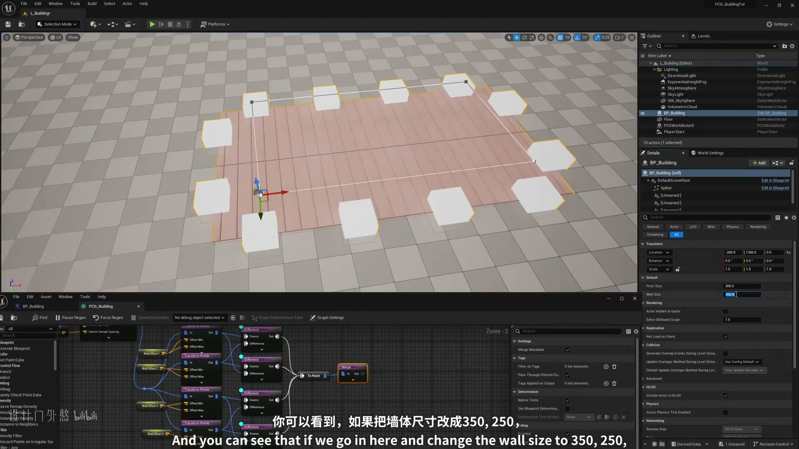
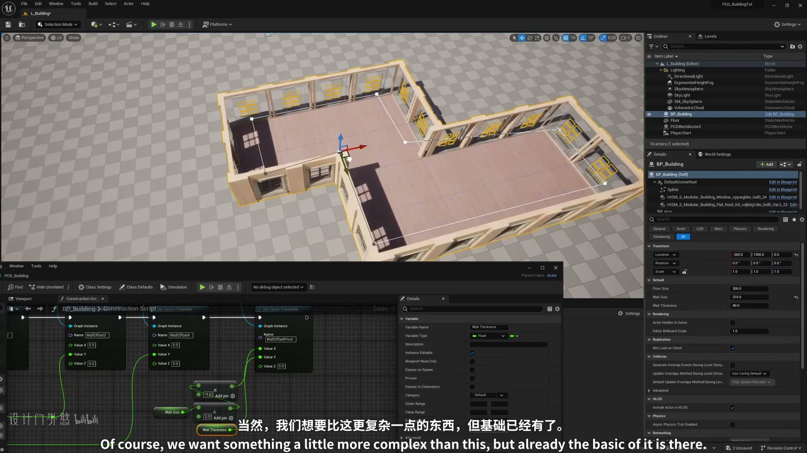

**参数、节点和风险点：**

- `PCG`
- `Actor`
- `样条`
- `网格`
- `采样`
- `参数`
- `节点`
- `程序化`
- `生成`
- `建筑`

### 阅读分段时优先记录点类型、属性、过滤条件、Bounds 和生成器设置，避免把多个建筑部件混在同一批点上（2）

**内容要点：**

- 阅读分段时优先记录点类型、属性、过滤条件、Bounds 和生成器设置，避免把多个建筑部件混在同一批点上（2）。

**关键截图：**

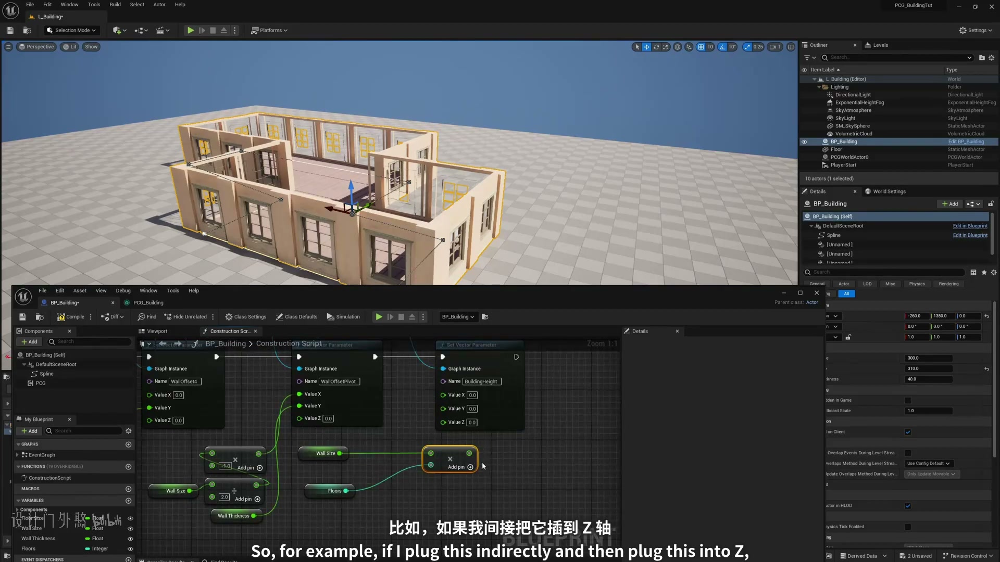
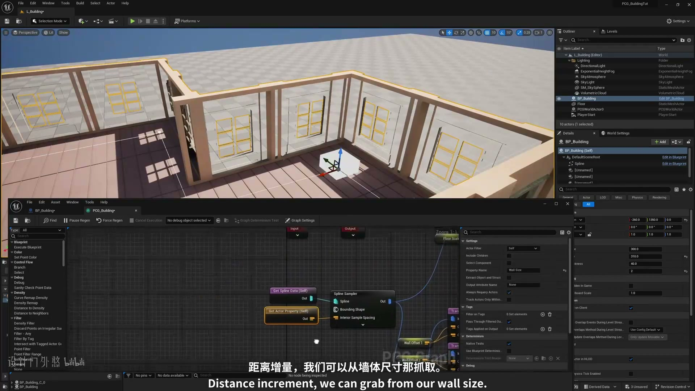

**参数、节点和风险点：**

- `蓝图`
- `样条`
- `采样`
- `节点`
- `建筑`
- `Plng`
- `L_Building`
- `Selection`
- `Mode`
- `Platforms`

### 本集重点在建筑生成链路的搭建或改进：先调试点，再生成模块，最后处理尺寸、朝向、重叠和可复用参数

**内容要点：**

- 本集重点在建筑生成链路的搭建或改进：先调试点，再生成模块，最后处理尺寸、朝向、重叠和可复用参数。

**关键截图：**

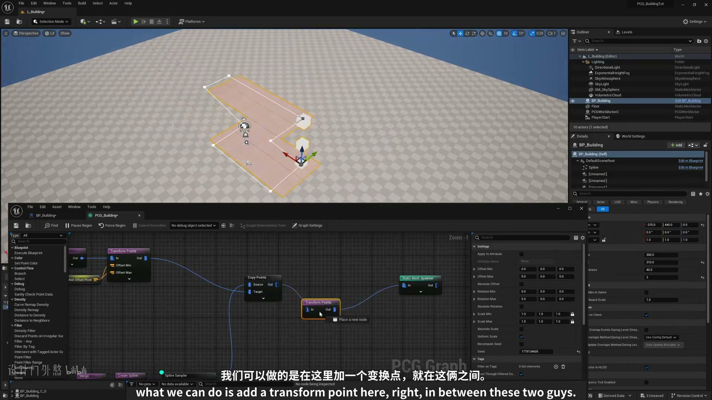
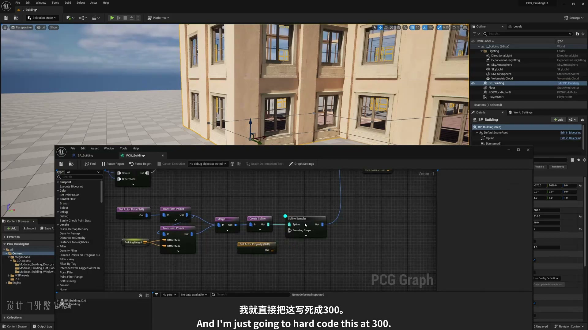

**参数、节点和风险点：**

- `蓝图`
- `样条`
- `参数`
- `节点`
- `L_Building`
- `Selection`
- `Mode`
- `Platforms`
- `Setings`
- `LitShow`

### 本集重点在建筑生成链路的搭建或改进：先调试点，再生成模块，最后处理尺寸、朝向、重叠和可复用参数（2）

**内容要点：**

- 本集重点在建筑生成链路的搭建或改进：先调试点，再生成模块，最后处理尺寸、朝向、重叠和可复用参数（2）。

**关键截图：**

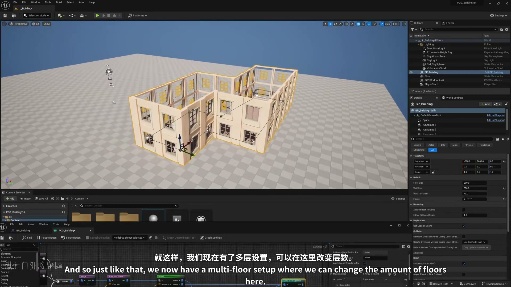
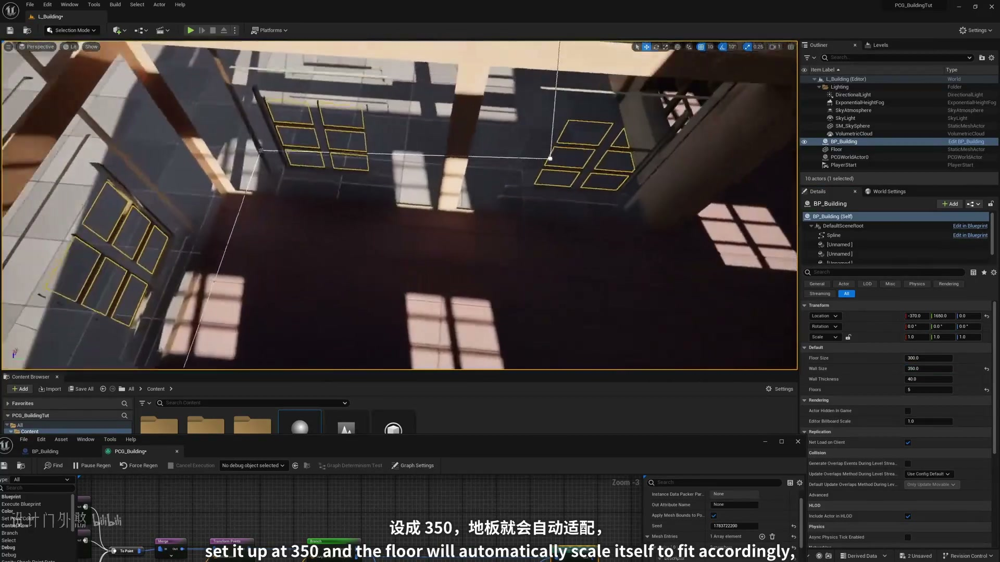

**参数、节点和风险点：**

- `网格`
- `生成`
- `建筑`
- `L_Building`
- `Selection`
- `Mode`
- `Platforms`
- `Setings`
- `LitShow`
- `outliner`

## 复现检查清单

- 墙、门、楼层、屋顶、房间、楼梯和家具要用点类型或属性拆开，不要共享同一批未分类点。
- 所有模块资产的 Pivot、尺寸和朝向必须统一，否则 PCG 规则正确也会出现错位。
- 复现时先固定随机种子，再调整密度、过滤和生成资源，避免随机结果掩盖逻辑错误。
