# 02 - 自定义门数、楼层和屋顶

## 知识目标

- 围绕“02 - 自定义门数、楼层和屋顶”整理 PCG 视频中的输入数据、图表规则、关键节点、参数风险和最终生成结果。
- 阅读时重点区分三层：输入来源（点、样条、表面、体积、Actor 或属性）、规则处理（采样、过滤、变换、分区、循环、HLSL 或子图）、输出方式（Static Mesh Spawner、Spawn Actor、Spline Mesh、Blueprint 或 Dynamic Mesh）。

## 可复现主流程

- 确认 PCG Graph/PCG Component 已绑定到正确 Actor，并先用 Debug/Inspect 查看中间点数据。
- 明确输入来源：Spline、Surface、Mesh、Volume、Actor、Data Asset/Data Table 或手工参数。
- 在图表中按顺序处理采样、属性写入、过滤、Transform、分区/循环和输出节点。
- 生成可见结果前，先核对 Point 的 Transform、Bounds、Density、Seed 和自定义 Attribute。
- 用 Static Mesh Spawner 输出大量网格实例；需要蓝图逻辑时改用 Spawn Actor 或 Blueprint 交互。

## 关键术语

- `PCG`、`Blueprint`、`蓝图`、`Static Mesh`、`Mesh`、`Point Filter`、`Spline`、`Transform`、`Point`、`Attribute`、`Actor`、`Component`、`Spawn`、`Grid`、`Bounds`、`Density`、`Random`、`Seed`、`Point Data`、`图表`、`点`、`点数据`、`属性`、`密度`

## 分段知识

### 00:00:00-00:04:57 属性、过滤与数据分流

- 本段定位：属性、过滤与数据分流。
- 知识点：自定义房间墙节点记录 X/Y 边界点，随机选取非边界点作为墙段起点，并用随机整数加数组索引改善 PCG 随机性。
- 知识点：门洞通过在墙段点中选择一个候选点并写入不同密度/属性生成，复现时要保证每个房间至少保留可通行入口。
- 知识点：多楼层流程用循环逐层重新生成并存储地板/墙体点数据，下游房间、门和屋顶分支都要读取对应楼层的数据。
- 复现要点：先用 Debug/Inspect 核对点数量、Bounds、Density 和关键属性，再判断最终生成结果。
- 复现要点：属性命名要稳定，过滤、分区和分支节点应保留可检查的中间数据，避免后续规则难以追踪。
- 核对对象：`PCG`、`Actor`、`点`、`属性`、`过滤`、`生成`、`蓝图`、`网格`。

**关键画面：**

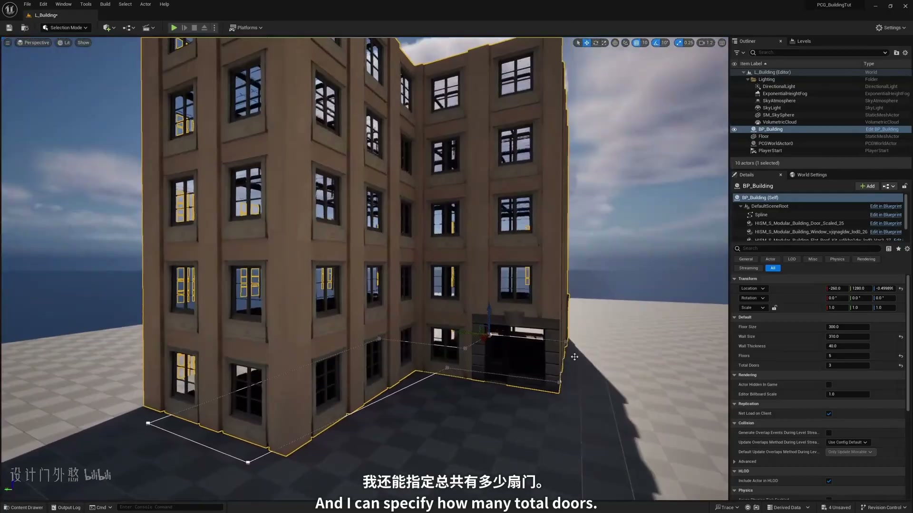
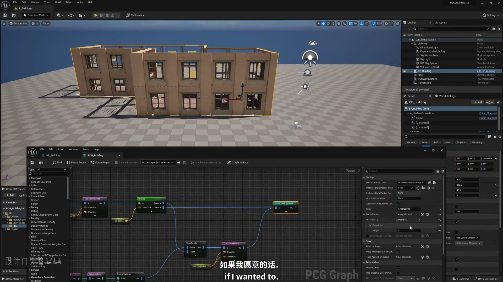

### 00:04:59-00:08:48 点数据、Bounds 与采样来源

- 本段定位：点数据、Bounds 与采样来源。
- 知识点：自定义房间墙节点记录 X/Y 边界点，随机选取非边界点作为墙段起点，并用随机整数加数组索引改善 PCG 随机性。
- 复现要点：先用 Debug/Inspect 核对点数量、Bounds、Density 和关键属性，再判断最终生成结果。
- 核对对象：`PCG`、`Point Data`、`Point`、`Bounds`、`点`、`点数据`、`采样`、`循环`。

**关键画面：**

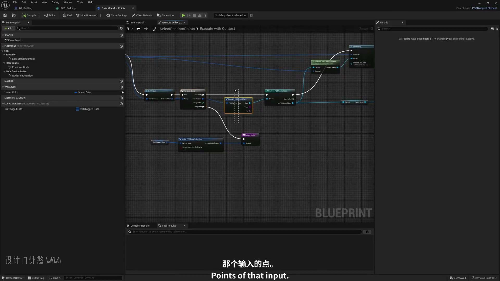
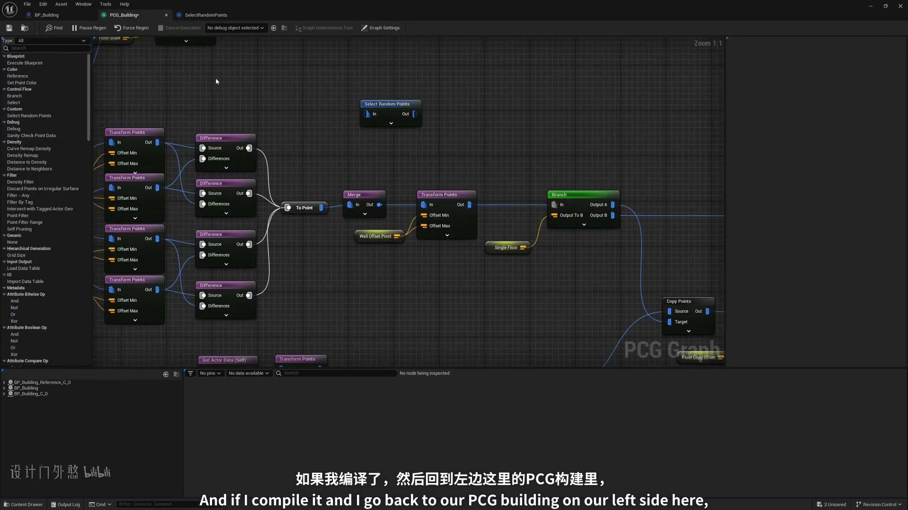

### 00:08:50-00:13:46 点数据、Bounds 与采样来源

- 本段定位：点数据、Bounds 与采样来源。
- 知识点：室内划分从地板点复制出两套重叠墙点，其中一套旋转 90 度，合并后用密度或属性区分墙段与门洞候选。
- 知识点：自定义房间墙节点记录 X/Y 边界点，随机选取非边界点作为墙段起点，并用随机整数加数组索引改善 PCG 随机性。
- 复现要点：先用 Debug/Inspect 核对点数量、Bounds、Density 和关键属性，再判断最终生成结果。
- 核对对象：`Bounds`、`点`、`点数据`、`密度`、`采样`、`循环`、`生成`、`蓝图`。

**关键画面：**

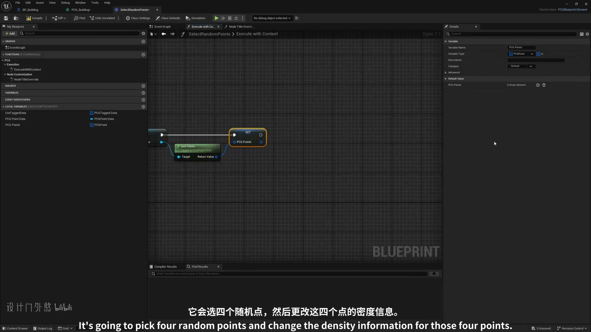
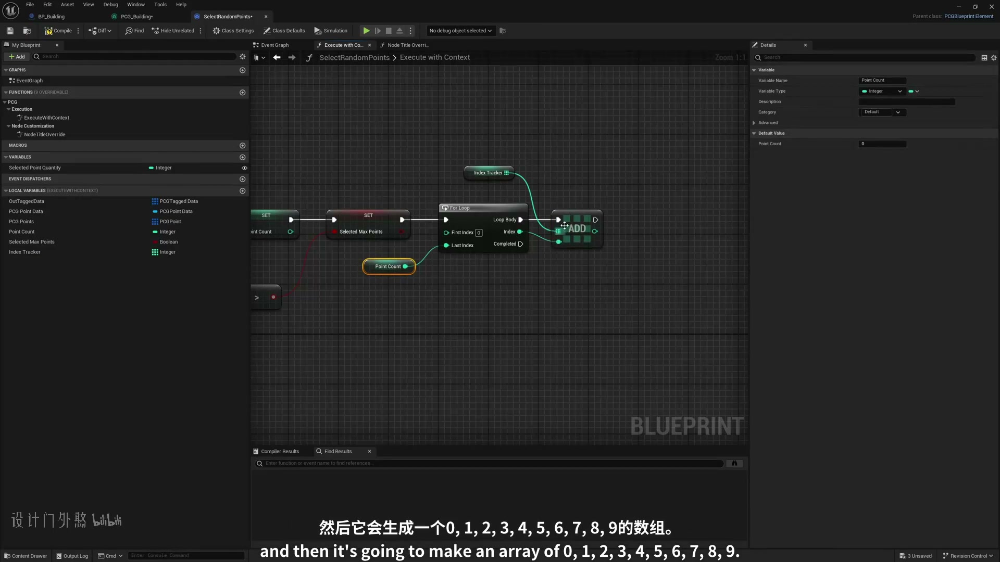

### 00:13:47-00:18:43 属性、过滤与数据分流

- 本段定位：属性、过滤与数据分流。
- 知识点：室内划分从地板点复制出两套重叠墙点，其中一套旋转 90 度，合并后用密度或属性区分墙段与门洞候选。
- 知识点：自定义房间墙节点记录 X/Y 边界点，随机选取非边界点作为墙段起点，并用随机整数加数组索引改善 PCG 随机性。
- 知识点：门洞通过在墙段点中选择一个候选点并写入不同密度/属性生成，复现时要保证每个房间至少保留可通行入口。
- 复现要点：先用 Debug/Inspect 核对点数量、Bounds、Density 和关键属性，再判断最终生成结果。
- 复现要点：属性命名要稳定，过滤、分区和分支节点应保留可检查的中间数据，避免后续规则难以追踪。
- 核对对象：`PCG`、`点`、`点数据`、`属性`、`密度`、`采样`、`过滤`、`循环`、`生成`。

**关键画面：**

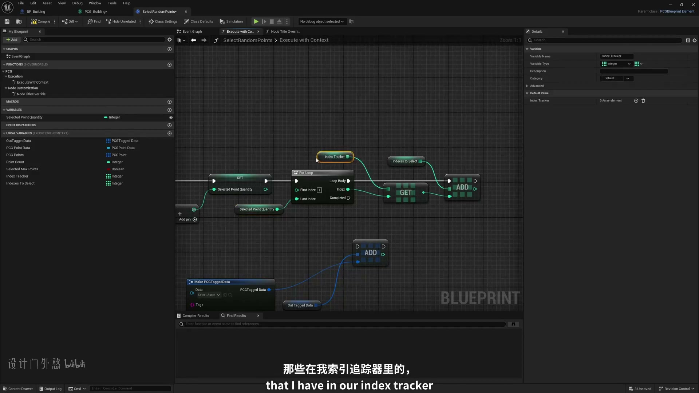
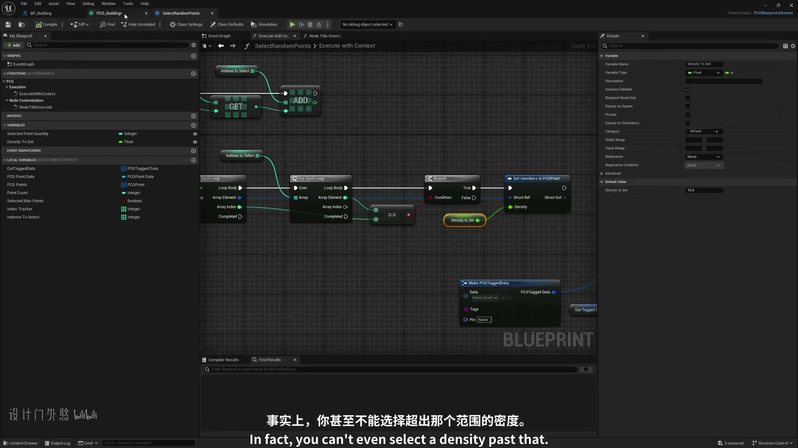

### 00:18:43-00:22:19 属性、过滤与数据分流

- 本段定位：属性、过滤与数据分流。
- 知识点：室内划分从地板点复制出两套重叠墙点，其中一套旋转 90 度，合并后用密度或属性区分墙段与门洞候选。
- 知识点：自定义房间墙节点记录 X/Y 边界点，随机选取非边界点作为墙段起点，并用随机整数加数组索引改善 PCG 随机性。
- 知识点：门洞通过在墙段点中选择一个候选点并写入不同密度/属性生成，复现时要保证每个房间至少保留可通行入口。
- 复现要点：先用 Debug/Inspect 核对点数量、Bounds、Density 和关键属性，再判断最终生成结果。
- 复现要点：属性命名要稳定，过滤、分区和分支节点应保留可检查的中间数据，避免后续规则难以追踪。
- 核对对象：`点`、`属性`、`密度`、`采样`、`过滤`、`生成`、`蓝图`。

**关键画面：**

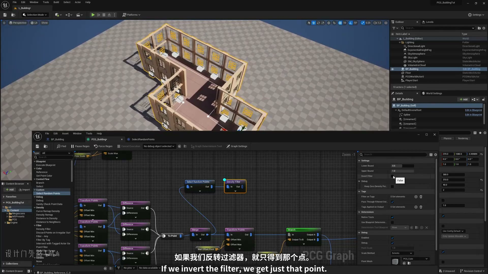
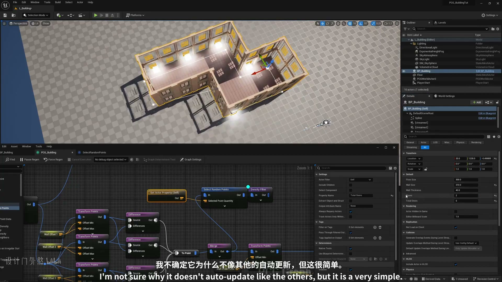

### 00:22:23-00:25:13 Spline 采样与路径生成

- 本段定位：Spline 采样与路径生成。
- 知识点：自定义房间墙节点记录 X/Y 边界点，随机选取非边界点作为墙段起点，并用随机整数加数组索引改善 PCG 随机性。
- 知识点：门洞通过在墙段点中选择一个候选点并写入不同密度/属性生成，复现时要保证每个房间至少保留可通行入口。
- 知识点：多楼层流程用循环逐层重新生成并存储地板/墙体点数据，下游房间、门和屋顶分支都要读取对应楼层的数据。
- 知识点：Transform Points 可调整点的位置、旋转和缩放；使用非统一缩放时要分别检查各轴最小值和最大值。
- 复现要点：先用 Debug/Inspect 核对点数量、Bounds、Density 和关键属性，再判断最终生成结果。
- 复现要点：Spline 流程要单独核对采样间距、切线、端点、交叉点和生成网格的对齐方式。
- 核对对象：`Spline`、`点`、`样条`、`采样`、`生成`、`网格`。

**关键画面：**

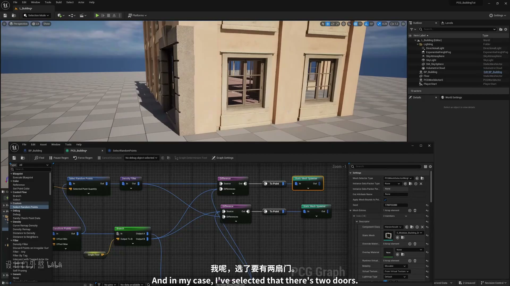
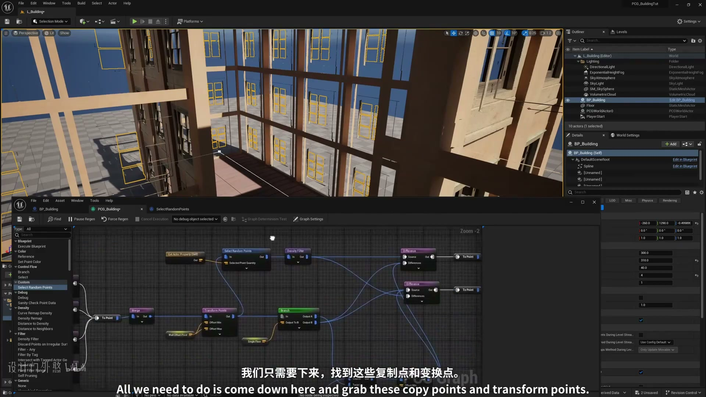

### 00:25:16-00:28:43 Spline 采样与路径生成

- 本段定位：Spline 采样与路径生成。
- 知识点：室内划分从地板点复制出两套重叠墙点，其中一套旋转 90 度，合并后用密度或属性区分墙段与门洞候选。
- 知识点：门洞通过在墙段点中选择一个候选点并写入不同密度/属性生成，复现时要保证每个房间至少保留可通行入口。
- 知识点：多楼层流程用循环逐层重新生成并存储地板/墙体点数据，下游房间、门和屋顶分支都要读取对应楼层的数据。
- 复现要点：先用 Debug/Inspect 核对点数量、Bounds、Density 和关键属性，再判断最终生成结果。
- 复现要点：Spline 流程要单独核对采样间距、切线、端点、交叉点和生成网格的对齐方式。
- 核对对象：`PCG`、`Spline`、`图表`、`点`、`样条`、`采样`、`生成`、`蓝图`、`网格`。

**关键画面：**

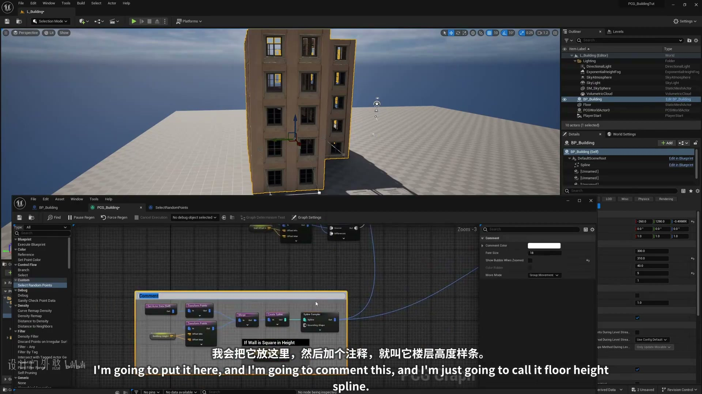
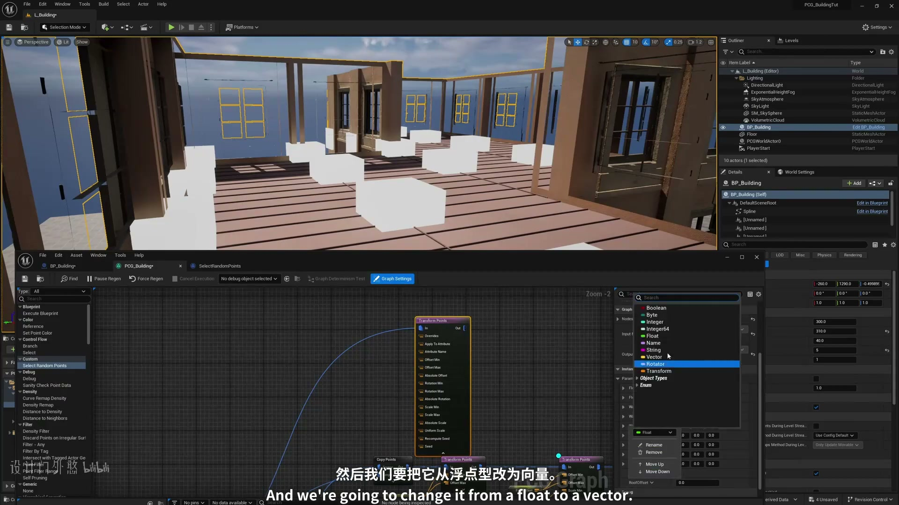

## 复现检查

- 每个图表先检查输入数据是否正确进入 PCG Graph，再看下游生成结果。
- Debug/Inspect 时重点看点数量、Bounds、Density、Transform、Seed 和自定义 Attribute。
- Static Mesh Spawner、Spawn Actor、Spline Mesh 和 Blueprint 输出节点不能混用语义；选择前先确定是否需要实例化性能或蓝图逻辑。
- 涉及样条、分区、运行时或 GPU 生成时，必须额外验证更新触发、缓存、世界分区和性能预算。
