# 03 - 程序化室内设计的秘密

## 知识目标

- 围绕“03 - 程序化室内设计的秘密”整理 UE PCG 建筑生成系列第 03 集：把建筑点云、属性、过滤和生成规则转成可复现的中文操作文档。

## 可复现主流程

- 把本集放进 PCG 建筑系列主线：先确定建筑输入范围，再把墙、门、楼层、屋顶、房间、楼梯、家具或室内细节拆成独立分支。
- 阅读分段时优先记录点类型、属性、过滤条件、Bounds 和生成器设置，避免把多个建筑部件混在同一批点上。
- 室内生成要先划分房间边界、通道和可放置区域，再生成墙面、门洞、家具和装饰。
- 每次加入家具或室内细节都要检查 Bounds 和碰撞，避免家具穿墙、重叠或堵住通道。

## 关键术语

- `PCG`
- `Blueprint`
- `Static Mesh`
- `Mesh`
- `Spline`
- `Transform`
- `Point`
- `Attribute`
- `Actor`
- `Spawn`
- `Density`
- `Random`
- `Seed`
- `Loop`
- `Graph`
- `Instance`
- `HISM`
- `样条`

## 操作步骤与要点

### 把本集放进 PCG 建筑系列主线：先确定建筑输入范围，再把墙、门、楼层、屋顶、房间、楼梯、家具或室内细节拆成独立分支

**内容要点：**

- 把本集放进 PCG 建筑系列主线：先确定建筑输入范围，再把墙、门、楼层、屋顶、房间、楼梯、家具或室内细节拆成独立分支。

**关键截图：**

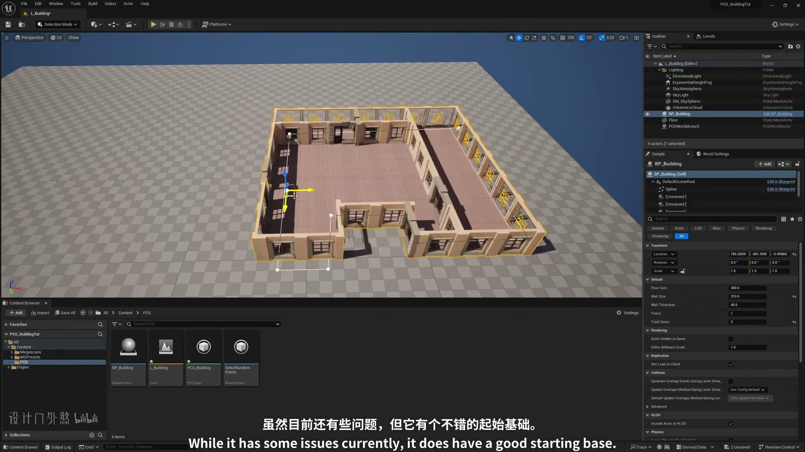
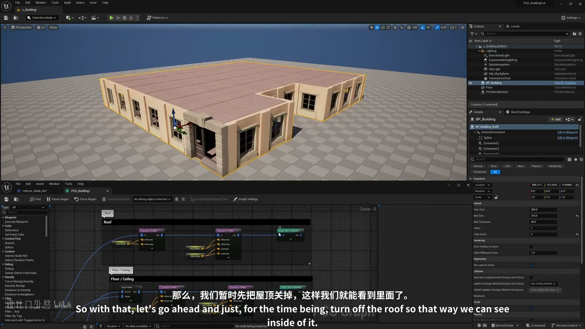

**参数、节点和风险点：**

- `PCG`
- `网格`
- `密度`
- `节点`
- `生成`
- `PCG_BuildingTut`
- `L_Building`
- `Selection`
- `Mode`
- `Platforms`

### 把本集放进 PCG 建筑系列主线：先确定建筑输入范围，再把墙、门、楼层、屋顶、房间、楼梯、家具或室内细节拆成独立分支（2）

**内容要点：**

- 把本集放进 PCG 建筑系列主线：先确定建筑输入范围，再把墙、门、楼层、屋顶、房间、楼梯、家具或室内细节拆成独立分支（2）。

**关键截图：**

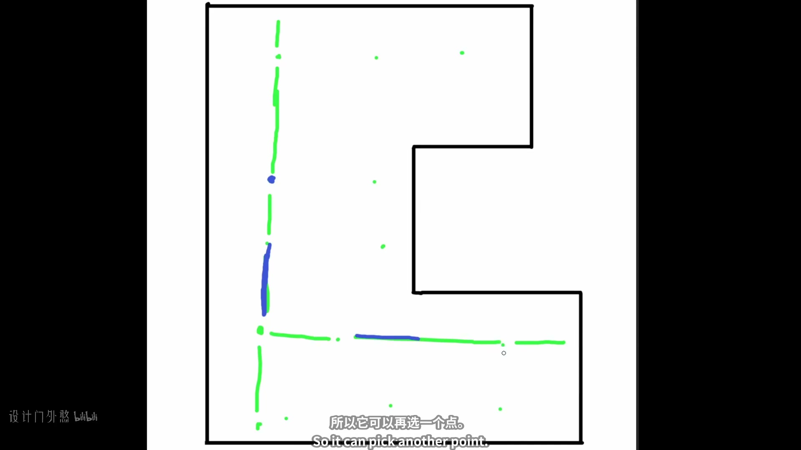
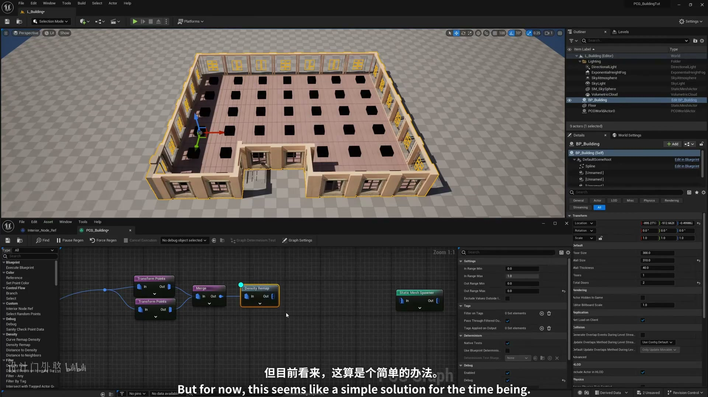

**参数、节点和风险点：**

- `PCG`
- `Point`
- `样条`
- `网格`
- `采样`
- `密度`
- `节点`
- `生成`
- `Soitcanpickanotherpoint`
- `L_Building`

### 把本集放进 PCG 建筑系列主线：先确定建筑输入范围，再把墙、门、楼层、屋顶、房间、楼梯、家具或室内细节拆成独立分支（3）

**内容要点：**

- 把本集放进 PCG 建筑系列主线：先确定建筑输入范围，再把墙、门、楼层、屋顶、房间、楼梯、家具或室内细节拆成独立分支（3）。

**关键截图：**

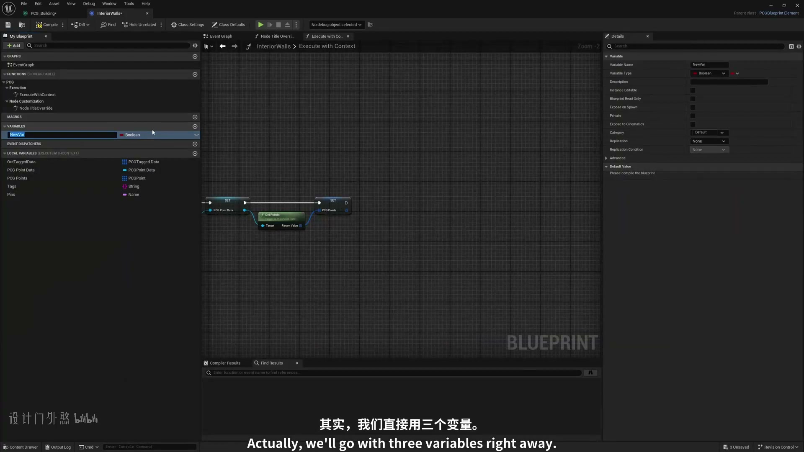
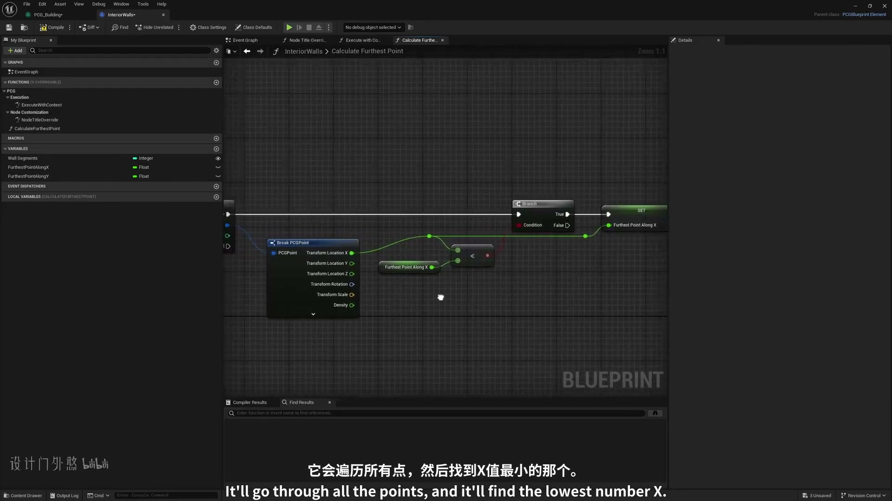

**参数、节点和风险点：**

- `PCG`
- `Blueprint`
- `Graph`
- `节点`
- `生成`
- `InteriorWalls`
- `class`
- `Asset`
- `View`
- `Debug`

### 阅读分段时优先记录点类型、属性、过滤条件、Bounds 和生成器设置，避免把多个建筑部件混在同一批点上

**内容要点：**

- 阅读分段时优先记录点类型、属性、过滤条件、Bounds 和生成器设置，避免把多个建筑部件混在同一批点上。

**关键截图：**

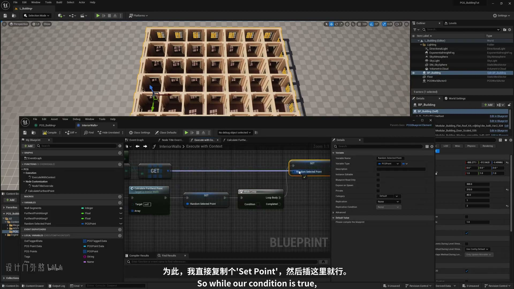
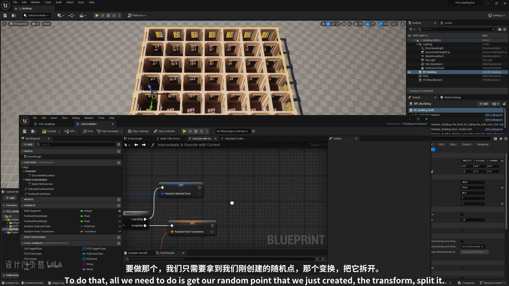

**参数、节点和风险点：**

- `PCG`
- `Point`
- `Random`
- `密度`
- `节点`
- `生成`
- `point`
- `sell`
- `check`
- `L_Building`

### 阅读分段时优先记录点类型、属性、过滤条件、Bounds 和生成器设置，避免把多个建筑部件混在同一批点上（2）

**内容要点：**

- 阅读分段时优先记录点类型、属性、过滤条件、Bounds 和生成器设置，避免把多个建筑部件混在同一批点上（2）。

**关键截图：**

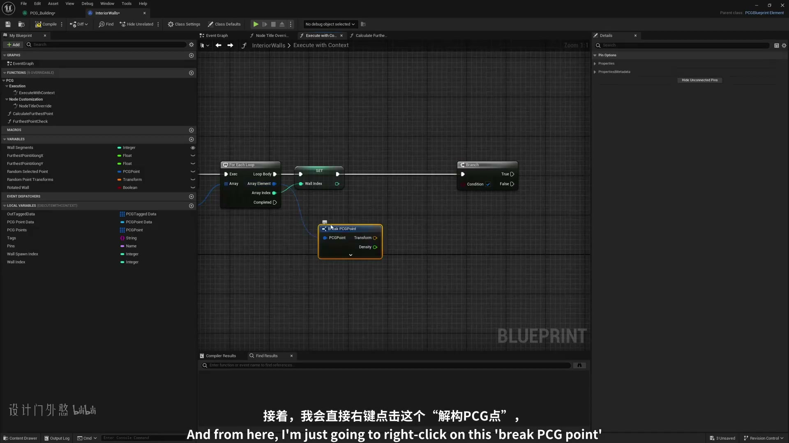
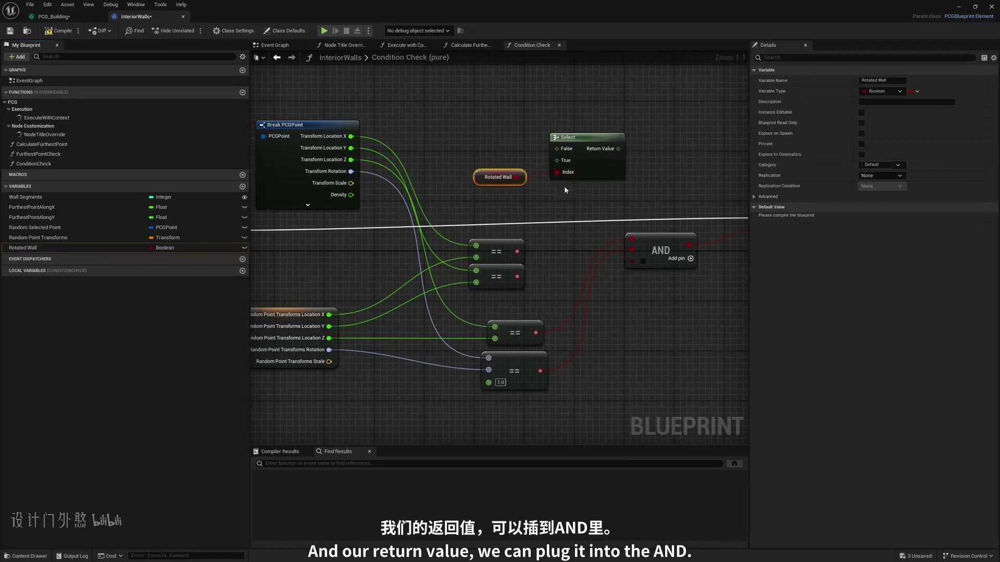

**参数、节点和风险点：**

- `PCG`
- `Blueprint`
- `Graph`
- `参数`
- `节点`
- `生成`
- `Asset`
- `View`
- `Debug`
- `PCG_Builing`

### 室内生成要先划分房间边界、通道和可放置区域，再生成墙面、门洞、家具和装饰

**内容要点：**

- 室内生成要先划分房间边界、通道和可放置区域，再生成墙面、门洞、家具和装饰。

**关键截图：**

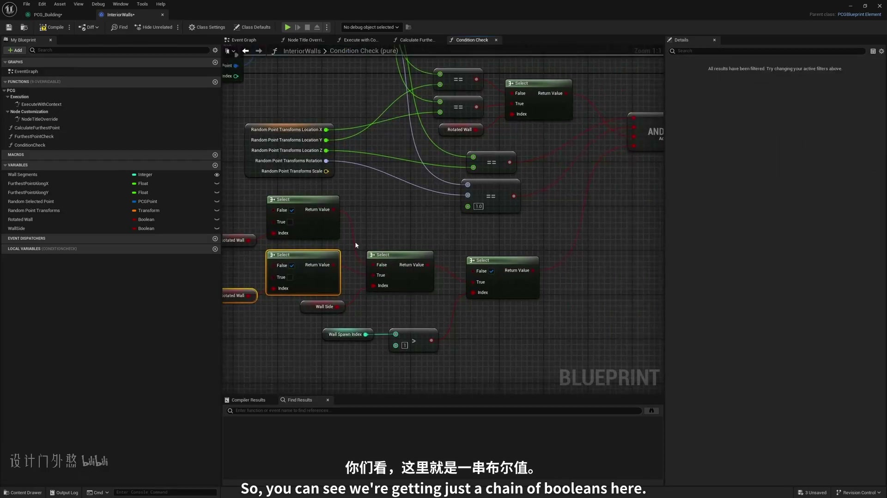
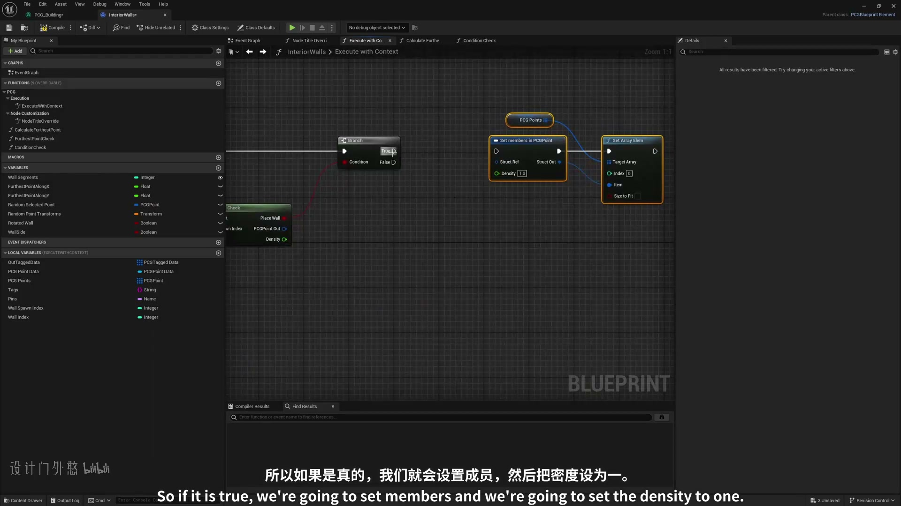

**参数、节点和风险点：**

- `PCG`
- `Blueprint`
- `Graph`
- `密度`
- `节点`
- `生成`
- `class`
- `Asset`
- `View`
- `Debug`

### 室内生成要先划分房间边界、通道和可放置区域，再生成墙面、门洞、家具和装饰（2）

**内容要点：**

- 室内生成要先划分房间边界、通道和可放置区域，再生成墙面、门洞、家具和装饰（2）。

**关键截图：**

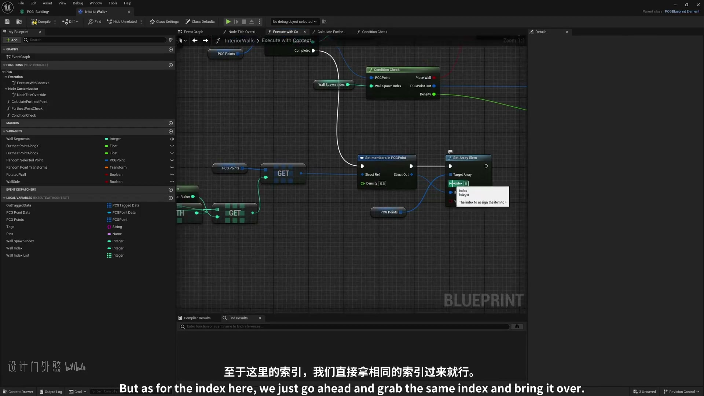
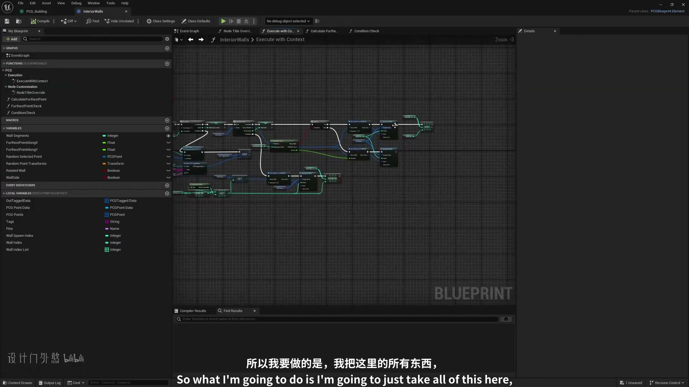

**参数、节点和风险点：**

- `PCG`
- `Blueprint`
- `Graph`
- `网格`
- `过滤`
- `采样`
- `密度`
- `节点`
- `生成`
- `class`

### 室内生成要先划分房间边界、通道和可放置区域，再生成墙面、门洞、家具和装饰（3）

**内容要点：**

- 室内生成要先划分房间边界、通道和可放置区域，再生成墙面、门洞、家具和装饰（3）。

**关键截图：**

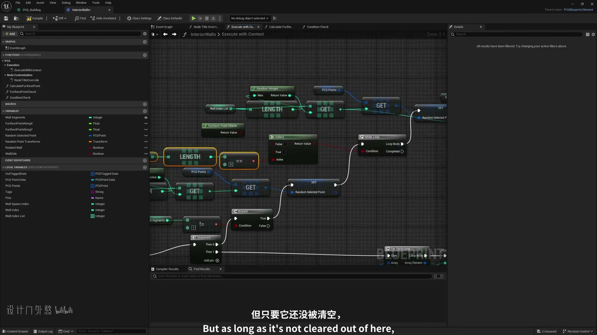
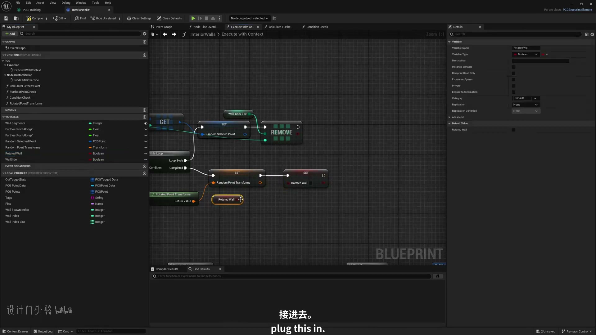

**参数、节点和风险点：**

- `PCG`
- `Blueprint`
- `Graph`
- `节点`
- `InteriorWalls`
- `Asset`
- `View`
- `Debug`
- `PCG_Building`
- `Parentclass`

### 每次加入家具或室内细节都要检查 Bounds 和碰撞，避免家具穿墙、重叠或堵住通道

**内容要点：**

- 每次加入家具或室内细节都要检查 Bounds 和碰撞，避免家具穿墙、重叠或堵住通道。

**关键截图：**

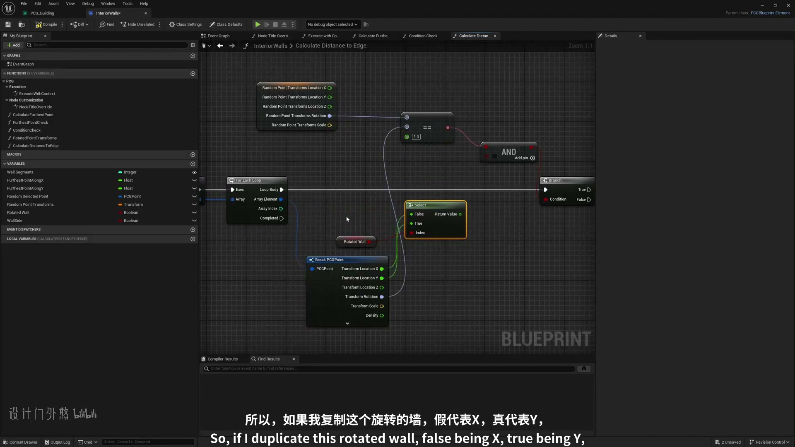
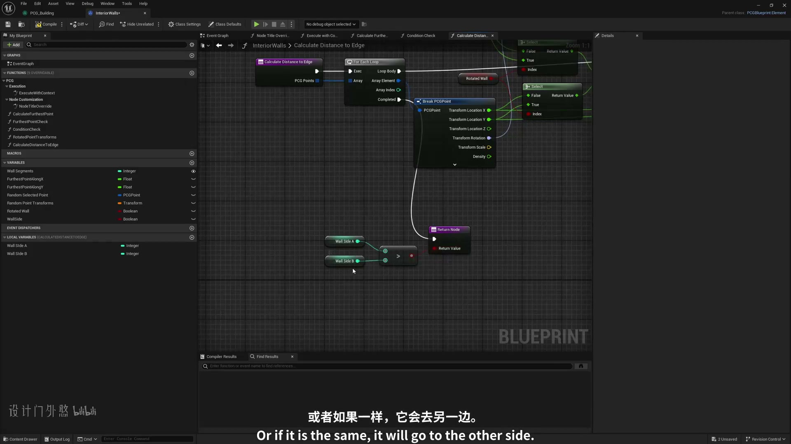

**参数、节点和风险点：**

- `PCG`
- `Blueprint`
- `Graph`
- `网格`
- `节点`
- `生成`
- `建筑`
- `Asset`
- `View`
- `Debug`

### 每次加入家具或室内细节都要检查 Bounds 和碰撞，避免家具穿墙、重叠或堵住通道（2）

**内容要点：**

- 每次加入家具或室内细节都要检查 Bounds 和碰撞，避免家具穿墙、重叠或堵住通道（2）。

**关键截图：**

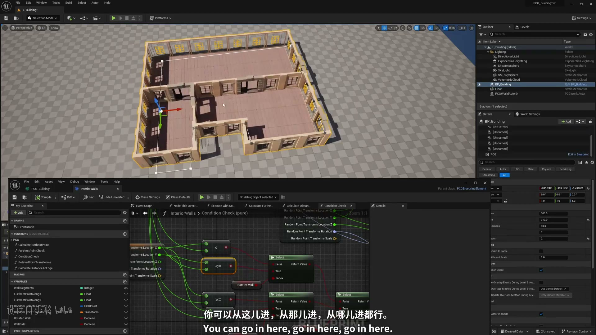
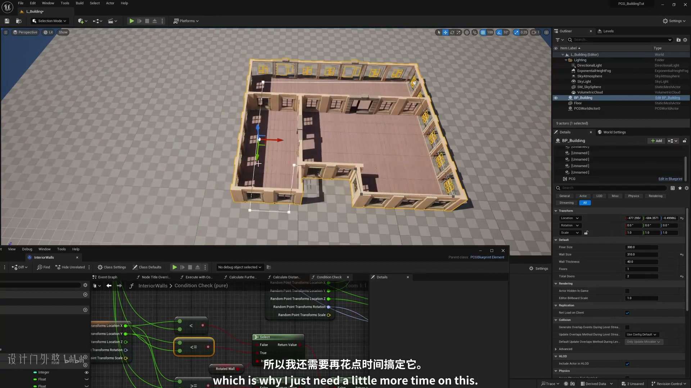

**参数、节点和风险点：**

- `网格`
- `生成`
- `L_Building`
- `Selection`
- `Mode`
- `INIAI`
- `Platforms`
- `Setings`
- `PerspectiveLitShow`
- `Jauno`

## 复现检查清单

- 墙、门、楼层、屋顶、房间、楼梯和家具要用点类型或属性拆开，不要共享同一批未分类点。
- 所有模块资产的 Pivot、尺寸和朝向必须统一，否则 PCG 规则正确也会出现错位。
- 复现时先固定随机种子，再调整密度、过滤和生成资源，避免随机结果掩盖逻辑错误。
