# 05 - 精通多层PCG楼梯搭建

## 知识目标

- 围绕“05 - 精通多层PCG楼梯搭建”整理 UE PCG 建筑生成系列第 05 集：把建筑点云、属性、过滤和生成规则转成可复现的中文操作文档。

## 可复现主流程

- 把本集放进 PCG 建筑系列主线：先确定建筑输入范围，再把墙、门、楼层、屋顶、房间、楼梯、家具或室内细节拆成独立分支。
- 阅读分段时优先记录点类型、属性、过滤条件、Bounds 和生成器设置，避免把多个建筑部件混在同一批点上。
- 楼梯生成要先确定楼层高度、踏步数量、踏步尺寸和转向规则，再把楼梯段作为独立分支生成。
- 复现时检查楼梯是否连接上下层、是否与墙体和房间边界冲突。

## 关键术语

- `PCG`
- `Blueprint`
- `蓝图`
- `Static Mesh`
- `Mesh`
- `Spline`
- `Transform`
- `Point`
- `Attribute`
- `Actor`
- `Component`
- `Spawn`
- `Density`
- `Random`
- `Seed`
- `Loop`
- `Graph`
- `Material`

## 操作步骤与要点

### 把本集放进 PCG 建筑系列主线：先确定建筑输入范围，再把墙、门、楼层、屋顶、房间、楼梯、家具或室内细节拆成独立分支

**内容要点：**

- 把本集放进 PCG 建筑系列主线：先确定建筑输入范围，再把墙、门、楼层、屋顶、房间、楼梯、家具或室内细节拆成独立分支。

**关键截图：**

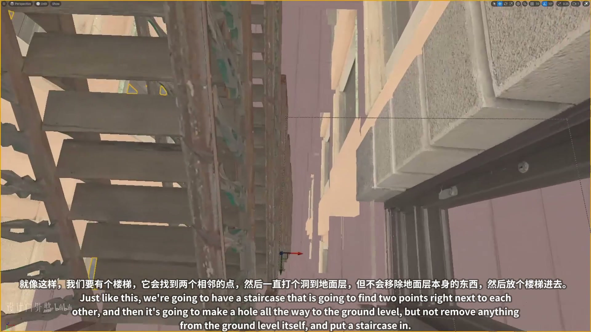
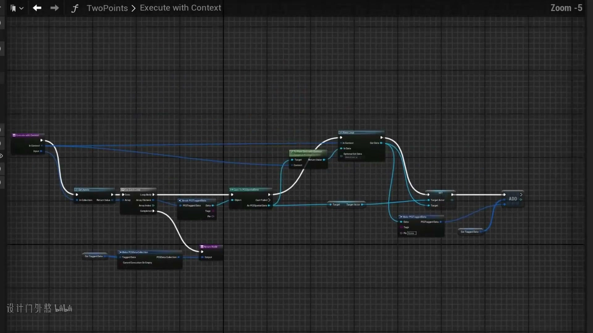

**参数、节点和风险点：**

- `PCG`
- `蓝图`
- `Point`
- `Actor`
- `节点`
- `生成`
- `staircase`
- `OUnlit`
- `thatis`
- `find`

### 把本集放进 PCG 建筑系列主线：先确定建筑输入范围，再把墙、门、楼层、屋顶、房间、楼梯、家具或室内细节拆成独立分支（2）

**内容要点：**

- 把本集放进 PCG 建筑系列主线：先确定建筑输入范围，再把墙、门、楼层、屋顶、房间、楼梯、家具或室内细节拆成独立分支（2）。

**关键截图：**

**参数、节点和风险点：**

- `PCG`
- `Point`
- `Loop`
- `密度`
- `节点`
- `建筑`
- `tags`
- `pins`
- `doing`
- `anything`

### 把本集放进 PCG 建筑系列主线：先确定建筑输入范围，再把墙、门、楼层、屋顶、房间、楼梯、家具或室内细节拆成独立分支（3）

**内容要点：**

- 把本集放进 PCG 建筑系列主线：先确定建筑输入范围，再把墙、门、楼层、屋顶、房间、楼梯、家具或室内细节拆成独立分支（3）。

**关键截图：**

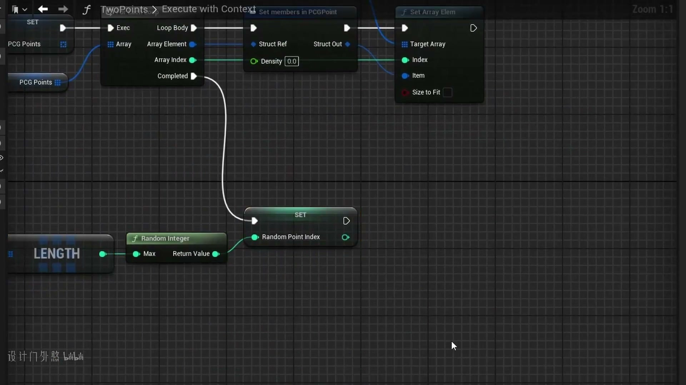
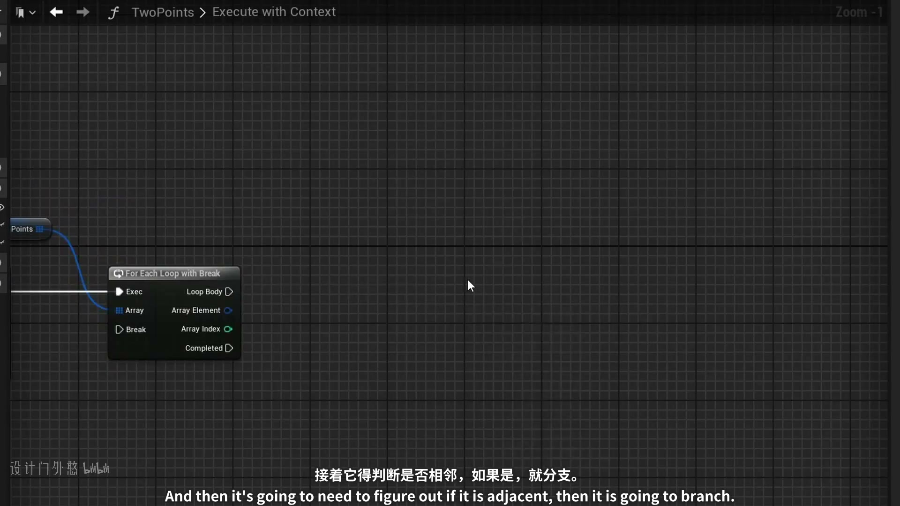

**参数、节点和风险点：**

- `PCG`
- `Point`
- `Density`
- `Loop`
- `密度`
- `节点`
- `生成`
- `Array`
- `Index`
- `rophy`

### 阅读分段时优先记录点类型、属性、过滤条件、Bounds 和生成器设置，避免把多个建筑部件混在同一批点上

**内容要点：**

- 阅读分段时优先记录点类型、属性、过滤条件、Bounds 和生成器设置，避免把多个建筑部件混在同一批点上。

**关键截图：**

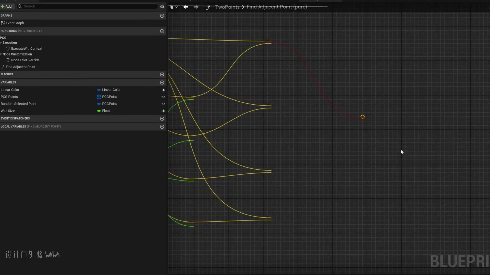

**参数、节点和风险点：**

- `PCG`
- `Point`
- `Graph`
- `网格`
- `节点`
- `Negative`
- `Positive`
- `either`
- `positive`
- `negative`

### 阅读分段时优先记录点类型、属性、过滤条件、Bounds 和生成器设置，避免把多个建筑部件混在同一批点上（2）

**内容要点：**

- 阅读分段时优先记录点类型、属性、过滤条件、Bounds 和生成器设置，避免把多个建筑部件混在同一批点上（2）。

**关键截图：**

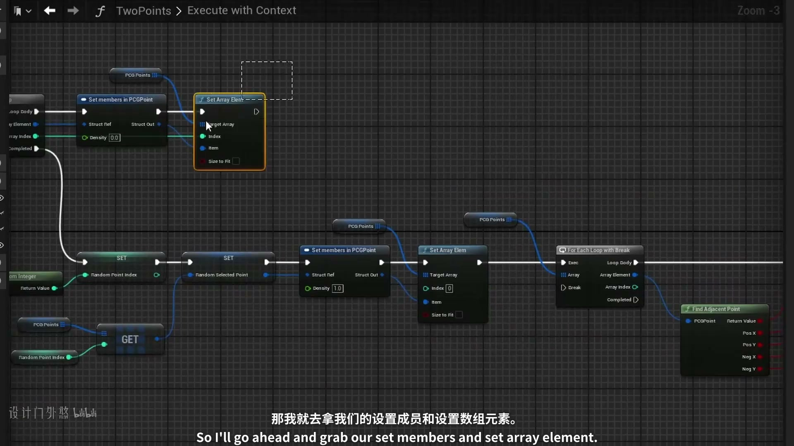
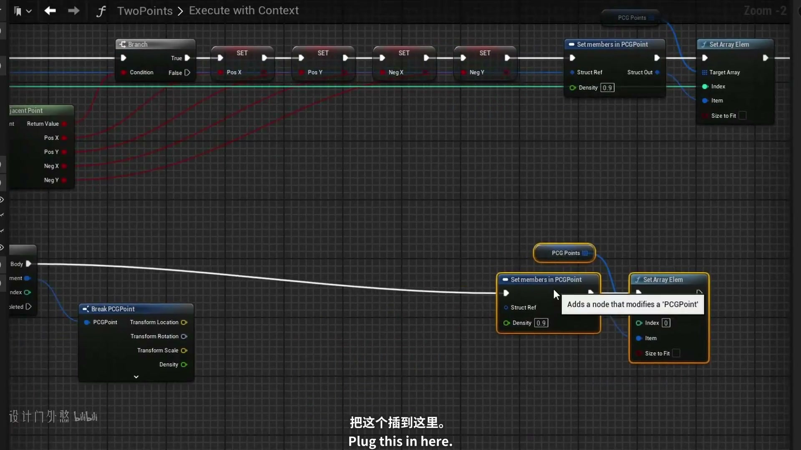

**参数、节点和风险点：**

- `PCG`
- `Point`
- `Density`
- `密度`
- `节点`
- `生成`
- `Struct`
- `each`
- `fTwoPoints`
- `Executewith`

### 阅读分段时优先记录点类型、属性、过滤条件、Bounds 和生成器设置，避免把多个建筑部件混在同一批点上（3）

**内容要点：**

- 阅读分段时优先记录点类型、属性、过滤条件、Bounds 和生成器设置，避免把多个建筑部件混在同一批点上（3）。

**关键截图：**

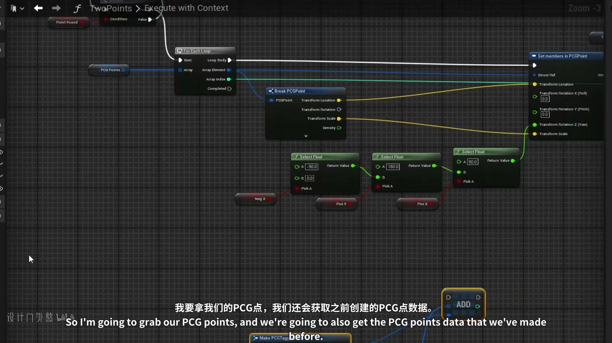
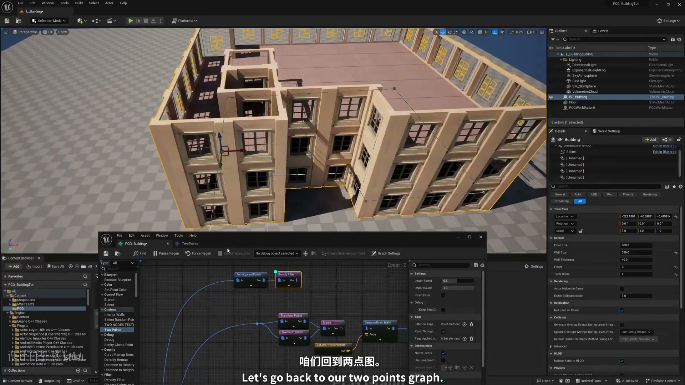

**参数、节点和风险点：**

- `PCG`
- `Transform`
- `Point`
- `Loop`
- `样条`
- `过滤`
- `采样`
- `密度`
- `节点`
- `生成`

### 楼梯生成要先确定楼层高度、踏步数量、踏步尺寸和转向规则，再把楼梯段作为独立分支生成

**内容要点：**

- 楼梯生成要先确定楼层高度、踏步数量、踏步尺寸和转向规则，再把楼梯段作为独立分支生成。

**关键截图：**

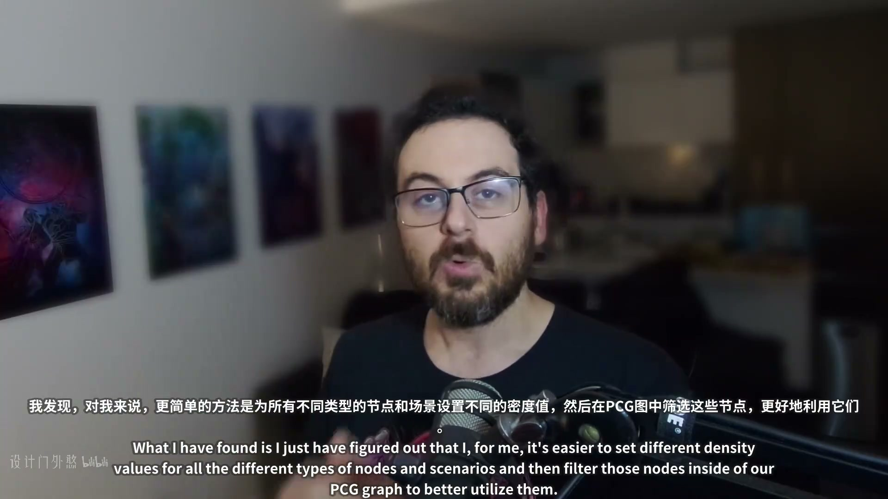
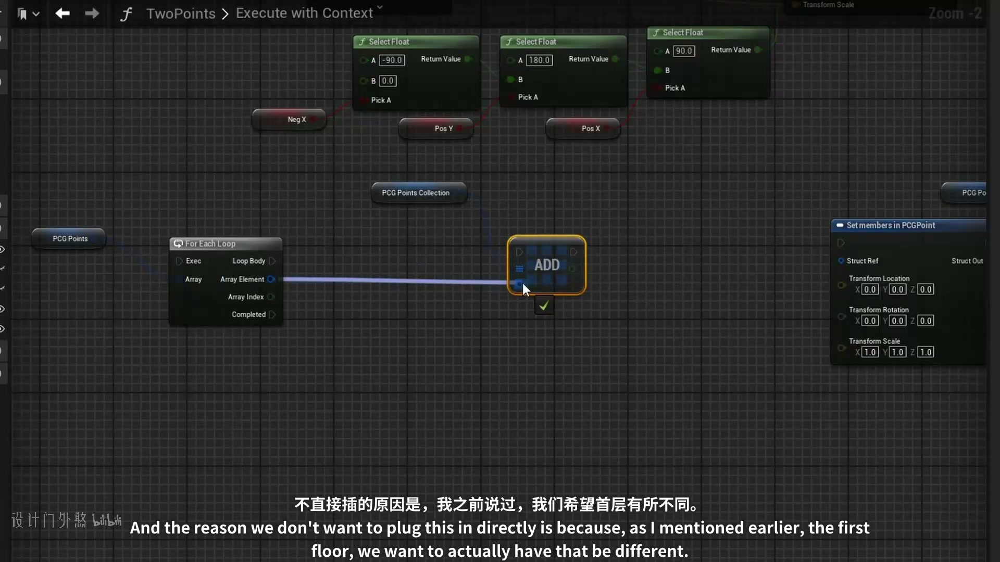

**参数、节点和风险点：**

- `PCG`
- `Transform`
- `Point`
- `Density`
- `Graph`
- `密度`
- `节点`
- `nodes`
- `found`

### 楼梯生成要先确定楼层高度、踏步数量、踏步尺寸和转向规则，再把楼梯段作为独立分支生成（2）

**内容要点：**

- 楼梯生成要先确定楼层高度、踏步数量、踏步尺寸和转向规则，再把楼梯段作为独立分支生成（2）。

**关键截图：**

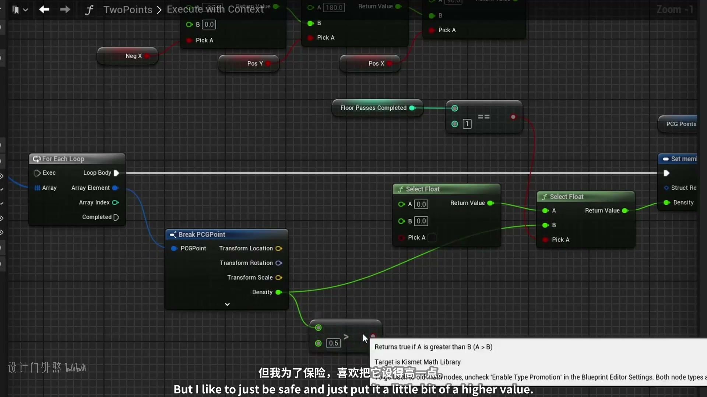
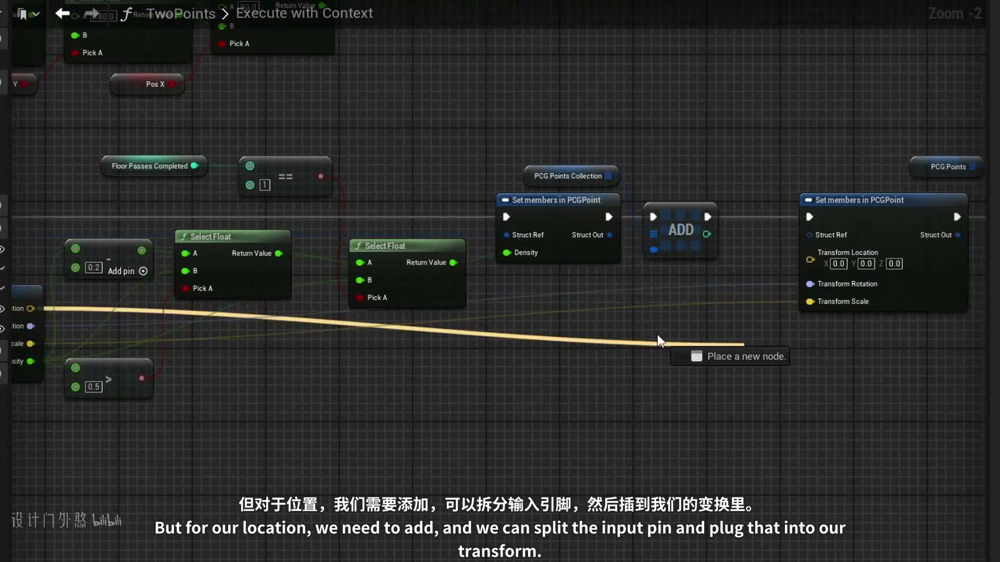

**参数、节点和风险点：**

- `PCG`
- `Point`
- `Loop`
- `密度`
- `节点`
- `Array`
- `fTwoPoints`
- `Execute`
- `withcontextue`
- `Return`

### 楼梯生成要先确定楼层高度、踏步数量、踏步尺寸和转向规则，再把楼梯段作为独立分支生成（3）

**内容要点：**

- 楼梯生成要先确定楼层高度、踏步数量、踏步尺寸和转向规则，再把楼梯段作为独立分支生成（3）。

**关键截图：**

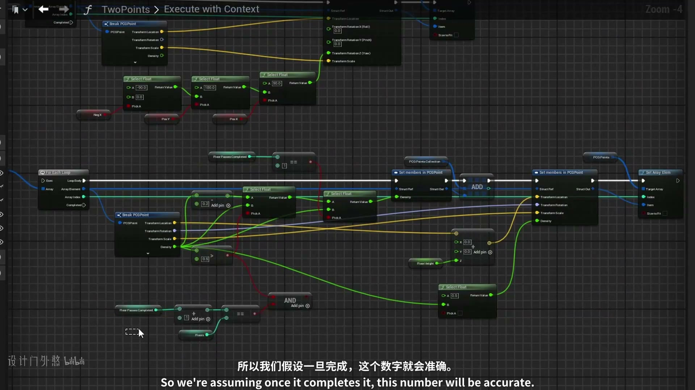
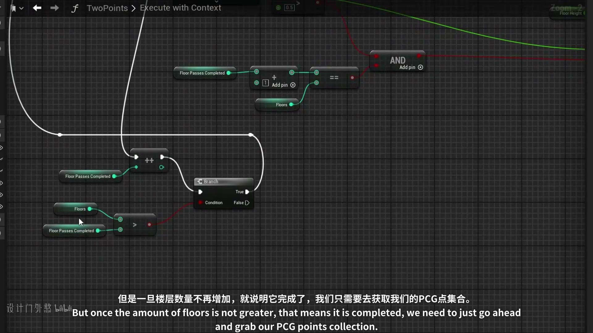

**参数、节点和风险点：**

- `PCG`
- `Point`
- `Actor`
- `属性`
- `密度`
- `节点`
- `TwoPoints`
- `Executewith`
- `Context`
- `Zoom`

### 复现时检查楼梯是否连接上下层、是否与墙体和房间边界冲突

**内容要点：**

- 复现时检查楼梯是否连接上下层、是否与墙体和房间边界冲突。

**关键截图：**

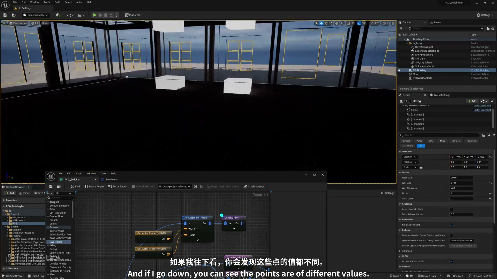
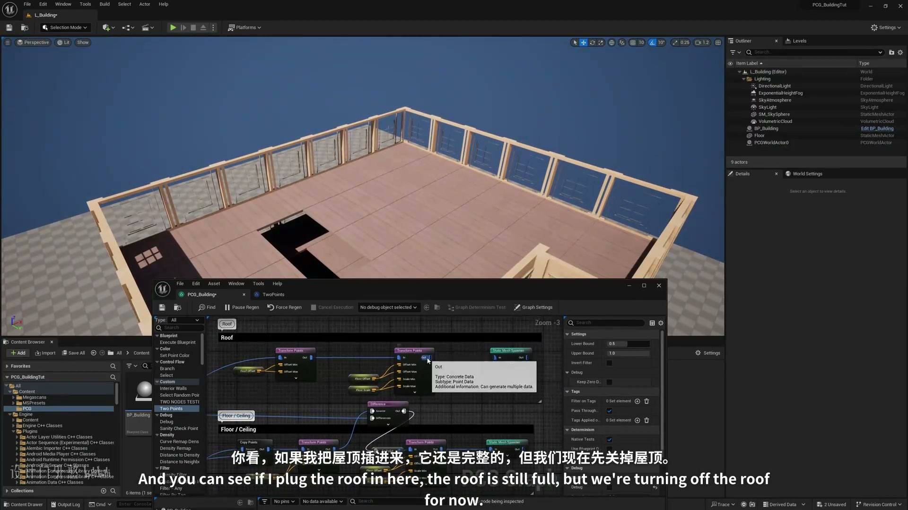

**参数、节点和风险点：**

- `蓝图`
- `Mesh`
- `Actor`
- `过滤`
- `采样`
- `密度`
- `节点`
- `生成`
- `L_Building`
- `Selection`

### 复现时检查楼梯是否连接上下层、是否与墙体和房间边界冲突（2）

**内容要点：**

- 复现时检查楼梯是否连接上下层、是否与墙体和房间边界冲突（2）。

**关键截图：**

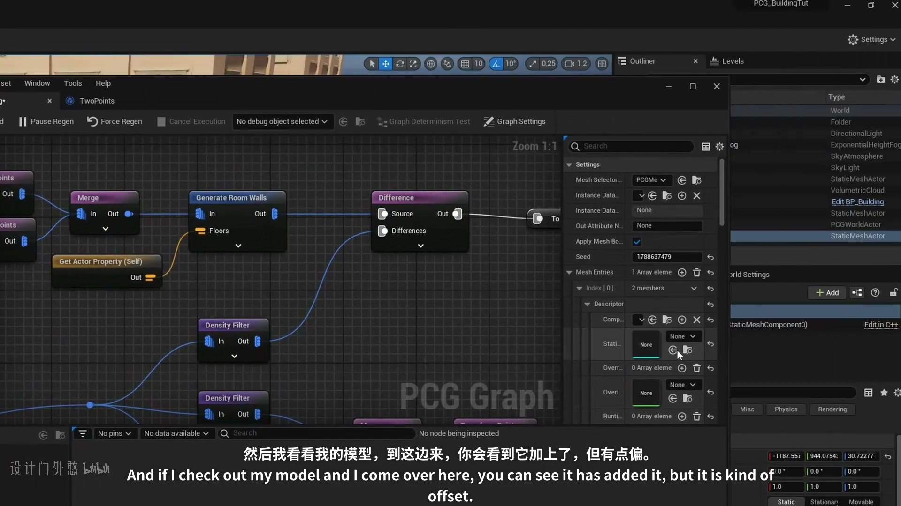
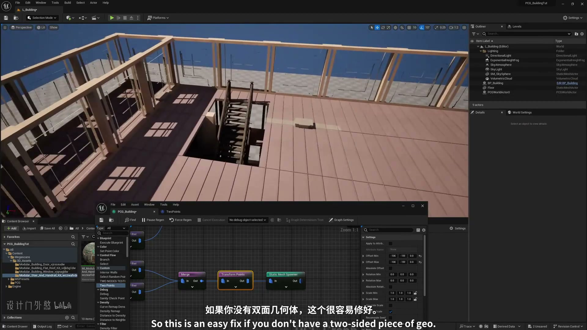

**参数、节点和风险点：**

- `PCG`
- `Point`
- `Graph`
- `网格`
- `密度`
- `节点`
- `生成`
- `建筑`
- `Regen`
- `PCG_BuildingTut`

## 复现检查清单

- 墙、门、楼层、屋顶、房间、楼梯和家具要用点类型或属性拆开，不要共享同一批未分类点。
- 所有模块资产的 Pivot、尺寸和朝向必须统一，否则 PCG 规则正确也会出现错位。
- 复现时先固定随机种子，再调整密度、过滤和生成资源，避免随机结果掩盖逻辑错误。
