# 07 - 为什么你应该在PCG中使用循环

## 知识目标

- 围绕“07 - 为什么你应该在PCG中使用循环”整理 UE PCG 建筑生成系列第 07 集：把建筑点云、属性、过滤和生成规则转成可复现的中文操作文档。

## 可复现主流程

- 把本集放进 PCG 建筑系列主线：先确定建筑输入范围，再把墙、门、楼层、屋顶、房间、楼梯、家具或室内细节拆成独立分支。
- 阅读分段时优先记录点类型、属性、过滤条件、Bounds 和生成器设置，避免把多个建筑部件混在同一批点上。
- 重点整理 PCG Loop 如何复用同一段生成逻辑：输入是什么，循环体输出什么属性，终止或层数由什么控制。
- 循环图表要特别检查属性是否在每轮被覆盖、累积或丢失，否则容易生成重复楼层或无限叠点。

## 关键术语

- `PCG`
- `Blueprint`
- `Mesh`
- `Spline`
- `Transform`
- `Point`
- `Actor`
- `Spawn`
- `Bounds`
- `Density`
- `Random`
- `Loop`
- `Graph`
- `Instance`
- `样条`
- `网格`
- `过滤`
- `采样`

## 操作步骤与要点

### 把本集放进 PCG 建筑系列主线：先确定建筑输入范围，再把墙、门、楼层、屋顶、房间、楼梯、家具或室内细节拆成独立分支

**内容要点：**

- 把本集放进 PCG 建筑系列主线：先确定建筑输入范围，再把墙、门、楼层、屋顶、房间、楼梯、家具或室内细节拆成独立分支。

**关键截图：**

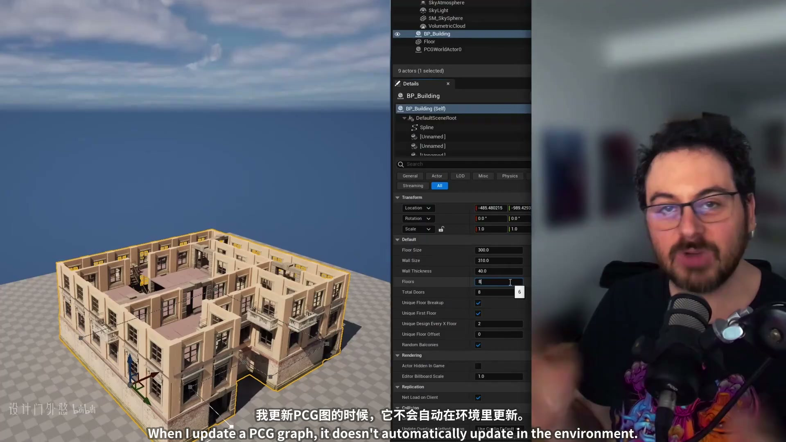
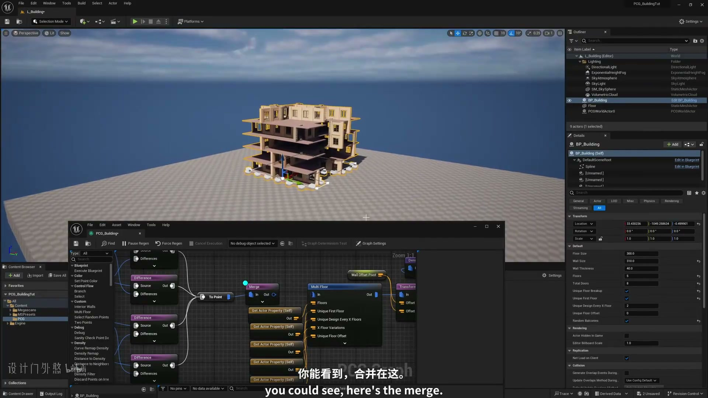

**参数、节点和风险点：**

- `PCG`
- `Spline`
- `Actor`
- `样条`
- `采样`
- `节点`
- `生成`
- `建筑`
- `BP_Building`
- `SkyAtmosphere`

### 把本集放进 PCG 建筑系列主线：先确定建筑输入范围，再把墙、门、楼层、屋顶、房间、楼梯、家具或室内细节拆成独立分支（2）

**内容要点：**

- 把本集放进 PCG 建筑系列主线：先确定建筑输入范围，再把墙、门、楼层、屋顶、房间、楼梯、家具或室内细节拆成独立分支（2）。

**关键截图：**

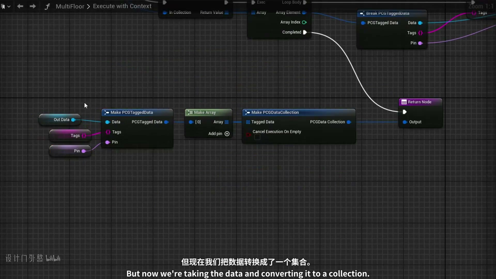

**参数、节点和风险点：**

- `PCG`
- `Loop`
- `Graph`
- `密度`
- `节点`
- `生成`
- `Data`
- `data`
- `nodes`
- `prior`

### 阅读分段时优先记录点类型、属性、过滤条件、Bounds 和生成器设置，避免把多个建筑部件混在同一批点上

**内容要点：**

- 阅读分段时优先记录点类型、属性、过滤条件、Bounds 和生成器设置，避免把多个建筑部件混在同一批点上。

**关键截图：**

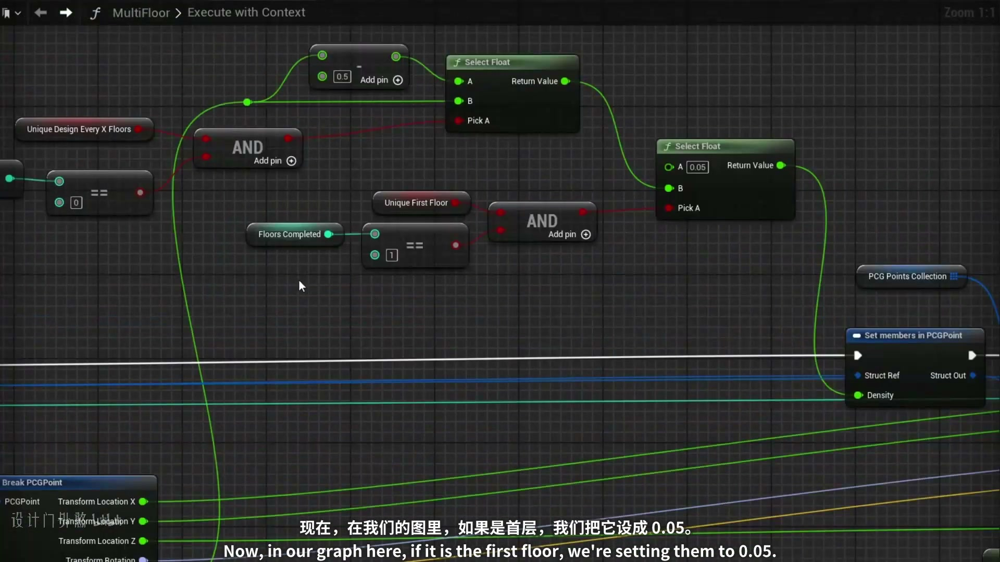
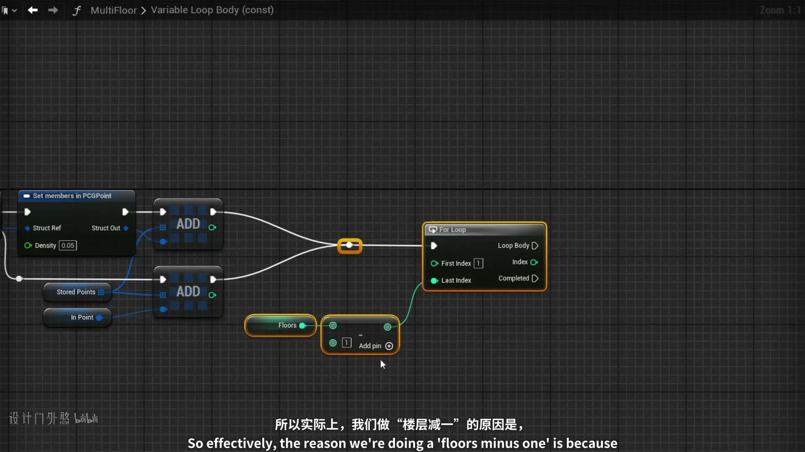

**参数、节点和风险点：**

- `PCG`
- `Point`
- `Density`
- `网格`
- `过滤`
- `密度`
- `节点`
- `生成`
- `建筑`
- `fMultiFloor`

### 阅读分段时优先记录点类型、属性、过滤条件、Bounds 和生成器设置，避免把多个建筑部件混在同一批点上（2）

**内容要点：**

- 阅读分段时优先记录点类型、属性、过滤条件、Bounds 和生成器设置，避免把多个建筑部件混在同一批点上（2）。

**关键截图：**

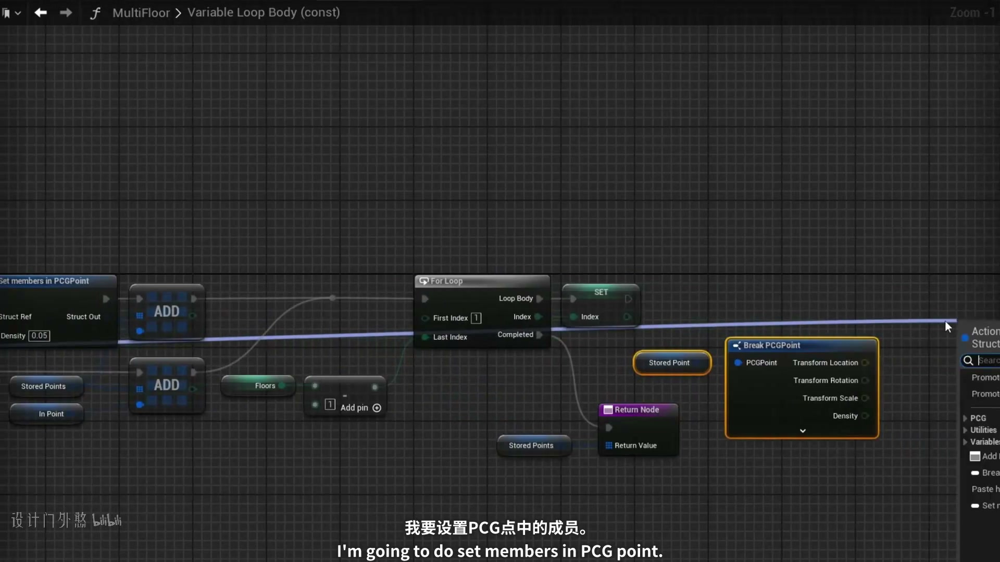
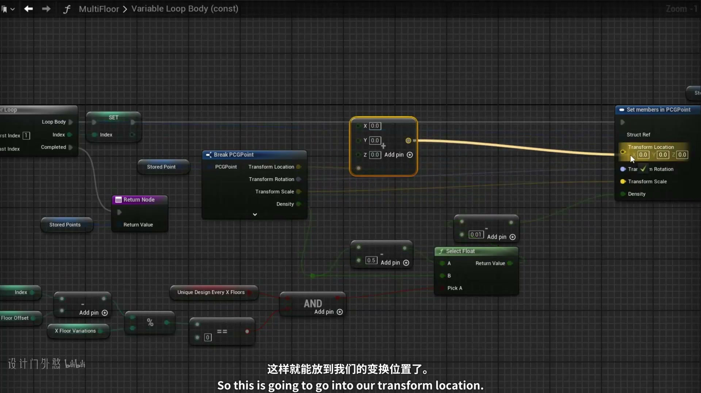

**参数、节点和风险点：**

- `PCG`
- `Point`
- `Density`
- `Loop`
- `密度`
- `节点`
- `建筑`
- `Index`
- `fMultiFloor`
- `Variable`

### 重点整理 PCG Loop 如何复用同一段生成逻辑：输入是什么，循环体输出什么属性，终止或层数由什么控制

**内容要点：**

- 重点整理 PCG Loop 如何复用同一段生成逻辑：输入是什么，循环体输出什么属性，终止或层数由什么控制。

**关键截图：**

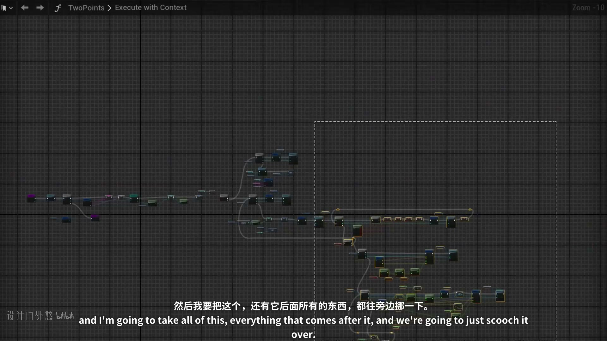
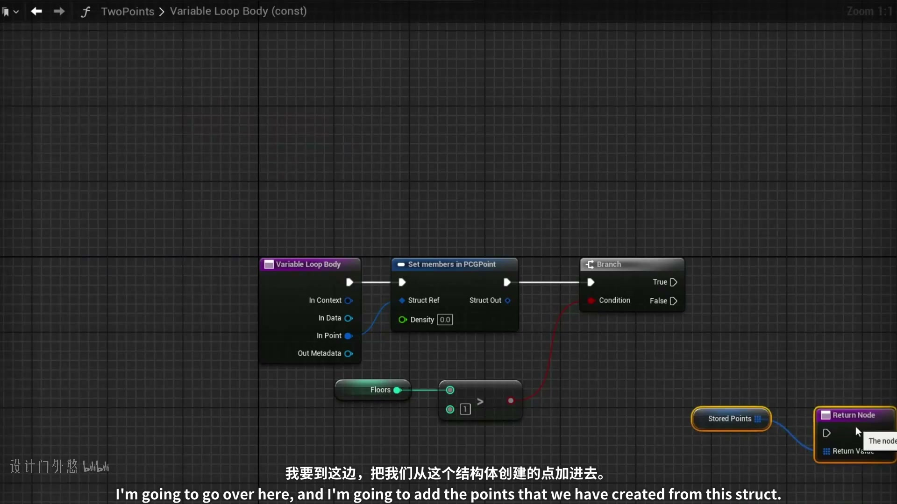

**参数、节点和风险点：**

- `PCG`
- `Point`
- `Loop`
- `密度`
- `节点`
- `fTwoPoints`
- `VariableLoopBody`
- `ExecutewithContext`
- `Zo0m`
- `take`

### 重点整理 PCG Loop 如何复用同一段生成逻辑：输入是什么，循环体输出什么属性，终止或层数由什么控制（2）

**内容要点：**

- 重点整理 PCG Loop 如何复用同一段生成逻辑：输入是什么，循环体输出什么属性，终止或层数由什么控制（2）。

**关键截图：**

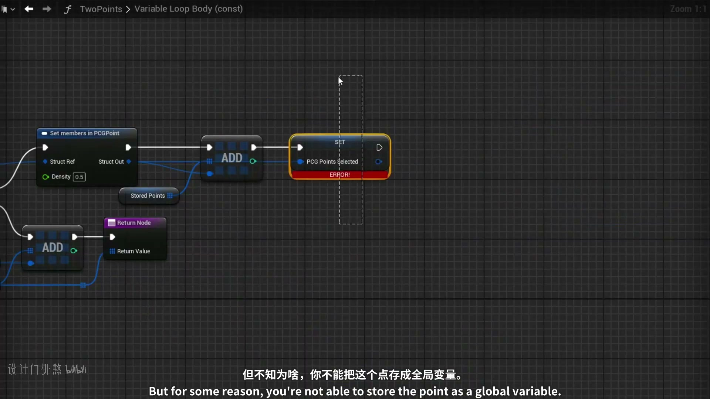
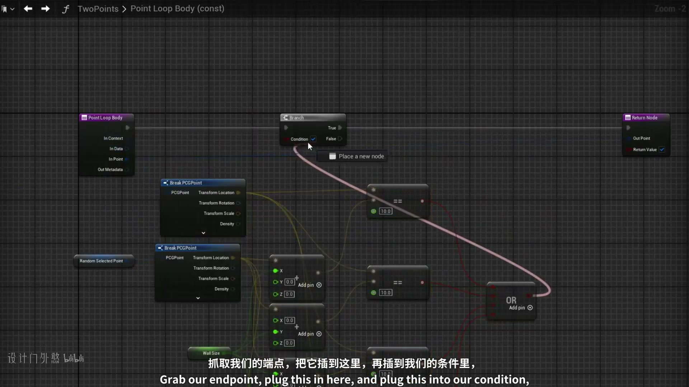

**参数、节点和风险点：**

- `PCG`
- `Point`
- `Density`
- `Loop`
- `密度`
- `节点`
- `const`
- `fTwoPoints`
- `VariableLoopBody`
- `Zoom`

### 循环图表要特别检查属性是否在每轮被覆盖、累积或丢失，否则容易生成重复楼层或无限叠点

**内容要点：**

- 循环图表要特别检查属性是否在每轮被覆盖、累积或丢失，否则容易生成重复楼层或无限叠点。

**关键截图：**

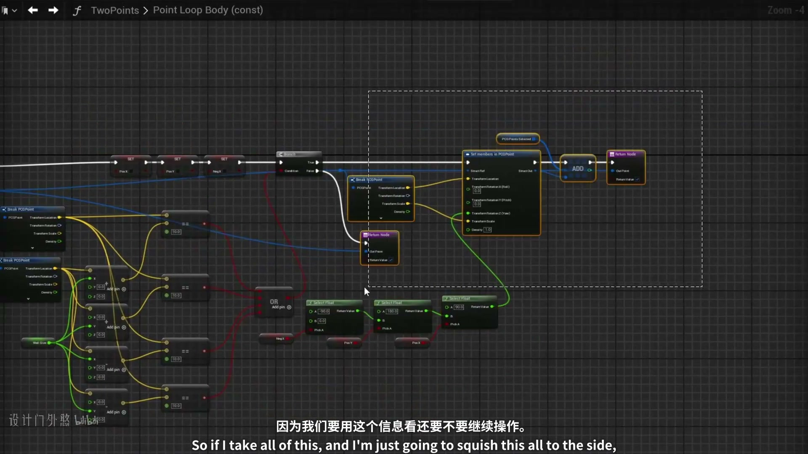

**参数、节点和风险点：**

- `PCG`
- `Point`
- `Loop`
- `过滤`
- `密度`
- `节点`
- `生成`
- `fTwoPoints`
- `LoopBody`
- `const`

### 循环图表要特别检查属性是否在每轮被覆盖、累积或丢失，否则容易生成重复楼层或无限叠点（2）

**内容要点：**

- 循环图表要特别检查属性是否在每轮被覆盖、累积或丢失，否则容易生成重复楼层或无限叠点（2）。

**关键截图：**

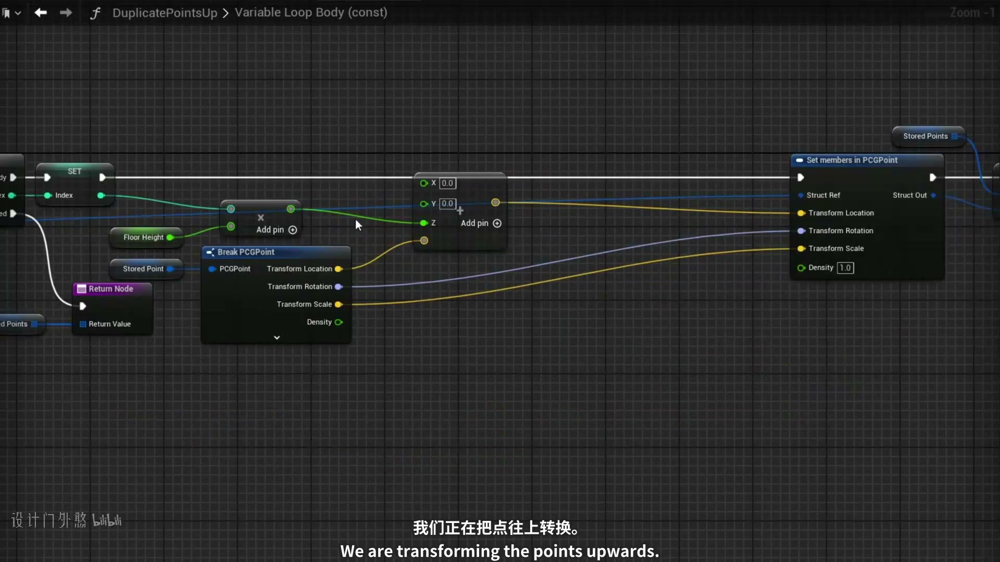
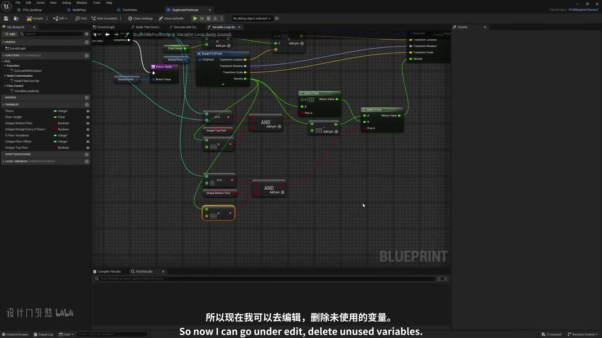

**参数、节点和风险点：**

- `PCG`
- `Transform`
- `Point`
- `Loop`
- `过滤`
- `密度`
- `节点`
- `生成`
- `PCGPoint`
- `DuplicatePointsUp`

## 复现检查清单

- 墙、门、楼层、屋顶、房间、楼梯和家具要用点类型或属性拆开，不要共享同一批未分类点。
- 所有模块资产的 Pivot、尺寸和朝向必须统一，否则 PCG 规则正确也会出现错位。
- 复现时先固定随机种子，再调整密度、过滤和生成资源，避免随机结果掩盖逻辑错误。
