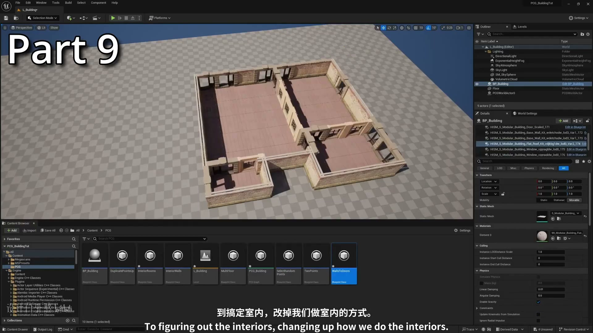
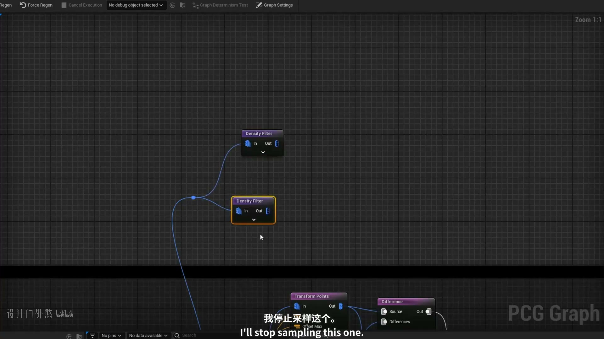
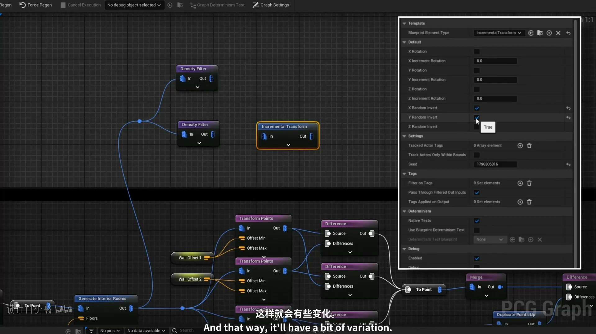
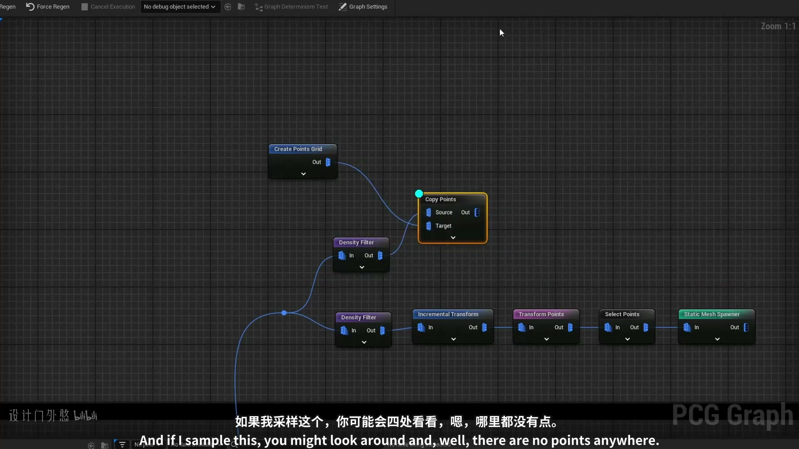
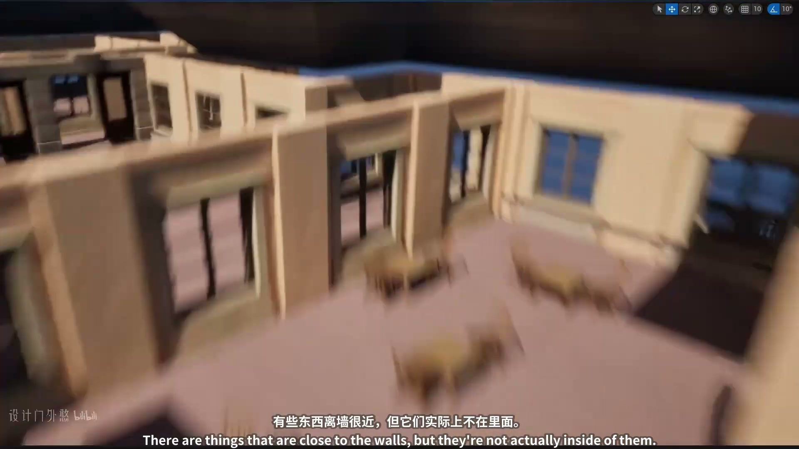

# 12 - 让家具与PCG完美契合

## 知识目标

- 围绕“12 - 让家具与PCG完美契合”整理 UE PCG 建筑生成系列第 12 集：把建筑点云、属性、过滤和生成规则转成可复现的中文操作文档。

## 可复现主流程

- 把本集放进 PCG 建筑系列主线：先确定建筑输入范围，再把墙、门、楼层、屋顶、房间、楼梯、家具或室内细节拆成独立分支。
- 阅读分段时优先记录点类型、属性、过滤条件、Bounds 和生成器设置，避免把多个建筑部件混在同一批点上。
- 家具适配要先确定桌面、房间或可放置表面的 Bounds，再用过滤和投射让家具落在正确区域。
- 不同家具应分支控制尺寸、朝向和占用范围，避免生成在同一位置。

## 关键术语

- `PCG`
- `Blueprint`
- `蓝图`
- `Static Mesh`
- `Mesh`
- `Point Filter`
- `Transform`
- `Point`
- `Attribute`
- `Actor`
- `Component`
- `Spawn`
- `Grid`
- `Bounds`
- `Density`
- `Random`
- `Seed`
- `Graph`

## 操作步骤与要点

### 把本集放进 PCG 建筑系列主线：先确定建筑输入范围，再把墙、门、楼层、屋顶、房间、楼梯、家具或室内细节拆成独立分支

**内容要点：**

- 把本集放进 PCG 建筑系列主线：先确定建筑输入范围，再把墙、门、楼层、屋顶、房间、楼梯、家具或室内细节拆成独立分支。

**关键截图：**

**参数、节点和风险点：**

- `Component`
- `网格`
- `过滤`
- `采样`
- `密度`
- `生成`
- `建筑`
- `L_Building`
- `Selection`
- `Mode`

### 阅读分段时优先记录点类型、属性、过滤条件、Bounds 和生成器设置，避免把多个建筑部件混在同一批点上

**内容要点：**

- 阅读分段时优先记录点类型、属性、过滤条件、Bounds 和生成器设置，避免把多个建筑部件混在同一批点上。

**关键截图：**

**参数、节点和风险点：**

- `Blueprint`
- `蓝图`
- `Transform`
- `Density`
- `Random`
- `Graph`
- `网格`
- `体积`
- `过滤`
- `采样`

### 家具适配要先确定桌面、房间或可放置表面的 Bounds，再用过滤和投射让家具落在正确区域

**内容要点：**

- 家具适配要先确定桌面、房间或可放置表面的 Bounds，再用过滤和投射让家具落在正确区域。

**关键截图：**

**参数、节点和风险点：**

- `Transform`
- `Graph`
- `网格`
- `采样`
- `节点`
- `生成`
- `Sowhat`
- `self`
- `pruning`
- `close`

### 不同家具应分支控制尺寸、朝向和占用范围，避免生成在同一位置

**内容要点：**

- 不同家具应分支控制尺寸、朝向和占用范围，避免生成在同一位置。

**关键截图：**

**参数、节点和风险点：**

- `PCG`
- `Blueprint`
- `蓝图`
- `Transform`
- `Actor`
- `Spawn`
- `网格`
- `生成`
- `建筑`
- `youcanuse`

## 复现检查清单

- 墙、门、楼层、屋顶、房间、楼梯和家具要用点类型或属性拆开，不要共享同一批未分类点。
- 所有模块资产的 Pivot、尺寸和朝向必须统一，否则 PCG 规则正确也会出现错位。
- 复现时先固定随机种子，再调整密度、过滤和生成资源，避免随机结果掩盖逻辑错误。
