# 虚幻引擎5.4.4中制作PCG森林路径全流程

## 知识目标

- 围绕“虚幻引擎5.4.4中制作PCG森林路径全流程”整理 PCG 视频中的输入数据、图表规则、关键节点、参数风险和最终生成结果。
- 阅读时重点区分三层：输入来源（点、样条、表面、体积、Actor 或属性）、规则处理（采样、过滤、变换、分区、循环、HLSL 或子图）、输出方式（Static Mesh Spawner、Spawn Actor、Spline Mesh、Blueprint 或 Dynamic Mesh）。

## 可复现主流程

- 确认 PCG Graph/PCG Component 已绑定到正确 Actor，并先用 Debug/Inspect 查看中间点数据。
- 明确输入来源：Spline、Surface、Mesh、Volume、Actor、Data Asset/Data Table 或手工参数。
- 在图表中按顺序处理采样、属性写入、过滤、Transform、分区/循环和输出节点。
- 生成可见结果前，先核对 Point 的 Transform、Bounds、Density、Seed 和自定义 Attribute。
- 用 Static Mesh Spawner 输出大量网格实例；需要蓝图逻辑时改用 Spawn Actor 或 Blueprint 交互。

## 关键术语

- `PCG`、`Blueprint`、`蓝图`、`Static Mesh`、`Mesh`、`SubGraph`、`Spline`、`Transform`、`Point`、`Attribute`、`Actor`、`Component`、`Spawn`、`Grid`、`Bounds`、`Density`、`Random`、`Seed`、`Spline Sampler`、`Surface Sampler`、`Static Mesh Spawner`、`Spawn Actor`、`Transform Points`、`Filter`

## 分段知识

### 00:00:00-00:04:40 点数据、Bounds 与采样来源

- 本段定位：点数据、Bounds 与采样来源。
- 知识点：Landscape/Surface 输入负责提供地表采样点，复现时要核对采样范围、Layer/材质过滤、坡度或高度条件。
- 知识点：Gaea 输出高度图和遮罩贴图后，需要在 UE 中正确导入并绑定到 Landscape/材质层，PCG 再按图层信息控制地貌与植被。
- 知识点：Niagara 或组件输出应挂在筛选后的 PCG 点上，先核对点位置、随机偏移和实例数量，再接入 Niagara Component。
- 复现要点：先用 Debug/Inspect 核对点数量、Bounds、Density 和关键属性，再判断最终生成结果。
- 核对对象：`PCG`、`Bounds`、`点`、`点数据`、`采样`。

**关键画面：**

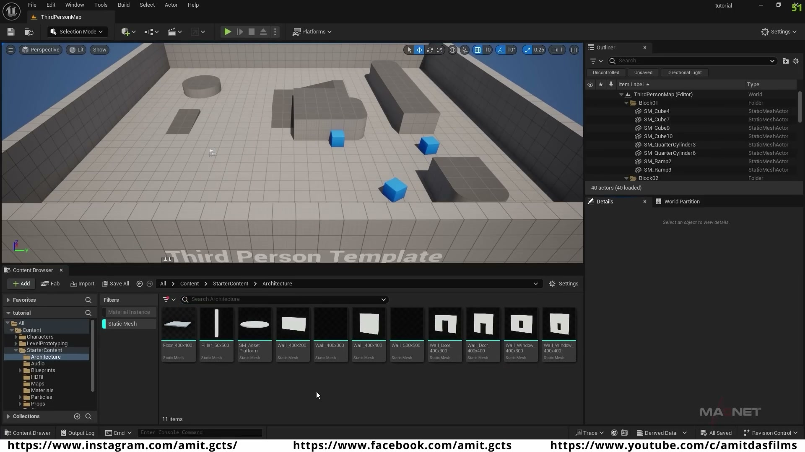

### 00:04:40-00:09:22 属性、过滤与数据分流

- 本段定位：属性、过滤与数据分流。
- 知识点：Landscape/Surface 输入负责提供地表采样点，复现时要核对采样范围、Layer/材质过滤、坡度或高度条件。
- 知识点：Gaea 输出高度图和遮罩贴图后，需要在 UE 中正确导入并绑定到 Landscape/材质层，PCG 再按图层信息控制地貌与植被。
- 复现要点：先用 Debug/Inspect 核对点数量、Bounds、Density 和关键属性，再判断最终生成结果。
- 复现要点：属性命名要稳定，过滤、分区和分支节点应保留可检查的中间数据，避免后续规则难以追踪。
- 核对对象：`Material`、`点`、`属性`、`过滤`、`网格`、`材质`。

**关键画面：**

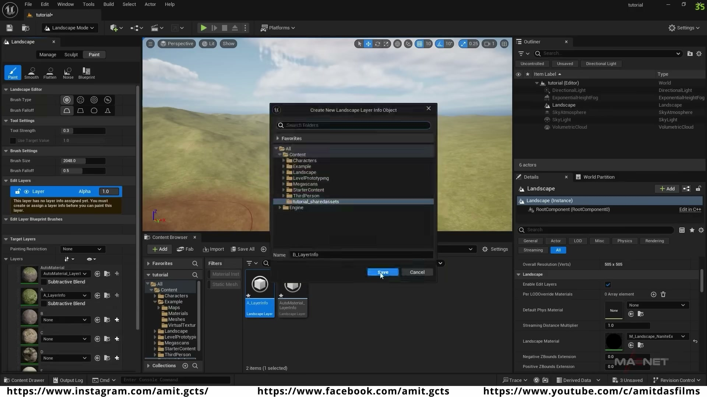

### 00:09:22-00:14:06 属性、过滤与数据分流

- 本段定位：属性、过滤与数据分流。
- 知识点：Landscape/Surface 输入负责提供地表采样点，复现时要核对采样范围、Layer/材质过滤、坡度或高度条件。
- 知识点：Gaea 输出高度图和遮罩贴图后，需要在 UE 中正确导入并绑定到 Landscape/材质层，PCG 再按图层信息控制地貌与植被。
- 知识点：植被生成要按点密度、随机 Transform、网格清单和剔除规则逐项核对，避免道路、岩石或地形边缘出现穿插。
- 复现要点：先用 Debug/Inspect 核对点数量、Bounds、Density 和关键属性，再判断最终生成结果。
- 复现要点：属性命名要稳定，过滤、分区和分支节点应保留可检查的中间数据，避免后续规则难以追踪。
- 核对对象：`Material`、`Instance`、`点`、`属性`、`过滤`、`材质`。

**关键画面：**

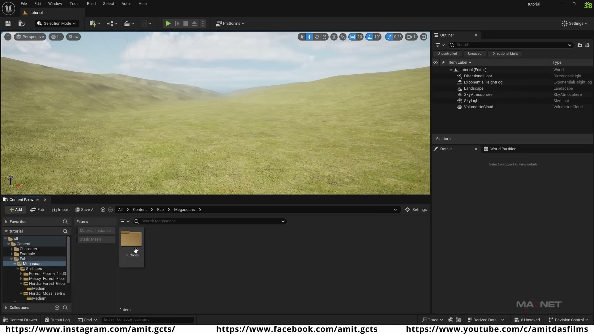
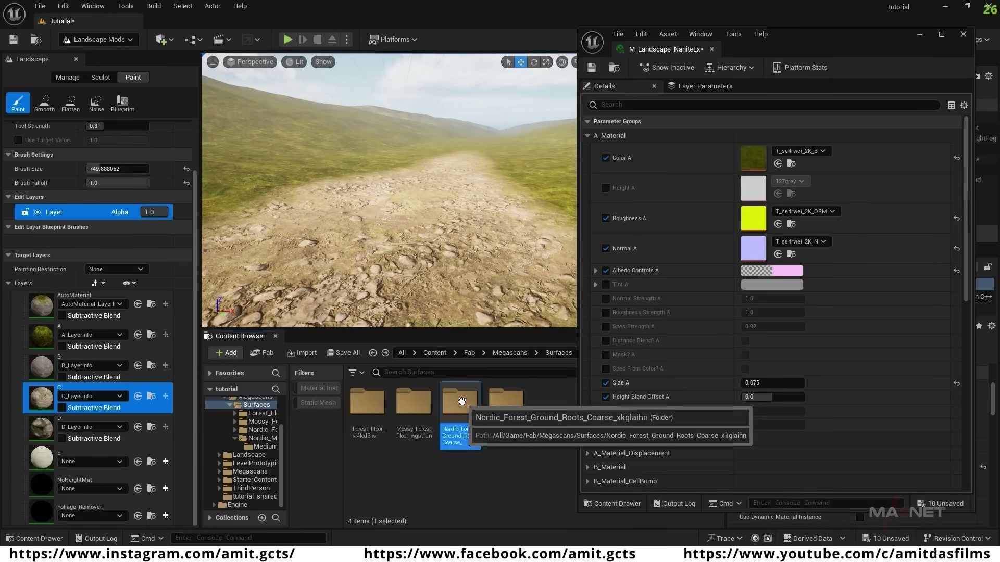

### 00:14:06-00:16:48 属性、过滤与数据分流

- 本段定位：属性、过滤与数据分流。
- 知识点：Landscape/Surface 输入负责提供地表采样点，复现时要核对采样范围、Layer/材质过滤、坡度或高度条件。
- 知识点：植被生成要按点密度、随机 Transform、网格清单和剔除规则逐项核对，避免道路、岩石或地形边缘出现穿插。
- 知识点：道路或街区边界由样条/Spline Mesh 驱动，复现时要核对样条点、切线、宽度和交叉口连接。
- 复现要点：先用 Debug/Inspect 核对点数量、Bounds、Density 和关键属性，再判断最终生成结果。
- 复现要点：属性命名要稳定，过滤、分区和分支节点应保留可检查的中间数据，避免后续规则难以追踪。
- 复现要点：Static Mesh Spawner 用于高效实例化；Spawn Actor/Blueprint 用于需要逻辑的对象，成本和生命周期不同。
- 核对对象：`Density`、`Static Mesh`、`Filter`、`Material`、`属性`、`过滤`、`网格`、`材质`。

**关键画面：**

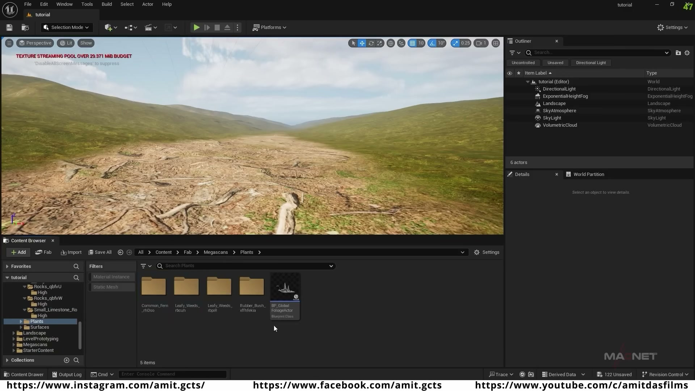
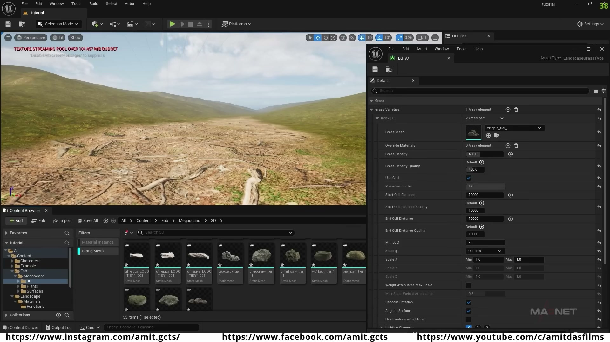

### 00:16:53-00:21:28 生成器输出与蓝图交互

- 本段定位：生成器输出与蓝图交互。
- 知识点：Landscape/Surface 输入负责提供地表采样点，复现时要核对采样范围、Layer/材质过滤、坡度或高度条件。
- 知识点：植被生成要按点密度、随机 Transform、网格清单和剔除规则逐项核对，避免道路、岩石或地形边缘出现穿插。
- 知识点：道路或街区边界由样条/Spline Mesh 驱动，复现时要核对样条点、切线、宽度和交叉口连接。
- 复现要点：先用 Debug/Inspect 核对点数量、Bounds、Density 和关键属性，再判断最终生成结果。
- 复现要点：属性命名要稳定，过滤、分区和分支节点应保留可检查的中间数据，避免后续规则难以追踪。
- 复现要点：Static Mesh Spawner 用于高效实例化；Spawn Actor/Blueprint 用于需要逻辑的对象，成本和生命周期不同。
- 核对对象：`PCG`、`Surface Sampler`、`Static Mesh`、`Static Mesh Spawner`、`Filter`、`图表`、`点`、`采样`、`过滤`、`生成`。

**关键画面：**

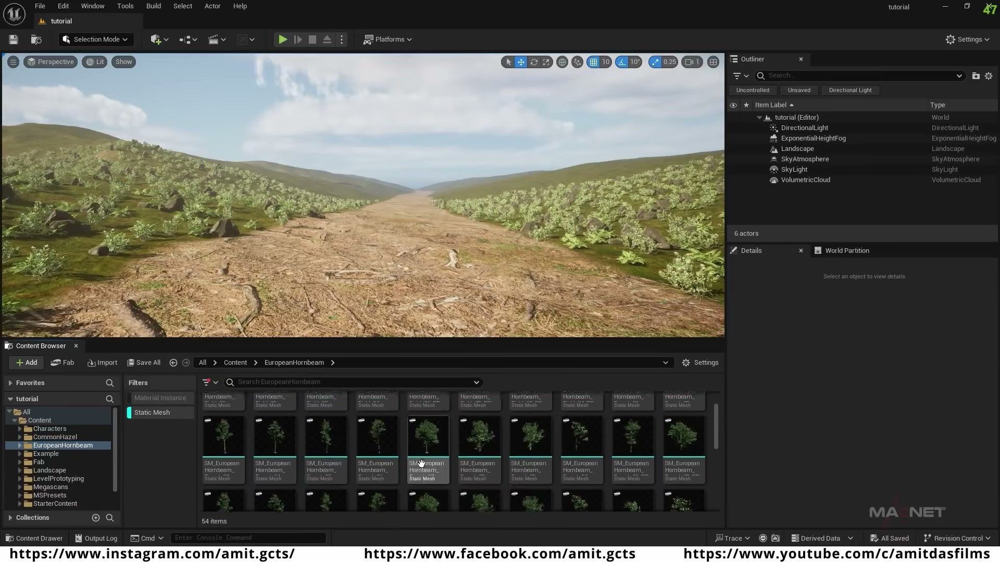

### 00:21:28-00:24:40 属性、过滤与数据分流

- 本段定位：属性、过滤与数据分流。
- 知识点：Landscape/Surface 输入负责提供地表采样点，复现时要核对采样范围、Layer/材质过滤、坡度或高度条件。
- 知识点：植被生成要按点密度、随机 Transform、网格清单和剔除规则逐项核对，避免道路、岩石或地形边缘出现穿插。
- 知识点：PCG 点默认包含 Position、Rotation、Scale、Bounds、Density、Seed 等属性，自定义属性不带 `$` 前缀，Inspect 时要分清来源。
- 知识点：自定义房间墙节点记录 X/Y 边界点，随机选取非边界点作为墙段起点，并用随机整数加数组索引改善 PCG 随机性。
- 复现要点：先用 Debug/Inspect 核对点数量、Bounds、Density 和关键属性，再判断最终生成结果。
- 复现要点：属性命名要稳定，过滤、分区和分支节点应保留可检查的中间数据，避免后续规则难以追踪。
- 复现要点：Static Mesh Spawner 用于高效实例化；Spawn Actor/Blueprint 用于需要逻辑的对象，成本和生命周期不同。
- 核对对象：`Density`、`Surface Sampler`、`Static Mesh`、`Filter`、`点`、`属性`、`密度`、`过滤`、`生成`、`网格`。

**关键画面：**

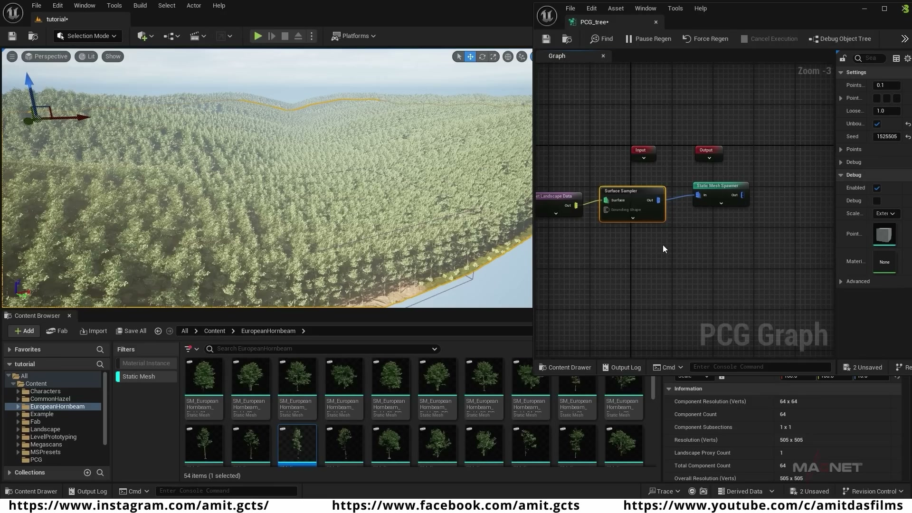

### 00:24:45-00:29:36 属性、过滤与数据分流

- 本段定位：属性、过滤与数据分流。
- 知识点：Landscape/Surface 输入负责提供地表采样点，复现时要核对采样范围、Layer/材质过滤、坡度或高度条件。
- 知识点：植被生成要按点密度、随机 Transform、网格清单和剔除规则逐项核对，避免道路、岩石或地形边缘出现穿插。
- 知识点：PCG 点默认包含 Position、Rotation、Scale、Bounds、Density、Seed 等属性，自定义属性不带 `$` 前缀，Inspect 时要分清来源。
- 知识点：自定义房间墙节点记录 X/Y 边界点，随机选取非边界点作为墙段起点，并用随机整数加数组索引改善 PCG 随机性。
- 知识点：Static Mesh Spawner 将点数据实例化为静态网格，复现时要检查 Mesh、Transform、Density 和材质覆盖。
- 复现要点：先用 Debug/Inspect 核对点数量、Bounds、Density 和关键属性，再判断最终生成结果。
- 复现要点：属性命名要稳定，过滤、分区和分支节点应保留可检查的中间数据，避免后续规则难以追踪。
- 复现要点：Static Mesh Spawner 用于高效实例化；Spawn Actor/Blueprint 用于需要逻辑的对象，成本和生命周期不同。
- 核对对象：`PCG`、`Point`、`Surface Sampler`、`Static Mesh`、`Transform Points`、`Material`、`点`、`属性`、`密度`、`过滤`。

**关键画面：**

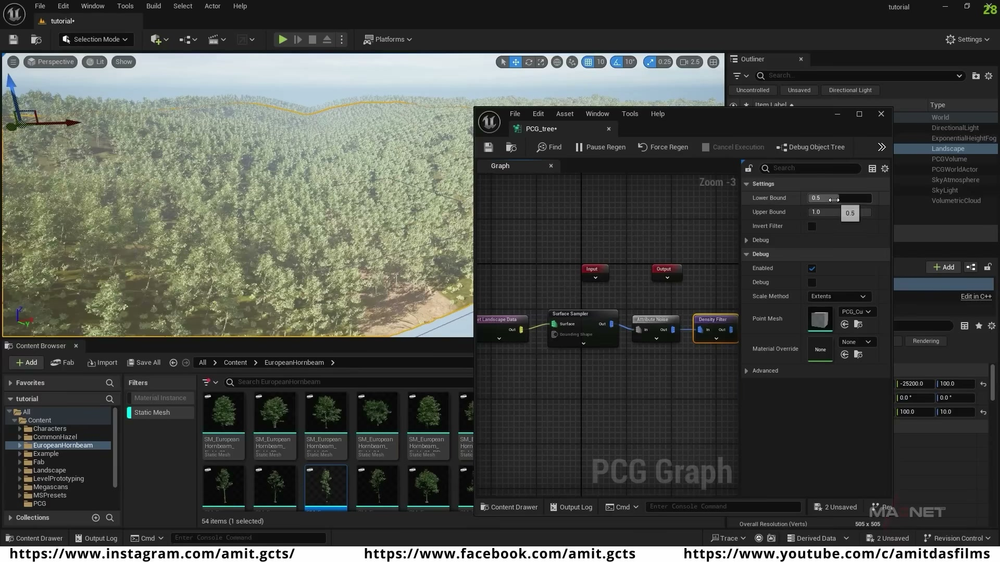
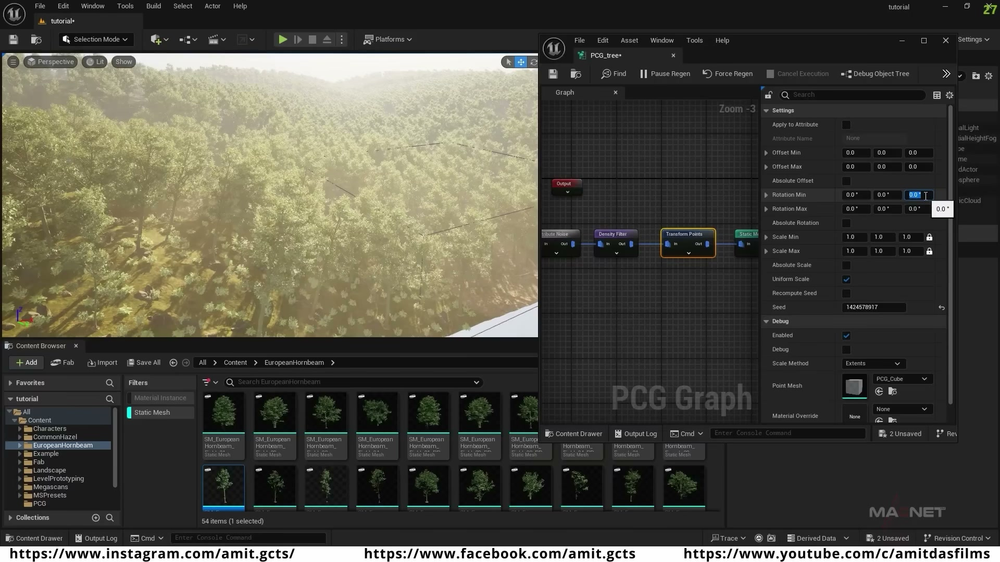

### 00:29:36-00:32:17 Spline 采样与路径生成

- 本段定位：Spline 采样与路径生成。
- 知识点：Landscape/Surface 输入负责提供地表采样点，复现时要核对采样范围、Layer/材质过滤、坡度或高度条件。
- 知识点：Niagara 或组件输出应挂在筛选后的 PCG 点上，先核对点位置、随机偏移和实例数量，再接入 Niagara Component。
- 知识点：植被生成要按点密度、随机 Transform、网格清单和剔除规则逐项核对，避免道路、岩石或地形边缘出现穿插。
- 复现要点：先用 Debug/Inspect 核对点数量、Bounds、Density 和关键属性，再判断最终生成结果。
- 复现要点：Spline 流程要单独核对采样间距、切线、端点、交叉点和生成网格的对齐方式。
- 核对对象：`PCG`、`Spline`、`Actor`、`组件`、`点`、`样条`、`采样`、`生成`、`蓝图`。

**关键画面：**

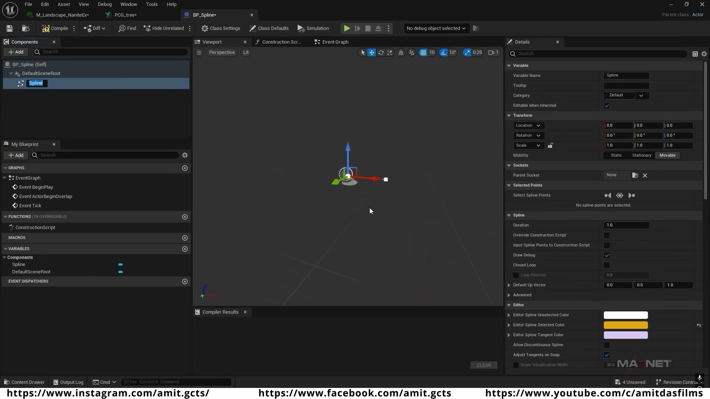

### 00:32:22-00:36:58 Spline 采样与路径生成

- 本段定位：Spline 采样与路径生成。
- 知识点：Landscape/Surface 输入负责提供地表采样点，复现时要核对采样范围、Layer/材质过滤、坡度或高度条件。
- 知识点：植被生成要按点密度、随机 Transform、网格清单和剔除规则逐项核对，避免道路、岩石或地形边缘出现穿插。
- 知识点：道路或街区边界由样条/Spline Mesh 驱动，复现时要核对样条点、切线、宽度和交叉口连接。
- 知识点：Spline 输入通常先采样为点，再用属性、距离或索引区分路段、端点、交叉点和曲线段。
- 知识点：Spawn Actor 适合生成带蓝图逻辑的对象。
- 知识点：Static Mesh Spawner 将点数据实例化为静态网格，复现时要检查 Mesh、Transform、Density 和材质覆盖。
- 复现要点：先用 Debug/Inspect 核对点数量、Bounds、Density 和关键属性，再判断最终生成结果。
- 复现要点：属性命名要稳定，过滤、分区和分支节点应保留可检查的中间数据，避免后续规则难以追踪。
- 复现要点：Static Mesh Spawner 用于高效实例化；Spawn Actor/Blueprint 用于需要逻辑的对象，成本和生命周期不同。
- 复现要点：Spline 流程要单独核对采样间距、切线、端点、交叉点和生成网格的对齐方式。
- 核对对象：`PCG`、`Density`、`Spline`、`Spline Sampler`、`Surface Sampler`、`Actor`、`Blueprint`、`点`、`属性`、`样条`。

**关键画面：**

### 00:37:04-00:41:39 Spline 采样与路径生成

- 本段定位：Spline 采样与路径生成。
- 知识点：Landscape/Surface 输入负责提供地表采样点，复现时要核对采样范围、Layer/材质过滤、坡度或高度条件。
- 知识点：Niagara 或组件输出应挂在筛选后的 PCG 点上，先核对点位置、随机偏移和实例数量，再接入 Niagara Component。
- 知识点：植被生成要按点密度、随机 Transform、网格清单和剔除规则逐项核对，避免道路、岩石或地形边缘出现穿插。
- 复现要点：先用 Debug/Inspect 核对点数量、Bounds、Density 和关键属性，再判断最终生成结果。
- 复现要点：属性命名要稳定，过滤、分区和分支节点应保留可检查的中间数据，避免后续规则难以追踪。
- 复现要点：Spline 流程要单独核对采样间距、切线、端点、交叉点和生成网格的对齐方式。
- 核对对象：`PCG`、`Spline`、`Actor`、`Material`、`组件`、`点`、`样条`、`采样`、`过滤`、`生成`。

**关键画面：**

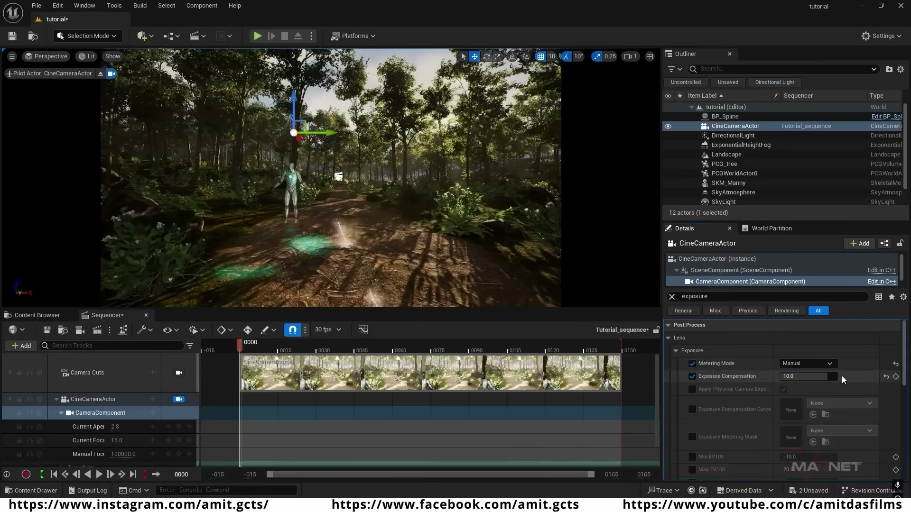

### 00:41:39-00:45:11 属性、过滤与数据分流

- 本段定位：属性、过滤与数据分流。
- 知识点：Landscape/Surface 输入负责提供地表采样点，复现时要核对采样范围、Layer/材质过滤、坡度或高度条件。
- 知识点：植被生成要按点密度、随机 Transform、网格清单和剔除规则逐项核对，避免道路、岩石或地形边缘出现穿插。
- 知识点：道路或街区边界由样条/Spline Mesh 驱动，复现时要核对样条点、切线、宽度和交叉口连接。
- 复现要点：先用 Debug/Inspect 核对点数量、Bounds、Density 和关键属性，再判断最终生成结果。
- 复现要点：属性命名要稳定，过滤、分区和分支节点应保留可检查的中间数据，避免后续规则难以追踪。
- 复现要点：Static Mesh Spawner 用于高效实例化；Spawn Actor/Blueprint 用于需要逻辑的对象，成本和生命周期不同。
- 核对对象：`Density`、`Static Mesh`、`Filter`、`Material`、`点`、`属性`、`密度`、`过滤`、`网格`。

**关键画面：**

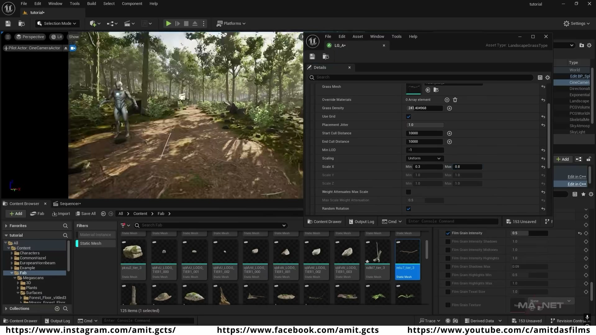

### 00:45:21-00:50:21 Spline 采样与路径生成

- 本段定位：Spline 采样与路径生成。
- 知识点：Landscape/Surface 输入负责提供地表采样点，复现时要核对采样范围、Layer/材质过滤、坡度或高度条件。
- 知识点：Gaea 输出高度图和遮罩贴图后，需要在 UE 中正确导入并绑定到 Landscape/材质层，PCG 再按图层信息控制地貌与植被。
- 知识点：Niagara 或组件输出应挂在筛选后的 PCG 点上，先核对点位置、随机偏移和实例数量，再接入 Niagara Component。
- 知识点：Spawn Actor 适合生成带蓝图逻辑的对象。
- 知识点：Static Mesh Spawner 将点数据实例化为静态网格，复现时要检查 Mesh、Transform、Density 和材质覆盖。
- 复现要点：先用 Debug/Inspect 核对点数量、Bounds、Density 和关键属性，再判断最终生成结果。
- 复现要点：属性命名要稳定，过滤、分区和分支节点应保留可检查的中间数据，避免后续规则难以追踪。
- 复现要点：Static Mesh Spawner 用于高效实例化；Spawn Actor/Blueprint 用于需要逻辑的对象，成本和生命周期不同。
- 复现要点：Spline 流程要单独核对采样间距、切线、端点、交叉点和生成网格的对齐方式。
- 核对对象：`PCG`、`Point`、`Spline`、`Spline Sampler`、`Actor`、`Static Mesh`、`Spawn Actor`、`Filter`、`Material`、`图表`。

**关键画面：**

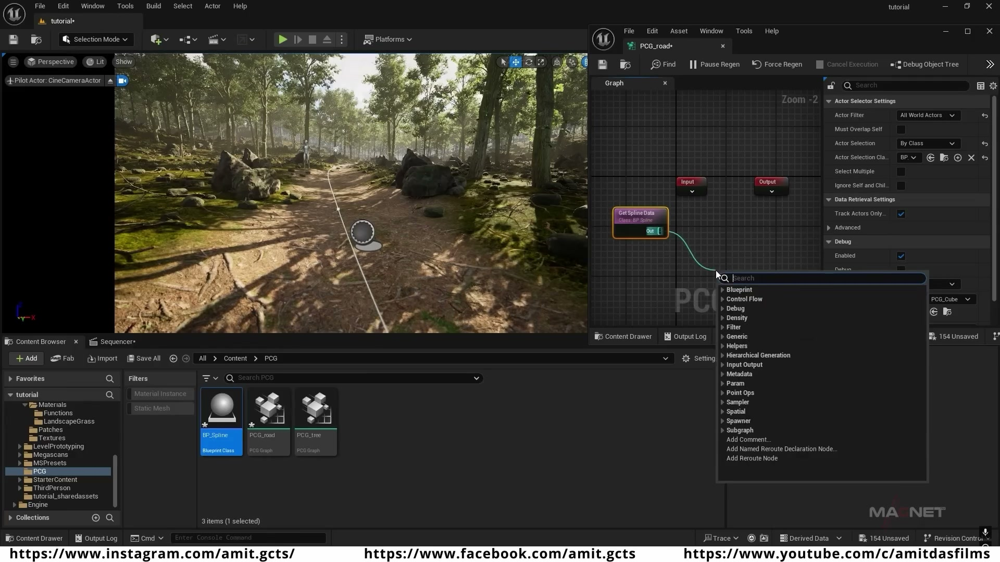

### 00:50:21-00:55:12 Spline 采样与路径生成

- 本段定位：Spline 采样与路径生成。
- 知识点：Landscape/Surface 输入负责提供地表采样点，复现时要核对采样范围、Layer/材质过滤、坡度或高度条件。
- 知识点：Gaea 输出高度图和遮罩贴图后，需要在 UE 中正确导入并绑定到 Landscape/材质层，PCG 再按图层信息控制地貌与植被。
- 知识点：植被生成要按点密度、随机 Transform、网格清单和剔除规则逐项核对，避免道路、岩石或地形边缘出现穿插。
- 知识点：Spawn Actor 适合生成带蓝图逻辑的对象。
- 知识点：Static Mesh Spawner 将点数据实例化为静态网格，复现时要检查 Mesh、Transform、Density 和材质覆盖。
- 复现要点：先用 Debug/Inspect 核对点数量、Bounds、Density 和关键属性，再判断最终生成结果。
- 复现要点：Static Mesh Spawner 用于高效实例化；Spawn Actor/Blueprint 用于需要逻辑的对象，成本和生命周期不同。
- 复现要点：Spline 流程要单独核对采样间距、切线、端点、交叉点和生成网格的对齐方式。
- 核对对象：`PCG`、`Point`、`Spline`、`Spline Sampler`、`Actor`、`Spawn Actor`、`Transform Points`、`Material`、`点`、`密度`。

**关键画面：**

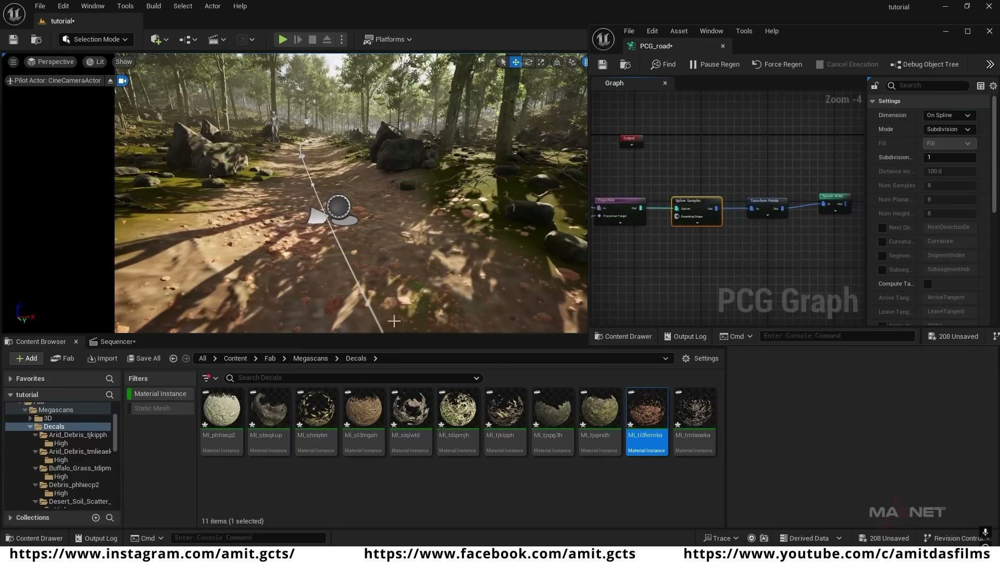
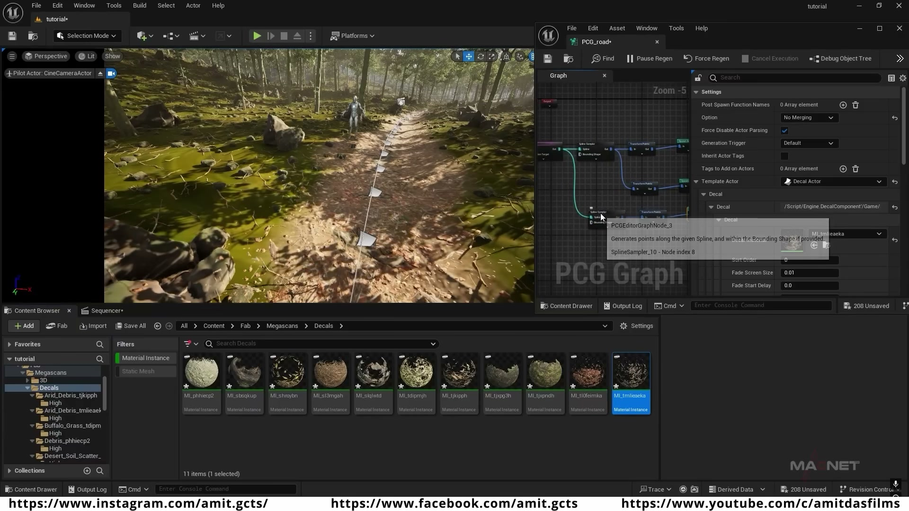

### 00:55:12-01:00:10 生成器输出与蓝图交互

- 本段定位：生成器输出与蓝图交互。
- 知识点：Landscape/Surface 输入负责提供地表采样点，复现时要核对采样范围、Layer/材质过滤、坡度或高度条件。
- 知识点：植被生成要按点密度、随机 Transform、网格清单和剔除规则逐项核对，避免道路、岩石或地形边缘出现穿插。
- 知识点：采样器决定点来源和分布规则；Volume、Surface、Spline 等输入要分别核对采样范围、密度和生成方向。
- 知识点：Static Mesh Spawner 将点数据实例化为静态网格，复现时要检查 Mesh、Transform、Density 和材质覆盖。
- 复现要点：先用 Debug/Inspect 核对点数量、Bounds、Density 和关键属性，再判断最终生成结果。
- 复现要点：属性命名要稳定，过滤、分区和分支节点应保留可检查的中间数据，避免后续规则难以追踪。
- 复现要点：Static Mesh Spawner 用于高效实例化；Spawn Actor/Blueprint 用于需要逻辑的对象，成本和生命周期不同。
- 核对对象：`PCG`、`Surface Sampler`、`Static Mesh`、`Static Mesh Spawner`、`Filter`、`点`、`密度`、`采样`、`过滤`、`生成`。

**关键画面：**

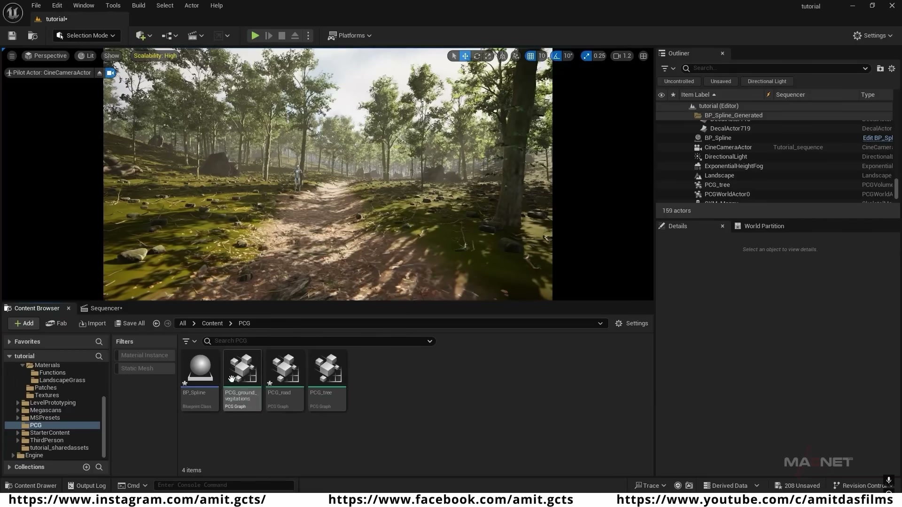
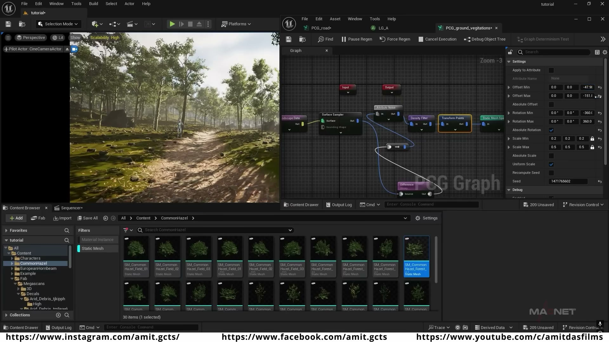

### 01:00:10-01:03:28 属性、过滤与数据分流

- 本段定位：属性、过滤与数据分流。
- 知识点：Landscape/Surface 输入负责提供地表采样点，复现时要核对采样范围、Layer/材质过滤、坡度或高度条件。
- 知识点：Gaea 输出高度图和遮罩贴图后，需要在 UE 中正确导入并绑定到 Landscape/材质层，PCG 再按图层信息控制地貌与植被。
- 知识点：植被生成要按点密度、随机 Transform、网格清单和剔除规则逐项核对，避免道路、岩石或地形边缘出现穿插。
- 复现要点：先用 Debug/Inspect 核对点数量、Bounds、Density 和关键属性，再判断最终生成结果。
- 复现要点：属性命名要稳定，过滤、分区和分支节点应保留可检查的中间数据，避免后续规则难以追踪。
- 复现要点：Static Mesh Spawner 用于高效实例化；Spawn Actor/Blueprint 用于需要逻辑的对象，成本和生命周期不同。
- 核对对象：`PCG`、`Point`、`Static Mesh`、`Filter`、`点`、`属性`、`密度`、`采样`、`过滤`、`网格`。

**关键画面：**

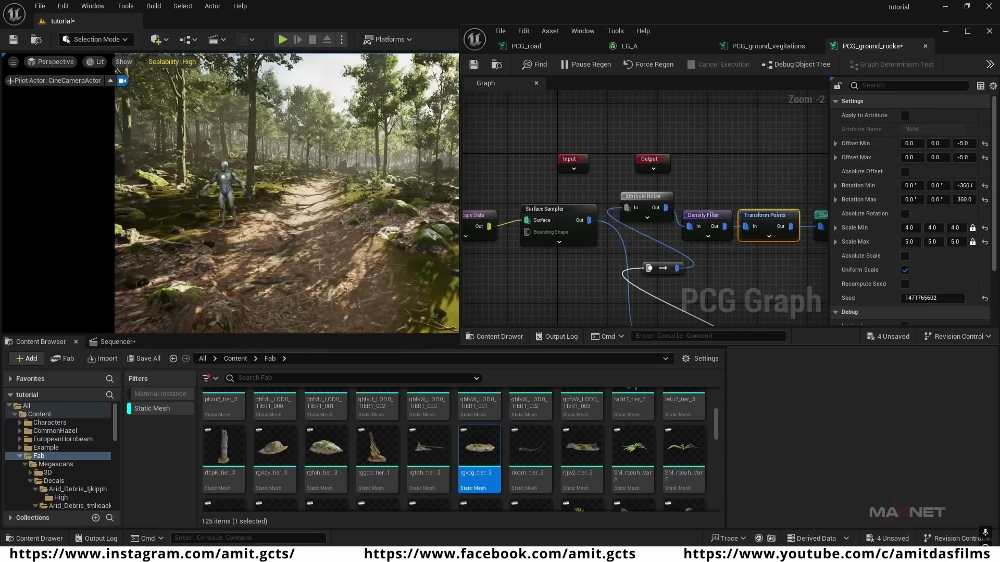

### 01:03:31-01:08:24 生成器输出与蓝图交互

- 本段定位：生成器输出与蓝图交互。
- 知识点：Landscape/Surface 输入负责提供地表采样点，复现时要核对采样范围、Layer/材质过滤、坡度或高度条件。
- 知识点：植被生成要按点密度、随机 Transform、网格清单和剔除规则逐项核对，避免道路、岩石或地形边缘出现穿插。
- 知识点：道路或街区边界由样条/Spline Mesh 驱动，复现时要核对样条点、切线、宽度和交叉口连接。
- 知识点：Static Mesh Spawner 将点数据实例化为静态网格，复现时要检查 Mesh、Transform、Density 和材质覆盖。
- 知识点：Static Mesh Spawner 可覆盖生成实例的材质，用于快速验证网格实例的分类和可见性。
- 知识点：Transform Points 可调整点的位置、旋转和缩放；使用非统一缩放时要分别检查各轴最小值和最大值。
- 复现要点：先用 Debug/Inspect 核对点数量、Bounds、Density 和关键属性，再判断最终生成结果。
- 复现要点：属性命名要稳定，过滤、分区和分支节点应保留可检查的中间数据，避免后续规则难以追踪。
- 复现要点：Static Mesh Spawner 用于高效实例化；Spawn Actor/Blueprint 用于需要逻辑的对象，成本和生命周期不同。
- 核对对象：`PCG`、`Surface Sampler`、`Static Mesh`、`Static Mesh Spawner`、`Filter`、`点`、`密度`、`采样`、`过滤`、`生成`。

**关键画面：**

### 01:08:24-01:11:47 生成器输出与蓝图交互

- 本段定位：生成器输出与蓝图交互。
- 知识点：Landscape/Surface 输入负责提供地表采样点，复现时要核对采样范围、Layer/材质过滤、坡度或高度条件。
- 知识点：植被生成要按点密度、随机 Transform、网格清单和剔除规则逐项核对，避免道路、岩石或地形边缘出现穿插。
- 知识点：PCG 点默认包含 Position、Rotation、Scale、Bounds、Density、Seed 等属性，自定义属性不带 `$` 前缀，Inspect 时要分清来源。
- 复现要点：先用 Debug/Inspect 核对点数量、Bounds、Density 和关键属性，再判断最终生成结果。
- 复现要点：属性命名要稳定，过滤、分区和分支节点应保留可检查的中间数据，避免后续规则难以追踪。
- 复现要点：Static Mesh Spawner 用于高效实例化；Spawn Actor/Blueprint 用于需要逻辑的对象，成本和生命周期不同。
- 核对对象：`PCG`、`Point`、`Static Mesh`、`Static Mesh Spawner`、`Transform Points`、`点`、`属性`、`密度`、`过滤`、`生成`。

**关键画面：**

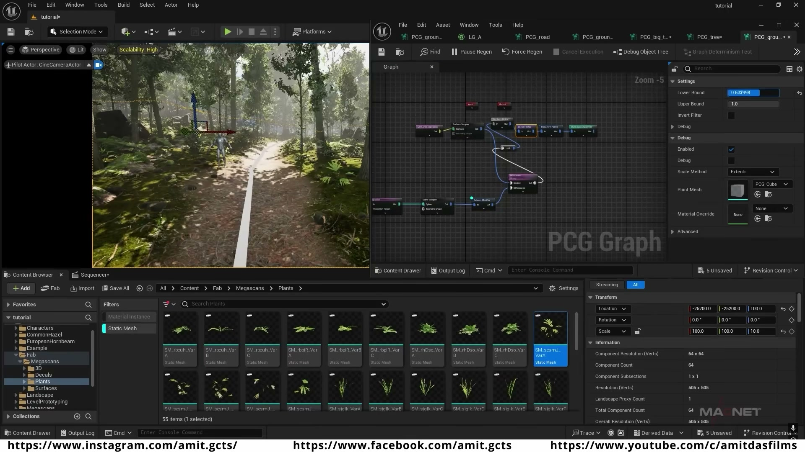
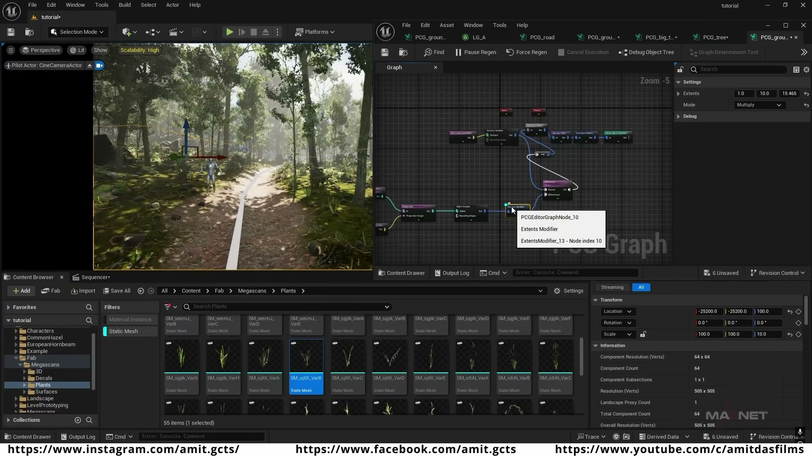

### 01:12:04-01:14:47 Spline 采样与路径生成

- 本段定位：Spline 采样与路径生成。
- 知识点：植被生成要按点密度、随机 Transform、网格清单和剔除规则逐项核对，避免道路、岩石或地形边缘出现穿插。
- 复现要点：先用 Debug/Inspect 核对点数量、Bounds、Density 和关键属性，再判断最终生成结果。
- 核对对象：`PCG`、`密度`、`生成`。

**关键画面：**

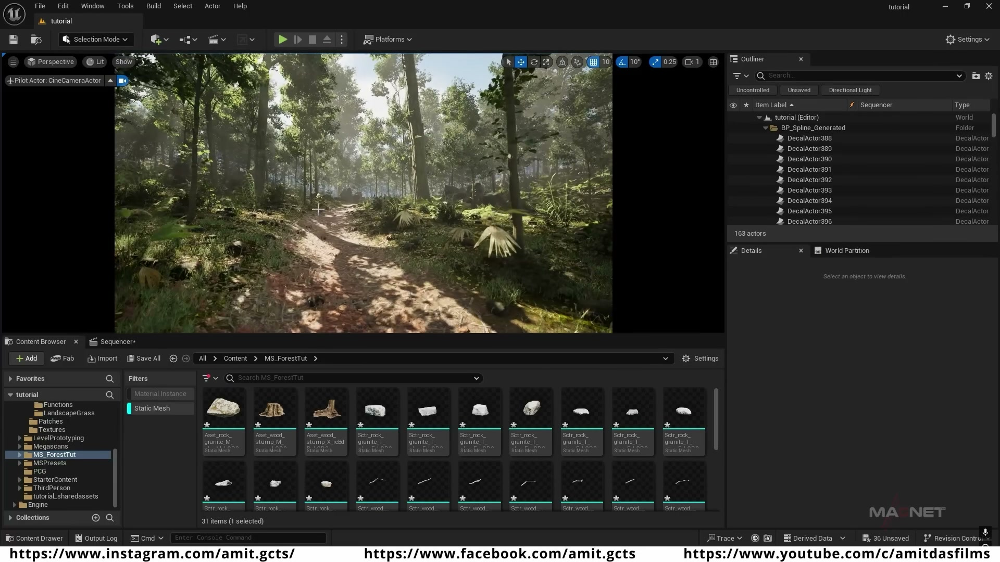
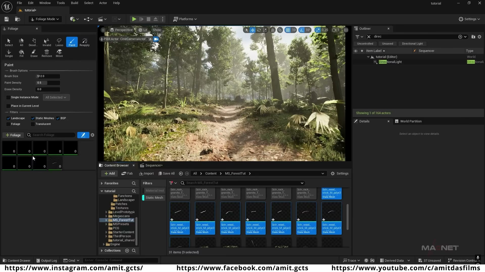

### 01:14:57-01:17:47 属性、过滤与数据分流

- 本段定位：属性、过滤与数据分流。
- 知识点：Static Mesh Spawner 将点数据实例化为静态网格，复现时要检查 Mesh 清单、Transform、Density、Seed 和材质覆盖。
- 复现要点：先用 Debug/Inspect 核对点数量、Bounds、Density 和关键属性，再判断最终生成结果。
- 复现要点：属性命名要稳定，过滤、分区和分支节点应保留可检查的中间数据，避免后续规则难以追踪。
- 复现要点：Static Mesh Spawner 用于高效实例化；Spawn Actor/Blueprint 用于需要逻辑的对象，成本和生命周期不同。
- 核对对象：`Static Mesh`、`Filter`、`点`、`属性`、`过滤`、`网格`。

**关键画面：**

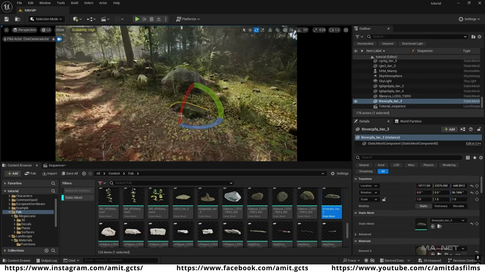

### 01:17:50-01:22:31 属性、过滤与数据分流

- 本段定位：属性、过滤与数据分流。
- 知识点：Niagara 或组件输出应挂在筛选后的 PCG 点上，先核对点位置、随机偏移和实例数量，再接入 Niagara Component。
- 知识点：植被生成要按点密度、随机 Transform、网格清单和剔除规则逐项核对，避免道路、岩石或地形边缘出现穿插。
- 复现要点：先用 Debug/Inspect 核对点数量、Bounds、Density 和关键属性，再判断最终生成结果。
- 复现要点：属性命名要稳定，过滤、分区和分支节点应保留可检查的中间数据，避免后续规则难以追踪。
- 复现要点：Static Mesh Spawner 用于高效实例化；Spawn Actor/Blueprint 用于需要逻辑的对象，成本和生命周期不同。
- 核对对象：`Actor`、`Static Mesh`、`Filter`、`组件`、`点`、`属性`、`过滤`、`蓝图`、`网格`。

**关键画面：**

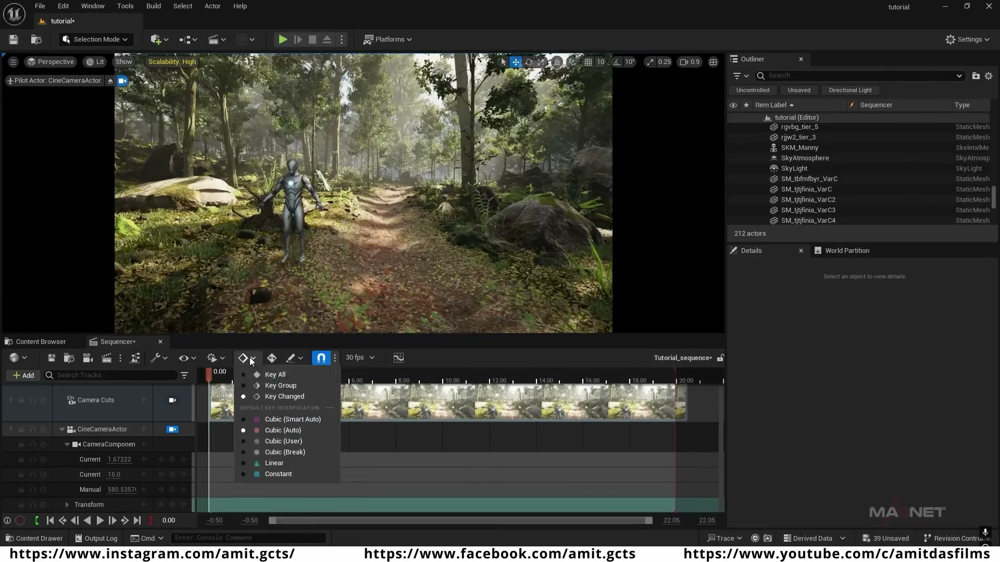

### 01:22:31-01:24:51 点数据、Bounds 与采样来源

- 本段定位：点数据、Bounds 与采样来源。
- 知识点：Landscape/Surface 输入负责提供地表采样点，复现时要核对采样范围、Layer/材质过滤、坡度或高度条件。
- 复现要点：先用 Debug/Inspect 核对点数量、Bounds、Density 和关键属性，再判断最终生成结果。
- 核对对象：`PCG`、`Bounds`、`点`、`点数据`、`采样`、`材质`。

**关键画面：**

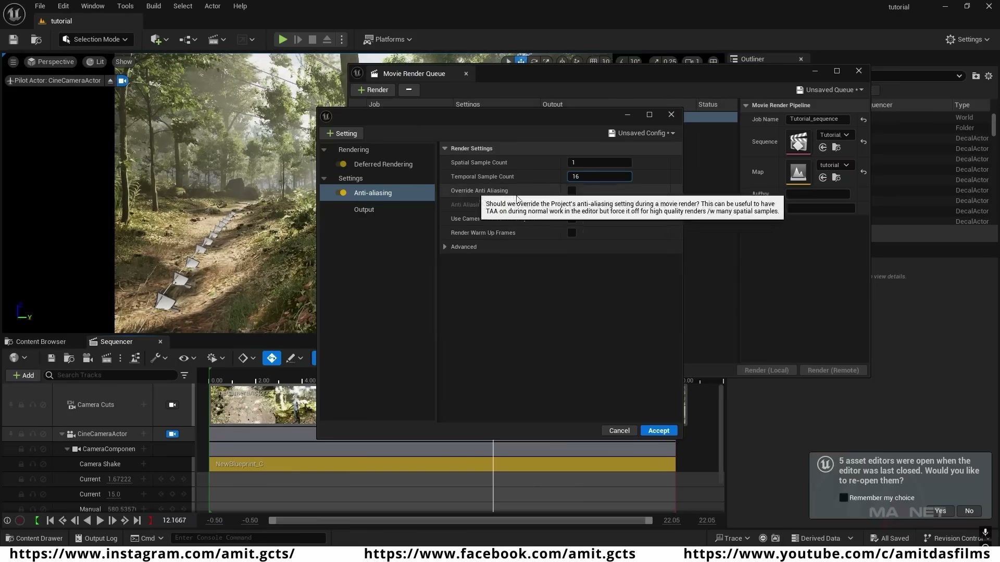
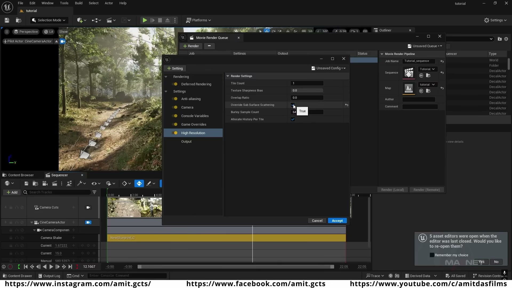

## 复现检查

- 每个图表先检查输入数据是否正确进入 PCG Graph，再看下游生成结果。
- Debug/Inspect 时重点看点数量、Bounds、Density、Transform、Seed 和自定义 Attribute。
- Static Mesh Spawner、Spawn Actor、Spline Mesh 和 Blueprint 输出节点不能混用语义；选择前先确定是否需要实例化性能或蓝图逻辑。
- 涉及样条、分区、运行时或 GPU 生成时，必须额外验证更新触发、缓存、世界分区和性能预算。
