# 虚幻引擎 5.4 ！真实 PCG 建筑 - 教程第 1 部分

## 知识目标

- 围绕“虚幻引擎 5.4 ！真实 PCG 建筑 - 教程第 1 部分”整理真实 PCG 建筑生成第 1 部分：搭建 BP Building 与 PCG Graph/Subgraph，定义建筑尺寸参数，把墙、柱、角件和楼层单元按网格尺寸和偏移规则生成出来。

## 可复现主流程

- 先建立目标建筑蓝图：用 Actor Blueprint 承载 PCG Component，并明确该蓝图要生成不同尺寸、不同特征的建筑。
- 创建建筑尺寸变量：Width、Length、Height、Wall Length、Ceiling Height 等参数要先暴露，后续网格尺寸和生成规则都从这些变量读取。
- 准备建筑模块资产：选择墙、柱、角件、基础楼层等 Static Mesh，并记录它们的真实尺寸和需要的半尺寸偏移。
- 用 Bounds Modifier 和 Difference 调整每类点的空间占用范围，避免墙、柱、角件之间互相重叠。
- 把单层生成逻辑封装为 Subgraph，并在 Graph Settings 中建立输入参数和默认值。
- 用参数驱动 Grid Extents 和点生成范围，让每栋建筑不再是固定尺寸。
- 调试 Subgraph 输入输出，确认外部传入的宽、长、高和模块尺寸能正确影响点集。
- 用 Axis Tripod/Debug 显示点方向，检查点是否位于建筑四条边和四个角的正确位置。
- 计算每段墙体的中心偏移：根据 Cell Size、Wall Length 和 Pillar Length 得到 X/Y 方向上的半尺寸位移。
- 为墙体点接 Static Mesh Spawner，按墙体方向分别生成四边墙面。
- 为柱子点接 Static Mesh Spawner，按柱子长度和墙体偏移把柱子放到墙之间。
- 为角件点计算额外偏移，解决角件不直接落在角上的问题。
- 传递 Ceiling Height、Floor Height 等属性，让单层高度和楼层厚度可以被上层图表复用。
- 把 Subgraph 参数接入主图，确认默认建筑尺寸可以生成稳定的单层框架。
- 添加 Decal 或细节装饰，让建筑不只是简单方盒。
- 验证蓝图可替换不同资产集，后续能生成不同风格、不同尺寸的建筑。

## 关键术语

- `PCG`
- `Blueprint`
- `Static Mesh`
- `Mesh`
- `Point Filter`
- `SubGraph`
- `Transform`
- `Point`
- `Attribute`
- `Actor`
- `Component`
- `Spawn`
- `Grid`
- `Bounds`
- `Density`
- `Random`
- `Seed`
- `Graph`

## 操作步骤与要点

### 先建立目标建筑蓝图：用 Actor Blueprint 承载 PCG Component，并明确该蓝图要生成不同尺寸、不同特征的建筑

**内容要点：**

- 本段展示目标效果和项目准备：教程要用 UE 5.4 的 PCG Graph 生成不同尺寸、不同特征的真实建筑，并先创建 BP Building 作为承载 PCG 组件的 Actor 蓝图。

**关键截图：**

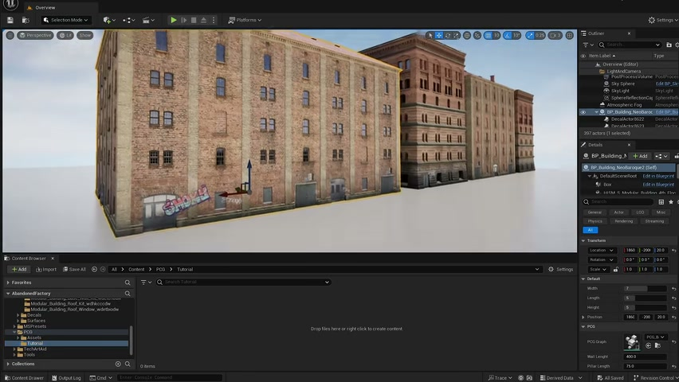
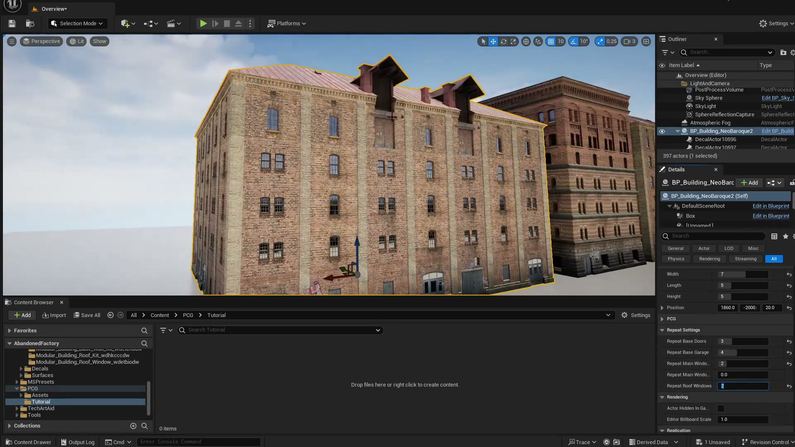

**参数、节点和风险点：**

- `PCG`
- `Blueprint`
- `Mesh`
- `Actor`
- `Component`
- `Random`
- `Graph`
- `building`
- `type`

### 创建建筑尺寸变量：Width、Length、Height、Wall Length、Ceiling Height 等参数要先暴露，后续网格尺寸和生成规则都从这些变量读取

**内容要点：**

- 本段进入蓝图变量准备：保存建筑蓝图后，先建立 Width、Length、Height 等整数变量，为后续控制建筑整体尺寸、楼层和墙体生成提供统一参数。

**关键截图：**

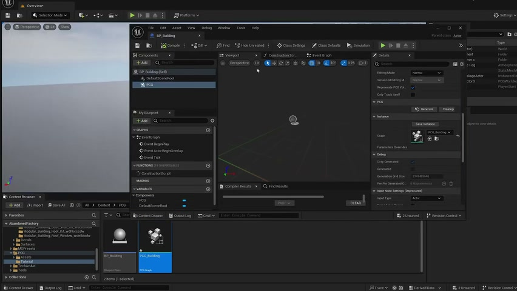
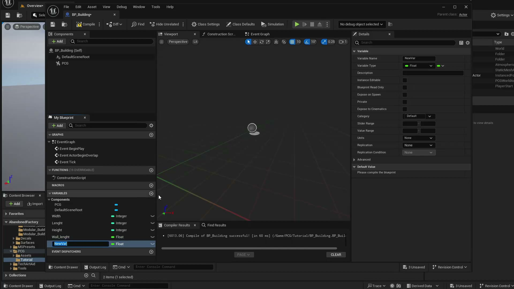

**参数、节点和风险点：**

- `PCG`
- `Blueprint`
- `Component`
- `Graph`
- `building`
- `variables`
- `blueprint`
- `graph`
- `length`

### 准备建筑模块资产：选择墙、柱、角件、基础楼层等 Static Mesh，并记录它们的真实尺寸和需要的半尺寸偏移

**内容要点：**

- 本段选择建筑模块资产：准备墙、柱、角件和基础楼层模型，并开始分析这些 Mesh 的尺寸，确定它们在 PCG 点上的摆放位置和偏移距离。

**关键截图：**

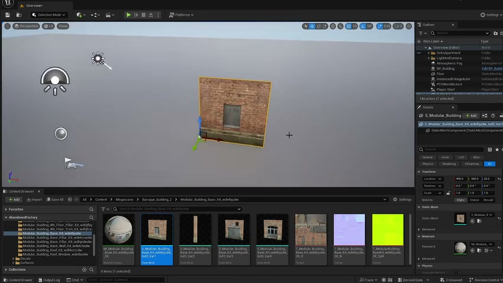
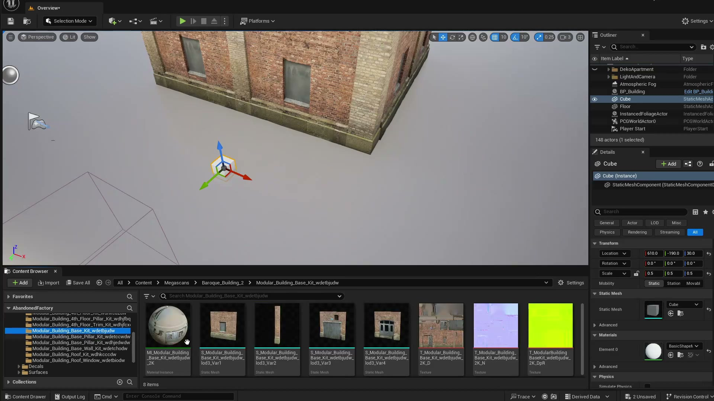

**参数、节点和风险点：**

- `PCG`
- `Mesh`
- `Point`
- `Spawn`
- `Graph`
- `wall`
- `building`
- `pillar`
- `corner`
- `point`

### 用 Bounds Modifier 和 Difference 调整每类点的空间占用范围，避免墙、柱、角件之间互相重叠

**内容要点：**

- 本段处理基础点和 Bounds：用 Bounds Modifier 缩放点范围，并通过 Difference 等节点避免墙、柱和角件点互相覆盖。

**关键截图：**

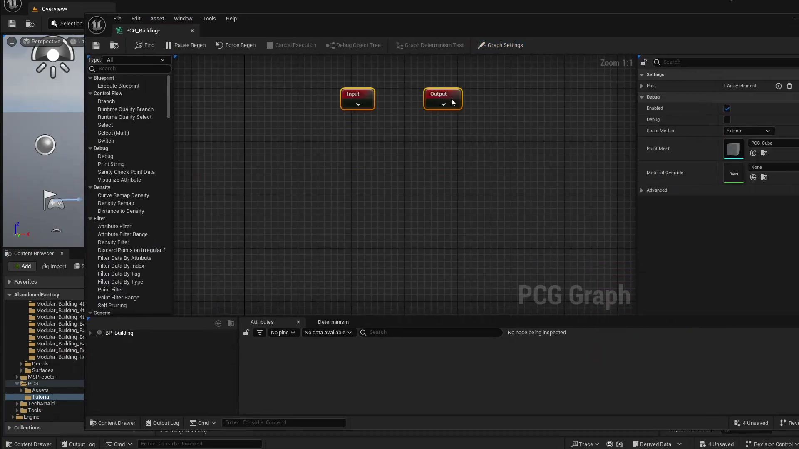
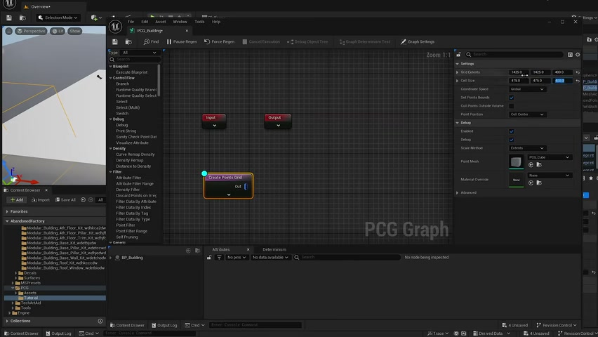

**参数、节点和风险点：**

- `PCG`
- `Transform`
- `Point`
- `Spawn`
- `Grid`
- `Graph`
- `grid`
- `points`
- `size`
- `them`

### 把单层生成逻辑封装为 Subgraph，并在 Graph Settings 中建立输入参数和默认值

**内容要点：**

- 本段开始把单层逻辑抽成 Subgraph：将生成一个楼层的流程封装起来，并准备让外部建筑蓝图传入宽、长、高等参数。

**关键截图：**

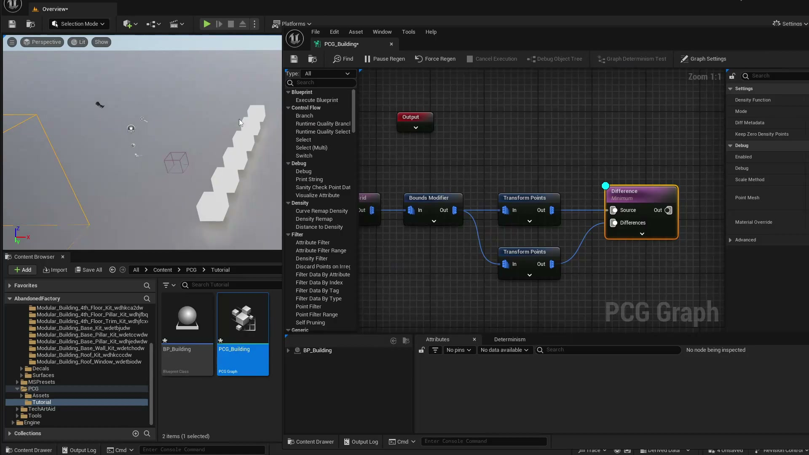
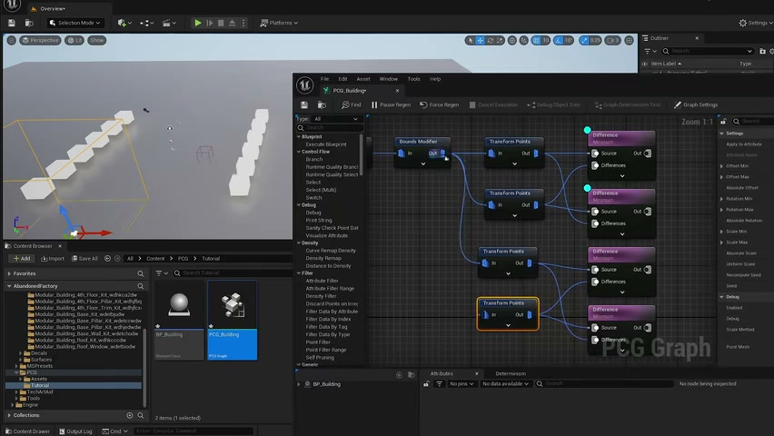

**参数、节点和风险点：**

- `PCG`
- `Blueprint`
- `SubGraph`
- `Transform`
- `Point`
- `Spawn`
- `Graph`
- `difference`
- `other`
- `subgraph`

### 用参数驱动 Grid Extents 和点生成范围，让每栋建筑不再是固定尺寸

**内容要点：**

- 本段在 Subgraph 里建立默认参数：设置建筑宽度、长度、墙长、柱长、楼层高度等默认值，先保证单层生成可以在默认尺寸下工作。

**关键截图：**

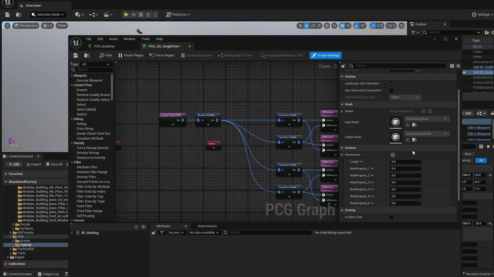
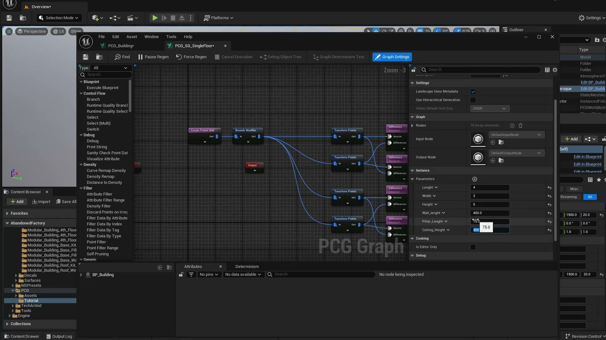

**参数、节点和风险点：**

- `Mesh`
- `Point`
- `Actor`
- `Grid`
- `Graph`
- `length`
- `wall`
- `cell`
- `size`
- `building`

### 调试 Subgraph 输入输出，确认外部传入的宽、长、高和模块尺寸能正确影响点集

**内容要点：**

- 本段让网格范围受参数控制：把 Grid Extents、Cell Size 等节点接到参数上，使建筑尺寸变化时点集范围也随之变化。

**关键截图：**

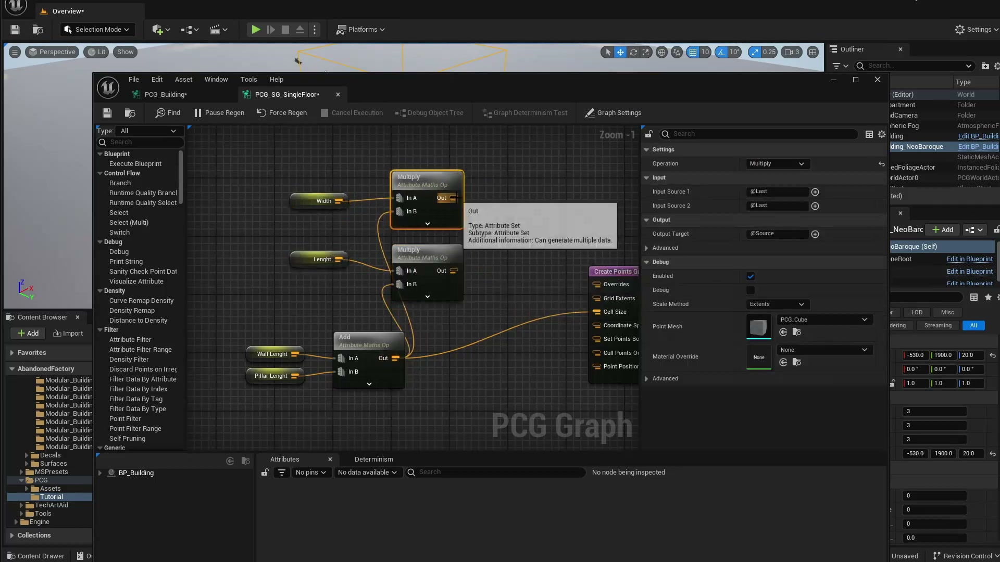
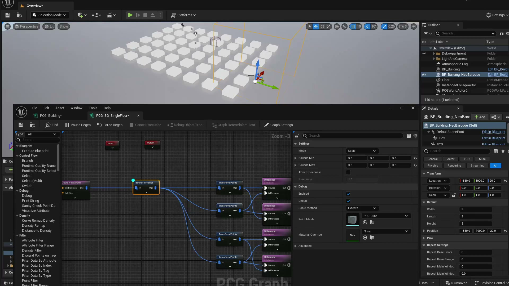

**参数、节点和风险点：**

- `Blueprint`
- `Transform`
- `Point`
- `Attribute`
- `Grid`
- `size`
- `vector`
- `cell`
- `value`
- `length`

### 用 Axis Tripod/Debug 显示点方向，检查点是否位于建筑四条边和四个角的正确位置

**内容要点：**

- 本段调试 Subgraph 的输入输出：通过调试节点和图表选择，确认外部传入的参数确实进入了单层生成逻辑。

**关键截图：**

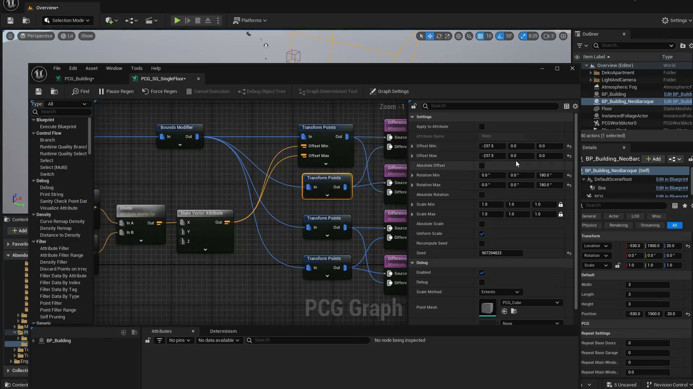
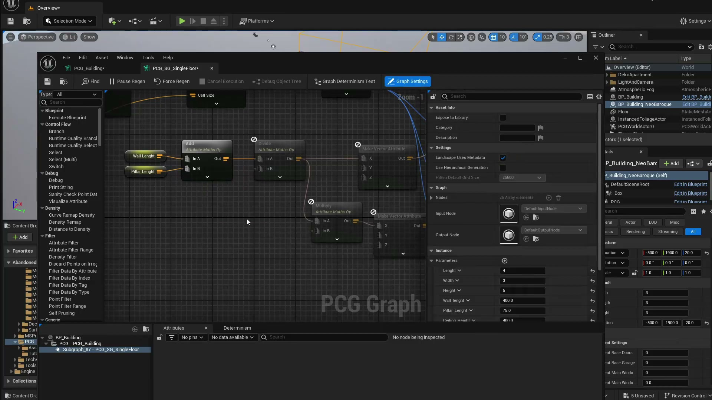

**参数、节点和风险点：**

- `Transform`
- `Point`
- `Attribute`
- `Graph`
- `minus`
- `select`
- `vector`
- `value`
- `node`
- `divide`

### 计算每段墙体的中心偏移：根据 Cell Size、Wall Length 和 Pillar Length 得到 X/Y 方向上的半尺寸位移

**内容要点：**

- 本段检查点方向和可视化：切换 Debug 显示方式，用 Axis Tripod 观察点的朝向，确认墙体、柱子和角件会朝正确方向生成。

**关键截图：**

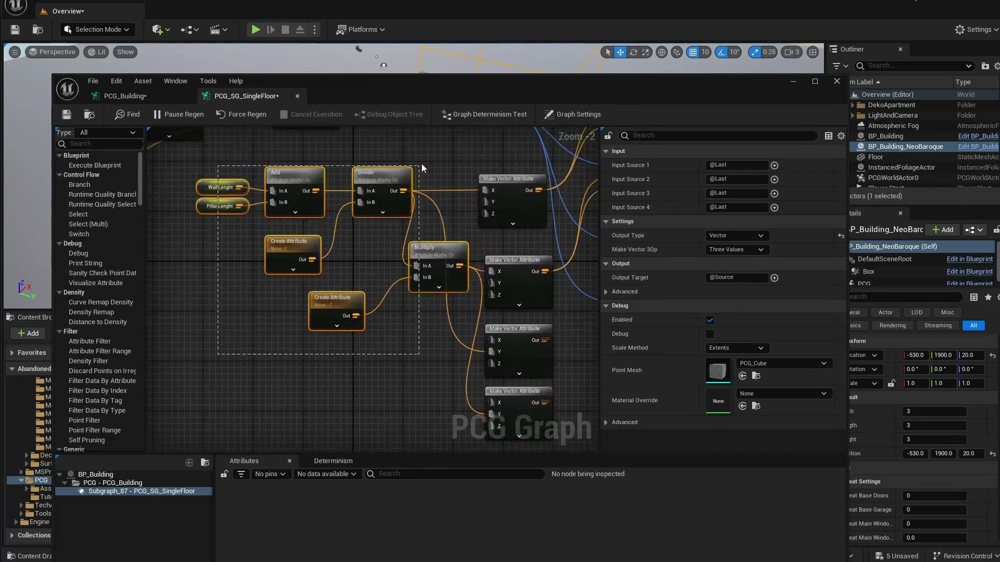
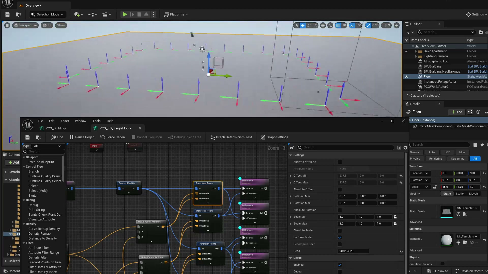

**参数、节点和风险点：**

- `Transform`
- `Point`
- `points`
- `walls`
- `transform`
- `first`
- `connect`
- `value`
- `move`
- `direction`

### 为墙体点接 Static Mesh Spawner，按墙体方向分别生成四边墙面

**内容要点：**

- 本段计算墙体位置：根据建筑长宽和墙体模块尺寸，计算每面墙的中心偏移，让墙体 Mesh 出现在边线中央。

**关键截图：**

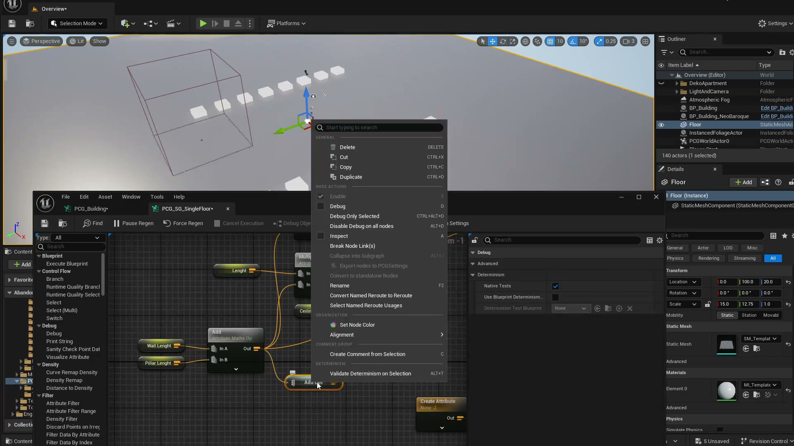
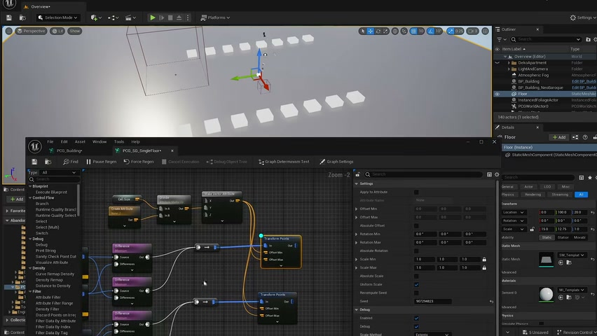

**参数、节点和风险点：**

- `Transform`
- `Point`
- `Attribute`
- `points`
- `corners`
- `transform`
- `node`
- `debug`
- `other`
- `cell`

### 为柱子点接 Static Mesh Spawner，按柱子长度和墙体偏移把柱子放到墙之间

**内容要点：**

- 本段生成墙体 Mesh：为墙体点接 Static Mesh Spawner，并分别处理不同边的方向和偏移。

**关键截图：**

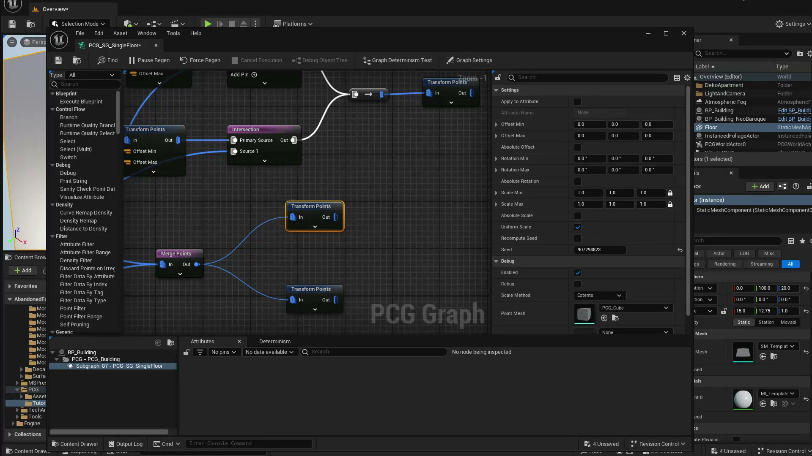
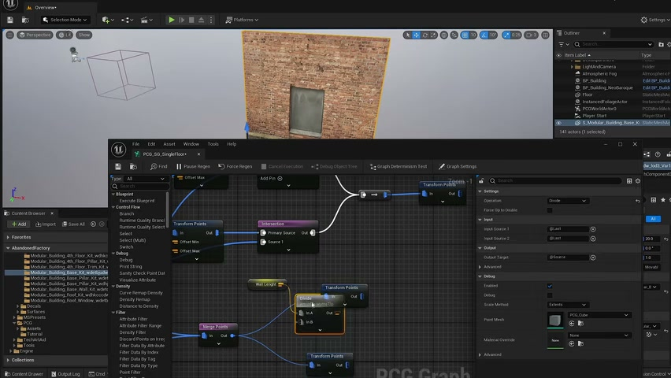

**参数、节点和风险点：**

- `Blueprint`
- `Transform`
- `Point`
- `Attribute`
- `Density`
- `wall`
- `length`
- `pillar`
- `transform`
- `walls`

### 为角件点计算额外偏移，解决角件不直接落在角上的问题

**内容要点：**

- 本段生成柱子 Mesh：为柱子点建立偏移和 Spawner，使柱子位于墙体之间或四边连接位置。

**关键截图：**

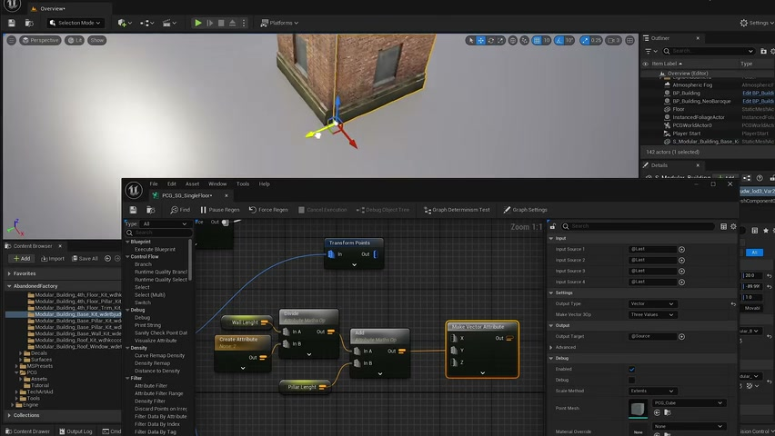
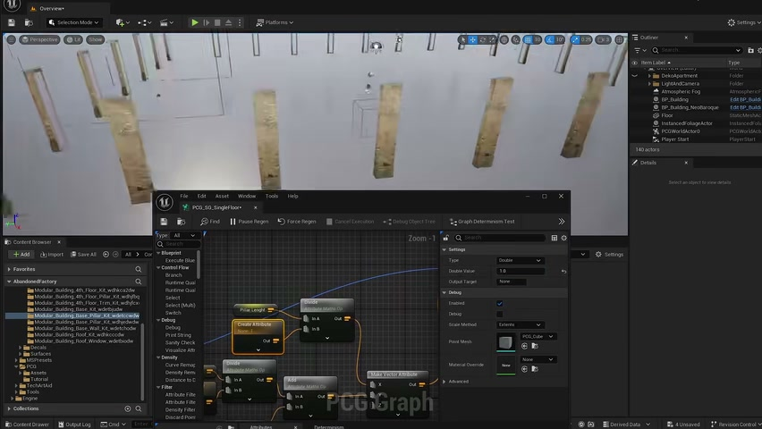

**参数、节点和风险点：**

- `Static Mesh`
- `Mesh`
- `Transform`
- `Point`
- `Actor`
- `Spawn`
- `Instance`
- `pillar`
- `wall`
- `length`

### 传递 Ceiling Height、Floor Height 等属性，让单层高度和楼层厚度可以被上层图表复用

**内容要点：**

- 本段处理角件：通过额外的 Transform Points 修正角件落点，解决角件没有直接对齐建筑四角的问题。

**关键截图：**

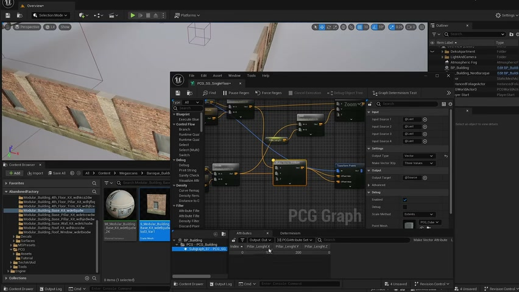
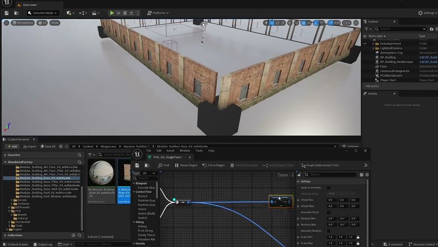

**参数、节点和风险点：**

- `Static Mesh`
- `Mesh`
- `Transform`
- `Point`
- `Actor`
- `Spawn`
- `Bounds`
- `Density`
- `Graph`
- `corner`

### 把 Subgraph 参数接入主图，确认默认建筑尺寸可以生成稳定的单层框架

**内容要点：**

- 本段传递楼层高度相关属性：获取 Ceiling Height 等参数，让单层生成结果可以被后续多楼层堆叠逻辑复用。

**关键截图：**

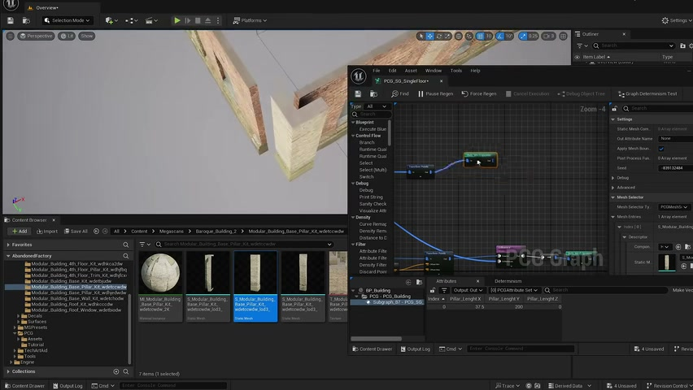
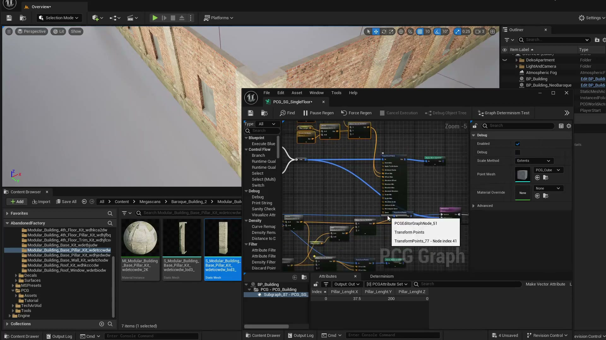

**参数、节点和风险点：**

- `PCG`
- `Blueprint`
- `Mesh`
- `Transform`
- `Point`
- `Actor`
- `Spawn`
- `Graph`
- `pillar`
- `spawning`

### 添加 Decal 或细节装饰，让建筑不只是简单方盒

**内容要点：**

- 本段把参数完整接入主图：连接 Subgraph 参数，验证默认建筑框架可以稳定生成，并且宽长高变化能影响结果。

**关键截图：**

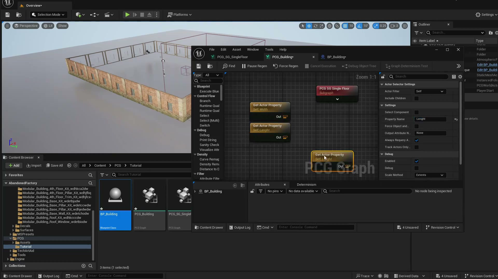
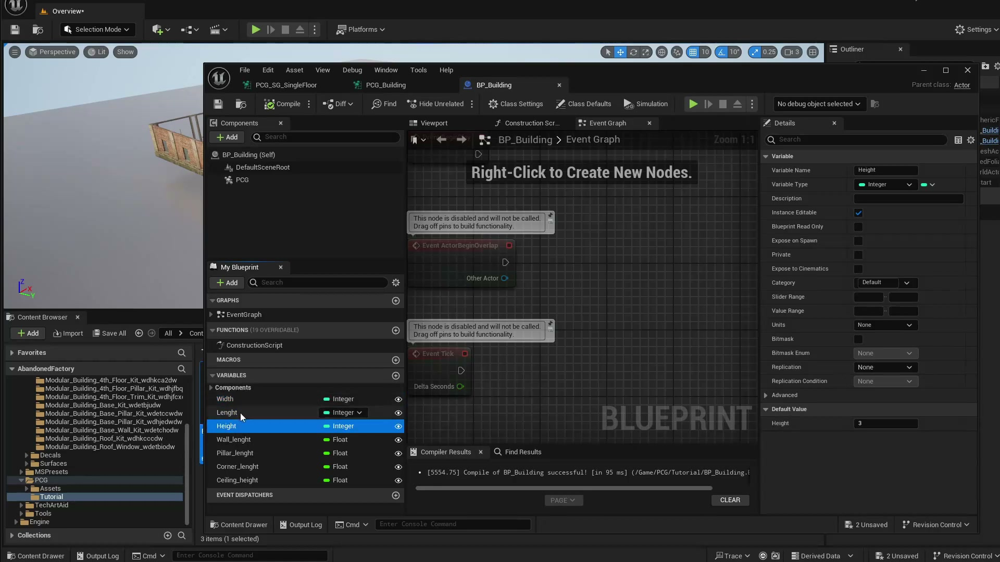

**参数、节点和风险点：**

- `Blueprint`
- `Point`
- `Attribute`
- `Grid`
- `Graph`
- `length`
- `height`
- `width`
- `pillar`
- `ceiling`

### 验证蓝图可替换不同资产集，后续能生成不同风格、不同尺寸的建筑

**内容要点：**

- 本段收尾和扩展：添加 Decal 等细节，让建筑更自然，并说明后续可替换不同资产集生成其他建筑风格。

**关键截图：**

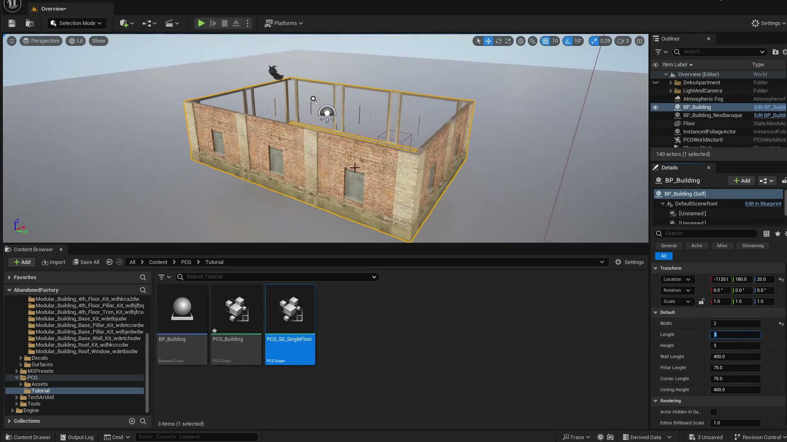
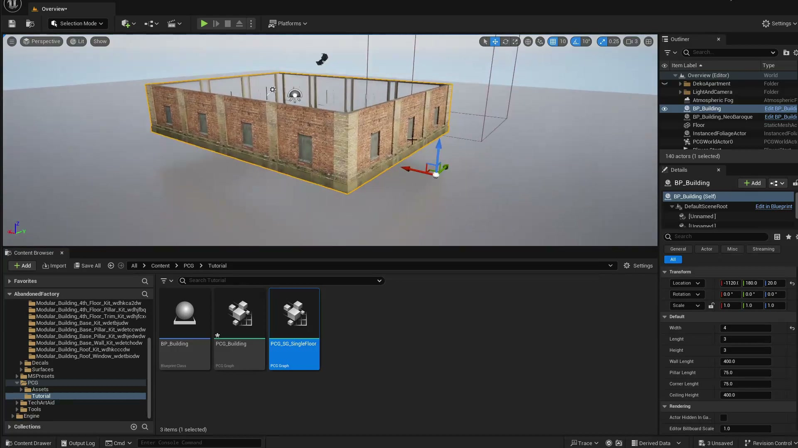

**参数、节点和风险点：**

- `Blueprint`
- `Actor`
- `generate`
- `floor`
- `blueprint`
- `other`
- `length`
- `properly`
- `units`

## 复现检查清单

- 墙、柱、角件的真实尺寸必须先量清楚，否则所有 Transform Offset 都会连锁出错。
- Wall/Pillar/Corner 点集必须分开调试，避免一个 Spawner 同时吃到不属于自己的点。
- Grid Extents 应由参数驱动，不要把建筑宽长写死在节点里。
- Subgraph 的输入输出和 Graph Settings 参数名称要保持一致。
- 第一部分重点是单层建筑框架，不要提前把多楼层、门窗和屋顶逻辑混进来。
- 复现时先固定随机种子，再调整密度、过滤和生成资源，避免随机结果掩盖逻辑错误。
