# 虚幻引擎 5.4 ！真实 PCG 建筑 - 教程第 2 部分！

## 知识目标

- 围绕“虚幻引擎 5.4 ！真实 PCG 建筑 - 教程第 2 部分！”整理真实 PCG 建筑生成第 2 部分：在单层框架基础上引入点类型、过滤、楼层复制、首层特殊高度、门窗重复和属性输出，让建筑可以生成多楼层立面。

## 可复现主流程

- 接上第 1 部分的单层 Subgraph，先清理临时调试位移和不再需要的直接生成节点。
- 为 Corner、Pillar、Wall 等点写入 Target/Type 属性，不在 Subgraph 内直接生成 Mesh。
- 在主图中用属性过滤拆分不同点类型，再分别接对应的 Static Mesh Spawner。
- 确认 Cell Z Size 与 Ceiling Height 对齐，让每层高度可控。
- 在建筑蓝图中增加 Position/Floor 相关变量，为多楼层复制和索引判断做准备。
- 用 Attribute Noise 或随机属性控制局部变化，但要保证重要结构点不被错误过滤。
- 复制单层点集并保留 Index/Floor 属性，使每层能知道自己属于第几层。
- 处理首层特殊高度：首层可以比其他楼层更高，其余楼层使用统一 Ceiling Height。
- 用 Get Actor Property 从蓝图读取建筑总高度、楼层数和其他外部变量。
- 沿 Z 轴复制 Transform Points 和 Spawner，形成多层建筑立面。
- 建立 Door Repetition、Window Repetition 等重复参数，控制门窗间隔和数量。
- 通过索引减法、取模或属性比较筛选门、窗、墙、柱点。
- 把内部计算结果输出到专用属性，避免覆盖 Index 等 PCG 内置属性。
- 整理所有门窗、柱、墙分支并连接到最终 Spawner。
- 验证多楼层建筑在不同高度、重复次数和模块尺寸下仍然对齐。

## 关键术语

- `PCG`
- `Blueprint`
- `Static Mesh`
- `Mesh`
- `Point Filter`
- `SubGraph`
- `Transform`
- `Point`
- `Attribute`
- `Actor`
- `Component`
- `Spawn`
- `Grid`
- `Bounds`
- `Density`
- `Random`
- `Seed`
- `Graph`

## 操作步骤与要点

### 接上第 1 部分的单层 Subgraph，先清理临时调试位移和不再需要的直接生成节点

**内容要点：**

- 本段说明第 2 部分目标：在上一集单层建筑框架基础上继续扩展，让 PCG 建筑可以生成多楼层，并处理墙、柱、角件、门窗等不同点类型。

**关键截图：**

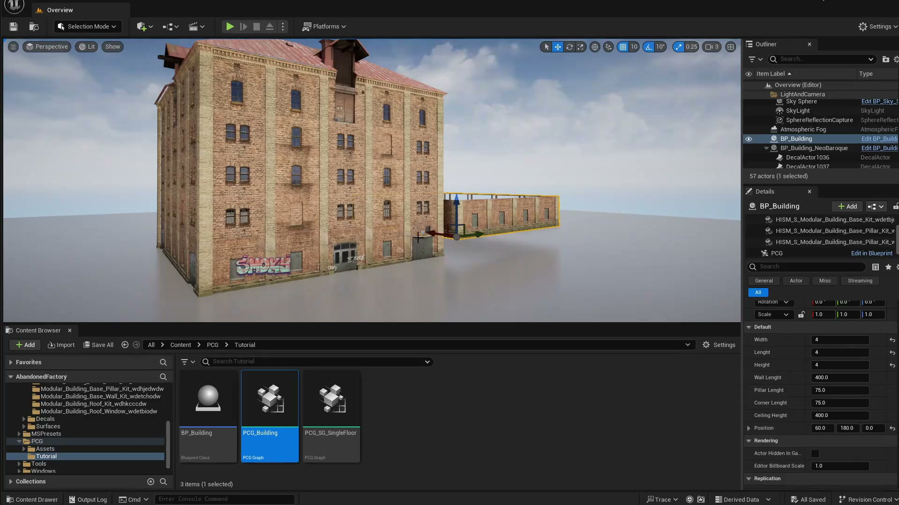
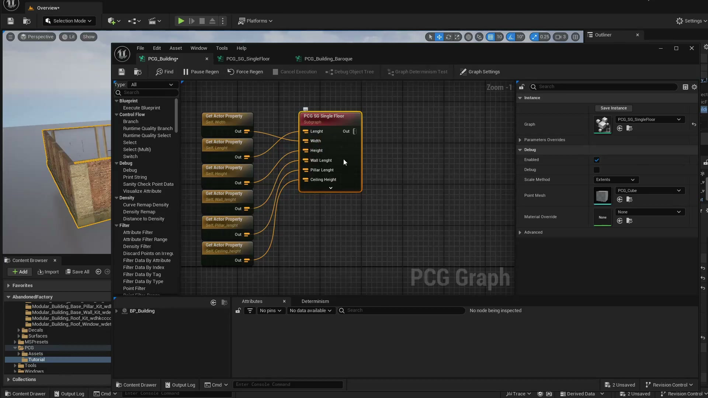

**参数、节点和风险点：**

- `PCG`
- `Blueprint`
- `Static Mesh`
- `Mesh`
- `Transform`
- `Point`
- `Actor`
- `Spawn`
- `Graph`
- `graph`

### 为 Corner、Pillar、Wall 等点写入 Target/Type 属性，不在 Subgraph 内直接生成 Mesh

**内容要点：**

- 本段清理上一集遗留调试内容：移除临时偏移和不再需要的直接生成节点，为重新组织 Subgraph 输出做准备。

**关键截图：**

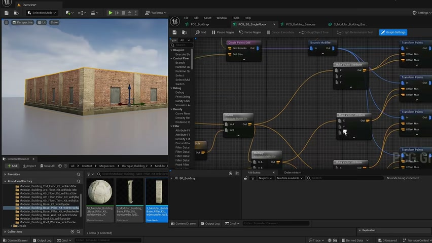
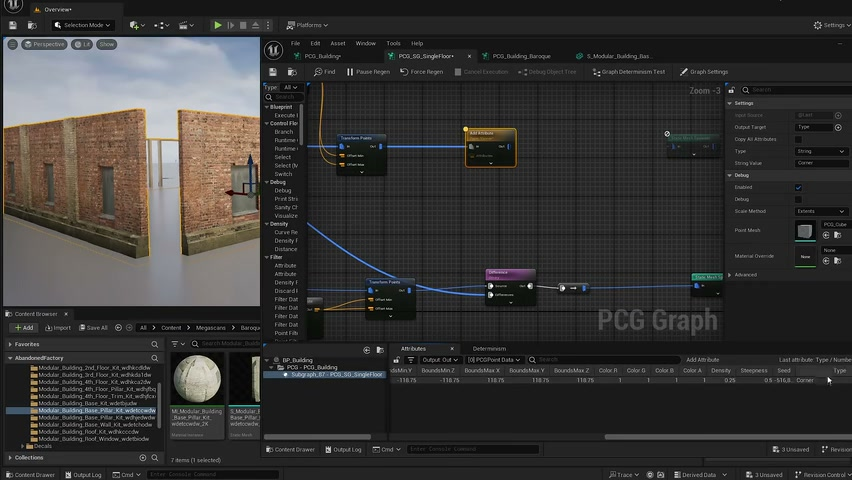

**参数、节点和风险点：**

- `PCG`
- `Static Mesh`
- `Mesh`
- `Point`
- `Attribute`
- `Spawn`
- `Graph`
- `graph`
- `type`
- `points`

### 在主图中用属性过滤拆分不同点类型，再分别接对应的 Static Mesh Spawner

**内容要点：**

- 本段把点类型写成属性：角点、柱点、墙点不再在 Subgraph 内直接生成，而是写入 corner、pillar、wall 等 Target/Type 属性。

**关键截图：**

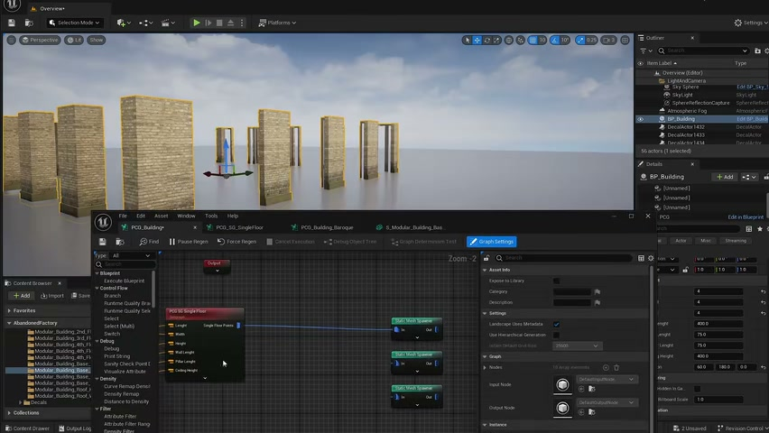
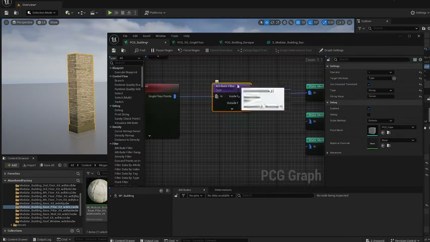

**参数、节点和风险点：**

- `Static Mesh`
- `Mesh`
- `Point Filter`
- `Point`
- `Attribute`
- `Actor`
- `Spawn`
- `Graph`
- `filter`
- `points`

### 确认 Cell Z Size 与 Ceiling Height 对齐，让每层高度可控

**内容要点：**

- 本段在主图中过滤点类型：用属性过滤把角、柱、墙分开，让每类点分别接自己的 Static Mesh Spawner。

**关键截图：**

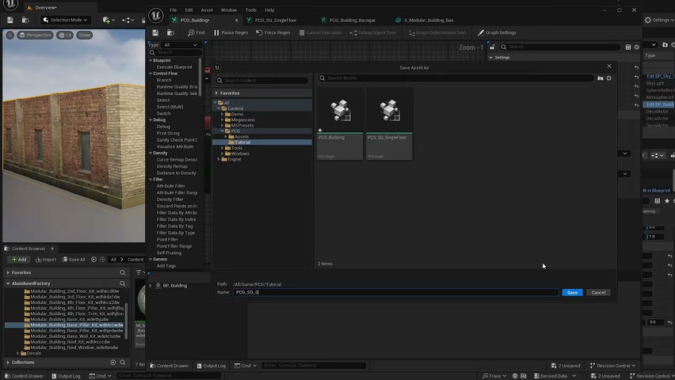
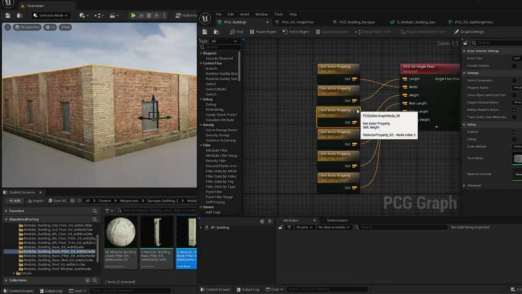

**参数、节点和风险点：**

- `PCG`
- `Blueprint`
- `Mesh`
- `Point`
- `Spawn`
- `Grid`
- `Graph`
- `height`
- `graph`
- `point`

### 在建筑蓝图中增加 Position/Floor 相关变量，为多楼层复制和索引判断做准备

**内容要点：**

- 本段检查楼层高度：确保 Cell 的 Z Size 等于 Ceiling Height，为多层复制奠定基础。

**关键截图：**

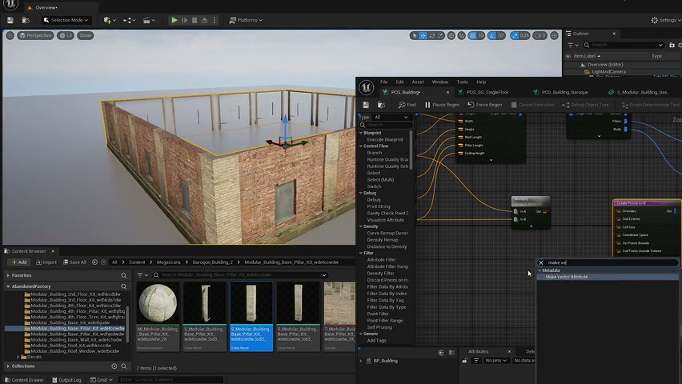
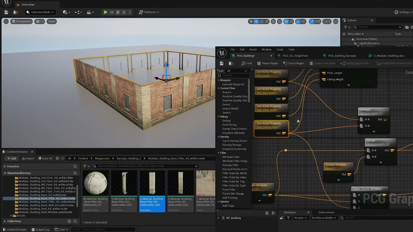

**参数、节点和风险点：**

- `PCG`
- `Blueprint`
- `Point`
- `Attribute`
- `Grid`
- `Density`
- `Random`
- `attribute`
- `size`
- `height`

### 用 Attribute Noise 或随机属性控制局部变化，但要保证重要结构点不被错误过滤

**内容要点：**

- 本段给建筑蓝图增加位置/楼层相关变量，让后续楼层复制、索引判断和外部参数读取都有来源。

**关键截图：**

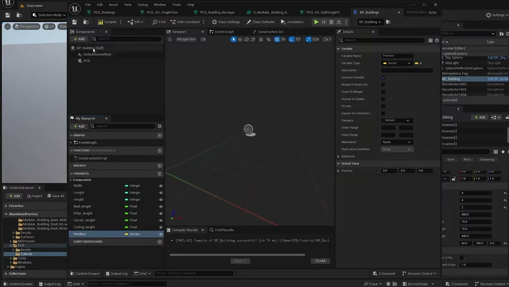
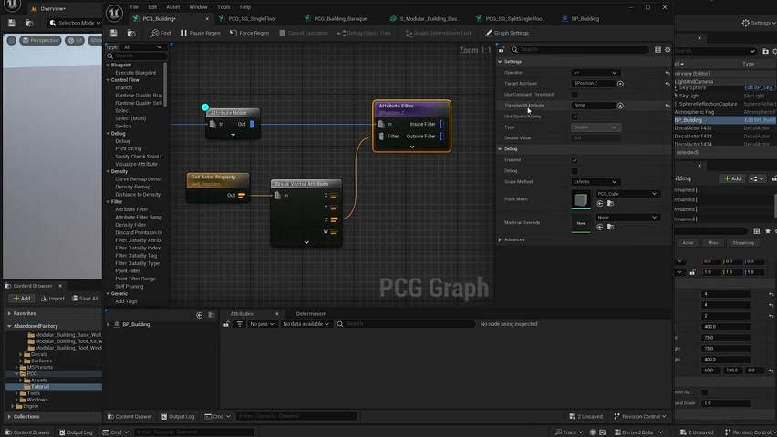

**参数、节点和风险点：**

- `PCG`
- `Blueprint`
- `Point Filter`
- `Point`
- `Attribute`
- `Actor`
- `Density`
- `Graph`
- `position`
- `filter`

### 复制单层点集并保留 Index/Floor 属性，使每层能知道自己属于第几层

**内容要点：**

- 本段引入 Attribute Noise 或随机属性，用于后续局部变化，但仍要避免破坏必要结构点。

**关键截图：**

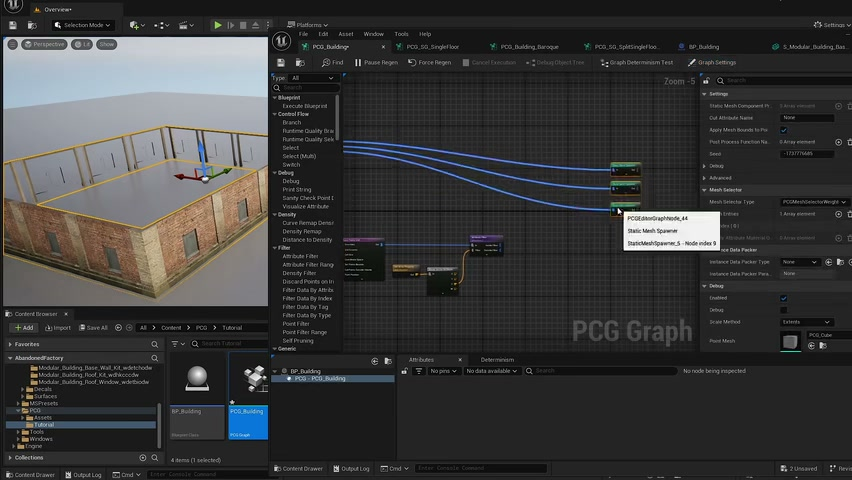
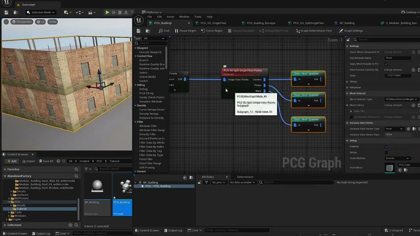

**参数、节点和风险点：**

- `PCG`
- `Blueprint`
- `Static Mesh`
- `Mesh`
- `SubGraph`
- `Point`
- `Attribute`
- `Spawn`
- `Graph`
- `floor`

### 处理首层特殊高度：首层可以比其他楼层更高，其余楼层使用统一 Ceiling Height

**内容要点：**

- 本段复制单层点集并复制 Index 属性，让每层点在复制后仍能保留原始索引和层级信息。

**关键截图：**

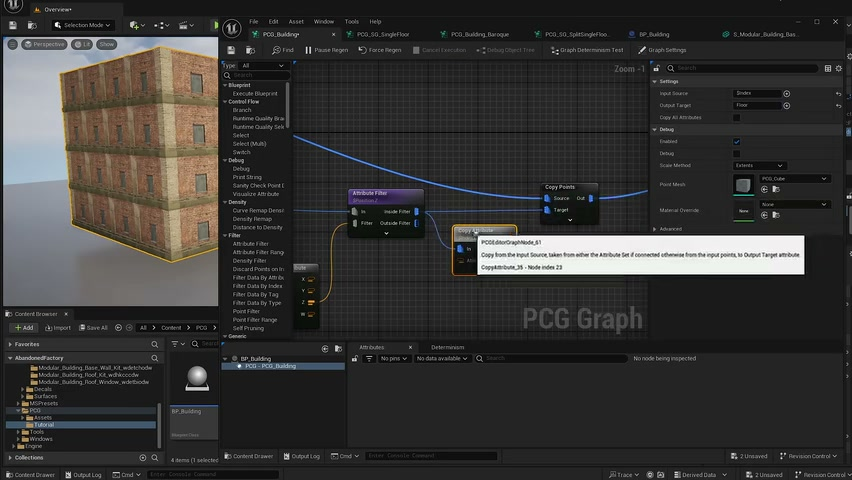
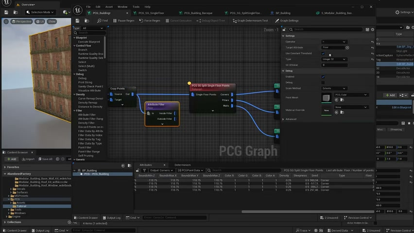

**参数、节点和风险点：**

- `Blueprint`
- `Mesh`
- `Point Filter`
- `Point`
- `Attribute`
- `Spawn`
- `floor`
- `choose`
- `points`
- `floors`

### 用 Get Actor Property 从蓝图读取建筑总高度、楼层数和其他外部变量

**内容要点：**

- 本段处理首层高度差异：首层比普通楼层更高，其余楼层使用统一高度，使建筑更接近真实比例。

**关键截图：**

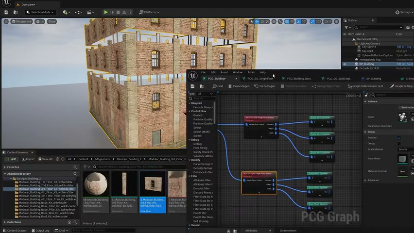
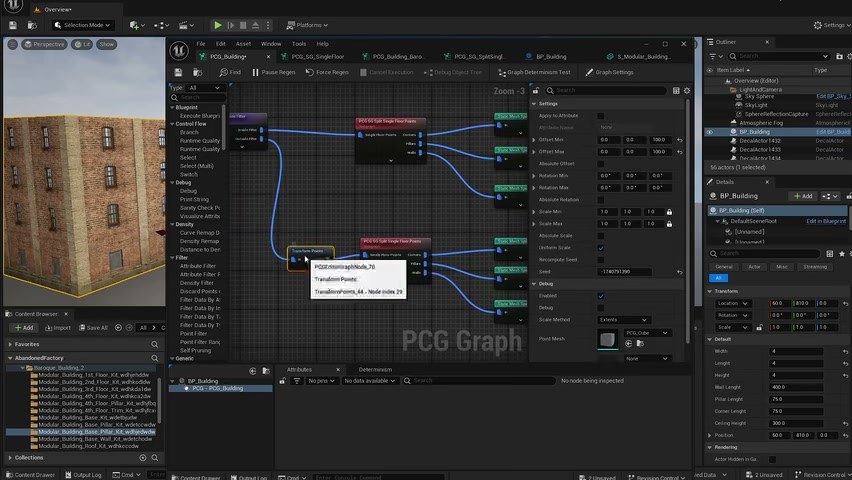

**参数、节点和风险点：**

- `PCG`
- `Blueprint`
- `Mesh`
- `Transform`
- `Point`
- `Attribute`
- `Actor`
- `Spawn`
- `Graph`
- `floor`

### 沿 Z 轴复制 Transform Points 和 Spawner，形成多层建筑立面

**内容要点：**

- 本段使用 Get Actor Property 读取蓝图里的建筑高度和楼层参数，避免把高度写死在 PCG 图里。

**关键截图：**

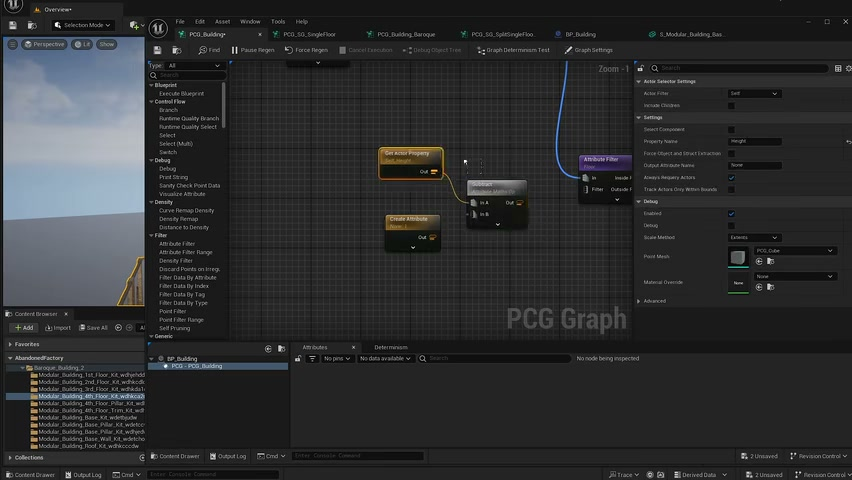
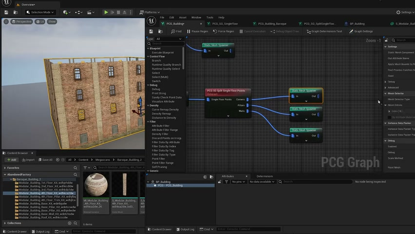

**参数、节点和风险点：**

- `Static Mesh`
- `Mesh`
- `Transform`
- `Point`
- `Attribute`
- `Spawn`
- `floor`
- `last`
- `subtract`
- `points`

### 建立 Door Repetition、Window Repetition 等重复参数，控制门窗间隔和数量

**内容要点：**

- 本段通过 Z 轴 Transform 复制楼层，并复制墙、柱、角件 Spawner，逐步形成完整立面。

**关键截图：**

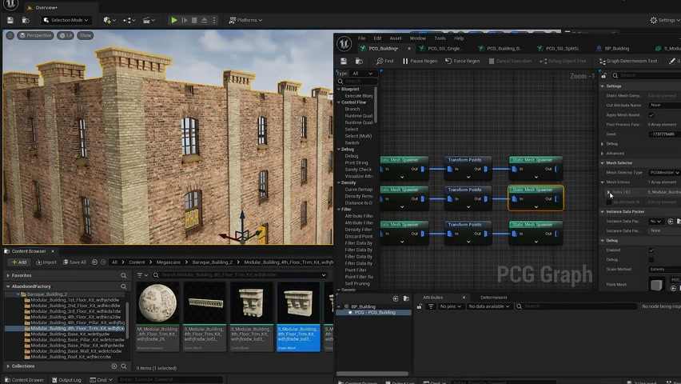
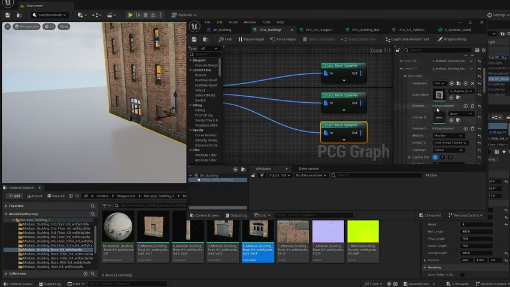

**参数、节点和风险点：**

- `PCG`
- `Blueprint`
- `Static Mesh`
- `Mesh`
- `Point`
- `Attribute`
- `Spawn`
- `Random`
- `Graph`
- `door`

### 通过索引减法、取模或属性比较筛选门、窗、墙、柱点

**内容要点：**

- 本段加入门的重复参数：在建筑蓝图中创建 Door Repetition 等变量，控制门出现的间隔和数量。

**关键截图：**

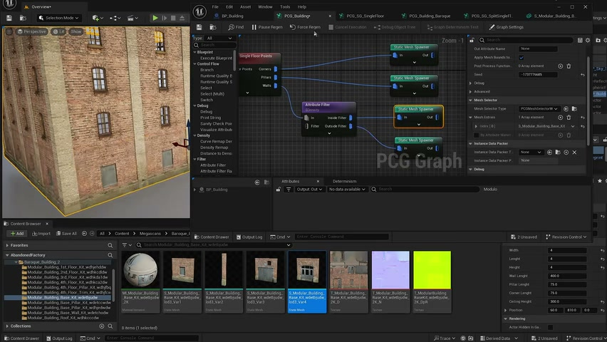
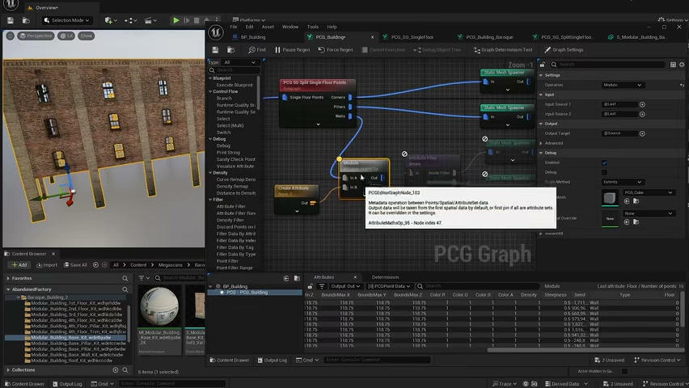

**参数、节点和风险点：**

- `PCG`
- `Point Filter`
- `Point`
- `Attribute`
- `Actor`
- `Spawn`
- `Graph`
- `index`
- `door`
- `element`

### 把内部计算结果输出到专用属性，避免覆盖 Index 等 PCG 内置属性

**内容要点：**

- 本段用索引运算筛选门窗位置：通过减一、取模或属性比较，把门窗点从墙体点中分离出来。

**关键截图：**

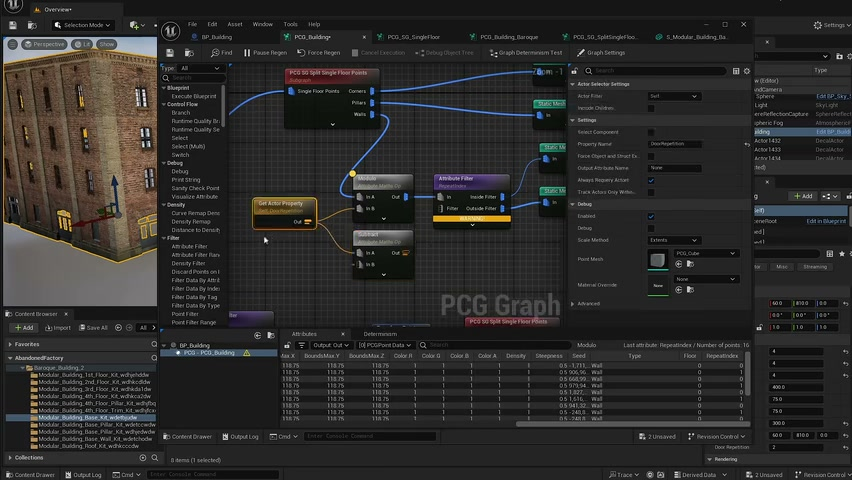
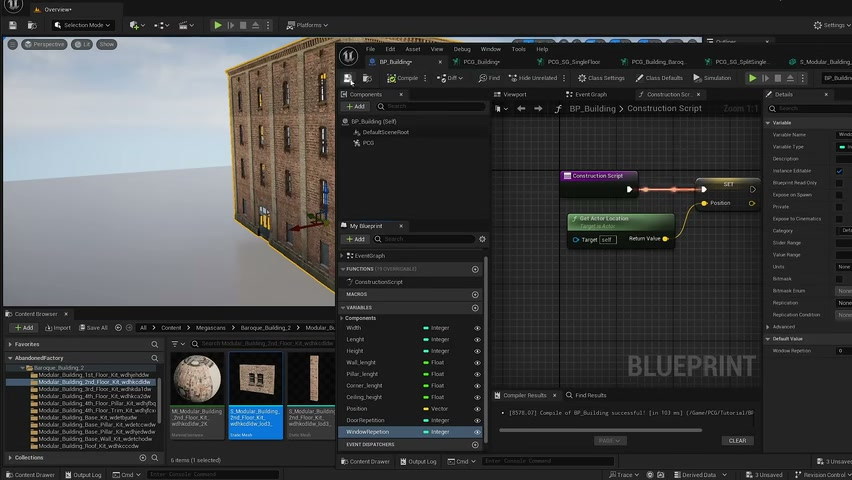

**参数、节点和风险点：**

- `PCG`
- `Blueprint`
- `Mesh`
- `Point`
- `Attribute`
- `Actor`
- `Spawn`
- `Density`
- `Graph`
- `attribute`

### 整理所有门窗、柱、墙分支并连接到最终 Spawner

**内容要点：**

- 本段把中间结果输出到自定义属性，避免覆盖 Index 等内置属性造成后续节点异常。

**关键截图：**

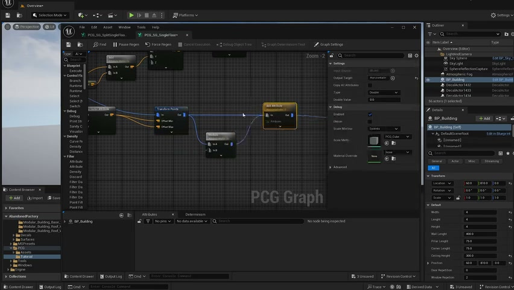
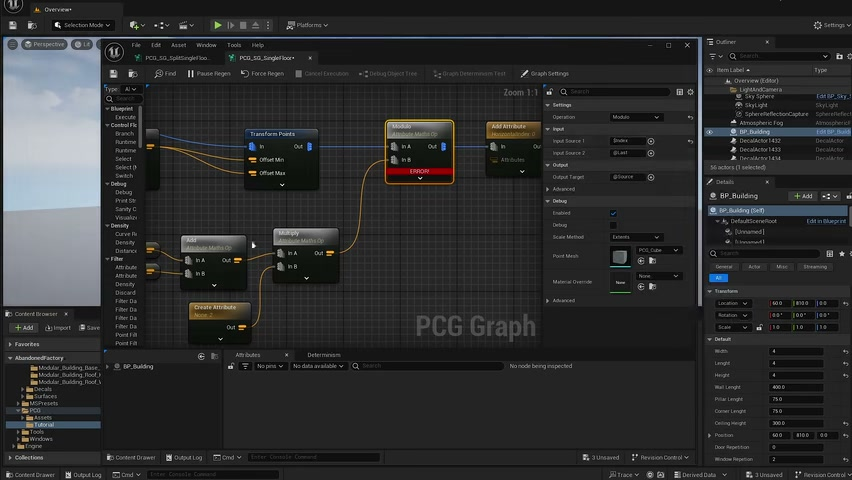

**参数、节点和风险点：**

- `PCG`
- `Attribute`
- `Graph`
- `index`
- `module`
- `horizontal`
- `floor`
- `width`
- `length`
- `them`

### 验证多楼层建筑在不同高度、重复次数和模块尺寸下仍然对齐

**内容要点：**

- 本段收尾验证：连接门窗、墙、柱分支，检查多层建筑在不同参数下是否仍然对齐并正确生成。

**关键截图：**

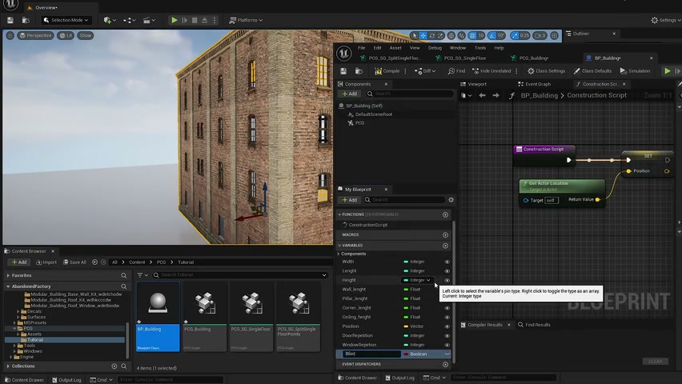
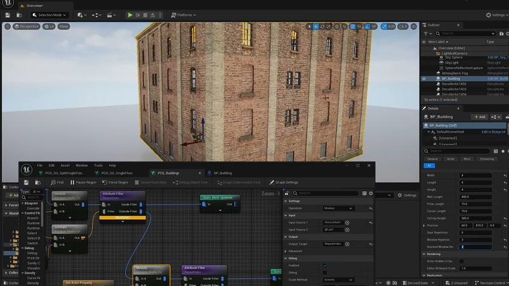

**参数、节点和风险点：**

- `PCG`
- `Mesh`
- `Attribute`
- `Actor`
- `Spawn`
- `Random`
- `Graph`
- `window`
- `blocked`
- `repetition`

## 复现检查清单

- Subgraph 只负责产出带属性的点，实际 Mesh 生成应放回主图，便于统一过滤和复用。
- Target/Type 属性值要稳定，例如 corner、pillar、wall，否则属性过滤会漏点。
- 首层高度和普通楼层高度要分开处理，不能只用一个 Ceiling Height 覆盖所有层。
- Index 是关键内置属性，不能随便覆盖；需要输出结果时用自定义属性。
- 门窗重复参数要和墙体长度、模块长度匹配，否则会出现不完整或错位开窗。
- 复现时先固定随机种子，再调整密度、过滤和生成资源，避免随机结果掩盖逻辑错误。
