# 虚幻引擎5！使用 PCG 生成屋顶 - 第 3 部分

## 知识目标

- 围绕“虚幻引擎5！使用 PCG 生成屋顶 - 第 3 部分”整理真实 PCG 建筑生成第 3 部分：在多楼层建筑基础上生成屋顶、屋顶窗、材质、Decal 和最终细节，使 PCG 建筑从框架进化为完整可用的建筑资产。

## 可复现主流程

- 先修正上一集遗留问题，确认楼层点、顶层点和墙体点都能正确分离。
- 从最后一层生成 Roof Points，并用 Transform Points 把屋顶点移动到正确高度。
- 复用 Split/Subgraph 逻辑，把屋顶点拆成 Corner、Wall、Pillar 等类别。
- 先生成屋顶角件和屋顶边缘，再逐步添加 Roof Static Mesh Spawner。
- 制作或导入 Roof Piece，并为屋顶模块设置正确尺寸和 Pivot。
- 给屋顶材质设置 World Aligned Texture，让不同尺寸屋顶仍有稳定纹理比例。
- 根据屋顶边长计算重复次数和偏移，避免屋顶模块在边缘处错位。
- 处理墙顶和屋顶之间的过渡模块，让屋顶不会悬空或插入墙体。
- 加入 Roof Window Repetition，控制屋顶窗是否生成以及生成间隔。
- 用 Attribute/Filter 按密度、索引或重复参数筛选屋顶窗点。
- 把普通屋顶件和带窗屋顶件分开生成，避免两个 Mesh 在同一位置重叠。
- 处理门、窗、Decal 等立面细节，让建筑外观不再是重复模块。
- 用 Density Filter 和 Attribute Noise 随机化 Decal 或污渍/细节分布。
- 调整 Decal 材质、Opacity、位置偏移和朝向，使贴花落在正确表面。
- 合并屋顶、墙体、窗、门、Decal 各分支，检查所有模块之间的遮挡和重叠。
- 整理参数，把屋顶重复、窗重复、材质和 Decal 控制暴露为可调项。
- 在不同建筑尺寸上测试屋顶和窗的适配性，确保宽、长、高变化后仍然可用。
- 完成整套建筑生成器收尾，确认从单层、多楼层到屋顶细节都能在 PCG 中稳定生成。
- 记录后续可扩展方向：替换资产包、增加更多屋顶类型和更复杂立面规则。

## 关键术语

- `PCG`
- `Blueprint`
- `Static Mesh`
- `Mesh`
- `Point Filter`
- `SubGraph`
- `Transform`
- `Point`
- `Attribute`
- `Actor`
- `Spawn`
- `Grid`
- `Bounds`
- `Density`
- `Random`
- `Seed`
- `Loop`
- `Graph`

## 操作步骤与要点

### 先修正上一集遗留问题，确认楼层点、顶层点和墙体点都能正确分离

**内容要点：**

- 本段说明第 3 部分目标：在已有 PCG 建筑基础上添加屋顶和楼层框架内的窗户，并先修正上一集遗留的楼层点状态。

**关键截图：**

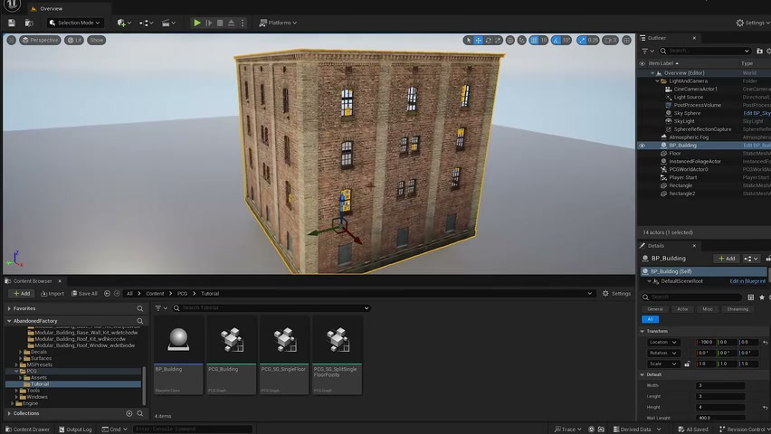
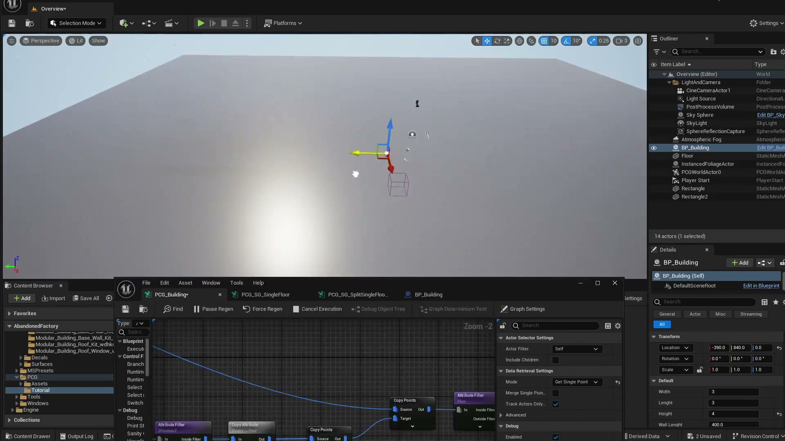

**参数、节点和风险点：**

- `PCG`
- `Blueprint`
- `Transform`
- `Point`
- `Attribute`
- `Actor`
- `Spawn`
- `Grid`
- `Graph`
- `blueprint`

### 从最后一层生成 Roof Points，并用 Transform Points 把屋顶点移动到正确高度

**内容要点：**

- 本段从最后一层点生成 Roof Points：通过 Transform Points 把顶层相关点移动到屋顶高度，作为屋顶生成的输入。

**关键截图：**

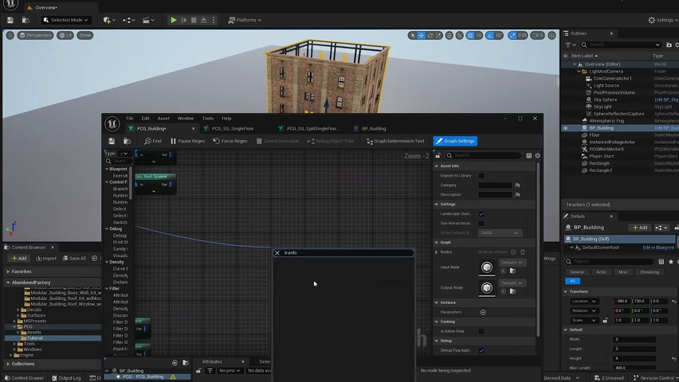
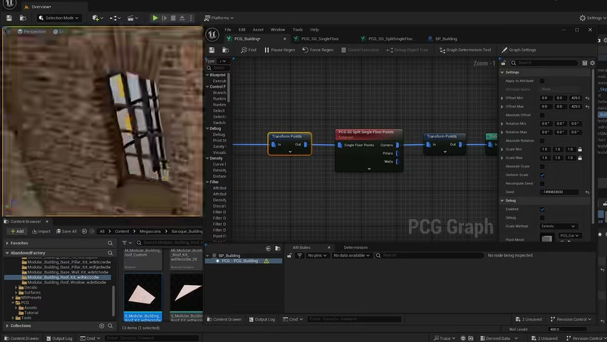

**参数、节点和风险点：**

- `Static Mesh`
- `Mesh`
- `SubGraph`
- `Transform`
- `Point`
- `Actor`
- `Spawn`
- `Graph`
- `points`
- `move`

### 复用 Split/Subgraph 逻辑，把屋顶点拆成 Corner、Wall、Pillar 等类别

**内容要点：**

- 本段继续拆分屋顶点：复用已有 Split/Subgraph 逻辑，把屋顶点分为角、边、柱等类别，方便后续分别生成 Mesh。

**关键截图：**

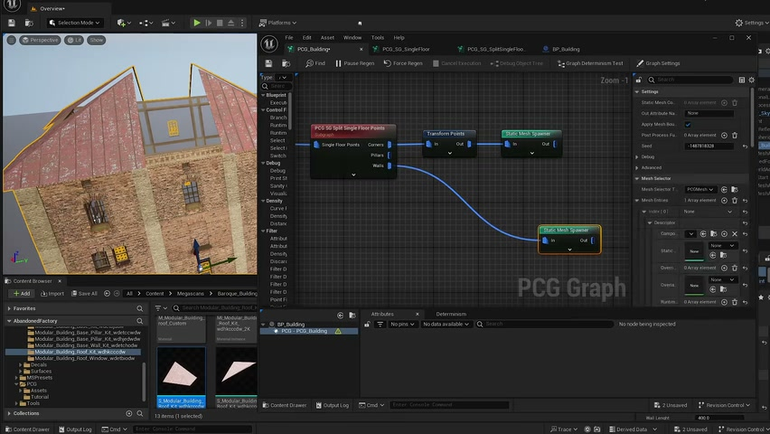
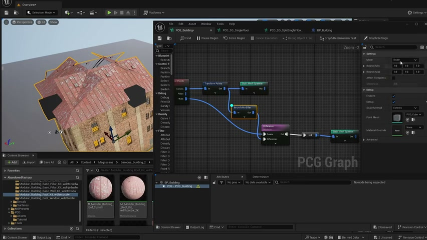

**参数、节点和风险点：**

- `Static Mesh`
- `Mesh`
- `Point`
- `Spawn`
- `Density`
- `difference`
- `roof`
- `minus`
- `points`
- `corner`

### 先生成屋顶角件和屋顶边缘，再逐步添加 Roof Static Mesh Spawner

**内容要点：**

- 本段先生成屋顶角件：用 Transform Points 和 Static Mesh Spawner 把角件放到屋顶四角。

**关键截图：**

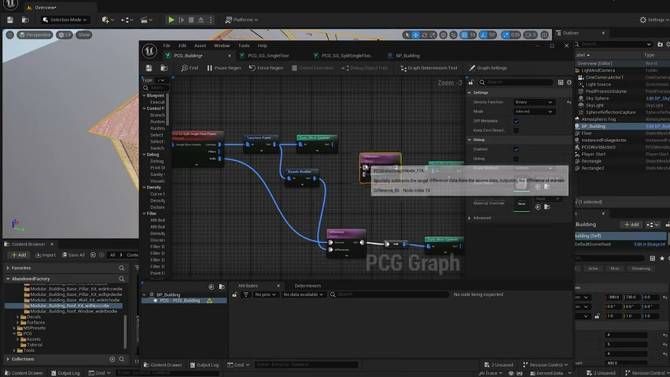
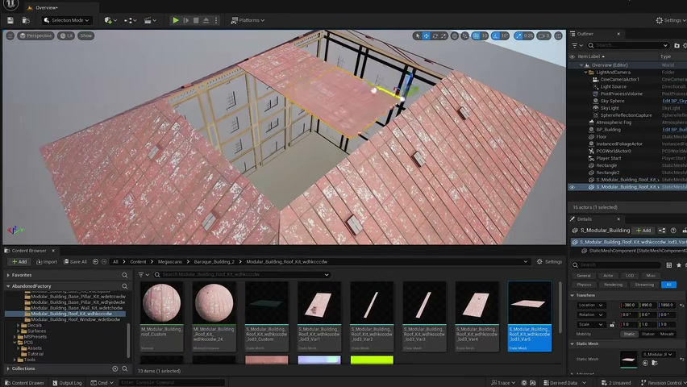

**参数、节点和风险点：**

- `PCG`
- `Blueprint`
- `Static Mesh`
- `Mesh`
- `Point`
- `Spawn`
- `Density`
- `Random`
- `Graph`
- `Material`

### 制作或导入 Roof Piece，并为屋顶模块设置正确尺寸和 Pivot

**内容要点：**

- 本段制作/导入 Roof Piece：确认屋顶模块尺寸、Pivot 和可重复方向，为边缘屋顶生成做准备。

**关键截图：**

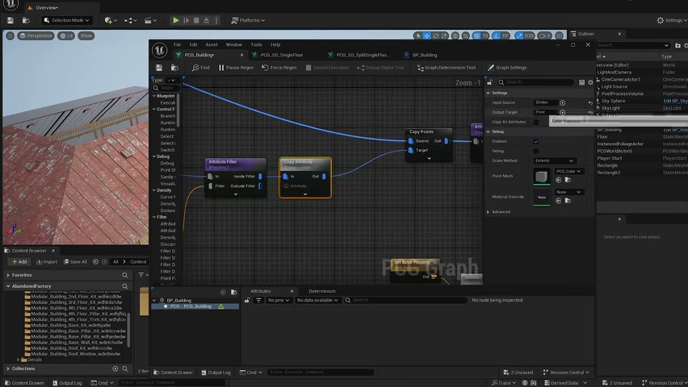
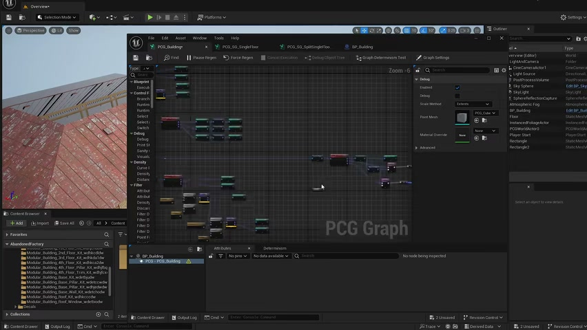

**参数、节点和风险点：**

- `Blueprint`
- `Static Mesh`
- `Mesh`
- `Transform`
- `Point`
- `Attribute`
- `Spawn`
- `Graph`
- `points`
- `floor`

### 给屋顶材质设置 World Aligned Texture，让不同尺寸屋顶仍有稳定纹理比例

**内容要点：**

- 本段处理屋顶材质：给 Roof Piece 设置材质，并开始使用 World Aligned Texture 避免缩放导致纹理比例异常。

**关键截图：**

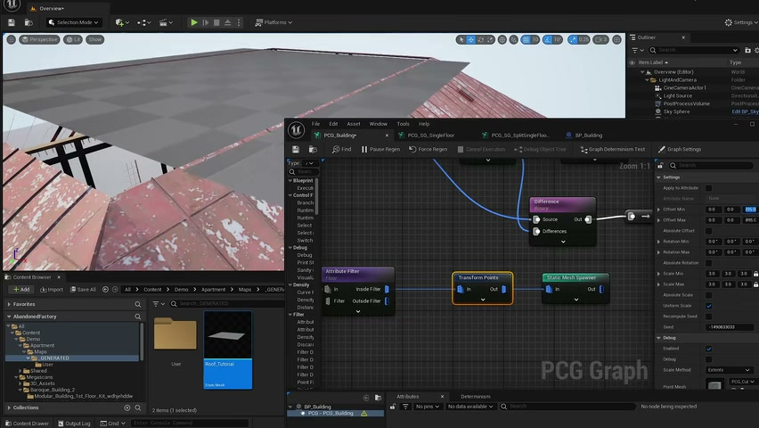
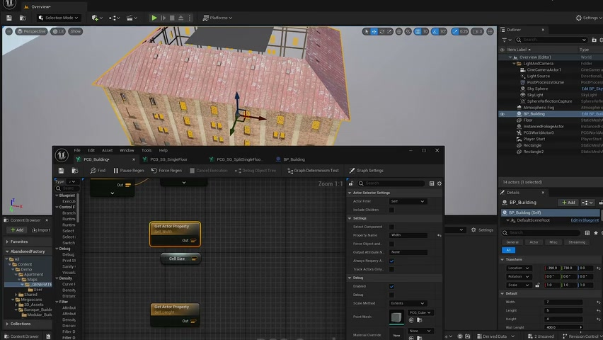

**参数、节点和风险点：**

- `PCG`
- `Blueprint`
- `Transform`
- `Point`
- `Attribute`
- `Actor`
- `Spawn`
- `Grid`
- `Graph`
- `size`

### 根据屋顶边长计算重复次数和偏移，避免屋顶模块在边缘处错位

**内容要点：**

- 本段完善 World Aligned 材质节点：把世界位置接入材质，让屋顶在不同尺寸下也保持一致纹理尺度。

**关键截图：**

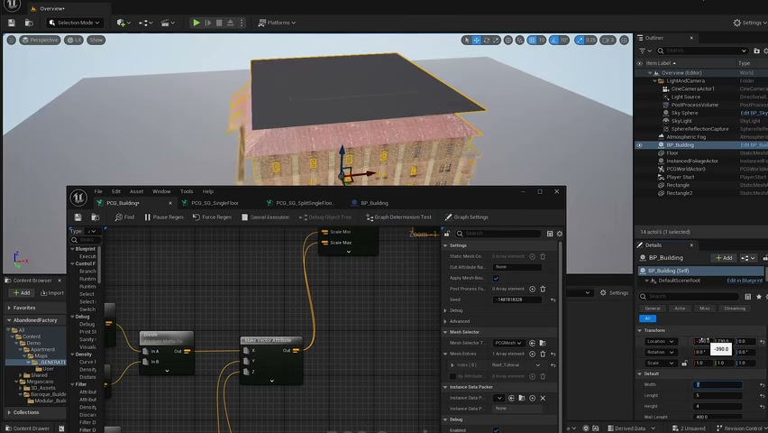
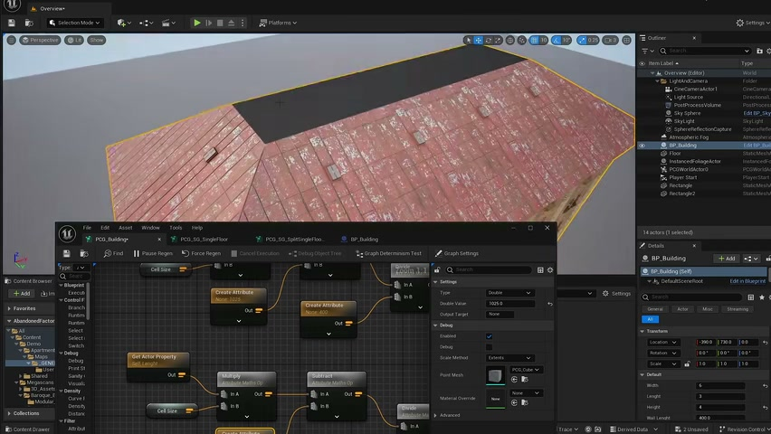

**参数、节点和风险点：**

- `Transform`
- `Point`
- `Actor`
- `Spawn`
- `Material`
- `roof`
- `material`
- `value`
- `piece`
- `change`

### 处理墙顶和屋顶之间的过渡模块，让屋顶不会悬空或插入墙体

**内容要点：**

- 本段计算屋顶重复和偏移：根据屋顶边长、模块宽度和偏移值，让屋顶件沿边缘平铺。

**关键截图：**

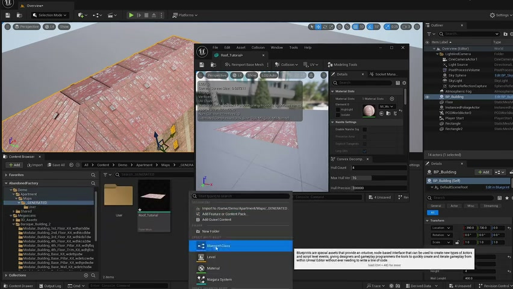
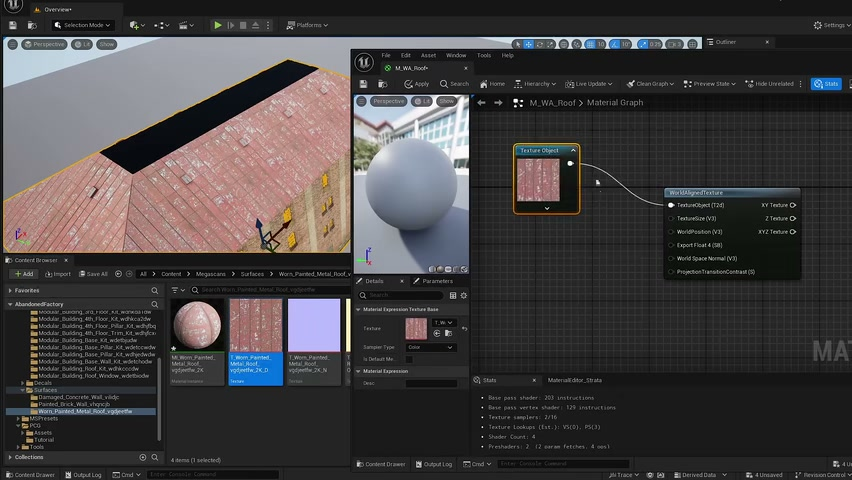

**参数、节点和风险点：**

- `Actor`
- `Material`
- `texture`
- `world`
- `material`
- `aligned`
- `connect`
- `position`
- `node`
- `object`

### 加入 Roof Window Repetition，控制屋顶窗是否生成以及生成间隔

**内容要点：**

- 本段处理墙顶过渡：把屋顶边缘和墙体顶部衔接起来，避免屋顶漂浮或与墙体穿插。

**关键截图：**

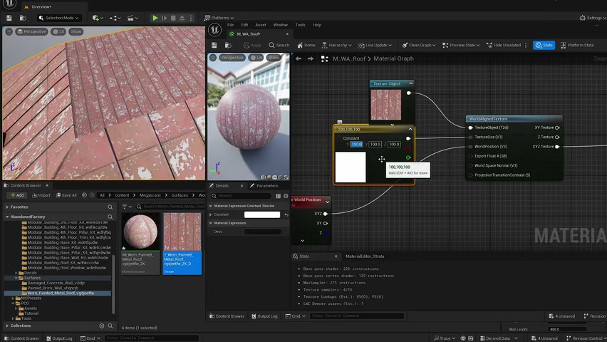
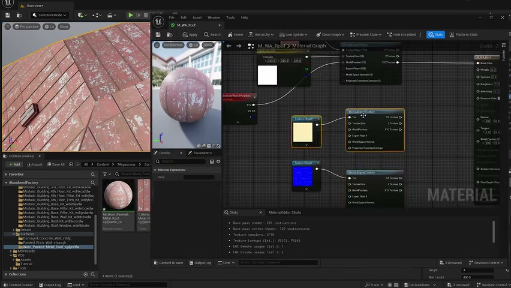

**参数、节点和风险点：**

- `PCG`
- `Mesh`
- `Graph`
- `Material`
- `material`
- `texture`
- `roughness`
- `roof`
- `connect`
- `normal`

### 用 Attribute/Filter 按密度、索引或重复参数筛选屋顶窗点

**内容要点：**

- 本段加入 Roof Window Repetition：通过参数控制屋顶窗是否生成，以及每隔多少模块生成一个窗。

**关键截图：**

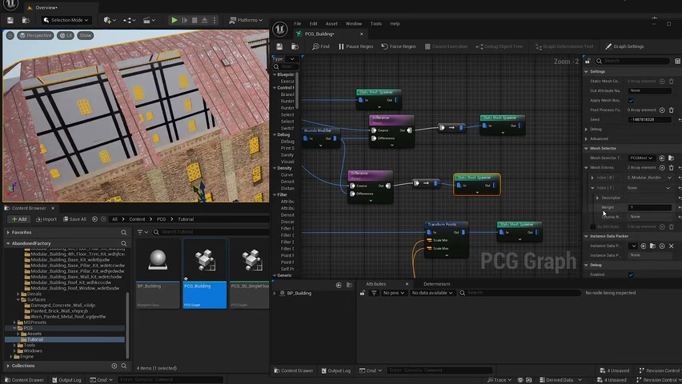
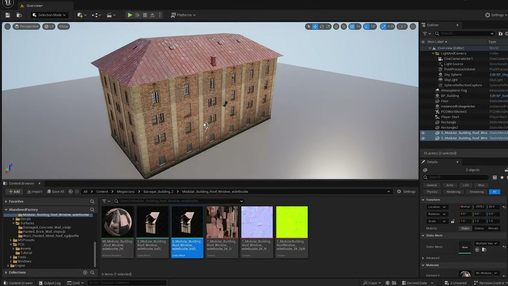

**参数、节点和风险点：**

- `PCG`
- `Blueprint`
- `Static Mesh`
- `Mesh`
- `Spawn`
- `Random`
- `Graph`
- `roof`
- `elements`
- `weight`

### 把普通屋顶件和带窗屋顶件分开生成，避免两个 Mesh 在同一位置重叠

**内容要点：**

- 本段筛选屋顶窗位置：用 Attribute/Filter 把要生成屋顶窗的位置和普通屋顶件位置拆开。

**关键截图：**

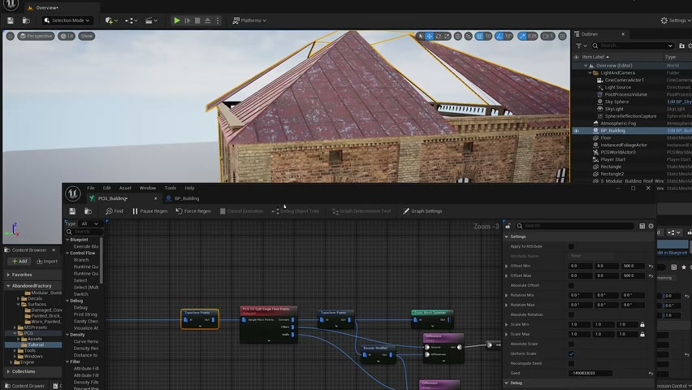
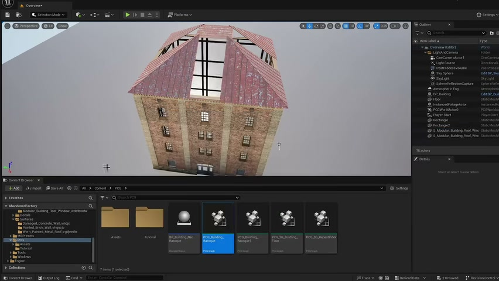

**参数、节点和风险点：**

- `PCG`
- `Mesh`
- `Actor`
- `Spawn`
- `roof`
- `piece`
- `offset`
- `properly`
- `showed`
- `much`

### 处理门、窗、Decal 等立面细节，让建筑外观不再是重复模块

**内容要点：**

- 本段分别生成普通屋顶件和带窗屋顶件，避免两种模块重叠在同一个点上。

**关键截图：**

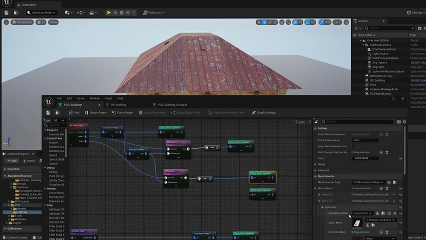
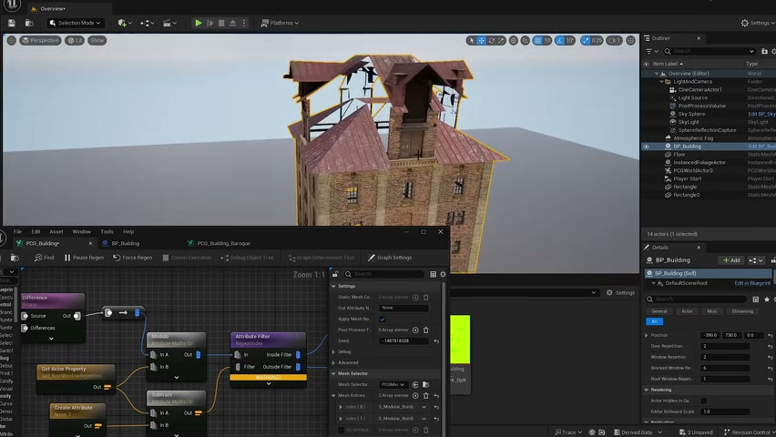

**参数、节点和风险点：**

- `PCG`
- `Blueprint`
- `Static Mesh`
- `Mesh`
- `Transform`
- `Point`
- `Actor`
- `Spawn`
- `Random`
- `roof`

### 用 Density Filter 和 Attribute Noise 随机化 Decal 或污渍/细节分布

**内容要点：**

- 本段开始处理立面细节：继续补门、窗和其他墙面元素，让建筑外观更接近完整资产。

**关键截图：**

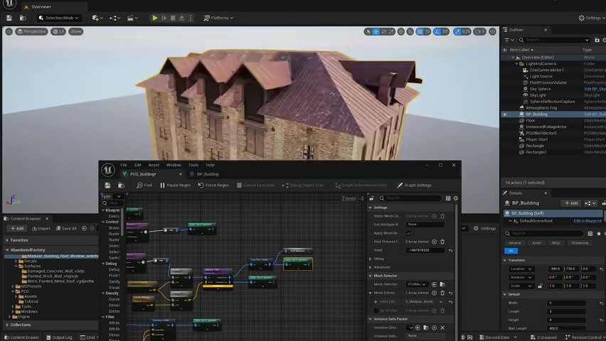
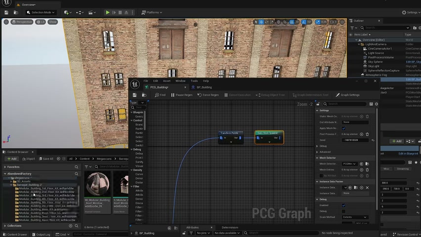

**参数、节点和风险点：**

- `Static Mesh`
- `Mesh`
- `Transform`
- `Point`
- `Actor`
- `Spawn`
- `Graph`
- `Material`
- `window`
- `floor`

### 调整 Decal 材质、Opacity、位置偏移和朝向，使贴花落在正确表面

**内容要点：**

- 本段加入 Decal/污渍细节：通过 Density Filter 和 Attribute Noise 控制哪些位置生成贴花。

**关键截图：**

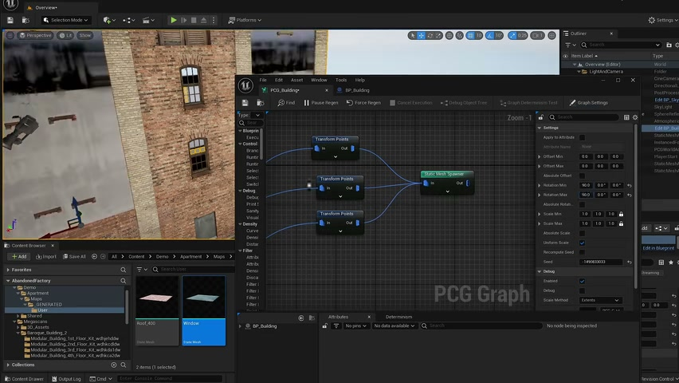
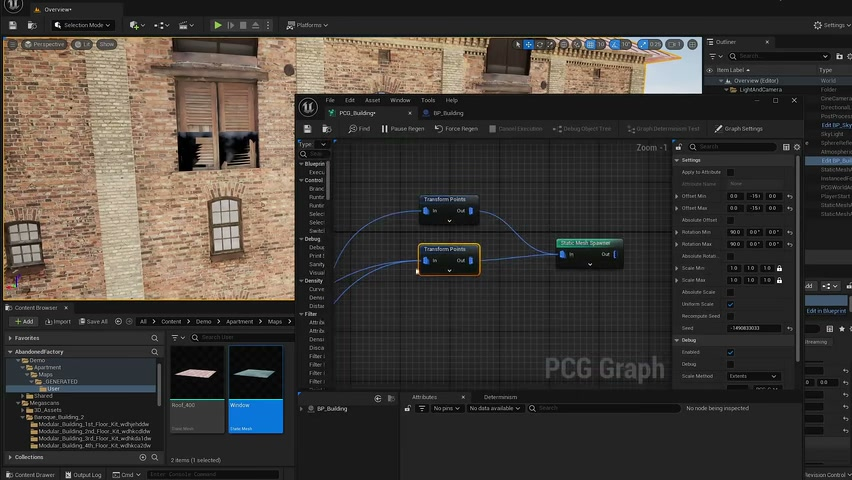

**参数、节点和风险点：**

- `Static Mesh`
- `Mesh`
- `Transform`
- `Point`
- `Spawn`
- `windows`
- `move`
- `them`
- `transform`
- `points`

### 合并屋顶、墙体、窗、门、Decal 各分支，检查所有模块之间的遮挡和重叠

**内容要点：**

- 本段调 Decal 材质和透明度：调整 Opacity、位置偏移和朝向，让 Decal 正确贴在墙面或屋顶表面。

**关键截图：**

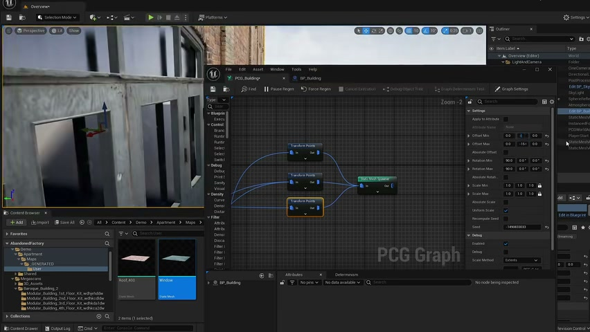
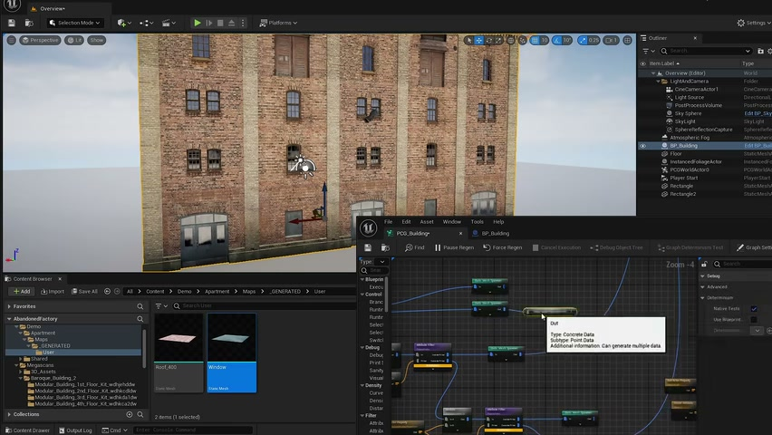

**参数、节点和风险点：**

- `Static Mesh`
- `Mesh`
- `Actor`
- `Spawn`
- `Graph`
- `Material`
- `decal`
- `windows`
- `actor`
- `door`

### 整理参数，把屋顶重复、窗重复、材质和 Decal 控制暴露为可调项

**内容要点：**

- 本段合并屋顶、门窗和 Decal 分支，检查模块遮挡、穿插和重复问题。

**关键截图：**

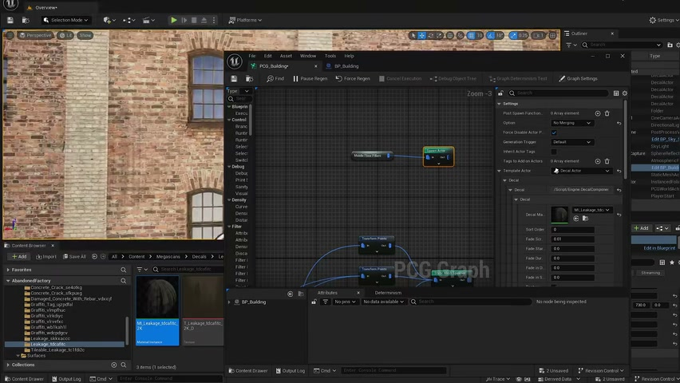
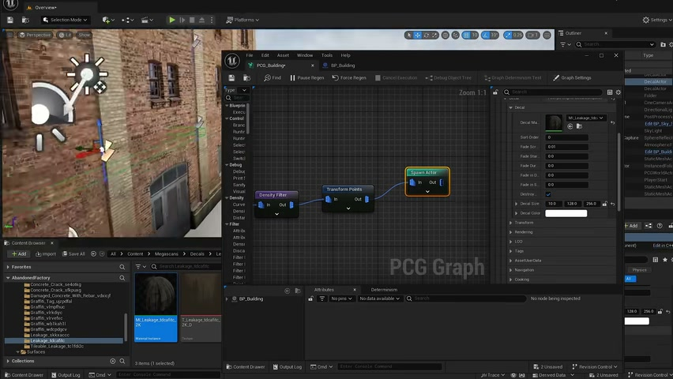

**参数、节点和风险点：**

- `Transform`
- `Point`
- `Attribute`
- `Actor`
- `Spawn`
- `Density`
- `Random`
- `decal`
- `actor`
- `transform`

### 在不同建筑尺寸上测试屋顶和窗的适配性，确保宽、长、高变化后仍然可用

**内容要点：**

- 本段把屋顶与窗相关参数整理为可调项，方便不同建筑尺寸复用。

**关键截图：**

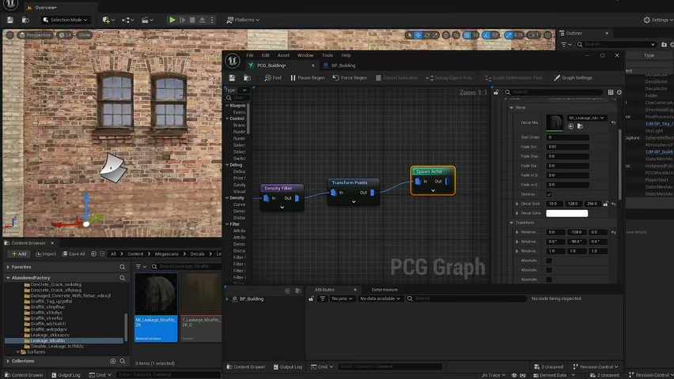
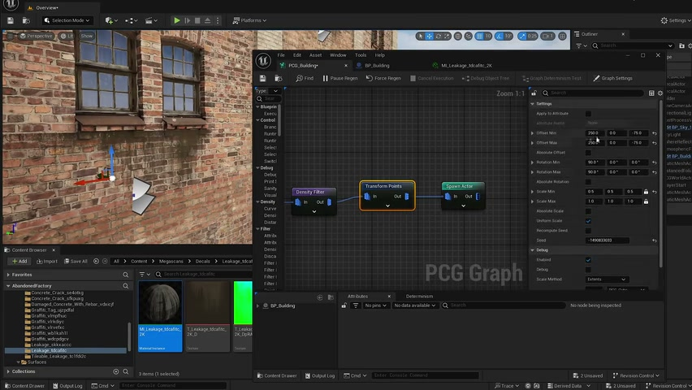

**参数、节点和风险点：**

- `Transform`
- `Point`
- `Spawn`
- `Density`
- `Material`
- `minus`
- `transform`
- `change`
- `properly`
- `placed`

### 完成整套建筑生成器收尾，确认从单层、多楼层到屋顶细节都能在 PCG 中稳定生成

**内容要点：**

- 本段在不同宽长高建筑上测试屋顶适配性，确认参数变化时屋顶仍能闭合。

**关键截图：**

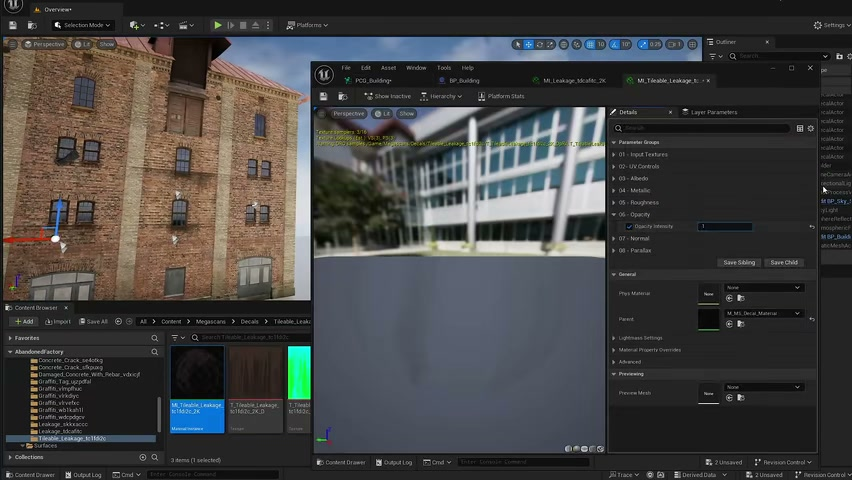
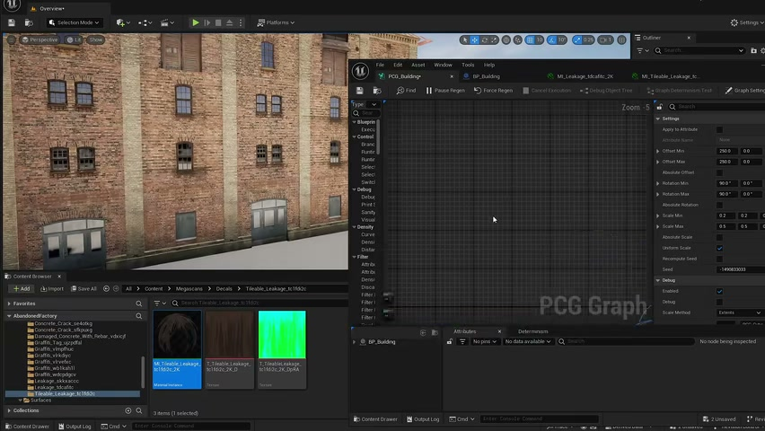

**参数、节点和风险点：**

- `Transform`
- `Point`
- `Attribute`
- `Actor`
- `Spawn`
- `Density`
- `Material`
- `point`
- `first`
- `decal`

### 记录后续可扩展方向：替换资产包、增加更多屋顶类型和更复杂立面规则

**内容要点：**

- 本段总结整套真实 PCG 建筑流程：从单层框架、多楼层、门窗到屋顶和 Decal 都已经能用 PCG 自动生成。

**关键截图：**

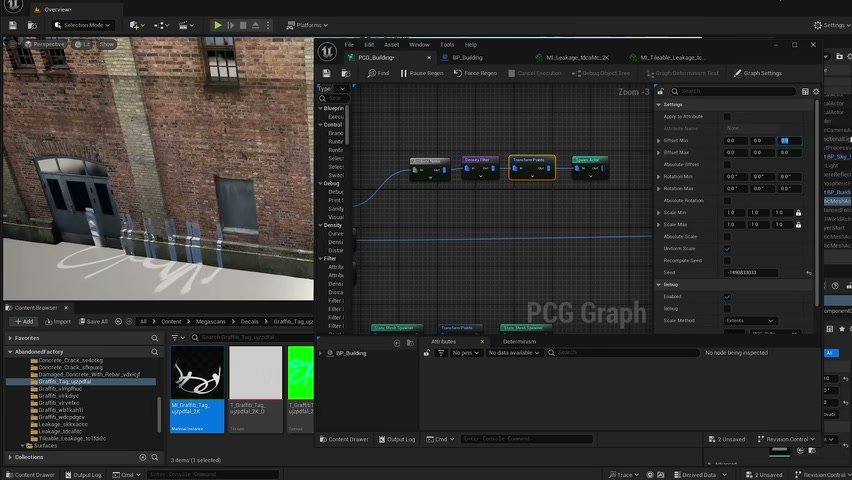
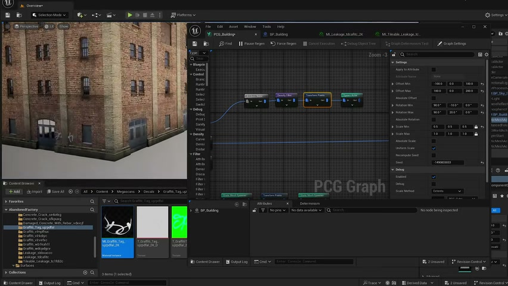

**参数、节点和风险点：**

- `PCG`
- `Blueprint`
- `Transform`
- `Point`
- `Density`
- `Random`
- `random`
- `size`
- `decal`
- `first`

## 复现检查清单

- Roof Points 必须来自最后一层点，而不是所有楼层点，否则屋顶会重复生成在每层。
- 屋顶 Mesh 的 Pivot 和尺寸要准确，重复偏移才不会错位。
- World Aligned Texture 可降低缩放导致的纹理拉伸，但材质节点要正确接入 World Position。
- 屋顶窗和普通屋顶件需要互斥过滤，否则同一位置会重叠。
- Decal 的密度、透明度和偏移要单独调试，避免贴花穿到门窗或屋顶背面。
- 最终要用不同建筑宽长高测试，因为屋顶逻辑最容易在边界尺寸下出错。
- 复现时先固定随机种子，再调整密度、过滤和生成资源，避免随机结果掩盖逻辑错误。
