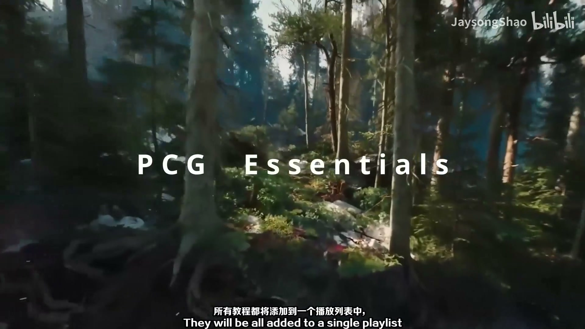
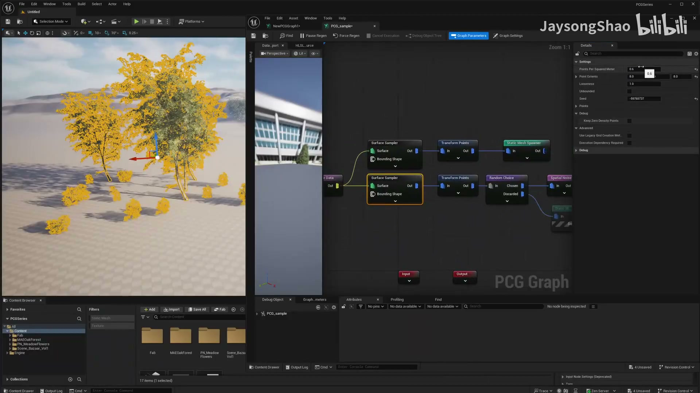

# 00 PCG基础课程

## 知识目标

- 围绕“00 PCG基础课程”整理 PCG 视频中的输入数据、图表规则、关键节点、参数风险和最终生成结果。
- 阅读时重点区分三层：输入来源（点、样条、表面、体积、Actor 或属性）、规则处理（采样、过滤、变换、分区、循环、HLSL 或子图）、输出方式（Static Mesh Spawner、Spawn Actor、Spline Mesh、Blueprint 或 Dynamic Mesh）。

## 可复现主流程

- 确认 PCG Graph/PCG Component 已绑定到正确 Actor，并先用 Debug/Inspect 查看中间点数据。
- 明确输入来源：Spline、Surface、Mesh、Volume、Actor、Data Asset/Data Table 或手工参数。
- 在图表中按顺序处理采样、属性写入、过滤、Transform、分区/循环和输出节点。
- 生成可见结果前，先核对 Point 的 Transform、Bounds、Density、Seed 和自定义 Attribute。
- 用 Static Mesh Spawner 输出大量网格实例；需要蓝图逻辑时改用 Spawn Actor 或 Blueprint 交互。
- 涉及运行时、World Partition、Hierarchical Generation 或 GPU 节点时，单独验证触发模式、缓存和性能。

## 关键术语

- `PCG`、`Procedural Content Generation`、`PCG Graph`、`Point`、`Bounds`、`Attribute`、`Static Mesh`、`Instanced Static Mesh`、`Runtime Generation`、`GPU`、`Plugin`、`图表`、`组件`、`点`、`生成`、`蓝图`、`网格`、`运行时`

## 分段知识

### 00:00:06-00:03:52 运行时生成、分区与性能

- 本段定位：运行时生成、分区与性能。
- 知识点：Gaea 输出高度图和遮罩贴图后，需要在 UE 中正确导入并绑定到 Landscape/材质层，PCG 再按图层信息控制地貌与植被。
- 知识点：Niagara 或组件输出应挂在筛选后的 PCG 点上，先核对点位置、随机偏移和实例数量，再接入 Niagara Component。
- 知识点：GPU PCG 节点能提升运行时生成吞吐，但 CPU/GPU 数据传输会形成边界，图表中要减少不必要的跨设备传递。
- 知识点：PCG 是运用规则和逻辑自动生成内容的程序化生成技术。
- 知识点：PCG 可通过实例化静态网格体降低大量重复网格的渲染成本。
- 知识点：PCG 生成的网格可交由实例化静态网格体组件管理，减少手动合并和实例化步骤。
- 知识点：PCG 可在支持的节点上使用 GPU 执行，适合点处理、运行时生成和静态网格生成等高并发任务。
- 知识点：启用 Procedural Content Generation Framework 插件后，项目才能创建和运行 PCG Graph。
- 复现要点：先用 Debug/Inspect 核对点数量、Bounds、Density 和关键属性，再判断最终生成结果。
- 复现要点：属性命名要稳定，过滤、分区和分支节点应保留可检查的中间数据，避免后续规则难以追踪。
- 复现要点：运行时、分区或 GPU 生成需要单独验证缓存、触发时机、平台支持和性能预算。
- 核对对象：`PCG`、`GPU`、`图表`、`组件`、`点`、`分区`、`生成`、`蓝图`、`网格`、`运行时`。

**关键画面：**

## 复现检查

- 每个图表先检查输入数据是否正确进入 PCG Graph，再看下游生成结果。
- Debug/Inspect 时重点看点数量、Bounds、Density、Transform、Seed 和自定义 Attribute。
- Static Mesh Spawner、Spawn Actor、Spline Mesh 和 Blueprint 输出节点不能混用语义；选择前先确定是否需要实例化性能或蓝图逻辑。
- 涉及样条、分区、运行时或 GPU 生成时，必须额外验证更新触发、缓存、世界分区和性能预算。
