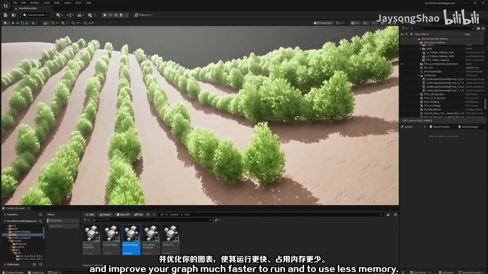
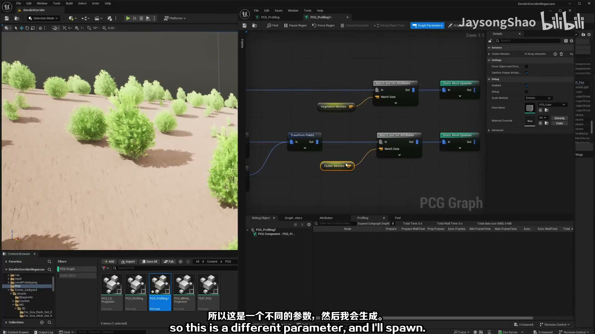
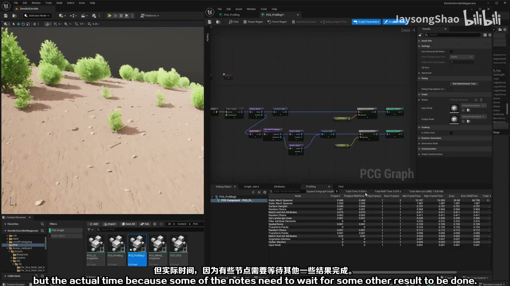
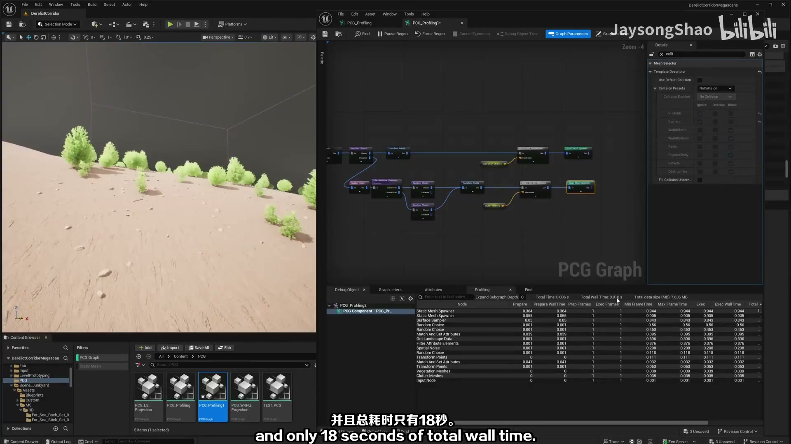
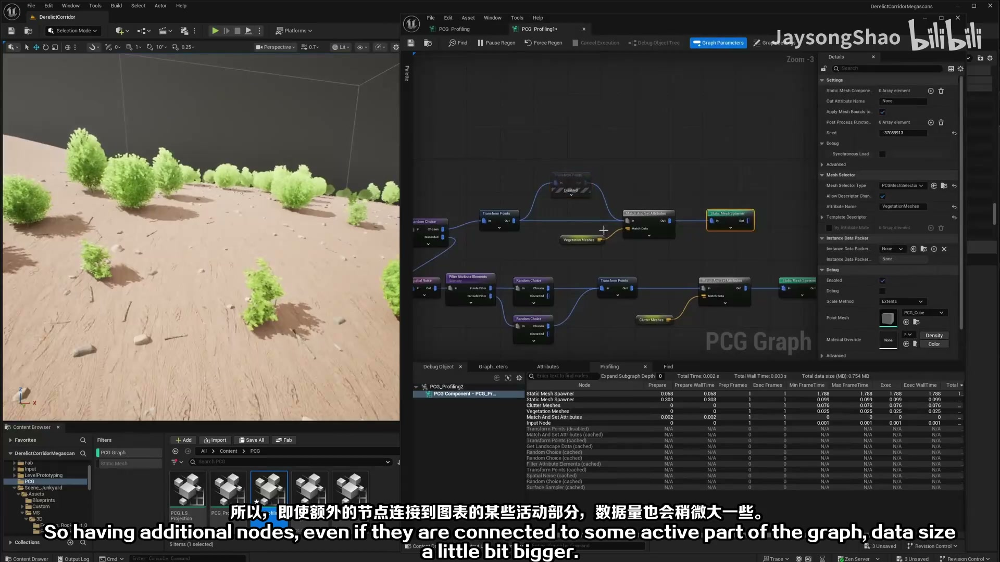
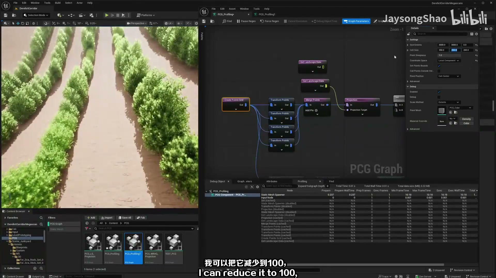
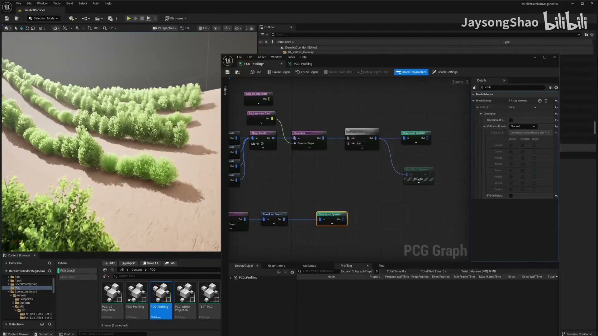
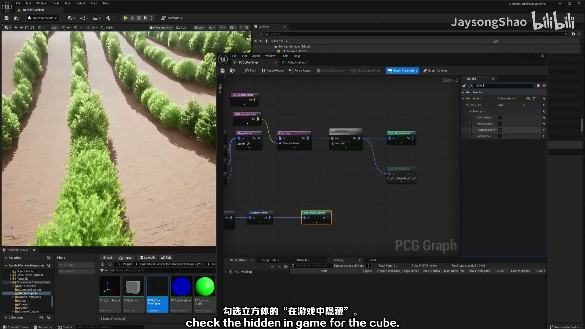
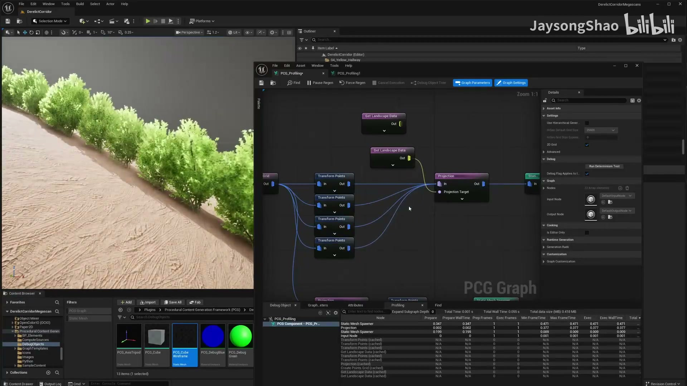
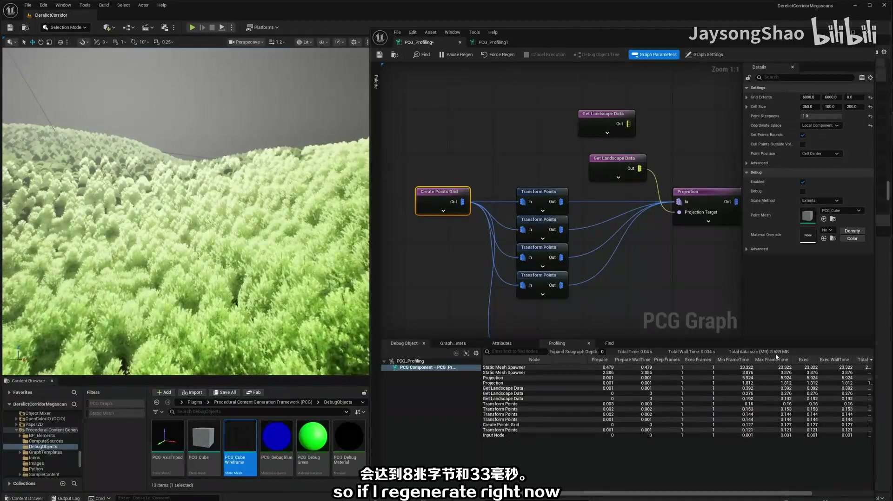

# 10-OptimizePCG工作流程–在虚幻引擎中的性能分析与调试

## 知识目标

- 本文整理“10-OptimizePCG工作流程–在虚幻引擎中的性能分析与调试”的 PCG 实操流程、关键节点、参数组织方式和复现风险点。

## 可复现主流程

- 先明确本集在 PCG 基础课中的位置：输入数据是什么、点数据如何产生、属性如何流转、最终由哪个生成节点或蓝图消费。
- 把 PCG 数据集、Point、Bounds、Debug/Inspect 的关系讲清楚：先看点和边界，再判断后续过滤或生成是否拿到了正确数据。
- 复现时每连接一个节点都先打开调试或检查输出点数，避免在末端 Spawner 才发现输入为空。

## 关键术语

- `PCG`
- `Blueprint`
- `Static Mesh`
- `Mesh`
- `SubGraph`
- `Transform`
- `Point`
- `Attribute`
- `Actor`
- `Component`
- `Spawn`
- `Grid`
- `Bounds`
- `Density`
- `Random`
- `Seed`
- `Graph`
- `Material`

## 操作步骤与要点

### 先明确本集在 PCG 基础课中的位置：输入数据是什么、点数据如何产生、属性如何流转、最终由哪个生成节点或蓝图消费

**内容要点：**

- 先明确本集在 PCG 基础课中的位置：输入数据是什么、点数据如何产生、属性如何流转、最终由哪个生成节点或蓝图消费。

**关键截图：**

**参数、节点和风险点：**

- `PCG`
- `网格`
- `实例`
- `采样`
- `参数`
- `节点`
- `程序化`
- `生成`
- `DerelictCorridor`
- `DerelictCorridorMegascans`

### 先明确本集在 PCG 基础课中的位置：输入数据是什么、点数据如何产生、属性如何流转、最终由哪个生成节点或蓝图消费（2）

**内容要点：**

- 先明确本集在 PCG 基础课中的位置：输入数据是什么、点数据如何产生、属性如何流转、最终由哪个生成节点或蓝图消费（2）。

**关键截图：**

**参数、节点和风险点：**

- `PCG`
- `Graph`
- `网格`
- `属性`
- `节点`
- `生成`
- `Asset`
- `Regen`
- `DerelictCorridorMegascans`
- `DerelictCorridor`

### 节点、参数和生成结果校验 03

**内容要点：**

- 节点、参数和生成结果校验 03。

**关键截图：**

**参数、节点和风险点：**

- `PCG`
- `Graph`
- `网格`
- `节点`
- `生成`
- `Regen`
- `DerelictCorridorMegascans`
- `DerelictCorridor`
- `Selection`
- `Mode`

### 把 PCG 数据集、Point、Bounds、Debug/Inspect 的关系讲清楚：先看点和边界，再判断后续过滤或生成是否拿到了正确数据

**内容要点：**

- 把 PCG 数据集、Point、Bounds、Debug/Inspect 的关系讲清楚：先看点和边界，再判断后续过滤或生成是否拿到了正确数据。

**关键截图：**

**参数、节点和风险点：**

- `PCG`
- `网格`
- `属性`
- `节点`
- `生成`
- `DerelictCorridor`
- `block`
- `DerelictCorridorMegascans`
- `Selection`

### 复现时每连接一个节点都先打开调试或检查输出点数，避免在末端 Spawner 才发现输入为空

**内容要点：**

- 复现时每连接一个节点都先打开调试或检查输出点数，避免在末端 Spawner 才发现输入为空。

**关键截图：**

**参数、节点和风险点：**

- `PCG`
- `网格`
- `节点`
- `生成`
- `DerelictCorridor`
- `Regen`
- `DerelictCorridorMegascans`
- `Selection`
- `Mode`

## 复现检查清单

- 每个示例都要先确认输入点、Bounds、属性和 Debug 结果，再判断生成节点是否有问题。
- 涉及运行时、分区、HLSL 或 Geometry Script 的内容，要记录 UE 版本、插件和执行环境限制。
- 复现时先固定随机种子，再调整密度、过滤和生成资源，避免随机结果掩盖逻辑错误。
