# 使用枚举器管理 PCG 的 Actor 标签

- 来源: https://dev.epicgames.com/community/learning/tutorials/WDBK/unreal-engine-managing-actor-tags-for-pcg-with-enumerators

## PCG 框架中的 Actor 标签

PCG 框架中的演员标签

通常，Actor 标签是以下类型的变量 名称 ，但在 PCG 上下文中，Actor Tag 以两种形式运行，默认行为将其转换为 布尔值 ：

Actor 标签字符串值成为属性 姓名

值为 真 或 错误的 取决于标签是否已分配给 Actor。

自 UE 5.4 起，我们也可以将标签作为字符串传递给 PCG，格式如下： AttributeName : AttributeValue 。值得一提的是，如果您为多个标签分配相同的“名称”，例如： 类型：网格 和 类型 ： 视觉特效 只有标签列表中的最后一个标签才会被 PCG 接受为有效属性。

请看下面的例子：

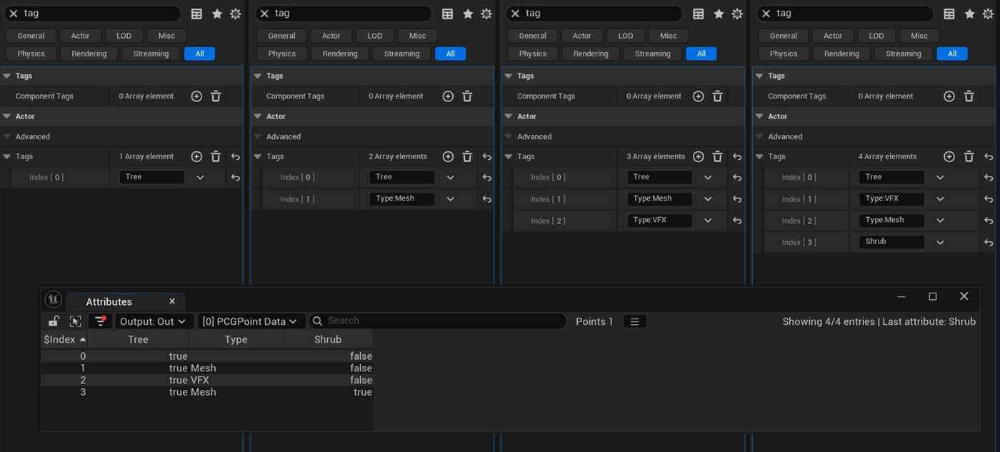

在处理 PCG 逻辑时，尤其是在使用关卡实例和 PCG 数据资产时，通过角色标签筛选 PCG 数据非常有用。比较标签时，字符串必须完全匹配，因此一致性至关重要。然而，管理角色标签本身是一项手动任务，因此可能比较繁琐且容易出错。

你可能会想，有没有更系统的方法来解决这个问题。

考虑 枚举器 。

在定义标签列表时， 结构体、数据表 或 数据资产 可能是您的首选，而且根据项目需求，这可能是最合适的方法，尤其是在需要额外元数据的情况下。然而，我认为枚举器的 强类型 特性在这里反而对我们有利。在单个资产中定义标签可以简化操作，并使其在编辑器中的多个域中得到很好的控制，最终形成一个统一的“真理源”。

## 枚举器：创建 Actor 标签列表

枚举器 - 创建 Actor 标签列表

首先，创建一个新的 BP 枚举并定义一系列标签：

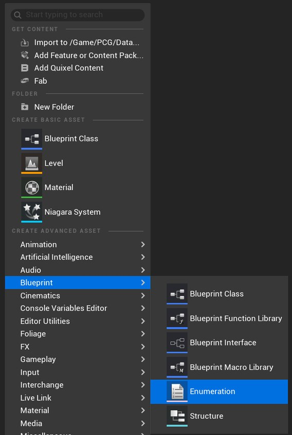

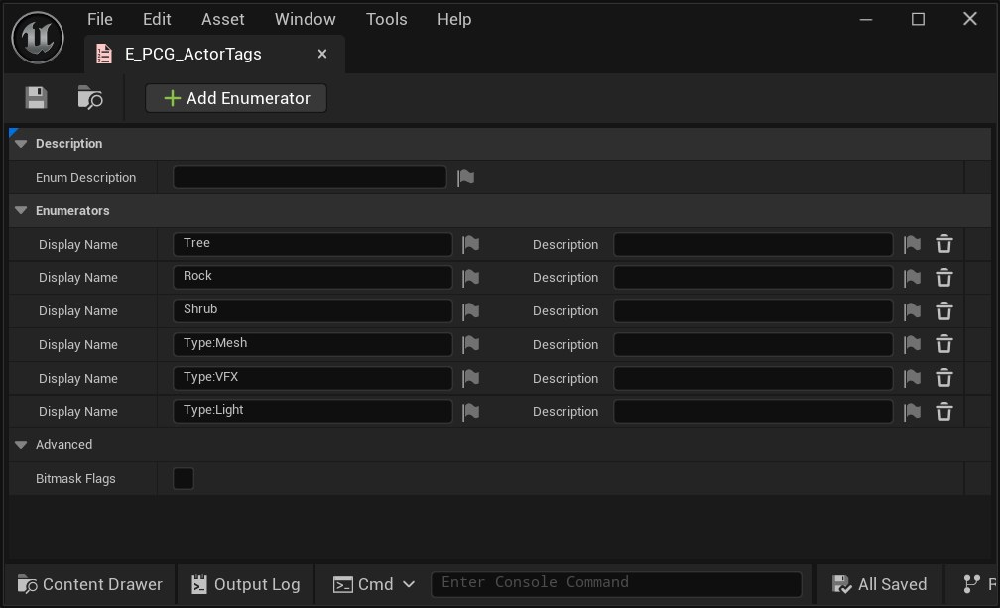

从本质上讲，枚举只是一个包含 字符串的整数 列表 ， 我们不能直接将其用作标签。我们也不想手动处理它，所以我们需要从枚举中提取字符串数据，并使用一个简单的工具将其分配给 Actor 标签。

## 编辑器实用控件：分配 Actor 标签

编辑器实用小部件 - 分配演员标签

创建一个新的编辑器实用工具小部件：

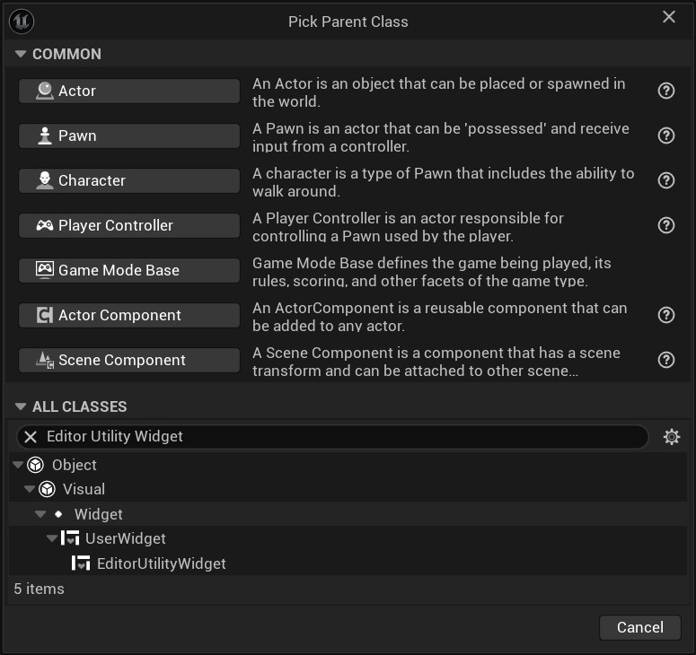

我们的基本用户界面只需要一个按钮和一个用于显示带标签复选框列表的垂直框：

在 onConstruct 函数中， 我们从枚举器获取所有标签，并用复选框和文本填充垂直框。我们还将所有复选框收集到一个数组中，以便稍后使用：

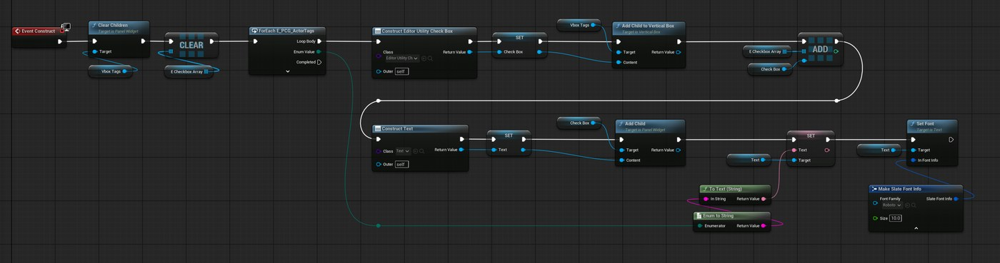

OnButtonClick 事件触发时 ，我们遍历所有选定的角色，获取现有角色的标签，然后遍历所有复选框。如果选中了复选框，则执行后续操作。 已选中 我们从枚举中获取标签字符串，根据索引值检查标签是否已分配给 Actor，如果没有，则添加标签数组并将其设置为 Actor。

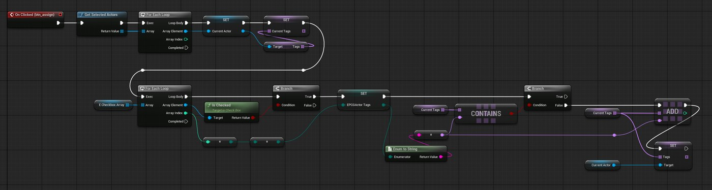

你还可以进一步简化它：

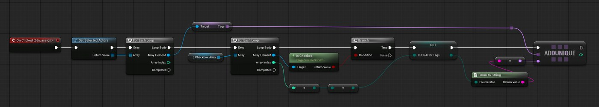

以下是为已拥有标签的角色分配选定标签的结果：

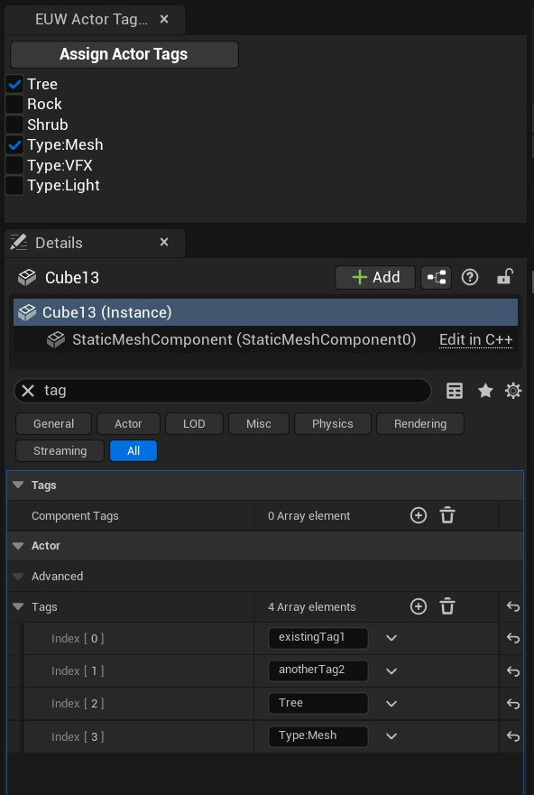

当然，这部分内容可以扩展添加更多功能，但构建 EUW 并非本教程的重点。如果您想深入了解， Electric Dreams 示例项目提供了一个类似的工具，可以实现一些很棒的功能，请查看 EUW_ActorTagger：

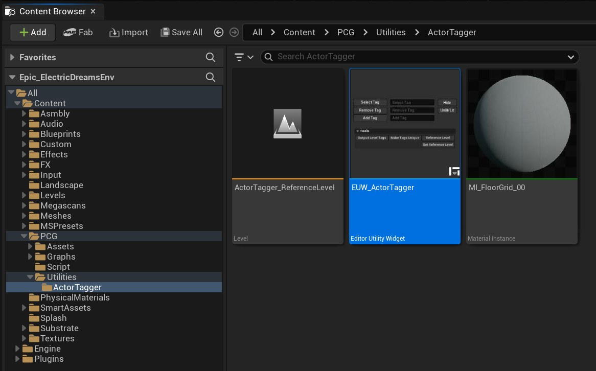

## 枚举器作为 PCG 属性

枚举器通常用作开关或选择器，无论是在 C++ 还是蓝图环境中。在 PCG 中，我们也可以以类似的方式使用枚举，但虽然它有助于定义特定的逻辑流程，却不一定能帮助我们以直接的方式检索 Actor 标签。请参见下文：

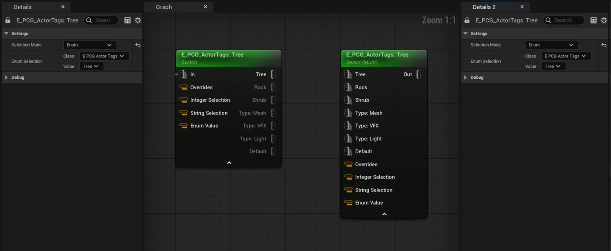

现在，假设我们有一个 PCG 数据资产 （引用 关卡实例 中的内容），其中包含许多对象，我们希望根据 Actor 标签对其进行筛选。通常，您只需输入 Actor 标签或使用自定义参数作为属性即可。在本例中，该参数基于 E PCG Actor Tags 枚举器：

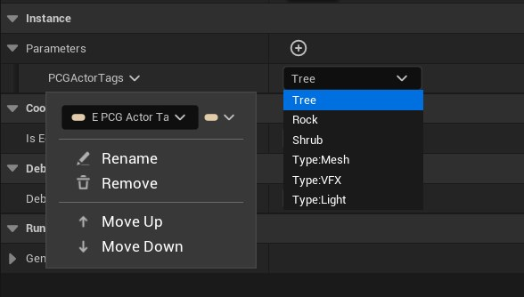

检查参数引用后，我们会收到一个基于枚举选择的 整数 属性值； PCG Actor Tags。 树 返回 0， 岩石 返回 1 ， 灌木 返回 2 ，依此类推。这符合预期，但对我们毫无用处：

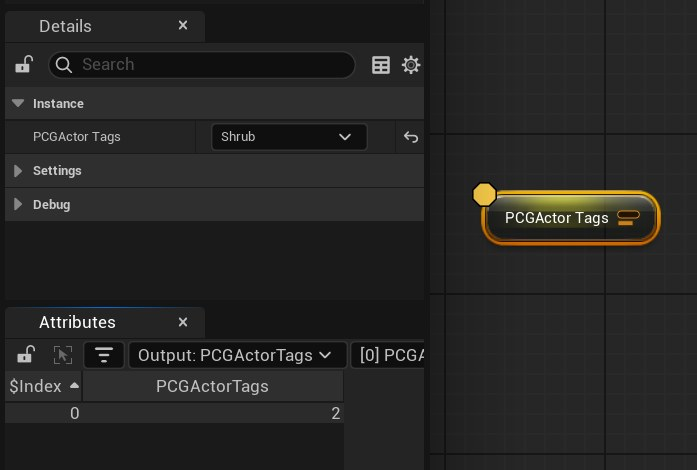

我们希望看到的是一个名为 “树 /岩石/灌木 ”等的属性，其值为 布尔 值；或者一个名为“类型”的属性， 其值为 特定的 字符串 值，例如 “网格” 或 “视觉特效” 等。我们需要使用自定义的 PCG 蓝图来重新排列这些属性。

## PCG Blueprint：将枚举转换为属性

PCG Blueprint - 将枚举转换为属性

## 公开属性值

创建新的 PCG 蓝图元素资源：

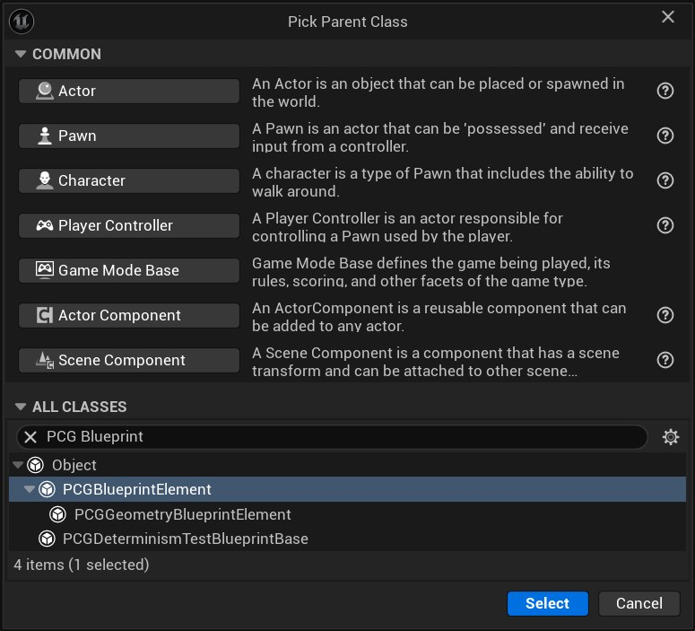

我们在这里的工作相当简单：

重写 Execute 函数，不带上下文

创建类型为 的新变量 E_PCG_ActorTags 让它可编辑，我们暂且这么称呼它 枚举 Actor 标签

创建类型为 的新变量 布尔值 让它 可编辑，我们暂且这么称呼它 默认值 并将其设置为 true。（这意味着公开的 Actor Tag 属性的默认值将设置为 true）

关闭默认引脚并创建自定义输出引脚类型 属性集 就叫它 属性

是否覆盖节点颜色、标题等其他属性或函数，取决于项目需要。

是否要覆盖其他属性/函数，例如节点颜色、标题等，由您决定。

你可能想 接触图书馆 在“类默认设置”中创建新的业务伙伴 (BP) 并指定类别。

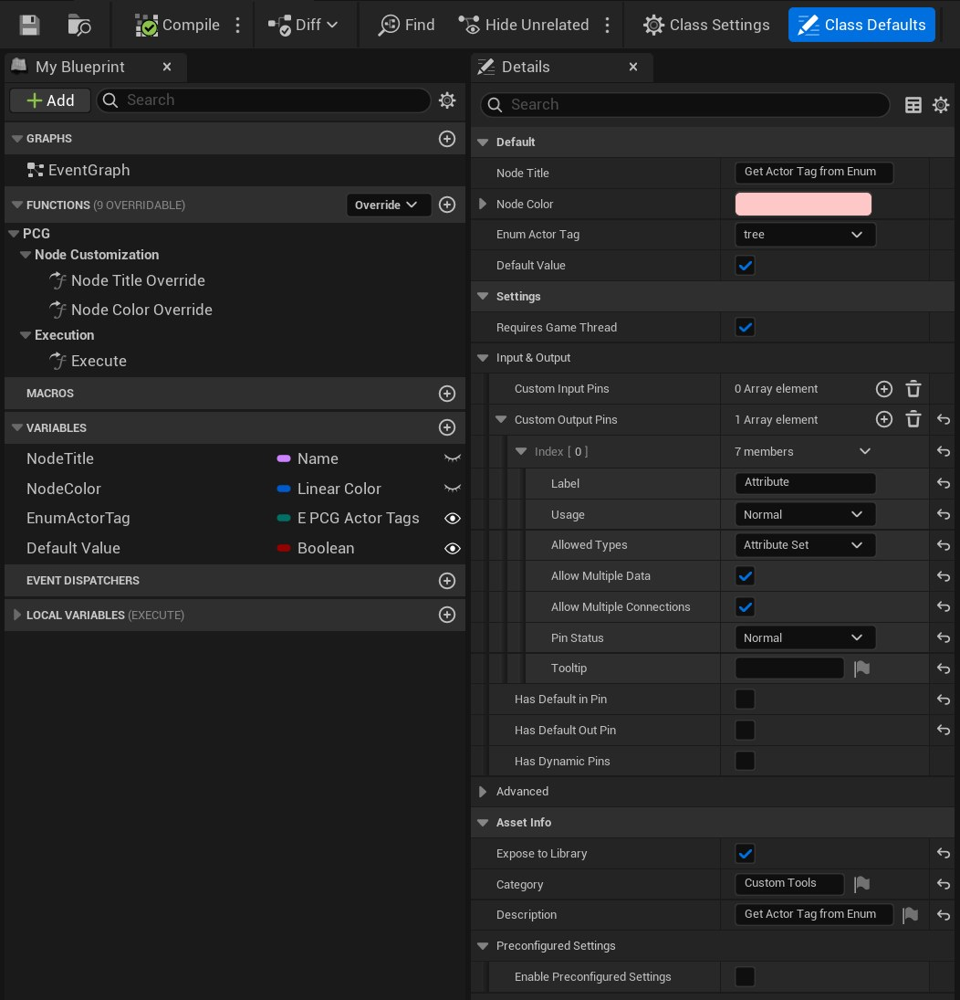

在 Execute 函数中执行以下操作：

构造类的对象： PCG 属性集 并将其暴露给一个局部变量，我们将在函数末尾使用它。

获取 PCG 属性集 元数据 同时，我们也使用它来创建和设置新的属性。

从……获取字符串 枚举 Actor 标签 并将其暴露给另一个局部变量。稍后情况会变得更复杂一些，所以最好事先准备好这个变量。

创建一个字符串属性，添加条目并为其赋值。该属性的名称是枚举中的字符串值，属性的值是…… 默认值 多变的

接下来，绑定 PCG 属性集、数据集合以及对应的输出引脚标签。在本例中，该引脚名为 Attribute。Tags Array 可以留空，Data Collection 可以从默认 Return 节点暴露出来。

标签数组 可以留空。 数据收集 可以从默认的返回节点暴露出来。

最后，返回 数据收集

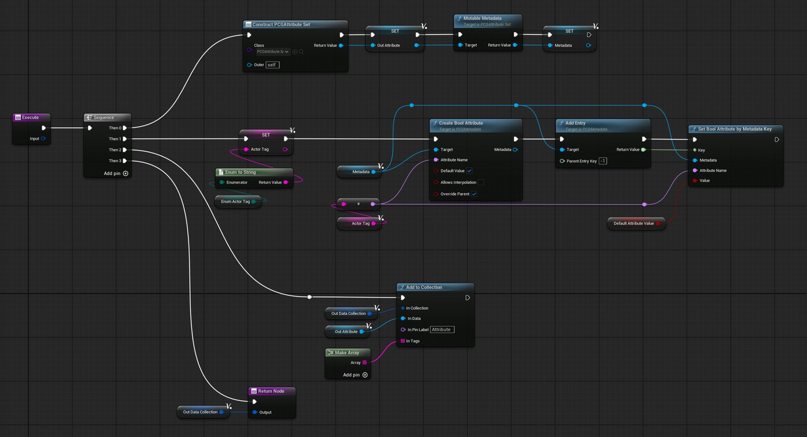

如果您想使用 冒号 “:”运算符并将标签输出为字符串属性，我们需要扩展字符串解析部分。具体来说：首先，当标签包含 冒号 时，我们会进行分支处理；然后，我们会根据该符号拆分 Actor 标签字符串，去除空格，并将其赋值给名为 Actor 标签类型 和 Actor 标签子类型的 变量。

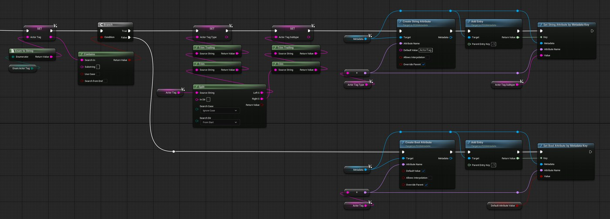

以下是 PCG 图上下文中的 BP：

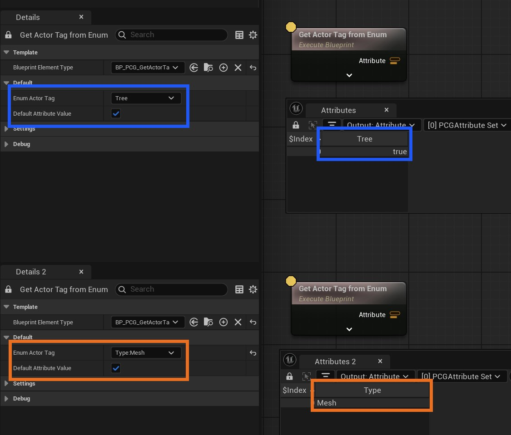

Nice! 好的！

但这里有个小问题……

## 公开属性名称

有些节点会根据属性 值 过滤数据，有些节点会根据属性 名称 过滤数据，有时我们可能需要同时使用两者。从技术上讲，获取属性名称最简单的方法是使用 “获取属性列表” 节点，但由于我们已经在业务流程图中拥有这些数据，因此我们可以将其作为单独的节点输出，从而保持代码的简洁清晰。

为此，我们只需要重复之前的一些步骤：

再添加一个 输出引脚 ， 类型 属性集 ，名称 属性名称

构建另一个 PCG 属性集 变量及其关联变量 元数据 参考

创建另一个字符串属性，名为 属性

添加新创建 PCG 属性集 到 外部数据收集 带有正确的标签， 属性名称

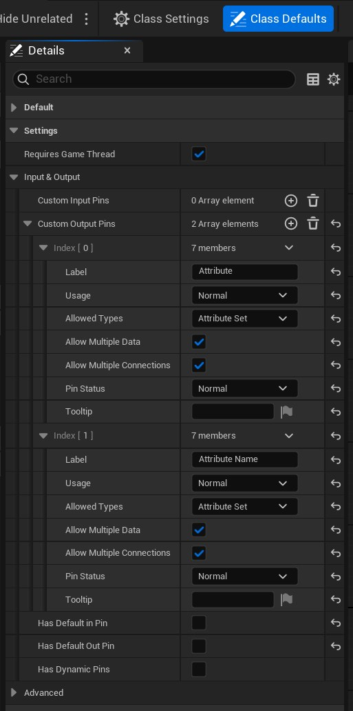

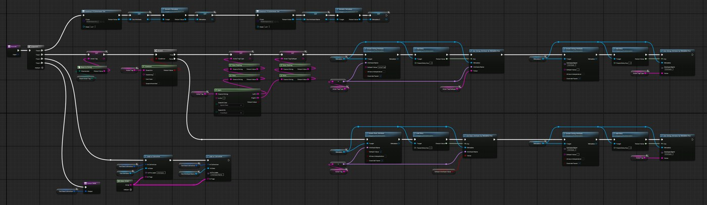

Result: 结果：

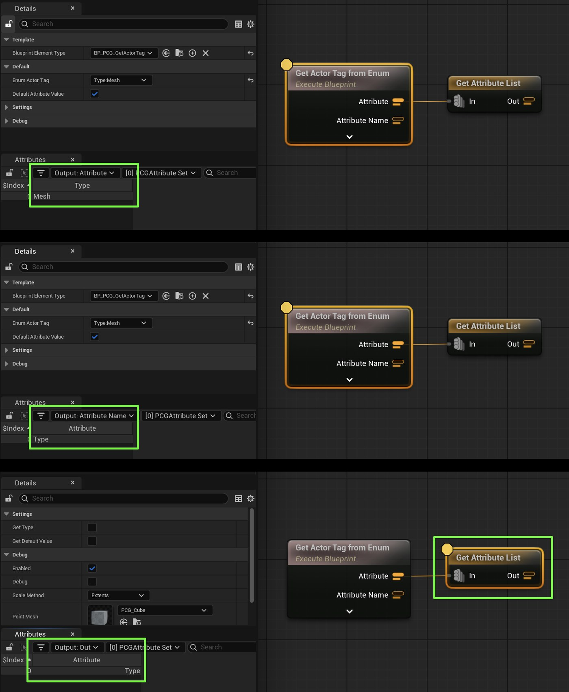

Great! 伟大的！

But we can do better :)

但我们可以做得更好 :)

## 将参数显示到节点标题

将参数暴露给节点标题

拥有一个典型的枚举下拉菜单固然方便，但我们仅凭图表无法得知用户选择了哪些选项，这与“方便”背道而驰。既然我们可以将数据暴露给节点标题，那就让我们重写该函数，使这些信息可见。我们只需复制之前的一些字符串解析代码，对其进行格式化，然后将其作为节点标题返回即可：

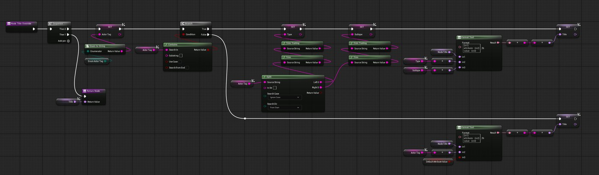

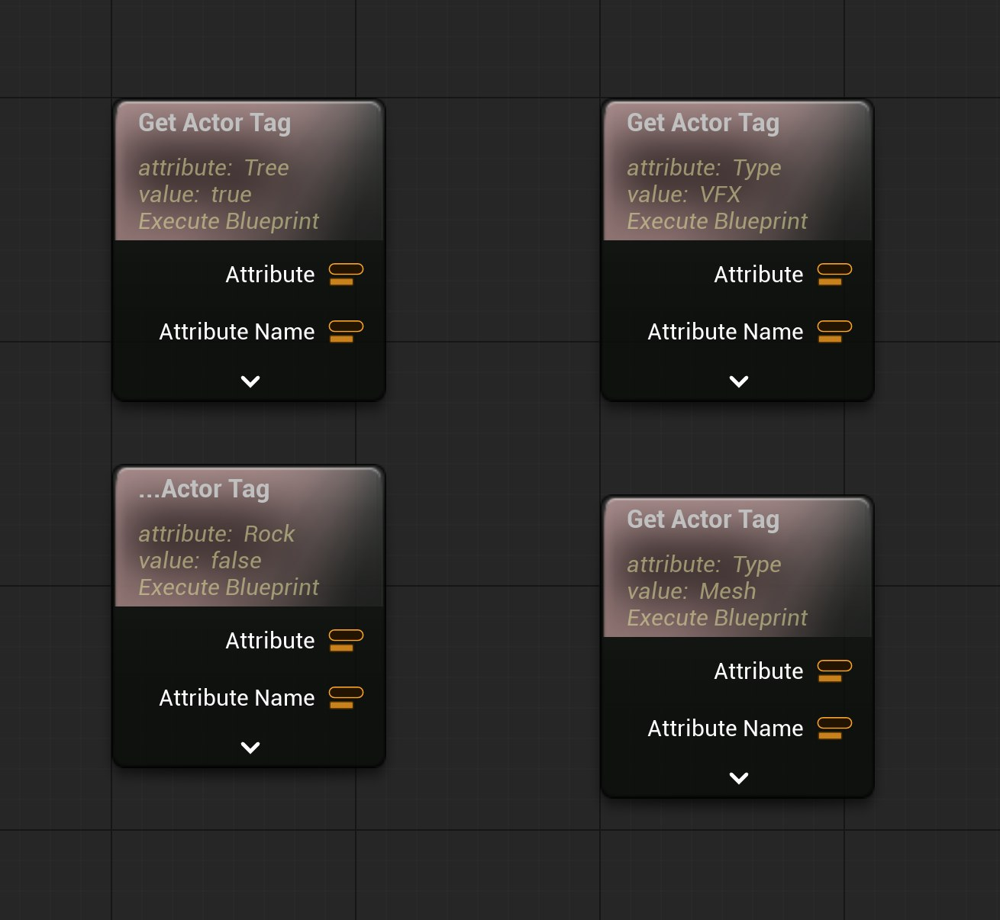

请注意，这里可能存在一个 PCG 的 bug，当字符串过长时，主标题的显示可能会出现一些问题。如果有人知道解决方法，请告诉我 :)

## 实际案例

最后，我们快速看一下如何使用这个 BP 节点。

## Actor 选择标签

最基本的使用场景之一是将公开的 Actor 标签用作 Actor 选择标签的输入：

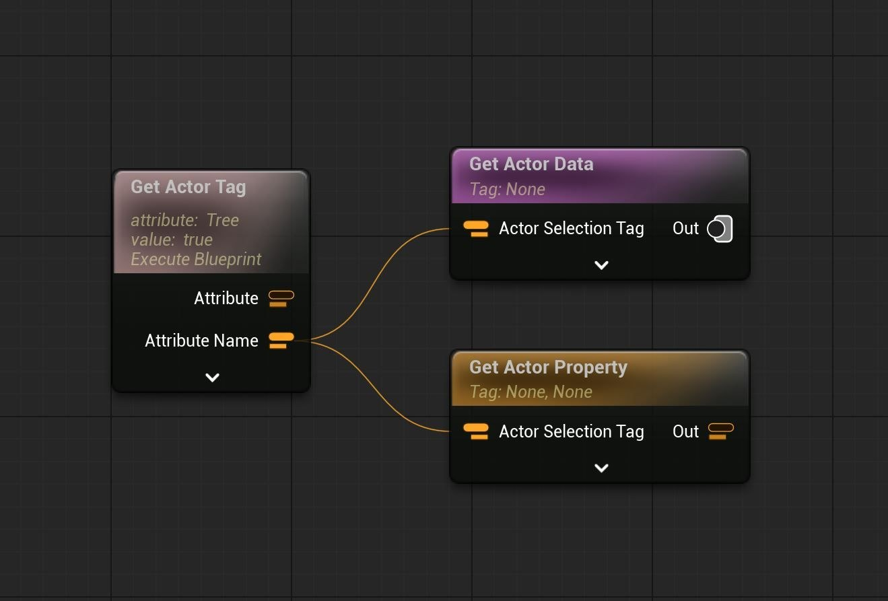

请注意，此示例不适用于“冒号”变体，因为它会将字符串拆分为两个单独的字符串值。要使其正常工作，您可能需要返回 PCG 蓝图并添加另一个输出点，该输出点返回未更改的字符串，包括“:”符号。

## 属性分区

假设您有一批来自 PCG 数据资产的资产，您可能需要将其拆分为子集并遍历这些子集。这里我们使用按属性名称进行分区，在本例中，属性名称为 “类型” 字符串，因为我们选择了 “类型：网格” 标签。

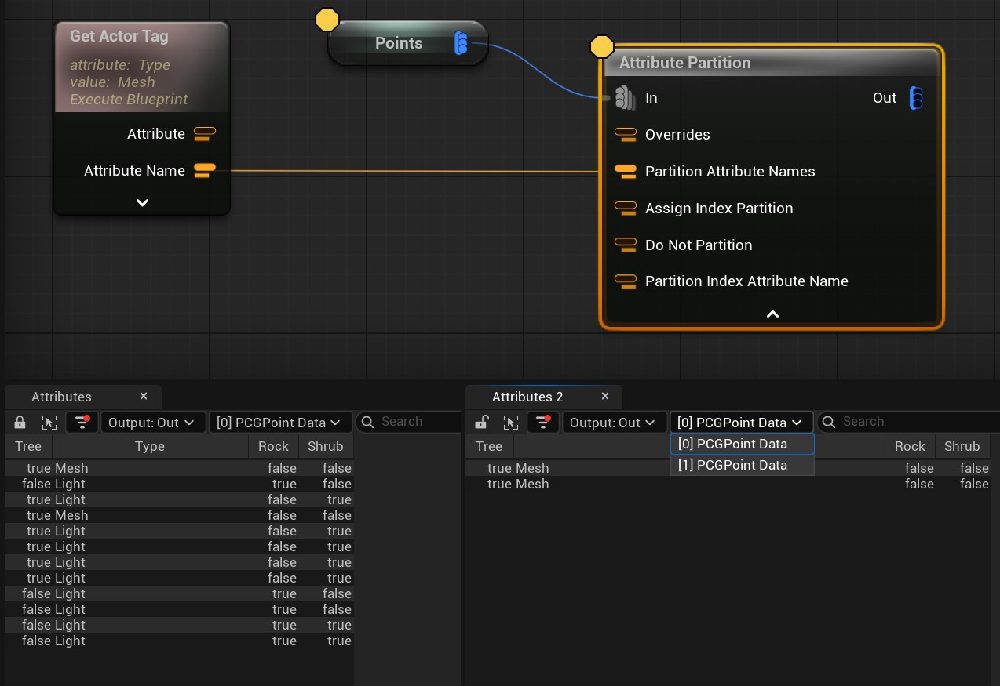

## 属性过滤器

过滤是指我们需要同时考虑这两个参数的情况：

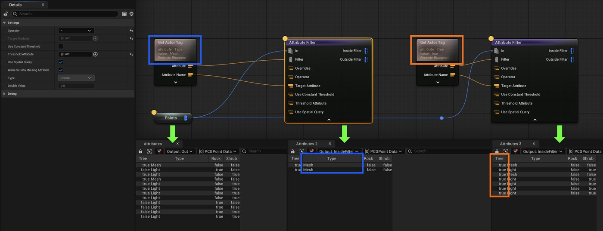

## 结语和延伸阅读

在您的项目专业环境中，您很可能已经拥有一个更完善、更复杂的系统来管理 Actor 标签。然而，这里提出的想法仍然有效，或许能以某种方式对您有所帮助。

如有任何疑问，请在评论区留言。

如果你对这些内容感兴趣，我强烈建议你看看 Arran Langmead 在这里展示的一些资料：

利用程序化工具支持艺术家 | 2024 年虚幻引擎节

……以及 Julien 和 Jean-Sebastian 对卡西尼采样项目的分析：
