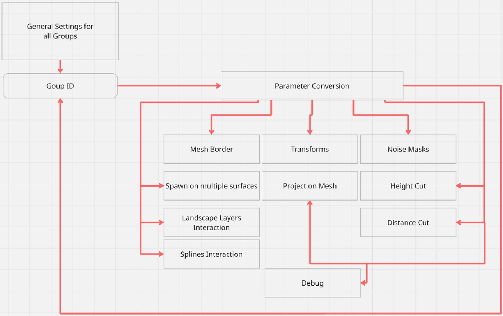
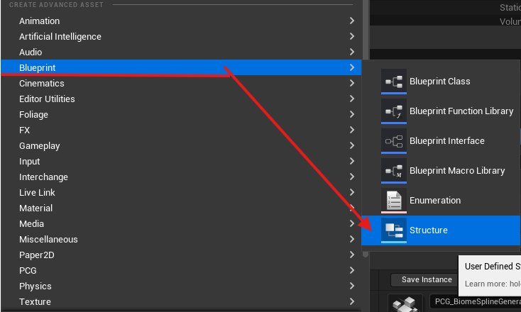
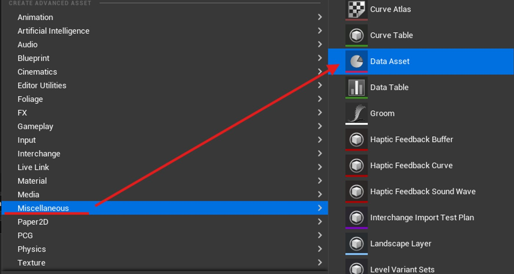
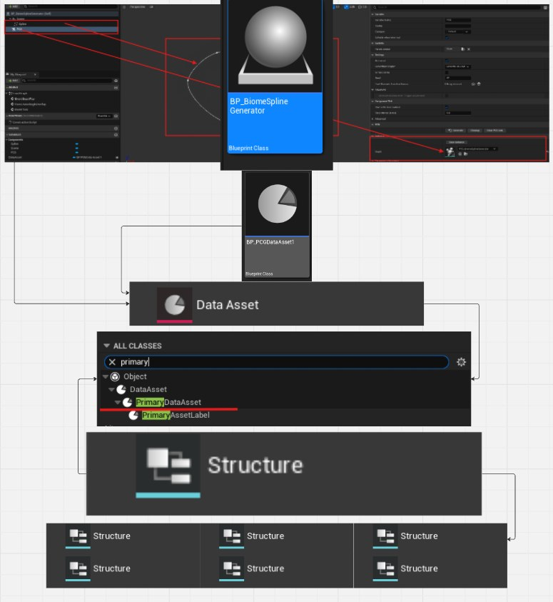
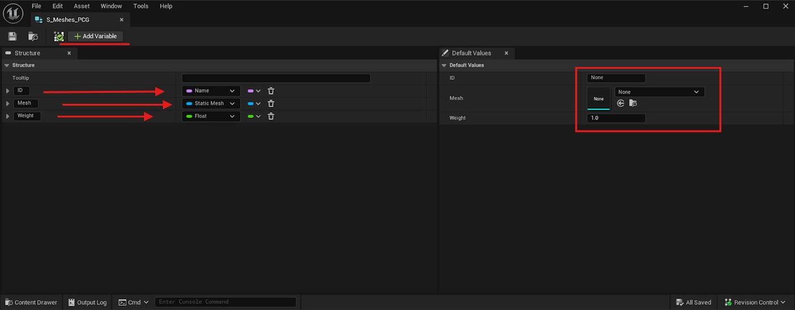
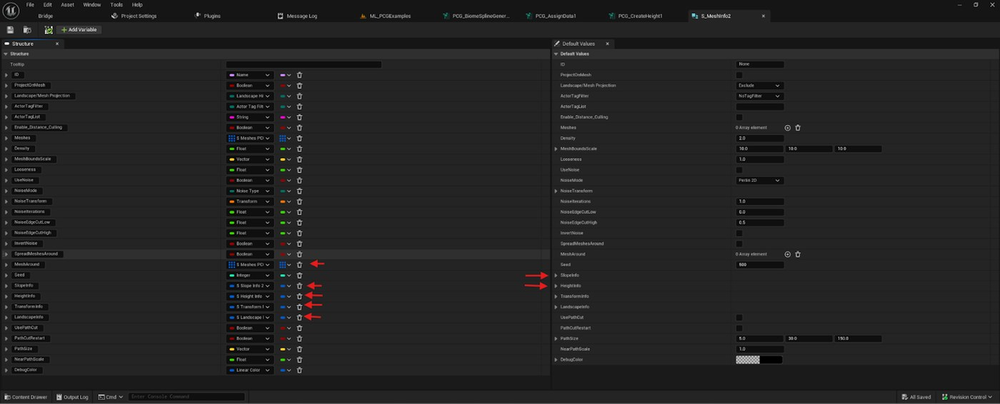
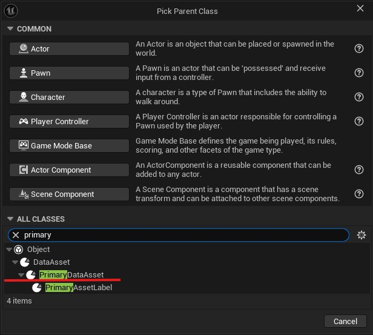
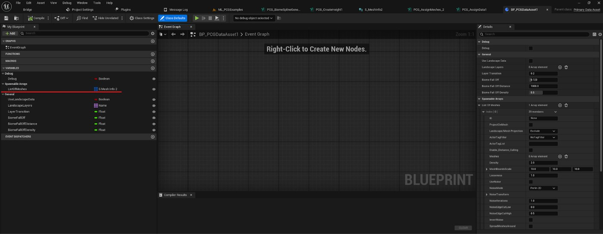
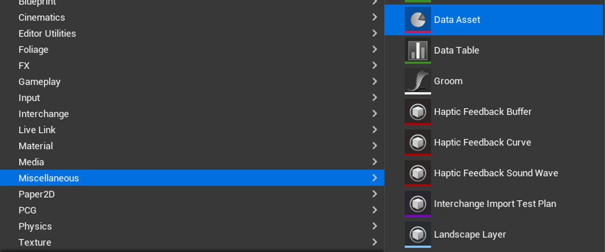
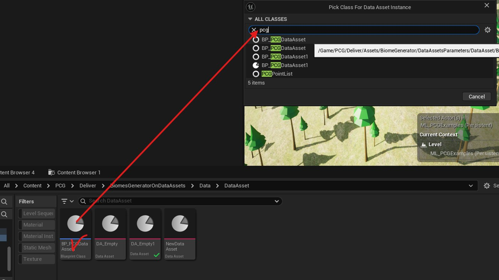

# 在虚幻引擎中构建 PCG 生物群落生成器：分步工作流程（第一部分）

- 来源: https://dev.epicgames.com/community/learning/tutorials/9lxy/building-a-pcg-biome-generator-in-unreal-engine-a-step-by-step-workflow-part-1

## 介绍

虚幻引擎中的程序化内容生成 (PCG) 将世界构建转变为数据驱动的过程。PCG_BiomeGenerator 通过基于循环的框架扩展了这种方法，用于创建可适应不同角色类型、网格变化和地形条件的生物群落。

通过连接结构体、数据资产和 PCG 图逻辑，该系统实现了模块化和可控的环境生成。诸如坡度密度、噪声和对象分布等参数可以直接在图中进行调整，从而获得精确的结果。

本文涵盖了从数据设置和蓝图配置到图形逻辑、调试和优化的完整工作流程，以帮助您在虚幻引擎中构建一个可用于生产的生物群落生成系统。

## 结构

生物群落生成器采用基于循环的架构，因此可以扩展到多种类型的角色。您可以创建角色、配置它们并将它们捆绑到组中，然后在同一个蓝图中组装多个组。从概念上讲，该蓝图具有影响所有角色的全局控件（生物群落边界、边界宽度、密度）以及每个组的各个图层，每个图层都由一个 ID 引用，其中每个 ID 都公开其自身的参数以实现更精细的控制。

## 蓝图创建过程

让我们从头到尾一步步完成生物群系生成器蓝图的构建。我们将从几个自定义模块开始作为示例，一旦你理解了核心循环原理，使用其他模块扩展系统就会变得非常简单。

所有核心逻辑都包含在蓝图中，而可调参数则存储在数据资产中。在组装所有组件之前，我们将准备好必要的组件并定义它们之间的交互方式。

结构体用于创建有序的变量集，这些变量集随后会被转换为公开的参数。

数据资产 存储和管理结构中定义的参数，允许在不更改蓝图本身的情况下轻松修改这些参数。

## 视觉层级

所有组件都可以表示为垂直层级结构。最顶层是最终蓝图，它包含样条曲线、数据资产槽和全局参数。数据资产蓝图充当桥梁，连接各个结构并将其参数传递给数据资产。每个结构都拥有自己的一组参数，并且可以嵌套其他结构以将相关设置分组在一起。

生物群落蓝图（BP）将作为生成器的基础。

## 结构

首先创建一组结构，用于定义系统的核心数据框架和参数。

第一个结构体名为 S_Meshes_PCG （遵循我们的内部命名约定），定义了网格选择、权重和 ID 所需的参数。

要添加变量，请单击 “添加变量” 。每个变量都可以分配一个类型，例如 浮点数、布尔值、名称 等，其他类型可从下拉菜单中选择。在第二个“结构”选项卡中，您可以定义将自动应用的默认值。

在这个例子中，该设置需要六个过滤器：

网格选择

地形交互

高度截断

陡坡的正常截止值

变换设置

一个组合过滤器，它封装了之前的过滤器，并管理其各自组之外的参数。

由于筛选器可以包含其他筛选器，因此第六个筛选器充当父结构，将其他筛选器分组在一起。包含子结构（以红色箭头突出显示）的结构可以展开，以查看和编辑其嵌套参数，每个参数都有自己的默认值。

接下来，设置一个将 结构 与 数据资产 连接起来的 蓝图 。为此，创建一个新的 蓝图类 ，并在搜索字段中键入 “主数据资产” 以将其用作基类。

之后，给蓝图命名，例如 BP_PCGDataAsset 。打开它，创建几个变量，这些变量将作为所有生成网格的共享参数。然后，添加一个 结构体 ，将所有子结构体（红色高亮部分）组合在一起。请注意，此结构的容器类型应设置为 数组。

## 数据资产

接下来，基于之前创建的蓝图创建一个数据资产。最终的生物群落生成器将使用此数据资产。在内容浏览器中，选择 “其他”→“数据资产”。

在弹出的窗口中，选择您之前创建的蓝图（在步骤 2 中）作为新数据资产的父类。

现在，创建将直接放置在关卡中并使用的 蓝图 。为此，请使用 Actor 蓝图类作为基础。

在蓝图中，创建任意所需形状的闭合样条，并添加 PCG Component。继续之前，确认项目设置中已启用 PCG 插件。
