# UE 5.7 PCG 蓝图元素

- 来源: https://dev.epicgames.com/community/learning/knowledge-base/l574/unreal-engine-pcg-blueprint-elements-in-5-7

在 5.6 版本中，引入了一种新的点表示方法，类型为 UPCGPointArrayData。它改变了我们存储点值的方式，也使其与原有的 PCG 蓝图元素不兼容。

为了向后兼容，数据被转换为原始的 UPCGPointData，这使得这些 BP 的执行成本略高（即使 BP 本身执行速度就很慢）。

在 5.7 版本中，BP 的 API 进行了改进，现在可以直接操作 PCG 点阵列数据，并且仍然兼容旧的 PCG 点数据。您现在应该使用“PCG 基础点数据”来读取任何点数据，并在创建新点数据时创建“PCG 点阵列数据”。

旧版 PCG 蓝图元素现已弃用，建议使用新的类：

| 类 | 用法 |

| --- | --- |

| `PCGBaseBlueprintElement` | 在 PCG 中创建或操作任意数据的基类。 |

| `PCGBlueprintPointProcessorElement` | 简化点处理操作，并为循环提供辅助函数的包装类。 |

| `PCGBlueprintPointProcessorSimpleElement` | 更精简的一对一点处理封装，只需实现处理函数。 |

| `PCGGeometryBlueprintElement` | 通过调用 Geometry Script API 的蓝图函数来操作 Dynamic Mesh 数据。 |

以下是使用 5.7 版本在 BP 中操作点的概述。

最简单的节点类型是点处理器。它以点作为输入和输出，并进行一对一的处理。

基本上，你需要重写一个简单的函数，该函数接受一个点（或一系列点，我们将在下面看到），修改它，然后输出它。

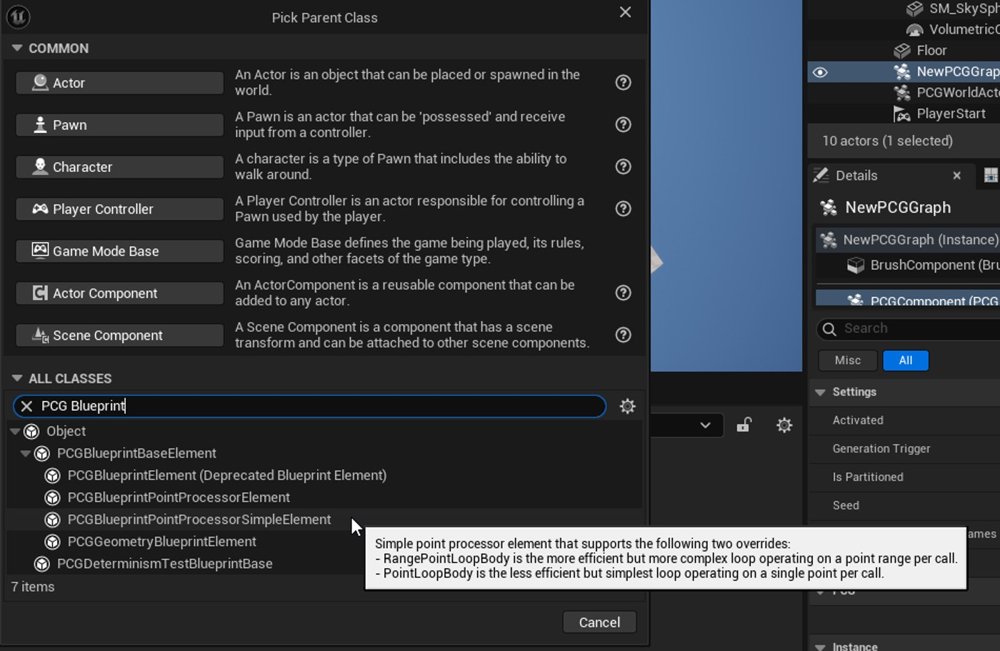

PCG 点阵列数据中非常重要的一点是，所有属性都是按需分配的。如果不进行分配，则无法为每个点设置不同的值。

实现者有责任指定哪些属性将被修改以及需要分配哪些属性。您可以在“类默认值”面板中选择它们。

在这个例子中，我们将看到如何修改点的位置，以应用偏移量，并将该偏移量作为参数传递给节点。

Simple 元素会为我们处理所有事情，包括创建新数据并正确初始化。我们唯一需要做的就是定义处理函数。

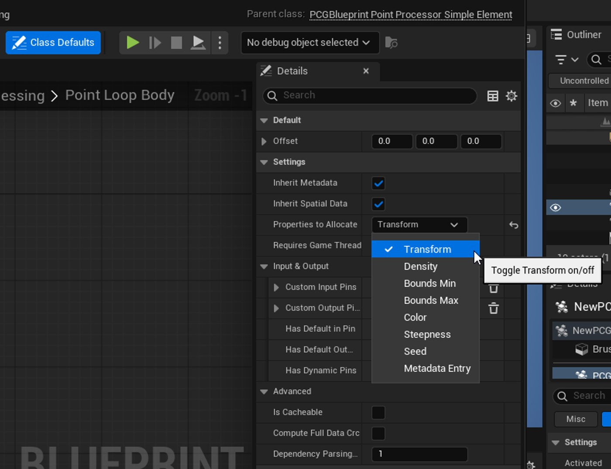

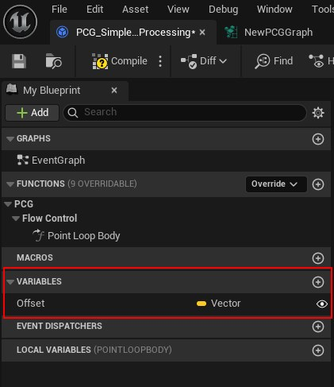

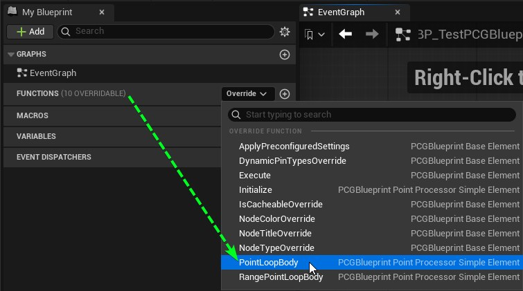

在这个函数中，我们有： Input: 输入：

Output: 输出：

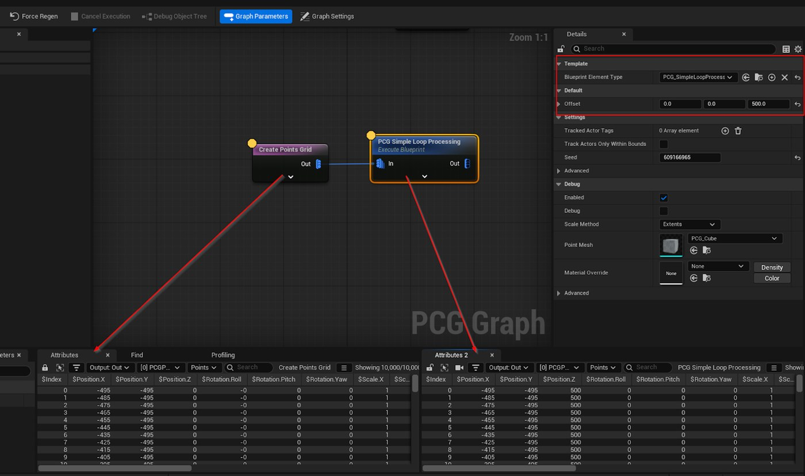

我们将重写 ` 范围点循环体 `，而不是重写 ` 点循环体 `。

从这个输入范围中，我们可以提取所有变换，修改它们，将结果存储在变换的临时数组中，然后一次性将该数组设置到输出范围中。

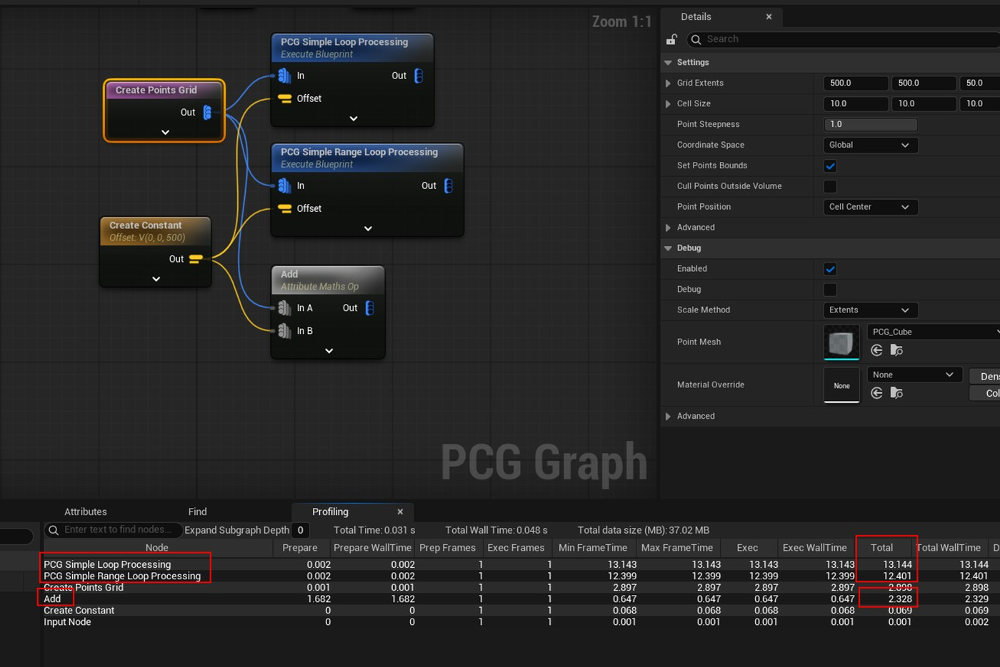

另一个稍微复杂一些的例子是处理元数据。元数据是存储在数据本身上的额外数据，可以是任何基本类型，例如整数、浮点数、向量、字符串等等。

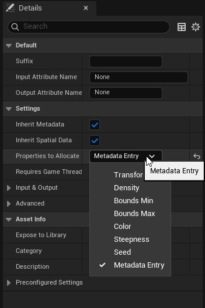

然后我们可以用点循环或范围循环来实现逻辑。点循环非常简单直接。唯一需要注意的是，我们需要将输入点复制到一个局部变量中，因为该点将被设置字符串属性修改。

范围版本稍微复杂一些，因为我们需要处理元数据条目键本身。

我们可以从这些范围中提取输入和输出数据，并处理元数据条目键而不是数据点。但逻辑保持不变，与第二个示例中的转换类似。

因此，我们遍历元数据条目，将其设置为局部变量，执行与点循环相同的操作，并将修改后的键添加到元数据键数组中（它是一个 integer64）。

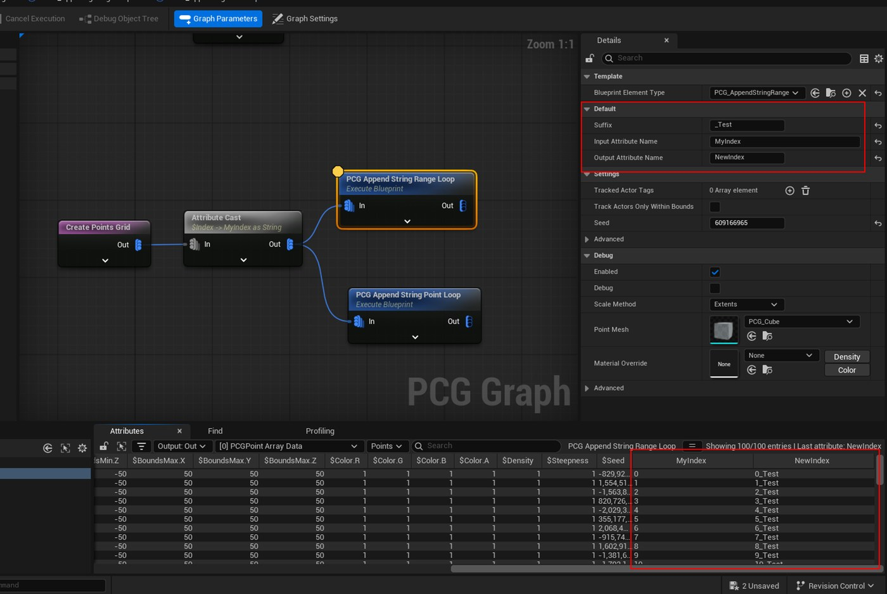

例如，如果我们有一个包含两个点 {A, B} 的点数据，以及另一个包含两个点 {C, D} 的点数据，我们将处理 {A, C}、{A, D}、{B, C}、{B, D}。

我们将输出每一对输入点的第一个输入点、第二个输入点的位置以及这两个点之间的距离。

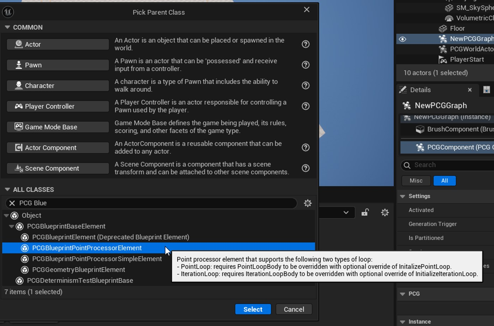

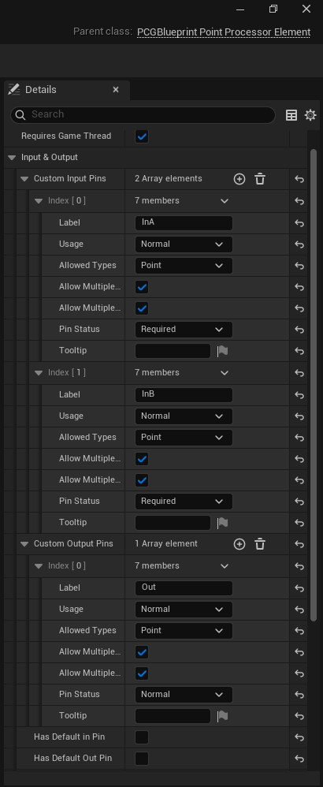

循环的第一步是设置输出点数据。由于输出数据与输入数据并非一一对应，因此我们需要更多步骤。

我们需要按顺序做的是：

使用 InA 初始化输出数据

设置点数

分配属性

创建我们的输出属性

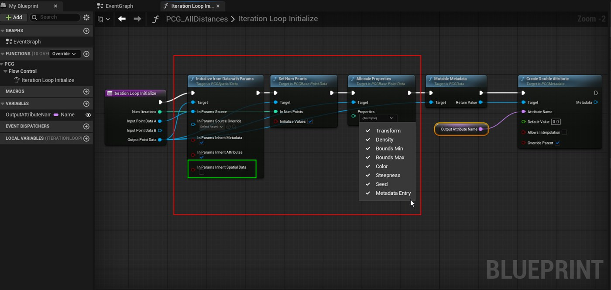

这次会相当复杂，因为需要收集很多节点才能完成操作。

第一步是收集所有数据并计算需要执行的迭代次数。这由输出范围的大小决定。因此，我们需要循环遍历以下范围： [迭代索引；迭代索引 + 范围大小 - 1] （-1 是因为 BP 中的 for 循环包含其最后一个索引）。

索引 B = 索引 / 大小 A

然后，我们将“OtherPosition”属性值设置为第二个点的位置，接着计算两点之间的距离并将其存储到“Distance”属性中。完成所有这些操作后，我们将“Current Point”写入输出范围。

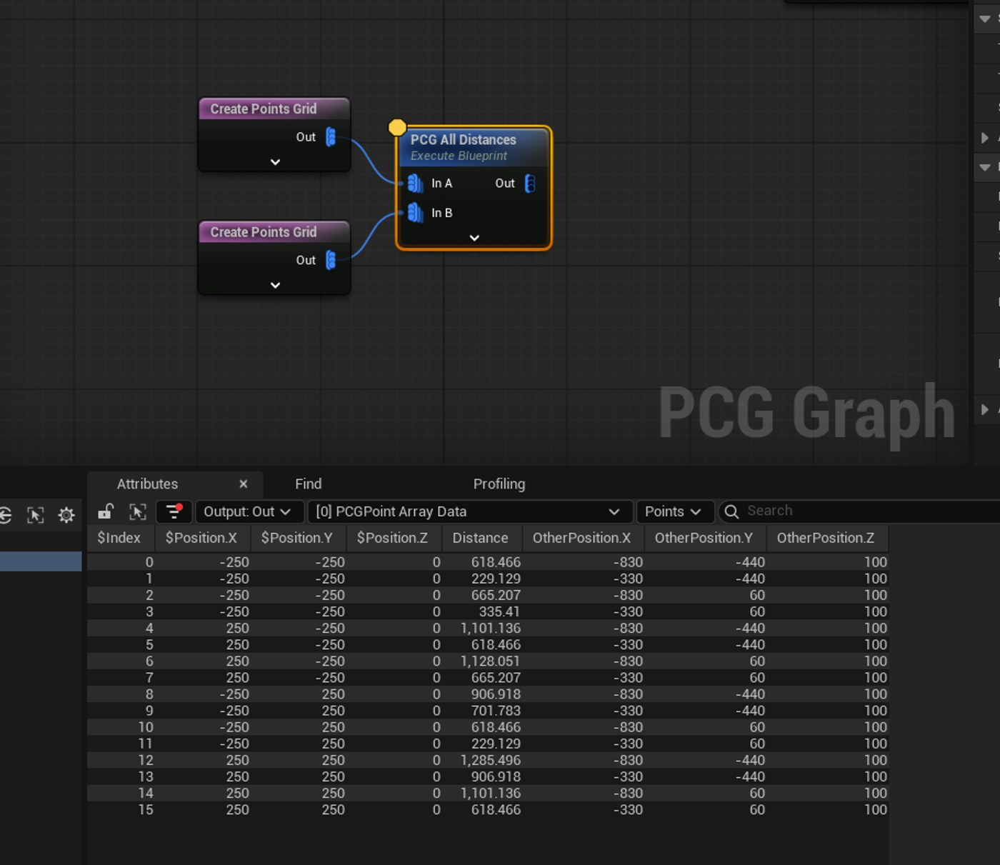

最后一个例子将是一个点生成器，所有操作都将在 Execute 中完成，因为我们没有任何数据可以读取。

我们将了解如何生成代表圆的点数据。

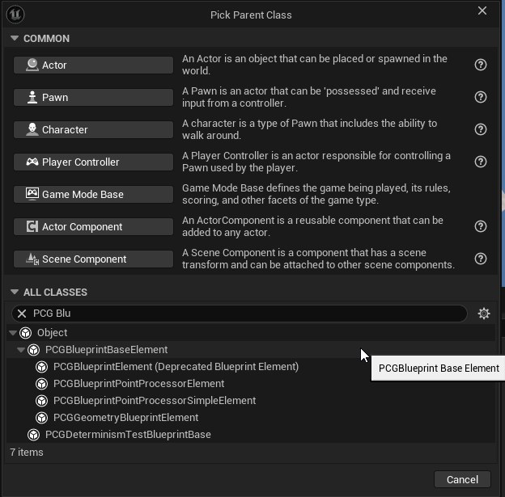

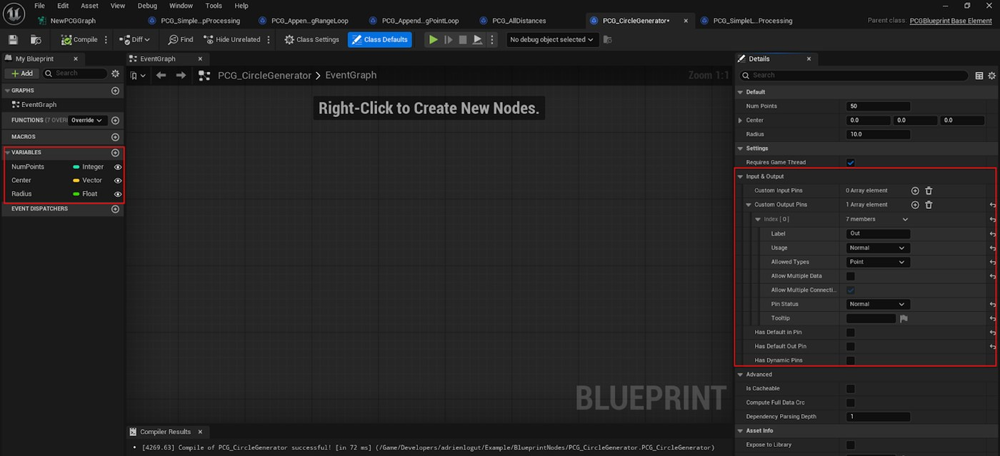

然后，我们将重写 execute 函数，具体操作如下：

创建一个新的 PCG 点阵列数据

由此我们得到如下结果：

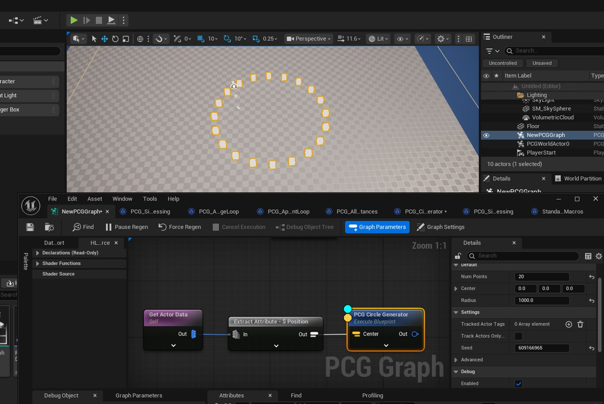

此元素是一个辅助节点，用于移除从蓝图调用几何脚本函数的样板代码。它会自动设置引脚以处理动态网格。

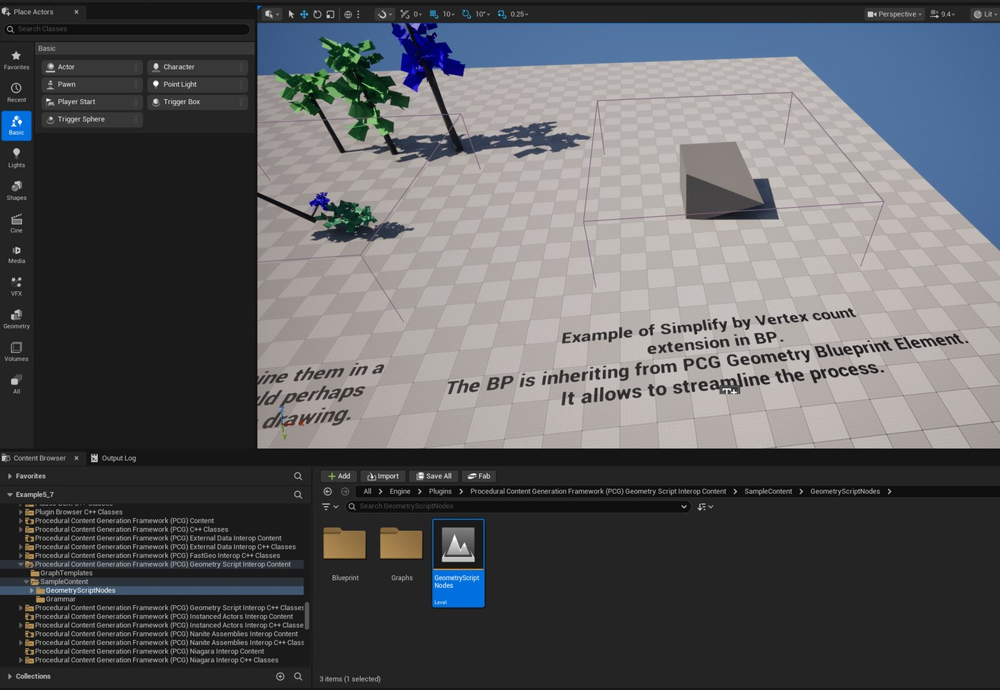
