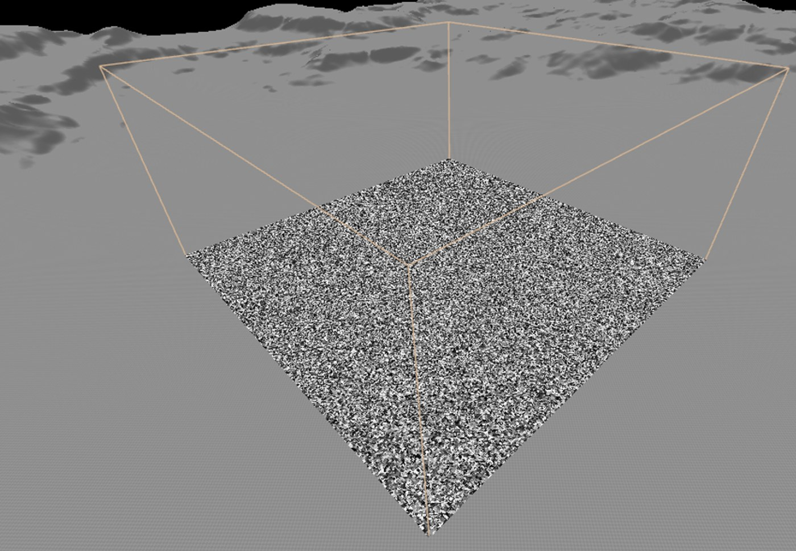
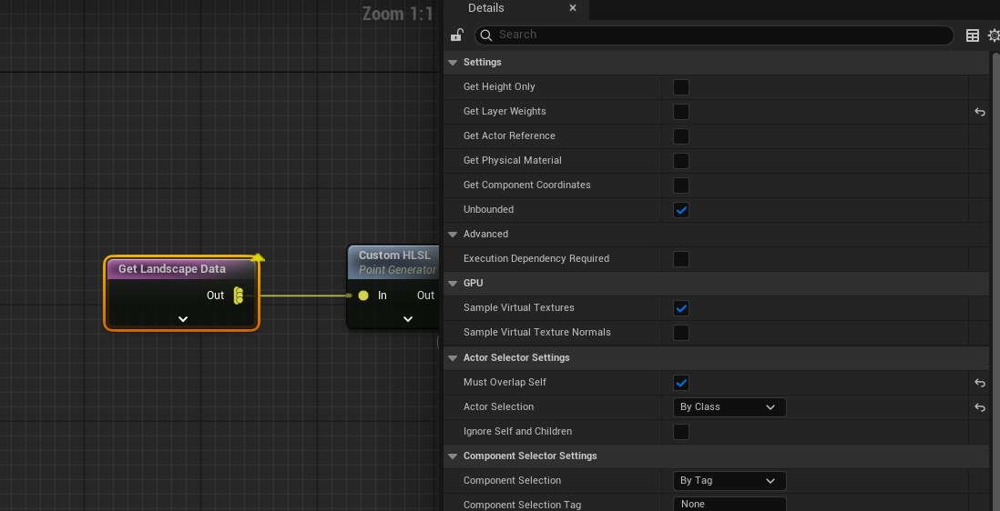
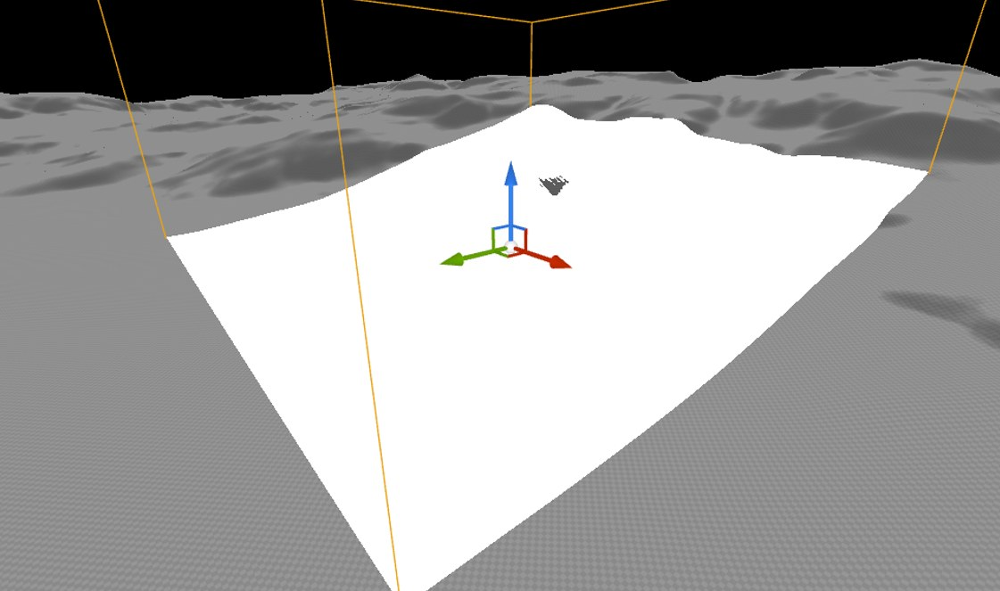
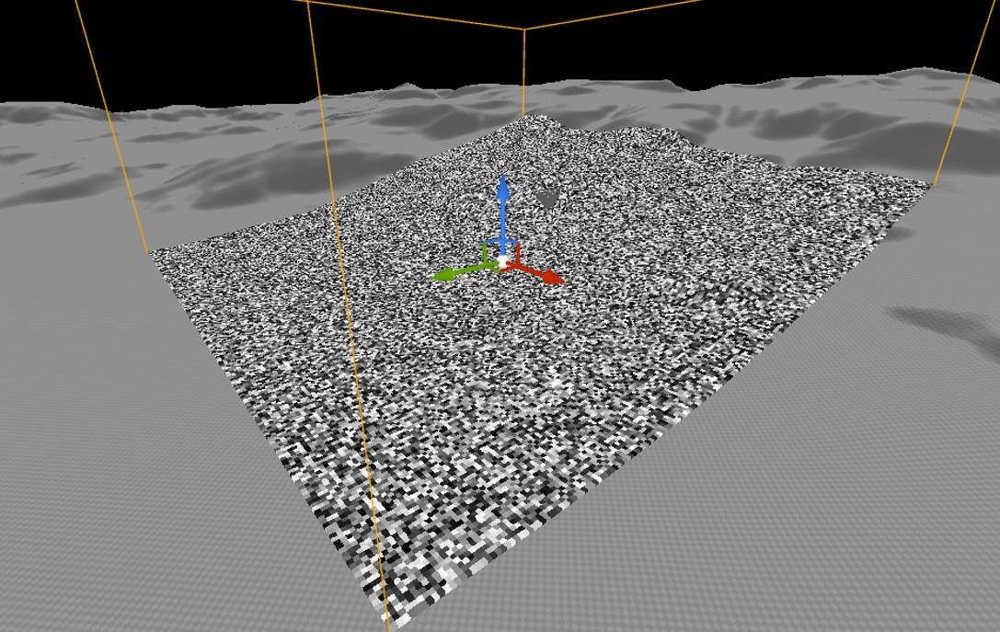
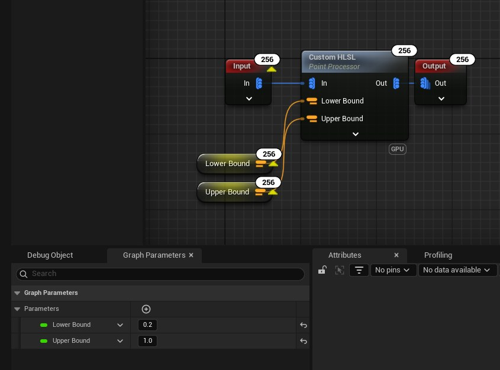
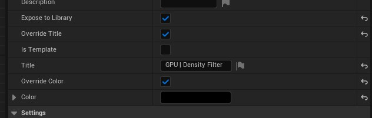
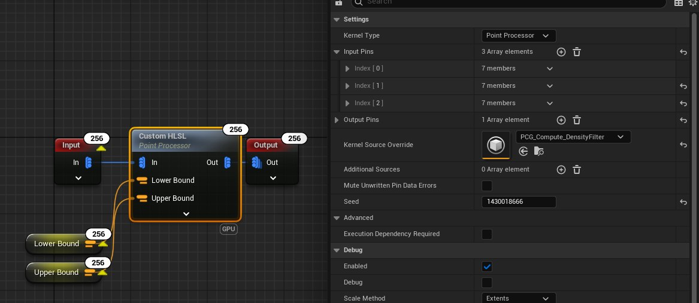
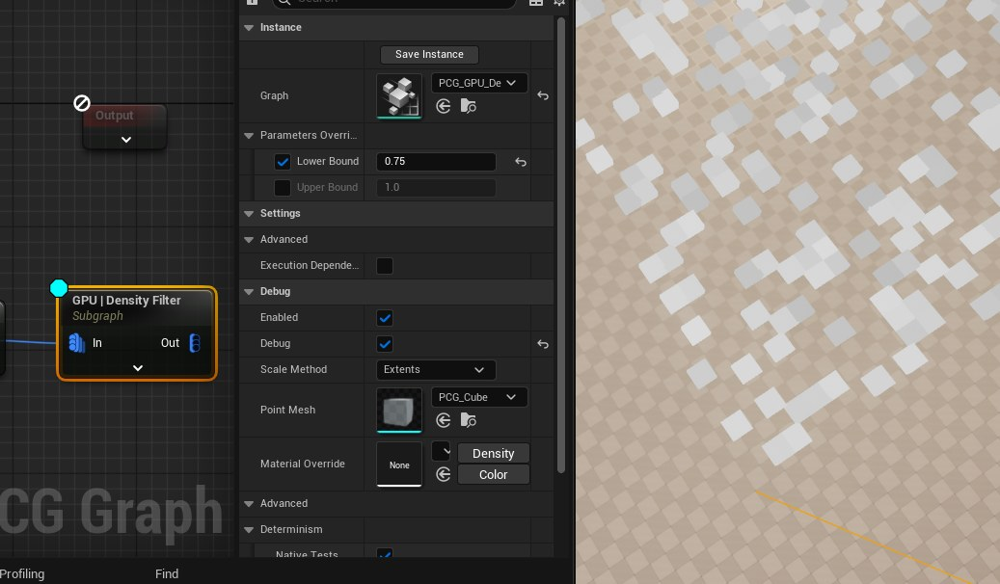

# PCG 计算图

- 来源: https://dev.epicgames.com/community/learning/tutorials/PZmb/unreal-engine-pcg-compute-graph


嗨！我想写一篇关于 PCG 的简短教程，因为目前关于 GPU 计算图的文档不多。本文将介绍我编写的密度滤波器版本，但使用的是 GPU 计算图。我还会提供一些我个人实现的其他实用函数的代码片段，你可以尝试自己实现。

## 将 GPU 点投影到地形上

将 GPU 点投影到景观上



这是一个空的 PCG 图，其中包含一个非常基本的 GPU 计算点网格。

首先，您需要对景观数据进行采样，请确保禁用 GetLayerWeights，因为它占用资源较多，而且本练习不需要它。



您需要添加一个 点生成器 （自定义 HLSL 内核类型），并确保其输入之一来自景观数据。

首先，你需要对地形边界进行采样，并使用内置函数创建一个点阵：

```hlsl
// Bounds
float3 Min = GetComponentBoundsMin();
float3 Max = GetComponentBoundsMax();
// Create 2D Grid
float3 Position = CreateGrid2D(ElementIndex, NumElements, Min, Max);
// Cull Points outside the bounds
if (Position.x < Min.x || Position.y < Min.y || Position.x > Max.x || Position.y > Max.y)
{
```

注意我们是如何将位置与地形边界进行比较的，这样我们就能确保剔除当前采样表面之外的所有内容。

之后，您需要将这些点投影到地形的 Z 轴位置上，如果需要，还可以投影其法线：

```hlsl
// Get Landscape Height
float Height = In_GetHeight(Position);
Position.z = Height;
// Get Landscape Normal
float3 Normal = In_GetNormal(Position);
const FQuat Orientation = QuatFromNormal(Normal);
// Get Landscape Height
float Height = In_GetHeight(Position);
Position.z = Height;
// Get Landscape Normal
const FQuat Orientation = QuatFromNormal(Normal);
```

最后一部分，也就是能够看到数据点，依赖于 Out_ 数据函数。你可以将它们添加到最后一段代码的正下方：

```hlsl
Out_SetPosition(Out_DataIndex, ElementIndex, Position);
Out_SetRotation(Out_DataIndex, ElementIndex, Orientation);
```

你应该会看到一些沿着地势坡度分布的白色斑点：



如果你尝试使用 DensityNoise 来进行调试，由于每个点的种子都相同，因此你将无法正确地进行调试。要更改点的种子，你可以使用内置函数 ComputeSeedFromPosition，并在其末尾添加 Out_SetSeed 函数：

```hlsl
// Per Instance Random
uint Seed = ComputeSeedFromPosition(Position);
// Add to the output section
Out_SetSeed(Out_DataIndex, ElementIndex, Seed);
// Per Instance Random
uint Seed = ComputeSeedFromPosition(Position);
// Add to the output section
Out_SetSeed(Out_DataIndex, ElementIndex, Seed);
```

你的终端生成器代码应该类似于这样：

```hlsl
// Bounds
float3 Min = GetComponentBoundsMin();
float3 Max = GetComponentBoundsMax();
// Create 2D Grid
float3 Position = CreateGrid2D(ElementIndex, NumElements, Min, Max);
// Cull Points outside the bounds
if (Position.x < Min.x || Position.y < Min.y || Position.x > Max.x || Position.y > Max.y)
{
```

对于在输出端接入密度噪声后的这种视觉效果：




## GPU 密度过滤器和点处理器

GPU 密度滤波器和点处理器

点处理器会接收你提供的所有输入点，并逐点运行着色器源代码。在这个例子中，我们先来看密度过滤的 GPU 版本，因为它比较简单。

首先，我们将创建一个新的 PCG 图作为我们的“节点”，以及一个 PCG 计算源，如下所示：

在这个新的 PCG_GPU_DensityFilter 图中，您可以添加一个点处理器节点，并创建两个我们将向用户公开的变量：LowerBound 和 UpperBound。



如果您点击顶部面板的“图形设置”，您可以访问覆盖节点名称及其节点颜色，这在您的项目拥有像这样的一组自定义节点时非常有用。



您可以将创建的计算源添加到点处理器节点，然后拖放或搜索您创建的两个变量并将它们连接起来：



命名规则在这里非常重要，因为您将在计算源中发现如何对这些信息进行采样。

您可以打开创建的 PCG_Compute_DensityFilter 文件，然后粘贴以下代码：

```hlsl
float Density = In_GetDensity(0, ElementIndex);
float LowerBound = LowerBound_GetFloat(0, 0, 'LowerBound');
float UpperBound = UpperBound_GetFloat(0, 0, 'UpperBound');
if (Density < LowerBound || Density > UpperBound)
{
Out_RemovePoint(Out_DataIndex, ElementIndex);
return;
}
float Density = In_GetDensity(0, ElementIndex);
float LowerBound = LowerBound_GetFloat(0, 0, 'LowerBound');
float UpperBound = UpperBound_GetFloat(0, 0, 'UpperBound');
if (Density < LowerBound || Density > UpperBound)
{
Out_RemovePoint(Out_DataIndex, ElementIndex);
return;
}
```

同样，可以看到 getter 方法使用了 `in_` 命名约定来直接定位所需的属性。该函数的第一个参数是数据索引（分区），第二个参数是元素索引（我们当前循环到的位置）。如果您创建的节点可以读取多个数据源，您可能不希望像这样硬编码索引，但对于本示例来说，这样做已经足够了。

我们对边界也做同样的处理，但请注意，这里我们将 GetFloat 作为属性，然后再指定属性名称。

最后，我们可以移除所有不符合给定参数的点。将这个新节点拖放到图中，应该会得到类似这样的结果，其中变量的下限为 0.75：




## 自己动手


```hlsl
```

GPU Distance

float MaximumDistance = Attributes_GetFloat(0, 0, 'MaximumDistance');

float3 PointPosition = In_GetPosition(0, ElementIndex);

float PointDistance = MaximumDistance;

for (uint d = 0; d < Target_GetNumData(); ++d)

{

for (uint idx = 0; idx < Target_GetNumElements(d); ++idx)

{

```hlsl
```

GPU Difference

float3 sourcePos = Source_GetPosition(0, ElementIndex);

float3 sourceMin = Source_GetBoundsMin(0, ElementIndex) - sourcePos;

float3 sourceMax = Source_GetBoundsMax(0, ElementIndex) - sourcePos;

for (uint d = 0; d < Differences_GetNumData(); ++d)

{

for (uint idx = 0; idx < Differences_GetNumElements(d); ++idx)

{

float3 difPos = Differences_GetPosition(d, idx);

使用 GPU 实现差异需要您编写一个自定义函数来计算交集。以下是一个简单的示例供您参考：

```hlsl
// IntersectBounds
bool IntersectBounds(float3 minA, float3 maxA, float3 minB, float3 maxB)
{
// If one box is on the left side of the other
if (maxA.x < minB.x || minA.x > maxB.x) return false;
// If one box is below the other
if (maxA.y < minB.y || minA.y > maxB.y) return false;
// If one box is behind the other
```


```hlsl
// GPU Height Lerp
float HeightTexture = HeightTexture_GetDensity(In_DataIndex, ElementIndex) - 1.0f;
float TransitionPhase = TransitionPhase_GetDensity(In_DataIndex, ElementIndex) * 2.0f;
float HeightLerp = saturate(HeightTexture + TransitionPhase);
// Cheap Contrast
HeightLerp = saturate(lerp(0.0f - HeightLerp, HeightLerp + 1, 1.0f));
Out_SetDensity(Out_DataIndex, ElementIndex, HeightLerp);
float HeightTexture = HeightTexture_GetDensity(In_DataIndex, ElementIndex) - 1.0f;
float TransitionPhase = TransitionPhase_GetDensity(In_DataIndex, ElementIndex) * 2.0f;
float HeightLerp = saturate(HeightTexture + TransitionPhase);
// Cheap Contrast
Out_SetDensity(Out_DataIndex, ElementIndex, HeightLerp);
```

这个节点源自材质节点 Height Lerp，在使用空间噪声插值点空间数据时非常有用。
