# 使用样条和 PCG 生成程序化房间

- 来源: https://dev.epicgames.com/community/learning/tutorials/eZVR/procedural-room-generation-with-splines-and-pcg-in-unreal-engine

## 介绍

手动放置模块化层板既耗时又容易出错。仅仅一个需要精确对齐地板砖、墙板和装饰条的房间，就可能耗费数小时，而且任何设计变更都需要重新组装。程序化内容生成 (PCG) 通过基于规则而非单独放置来生成几何体，从而消除了这一瓶颈。

本教程演示如何使用虚幻引擎的程序化生成图形 (PCG) 框架结合样条曲线形状定义来创建程序化室内空间。您将构建一个可重用的蓝图 Actor，它接受任何样条曲线形状作为输入，并自动生成完整的房间，包括网格状地板图案、方向正确的周边墙壁，并支持设计迭代，无需手动重建。

该工作流程应用了 PCG 的方向点偏移和集合差运算来检测内部区域和边界区域。这种边界检测技术不仅适用于房间生成，还适用于地形特征、道路网络、植被分布以及任何需要程序化放置并具备边缘感知能力的场景。

## 先决条件

在开始本教程之前，您应该具备以下条件： - Unreal Engine 5.7

- 虚幻引擎 5.7

- PCG 插件已启用（UE 5.7 中默认启用）

Project Setup: 项目设置： -

- 新建空白项目或启用 PCG 支持的现有项目 Knowledge Requirements: 知识要求： -

- 虚幻引擎编辑器中的导航，包括视口控件和内容浏览器

- 蓝图基础知识，包括创建蓝图 Actor 和编辑组件层级结构

- 基本样条曲线编辑（添加点、调整曲线）

熟悉静态网格的放置和变换

## 学习目标

完成本教程后，您将能够： 1.

1. 创建集成样条线和 PCG 组件的蓝图 Actor，用于程序化生成工作流程

2. 配置 PCG 图以对样条形状进行采样并生成填充内部区域的点分布

3. 利用方向点偏移和差分运算实现边界检测，以区分内部点和周界点。

4. 生成网格对齐的地板砖图案，间距和旋转角度可配置。

5. 根据边界检测结果，自动放置具有特定方向的周边墙段

6. 将样条曲线修改与 PCG 图再生连接起来，实现实时设计迭代

7. 扩展基础系统，以支持材料变化、门的位置以及多房间配置

## PCG 架构基础知识

第一部分：PCG 架构基础知识

## 理解 PCG 执行模型

PCG 基于图系统运行，其中节点处理点集。每个点都携带空间数据（位置、旋转、缩放）和元数据。图中的节点对这些点集执行操作：生成、过滤、变换和使用（网格生成）。

执行流程遵循以下模式：

输入节点创建初始点数据（样条采样、体积填充、曲面投影）

处理节点对点集进行变换、过滤或组合（偏移、旋转、差分运算）。

输出节点消耗点数来生成网格、放置 Actor 或触发其他逻辑。

## 基于点的空间逻辑

与处理连续数学函数的传统程序系统不同，PCG 将空间离散化为点集。这种方法具有以下优势：

通过采样参数对放置密度进行显式控制

通过元数据查询直接操作单个点

通过点集代数进行高效的空间运算

对于房间生成，我们利用该模型：

对样条曲线进行采样，以固定间隔生成内部点

在基本方向上创建点集的偏移副本。

利用集合差集来分离内部与外部相交的边界点

## 偏移差分法

PCG 中的边界检测依赖于点集的比较。考虑一个填充矩形区域的点阵。如果我们将整个点阵沿 X 轴正方向平移半个图块宽度，大多数点仍然会与原始点集重叠——除了位于 X 轴最大边缘的点。

差异节点执行集合减法：原始值减去偏移值等于边缘点数。

通过创建四个方向偏移（X 轴正方向、X 轴负方向、Y 轴正方向、Y 轴负方向）并计算四个差分运算，我们可以独立地隔离所有四个边。这使我们能够精确控制每侧墙壁的生成，从而实现正确的旋转和对齐。

这项技术不仅适用于简单的矩形，任何闭合样条形状——例如 L 形、曲线边界、不规则多边形——都能通过相同的偏移差分逻辑正确识别其周长。

## 为什么室内空间需要样条曲线？

样条曲线通过控制点提供直观的形状定义。与体积图元（立方体、球体）或曲面网格不同，样条曲线具有以下优势：

最少的数据需求：几个控制点即可定义复杂的形状

实时编辑：拖动单个点即可重塑整个空间

明确的内外定义：闭合回路可以清晰地区分内部与外部。

明确的内外定义：闭合回路清晰地将内部与外部分隔开来

与 PCG 的样条采样器节点直接集成

对于建筑设计工作流程而言，样条曲线符合设计师绘制平面图的思路：绘制轮廓，填充内部空间。PCG 可自动完成填充步骤。

## 项目设置和资产准备

第二部分：项目设置和资产准备

## 创建基础项目

启动虚幻引擎 5.7，并使用“空白”模板创建一个新项目。除非您需要该资源包中的特定资源，否则请禁用“初始内容”。保存默认关卡或使用“基础”模板创建一个新关卡。

## 启用程序化内容生成

导航至“编辑”>“插件”，找到“程序化内容生成框架”插件。启用该插件，并在提示时重启编辑器。所有 PCG 节点和组件都需要此插件。

通过检查 PCG 是否出现在内容浏览器的右键菜单中作为资源类别，来验证插件是否已激活。

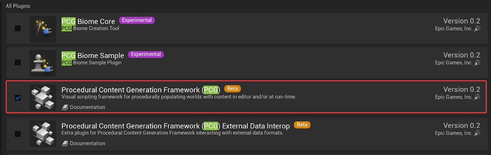

## 资产获取与导入

资产购置与进口

在 Epic 启动器中打开 Fab，搜索“模块化城市房屋包”。将其添加到您的库中，然后添加到您的项目中。您可能需要告诉系统将其添加为 UE 5.7 包。

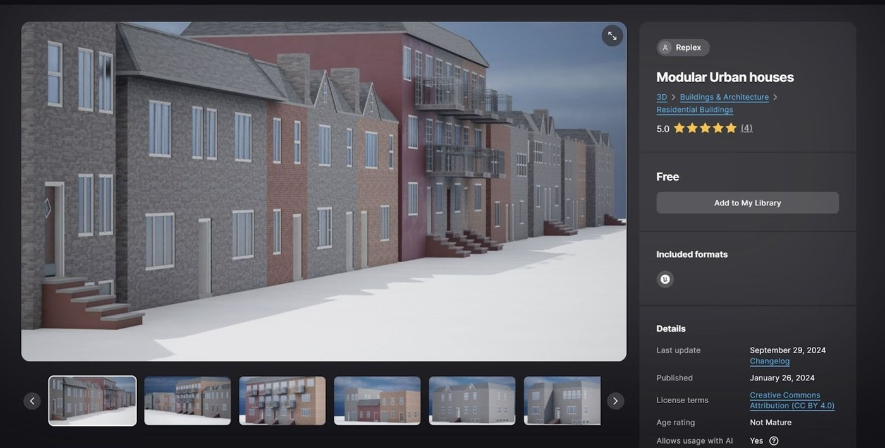

启用双面材质可防止材质从某些角度显示不可见。打开材质并确保“双面”已开启。

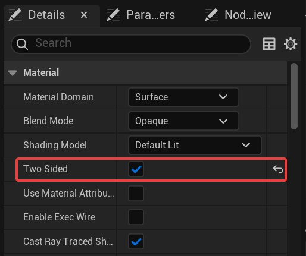

## 关键步骤：枢轴点校正

PCG 会使用网格的枢轴点作为生成位置锚点来生成网格。枢轴点位置不正确会导致网格错位和墙体放置错误。我们将创建修正后的地板和墙体网格版本。

## 地板网格枢轴中心定位

地板网格枢轴中心定位：

在内容浏览器中复制您的地板网格。将其重命名以指示更正后的枢轴点（例如：SM_Floor_400_Centered）。

将网格拖入视口中以放置临时实例。

使用 Shift+5 或模式选择器下拉菜单切换到建模模式。

在“建模工具”面板中，选择“变换” - “编辑枢轴”。

在“编辑枢轴点”设置面板中，单击“居中”。这会将枢轴点定位在网格边界框的几何中心。

点击“接受”以提交更改。

从视口中删除网格实例。枢轴点更改将保存到资源本身。

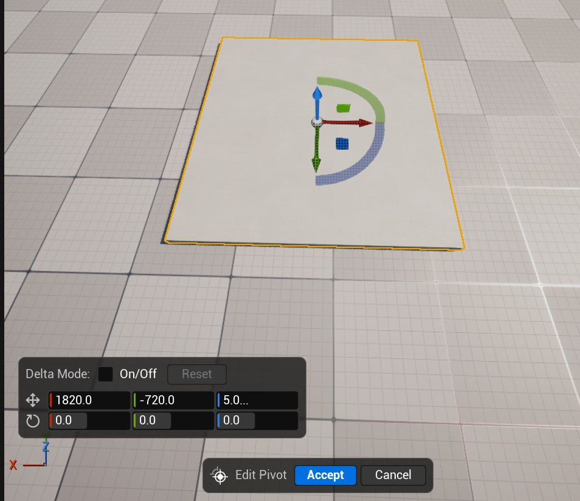

## 墙体网格枢轴定位

墙体网格枢轴定位：

在内容浏览器中复制您的墙体网格。将其重命名为合适的名称（例如：SM_Wall_400_BottomCentered）。

将墙体网格放置在视口中，然后进入建模模式（Shift+5）。

从建模工具面板中选择“变换” - “编辑枢轴点”。

点击“底部”将枢轴点移动到网格底部，然后点击“中心”将其沿墙体长度方向水平居中。这样可以确保墙体底部位于地面，并绕其垂直中心轴旋转。

单击“接受”并从视口中移除网格。

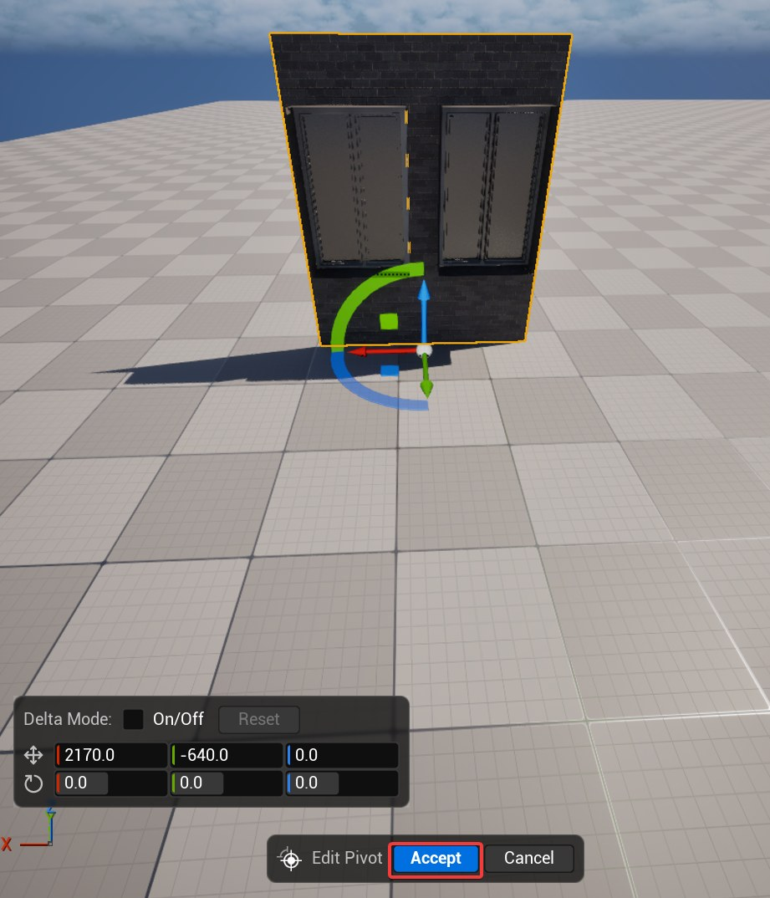

## 枢轴定位逻辑

枢轴定位逻辑：

地板砖从中心生成，从而实现对称网格生成。

墙壁从其底部中心生成，确保它们与地面齐平，并围绕其中点正确旋转。

错误的枢轴点会导致：

地板砖错位铺设，错位距离为其尺寸的一半

墙壁漂浮在地板上方或沉入地板下方

旋转问题表现为墙体绕角而不是绕中心旋转。

在继续操作之前，请务必花时间验证枢轴点位置，方法是在视口中放置一个修正后的网格，并检查枢轴点操纵器的位置。

## 项目和蓝图设置

第二部分：项目和蓝图设置

## 创建蓝图容器

在内容浏览器中，右键单击并选择“蓝图类 - Actor”。将其命名为 BP_ProceduralRoom。

该蓝图 Actor 同时作为样条线定义和 PCG 执行逻辑的容器。

## 创建 PCG 图资源

创建 PCG 图形资产

在内容浏览器中，右键单击并导航至 PCG - PCG Graph。将其命名为 PCG_ProceduralRoom。

PCG 图是一个独立的资源，它定义了程序生成逻辑。将其与蓝图分开，可以使其在多个房间实例中重复使用。

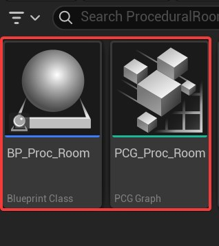

## 配置蓝图组件

在蓝图编辑器中打开 BP_ProceduralRoom。

从“组件”面板中添加以下组件：

添加组件 - 样条曲线组件

添加组件 - PCG 组件

## 将 PCG 图链接到组件

在“组件”面板中选择 PCG 组件。

在“详细信息”面板中，找到“图形实例”部分，并将 PCG_ProceduralRoom 分配给“图形”参数。

这会将执行组件与您之前创建的图形资产连接起来。

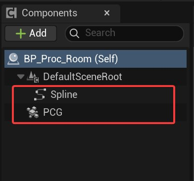

## 配置样条组件

在“组件”面板中选择样条组件。

默认样条曲线包含两个点，形成一条线段。我们需要一个封闭的形状来进行内部填充。

删除第二个样条点：右键单击视口中的第二个点，然后选择“删除样条点”，只留下一个点。

生成初始形状：右键单击剩余的样条曲线点，然后选择“样条曲线生成面板” - “正方形”。这将创建一个四边相连的正方形。

在“详细信息”面板中配置以下样条曲线属性： Under Spline settings: 在样条曲线设置下：

闭环：启用（这将最后一个点与第一个点连接起来，形成一个封闭的边界）

默认样条点类型：设置为线性（确保点之间的边缘为直线而不是曲线）

线性点类型对于建筑空间至关重要。曲线插值会生成圆弧形墙面，这会使网格对齐变得复杂，并浪费几何体资源。

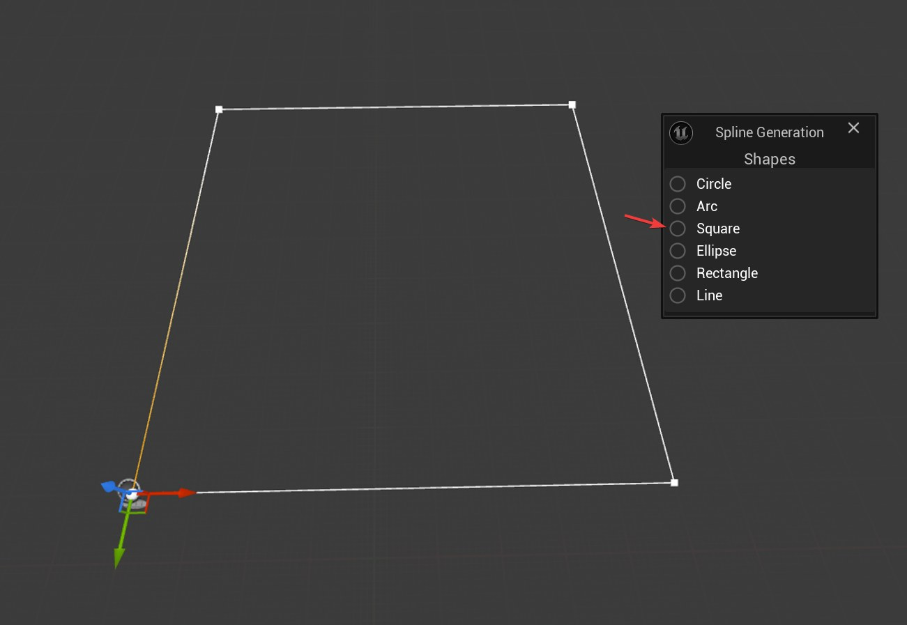

## 最终确定并测试

在蓝图编辑器工具栏中单击“编译”，然后单击“保存”。

将 BP_ProceduralRoom 从内容浏览器拖到关卡视口中。

您应该在编辑器中看到方形样条曲线，它由一系列连接的线段组成，每个角点都有控制点指示器。

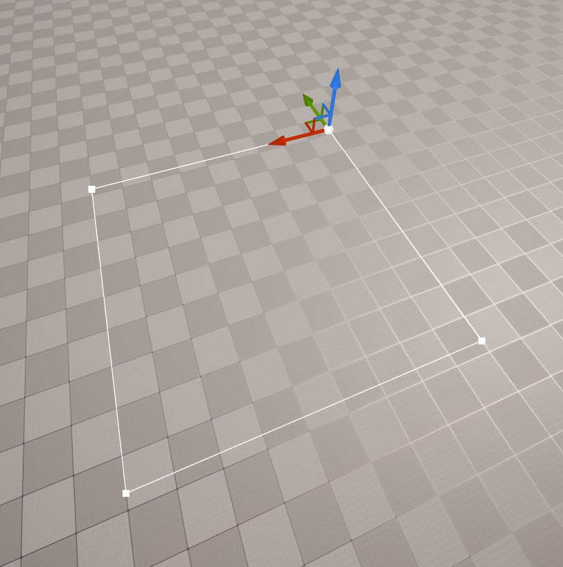

## 组件层级验证

组件层次结构验证

您的“组件”面板应显示： DefaultSceneRoot 默认场景根 Spline (SplineComponent) 样条曲线（样条组件）

PCG (PCGComponent) PCG（PCG 组件）

在此阶段，由于 PCG 图为空，PCG 组件不会生成可见的输出。下一节将使用楼层生成逻辑填充该图。

## 样条编辑参考

在视口中选择 BP_ProceduralRoom：

单击并拖动现有样条线点以重新塑造边界

按住 Alt 键并拖动一个点即可复制它，从而添加新的角点。

右键单击样条曲线段，即可在该位置插入一个点

右键单击一个点即可删除它（闭合形状至少需要保留三个点）

任何样条曲线的修改都会在图表构建完成后触发自动 PCG 再生。

## PCG 图：生成地板

第三部分：PCG 图——生成楼层

## 打开 PCG 图

在内容浏览器中，双击 PCG_ProceduralRoom 打开 PCG 图形编辑器。

图形工作区显示两个默认节点：输入和输出。所有处理节点都连接在这两个端点之间。输入节点从蓝图中的 PCG 组件接收数据，而输出节点返回处理后的数据以供执行。

## 步骤 1：获取样条数据

向图中添加一个“获取样条数据”节点。

该节点从蓝图中读取样条曲线的形状，以便 PCG 图形知道在哪个区域生成点。

配置节点参数：

演员筛选器：设置为自身

这样可以确保 PCG 使用附加到 BP_ProceduralRoom 的样条线组件，而不是在整个关卡中搜索样条线。如果没有此过滤器，如果场景中存在多条样条线，则节点会产生不明确的结果。

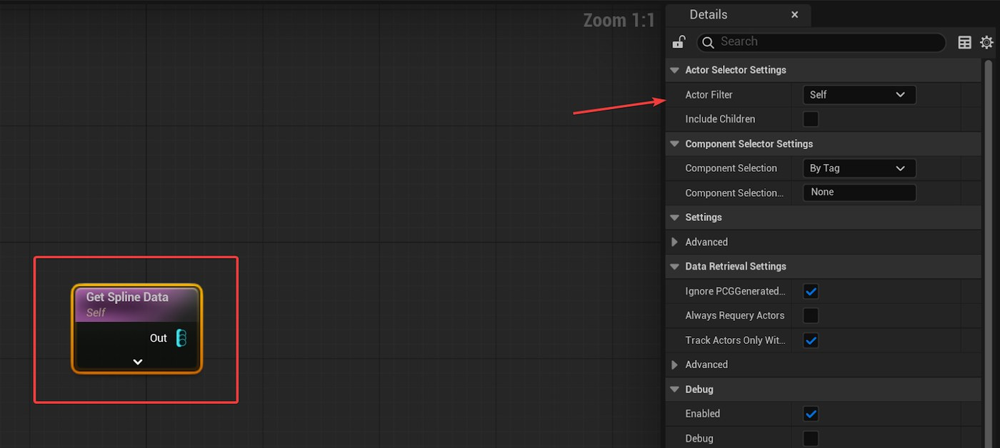

## 步骤 2：生成内部点

步骤二：生成内部点

添加一个样条采样器节点，并将其输入引脚连接到获取样条数据节点的输出。

样条曲线采样器会根据采样参数在样条曲线内部创建均匀分布的点。请配置以下设置：

尺寸：设置为“开启”

此设置控制点是放置在样条曲线内部、边界上还是直接放置在样条曲线上。“内部”模式会填充封闭区域，这是生成地板瓦片所必需的。 Alternative dimension modes:

其他维度模式：

在样条曲线上：沿着样条曲线路径放置点

内部区域：填充封闭区域（我们的要求）

外部：将点放置在边界之外

无限制：启用此复选框（真）

允许采样器填充整个内部空间，而不会被样条线的轴对齐边界框裁剪。禁用此功能可能会导致非矩形形状中靠近样条线边缘的点被截断。

室内取样 - 细分：请根据您的地砖尺寸进行设置。

此参数控制生成点之间的间距。如果您的地面网格为 300x300 个单位，请设置： X: 300.0 X：300.0

Y: 300.0 Y：300.0

Z：（对于二维网格无关，保留默认值）

细分值必须与网格尺寸完全匹配。较小的值会创建更密集的点阵，包含更多图块，但性能开销也更大。较大的值会创建更稀疏的网格，包含更少的图块。

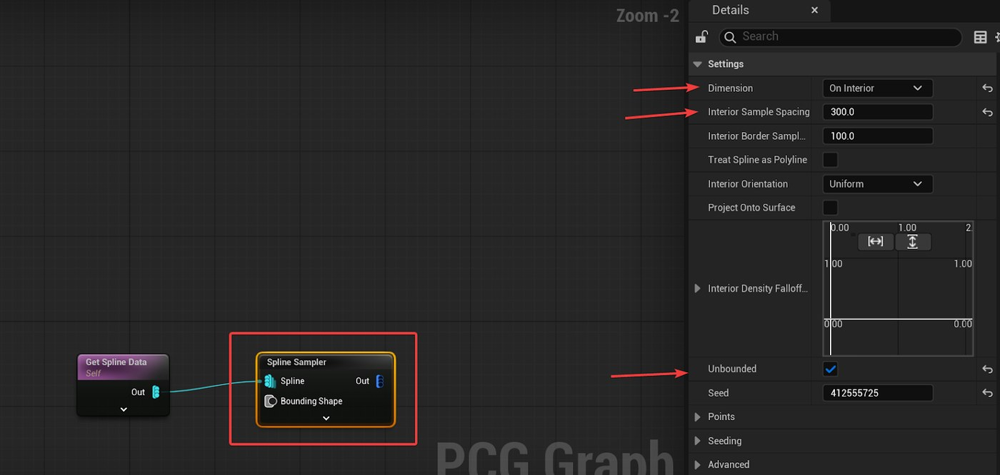

## 调试点可视化

选择样条采样器节点后，按 D 键切换调试点预览，启用调试点预览后，该节点将显示一个青色圆圈。

视口应在每个生成的点位置显示小型调试球体，在样条曲线边界内形成均匀网格。此可视化效果有助于在生成网格之前验证点密度是否正确。

如果点不可见：

确认蓝图中样条曲线已启用闭环控制

确认样条采样器中的“无界”选项已选中

请确保在关卡中选择了 BP_ProceduralRoom（调试可视化需要主动选择）。

检查细分值是否合理（不能为零或过大）。

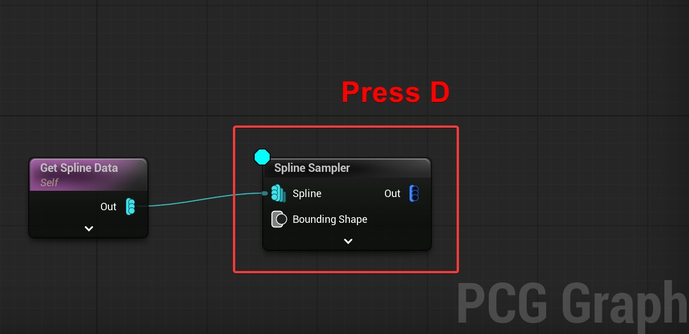

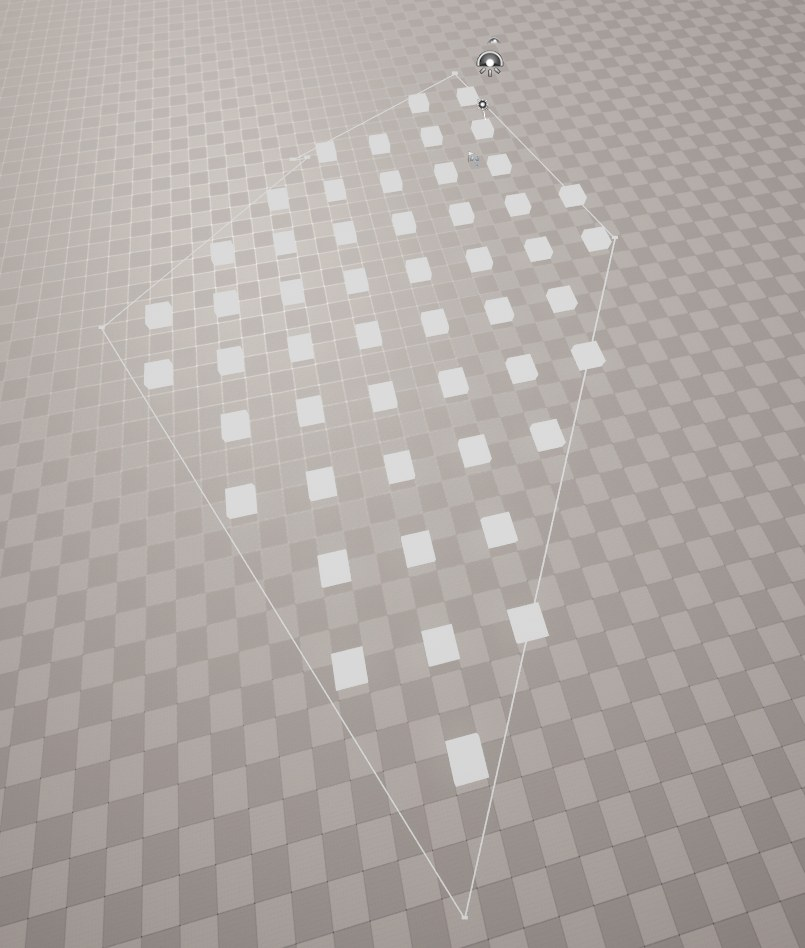

## 步骤 3：生成地板网格

添加一个静态网格生成器节点，并将其输入连接到样条线采样器的输出。

该节点会在每个传入的 PCG 点处生成您选择的网格。每个点的位置、旋转和缩放数据都会传输到生成的网格实例中。

在“详细信息”面板中，找到“网格条目”数组，然后单击“+”按钮添加网格条目。

展开新的数组元素，并将 Mesh 参数设置为你的枢轴校正后的地板网格（你在第 1 节中创建的以中心枢轴为基准的网格，例如 SM_Floor_Pivot_Centered）。

其他需要注意的参数：

权重：控制分配多个网格时的选择概率（对于单网格设置，请保留为 1.0）

覆盖材质：允许针对每个实例替换材质以实现差异化（高级扩展中会介绍）。

## 连接到输出

将静态网格生成器的输出连接到输出节点，然后保存 PCG 图。

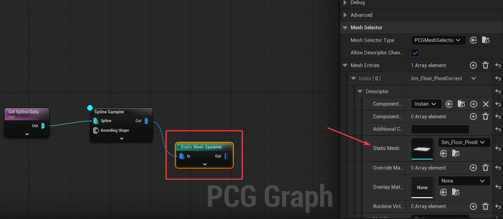

## 测试地板生成

返回到关卡视口并选择 BP_ProceduralRoom 实例。

如果 PCG 组件启用了自动再生（默认行为），则地板砖应立即出现，以均匀的网格图案填充样条形状。

现在你应该能看到一个由楼层组成的网格，填满了关卡中的形状。

网格不显示的故障排除方法：

验证静态网格生成器是否在网格条目中分配了有效的网格参考。

检查所分配的网格是否使用了第 1 节中的枢轴点校正版本。

在蓝图中选中 PCG 组件，然后单击“生成”以强制手动再生。

检查输出日志（窗口 - 开发者工具 - 输出日志）是否存在 PCG 执行错误

请确认细分值与您的实际瓷砖尺寸相符

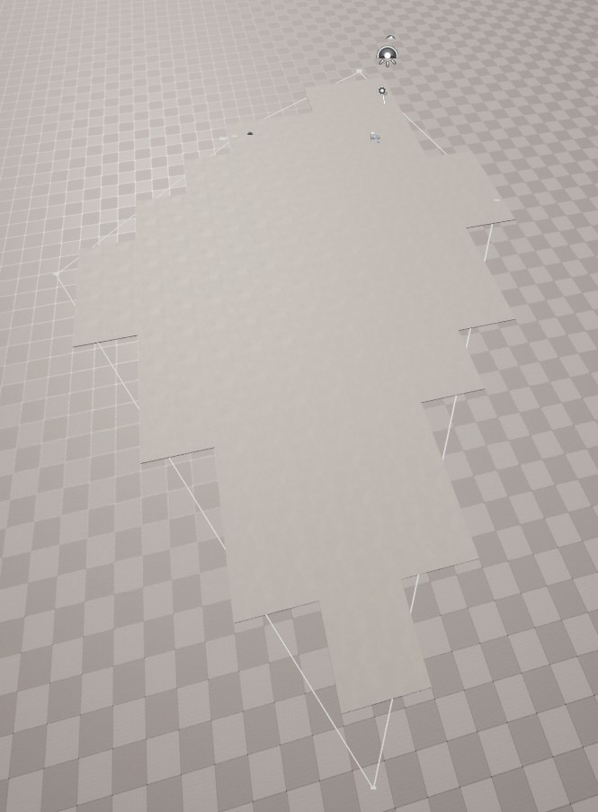

## 测试动态更新

选中 BP_ProceduralRoom 后，拖动样条线控制点来重塑边界。地板图案应自动重新生成，无需手动干预即可适应新的形状。

现在你已经拥有了一个功能齐全的程序化地板生成器。下一节将通过偏移和差分运算，利用边界检测来实现墙体的放置。

## PCG 图：生成墙体（边缘检测逻辑）

第 4 节：PCG 图 - 生成墙（边缘检测逻辑）

## 理解边界检测

为了精确放置墙体，我们需要识别地板网格的边界。PCG 通过集合相减来实现这一点：通过沿每个基本方向偏移点集并将其与原始点集进行比较，我们可以提取出仅存在于边界上的点。

偏移差分法的工作原理如下：当将一个内部点移动半个图块宽度时，它仍然与原始网格中的另一个点重叠。然而，边缘点会移动到原始集合之外，从而可以通过差分运算检测到。

## 步骤 1：创建方向偏移副本

添加一个变换点节点，并将其输入连接到样条采样器的输出（与地板生成器的输出相同）。

该节点可以平移、旋转或缩放所有传入的点。对于边缘检测，我们使用它在每个基本方向上创建整个点集的偏移副本。

将此节点复制 3 次，总共得到 4 个变换点节点，全部连接到同一个样条采样器输出。

使用以下偏移值配置每个节点： Node A (Positive X Edge)

节点 A（正 X 边） Offset Min: X=150, Y=0, Z=0

最小偏移量：X=150，Y=0，Z=0

Offset Max: X=150, Y=0, Z=0

最大偏移量：X=150，Y=0，Z=0

Node B (Negative X Edge)

节点 B（负 X 边） Offset Min: X=-150, Y=0, Z=0

最小偏移量：X=-150，Y=0，Z=0

Offset Max: X=-150, Y=0, Z=0

最大偏移量：X=-150，Y=0，Z=0

Node C (Positive Y Edge)

节点 C（正 Y 边） Offset Min: X=0, Y=150, Z=0

最小偏移量：X=0，Y=150，Z=0

Offset Max: X=0, Y=150, Z=0

最大偏移量：X=0，Y=150，Z=0

Node D (Negative Y Edge)

节点 D（负 Y 边） Offset Min: X=0, Y=-150, Z=0

最小偏移量：X=0，Y=-150，Z=0

Offset Max: X=0, Y=-150, Z=0

最大偏移量：X=0，Y=-150，Z=0

关键：计算偏移值

这些具体数值（150）是基于300个单位的图块计算的。偏移量必须正好是图块尺寸的一半。

如果您的地板网格为 400x400 个单位，请使用 200 而不是 150。如果您的地板网格为 200x200 个单位，请使用 100 而不是 150。

“最小偏移量”和“最大偏移量”参数会将所有点沿特定方向移动固定距离。将这两个参数设置为相同值会创建统一的平移。

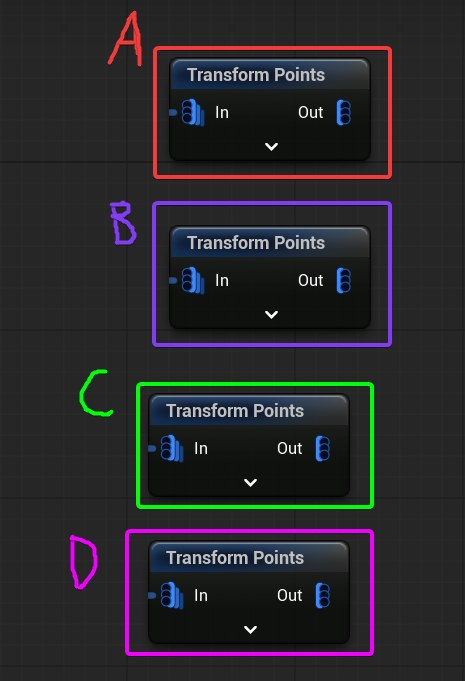

## 步骤 2：用差分运算分离边缘点

步骤 2：利用差分运算分离边缘点

向图中添加 4 个差异节点。

差集节点执行两个点集之间的集合相减运算。它只保留源输入中存在但不在差集输入中的点，从而有效地隔离边缘点。

按以下方式连接每条边的线路：

差异节点 1（正 X 壁）

源输入：连接到样条采样器输出（原始点）

差值输入：连接至节点 A 输出（偏移 +X 点）

差分节点 2（负 X 壁）

源输入：连接至节点 B 输出（偏移 -X 点）

差值输入：连接到样条采样器输出（原始点）

注意：对于相反的边，交换连接到源节点和差集节点的节点。

差异节点 3（正 Y 壁）

源输入：连接到样条采样器输出（原始点）

差值输入：连接至节点 C 输出（偏移 +Y 点）

差分节点 4（负 Y 壁）

源输入：连接到节点 D 输出（-Y 偏移点）

差值输入：连接到样条采样器输出（原始点）

逻辑：原始点数减去偏移点数等于边界点数。偏移到边界之外的点不再与原始点集重叠，结果中只剩下边界点。

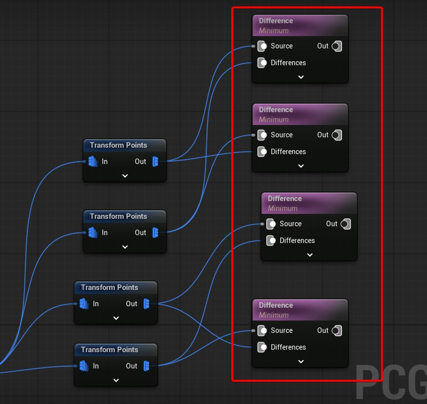

## 步骤 3：准备墙体变换

对于 4 个差异节点输出中的每一个，添加一个变换点节点。

将每个“差值”输出连接到其对应的“变换点”输入。现在您有 4 个“变换点”节点，每个墙边一个。

这些变换点节点稍后将用于处理墙体的旋转和位置调整。目前请保留默认设置；我们将在下一节配置旋转。

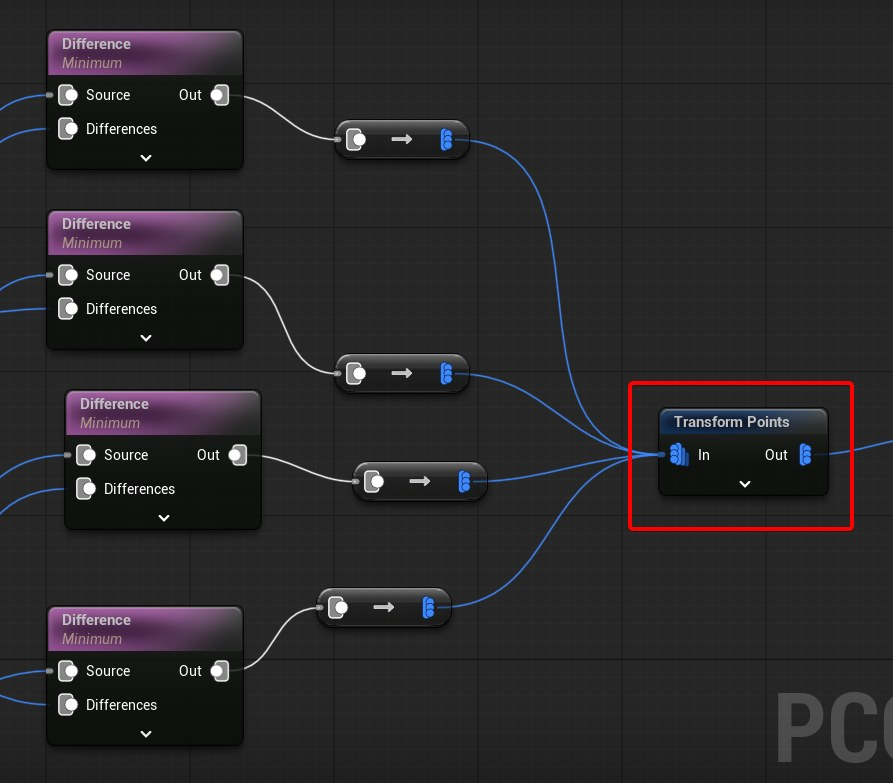

## 步骤 4：生成墙体网格

添加一个静态网格生成器节点。

将所有 4 个变换点输出连接到同一个静态网格生成器输入。生成器将合并所有边点集合，并在每个位置生成墙壁。

在“详细信息”面板中，找到“网格条目”数组，然后单击“+”添加网格条目。

将 Mesh 参数设置为您的枢轴校正墙网格（在第 1 节中创建的以底部中心为枢轴的网格，例如 `SM_Wall_Pivot_Centered`）。

保存 PCG 图。

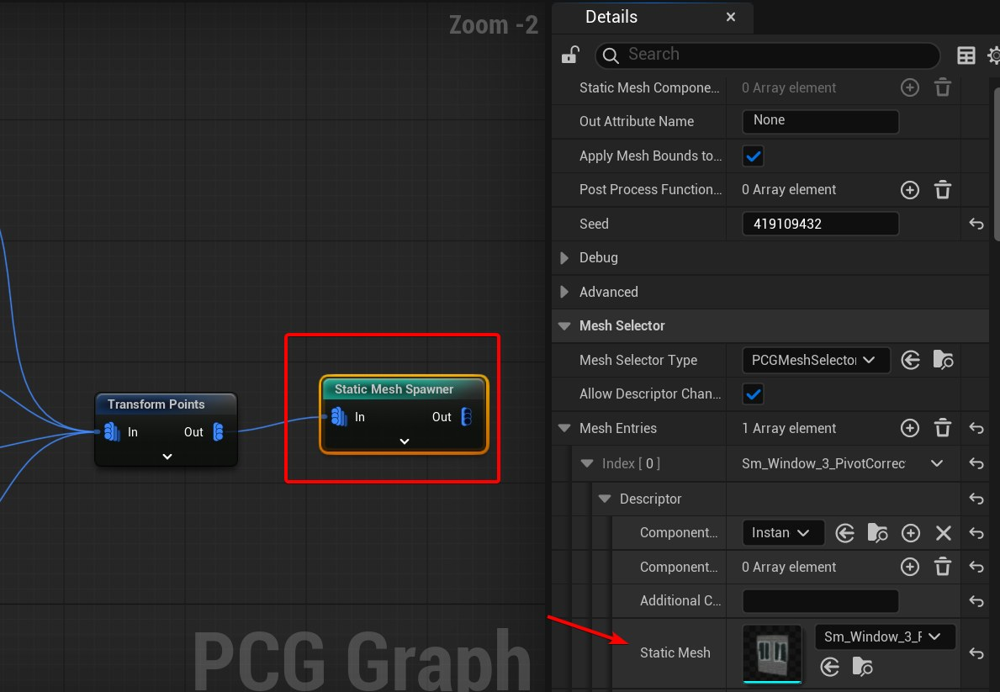

## 测试墙体生成

返回到关卡视口并选择 BP_ProceduralRoom。

现在墙壁应该会沿着地板网格的边缘生成。但是，您可能会注意到方向问题：有些墙壁的方向可能不正确，或者与预期位置旋转了 90 度。

现阶段预期结果：

室内铺设地砖（来自第 3 部分）

墙体片段出现在所有四个边缘

可能存在旋转偏差（详见第 5 节）

墙壁不显示的故障排除方法：

确认所有 4 个差分节点都已正确连接（源输入和差分输入很重要）

检查变换点偏移值是否正好等于图块大小的一半

确认墙体静态网格生成器已分配有效的网格。

使用调试可视化（在“差异节点”上按 D 键）来验证是否检测到了边缘点。

检查您的墙体网格是否使用了第 1 节中的底部中心枢轴点。

下一节将讨论墙体旋转，以确保每个边缘朝向正确。

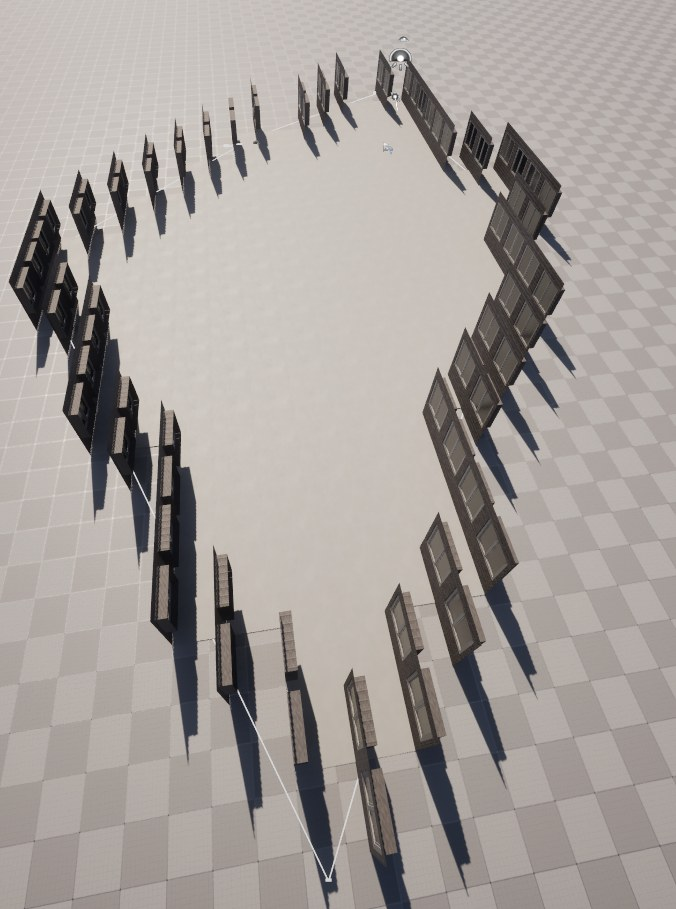

## 墙体朝向和最终调整

第五部分：墙面朝向和最终抛光

## 识别旋转需求

确定轮岗要求

由于墙壁会沿着所有边缘生成，您可能会注意到方向问题。某些墙段可能朝向内侧、外侧或垂直于其预期方向。这是因为静态网格生成器会使用默认旋转角度放置网格，而这种旋转角度很少能与边界边缘对齐。

墙体旋转校正是通过变换点节点向每个差异节点输出提供信号来实现的（在第 4 节第 3 步中添加的节点）。

## 确定哪些边需要旋转

在关卡中选择 BP_ProceduralRoom 并观察墙体放置情况：

沿 X 轴边缘（左侧和右侧）的墙壁可能需要旋转 90 度或 -90 度。

沿 Y 轴边缘（顶部和底部）的墙壁可能需要旋转 0 度或 180 度。

所需的旋转角度取决于您特定墙体网格的默认前进方向。大多数模块化墙体部件都沿其局部 X 轴方向排列，但不同资源包的情况有所不同。

## 对 Transform Points 节点应用旋转

对变换点节点应用旋转

根据第 4 节中差异节点的接线，确定每个边对应的变换点节点：

变换点馈送至差分节点 1 输出：正 X 边（右墙）

变换点输入到差异节点 2 的输出：负 X 边（左侧墙壁）

变换点馈送至差分节点 3 的输出：正 Y 边（顶壁）

变换点馈送至差分节点 4 的输出：负 Y 边（底壁）

对于每个变换点节点，配置 Z 轴上的最小旋转和最大旋转参数，以调整朝向。

旋转值示例（根据您的网格进行调整）：

右侧墙壁（正 X 边） Rotation Min: X=0, Y=0, Z=270

旋转最小值：X=0，Y=0，Z=270

Rotation Max: X=0, Y=0, Z=270

旋转最大值：X=0，Y=0，Z=270

左侧墙壁（负 X 边缘） Rotation Min: X=0, Y=0, Z=(-)270

旋转最小值：X=0，Y=0，Z=(-)270

Rotation Max: X=0, Y=0, Z=(-)270

旋转最大值：X=0，Y=0，Z=(-)270

顶墙（正 Y 边） Rotation Min: X=0, Y=0, Z=0

旋转最小值：X=0，Y=0，Z=0

Rotation Max: X=0, Y=0, Z=0

旋转最大值：X=0，Y=0，Z=0

底壁（负 Y 轴边缘） Rotation Min: X=0, Y=0, Z=0

旋转最小值：X=0，Y=0，Z=0

Rotation Max: X=0, Y=0, Z=0

旋转最大值：X=0，Y=0，Z=0

将“旋转最小值”和“旋转最大值”设置为相同值，则所有点都将应用固定的旋转角度。如果这两个值不同，PCG 会在最小值和最大值之间随机旋转，这有利于产生变化，但不适用于建筑对齐。

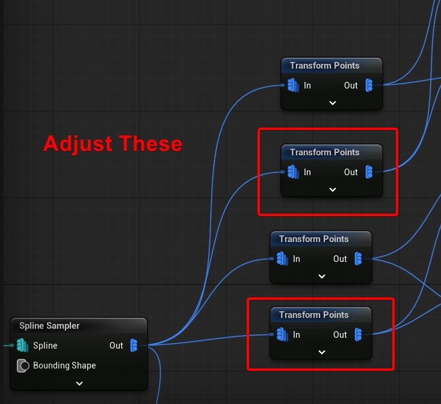

## 必要时调整位置和缩放

必要时调整位置和比例

根据墙体网格的比例，您可能需要进行额外的变换调整：

位置偏移：如果墙体高于或低于地面，请调整变换点节点上的偏移参数：

Offset Min/Max Z：垂直方向升高或降低墙体（例如 Z=15 表示升高 15 个单位）。

Z 轴偏移最小值/最大值：垂直方向升高或降低墙体（例如：Z=15 表示升高 15 个单位）

比例调整：如果墙体高度或宽度不符合设计要求，请修改比例参数：

Scale Min/Max：缩放墙体网格并关闭均匀缩放（例如 X=1.2、Y=1、Z=1 表示长度增加 20%）。

缩放最小值/最大值：缩放墙体网格并关闭均匀缩放（例如：X=1.2，Y=1，Z=1，长度增加 20%）

这些调整是在处理旋转的同一变换点节点上进行的。每条边都可以有独立的变换设置。

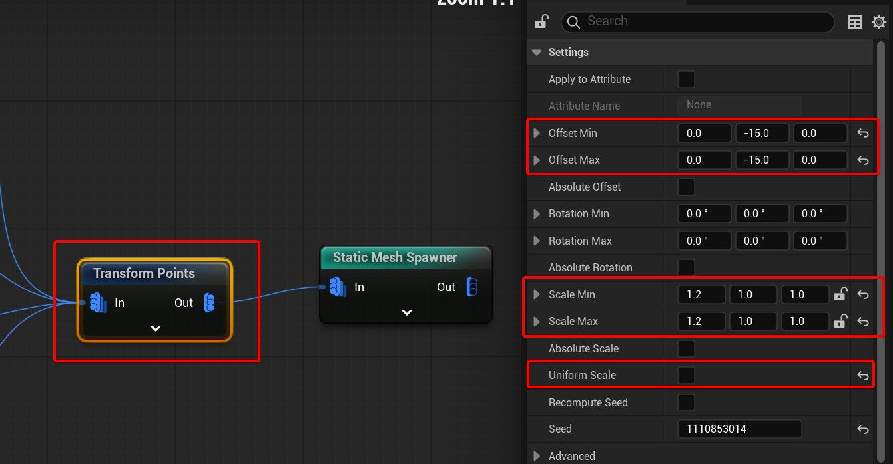

## 迭代测试过程

由于网格的前进方向各不相同，墙体方向通常需要反复试验才能确定：

每次旋转变化后保存 PCG 图

返回水平视口并观察面向墙壁的一侧

如果墙面朝向错误，则返回图表并以 90 度为增量调整该边的 Z 轴旋转角度。

重复此步骤，直到所有墙壁都朝外，远离房间内部。

常用旋转组合：

常用轮换组合：

0度、90度、180度、-90度涵盖了所有基本方位

如果墙面装反了，则加或减 180 度。

如果墙壁垂直，则加或减 90 度。

测试程序化工具

地板和墙体方向正确后，验证工具的动态行为：

重塑样条曲线

在关卡视口中选择 BP_ProceduralRoom。

单击并拖动任意样条线控制点至新位置。地板和墙壁应自动重新生成，无需手动干预即可适应新的边界形状。 Add Complexity 增加复杂性

按住 Alt 键并拖动现有样条曲线点。这将复制该点，创建一个新的角点，并为房间形状增加几何复杂性。

继续添加点，即可创建 L 形、T 形交叉点或不规则多边形。PCG 系统无需修改即可处理任意闭合形状。

验证重新生成

修改样条曲线时：

地板砖应以均匀的间距铺满整个室内空间。

墙体应沿所有边界边缘正确显示，方向也应正确。

相邻墙段之间不应存在缝隙

拐角交叉处可能会出现墙体重叠的情况（这是采用这种设计方法的预期结果）。

性能考量

生产应用中，请监控点密度和网格数量：

面积较大的房间，如果瓷砖尺寸较小，会产生数千个积分，从而影响性能。

对于较远的房间，可以考虑增大图块尺寸或使用 LOD 技术。

PCG 组件的“加载时生成”设置控制房间是在运行时重新生成还是在放置后保持静态。

保存并完成

保存 PCG 图形和蓝图。您的程序化房间工具现已完成，可以用于关卡设计工作流程。

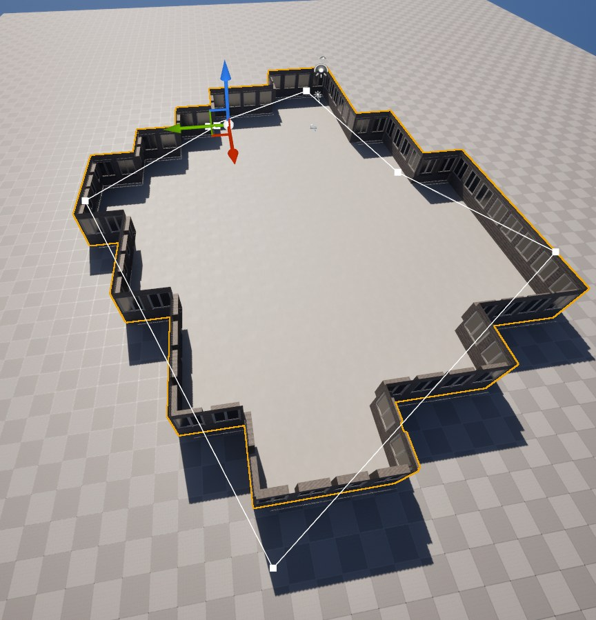

## 结论

现在，您拥有了一个功能齐全的程序化房间生成工具，它基于样条曲线形状定义。通过结合样条曲线采样器、变换点、差分节点和静态网格生成器，系统可以自动生成室内地板网格并检测用于墙体放置的边界边。对样条曲线的任何修改都会触发即时重新生成，从而为构建模块化环境提供快速灵活的工作流程。 What You've Accomplished 你已经取得的成就

本教程涵盖了可用于生产环境的 PCG 工作流程的完整实现：

使用样条曲线和 PCG 组件的蓝图架构，用于模块化工具构建

使用样条采样器生成内部点，并精确控制密度

通过方向偏移和集合差运算进行边界检测

自动生成网格，并保持正确的枢轴对齐和方向

动态再生响应样条形状变化

Key Technical Concepts 关键技术概念

这里展示的技术不仅限于房间生成：

偏移差分边缘检测：此模式适用于任何需要在基于点的系统中识别边界的场景。可用于沿地形边界放置栅栏、在有机形状上进行装饰或生成碰撞体积。

样条曲线驱动的程序化系统：样条曲线为艺术家提供了对程序化输出的直观控制。同样的方法也适用于带有路边道具的道路网络、带有河岸植被的河流或带有支撑结构的输电线路。

点集代数：点集代数的优势在于将空间数据视为可操作的集合。理解差集、并集和交集等运算，无需编写自定义代码即可实现复杂的空间逻辑。 Production Workflow Integration

生产工作流程集成

该工具作为可重用资源集成到关卡设计流程中：

在一个关卡中放置多个 BP_ProceduralRoom 实例以快速搭建场景

在游戏测试期间迭代调整房间形状，而无需重建几何体

版本控制友好：样条点数据高效地存储在蓝图资源中

团队协作：艺术家修改图形，而程序控制图形（PCG）逻辑保持不变。

进一步学习

要进一步深入掌握 PCG：

为了加深您对 PCG 的专业知识：

查阅虚幻引擎官方的 PCG 文档，了解高级节点类型和执行模型。

研究虚幻商城中提供的 PCG 示例项目。

尝试使用元数据属性来驱动条件生成逻辑

研究基于地形的程序化放置系统的 PCG 体积

检查已发布游戏中的生产级 PCG 实现，以寻找实际的架构模式

最后说明

程序化内容生成 (PCG) 将环境美术工作流程从手动放置转变为基于规则的创作。投资构建 PCG 工具将通过迭代速度、一致性和可扩展性带来丰厚的回报。随着您逐渐熟悉 PCG 的点式范式，您将发现机会，在项目中将重复性任务程序化。

您构建的房间生成工具既是一项实用工具，也是理解 PCG 架构的基础。您可以将其作为构建更复杂系统的参考，并大胆尝试各种节点配置和工作流程，以满足您特定的制作需求。
