# 虚幻引擎 5.7 程序化植被

- 来源: https://dev.epicgames.com/community/learning/tutorials/Eve2/procedural-vegetation-in-unreal-engine-5-7

## 介绍

虚幻引擎中的植被工作流程传统上依赖于静态植被资源，一旦放置到场景中，可控制性就十分有限。虽然这些方法在背景装饰方面效果显著，但在处理风力交互、变形或大规模程序化环境时，其灵活性却十分有限。

虚幻引擎 5.7 引入了更新的程序化植被工作流程，允许植被资源由骨骼结构而非静态网格驱动。这使得对树干、树枝和树叶进行精细控制成为可能，同时通过 Nanite 渲染保持高性能。

在本教程中，您将使用虚幻引擎 5.7 的程序化植被和 PCG 工作流程来设计森林环境。您将探索骨架植被资源，配置其结构参数，并使用 PCG 将其部署到景观中。最终将创建一个茂密、性能优异且具有清晰人为特征的森林环境。

## 学习目标

完成本教程后，您将能够：

检查并了解骨架状植被资产

在虚幻引擎 5.7 中启用和配置程序化植被功能

利用数据驱动图修改植被结构

控制枝条密度、重力、尺度和叶片分布

使用蓝图手动放置骨架植被

利用 PCG 在景观中部署植被

## 活动 1：启用所需的插件和项目设置

打开虚幻引擎 5.7，创建一个新的空白项目，本教程将使用此项目。导航至“编辑”菜单并打开“项目设置”，然后搜索“Nanite Foliage”并启用其实验性选项。此时请勿重启引擎，因为还需要启用另一个必要功能。

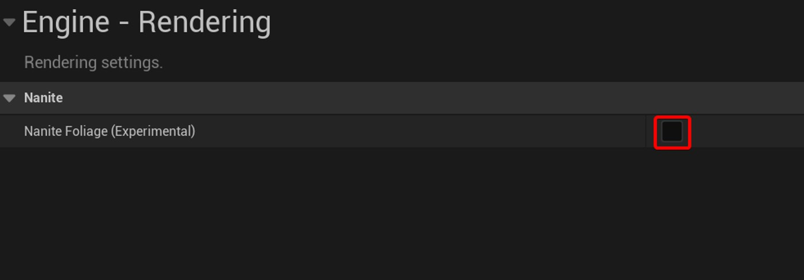

Nanite Foliage 设置

返回“编辑”菜单并打开“插件”窗口。搜索“程序化植被”，启用该插件，然后重启引擎一次，使两项更改同时生效。重启后，请确认设置完成再继续。

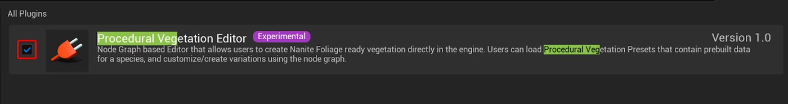

Required Plugins 所需插件

## 活动 2：探索程序化植被样本内容

打开内容抽屉，点击面板右上角的齿轮图标。启用“引擎内容”和“插件内容”，以便所有内置的示例资源和插件文件夹都显示在内容抽屉中。

Enabling Sample Content 启用示例内容

## 活动 3：检查骨架植被资产

活动 3：检查骨架状植被资产

导航至“引擎”→“插件”→“程序化植被编辑器”下的“程序化植被编辑器示例资源”文件夹，浏览可用的资源和示例关卡。打开“Asset_Zoo”关卡，在进行任何更改之前，观察系统在完整环境中的运行情况。

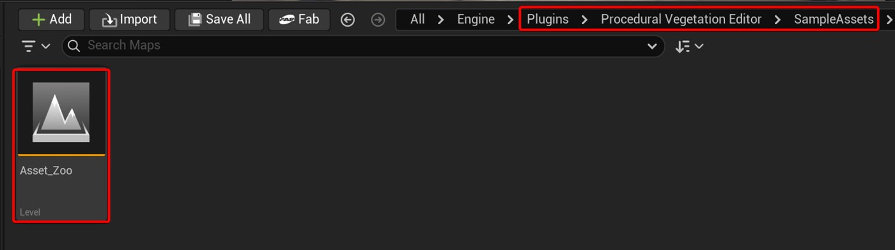

程序化植被示例场景

从示例内容中打开一个植被资源，例如 Tree_Common_Hazel_01 或 Tree_European_QuakingAspen_01，并检查其骨骼网格体资源。请注意，该资源是一个骨骼网格体而非静态网格体，其骨骼层级结构从根部延伸至树干、树枝和树叶。

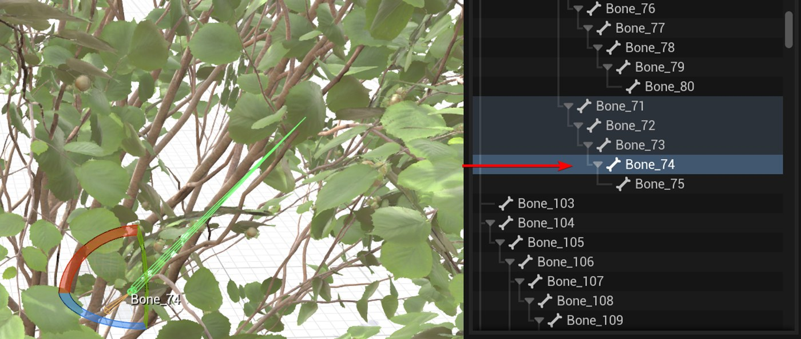

树状骨架网格层级

## 活动 4：使用数据图控件调整植物形状

打开与所选树木关联的程序化植被资源，并切换到图表视图。可以看到，图表被划分为多个水平部分，每个部分都标有同一植物的不同变体。这些变体代表不同的结构，用于在将植被放置在环境中时引入自然的视觉变化。

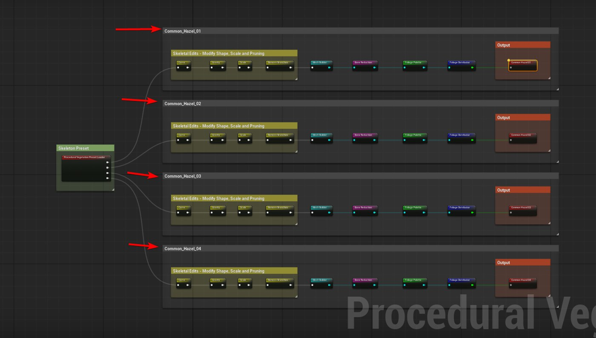

Procedural Vegetation Graph

程序化植被图

以下简要说明程序化植被图中使用的主要节点。您可以将其作为参考，并在探索该图时尝试不同的值，以观察每个节点如何影响最终结果。

曲线：决定树木从下到上哪里粗壮或稀疏，哪里枝条较多或较少。

重力：控制树枝向下垂落的程度，而不是笔直向前伸展。

比例尺：使整棵树变大或变小。

移除树枝：随机移除一些树枝，使树看起来不会太拥挤或杂乱。

网格构建器：将骨架转换为实际可见的树枝，并决定树枝的平滑度。

骨骼减少：控制树木的“关节”数量，使其能够在风中平稳或更加僵硬地摆动。

树叶调色板：选择用于构建树木的树叶和小树枝部件。

叶片分布器：决定树上叶片的位置和数量。

输出：保存最终的树，以便将其放置在关卡中。

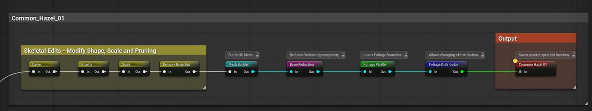

Procedural Vegetation Nodes

程序化植被节点

## 活动 5：了解骨架植被的放置限制

活动 5：了解骨骼植物的放置限制

骨架植被模型与传统的静态植被模型表现不同。直接将这些模型拖入关卡中，虽然植物在视觉上可以显示，但无法正确应用风力、形变或其他动态效果。这会导致植被看起来静止或没有反应，即使它们的设计初衷是支持运动。

这些资源依赖于骨骼评估，类似于虚幻引擎中动画角色的运作方式。为了确保风和动画系统得到正确评估，必须使用蓝图或程序控制图形 (PCG) 工作流程来放置骨骼植被。使用这些放置方法可以确保植被按预期运行，并在环境中自然地做出反应。

## 活动 6：使用蓝图手动放置骨架植被

在某些情况下，可能需要手动放置单个树木，而不是依赖程序自动放置。这对于需要精确控制位置和比例的主要素材、前景树木或特定构图非常有用。由于骨架植被不能像静态树叶那样直接放置，因此需要使用蓝图来正确处理放置过程。

创建一个新的 Actor 蓝图，并添加一个实例化骨骼网格体组件。指定所需的骨骼植被资源，并设置风变换提供程序，使树木能够响应风力，然后滚动到实例部分，单击加号 (+) 按钮添加实例。编译蓝图，将其放置在关卡中，并确认树木出现并能自然地响应风力。

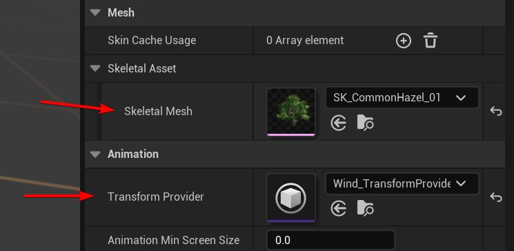

指定骨骼网格和变换提供程序

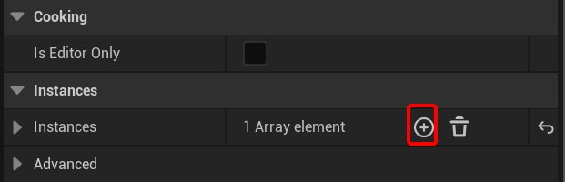

Creating a New Instance 创建新实例

## 活动 7：使用示例 PCG 图填充关卡

活动 7：使用示例 PCG 图填充级别

创建一个新关卡，清晰地展示大规模植被的分布情况。使用开放世界关卡，以便提供足够的空间来观察程序生成的植被在广阔区域内的生长情况。

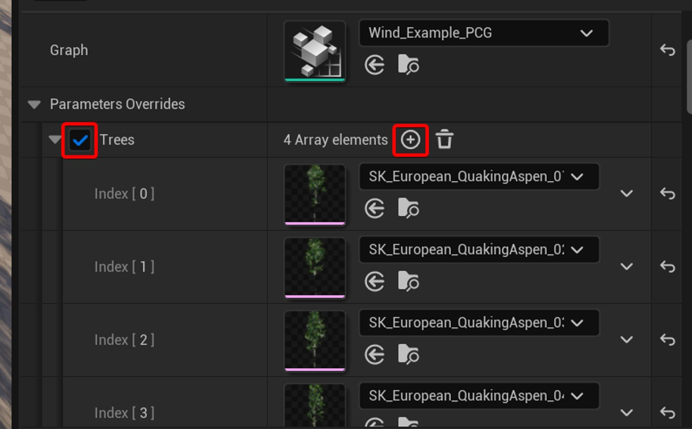

替换/添加 PCG 图中的树木

在 PCG 图中替换/添加树木

缩放 PCG Actor 以填满整个关卡。将 PCG Scale 设置为 X=1000、Y=1000、Z=100，使植被均匀覆盖地形。观察森林如何根据更新后的 PCG 设置自动生成。

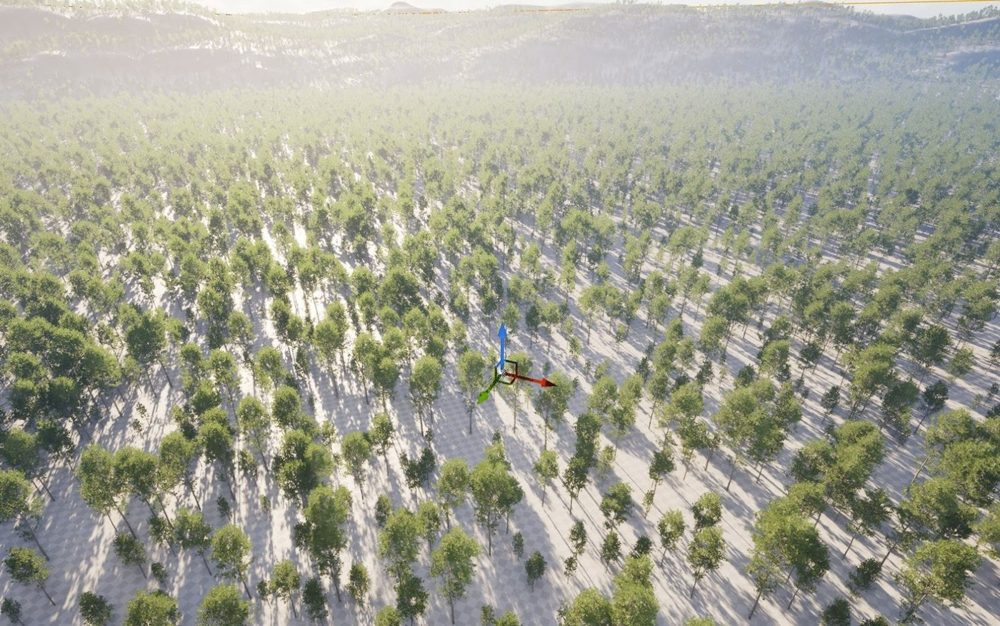

Creating Our Forest! 创建我们的森林！

## 活动 8：应用全局风场和季节变化

活动 8：应用全球风场和季节变化

在“程序化植被示例资源”->“材质”->“GlobalFoliageActor”文件夹中找到“全局植被 Actor”。将其拖放到关卡中。此 Actor 控制场景中所有受支持植被的风力和季节性变化，允许全局应用更改，而不是针对单个资源进行更改。

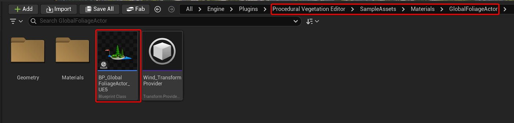

全球植被作用点的位置

调整风速和弯曲度值，以控制树枝和树叶的摆动。使用适中的数值可以实现自然的运动效果，因为树叶通常比树枝的反应更强烈。调整季节强度参数，可以在森林中引入微妙的色彩变化，打破视觉上的单调感，增强环境的真实感。

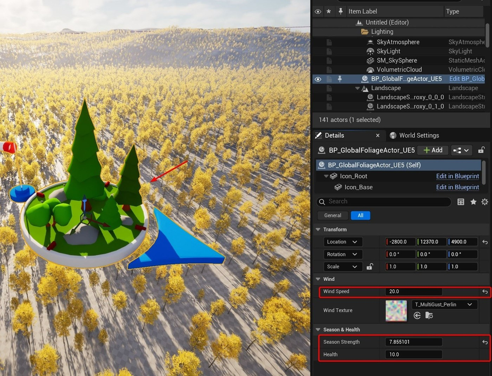

全球植被作用体的特性

## 获得更好结果的技巧

使用程序生成植被时，每次只调整一个设置。这样更容易理解每​​个参数如何影响最终结果，并防止对场景造成意外更改。

首先关注影响较大的控制参数，例如整体规模、枝条密度和风力强度。这些设置决定了植被的整体外观和运动状态，之后才能添加精细的细节。

定期从不同距离和角度观察环境。近看正常的植被，从远处看可能显得过于茂密或重复，尤其是在大型的电脑特效生成区域。

在试验过程中，保存不同的设置方案。这样可以方便地比较结果，并在某个调整未达到预期效果时轻松恢复原状。

## 常见问题排查

如果植被看起来静止不动或没有反应，请确认其是否使用蓝图或 PCG 工作流程放置。如果直接将骨架植被放置在关卡中，则无法正确评估风力或形变。

如果在复制或重新添加 PCG 角色后，树木恢复为默认资源，请重新启用参数覆盖并重新分配所需的植被资源。重置 PCG 角色时，出现此行为属于正常现象。

如果植被密度在不同层面上出现不一致的情况，请检查 PCG 标度值和表面采样器设置。这些值的微小变化都可能显著影响分布。

如果性能下降，请先降低树枝密度、树叶分布或骨骼数量，然后再降低整体比例。这些调整通常能在保持视觉质量的同时，显著提升性能。

## 后续步骤和进一步探索

运用本教程中介绍的技巧，设计一个属于你自己的小型环境。村庄空地或湖泊场景都能很好地平衡程序生成和手动放置之间的关系。

尝试使用程序生成图（PCG）禁区在森林中创建可控空间。这些区域可用于修建道路、建筑物或集会场所，同时保持周围植被的程序生成特性。

尝试叠加多个 PCG 图，将背景森林与前景细节区分开来。这种方法能提供更大的艺术控制力，并有助于引导观众的注意力在环境中游走。

随着信心的增强，探索程序化植被如何在虚幻引擎 5.7 中与光照、Lumen 和 Nanite 工作流程相结合，以进一步提高视觉质量和性能。

## 结论

在本教程中，您探索了使用虚幻引擎 5.7 创建大规模植被环境的现代方法。通过使用骨架植被资源、程序控制和基于 PCG 的放置，您学习了如何生成茂密、动态的森林，使其能够自然地对风和环境设置做出反应。

您研究了植被资源的构建方式、程序图如何控制形状和分布，以及程序图如何使整个环境在大面积景观中高效地填充植被。这些工作流程展示了程序化技术如何在保持视觉一致性和性能的同时，显著减少人工操作。

有了这些基础，您现在就可以构建和定制自己的森林环境了。通过不断尝试不同的植被参数、PCG 设置和环境光照，您可以将此工作流程应用于各种实时项目，从交互式体验到电影场景。
