# 技术美术师的 PCG 指南

- 来源: https://dev.epicgames.com/community/learning/knowledge-base/KP2D/unreal-engine-a-tech-artists-guide-to-pcg

如果你想找一些更温和的方式来学习如何使用，可以看看 Adrien 的入门教程（ 链接在此） 。如果你想先了解一些基本知识，那就继续往下读吧！

## 首先，让我们摒弃一些旧观念。

Epic Games 在 5.2 版本首次公布 PCG 时，我们用精美的 Electric Dreams 演示了它。虽然我觉得那段演示非常棒，但我也认为我们不小心给玩家们留下了对 PCG 的错误印象，所以让我澄清一下：

PCG 不是一种林业工具。

PCG 可以 造林 ，但它不是一种造林工具。

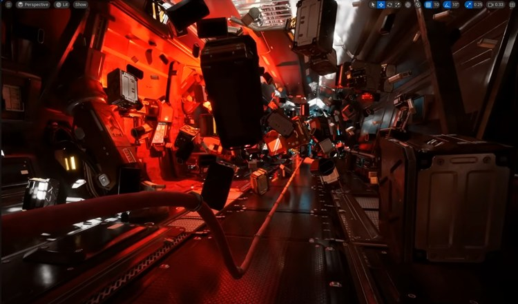

它可以用于打造建筑区域或细化室内装饰，正如我们最近的 卡西尼样品 所示。

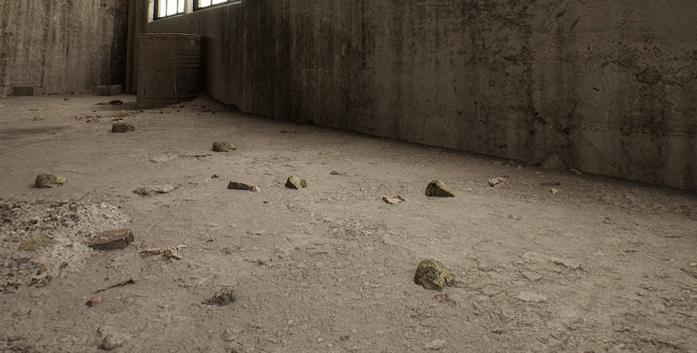

或者，它还可以通过添加微散射来为场景增添细节，而这些微散射无需您进行管理……

它可以用来开辟出一条条路径，让你在游戏设计师想要把所有东西向右移动几个单位时，不会受到精神伤害……

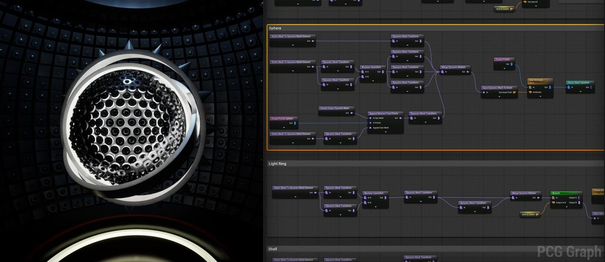

或者，它还可以用于在您的世界中动态生成网格，从而实现更具针对性的关卡设计工具。

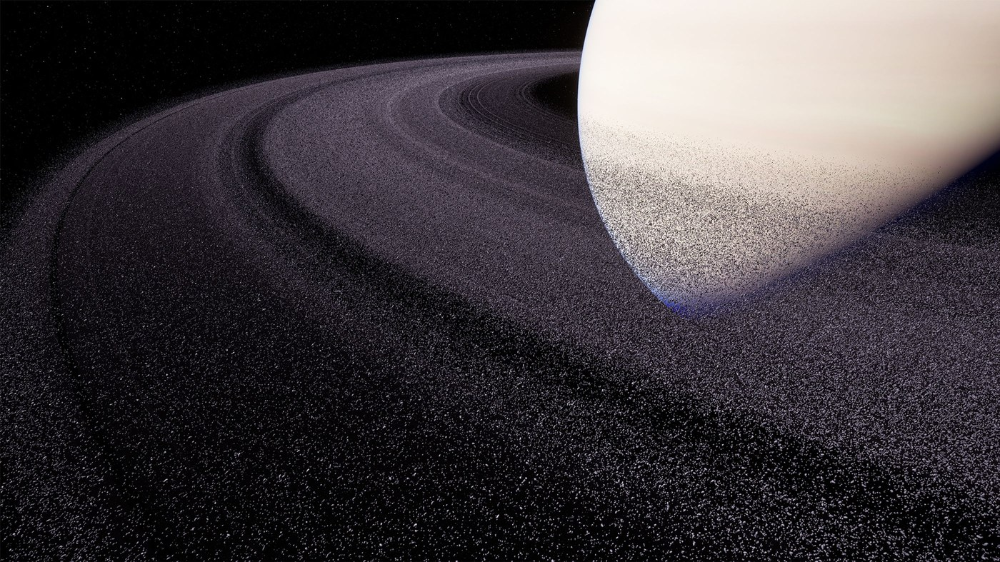

我们甚至在最近的 Cassini Sample 项目中用它生成土星环。归根结底，你最需要知道的是：PCG 处理的是空间数据，用这些数据运行逻辑来评估世界并增强工作流；有时这会表现为构建一个森林工具。它甚至不一定要在编辑器中运行：既可以实时运行，也可以提前烘焙结果。基于这些特性，我认为它最终会出现在几乎所有流程中，因此团队需要知道如何正确使用它。

## 基础概念

在拆解这些基础概念之前，先看一个三节点 PCG 系统作为视觉参考：我们获取 Landscape Data，将其传给采样器，然后通过 Static Mesh Spawner 生成网格。

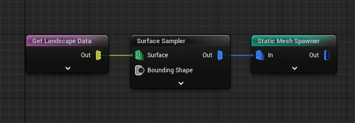

PCG 中经常出现两个概念，理解它们会帮助你把握整体：Spatial Data 和 Concrete Data。PCG 主要处理 Spatial Data，通常表现为 Points。Points 是几乎所有 PCG 教程最先遇到的内容，也是你最常操作的数据。点可以携带任意需要的元数据（后面会讲到元数据）。

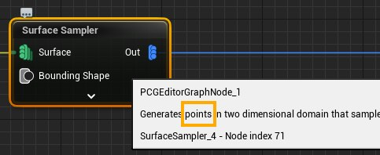

Points、Landscapes、Splines 和 Volumes 都属于 Spatial Data。Concrete Data 之所以这样命名，是因为它为 Spatial Data 提供具体证据。从概念上说，Concrete Data 是所有 Spatial Data 类的基类，而这些类都可以衰减为 Points 供我们处理。一直谈“Data”很容易混乱，那么最初的 Concrete Data 从哪里来？它可以来自多种来源：PCG 中的 Landscape Data、Spline Data、Water Data 和通用 Actor Data 节点都能访问这些数据。

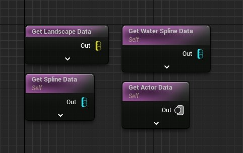

用于访问 Concrete Data 的节点

这些数据可以按 Class 或 Actor Tag 收集。Class 很容易理解（例如“获取所有道路”），而 Actor Tag 对很多人来说较新。世界中的任何 Actor 都可以设置任意数量的标签，这些标签是你为项目定义的字符串。例如，可以用 `RemovePCG` 标签找到所有希望 PCG 在附近移除的对象。

关于数据还需要了解 Attribute Data。Attribute Data 的特别之处在于，它是无法转换为特定点的数据。它常用于数据表，例如 Data Table 中每一列都会成为一个不同的 Attribute。在 Cassini Sample 中，可以看到 Attribute Data 用来存储每个候选模块的信息。

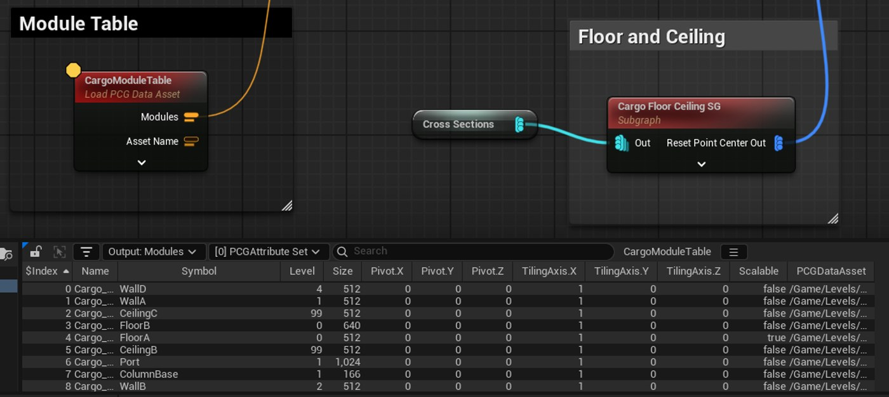

`CargoModuleTable` 在 Cassini Sample 中保存模块数据，这些数据以通用 Attribute Data 的形式保存。它没有 transform、size 或其他可用于创建点的信息。

## 调试你的图

在任意节点上按 `D` 可以可视化调试图在该位置的执行结果。如果没有看到任何内容，可能需要在图左下角选择要调试的 PCG 组件。

选中节点后按 `A` 会在面板中显示该节点的属性。这个面板会列出所有属性，非常适合查看图中不同阶段到底发生了什么。

如果您想加载一个示例关卡来更深入地了解 PCG 的内部机制，可以从 PCG 插件内容文件夹访问示例关卡。从这里开始： /PCG/SampleContent/SimpleForest/SimpleForest.SimpleForest

## 工作流程

## 基于体积

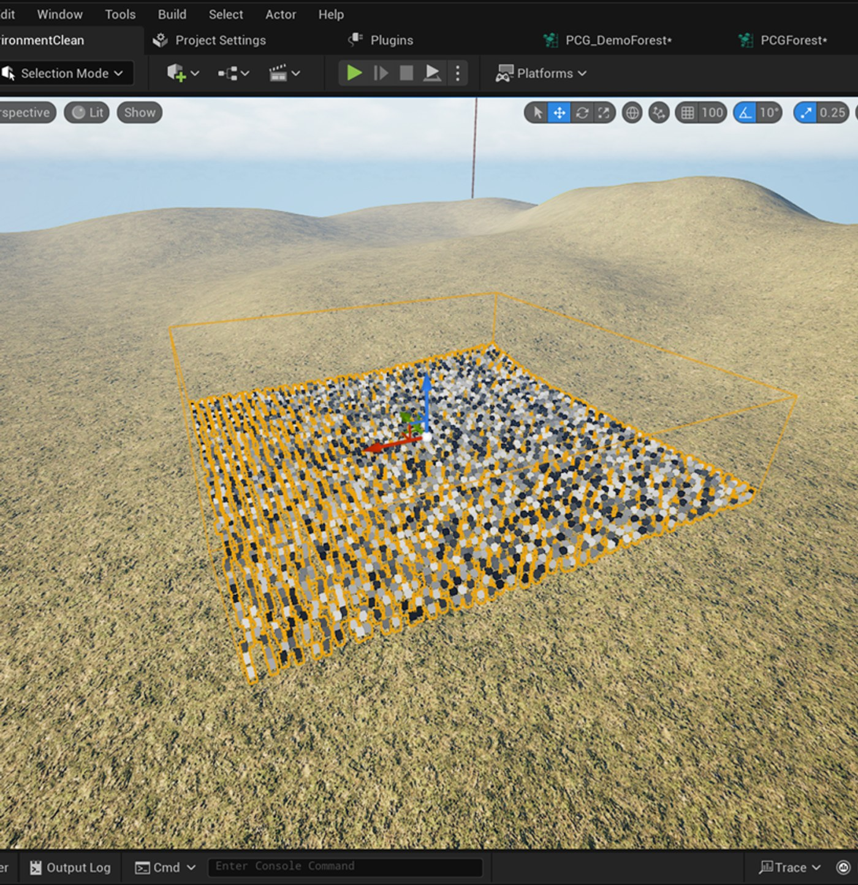

体积 是将 PCG 资源拖入场景时默认创建的 PCG 实现方式。它们可用于表示一个大致区域，以便在该区域内生成点，例如森林。

## 基于组件

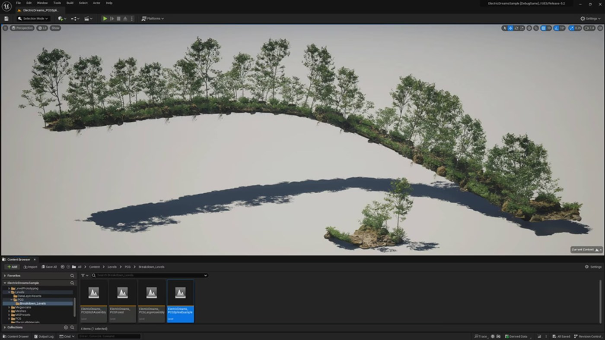

PCG 系统可以通过 组件 关联到角色。这样做的好处在于，它可以将角色的美术设计与逻辑逻辑分离。此外，它还可以轻松实现微调：例如，办公室里的每张桌子都可以随机排列，从而产生独特的变化。

## 从其他 PCG 系统激活

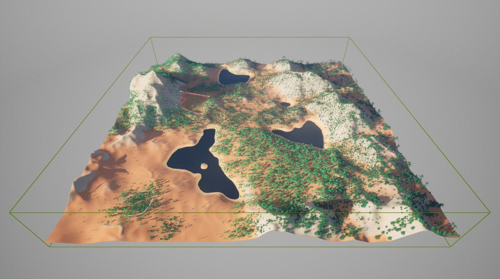

每个 PCG 系统都有一个 输出 节点。如果有其他程序连接到该节点，系统实际上会将 PCG 图的输出缓存起来，允许 另一个 PCG 图访问这些数据。这意味着你可以拥有一个宏系统，它可以从所有较小的系统中收集信息，并根据它们执行的操作来执行相应的操作。

例如，你可以在世界中分布多个生物群系组件，然后使用一个最终的宏组件将这些子生物群系融合在一起。PCG Biome Core 插件 中实现了这个功能 ， 但我强烈建议你在熟悉 PCG 的其他基础知识之后再去研究它，因为它相当复杂！

## 将关卡实例作为 PCG 工作流

放置网格固然不错，但要实现高保真效果，您可能需要更模块化的方法。为此，您可以将 关卡实例信息 加载到 PCG 中，并放置基于该信息生成的网格。这意味着您可以用更少的网格创造出更多由艺术家主导的丰富变化。为了实现这一点，我们利用了 PCG 数据资产 。

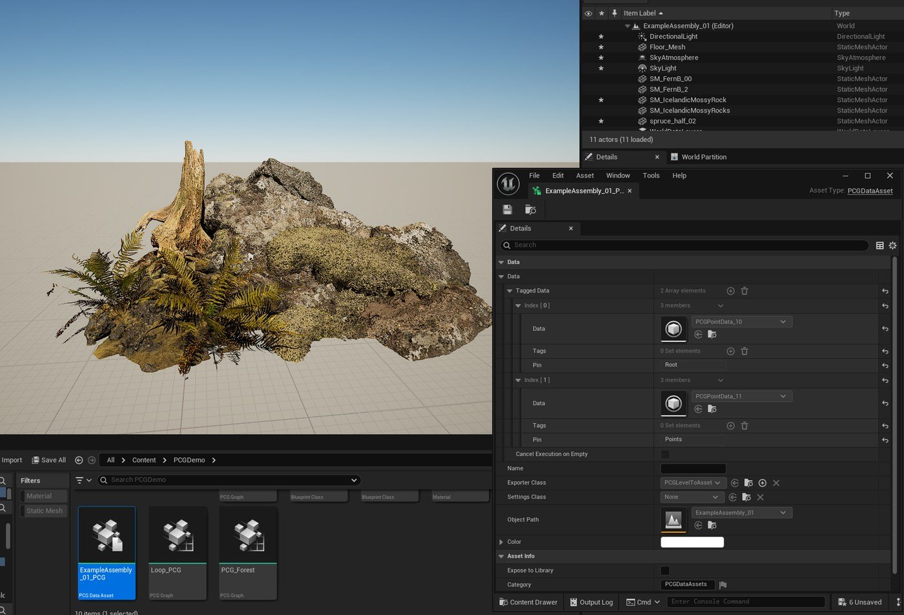

除了能够对关卡实例中的网格进行采样之外，你还可以访问 Actor 标签数据 。这意味着你可以为树木添加“KeepVertical”之类的标签，防止这些资源采用地面法线，或者添加“Clutter”之类的标签，在每个节点上随机过滤掉资源。

![highlighted fern mesh in the Viewport. Details panel open. The field for the Actor Tag Index [0] is Clutter.](assets/images/tech-artists-guide-to-pcg-14.jpg)

完整的工作流程请参见文章开头的 PCG 视频。

另一个有趣的方面是，PCG 实际上可以 生成 数据资产。在卡西尼采样中，你会看到它实际上收集了给定卷中的层级实例，并将它们全部添加到数据列表中，供另一个 PCG 系统进行采样。

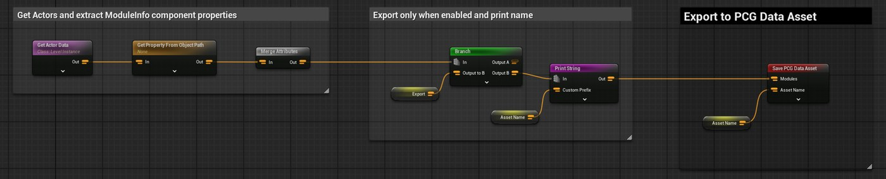

在卡西尼样本的 KitBuilding PCG 图中可以发现这种现象。

## 层级生成

人们在评估 PCG 时常常忽略的一个主要功能是 分层生成 (HiGen )。虽然 PCG 通常会生成静态资源，但预先创建世界中的所有资源未免过于繁琐。为什么要缓存每一根草叶呢？为此，您可以利用 HiGen。

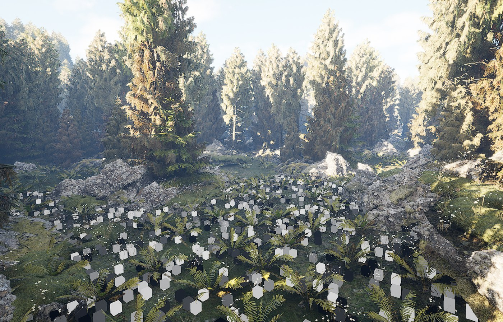

在这里，小花（调试立方体）是在比蕨类植物更小的网格上生成的。

启用分层生成后，PCG 会动态运行，仅当玩家位于指定距离内时才会生成。您可以使用 网格大小 节点为 PCG 图中的特定生成资源指定网格大小，从而实现丰富的自定义选项。这需要在关卡中启用 世界分区 ，并在 PCG 图中启用 “使用分层生成” 。

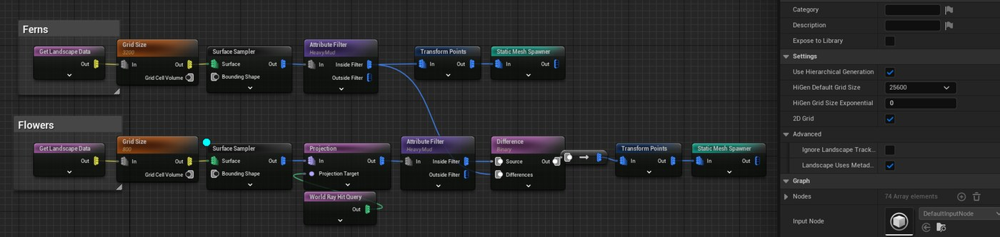

这是在上一张图中散布蕨类植物和花朵网格的图表。

示例级别： /PCG/SampleContent/HiGenForest/HiGenForest.HiGenForest

## 其他重要信息

## 投影/世界追踪

沿样条曲线进行球形投射，以查找路径附近的点

您可以通过 世界轨迹 节点或 投影节点 将点投影到其他数据上。这样，您就可以执行诸如将点放置到地形上或将网格（例如草地）放置在其他网格表面上之类的操作。

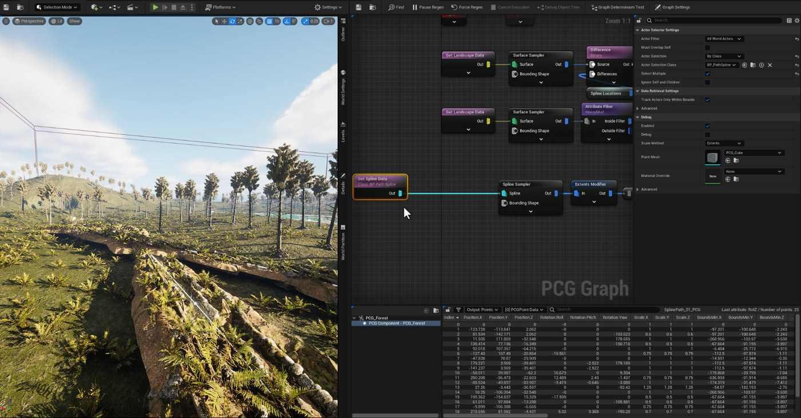

PCG 沿样条线放置网格，不进行投影。

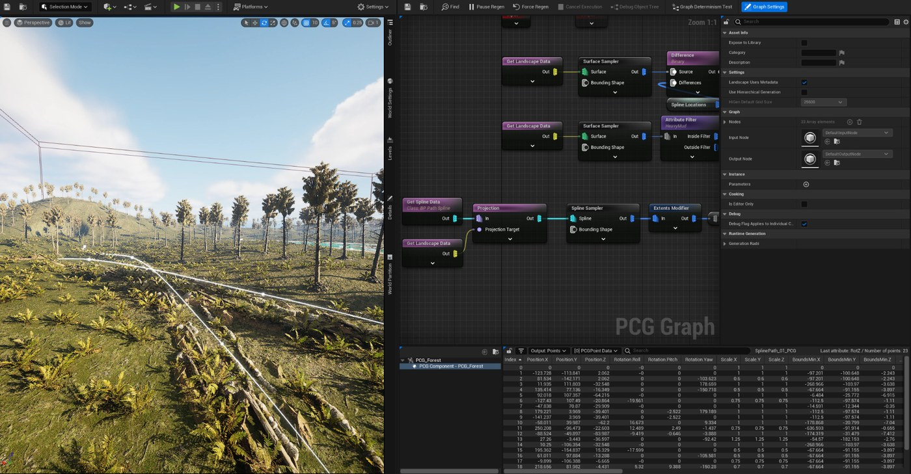

PCG 沿样条线放置网格，并投影到地形上。

## 自定义 PCG 节点

如果 PCG 无法实现某些功能，您可以通过三种方式自行实现： 使用 Blueprint 、 C++ 或创建可嵌入其他 PCG 系统的 PCG 子图 。对于 Blueprint 或 PCG 子图，您可以在 PCG 内容插件文件夹 中查找现有或已弃用的节点、子图和示例。

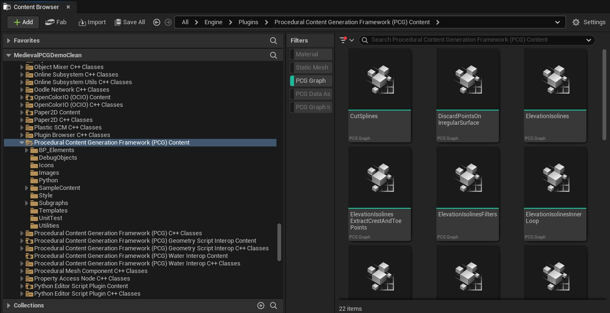

## 自定义 HLSL

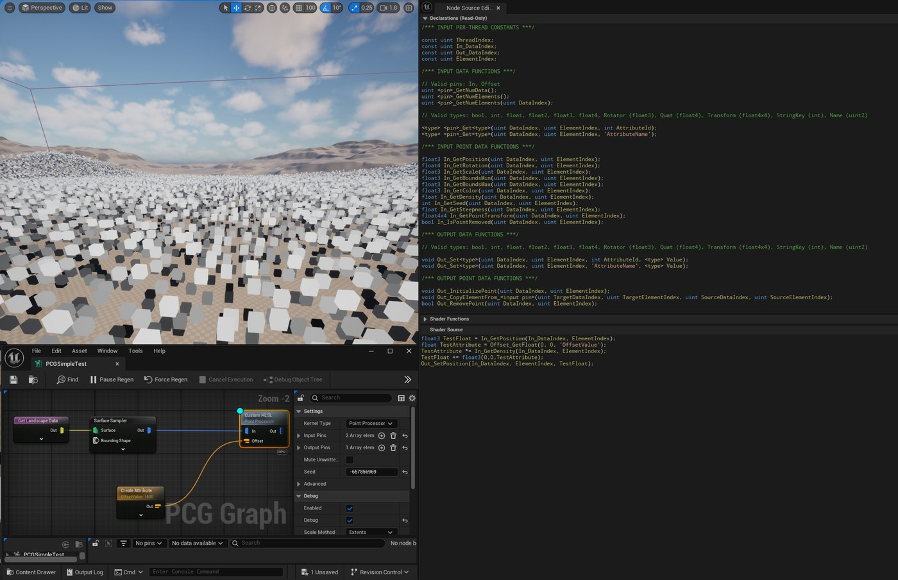

这里使用 HLSL 将点随机提升到距离景观一定距离的位置。

如果您认为直接编写代码可以更快地完成任务，或者某个任务更适合由 GPU 而非 CPU 处理，那么您可以借助 自定义 HLSL 节点来实现 点生成 或 点处理 ！自定义 HLSL 节点会提供一个方便的 声明 列表，其中包含可用于当前输入的声明。对于复杂的数学运算、循环或需要大规模执行的操作，这不失为一个好方法。

## 循环

PCG 图可以创建并 循环 处理数据集。这意味着您可以将数据拆分成多个步骤，分别处理每个步骤，然后再将它们合并。这对于处理节点需要根据不同变量获得不同输入的情况非常有效。您可以简单地按变量进行分区，运行包含相应指令的循环，然后再将它们合并起来。

## 递归图

PCG 支持的一个非常酷的功能是将图嵌套在自身内部。本质上，这允许你创建类似于“ while ”循环的功能。下面，我将一个循环嵌套在自身内部，该循环会复制自身几次并将复制的节点分散开来。这些复制的节点会重复相同的操作，直到达到所需的递归次数。这可以模拟出幼苗被附近更高更老的植物栽种后生长出来的样子。

递归可以用来不断地将点向自身周围扩散，以模拟种子生长。

## 语法

您无需复杂的节点设置来处理逻辑规则；相反，您可以利用一种称为 “语法” 的概念。借助语法，您可以设置诸如“每扇门两侧都需要一堵墙”或“底层必须标记为‘地面层’，顶层必须标记为‘屋顶’，才能在选定的网格集之间切换”之类的规则。

示例级别： /PCG/SampleContent/Grammar/GrammarSample.GrammarSample

示例项目： 卡西尼示例 会在“语法”PCG 文件中生成房间和走廊。这可能有点复杂，所以我建议您先看看一些更基础的示例！

## 收集节点

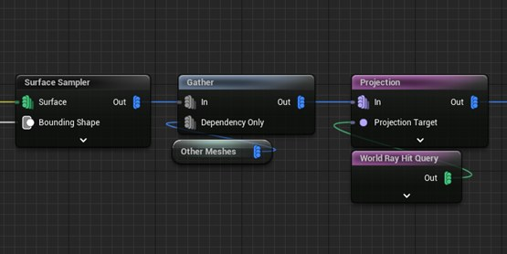

有时，在 PCG 系统中执行某些操作会依赖于 PCG 系统中的 其他 操作。在这种情况下，可以使用 “聚集” 节点使该部分操作等待，直到所有依赖关系都满足。一个很好的例子是将点投影到放置在世界中的网格上。如下所示， 未使用 “聚集”节点的 PCG 放置的岩石下方会生成 PCG 放置的蕨类植物，而 使用 “聚集”节点的岩石则被这些蕨类植物覆盖。

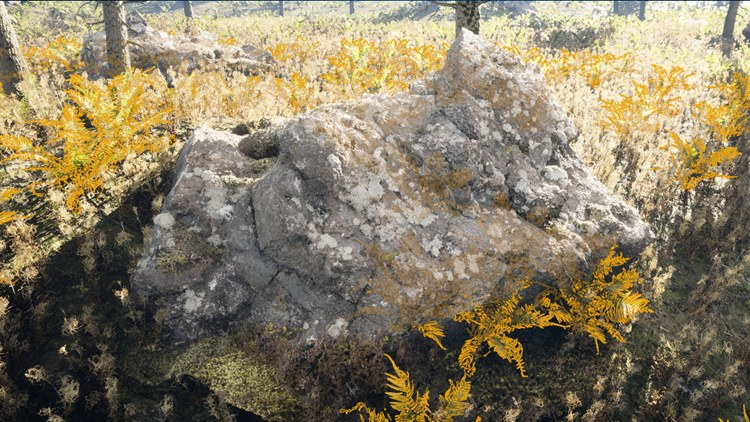

无需运行 Gather 节点

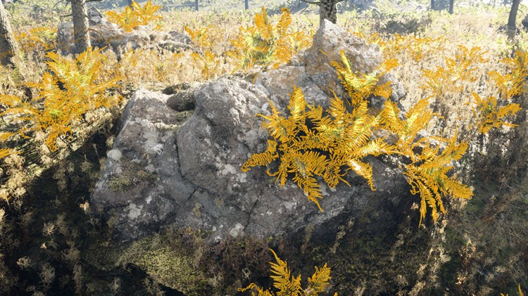

运行 Gather 节点

需要注意的是，在 5.6 及更高版本中，由于节点会添加依赖项输入，因此收集节点将不再像以前那样频繁使用。

## 忽略不规则表面上的点

## 忽略不规则表面上的点

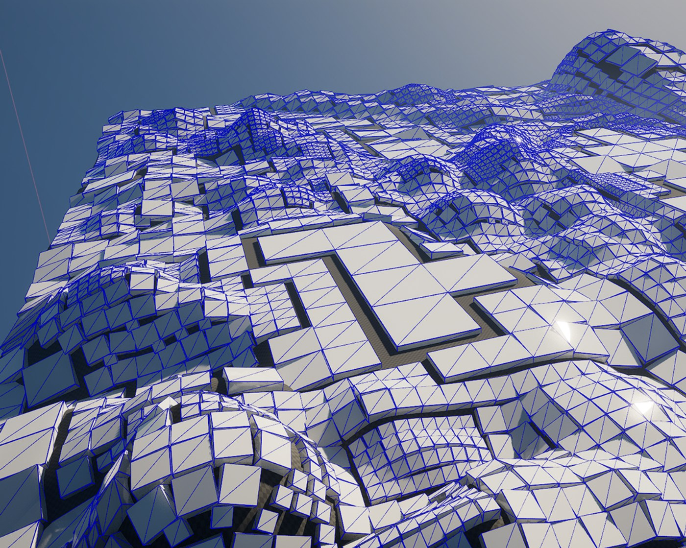

“忽略不规则曲面上的点 ”子图旨在移除超出物体边缘的节点。它使用第一个对象的边界，因此通常最好对数据进行分区，并从该点开始 向下 缩放每个数据集。

有一点需要注意，这让我有些意外：图中的 Union 节点实际上会考虑连接顺序。不过，节点本身并不显示操作顺序。这个问题已在 5.6 版本中修复，新版本会更清晰地显示操作顺序。

示例级别： PCG/SampleContent/FlatnessDetection/FlatnessDetectionLevel.FlatnessDetectionLevel

## 匹配和设置属性

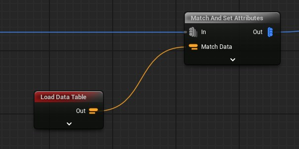

Match And Set 节点从数据表中加载要设置的信息。

“匹配和设置属性” 节点允许您从一个数据集中的一个属性中采样数据，在另一个数据集中查找该属性，然后将该数据应用到该点。例如，您可以：保存建筑瓦片类型的尺寸，为每个点随机分配一个瓦片类型，然后查找相关的瓦片信息，并根据瓦片类型字符串标识符应用该瓦片信息。

匹配和设置属性的另一个方面是，它允许您搜索与集合中某个属性最接近的属性，从而可以轻松地根据浮点值设置准则。

最后，如果没有提供匹配的值，则可以随机分配属性数组中的任意值。这对于在各个点上随机分配数组属性值非常有用。

## 等值线

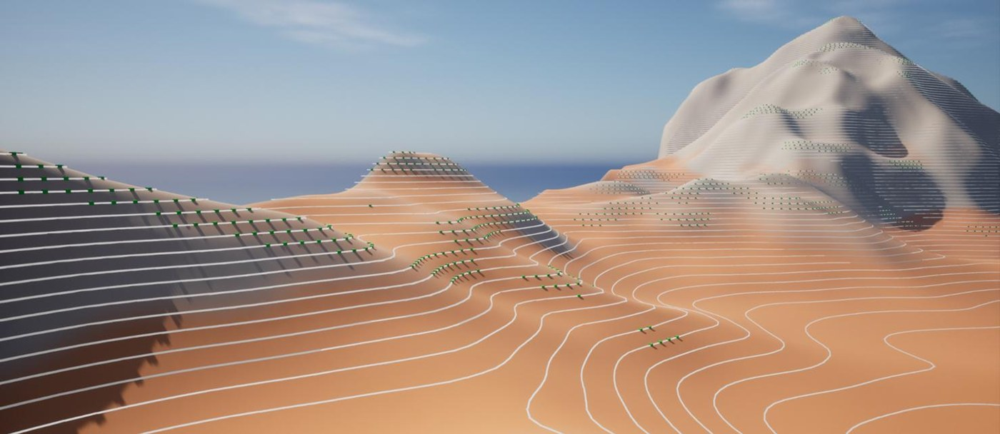

Isolines 节点可以从地形中提取高度数据，用于推导更多信息。这对于在边缘附近和斜坡上精确放置资产很有用。输出可以按每条等值线生成点数据或样条数据，并可控制最小高度、最大高度、增量和分辨率。

## 自定义样条元数据

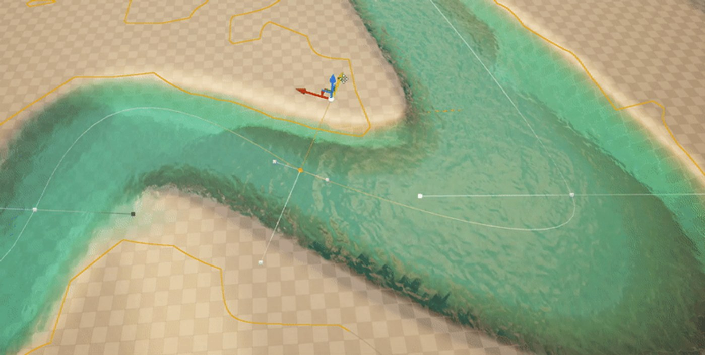

水样条曲线包含可通过 PCG 水体互操作插件进行采样的自定义数据。

样条曲线 是关卡设计中极其强大的工具，但有时如果它们能包含更多信息就更好了。虽然这不是 PCG 的一项功能，但了解它对于在 PCG 中加以利用非常有价值。一个很好的例子是内置的 水体插件 ，它包含 水流速度 、 河流深度 、 河流宽度 和 音量等信息 。如果您正在为您的项目构建更强大的工具集，那么这是一个您可能尚未考虑过的绝佳选择。

## 寻路

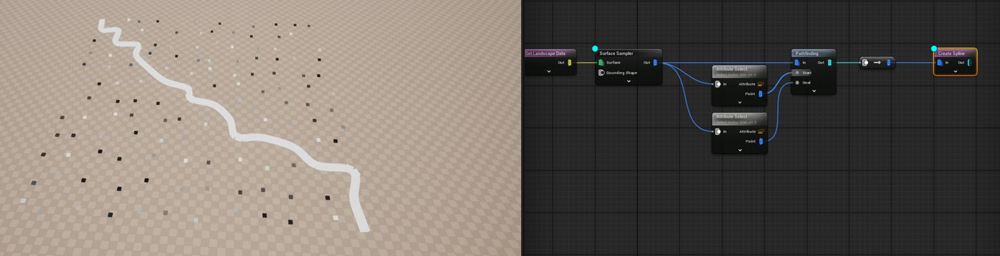

数据集的第一个索引和最后一个索引会生成它们之间的路径。

可以使用路径 查找 节点读取一系列点并找到它们之间的路径。在上面的示例中，正在两个点之间创建样条曲线。虽然这是一个任意的点序列，但它也可以读取道路样条曲线信息或其他数据，并在该数据集之间进行导航。

## 性能

PCG 的一个优点是它会生成很多东西，但这可能会很可怕，因为 它会生成很多东西 。

首先，请注意 静态网格生成器 节点不会创建静态网格 Actor，而是填充一个 实例化的静态网格 组件，该组件会被烘焙出来。这意味着，就开销而言，静态网格生成器的运行时性能与在场景中绘制植被基本相同。但是，请务必检查以下内容：

注意碰撞检测： 请记住，与不带碰撞检测生成的网格相比，带碰撞检测生成的网格会增加大量的性能开销。请谨慎选择何时以及在何处使用碰撞检测。

利用 GPU 生成模型可以加快创建速度： CPU 生成模型比 GPU 生成模型消耗更多资源。但需要注意的是，GPU 生成模型不包含碰撞检测，因此这些模型不会出现在光线追踪场景中。

尽可能预缓存数据： 如果您运行的是 HiGen 算法，预缓存带标签的数据可能会有所帮助，这样最终生成时只需运行简单的指令即可。此外，运行 HiGen 算法也会产生一些运行时开销。

## 使用分析器

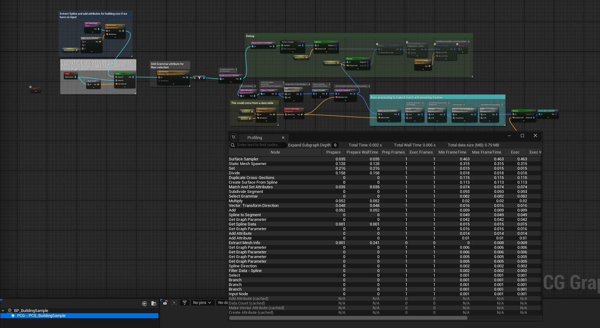

一如既往，尽早并经常对您的工作进行性能分析！您可以从“窗口”菜单加载 PCG 性能分析 选项卡，它会详细显示每个节点的处理速度。这能帮助您找出系统可能需要调整的地方。如果似乎不起作用，可能是因为您在左下角没有选择要调试的系统。

## 资源/下一步

好的，接下来该怎么做呢？首先，我会回顾一下我在布拉格做的演示，内容涵盖了基础知识和一些更高级的功能。之后，我会看看我们的官方文档。它们非常详尽，内容也很丰富！

除此之外，PCG 插件内部还有很多 示例内容 。请务必查看互操作插件文件夹，因为其中一些特定于这些用例的示例就隐藏在那里，例如语法示例。

一旦你理解了这些基本概念，我建议你看看 Electric Dreams Sample 和 Cassini Sample 项目。记住，Electric Dreams 是用早期版本的 PCG 构建的，所以它用一些比较繁琐的方式实现的功能，Cassini Sample 则用更简洁的方式实现了。我强烈建议你在学习这些项目之前先看看我们引擎内的示例，这能很好地帮助你过渡到更复杂的内容！

除了我们提供的示例之外，Epic 的工程师之一 Adrien Logut 还制作了大量内容，其中经常会展示最佳实践。我建议您看看他发布的内容，质量一直都很高！我个人经常参考 Adrien 的作品来了解某个产品的正确使用方法和最佳实践。 您可以点击这里查看他的入门系列视频 。
