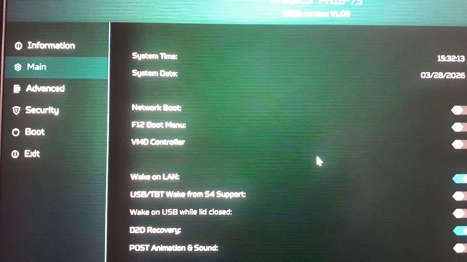
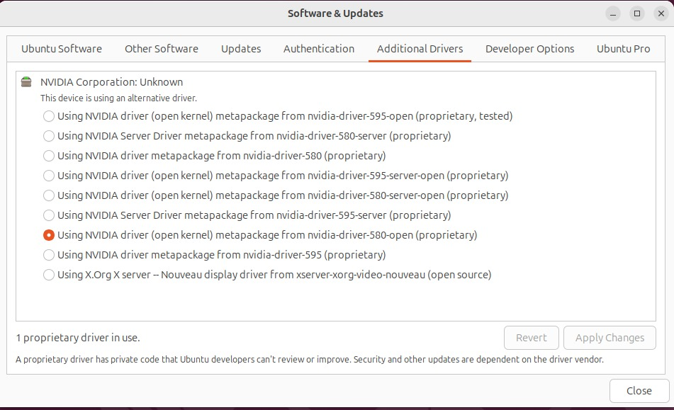
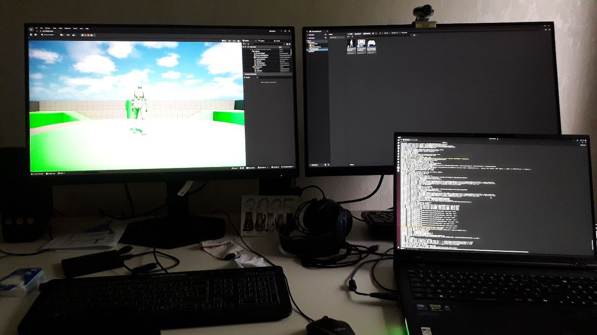

# 在最近的 Linux 笔记本电脑上安装虚幻引擎 5.7.4：Acer Predator PH18-73

## 来源与状态

- 原始 URL：https://dev.epicgames.com/community/learning/tutorials/Rxlm/install-unreal-engine-5-7-4-on-recent-linux-laptop-acer-predator-ph18-73

## 运行时分类

- 类型：图文教程
- 判断：API 未识别到核心视频信号，可整理正文约 2442 字符。

## 摘要

在最近的 Linux 笔记本电脑上安装虚幻引擎：Acer Predator PH18-73

## 中文整理

### 概览

我的笔记本电脑：Acer Predator PH18-73、Intel® Core™ Ultra 9 275HX × 24 当我启动虚幻引擎编辑器时，我收到了有关 vulkan、nvidia、intel 等的错误消息，具体取决于完成的安装。我在一周内每天安装 2/3 次（Ubuntu 22、24、25 + unreal），直到我找到了为 Unreal Engine 5.7.4 安装 Ubuntu + 驱动程序的正确方法。无论如何，当我启动 UE 时不再有消息错误。我发现通过 HDMI 电缆连接到笔记本电脑的显示器存在另一个问题：当我启动虚幻引擎编辑器时，显示器冻结。这是因为我的显示器太旧了（超过 10 年），我尝试使用新显示器“Aoc Gaming Q27G4ZR”并且 UE 工作正常...为了成功进行如下所述的安装，必须从头开始重新安装 Ubuntu。在您的 Linux 笔记本电脑上，将您的主目录、书签和密码从互联网浏览器保存到外部磁盘上。重新启动笔记本电脑 Acer Predator PH18-73： - 单击 f2 访问 UEFI，然后按 F1 - 选择 main 并执行 Ctrl + s（如果“VMD 控制器”不可见）并停用“VMD 控制器”（否则您无法擦除磁盘）

安装Ubuntu 24.04.4（使用Rufus创建USB）您应该在安装之前完全擦除磁盘。重启 sudo apt update -y && sudo apt update -y && sudo apt autoremove sudo apt install vulkan-tools vkcube (为了好玩...) sudo ubuntu-drivers autoinstall 使用笔记本电脑上可用的应用程序列表中默认安装的应用程序“附加驱动程序”。使用“NVIDIA driver (open kernel) metapackage form nvidia-driver-580-open (proprietary)”下面的驱动程序代表默认选择的驱动程序。 “申请”

启动应用程序“NVIDIA X Server Settings”，然后在“PRIMES Profiles”中选择“NVIDIA（性能模式）” 将二进制包 Linux_Unreal_Engine_5.7.4.zip 复制到 [https://www.unrealengine.com/linux](https://www.unrealengine.com/linux)（您必须拥有一个史诗帐户） Launch : 'xxx...xxx/Linux_Unreal_Engine_5.7.4/Engine/Binaries/Linux/UnrealEditor' 创建一个使用 UE 编译着色器需要很长时间……耐心点，它可以工作！您可以从左到右看到：游戏、内容浏览器和输出日志。

我尝试“重用”UE Windows 游戏。好吧，它可以工作，但是，我不得不在各处删除纳米粒子，以避免每次玩时冻结并杀死编辑器......
