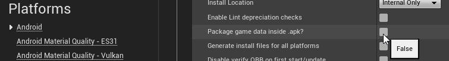

# Android：使用打包内容进行调试指南

## 来源与状态

- 原始 URL：https://dev.epicgames.com/community/learning/knowledge-base/pwrx/unreal-engine-android-debugging-with-packaged-content-guide

## 运行时分类

- 类型：图文教程
- 判断：API 未识别到核心视频信号，可整理正文约 3608 字符。

## 摘要

Android：使用打包内容进行调试指南

## 中文整理

### 概览

文章作者：[Brantley C.](https://dev.epicgames.com/community/profile/BxX8/FernBlades) 此过程将允许您获取预打包的内容并将其与仅包含代码的 APK 一起使用。这里的想法是将您的构建农场生成的熟内容存储在 OBB 文件中，并且 APK 仅包含游戏可执行文件。这是默认状态，前提是您不选择将游戏数据包含在 APK 中的选项。

然后，您可以仅从源代码构建您自己的 APK，无需任何内容，并让它与预打包的内容一起使用。如果您使用其他内容分发机制，例如 Google PAD 或您自己的 CDN，您可能需要稍微调整这些步骤。我们的构建服务器打包了一个“批量”构建，其中包含 APK、OBB 文件以及用于本地安装和测试的安装批处理文件，并且我们将这些构建中的内容用于此过程。 1. 从构建服务器获取打包的构建（APK 文件、OBB 文件和安装批处理文件）。 2. 将本地工作区同步到与打包版本相同或非常相似的源代码（例如更改列表编号）。 3. 运行GenerateProjectFiles.bat 并打开Visual Studio 4. 打开GameActivity.java.template 并将默认的HasAllFiles 值更改为true（大约第405 行）。这可以防止下载活动尝试下载任何 OBB 等。 5. 将您的游戏设置为 Visual Studio 6 中的启动项目。 将目标设置为 Android 并配置调试、开发或测试构建（如果您的游戏项目有客户端目标，则设置为 MyGameClient） 7. 从 Visual Studio 8 构建。 您应该有一个文件，例如 MyProject\Binaries\Android\MyProjectClient-arm64.apk。确切的名称将取决于项目的构建配置和设置。 9. **可选**：检查本地构建的APK的版本代码。在 Android Studio 中，使用“构建”、“分析 APK”菜单选项来检查版本代码。默认值为 2，但对于您的项目可能有所不同。有必要知道本地构建的 APK 文件的版本，因为 OBB 文件需要命名以匹配，并且构建服务器可能使用不同的版本号（例如构建更改列表号）。 10. 修改步骤 1 中的安装批处理文件以安装本地构建的 apk 和预打包内容。 10. 应修改 %ADB% %DEVICE% install 命令以指定本地 APK 的完整路径，例如 %ADB% %DEVICE% install D:\UE4\MyProject\Binaries\Android\MyProjectClient-arm64.apk 10. 应修改主文件和（如果需要，修补程序）OBB 文件的 %ADB% %DEVICE% 推送，以便重命名设备上的目标以匹配找到的版本号在步骤 9 中。例如，如果构建服务器以版本 123456 命名您的 OBB，则需要将其写入设备上的版本 2 文件： 10. %ADB% %DEVICE% push main.123456.com.mycompany.myproject.Client.obb %STORAGE%/obb/com.mycompany.myproject/main.2.com.mycompany.myproject.obb 11. 运行批处理文件来安装本地 APK 并将服务器内容构建到设备上。 12. **可选**：在 Android Studio 中打开 MyProject\Intermediate\Android\APK\Gradle 文件夹，以调试游戏并使用本文档中的步骤迭代代码更改。如果您想仅使用 Visual Studio 迭代代码，可以手动安装更新的可执行文件，并使用 -r adb 选项将 OBB 文件保留在适当位置：adb install -r D:\UE4\MyProject\Binaries\Android\MyProjectClient-arm64.apk。仅当签名密钥相同且版本号与设备上的 APK 相同或更高版本号但在本地 APK 上迭代时满足这些条件时，-r 选项才有效。
