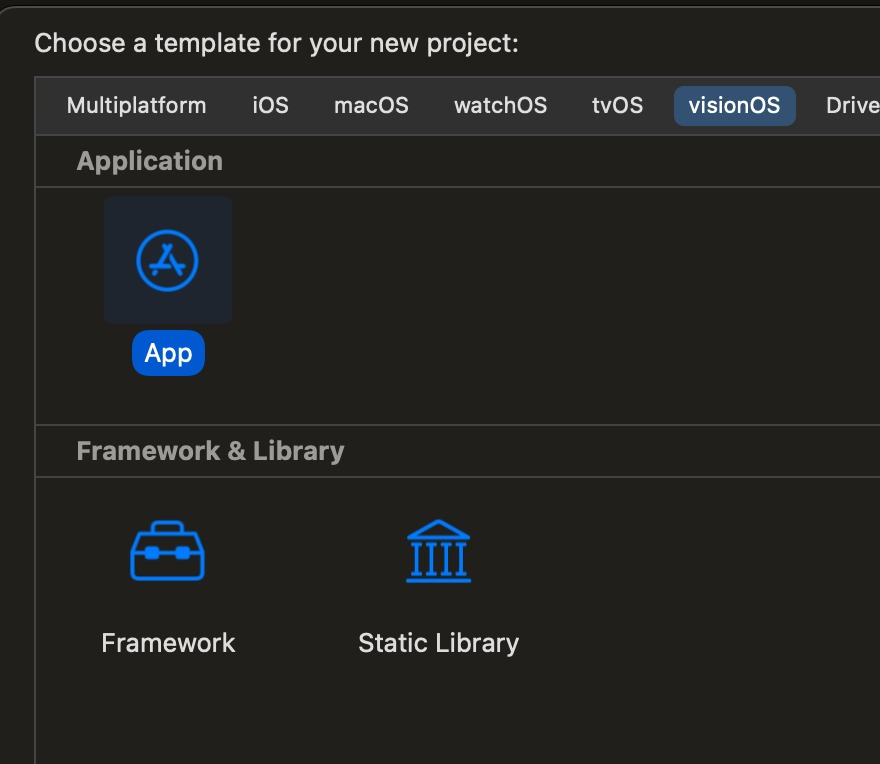
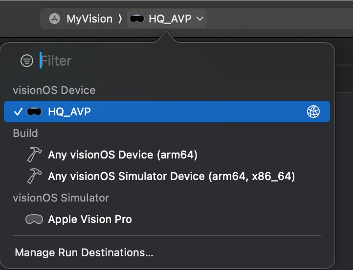
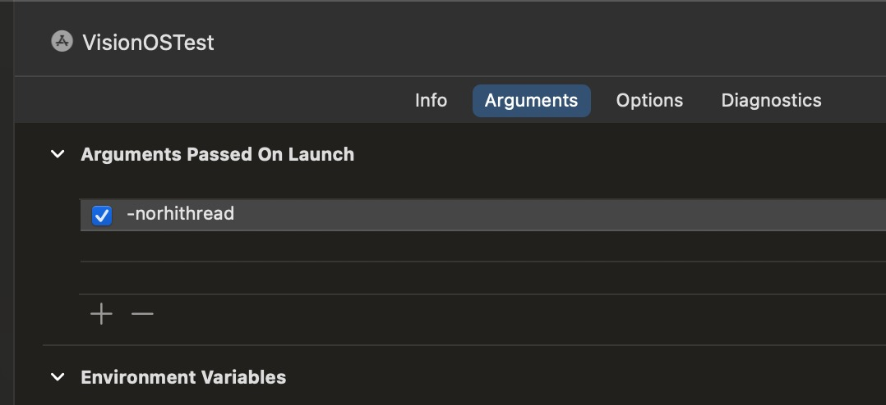

# Apple Vision Pro 快速入门指南

## 来源与状态

- 原始 URL：https://dev.epicgames.com/community/learning/tutorials/1JWr/unreal-engine-apple-vision-pro-quick-start-guide

## 运行时分类

- 类型：图文教程
- 判断：API 未识别到核心视频信号，可整理正文约 4232 字符。

## 摘要

Apple Vision Pro 快速入门指南

## 中文整理

### 先决条件

1. 需要配备 Apple 芯片（m1、m2、m3）的 Mac 2. 安装了 VisionOS 1.1 支持的 Xcode 15.3

### Apple Vision Pro 设备设置

*这是一个快速摘要，请参阅 Apple 文档以获取完整的设置说明。* 1. 设置并连接到您的 wifi，或使用开发者腕带 1. 建议使用开发者腕带，因为 wifi 可能不可靠 2. 更新到visionOS 1.1 3. 转到“设置”->“隐私和安全”->“开发者模式”，并将其设置为“开”

### Xcode

*（可选）构建 Apple 模板项目以验证您的 Xcode 设置是否正确。有关详细信息，请参阅 Apple 文档。* 1. 创建新项目 2. 选择visionOS 选项卡，选择应用程序，然后单击下一步（参见图片） 3. 在沉浸式空间渲染器下，选择“金属”，然后单击下一步 4. 选择用于保存项目的文件夹，然后单击创建 5. 在顶部下拉列表中选择您的 AVP 设备（参见图片）。如果您在此处没有看到它，请转至“窗口”->“设备和模拟器”，并验证您的 AVP 是否已连接。 6. 运行应用程序（Command+R，或左上角的“播放”按钮） 7. 启动 Xcode 如果应用程序运行，您现在就可以在 Mac 上进行 Apple Vision Pro 开发了。

### 虚幻引擎

目前仅支持 C++ 项目。 1. 通过 GitHub 安装 Unreal Engine 5.5（目前不支持从 Epic Games Launcher 下载的二进制版本，但将来会支持） 1. 构建编辑器 2. 启动编辑器并创建一个新的 VR 模板项目 3. 以下控制台变量现已在 Engine/Platforms/VisionOS/Config/VisionOSEngine.ini 和 MyProject/Config/VisionOS/VisionOSEngine.ini 中设置，因此您不需要设置它们，除非您有意更改他们。 3. vr.InstancedStereo=False 3. vr.MobileMultiView=False 3. xr.OpenXRAcquireMode=1 4. 转到“项目设置”->“平台”->“iOS”->“构建”->“附加 Plist 数据”，然后添加以下字符串：<key>NSHandsTrackingUsageDescription</key><string>跟踪您的手部以与应用程序交互。</string> 5. 添加 C++ 类以使其成为代码项目6. 启用 OpenXR VisionOS 插件，然后单击“重新启动” 7. 在虚幻编辑器工具栏中，单击“平台”->“visionOS”，然后选择保存包的位置（位置无关紧要） 1. 这将开始打包项目 2. 如果在烹饪过程中失败，请在之后运行此命令（替换粗体部分）： ./RunUAT.sh BuildCookRun -project="**/Users/josh.adams/Documents/Unreal Projects/VisionOSTest/VisionOSTest.uproject**" -platform=VisionOS -build -skipcook -stage -pak 8. 在 Unreal 项目目录中打开visionOS Xcode 工作区 1. 对于“MyProject”，它将是“MyProject (VisionOS).xcworkspace” 9. 将 Xcode 产品-> 方案设置为您的项目 10. 确保您的 Vision Pro 是产品-> 目标，并且它已解锁并处于唤醒状态（与 Xcode 相同）先决条件 步骤 6) 11. 运行应用程序（Command+R，或左上角的“播放”按钮） 1. 如果切换到延迟桌面渲染器，请使用 -norhithread 运行（Xcode 产品方案有一个放置命令行参数的地方），以避免出现错误，抱怨我们从两个线程调用 cp_frame_ 函数（参见图片）

### 混合沉浸模式

借助 VisionOS 2.0 和 UE 5.5，我们可以使用 AVP 的混合沉浸模式来实现增强现实！ VisionOS 2.0 需要 xcode 16。我们使用 16 beta 6 进行测试。有关设备设置的信息，请参阅 Apple 文档。混合沉浸所需的 .ini 设置位于 Engine/Platforms/VisionOS/Config/VisionOSEngine.ini 和 VR 模板的 /Config/VisionOS/VisionOSEngine.ini 中。项目的 VisionOSEngine.ini 将覆盖引擎默认值。 VisionOS 2.0默认处于完全沉浸模式。要切换到混合，您必须： - 在 \Engine\Platforms\VisionOS\Source\Runtime\Launch\Source\UESwift.swift 中注释掉下面将 ImmersionStyle 设置为 .full 的行，并取消注释将 ImmersionStyle 设置为 .mixed 的行。 // VisionOS 2+ 还支持混合沉浸。 @State private var style: ImmersionStyle = .full //@State private var style: ImmersionStyle = .mixed - 在 VisionOSEngine.ini 中取消注释三个 cvar 设置： //为混合沉浸模式启用这些设置。 //r.Mobile.PropagateAlpha=1 //r.PostProcessing.PropagateAlpha=1 //r.AlphaInvertPass=1 - 更改内容以允许某些透明区域。例如，移除天空盒和墙壁，并将地板设置为在游戏中隐藏（以保留碰撞）。
