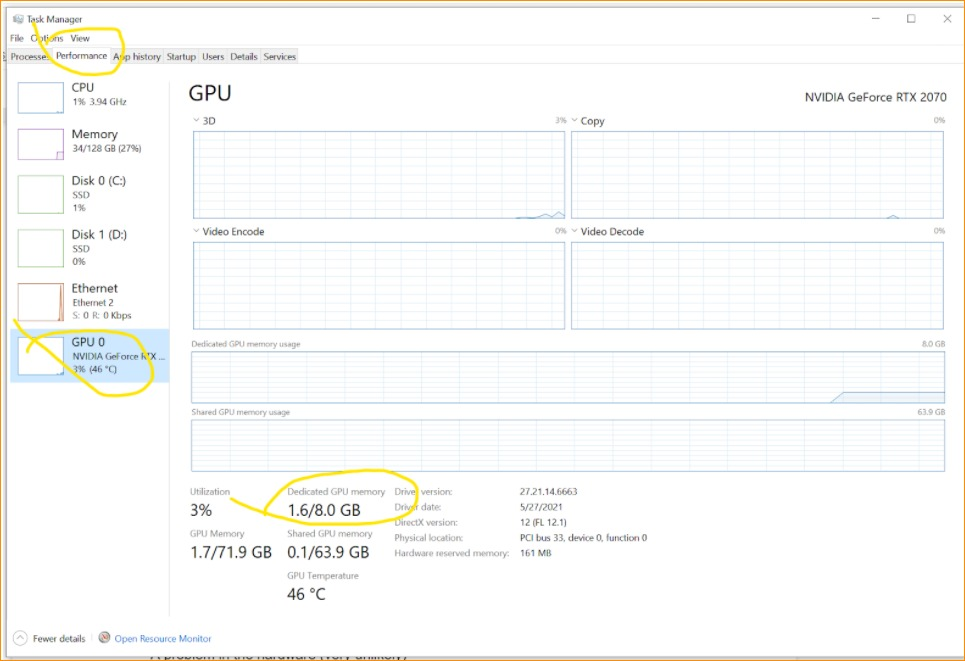

# 处理 GPU 崩溃

## 来源与状态

- 原始 URL：https://dev.epicgames.com/community/learning/knowledge-base/5kkO/unreal-engine-dealing-with-gpu-crashes

## 运行时分类

- 类型：图文教程
- 判断：API 未识别到核心视频信号，可整理正文约 7119 字符。

## 摘要

2021 年 8 月 2 日。知识有时，当您发生崩溃时，调用堆栈会显示以下内容：“GPUCrash - 由于 D3D 设备丢失而退出 - D3D Hung”。 “DXGI_ERROR_DEVICE_REMOVED，原因：DXGI_ERROR_DEVICE_HUNG”Th…

## 中文整理

### 概览

2021 年 8 月 2 日。知识有时，当您发生崩溃时，调用堆栈会显示以下内容：“GPUCrash - 由于 D3D 设备丢失而退出 - D3D Hung”。 “DXGI_ERROR_DEVICE_REMOVED with Reason: DXGI_ERROR_DEVICE_HUNG” 这些消息很难导航，因为它们表明 GPU 崩溃了，而且通常比 CPU 崩溃更难调试。我能做些什么？您可以通过 UDN 向工程师发送调用堆栈（至少游戏线程、渲染线程和 RHI 线程）和日志文件，希望其中包含有助于了解正在发生的情况的信息。不幸的是，当 GPU 崩溃时，CPU 调用堆栈并不能真正指出崩溃的真正原因，而只是指示 GPU 崩溃发生时 CPU 正在做什么。因此它不提供可操作的信息。在这种情况下，最好的处理方法是使用 -gpucrashdebugging 标志运行 UE，并查看日志是否包含有用信息。之后，您还可以使用 -d3ddebug 标志运行 UE4，这也可以给您一些线索。强烈建议不要同时使用-d3ddebug和-gpucrashdebugging，您应该选择其中之一。理想情况下，您应该向工程师发送两个日志，并使用每个标志单独运行引擎。 UE日志保存在[MyProject]/Saved/Logs中。 Windows 会生成有用的转储文件，因此收集它们也是一个好主意。如果您需要了解有关如何获取这些转储文件的更多信息，请询问 Epic 工程师。通常，GPU 崩溃可能因以下任一原因而发生： - GPU 内存不足 - GPU 在执行昂贵的操作时超时（TDR 事件） - 引擎代码中的错误 - 驱动程序中的错误 - 操作系统中的错误 - 硬件中的问题（可能性极小） 可以采取多种措施来帮助确定上述哪一项是根本原因： GPU 内存不足 (OOM) 如果 GPU 内存不足，它可能会崩溃。这取决于您使用的 RHI，有些比其他 RHI 更有弹性，在 OOM 事件的情况下，它们只是变得非常慢而不是死亡。要了解您的显卡使用了多少内存，请打开任务管理器，转到性能选项卡，选择 GPU 并检查崩溃之前和期间的内存消耗情况。

如果您接近内存限制，这可能就是问题所在。

在这种情况下，请尝试减少内存使用量。

为此，您可以执行以下操作： - 简化场景（使用较低分辨率的纹理、较低分辨率的网格等） - 以较低的分辨率渲染 - 如果您正在编辑器中工作并且有多个视口，请关闭除一个视口之外的所有视口。

- 不要禁用使用额外内存的功能，例如 Niagara 或 RayTracing，因为如果这样做后崩溃消失了，您可能会认为这是因为内存减少，但绕过这些组件会改变许多其他事情，这可能会导致您得到无效的结论。

GPU 在执行昂贵的操作时超时（TDR 事件） 当 CPU 向 GPU 发送命令进行计算时，CPU 会设置一个计时器来计算 GPU 需要多少时间来完成该操作。

如果CPU检测到该操作花费了太多时间（Windows中默认为2秒），它会重置驱动程序，从而导致GPU崩溃。

这称为 TDR 事件（超时检测和恢复）。

理想情况下，引擎不应该向 GPU 发送如此大量的工作来触发 GPU 事件，但它应该能够将任务分割成更小的块，从而避免 TDR。

然而现实生活并不那么美好，TDR 事件时有发生。

为了避免它们，您可以增加 Windows 寄存器中的 TDR 值，以避免 GPU 驱动程序重置。

您可以在此处找到更多信息：[https://docs.microsoft.com/en-us/windows-hardware/drivers/display/timeout-detection-and-recovery](https://docs.microsoft.com/en-us/windows-hardware/drivers/display/timeout-detection-and-recovery) [https://docs.substance3d.com/spdoc/gpu-drivers-crash-with-long-computations-128745489.html](https://docs.substance3d.com/spdoc/gpu-drivers-crash-with-long-computations-128745489.html) TDR 和光线追踪 光线追踪的成本特别高，因此在启用时更有可能触发 TDR 事件。

一些昂贵的光线追踪通道（即非常高分辨率的 RTGI）可能需要很长时间，因此可能会触发 TDR 事件。

最昂贵的光线追踪通道（GI 和反射）提供了一种在图块中渲染通道的方法，而不是通过以下 Cvar 进行单通道渲染： r.RayTracing.GlobalIllumination.RenderTileSize r.RayTracing.Reflections.RenderTileSize 当通道的图块大小大于零时，这些通道将在 NxN 像素图块中渲染，其中每个图块作为单独的 GPU 命令缓冲区提交，从而允许高质量渲染而不触发超时检测。

（默认值= 0，平铺禁用）同样，这是引擎应该在内部处理的事情，工程师将继续努力尽可能减少 TDR 事件。

引擎代码中的错误 引擎中的错误可能会导致 GPU 崩溃。

UE 相当大，因此一些初步的 A/B 测试有很大帮助。

您可以执行以下操作： - 如上所述，使用 -gpucrashdebugging 和 -d3ddebug 运行引擎（提醒：最好单独使用这些标志）。

- 使用 -onethread -forcerhibypass 运行。

这将强制 UE 仅使用一个线程运行，并将有助于确定底层问题是否是线程/计时问题。

- 使用 r.RDG.Debug=1 运行，这可能会为您提供有关尚未正确设置的渲染通道的信息 - 使用 r.RDG.ImmediateMode=1 运行，这将强制 RenderGraph (RDG) 在创建后立即执行通道，并且可以为您提供更有意义的调用堆栈（这实际上改变了引擎盖下的其他内容，并且可能是一个红鲱鱼工厂，但它仍然值得做）。

- 切换到不同的 RHI。

如果您使用的是 DX12，则可以切换到 DX11，反之亦然。

检查崩溃是否仅发生在一个 RHI 中，这可以帮助工程师确定问题是在较高级别还是较低级别。

请注意，某些功能仅适用于特定的 RHI（即光线追踪在 DX11 中不起作用） - 对场景进行 A/B 测试 - 打开/关闭渲染通道并检查崩溃是否仍然发生。

很多时候，问题是故障崩溃，这样做可以提供有关正在发生的情况的良好线索。

- 打开/关闭渲染功能：Lumen、Nanite、光线追踪……（其中一些需要重新启动） - 隐藏/显示特定对象。

问题可能是特定资产驱动程序中的错误在得出此结论之前值得调查所有前面提到的可能性。

如果您使用的驱动程序存在已知问题，请尝试更新驱动程序并咨询工程师和质量检查人员。

操作系统中的错误 在得出此结论之前，值得调查所有前面提到的可能性。

对于Windows的具体情况，强烈推荐版本是20H2。

要了解您正在运行的版本，请按 Windows 键并输入“winver”。
