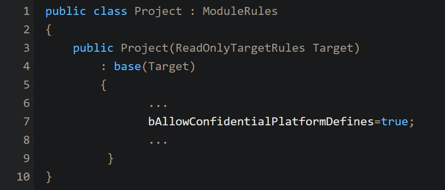

# 启用平台身份宏

## 来源与状态

- 原始 URL：https://dev.epicgames.com/community/learning/knowledge-base/n1rx/unreal-engine-enable-platform-identity-macros

## 运行时分类

- 类型：图文教程
- 判断：API 未识别到核心视频信号，可整理正文约 1026 字符。

## 摘要

如何重新启用每个平台识别宏，例如 Jon C 撰写的 PLATFORM_XXX 文章。从 UE4.24/4.25 开始进行引擎->平台文件夹重构后，我们已弃用 PLATFORM_XXX ma…

## 中文整理

### 如何重新启用每个平台识别宏，例如 PLATFORM_XXX

*文章由 [Jon C.](https://dev.epicgames.com/community/profile/33lq/Jon.Cain) 撰写* 从 UE4.24/4.25 开始进行引擎->平台文件夹重构后，由于 NDA 限制问题，我们已弃用使用 PLATFORM_XXX 宏命令，并修改了引擎以使用平台文件夹结构。但是，我们意识到这实际上只是我们在引擎级别的限制，您可能仍然需要项目级别的功能。您可以通过在 project.build.cs 文件中设置 bAllowConfidentialPlatformDefines=true 来启用它们：

之后，您应该能够将 PLATFORM_XXX 用于您需要的任何平台（例如 PLATFORM_WINDOWS 等）。这包括所有移动和控制台平台。
