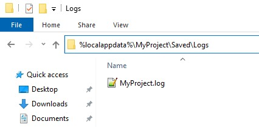

# 在交付版本中启用日志记录

## 来源与状态

- 原始 URL：https://dev.epicgames.com/community/learning/knowledge-base/vzvZ/unreal-engine-enabling-logging-in-shipping-builds

## 运行时分类

- 类型：图文教程
- 判断：API 未识别到核心视频信号，可整理正文约 2901 字符。

## 摘要

本文作者：Zhi Kang Shao 当使用 Shipping 配置打包虚幻引擎项目时，默认情况下所有日志记录均被禁用，因此应用程序不会在 Saved/ 文件夹中生成 .log 文件。...

## 中文整理

### 概览

*本文由 [Zhi Kang Shao](https://dev.epicgames.com/community/profile/Koe7/ZhiKangShao) 撰写* 使用 Shipping 配置打包虚幻引擎项目时，默认情况下所有日志记录均处于禁用状态，因此应用程序不会在 Saved/ 文件夹中生成 .log 文件。在某些情况下，您可能希望在发布版本中启用日志文件。本文介绍了如何实现这一目标。

### 要求

在发布版本中启用日志记录需要从源代码编译虚幻引擎。请参阅我们的文档[从源代码构建虚幻引擎](https://docs.unrealengine.com/5.1/building-unreal-engine-from-source/)。您的开发机器必须设置为能够编译虚幻游戏项目。请参阅我们关于[在虚幻引擎中设置 C++ 开发环境](https://docs.unrealengine.com/5.1/setting-up-your-development-environment-for-cplusplus-in-unreal-engine/) 的文档，了解相关说明。在发布版本中启用日志记录需要一个代码项目。如果您的项目当前仅包含蓝图，您可以通过以下方式从虚幻编辑器添加任何代码，将其转换为代码项目： - UE 5.0 及更高版本：工具 > 新建 C++ 类 - UE 4.27 及更低版本：文件 > 新建 C++ 类

### 修改Target.cs文件

将您的项目设置为代码项目后，请在以下位置找到该项目的游戏目标文件：MyProject/Source/MyProject.Target.cs 对于其他目标（例如专用服务器构建的服务器目标），请修改相应的 Target.cs 文件，例如：

```cpp
MyProject/Source/MyProjectServer.Target.cs
MyProject/Source/MyProjectEditor.Target.cs
```

打开 Target.cs 文件。将以下两行添加到 TargetRules 构造函数中：

```cpp
BuildEnvironment = TargetBuildEnvironment.Unique;
bUseLoggingInShipping = true;
```

该文件应如下所示：

```cpp
using UnrealBuildTool;
using System.Collections.Generic;

public class MyProjectTarget : TargetRules

{
  public MyProjectTarget(TargetInfo Target) : base(Target)
  {
     Type = TargetType.Game;
     DefaultBuildSettings = BuildSettingsVersion.V2;
```

您现在必须从源代码重新编译引擎才能使此更改生效。应用此更改并将项目打包到运输配置中后，应用程序将生成日志文件。

### 传送构建输出文件夹

运输构建生成的日志文件的位置与在其他配置（例如开发或调试）中打包时生成的日志文件的位置不同。在 Windows 中，日志文件位于：C:/Users/my.username/AppData/Local/MyProject - 在 Windows 文件资源管理器中，您可以使用宏 %localappdata% 通过在地址栏中输入来快速导航到此文件夹：



在[知识库！](https://forums.unrealengine.com/docs) 中获取更多答案
