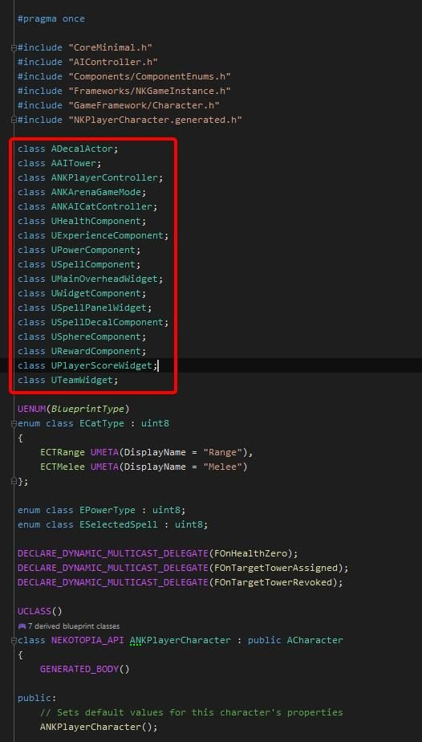
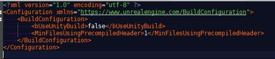

# 如何优化 C++ 编译时间，提高智能感知效率

## 来源与状态

- 原始 URL：https://dev.epicgames.com/community/learning/tutorials/Revm/unreal-engine-how-to-optimize-c-compile-time-increase-efficiency-of-intellisense

## 运行时分类

- 类型：图文教程
- 判断：API 未识别到核心视频信号，可整理正文约 3196 字符。

## 摘要

这将包括如何优化 C++ 中的编译时间以提高效率。

## 中文整理

### 概览

在虚幻引擎中开发的主要问题是编程速度慢。由于虚幻引擎拥有庞大的代码库，智能感知无法正常工作。因此，根据我 8 年多的经验，我想分享我最终的开发环境技术堆栈。总的来说，我的编译时间从 10 分钟减少到 20 秒，而且我的智能感知运行得非常快。下面分享了一些技巧:) 首先，可用的 IDE、Intellisense 堆栈如下 - Visual Studio + Visual Assist - Visual Studio + Resharper - Rider For Unreal Engine 一般来说，我更喜欢使用 Rider for Unreal Engine，工作人员正在快速改进有关虚幻引擎的更新。如果引入新功能，Rider 团队比其他团队敏捷得多。其次，由于热重载和实时编码还不是合适的地方，为了避免混淆，我们通常从 IDE 调用虚幻引擎来查看编码的游戏结果。但这当然带来了负担，编译等待时间非常长。就连我自己也失去了注意力，也忘记了自己做了什么，因为编译大约需要 5 分钟。因此我想尽一切办法来优化那段时间。您可以遵循两个主要标题。其中一种是外部修复，另一种是内部修复。始终在头文件中使用前向声明（编码修复）： - 在头文件中使用“class”关键字（前向声明），而不是在头文件中包含所有内容。尽可能将标头放入 cpp 文件中。保持 .h 包含干净。

- 使用`#ifndef、#def、#endif`避免多次包含。这些东西将逐渐改善您的编译时间以及代码效率 作为外部修复（硬件和配置）： 可以将以下 xml 行放入虚幻引擎中全局使用的 BuildConfiguration.xml 文件中。通常它位于 - %AppData%\Roaming\Unreal Engine\UnrealBuildTool\BuildConfiguration.xml，bUseUnityBuild -> false MinFilesUsingPrecompiledHeader -> 1

另一件事是，当您想要编译时，Windows Defender 会扫描（阻止）文件。因此它会造成额外的缓慢。为了解决这个问题，请转至 Windows 安全 -> 病毒和线程防护 -> 病毒和线程防护设置 -> 单击管理设置 -> 转到最底部的“添加或删除排除项” - 添加虚幻引擎安装文件夹 - 添加 Rider/Visual Studio 安装文件夹 - 添加项目文件夹（您正在使用的所有虚幻项目） - 添加 .cpp、.so、.h、.o、.sln 作为文件类型 - 添加以下进程（如果您使用的是 Visual） Studio 进程可能会更改） - datagrip64.exe - goland64.exe - phpstorm64.exe - pycharm64.exe - rubymine64.exe - studio64.exe - webstorm64.exe 对于最后一件非常重要的事情，我们可以添加的是： 1. 在 SSD 中安装 Unreal 2. 在 SSD 中安装 Rider 3. 将源代码控制系统、存储库安装到 SSD，以便它将成为您的项目文件。只要您在 SSD 上进行操作，编译时间就会大大减少。我目前使用的SSD是三星EVO 980Pro M2 SSD。我希望本教程可以帮助您更多地专注于游戏玩法，从而创造出精彩的游戏。小心！ CtnDev
