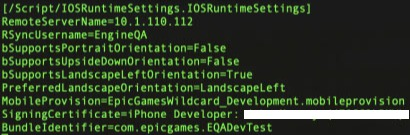
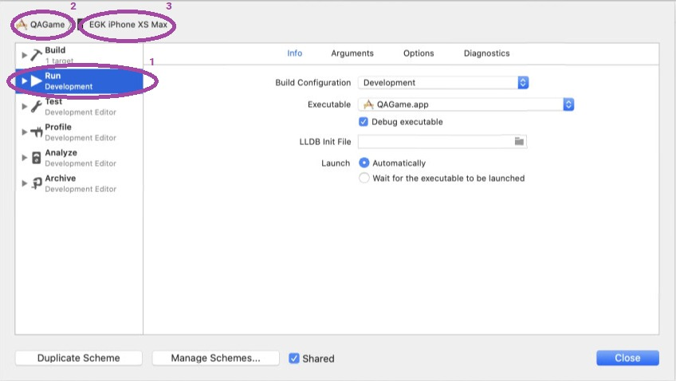
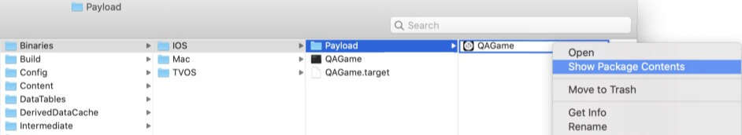
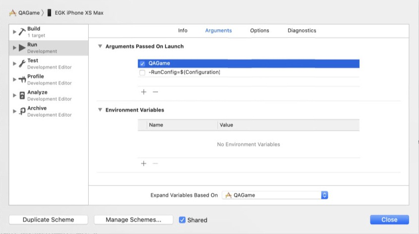

# iOS：使用打包内容进行调试指南

## 来源与状态

- 原始 URL：https://dev.epicgames.com/community/learning/tutorials/XV/unreal-engine-ios-debugging-with-packaged-content-guide

## 运行时分类

- 类型：图文教程
- 判断：API 未识别到核心视频信号，可整理正文约 2027 字符。

## 摘要

此过程将允许您从构建机器上构建的 IPA 文件中获取内容，并使用 Xcode 和 IPA 的内容迭代或调试代码。

## 中文整理

### 概览

1. 从您的构建服务器获取包含内容的打包 ipa 构建。 2. 将本地工作区同步到与 Mac 上的打包版本相同或非常相似的源代码（例如更改列表编号）。 3. 运行GenerateProjectFiles.command 并在Xcode 4 中打开生成的工作区。 *可选：构建Mac、开发编辑器构建并使用项目设置、IOS 配置配置设置。或者，您可以在 MyProject/Config/DefaultEngine.ini 文件中指定配置设置。如果您确实更改了此处的设置，您可能需要重新生成项目文件。*

5. 从菜单中选择“产品”、“方案”、“编辑方案”。单击左侧窗格中的“运行”，并将构建配置更改为不包含编辑器的配置（例如“开发”或“开发客户端”）。然后在窗口的左上角选择您的项目和要用于调试的 iOS 设备。

6. 使用 Product、Build 7 构建应用程序。构建完成后，导航到 Finder 中的 MyProject/Binaries/IOS/Payload。那里会有一个 iOS 可执行文件，右键单击它并选择“显示包内容”。里面有一个 Cookeddata 文件夹，该文件夹将为空。

您可以获取构建机器的 ipa 文件并将其重命名为 zip 文件。在其中您将找到一个包含 iOS 可执行文件的 Payload 文件夹，该文件夹也是您可以使用“显示包内容”打开的文件夹。导航到cookeddata 文件夹并将其中的所有内容复制到本地构建的可执行文件中的空cookeddata 文件夹中。 8. 通过 Xcode 在 iOS 设备上运行应用程序。 Cookeddata 文件夹将与可执行文件一起部署到 iOS 设备。 9. 您可以更改代码、设置断点并迭代应用程序。您还可以通过在“编辑方案”窗口的“参数”选项卡中指定来修改命令行。每次仅将更改的可执行文件或内容复制到设备。

