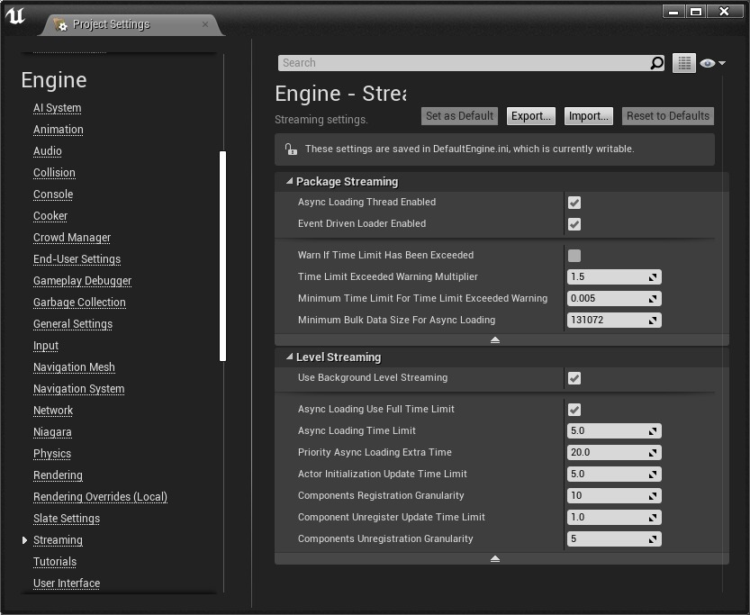

# XR 中的关卡加载屏幕

## 来源与状态

- 原始 URL：https://dev.epicgames.com/community/learning/knowledge-base/dPP4/unreal-engine-level-loading-screens-in-xr

## 运行时分类

- 类型：图文教程
- 判断：API 未识别到核心视频信号，可整理正文约 6973 字符。

## 摘要

2020 年 10 月 29 日。知识最初由 Ryan B 撰写。了解一般关卡加载流式加载与阻塞式加载在 UE 中加载关卡有两种方法，流式加载或阻塞式加载。 “堵车”…

## 中文整理

### 概览

2020 年 10 月 29 日。知识最初由 [Ryan B.](https://dev.epicgames.com/community/profile/23wL/RyanBickell) 撰写 总体了解关卡加载

### 流式负载与阻塞负载

在 UE 中加载关卡有两种方法：流式加载（https://docs.unrealengine.com/en-US/Engine/LevelStreaming/index.html）或阻塞加载。 UE4 中的“阻塞加载”概念是优先考虑整体加载速度，因此它会以牺牲任何其他线程（包括渲染线程）为代价来获取所有 CPU 优先级。另外，默认情况下，开放关卡会丢弃当前世界中存在的所有内容，并且通常没有任何内容可渲染。使用“开放关卡”蓝图节点在关卡之间进行转换会导致在两个地图之间发生变化时出现硬转换。虽然可以在阻塞加载期间显示静态加载屏幕，但将加载速度优先于其他一切意味着显示动画加载屏幕（或根据头部运动更新显示）可能很困难或不可能。克服这个问题的一种方法是使用“加载流关卡”来异步流式传输子关卡，这将允许在将子关卡读入内存时继续渲染。根据项目的设置方式，这可能需要更改项目中级别的构造。阻塞负载的另一种替代方案确实使用开放关卡，但使用一种称为“无缝旅行”的功能来继续渲染某些内容，同时在持久关卡之间进行转换，并在中间有转换映射，它需要使用服务器（可以是“监听服务器”，或者是同一进程的客户端和服务器）和一定量的设置，这可能比概述的方法更多或更少设置上面还有子级别，具体取决于项目。它尚未通过 XR 启动屏幕进行广泛测试，XR 启动屏幕通常用于在 XR 中加载。在立体渲染中显示加载屏幕时的问题与在非立体渲染中显示动画加载屏幕的问题大致相同。当担心关卡加载时间或流媒体故障时，应考虑所有应检查的常规设置。项目设置 > 引擎 > 流中的许多设置与此处相关：

首先，在“包流”部分中，“启用异步加载线程”和“启用事件驱动加载器”切换将极大地改变加载，您应该尝试这些的不同组合。事件驱动加载器在 4.14 发行说明中进行了解释：[虚幻引擎 4.14 发布](https://www.unrealengine.com/en-US/blog/unreal-engine-4-14-released): (“新功能：快速异步加载系统（实验性）”部分）“Cooked 版本现在可以使用全新的事件驱动加载器，该加载器比旧的流代码更高效。使用 EDL 的游戏应该会看到加载时间下降大约 50%，但在许多情况下，事件驱动加载器带有用于加载资源的统一代码路径，这意味着所有包都将使用新的异步路径加载，而不是旧的阻塞路径，目前 EDL 是一项实验性功能，默认情况下处于禁用状态，但可以通过项目设置轻松启用。”下面，关卡流传输部分有很多数字，表示每个帧加载使用多少毫秒。请参阅每个项目的工具提示以查看说明。他们中的很多人都说“在一帧中花在 __ 上的最大时间（以毫秒为单位）”。通过这种方式，您可以平衡帧中计算时间的哪一部分用于加载，以及哪一部分用于继续运行和渲染游戏。数字越低，整体加载时间越长，但游戏加载时运行得越流畅。加载关卡所需的时间很大程度上受到项目本身的内容和逻辑的影响，因为该关卡引用的任何内容也必须加载，并且您在加载关卡时生成的类的 C++ 构造函数中放入的任何代码，或者在关卡中任何 UObject 的 PostLoad 函数中放入的任何代码都会在加载时执行。设计流畅的关卡是一项艰巨的任务，必须从制作的早期阶段直到发布，而不仅仅是在发布游戏之前不断地考虑和测试。

### 测试

在编辑器中播放或在 VR 中播放中进行的测试不一定代表加载时间，因为编辑器实际上会将所有加载到内存中的内容保留在内存中并且从不释放它，因此您经常会看到更快的加载时间。更好的方法是使用命令“UE4Editor.exe MyProject -game”以“游戏”模式启动编辑器。但这是加载未煮熟的内容，并且启用了大量调试代码，因此仍然不完全具有代表性。分析加载时间（或其他性能相关指标）的最佳方法是在尽可能接近运输版本的构建中，但启用分析。这就是测试[构建配置](https://docs.unrealengine.com/en-US/Programming/BuildTools/UnrealBuildTool/BuildConfiguration/index.html)。这可以通过“文件”菜单的“打包项目”>“配置”来完成。这仅在从源代码构建的引擎中可用。如果您在此处没有看到“测试”选项，则可能需要从源代码构建引擎。从这里，您可以在加载过程中使用 Unreal Insights（https://docs.unrealengine.com/en-US/Engine/Performance/UnrealInsights/index.html）或目标平台的 CPU 分析器（如果您有多个目标平台或多于一个目标 HMD，您需要对它们全部进行分析）对游戏进行分析，并查看哪些功能看起来占用最多时间。此外，使用统计转储将向您显示可能需要调查的峰值。

### SteamVR

在过去（也许现在仍然如此），SteamVR 有一个非常严格的政策，如果渲染命令有丝毫延迟，则显示通用（灰色？）房间。防止 Steam VR 房间出现可能很困难，因为如果渲染暂停很长一段时间，它似乎会自动发生，这在从磁盘加载大型关卡时很容易发生。一种潜在的缓解措施是将关卡分成更小的部分，并在玩家移动关卡时加载它们，而不是一次性加载它们。 SteamVR 中有一个设置可以在本地禁用此功能，但每个玩家都必须设置该设置，我不相信应用程序可以选择它。其他注意事项： - 建议不要使用“自动显示/隐藏加载屏幕”设置 - 不确定它尝试执行的自动加载检测实际上是否可行，但至少目前效果不佳
