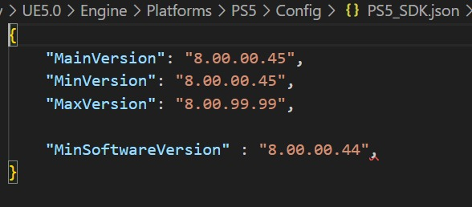
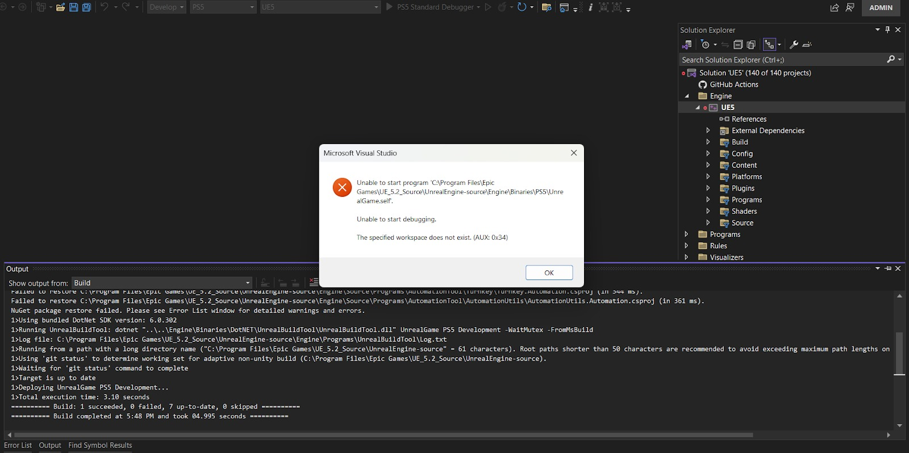
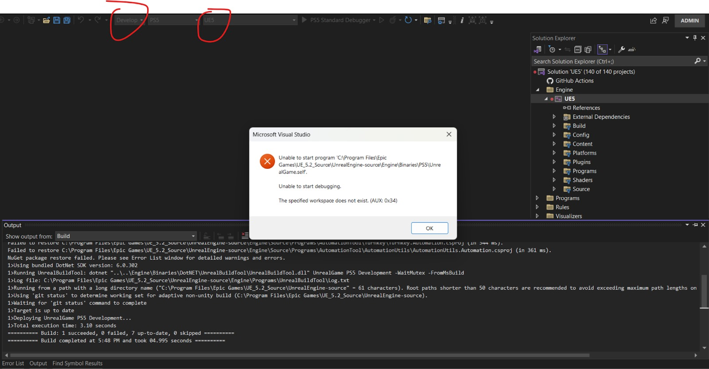
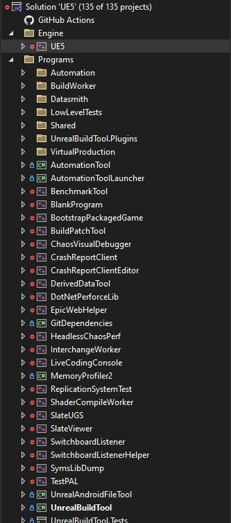

# Unreal Engine PlayStation 平台文件安装和陷阱

## 来源与状态

- 原始 URL：https://dev.epicgames.com/community/learning/tutorials/9Jrd/unreal-engine-playstation-platform-files-installation-and-gotchas

## 运行时分类

- 类型：图文教程
- 判断：API 未识别到核心视频信号，可整理正文约 3221 字符。

## 摘要

在为 PlayStation 进行开发时，遵循发送的文档是很好的做法。与此同时，还有一些小问题，开发人员最终可能会花费大量时间来解决。以下是您可能面临的一些障碍以及如何克服它们。

## 中文整理

### 简介

使用虚幻引擎 5.x 进行 PlayStation 开发时，您需要填写[控制台访问请求表单](https://forms.unrealengine.com/s/form-console-access-request)。审核后，您将收到一封电子邮件，其中包含必须包含在虚幻引擎源代码的“Engine/Platforms”目录中的平台文件（可在 [GitHub](https://www.unrealengine.com/en-US/ue-on-github) 中找到）。然后，您可以编译引擎源代码，以便能够编译到 PlayStation。 *注意：只有已经是索尼批准的 PS5 控制台开发人员的开发人员才能访问控制台文件* 有关如何编译源代码的说明可以在[此处](https://dev.epicgames.com/documentation/en-us/unreal-engine/building-unreal-engine-from-source?application_version=5.3)找到。

### 一些需要寻找的问题

- **当我运行“GenerateProjectFiles.bat”时，我收到一系列错误，提示“没有找到合适的方法来覆盖”** 答：这通常意味着您下载的 PS5 平台文件与您正在编译的虚幻引擎版本不匹配。要检查兼容版本，请导航至“\Engine\Platforms\PS5\Config\PS5_SDK.json”。这应该具有与虚幻引擎版本兼容的平台版本。在旧版本的 UE5 中，您可以在“Engine\Platforms\PS5\Source\Programs\UnrealBuildTool\PS5PlatformSDK.Versions.cs”中找到相同的信息

- **我的计算机上安装了 Visual Studio 2019 和 2022。当我运行“GenerateProjectFiles.bat”时，Visual Studio 项目默认为 2019。我无法在 VS 2022 中从 Visual Studio 项目进行编译。** 答：您可以像这样在“GenerateProjectFiles.bat -2022”末尾添加 VS 版本号。这将强制 Visual Studio 项目与 VS 2022 兼容。 - **我的游戏使用光线追踪，但光线追踪似乎不起作用。** 您可以在“\Engine\Platforms\PS5\Config\”文件夹下的 PS5engine.ini 文件中启用/禁用光线追踪。打开 ini 文件，在“[/Script/PS5PlatformEditor.PS5TargetSettings]”下，您可以通过在其下方添加“r.RayTracing 1”来启用光线追踪。您还可以直接在编辑器的项目设置中进行配置。默认情况下，您可以通过修改 ini 文件来启用许多控制台命令。 - **我能够成功运行“GenerateProjectFiles.bat”，但是当我尝试从 Visual Studio 编译源代码时，出现此错误**

答：确保顶部的活动平台是“Win64”（而不是 PS5），并且“配置”设置为“开发编辑器”

- **当我打开 Visual Studio 2022 时成功运行“GenerateProjectFile.bat”后，UE5 项目将被忽略并显示错误：**

答案：确保您的 Visual Studio 已使用正确的 C++ 工具正确设置。更多内容请参见[此处](https://dev.epicgames.com/documentation/en-us/unreal-engine/setting-up-visual-studio-development-environment-for-cplusplus-projects-in-unreal-engine?application_version=5.3)
