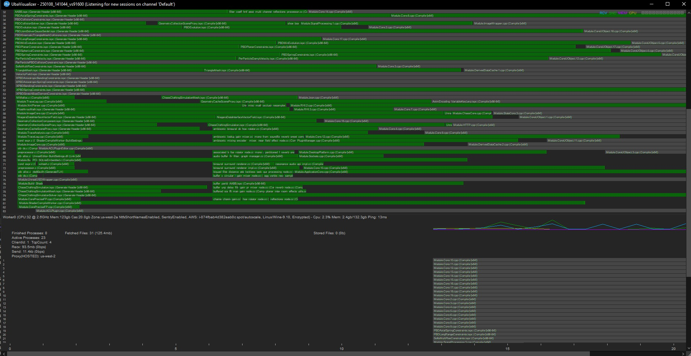
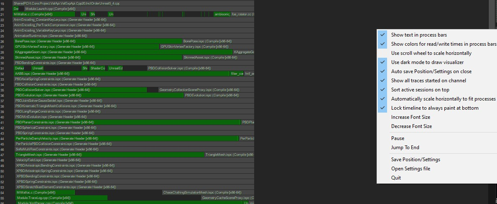

# Unreal Build Accelerator 的实用调试技巧 (Part 1/2)

Source file: `unreal-engine-practical-debugging-tips-for-unreal-build-accelerator.origin.md`.

This document was split during ue-kb import to keep source chunks buildable.

## 来源与状态

- 原始 URL：https://dev.epicgames.com/community/learning/knowledge-base/jB32/unreal-engine-practical-debugging-tips-for-unreal-build-accelerator
## 运行时分类

- 类型：图文教程
- 判断：API 未识别到核心视频信号，可整理正文约 19788 字符。
## 摘要

本教程将提供一些实用的调试技巧，以帮助诊断使用虚幻构建加速器时遇到的问题。
## 中文整理
### 概览

本知识库文章将重点介绍围绕虚幻构建加速器 (UBA) 的一些有用的调试实践和工具。这不会明确涵盖分布式代理设置，也不会提供有关如何设置 UBA 的演练。相反，它将提供一些与 UBA 相关的常见调试和配置工具，以及如何缩小可能问题集的技术。
### 先决条件

1.您对UBA有较高的了解，并且了解如何调用UnrealBuildTool（UBT）。 2. 您已查看了 UBA 的现有[配置文档](https://dev.epicgames.com/documentation/en-us/unreal-engine/horde-unreal-build-accelerator-and-remote-compilation-tutorial-for-unreal-engine)。 3. 您当前的构建正在使用 UBA（通过部落或其他协调员）。 4. *可选：查看 Microsoft 的 *[子进程调试](https://devblogs.microsoft.com/devops/introducing-the-child-process-debugging-power-tool/)* 以了解更高级的调试工作流程。* 5. *可选：查看 Microsoft 的 *[Detours](https://github.com/microsoft/detours)* 以更深入地了解 UBA 的工作原理。*
### 高级调试策略

调试 UBA 时，删除尽可能多的参数并逐步“深入”调用层次结构会很有帮助。以下提示/实践应有助于练习渐进步骤，进一步缩小涉及的潜在系统的范围。 1. 通过完全禁用系统来完全排除 UBA。 2. 使用本地UBA执行器排除分布式代理系统。 3. 使用 UBA 的调试二进制文件来利用运行时断言和检查。 4. 使用 Visualizer 了解性能问题和分发瓶颈。 5. 使用多进程调试器和UBA解决方案进行深度调试并获取堆栈跟踪。 6. 使用详细日志记录来获取高度精细的事务/绕道详细信息以突出显示潜在问题。 7. 使用本地 UBA 协调器排除分布式代理协调器。
### 已知问题

1. 5.5 1. Windows 更新 KB5060842 - ASSERT：未处理的异常（代码：0xc0000005） - 原始报告([EPS](https://epicprosupport.epicgames.com/s/question/0D5QP00001BxDU50AN/uba-assert-during-build-of-linux-crashreportclient-after-windows-update-kb5060842)) 1. [5.5 向后移植修复](https://epicgames.box.com/s/qs9yp3j3meub6giuoqmweh3zjy1sr398) (在[5.6.1](https://github.com/EpicGames/UnrealEngine/commit/e604d530935a9025da72fbb968a24f5c71bf2e3b)*中解决) 2.需要 * *\Engine\Binaries\Win64\UnrealBuildAccelerator\x64 中的以下 UbaHost.toml 文件 2. 5.6.0 1. Windows 更新 KB5060842 - ASSERT：未处理的异常（代码：0xc0000005） - 原始报告 1. 与上述 5.5.X 修复类似

**UbaHost.toml**

```
[Session]
AllowCustomAllocator = false
```
### 常见的 UBA 命令行切换和选项

*什么时候有用？ * 当尝试在 CI 上下文（或没有 BuildConfiguration.xml 的类似上下文）中使用 UBA 或对 UBA 配置问题进行快速调试/迭代时，UBA 的命令行和构建配置选项非常有用。 UnrealBuildTool (UBT) 支持一些易于使用的命令行选项来在构建过程中控制 UBA。 1. *-NoUBA* 和 *-NoUbaLocal* 将强制 UBT 禁用 UBA，并专门使用 UBT 本地执行器来完成构建图。 2. *-UBALocal* 将指示 UBT **不连接任何分布式代理，而是使用 UBA Local 执行逻辑**。当您尝试诊断 UBA 分布式构建和本地配置之间的问题时，这非常有用。 3. [UnrealBuildAcceleratorConfig](https://github.com/EpicGames/UnrealEngine/blob/5.5/Engine/Source/Programs/UnrealBuildTool/Executors/UnrealBuildAccelerator/UnrealBuildAcceleratorConfig.cs)包含其他几个有用的BuildConfiguration.xml和命令行设置，可以帮助诊断或控制UBA。 4. *-UbaDetailedLog* 将指示 UBT 增加日志详细程度，因为它涉及 UBT** 中的相关 UBA 操作。这些额外的详细信息可以在常规 UBT 日志 (Engine\Programs\UnrealBuildTool\Log.txt) 中找到。 5. *-UbaLog* 将指示 UBA（通过 UBT）增加 UBA 执行层的日志详细程度。这需要在调试配置中编译 UBA 应用程序。这有助于获取有关 UBA 在文件操作级别执行的操作等的更多详细信息。这些额外的详细信息可以在特定的 UBA 会话日志 (C:\ProgramData\Epic\UnrealBuildAccelerator\sessions\*\log) 中找到。 6. *-UBA* 将强制UBT 使用UBA。当您想要演示和迭代 UBA 配置而不更新 BuildConfiguration.xml 时，这非常有用。 7. -*MaxCPU*（通过 UE_HORDE_CPU_COUNT 环境变量）将限制代理的核心宽度，*-UBAHordeMaxCores* (UBT) 将限制发起计算机的会话请求总数。
### 当地协调员

使用本地协调器对于验证 UBA 设置很有用，无需配置 Horde、实现您自己的协调器逻辑或减少涉及的系统，以便快速调试/迭代 UBA 问题并排除更复杂的协调器。简而言之，它提供了测试和调试 UBA 的入口点所需的最低配置。通过利用引擎附带的 UbaAgent 应用程序并指定适当的命令行参数，您可以在没有 Horde 作为协调器的情况下运行 UBA。例如，两台机器： 1. **MAIN1 **（这是启动 UBT 构建的计算机）； *它有 **IP 地址 X.Y.Z.*** 2. **HELPER1 **（这是启动 UbaAgent.exe 的计算机，并帮助 MAIN1 进行编译）。 **1.从 HELPER1** 调用以下命令行：Engine/Binaries/Win64/UnrealBuildAccelerator/x64/UbaAgent.exe -host=X.Y.Z 您应该观察以下输出：

```
UbaAgent v5.6.0-Uba_v1.0.0-38873300 (Cpu: 8, MaxCon: 4, Dir: "C:\ProgramData\Epic\UbaAgent", StoreCapacity: 20Gb, Zone: none)

Waiting to connect to X.Y.Z:1345
```

**2.从 MAIN1** 调用构建：dotnet UnrealBuildTool.dll BuildPipelineHarnessEditor Win64 Development **-Uba -UBAVisualizer ** **3.从 HELPER1** 如果您已成功连接到主机，您应该在 **HELPER1 ** 上观察到以下输出：**

```
UbaClient (a1074f06-2d06-4992-92de-975d086d0e4e) - Connected to server... (0x000005D39E0B0290)

UbaClient (a1074f06-2d06-4992-92de-975d086d0e4e) - Connected to X.Y.Z:16645 (e43f7635-823d-4d95-a1ea-4dffebdda16f)

UbaStorageClient - Database loaded from C:\ProgramData\Epic\UbaAgent\cas\casdb (v32) in <1ms (contained 0 entries estimated to 0b)
```

如果您的可视化工具在 **MAIN1** 上运行，您还应该看到 **HELPER1 **获取分配给它的构建操作。如果您在此处遇到连接问题，您可能需要相应地配置防火墙设置（1345 是使用的默认端口）。要指定不同的端口，请使用 -host=X.Y.Z:*PORT *作为 UbaAgent.exe 调用的参数，并使用 -UbaPort=*PORT *作为 UBT 调用的参数。
### 展示台

*什么时候有用？* Visualizer 在检查分布式作业、了解哪个分布式代理执行什么工作、作业的时间（以及子作业的集合）以及了解整个 CPU/内存/网络统计信息方面非常有用。 UBA 附带了一个配套工具 [UBAVisualizer](https://github.com/EpicGames/UnrealEngine/tree/5.5/Engine/Source/Programs/UnrealBuildAccelerator/Visualizer)，它提供了计算机上当前发生的分布式编译的视图。这是通过 BuildConfiguration.xml 中的以下配置设置启用的（如配置文档中所引用）

```
 <?xml version="1.0" encoding="utf-8" ?>
 <Configuration xmlns="https://www.unrealengine.com/BuildConfiguration">

     <UnrealBuildAccelerator>		
         <bLaunchVisualizer>true</bLaunchVisualizer>
     </UnrealBuildAccelerator>

</Configuration>
```



UBAVisualizer 可以帮助跟踪性能不佳的代理、连接问题，并显示单个代理上发生的错误。 UBAVisualizer 也可以直接从 PATH_TO_ENGINE_ROOT\Engine\Binaries\Win64\UnrealBuildAccelerator\x64\UbaVisualizer.exe 应用程序打开。最后，UBAVisualizer 可以通过*右键单击*访问上下文窗口，从而允许您重播跟踪。


### UBA追踪

当您需要与其他工程师共享 UBA 会话跟踪以获得调试帮助时。 UBA 从启动构建的机器创建一个跟踪文件，该文件描述了会话。该文件与 UBAVisualizer 使用的文件相同。该文件位于 PATH_TO_ENGINE_ROOT\Engine\Programs\UnrealBuildTool 文件夹中，名称为 Log.uba。该文件可以共享（并在单独的计算机上独立打开），以便检查任何给定的构建会话。然后，您可以通过运行 UbaVisualizer.exe 打开此日志，如下所示： PATH_TO_ENGINE_ROOT\Engine\Binaries\Win64\UnrealBuildAccelerator\x64\UbaVisualizer.exe -file=PATH_TO_LOG.UBA
### UBA解决方案&调试编译

*何时有用？* 当您想要将调试器附加到 UBA 进程，或启动具有 Visual Studio 调试器支持的 UBA* 可执行文件时，UBA Visual Studio 解决方案非常有用。此外，在调试模式下，运行时断言和详细程度会大大增加，因此建议在尝试调试 UBA 运行时问题（例如挂起、崩溃或不正确的行为）时从调试进行构建。与大多数程序类似，UBA 的调试配置具有更详细的日志记录和断言检查。这意味着，如果遇到错误行为，最实际的做法可能是在调试中重新编译（UbaAgent、UbaCli、UbaDetours、UbaCommon），然后重新运行任务。要在调试中构建： 1. 使用 Engine\Source\Programs\UnrealBuildAccelerator\Project\GenerateSolution.bat 生成 UBA 解决方案 2. 将 Visual Studio 解决方案的活动配置切换为 Debug 。 3. 重建您需要调试的核心应用程序（**UbaCli、UbaAgent、UbaHost、UbaCommon**）。 *注意：构建整个解决方案将导致某些项目无法构建。这不是构建 Unreal Build Accelerator 的预期方法 - 构建各个目标。* 4. 将生成的 exe、dll 和 pdb 复制并粘贴到 Engine/Binaries/Win64/UnrealBuildAccelerator/x64 目录。当 UBT（或任何其他工具）现在使用 UBA 时，它将使用调试配置二进制文件。这意味着将进行更多断言检查，这可以帮助诊断配置和系统问题，或缩小可能问题的范围。您可以使用该集作为各种UBA子程序的启动项目，并根据您的喜好配置命令行参数，以显着增加调试迭代。
