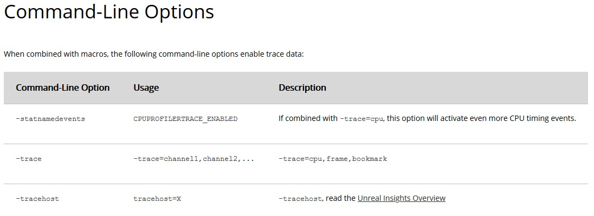

# 使用 Unreal Insights 在设备上进行分析

## 来源与状态

- 原始 URL：https://dev.epicgames.com/community/learning/knowledge-base/WjEy/unreal-engine-profiling-on-device-with-unreal-insights

## 运行时分类

- 类型：图文教程
- 判断：API 未识别到核心视频信号，可整理正文约 5327 字符。

## 摘要

Ryan B 撰写的文章。Unreal Insights 可帮助开发人员识别瓶颈，这在优化性能时非常有用。从较高的层面来看，Unreal Insights 是一个独立的分析系统，集成了……

## 中文整理

### 概览

*文章由 [Ryan B.](https://dev.epicgames.com/community/profile/23wL/RyanBickell) 撰写* [Unreal Insights](https://docs.unrealengine.com/en-US/Engine/Performance/UnrealInsights/Overview/index.html) 帮助开发人员识别瓶颈，这在优化性能时非常有用。从较高层面来看，Unreal Insights 是一个独立的分析系统，它与虚幻引擎集成，用于收集、分析和可视化引擎发出的数据。除了提供对引擎现有系统的强大覆盖之外，Unreal Insights 还可以轻松添加分析数据。最后，该系统具有远程记录数据的功能，最大限度地减少应用程序对项目执行的影响。 Unreal Insight 有两个部分：虚幻引擎运行时中嵌入的跟踪代码和查看器应用程序。两者都是捕获跟踪以分析您的应用程序所必需的。 [Unreal Insights 查看器](https://docs.unrealengine.com/en-US/Engine/Performance/UnrealInsights/Overview/#unrealinsights%E2%80%94viewer) 是一个独立的应用程序，在虚幻编辑器支持的平台（Windows、Mac、Linux）上运行，并且可以轻松地将查看器应用程序连接到 UE 运行时，因为查看器应用程序将自动检测并显示在同一台计算机上运行的 UE 运行时的实例，并且启动 UE 运行时时，可以通过命令行轻松添加其他跟踪选项。当在不同设备上分析 UE 运行时时，存在与网络相关的额外挑战以及某些设备无法接受命令行参数。网络 让不同设备上的两个应用程序通过与应用程序或引擎无关的网络接口进行通信总是存在潜在的挑战。确保设备位于同一网络和子网上并且所需端口处于打开状态超出了本文的范围，但同样必要。这可能需要一些网络知识。如果设备是无线的，则运行查看器应用程序的计算机可能也需要位于无线网络上才能进行通信。命令行参数 [Unreal Insights 参考](https://docs.unrealengine.com/en-US/TestingAndOptimization/PerformanceAndProfiling/UnrealInsights/Reference/index.html) 列出了用于控制跟踪行为的可用命令行参数：

可用的跟踪通道包括：Log、Bookmark、Frame、CPU、GPU、LoadTime、File、Net 您需要以某种方式在命令行上传递这些参数，但某些设备不支持命令行参数。为了解决这个问题，UE 有一个文本文件（对于 UE4，称为 UE4Commandline.txt），您可以直接向其中添加命令行参数。 UE4 将尽早加载它并以与任何命令行参数相同的方式对待它。如果项目的默认设置是将所有文件合并到一个 .pak 文件中，则该文件位于 .pak 文件内。该文件可能又位于特定于平台的应用程序包中，例如 Android 的 .apk 或 PS4 的 .self 等。对于使用 .pak 文件的应用程序，您可能必须使用 UnrealPak.exe（Binaries 文件夹中的命令行工具）将其提取，进行更改，然后使用相同的工具将其重新压缩到 pak 中。或者，您可以在“项目设置”>“打包设置”部分中将项目的打包设置更改为不使用 pak 文件，但并非所有平台都支持松散文件，即使支持，禁用 .pak 文件并使用松散文件也可能会导致加载时间变慢，因为通常会产生与所有不同文件句柄相关的不小的开销。如果平台有自己的应用程序包，您将必须研究该平台的工具来提取应用程序文件并将其重新打包到该捆绑包类型中。为了使这更简单，项目启动器在启动设置中有一个名为“其他命令行参数”的字段。这里只需添加上面的trace选项，然后重新打包即可。对于大型应用程序来说，重新打包可能需要很长时间，因为它会运行所有烹饪和打包步骤，因此上述编辑命令行文本文件的手动方法可能更适合节省时间。支持的平台 一般来说，Unreal Insights 在所有平台上都受支持。但目前它在 Engine\Source\Runtime\TraceLog\Public\Trace\Config.h 中按平台启用和禁用。 ​​​​​ #if !define(UE_TRACE_ENABLED) # if !UE_BUILD_SHIPPING && !IS_PROGRAM # if PLATFORM_WINDOWS || PLATFORM_UNIX || PLATFORM_APPLE || PLATFORM_SWITCH || PLATFORM_ANDROID || PLATFORM_HOLOLENS #define UE_TRACE_ENABLED 1 # endif # endif #endif 如果您尝试在新平台上使用 Unreal Insights 并且它似乎不起作用，则可能是该平台从未添加到列表中，因此没有为该平台编译跟踪代码。修复可能就像在此处为平台添加适当的 #define 一样简单，但之前可能尚未针对该平台编译见解，并且可能需要更多工作。
