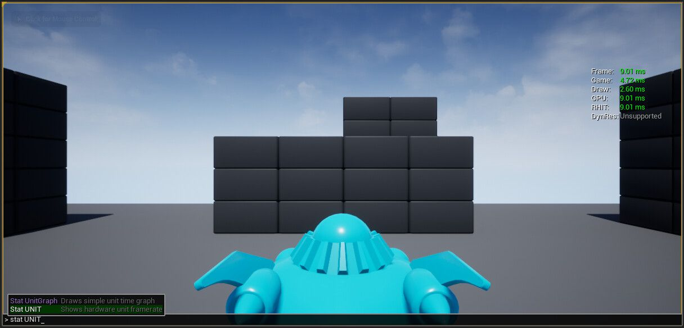
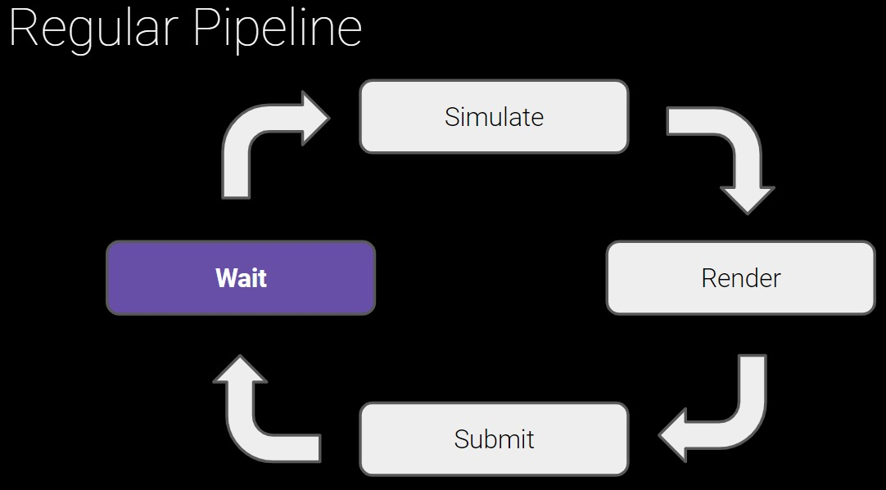
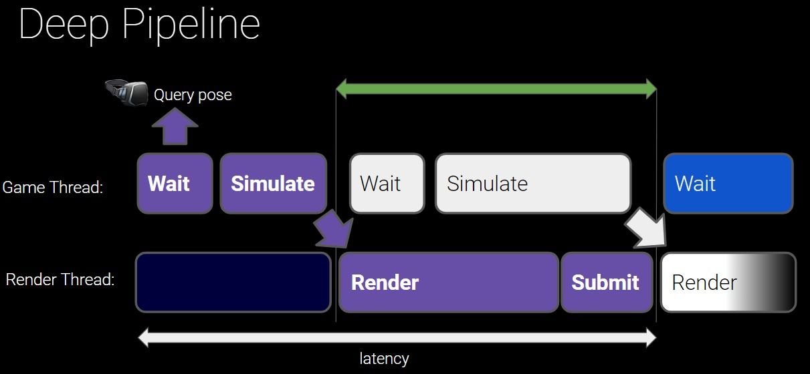
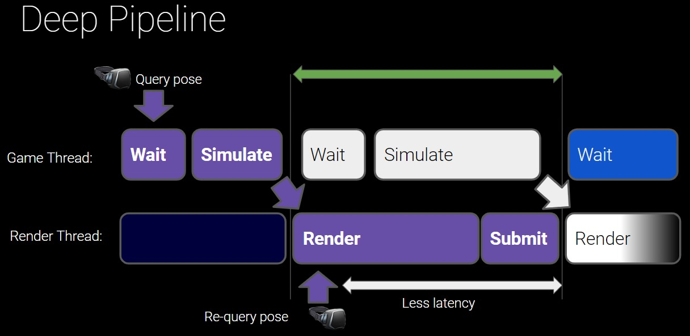

# 使用立体渲染 (XR) 进行分析

## 来源与状态

- 原始 URL：https://dev.epicgames.com/community/learning/tutorials/bOLv/unreal-engine-profiling-with-stereo-rendering-xr

## 运行时分类

- 类型：图文教程
- 判断：API 未识别到核心视频信号，可整理正文约 8175 字符。

## 摘要

使用立体渲染 (XR) 进行分析

## 中文整理

### 使用立体渲染 (XR) 进行分析

文章作者：[Joe C.](https://dev.epicgames.com/community/profile/zZeJ/Joe_Conley) 在许多方面，对使用立体渲染的项目进行分析与对任何实时渲染项目进行分析相同，但有一些领域需要特别注意。

### 有什么相同的？

通常的过程适用于此：找到瓶颈，然后选择适当的分析工具。一般来说，第一步是使用 [stat unit](https://docs.unrealengine.com/en-US/TestingAndOptimization/PerformanceAndProfiling/StatCommands/index.html#unit) 控制台命令查看哪个线程的编号最高：

- **姓名** | **描述** - 框架|帧时间是生成游戏一帧所花费的总时间。由于游戏和绘制线程在完成一帧之前同步，因此帧时间通常接近这些线程之一中显示的时间。 - 游戏|如果帧时间接近游戏时间，则游戏的性能可能会受到游戏线程的瓶颈（负面影响）。 - 画画|如果帧时间接近绘制时间，则游戏的性能可能会受到渲染线程的瓶颈。 - GPU | GPU 时间衡量显卡渲染场景所需的时间。由于 GPU 时间与帧同步，因此它可能与帧时间类似。 - RHIT |通常，RHI 线程时间与帧同步，并且可能与帧时间类似。 - DynRes |如果支持（并启用），[DynRes](https://docs.unrealengine.com/en-US/RenderingAndGraphics/DynamicResolution/index.html) 将按次要屏幕百分比显示主屏幕百分比。 - 当游戏时间较长时，应使用采样 CPU 分析器，例如 [Unreal Insights](https://docs.unrealengine.com/en-US/Engine/Performance/UnrealInsights/index.html)。 - 当 GPU 时间较高时，通常适用传统的 [GPU Profiling](https://docs.unrealengine.com/en-US/TestingAndOptimization/PerformanceAndProfiling/GPU/index.html) 方法。 - 当绘制时间较长时，可能需要减少绘制调用计数。请参阅 [资产减少工具和优化技巧](https://cdn2.unrealengine.com/Unreal+Engine%2FUnreal-Fest-Europe---Asset-Reduction---Load-time-and-Garbage-Collection-optimization-3f4b97d452d4ea0656206d36f21af35d1aad1a36.zip) 演示文稿[unrealengine.com/resources](https://www.unrealengine.com/en-US/resources) 了解如何使用 [Actor 合并工具](https://docs.unrealengine.com/en-US/Basics/Actors/Merging/index.html) 和 [HLODs](https://docs.unrealengine.com/en-US/BuildingWorlds/HLOD/index.html) 合并静态网格体来解决此问题。

### 构建配置

与往常一样，在进行分析时，分析“测试”[构建配置](https://docs.unrealengine.com/en-US/ProductionPipelines/DevelopmentSetup/BuildConfigurations/index.html)非常重要。这是最接近的性能选项，代表了项目的最终发布版本，但仍然具有一些有限的调试和分析功能。

### 垂直同步

当尝试分析 GPU 时，垂直同步通常会出现问题，应始终禁用。它可以在任意位置插入等待时间，并且在查找最慢代码的位置时通常会产生误导。这也意味着稍微错过目标帧时间将导致帧速率减半，以确保不存在垂直撕裂。这通常被误解为一个巨大的性能问题，而实际上，这只是一个微小的变化，将帧速率推向垂直同步悬崖，并且可能可以通过一些分析和有针对性的项目端优化轻松解决。

### 有什么不同？

### 作曲家

利用立体渲染的头戴式显示系统通常具有合成器。合成器获取由应用程序（在本例中为虚幻引擎）渲染的最终帧，并应用与耳机中的光学镜头相反的畸变，以使图像看起来正确。合成器可以选择执行一些额外的工作，通过插入插值帧以及其他任务来平滑帧停顿或低帧速率。这些任务需要时间。合成器花费 1 毫秒来完成这项工作的情况并不少见，这意味着应用程序使用的每帧时间减少了一毫秒。在为项目制定框架时间预算时必须考虑到这一点。与往常一样，平均帧时间应低于 1 秒除以帧数（合成器减去 1），以解决偶尔出现的问题。或者，可以使用 d[动态分辨率](https://docs.unrealengine.com/en-US/RenderingAndGraphics/DynamicResolution/index.html) 来降低分辨率以满足繁重场景中的帧时间预算，或者在可用时使用完整的 GPU 时间。

### 合成器强制启用垂直同步

上面提到的垂直同步问题也适用于非立体渲染，但对于立体渲染，这些问题会因为更高分辨率和每只眼睛渲染一次而加剧。此外，大多数合成器强制垂直同步始终处于打开状态。这意味着无法确保耳机中的 GPU 计时准确。虚幻引擎中的解决方案：使用 -emulatestereo 命令行参数启动，以在不涉及合成器的情况下对显示器屏幕执行立体渲染，从而允许禁用 VSync。

### 延迟

虽然延迟并不是严格意义上的性能问题，但对于舒适的 XR 体验而言，延迟非常重要。一个简单的管道只会依次模拟当前帧，然后渲染它。

尽管在这种简单的方法中，由于渲染需要等待模拟完成，所以我们的预算相当紧张，因为我们需要在 11 毫秒内完成所有操作。相反，我们可以让模拟稍微先于渲染运行。在虚幻中，它在“游戏线程”上运行。在下一帧的模拟之前，等待发生在该游戏线程上。渲染和提交发生在单独的线程（“渲染线程”）上。

但是，如果我们天真地在模拟开始时查询帖子并使用相同的姿势进行渲染，头戴式显示器可能会感觉“滞后”或缓慢，因为现在查询设备位置和显示结果帧之间可能有两帧时间。这个问题可以简单地通过在渲染之前再次查询姿势并使用更新后的姿势来计算渲染变换来解决。

有一些布尔值可以控制这种行为。场景中用于 HMD 视图的摄像机需要启用“锁定到 HMD”。禁用此功能将禁用延迟更新并增加延迟。运动控制器还有一个“延迟更新”复选框。如果应用程序感觉尽管达到了目标帧速率，但其响应速度却没有达到预期，则值得检查以确保启用这些后期更新标志。

### 其他时间考虑因素

除了垂直同步之外，立体渲染头戴式显示器还有其他考虑因素，这些因素使得一致的时序变得更加重要，并且更容易出现故障。渲染高度依赖于头戴式显示器和任何其他跟踪设备（如运动控制器）运动的准确、及时的跟踪信息（程度较小）。由于轮询 HMD 的跟踪位置数据并根据该位置数据渲染帧需要快速连续发生，因此如果渲染线程落后于轮询位置数据的游戏线程太远，游戏线程将等待渲染线程赶上。这意味着如果场景是 GPU 密集型，甚至可能导致 CPU 等待。有时，这可能会被误解为 CPU 上的逻辑速度缓慢（类似于 VSync 有时会被误解为 GPU 逻辑速度缓慢）。此外，由于 GPU 对 CPU 的时序相互依赖性，反之亦然，并且因为 CPU 可能正在处理下一帧，而 GPU 正在渲染最后一帧，所以一帧的减慢可能会导致一连串的等待，从而需要多个帧才能恢复，因此当第 3 帧从第 1 帧减慢开始时，很难追踪第 3 帧减慢的原因，等等。
